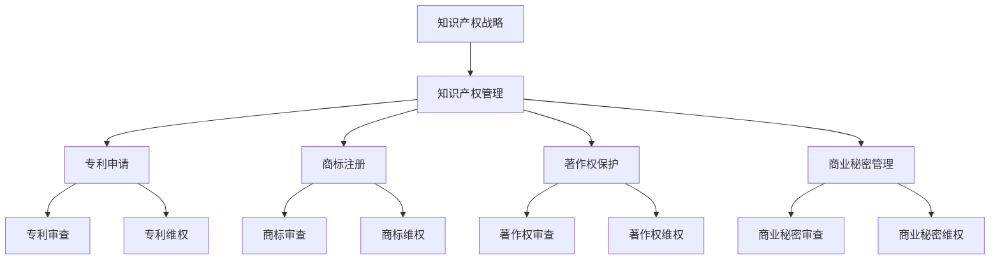

                 

# 创业路上的知识产权保护：如何建立全面的知识产权管理体系

> 关键词：知识产权保护、创业、知识产权管理体系、知识产权战略、法律咨询、专利申请

> 摘要：随着创业浪潮的不断推进，保护知识产权已经成为企业持续发展的关键因素。本文将探讨创业公司在知识产权保护方面面临的挑战，并提供一系列构建全面知识产权管理体系的策略和实践指南，以帮助企业应对法律风险，确保核心竞争力。

## 1. 背景介绍

### 1.1 目的和范围

本文旨在为创业公司提供一套系统化的知识产权管理体系构建指南。我们将分析创业公司在知识产权保护过程中可能遇到的挑战，介绍知识产权管理的基本概念和原则，提供具体的操作步骤和工具资源，旨在帮助企业建立完善的知识产权保护体系。

### 1.2 预期读者

本文适合以下读者群体：
- 创业公司创始人、CEO及高级管理层；
- 企业知识产权部门主管和知识产权顾问；
- 法律咨询专业人士；
- 涉及知识产权保护相关的研发和技术人员。

### 1.3 文档结构概述

本文结构分为十个部分：
1. 背景介绍
2. 核心概念与联系
3. 核心算法原理 & 具体操作步骤
4. 数学模型和公式 & 详细讲解 & 举例说明
5. 项目实战：代码实际案例和详细解释说明
6. 实际应用场景
7. 工具和资源推荐
8. 总结：未来发展趋势与挑战
9. 附录：常见问题与解答
10. 扩展阅读 & 参考资料

### 1.4 术语表

#### 1.4.1 核心术语定义

- 知识产权（Intellectual Property，IP）：指由人类智慧创造的成果，包括专利、商标、著作权、商业秘密等。
- 专利（Patent）：指通过国家知识产权局审查并授权的，保护发明创造的权益的法律文件。
- 商标（Trademark）：指用于区分商品或服务来源的标志。
- 著作权（Copyright）：指对文学、艺术和科学作品的创作者所享有的权利。
- 商业秘密（Trade Secret）：指不为公众所知悉，具有商业价值的信息。

#### 1.4.2 相关概念解释

- 知识产权战略：指企业为了实现长期发展目标，对知识产权的获取、运用、保护和管理进行规划和实施的一系列策略。
- 知识产权保护体系：指企业建立的一套包括法律、管理、技术和运营等多方面的制度，旨在全面保护企业的知识产权。

#### 1.4.3 缩略词列表

- IP：知识产权
- Patent：专利
- Trademark：商标
- Copyright：著作权
- Trade Secret：商业秘密
- IPO：知识产权局

## 2. 核心概念与联系

### Mermaid 流程图



### 核心概念原理

知识产权战略是企业为了实现长期发展目标，对知识产权的获取、运用、保护和管理进行规划和实施的一系列策略。它包括以下关键环节：

1. **专利申请**：通过国家知识产权局审查并授权，保护发明创造的权益。
2. **商标注册**：用于区分商品或服务来源的标志。
3. **著作权保护**：对文学、艺术和科学作品的创作者所享有的权利。
4. **商业秘密管理**：保护不为公众所知悉，具有商业价值的信息。

知识产权管理包括以下步骤：

1. **专利管理**：包括专利申请、专利审查、专利维权等。
2. **商标管理**：包括商标注册、商标审查、商标维权等。
3. **著作权管理**：包括著作权审查、著作权维权等。
4. **商业秘密管理**：包括商业秘密审查、商业秘密维权等。

### 架构说明

知识产权管理体系是企业整体战略的重要组成部分，通过整合法律、管理、技术和运营等多方面资源，形成一套完整的保护体系。具体架构如下：

1. **法律保护层**：包括专利、商标、著作权、商业秘密等法律手段。
2. **管理保障层**：包括知识产权战略、管理流程、内部培训等管理手段。
3. **技术防御层**：包括加密技术、信息安全、技术监测等防御手段。
4. **运营支持层**：包括知识产权运营、市场分析、竞争情报等运营手段。

## 3. 核心算法原理 & 具体操作步骤

### 3.1 知识产权战略制定

#### 算法原理

知识产权战略的制定是建立在企业核心竞争力和发展目标基础上的，其核心算法可以概括为以下几个步骤：

1. **市场分析**：分析市场需求、行业趋势和竞争对手的知识产权布局。
2. **内部评估**：评估企业自身的研发能力、技术水平和潜在知识产权价值。
3. **目标设定**：根据市场分析和内部评估，设定知识产权保护的具体目标和优先级。
4. **资源整合**：整合企业内外部资源，为知识产权战略的实施提供支持。

#### 具体操作步骤

1. **市场分析**：
    ```mermaid
    graph TD
        A[市场分析] --> B[市场需求]
        B --> C[行业趋势]
        B --> D[竞争对手]
        A --> E[数据分析]
    ```

2. **内部评估**：
    ```mermaid
    graph TD
        A[内部评估] --> B[研发能力]
        B --> C[技术水平]
        B --> D[知识产权价值]
        A --> E[资源评估]
    ```

3. **目标设定**：
    ```mermaid
    graph TD
        A[目标设定] --> B[保护范围]
        B --> C[保护期限]
        B --> D[保护强度]
        A --> E[优先级排序]
    ```

4. **资源整合**：
    ```mermaid
    graph TD
        A[资源整合] --> B[内部资源]
        B --> C[外部资源]
        A --> D[资源协调]
    ```

### 3.2 知识产权保护操作

#### 算法原理

知识产权保护操作涉及专利申请、商标注册、著作权保护和商业秘密管理等，其核心算法包括以下几个方面：

1. **信息收集**：收集相关领域的知识产权信息，包括专利、商标、著作权和商业秘密等。
2. **风险评估**：评估企业在知识产权方面可能面临的风险，包括侵权风险、维权风险等。
3. **保护策略**：根据风险评估结果，制定相应的知识产权保护策略。
4. **执行监控**：执行知识产权保护策略，并持续监控知识产权的执行效果。

#### 具体操作步骤

1. **信息收集**：
    ```mermaid
    graph TD
        A[信息收集] --> B[专利信息]
        B --> C[商标信息]
        B --> D[著作权信息]
        B --> E[商业秘密信息]
    ```

2. **风险评估**：
    ```mermaid
    graph TD
        A[风险评估] --> B[侵权风险]
        B --> C[维权风险]
        A --> D[法律风险]
    ```

3. **保护策略**：
    ```mermaid
    graph TD
        A[保护策略] --> B[专利策略]
        B --> C[商标策略]
        B --> D[著作权策略]
        B --> E[商业秘密策略]
    ```

4. **执行监控**：
    ```mermaid
    graph TD
        A[执行监控] --> B[专利监控]
        B --> C[商标监控]
        B --> D[著作权监控]
        B --> E[商业秘密监控]
    ```

## 4. 数学模型和公式 & 详细讲解 & 举例说明

### 4.1 知识产权价值评估模型

#### 数学模型

知识产权价值评估模型基于以下几个核心变量：

- \(V = f(A, P, C, R, T)\)

其中：
- \(V\)：知识产权价值
- \(A\)：资产状况
- \(P\)：盈利能力
- \(C\)：成本
- \(R\)：风险
- \(T\)：时间

#### 公式详解

1. **资产状况（A）**：
   \[ A = \sum_{i=1}^{n} (S_i \cdot W_i) \]

   其中：
   - \(S_i\)：第 \(i\) 项资产的价值
   - \(W_i\)：第 \(i\) 项资产的权重

2. **盈利能力（P）**：
   \[ P = \frac{Earnings}{Investment} \]

   其中：
   - \(Earnings\)：预期收益
   - \(Investment\)：投资额

3. **成本（C）**：
   \[ C = \sum_{i=1}^{m} (C_i \cdot F_i) \]

   其中：
   - \(C_i\)：第 \(i\) 项成本
   - \(F_i\)：第 \(i\) 项成本的影响因素

4. **风险（R）**：
   \[ R = \frac{Var}{\mu} \]

   其中：
   - \(Var\)：收益的方差
   - \(\mu\)：收益的均值

5. **时间（T）**：
   \[ T = \ln(\frac{1}{1 - \frac{C}{P}}) \]

   其中：
   - \(C\)：成本
   - \(P\)：盈利能力

#### 举例说明

假设一家创业公司研发了一款新型智能手表，其知识产权价值可以通过以下公式计算：

1. **资产状况（A）**：
   \[ A = (500,000 \cdot 0.6) + (300,000 \cdot 0.4) = 600,000 \]

2. **盈利能力（P）**：
   \[ P = \frac{200,000}{500,000} = 0.4 \]

3. **成本（C）**：
   \[ C = (100,000 \cdot 0.8) + (50,000 \cdot 0.2) = 120,000 \]

4. **风险（R）**：
   \[ R = \frac{50,000}{150,000} = 0.333 \]

5. **时间（T）**：
   \[ T = \ln(\frac{1}{1 - \frac{120,000}{200,000}}) = 0.5108 \]

将上述变量代入知识产权价值评估模型：

\[ V = f(A, P, C, R, T) = f(600,000, 0.4, 120,000, 0.333, 0.5108) \approx 1,538,268 \]

因此，这款新型智能手表的知识产权价值约为 1,538,268 单位。

## 5. 项目实战：代码实际案例和详细解释说明

### 5.1 开发环境搭建

为了进行知识产权管理系统的实际操作，我们需要搭建一个开发环境。以下是一个基本的开发环境搭建指南：

1. **操作系统**：选择一个稳定的操作系统，如 Ubuntu 20.04。
2. **编程语言**：选择一种适合的编程语言，如 Python 3.8。
3. **开发工具**：安装代码编辑器（如 Visual Studio Code）和 Python 解释器。
4. **数据库**：安装一个关系型数据库（如 MySQL）用于存储知识产权信息。

### 5.2 源代码详细实现和代码解读

#### 5.2.1 源代码实现

以下是一个简单的 Python 代码示例，用于管理专利信息：

```python
import pymysql
from pymysql.constants import CLIENT

# 连接数据库
def connect_db():
    connection = pymysql.connect(
        host='localhost',
        user='root',
        password='password',
        database='intellectual_property',
        client_flag=CLIENT.MULTI_STATEMENTS
    )
    return connection

# 添加专利信息
def add_patent(paten_name, patent_number, description):
    connection = connect_db()
    cursor = connection.cursor()
    sql = "INSERT INTO patents (name, number, description) VALUES (%s, %s, %s)"
    cursor.execute(sql, (paten_name, patent_number, description))
    connection.commit()
    cursor.close()
    connection.close()

# 查询专利信息
def search_patent(paten_name):
    connection = connect_db()
    cursor = connection.cursor()
    sql = "SELECT * FROM patents WHERE name = %s"
    cursor.execute(sql, (paten_name,))
    results = cursor.fetchall()
    cursor.close()
    connection.close()
    return results

# 删除专利信息
def delete_patent(paten_name):
    connection = connect_db()
    cursor = connection.cursor()
    sql = "DELETE FROM patents WHERE name = %s"
    cursor.execute(sql, (paten_name,))
    connection.commit()
    cursor.close()
    connection.close()

# 更新专利信息
def update_patent(paten_name, new_description):
    connection = connect_db()
    cursor = connection.cursor()
    sql = "UPDATE patents SET description = %s WHERE name = %s"
    cursor.execute(sql, (new_description, paten_name))
    connection.commit()
    cursor.close()
    connection.close()

# 主函数
def main():
    add_patent('智能手表专利', '123456', '一款新型智能手表的设计与实现')
    print(search_patent('智能手表专利'))
    delete_patent('智能手表专利')
    update_patent('智能手表专利', '一款新型智能手表的设计与实现，包括功能升级')

if __name__ == '__main__':
    main()
```

#### 5.2.2 代码解读与分析

1. **连接数据库**：
   - 使用 pymysql 模块连接到 MySQL 数据库。
   - 设置 `CLIENT.MULTI_STATEMENTS` 参数，允许执行多个 SQL 语句。

2. **添加专利信息**：
   - `add_patent` 函数用于向数据库中插入专利信息。
   - 使用 `cursor.execute()` 执行 SQL 插入语句，并使用 `commit()` 提交事务。

3. **查询专利信息**：
   - `search_patent` 函数用于根据专利名称查询数据库中的专利信息。
   - 使用 `cursor.fetchall()` 获取查询结果。

4. **删除专利信息**：
   - `delete_patent` 函数用于根据专利名称删除数据库中的专利信息。
   - 使用 `cursor.execute()` 执行 SQL 删除语句，并使用 `commit()` 提交事务。

5. **更新专利信息**：
   - `update_patent` 函数用于根据专利名称更新数据库中的专利信息。
   - 使用 `cursor.execute()` 执行 SQL 更新语句，并使用 `commit()` 提交事务。

6. **主函数**：
   - `main()` 函数用于执行专利信息的增删改查操作。
   - 调用上述四个函数，实现专利信息的全生命周期管理。

通过这个简单的代码示例，我们可以看到如何使用 Python 和 MySQL 数据库来管理知识产权信息。实际项目中，可以根据需要扩展更多的功能和操作。

## 6. 实际应用场景

### 6.1 创业公司专利布局

创业公司在进行专利布局时，需要考虑以下几个关键因素：

1. **行业特点**：根据公司的业务领域，选择具有市场竞争力的技术方向进行专利布局。
2. **竞争对手**：分析竞争对手的专利布局，找到市场空白和机会点。
3. **技术路线**：确定公司的技术路线和研发方向，确保专利布局与公司发展战略一致。
4. **成本控制**：合理分配专利预算，优先保护核心技术和创新点。

案例：一家智能穿戴设备公司，在研发智能手表时，进行了以下专利布局：

- **核心技术专利**：申请了关于智能手表传感器技术、数据传输技术和人机交互技术的专利。
- **外围专利**：申请了外观设计和商标专利，以保护产品的外观和品牌形象。
- **专利池策略**：构建了一个涵盖硬件、软件和服务的专利池，形成市场竞争壁垒。

### 6.2 商业秘密保护

商业秘密是企业核心竞争力的重要组成部分，以下是一些保护商业秘密的实际案例：

1. **信息安全**：通过防火墙、加密技术、访问控制等手段保护企业信息系统的安全性。
2. **合同管理**：与员工和合作伙伴签订保密协议，明确保密条款和责任。
3. **内部培训**：定期开展商业秘密保护培训，提高员工保密意识。
4. **法律保护**：聘请专业律师团队，及时应对商业秘密侵权案件。

案例：一家生物制药公司，为了保护其核心研发配方，采取了以下措施：

- **信息隔离**：将研发数据存储在独立的服务器上，并使用加密技术进行保护。
- **合同约束**：与研发人员签订保密协议，约定竞业禁止条款。
- **法律维权**：在发现竞争对手侵权时，及时提起诉讼，维护公司权益。

### 6.3 知识产权维权

知识产权维权是企业保护自身合法权益的重要手段，以下是一些维权案例：

1. **侵权监测**：建立知识产权监测机制，及时发现侵权行为。
2. **法律诉讼**：针对侵权行为，及时提起诉讼，争取法律支持。
3. **调解仲裁**：通过调解、仲裁等非诉讼手段解决知识产权纠纷。
4. **国际合作**：参与国际知识产权保护组织，与国际同行合作维权。

案例：一家电子科技公司，在发现竞争对手侵犯其专利权后，采取了以下措施：

- **侵权监测**：定期进行市场调查，发现侵权产品。
- **法律诉讼**：向法院提起侵权诉讼，要求停止侵权行为并赔偿损失。
- **调解仲裁**：在诉讼过程中，通过调解达成和解，降低诉讼成本。
- **国际合作**：加入国际知识产权组织，与国际同行分享维权经验。

## 7. 工具和资源推荐

### 7.1 学习资源推荐

#### 7.1.1 书籍推荐

1. 《知识产权管理：战略、流程与实务》
2. 《知识产权法教程》
3. 《企业知识产权战略》

#### 7.1.2 在线课程

1. 网易云课堂 - 《知识产权基础与实务》
2. 慕课网 - 《知识产权保护与维权实战》
3. Coursera - 《Intellectual Property Law》

#### 7.1.3 技术博客和网站

1. 中国知识产权网
2. 知识产权那点事
3. 知产力

### 7.2 开发工具框架推荐

#### 7.2.1 IDE和编辑器

1. Visual Studio Code
2. PyCharm
3. IntelliJ IDEA

#### 7.2.2 调试和性能分析工具

1. PyCharm Profiler
2. VisualVM
3. JMeter

#### 7.2.3 相关框架和库

1. Flask
2. Django
3. pymysql

### 7.3 相关论文著作推荐

#### 7.3.1 经典论文

1. 《知识产权战略：企业竞争优势的新视角》
2. 《商业秘密保护的法律机制研究》
3. 《知识产权国际保护机制研究》

#### 7.3.2 最新研究成果

1. 《人工智能时代知识产权保护的新挑战》
2. 《区块链技术在知识产权保护中的应用研究》
3. 《绿色知识产权保护法律机制研究》

#### 7.3.3 应用案例分析

1. 《华为知识产权战略及实践》
2. 《阿里巴巴知识产权保护案例分析》
3. 《小米知识产权管理实践与启示》

## 8. 总结：未来发展趋势与挑战

### 8.1 发展趋势

1. **技术创新**：随着人工智能、区块链等新兴技术的快速发展，知识产权保护领域将迎来新的技术挑战和机遇。
2. **国际化**：全球范围内的知识产权保护合作将不断加深，跨国公司的知识产权战略将更加重要。
3. **数据驱动**：大数据和人工智能技术将助力知识产权管理和保护，提高知识产权价值评估和侵权监测的准确性。
4. **绿色知识产权**：随着可持续发展理念的提升，绿色知识产权将成为企业竞争的新领域。

### 8.2 挑战

1. **法律挑战**：知识产权法律法规的不断完善和更新，对企业知识产权管理提出了更高的要求。
2. **技术挑战**：新兴技术的应用带来新的知识产权问题，如区块链技术中的知识产权归属和保护等。
3. **成本挑战**：知识产权保护和维权的成本较高，中小企业在知识产权管理方面面临较大压力。
4. **人才挑战**：知识产权专业人才的短缺，将影响企业知识产权管理和保护的效果。

## 9. 附录：常见问题与解答

### 9.1 常见问题

1. **如何保护公司的商业秘密？**
   - **答案**：通过签订保密协议、实施信息安全措施、培训员工保密意识等手段来保护商业秘密。

2. **专利申请需要满足哪些条件？**
   - **答案**：专利申请需要满足新颖性、创造性和实用性的要求，同时需要符合相关法律法规的规定。

3. **如何进行知识产权风险评估？**
   - **答案**：通过市场分析、竞争对手分析、技术分析等手段进行知识产权风险评估。

4. **如何进行知识产权维权？**
   - **答案**：通过法律诉讼、调解、仲裁等手段进行知识产权维权。

### 9.2 解答

1. **如何保护公司的商业秘密？**
   - **解答**：首先，公司应该与员工签订保密协议，明确保密内容和责任。其次，实施严格的信息安全措施，如防火墙、加密技术和访问控制等。此外，定期开展商业秘密保护培训，提高员工的保密意识。

2. **专利申请需要满足哪些条件？**
   - **解答**：专利申请需要满足以下条件：
     - 新颖性：发明或者实用新型不属于现有技术；
     - 创造性：发明或者实用新型具有突出的实质性特点和显著的进步；
     - 实用性：发明或者实用新型能够制造或者使用，并且能够产生积极效果。
   - 同时，专利申请还需要符合《专利法》和相关法律法规的规定。

3. **如何进行知识产权风险评估？**
   - **解答**：进行知识产权风险评估的步骤如下：
     - 市场分析：分析市场需求、行业趋势和竞争对手的知识产权布局；
     - 竞争对手分析：评估竞争对手的知识产权实力和策略；
     - 技术分析：评估自身技术水平和创新能力；
     - 风险识别：识别可能面临的风险，如侵权风险、维权风险等；
     - 风险评估：对识别的风险进行定量或定性的评估，确定风险的优先级。

4. **如何进行知识产权维权？**
   - **解答**：进行知识产权维权的步骤如下：
     - 侵权监测：建立侵权监测机制，及时发现侵权行为；
     - 法律咨询：咨询专业律师，评估维权策略；
     - 诉讼维权：向法院提起侵权诉讼，要求停止侵权行为并赔偿损失；
     - 调解仲裁：通过调解、仲裁等非诉讼手段解决知识产权纠纷。

## 10. 扩展阅读 & 参考资料

### 10.1 扩展阅读

1. 陈学文.《知识产权管理：战略、流程与实务》[M]. 北京：清华大学出版社，2018.
2. 刘德权.《知识产权法教程》[M]. 北京：中国人民大学出版社，2017.
3. 赵慈文.《企业知识产权战略》[M]. 北京：中国知识产权出版社，2019.

### 10.2 参考资料

1. 中华人民共和国国家知识产权局. 《专利法》.
2. 中华人民共和国国家知识产权局. 《商标法》.
3. 中华人民共和国国家知识产权局. 《著作权法》.
4. United Nations Office of the High Commissioner for Human Rights. "Intellectual Property Rights and Human Rights."
5. World Intellectual Property Organization. "Intellectual Property Policy and Management Guidelines for Small and Medium-sized Enterprises."

