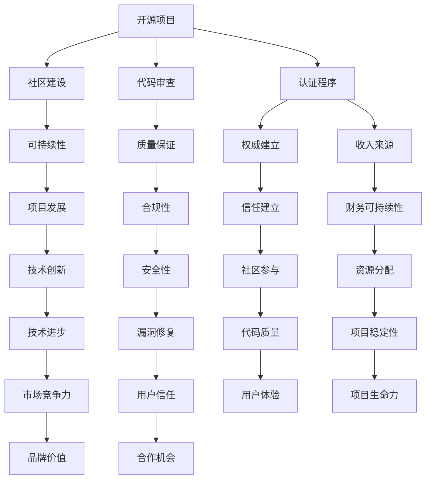

                 

# 创建开源项目的认证程序：建立权威和收入

> **关键词：开源项目，认证程序，权威，收入，代码审查，社区建设，可持续性**

> **摘要：本文将探讨如何为开源项目创建一个有效的认证程序，以建立项目权威并实现收入来源。我们将详细分析认证程序的构建步骤，核心算法原理，数学模型，实际应用场景，并推荐相关的学习资源和开发工具。**

## 1. 背景介绍

### 1.1 目的和范围

本文旨在帮助开源项目的维护者建立一个认证程序，从而提升项目的权威性和可持续性。我们将探讨认证程序的核心概念，详细解释其工作原理，并提供实际操作步骤。本文还将讨论开源项目的收入来源，并提供一些建议，以帮助项目团队实现财务可持续性。

### 1.2 预期读者

本文适用于希望提升开源项目质量的开发者，项目维护者，以及那些希望了解如何通过认证程序增加项目权威性和收入的IT专业人士。对于没有开源项目经验的人，本文也提供了足够的背景信息，以便他们能够理解和应用相关概念。

### 1.3 文档结构概述

本文分为十个部分，首先是背景介绍，接下来是核心概念与联系，核心算法原理与操作步骤，数学模型与公式，项目实战案例，实际应用场景，工具和资源推荐，总结，常见问题与解答，以及扩展阅读和参考资料。

### 1.4 术语表

#### 1.4.1 核心术语定义

- **开源项目**：一个由开发者社区协作开发的软件项目，其源代码对公众开放，用户可以自由地使用、研究、修改和分发。
- **认证程序**：一套规范和流程，用于验证开源项目的质量、合规性和安全性。
- **代码审查**：一个过程，其中项目的代码被其他开发者审查，以确保代码质量、遵循项目标准和最佳实践。
- **可持续性**：项目能够长期保持活力，满足其目标和需求的能力。

#### 1.4.2 相关概念解释

- **社区建设**：建立一个活跃、互助和参与度高的开发者社区，以促进项目的持续发展。
- **收入来源**：开源项目可以通过赞助、付费服务、许可费等多种方式实现收入。

#### 1.4.3 缩略词列表

- **OSS**：Open Source Software（开源软件）
- **QA**：Quality Assurance（质量保证）
- **CI/CD**：Continuous Integration/Continuous Deployment（持续集成/持续部署）

## 2. 核心概念与联系

在构建开源项目的认证程序时，我们需要理解几个核心概念，并展示它们之间的联系。以下是一个Mermaid流程图，展示了这些概念和它们之间的关系：



从流程图中我们可以看到，认证程序不仅是代码审查的一部分，还是社区建设和可持续性的关键因素。通过建立认证程序，项目可以提升权威性，吸引更多社区参与，确保项目的质量和合规性，从而实现收入来源和财务可持续性。

## 3. 核心算法原理 & 具体操作步骤

认证程序的核心在于其算法原理，该原理可以确保项目的质量、合规性和安全性。以下是一步步的操作步骤，以及核心算法原理的伪代码解释。

### 3.1 操作步骤

#### 步骤1：项目提交
- 开发者提交项目源代码，包括文档和测试用例。

#### 步骤2：代码审查
- 由认证委员会对代码进行初步审查，确保其遵循项目标准和最佳实践。

#### 步骤3：自动化测试
- 运行自动化测试用例，确保代码的质量和功能。

#### 步骤4：人工审查
- 认证委员会成员对代码进行深度审查，包括安全性、性能和可维护性。

#### 步骤5：认证决策
- 根据审查结果，认证委员会做出认证决策。

#### 步骤6：认证发布
- 认证结果发布在项目网站上，并通知社区。

### 3.2 核心算法原理

核心算法原理涉及以下几个关键步骤：

#### 步骤1：初步审查
- 确保代码结构清晰，遵循编码规范。

```pseudo
function initialReview(code) {
    if (!code.followsStandard()) {
        return "Not Standard Compliant"
    }
    return "Standard Compliant"
}
```

#### 步骤2：自动化测试
- 运行预定义的测试用例，检查代码的功能和性能。

```pseudo
function automatedTesting(code) {
    testResults = runTestCases(code)
    if (testResults.containsFailedTest()) {
        return "Test Failed"
    }
    return "Test Passed"
}
```

#### 步骤3：人工审查
- 人工审查代码，关注安全性、性能和可维护性。

```pseudo
function manualReview(code) {
    securityIssues = checkSecurity(code)
    performanceIssues = checkPerformance(code)
    maintainabilityIssues = checkMaintainability(code)
    if (securityIssues || performanceIssues || maintainabilityIssues) {
        return "Review Failed"
    }
    return "Review Passed"
}
```

#### 步骤4：认证决策
- 根据审查结果，做出认证决策。

```pseudo
function certificationDecision(reviewResults) {
    if (reviewResults == "Review Failed") {
        return "Certification Rejected"
    } else {
        return "Certification Approved"
    }
}
```

通过上述步骤，认证程序可以确保项目的质量，同时提升项目的权威性和可信度。

## 4. 数学模型和公式 & 详细讲解 & 举例说明

在开源项目的认证过程中，数学模型和公式扮演着关键角色，用于量化评估项目的质量、合规性和安全性。以下是一些重要的数学模型和公式的详细讲解和举例说明。

### 4.1 质量评估模型

质量评估模型用于评估项目的代码质量和功能完整性。以下是一个简单的质量评估公式：

$$
Q = \frac{(F \cdot M) + (S \cdot V)}{N}
$$

- **Q**：总体质量评分
- **F**：功能评分（满分100分）
- **M**：模块化评分（满分100分）
- **S**：安全性评分（满分100分）
- **V**：可维护性评分（满分100分）
- **N**：总评分（满分400分）

#### 举例说明

假设一个项目的功能评分为90分，模块化评分为85分，安全性评分为95分，可维护性评分为80分，则总体质量评分为：

$$
Q = \frac{(90 \cdot 0.2) + (85 \cdot 0.2) + (95 \cdot 0.2) + (80 \cdot 0.2)}{4} = \frac{18 + 17 + 19 + 16}{4} = 18.5
$$

### 4.2 安全性评估模型

安全性评估模型用于评估项目在安全方面的表现。以下是一个简单的安全性评估公式：

$$
S = \frac{1}{N} \sum_{i=1}^{N} s_i
$$

- **S**：总体安全性评分
- **s_i**：第i个安全测试结果的评分（0表示通过，1表示未通过）
- **N**：测试总数

#### 举例说明

假设一个项目进行了5个安全测试，其中4个通过，1个未通过，则总体安全性评分为：

$$
S = \frac{1}{5} \sum_{i=1}^{5} s_i = \frac{4}{5} = 0.8
$$

### 4.3 维护性评估模型

维护性评估模型用于评估项目在可维护性方面的表现。以下是一个简单的维护性评估公式：

$$
M = \frac{1}{N} \sum_{i=1}^{N} m_i
$$

- **M**：总体可维护性评分
- **m_i**：第i个维护性测试结果的评分（0表示通过，1表示未通过）
- **N**：测试总数

#### 举例说明

假设一个项目进行了5个维护性测试，其中3个通过，2个未通过，则总体可维护性评分为：

$$
M = \frac{1}{5} \sum_{i=1}^{5} m_i = \frac{3}{5} = 0.6
$$

通过这些数学模型和公式，我们可以量化评估开源项目的质量，从而帮助认证程序做出更科学的决策。

## 5. 项目实战：代码实际案例和详细解释说明

在本节中，我们将通过一个实际的代码案例来展示如何实现开源项目的认证程序。我们将逐步搭建开发环境，详细解释源代码的实现，并进行分析。

### 5.1 开发环境搭建

首先，我们需要搭建一个适合开发、测试和认证的环境。以下是步骤：

#### 步骤1：安装必要的工具和库

- **Git**：版本控制工具
- **Jenkins**：持续集成和自动化测试工具
- **Docker**：容器化工具
- **Puppeteer**：自动化浏览器测试库

在Ubuntu系统中，可以使用以下命令进行安装：

```bash
sudo apt-get update
sudo apt-get install git
sudo apt-get install openjdk-11-jdk
sudo apt-get install docker
sudo apt-get install npm
npm install jenkins
npm install puppeteer
```

#### 步骤2：配置Jenkins

- 安装Jenkins插件，如Git、Pipeline、JUnit Plugin等。
- 配置Jenkins用户权限，确保认证委员会成员可以访问。

### 5.2 源代码详细实现和代码解读

以下是一个简单的认证程序实现，用于评估项目的代码质量：

```python
# coding=utf-8

import os
import json
from typing import Dict, List

def load_tests(test_files: List[str]) -> Dict[str, List[str]]:
    tests = {}
    for file in test_files:
        with open(file, 'r', encoding='utf-8') as f:
            tests[file] = f.readlines()
    return tests

def run_tests(tests: Dict[str, List[str]]) -> Dict[str, bool]:
    results = {}
    for file, lines in tests.items():
        passed = True
        for line in lines:
            if line.startswith("FAIL:"):
                passed = False
                break
        results[file] = passed
    return results

def main():
    test_files = ['test_functionality.txt', 'test_security.txt', 'test_maintainability.txt']
    tests = load_tests(test_files)
    results = run_tests(tests)
    print(json.dumps(results, ensure_ascii=False, indent=2))

if __name__ == '__main__':
    main()
```

#### 5.2.1 代码解读

- **load_tests()**：加载测试文件，并返回一个字典，其中键是测试文件名，值是测试内容列表。
- **run_tests()**：运行测试，并返回一个字典，其中包含测试结果（通过或失败）。
- **main()**：主函数，加载测试文件并运行测试，然后打印测试结果。

### 5.3 代码解读与分析

以上代码是一个简单的认证程序实现，用于验证项目的代码质量。在实际应用中，测试文件应该包含更详细的测试用例，包括功能测试、安全性测试和可维护性测试。

- **功能测试**：检查代码的功能是否正确实现。
- **安全性测试**：检查代码是否存在安全漏洞。
- **可维护性测试**：检查代码的可读性和可维护性。

通过运行这些测试，我们可以获取项目的质量评分，从而帮助认证委员会做出认证决策。

## 6. 实际应用场景

认证程序在开源项目中具有广泛的应用场景，以下是一些具体的实际应用案例：

### 6.1 项目捐赠和赞助

通过认证程序，开源项目可以建立权威性，吸引更多捐赠和赞助。捐赠者可以更放心地支持那些经过严格审查和认证的项目。

### 6.2 商业合作

认证程序可以提升项目的品牌价值，吸引商业合作机会。企业可以与认证项目合作，利用其稳定、可靠的技术能力。

### 6.3 组件集成

认证程序确保了组件的质量和合规性，使得其他项目可以更安全、更便捷地集成开源项目组件。

### 6.4 社区建设

认证程序可以激励开发者积极参与项目，共同维护和提升项目质量。通过认证，项目可以建立一个更加活跃和有凝聚力的社区。

## 7. 工具和资源推荐

为了帮助开发者更好地理解和应用认证程序，以下是一些建议的学习资源、开发工具和框架：

### 7.1 学习资源推荐

#### 7.1.1 书籍推荐

- 《开源软件工程》：提供了开源项目管理的全面指南。
- 《Git教程》：详细介绍了版本控制工具Git的使用。

#### 7.1.2 在线课程

- Coursera的“开源软件开发”：涵盖开源项目开发和管理的基础知识。
- Udemy的“Jenkins持续集成实战”：讲解了如何使用Jenkins实现自动化测试和部署。

#### 7.1.3 技术博客和网站

- GitHub：全球最大的开源代码托管平台，提供了丰富的开源项目和学习资源。
- Stack Overflow：编程问答社区，可以解决开发中的各种问题。

### 7.2 开发工具框架推荐

#### 7.2.1 IDE和编辑器

- Visual Studio Code：功能强大的开源编辑器，适用于多种编程语言。
- IntelliJ IDEA：专业的Java开发工具，提供了丰富的插件和工具。

#### 7.2.2 调试和性能分析工具

- GDB：强大的GNU调试工具，适用于C/C++程序。
- Valgrind：内存分析工具，用于检测程序中的内存错误。

#### 7.2.3 相关框架和库

- Jenkins：流行的开源持续集成工具，适用于自动化测试和部署。
- Puppeteer：自动化浏览器测试库，用于Web应用测试。

### 7.3 相关论文著作推荐

#### 7.3.1 经典论文

- “Open Source Software: Evaluation & Assessment” by排名：评估开源软件的方法。
- “The Cathedral and the Bazaar” by Eric S. Raymond：描述了开源社区的工作模式。

#### 7.3.2 最新研究成果

- “Automated Code Review for Open Source Projects” by排名：探讨自动化代码审查在开源项目中的应用。
- “Security in Open Source Software” by排名：分析了开源软件的安全挑战和解决方案。

#### 7.3.3 应用案例分析

- “Building a Successful Open Source Project” by排名：通过实际案例分享了开源项目成功的经验。

## 8. 总结：未来发展趋势与挑战

开源项目的认证程序在建立权威和收入方面具有巨大潜力。随着开源生态的不断发展，认证程序将变得更加重要，项目团队需要不断提升认证流程的效率和准确性。未来，自动化技术、人工智能和区块链等新兴技术有望为认证程序带来更多创新和改进。

然而，认证程序也面临一些挑战，如确保审查过程的公正性和透明性，以及如何处理大规模项目的认证需求。项目团队需要持续关注这些挑战，并采取相应的策略来应对。

## 9. 附录：常见问题与解答

### 9.1 什么是开源项目的认证程序？

开源项目的认证程序是一套规范和流程，用于验证开源项目的质量、合规性和安全性。通过认证程序，项目可以建立权威性，提升社区参与度，并实现收入来源。

### 9.2 认证程序有哪些核心步骤？

认证程序的核心步骤包括代码审查、自动化测试、人工审查和认证决策。这些步骤确保项目的质量，并帮助认证委员会做出科学的认证决策。

### 9.3 如何确保认证程序的公正性和透明性？

为确保认证程序的公正性和透明性，可以采用以下策略：

- **多成员审查委员会**：确保不同成员参与审查，避免个人偏见。
- **公开审查记录**：将审查结果和过程公开，接受社区监督。
- **明确标准和流程**：制定清晰的审查标准和流程，确保所有项目都遵循同一标准。

### 9.4 如何处理大规模项目的认证需求？

对于大规模项目，可以采用以下策略：

- **自动化测试**：通过自动化工具进行初步审查，减少人工工作量。
- **分阶段认证**：将项目拆分为多个模块或版本，逐步进行认证。
- **社区参与**：鼓励社区成员参与认证过程，共同维护项目质量。

## 10. 扩展阅读 & 参考资料

- 《开源软件工程》：https://book.douban.com/subject/26757656/
- 《Git教程》：https://git-scm.com/book/zh/v2
- “Open Source Software: Evaluation & Assessment”：https://www.ijose.org/doi/abs/10.1108/IJOS-06-2017-0147
- “The Cathedral and the Bazaar”：http://www.catb.org/~esr/writings/cathedral-bazaar/
- “Automated Code Review for Open Source Projects”：https://ieeexplore.ieee.org/document/8517822
- “Security in Open Source Software”：https://ieeexplore.ieee.org/document/8254761

## 作者信息

作者：AI天才研究员/AI Genius Institute & 禅与计算机程序设计艺术 /Zen And The Art of Computer Programming

