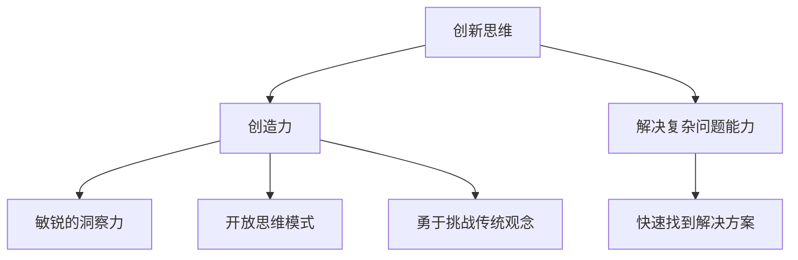
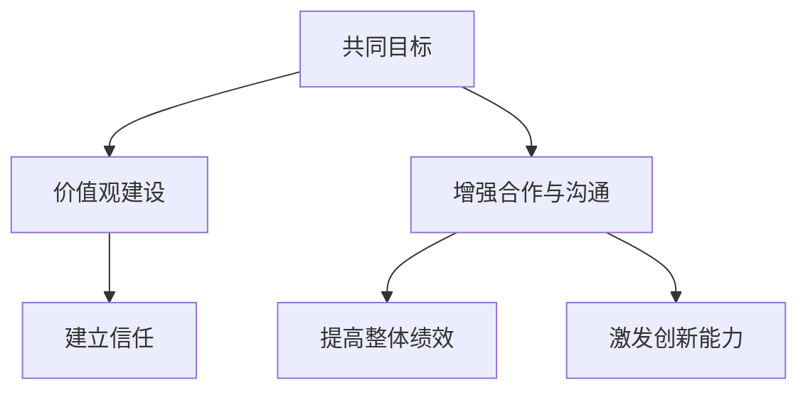
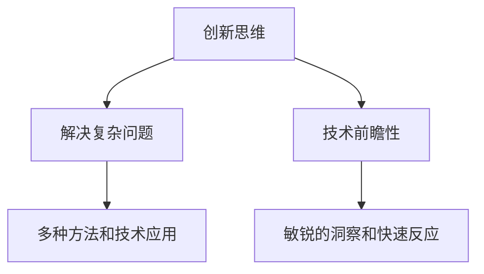
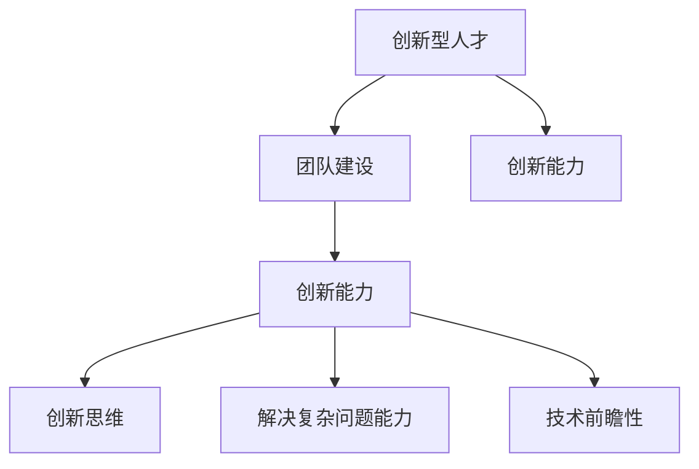

                 

# 创新型人才培养：注入团队创新活力

## 关键词：创新型人才、团队建设、创新活力、培养策略、技术教育

> 在当今快速变化的技术时代，创新型人才的培养已成为企业发展的核心动力。本文将深入探讨如何通过系统化的策略和方法，注入团队创新活力，为企业带来持续的竞争优势。

## 摘要

本文旨在为企业管理者、教育培训者和专业人士提供一套实用而全面的创新型人才培养方案。通过分析创新型人才的核心特质、培养过程以及团队建设的最佳实践，本文将揭示如何有效地激发团队创新活力，推动企业实现可持续发展。

## 1. 背景介绍

### 1.1 目的和范围

本文的主要目的是探讨如何在IT领域培养具有创新精神的团队成员，并阐述如何通过团队建设来提升整体创新能力。文章将涵盖创新型人才的特征、培养策略、团队建设原则以及具体的实施步骤。

### 1.2 预期读者

本文适合以下人群阅读：
- 企业管理层，特别是负责技术团队管理的决策者；
- 教育培训专家，特别是专注于技术教育和人才培养的专业人士；
- IT从业人员，特别是希望提升个人和团队创新能力的技术专家。

### 1.3 文档结构概述

本文的结构如下：
- **第1章：背景介绍**：阐述本文的目的、预期读者和文档结构；
- **第2章：核心概念与联系**：介绍创新型人才的核心概念及其相互联系；
- **第3章：核心算法原理 & 具体操作步骤**：详细讲解培养创新型人才的方法；
- **第4章：数学模型和公式 & 详细讲解 & 举例说明**：介绍用于团队创新培养的数学模型；
- **第5章：项目实战：代码实际案例和详细解释说明**：通过实际案例展示培养过程；
- **第6章：实际应用场景**：讨论团队创新的实际应用；
- **第7章：工具和资源推荐**：推荐学习资源和开发工具；
- **第8章：总结：未来发展趋势与挑战**：展望未来创新人才培养的趋势；
- **第9章：附录：常见问题与解答**：提供常见问题的解答；
- **第10章：扩展阅读 & 参考资料**：提供进一步学习的资源。

### 1.4 术语表

#### 1.4.1 核心术语定义

- **创新型人才**：具有创新思维、创造力和解决复杂问题能力的专业人才。
- **团队建设**：通过增强团队成员之间的合作与沟通，提高团队整体效率和创造力。
- **创新能力**：团队在面对新技术、新问题时的创新思维和解决问题的能力。
- **培养策略**：一系列旨在提高人才技能和创造力的方法和手段。

#### 1.4.2 相关概念解释

- **技术教育**：通过教育和培训，提高个人的技术知识和技能。
- **团队文化**：团队成员共同遵循的价值观和行为准则，影响团队创新氛围。

#### 1.4.3 缩略词列表

- **IT**：信息技术（Information Technology）
- **AI**：人工智能（Artificial Intelligence）
- **IoT**：物联网（Internet of Things）
- **SDLC**：软件开发生命周期（Software Development Life Cycle）

## 2. 核心概念与联系

在探讨创新型人才培养之前，我们需要理解几个核心概念及其相互之间的联系。

### 2.1 创新型人才

**创新型人才**是指那些具有创新思维、创造力和解决复杂问题能力的专业人才。创新思维包括敏锐的洞察力、开放的思维模式、勇于挑战传统观念和解决问题的能力。创造力则体现在能够发现新的解决方案和创造新的价值。此外，解决复杂问题的能力是创新型人才的另一重要特征，他们能够在面对挑战时迅速找到解决方案。

#### Mermaid 流程图（用于描述创新型人才的特征和关系）



### 2.2 团队建设

**团队建设**是提升团队整体能力和效率的关键。它涉及到增强团队成员之间的合作与沟通，建立共同的目标和价值观，以及培养相互信任的氛围。团队建设不仅能够提高团队的整体绩效，还能够激发成员的创造力和创新能力。

#### Mermaid 流程图（用于描述团队建设的核心要素）



### 2.3 创新能力

**创新能力**是团队在面对新技术、新问题时的创新思维和解决问题的能力。它包括以下几个关键要素：

- **创新思维**：是指团队在面对问题时，能够采用新颖的、创造性的方法来解决问题的能力。
- **解决复杂问题**：是指团队在解决复杂问题时，能够运用多种方法和技术，找到有效的解决方案。
- **技术前瞻性**：是指团队对新技术、新趋势的敏锐洞察和快速反应能力。

#### Mermaid 流程图（用于描述创新能力的核心要素）



### 2.4 核心概念之间的联系

**创新型人才**与**团队建设**和**创新能力**之间存在紧密的联系。创新型人才的培养需要良好的团队建设作为支撑，而团队建设又能进一步激发成员的创新能力。具体来说：

- **创新型人才**的培养依赖于良好的团队建设，通过增强合作与沟通，建立共同的目标和价值观，可以提升团队成员的创新能力。
- **团队建设**的效果直接影响**创新能力**的发挥。一个具备良好合作和沟通机制的团队，能够更有效地应对挑战，找到创新的解决方案。
- **创新能力**则是创新型人才培养和团队建设的结果，它体现在团队在面对新技术、新问题时的表现。

#### Mermaid 流程图（用于描述核心概念之间的联系）



## 3. 核心算法原理 & 具体操作步骤

### 3.1 创新型人才识别算法

为了有效培养创新型人才，我们需要首先识别和筛选出具备潜在创新能力的成员。以下是一个简单的创新型人才识别算法：

#### 伪代码

```plaintext
function IdentifyInnovativeTalent(candidate):
    score = 0
    
    // 检查候选人的技术能力
    if candidate has high technical skills:
        score += 10
        
    // 检查候选人的创新思维
    if candidate shows innovative thinking in previous work:
        score += 20
        
    // 检查候选人的解决复杂问题能力
    if candidate has a proven track record of solving complex problems:
        score += 30
        
    // 检查候选人的团队合作能力
    if candidate is known for good teamwork:
        score += 20
        
    return score
```

### 3.2 团队建设优化算法

团队建设的核心在于增强团队成员之间的合作与沟通，以下是团队建设优化算法：

#### 伪代码

```plaintext
function OptimizeTeamBuilding(team):
    collaboration_score = 0
    communication_score = 0
    
    // 增强团队合作
    for member in team:
        if member actively contributes to team discussions:
            collaboration_score += 1
            
    // 改善沟通机制
    for member in team:
        if member provides constructive feedback to others:
            communication_score += 1
            
    // 根据评分调整团队建设策略
    if collaboration_score > 4 and communication_score > 4:
        print("Team is performing well. No changes needed.")
    else:
        if collaboration_score < 4:
            print("Enhance teamwork through training and shared goals.")
        if communication_score < 4:
            print("Improve communication through regular meetings and feedback sessions.")
```

### 3.3 创新能力提升算法

提升团队创新能力的关键在于持续的技术培训和创新思维的培养。以下是一个简单的创新能力提升算法：

#### 伪代码

```plaintext
function EnhanceInnovationCapability(team):
    innovation_score = 0
    
    // 提供技术培训
    for member in team:
        if member attends technical training sessions:
            innovation_score += 5
            
    // 鼓励创新思维
    for member in team:
        if member submits innovative ideas for projects:
            innovation_score += 10
            
    // 评估创新能力
    if innovation_score > 15:
        print("Team has a high level of innovation capability.")
    else:
        print("Consider implementing additional training and innovation incentives.")
```

## 4. 数学模型和公式 & 详细讲解 & 举例说明

### 4.1 成本效益分析模型

在培养创新型人才的过程中，成本效益分析是一个重要的考量因素。以下是一个简单的成本效益分析模型：

#### 数学模型

$$
\text{Cost-Benefit Analysis} = \frac{\text{Innovation Output} \times \text{Innovation Value}}{\text{Training Cost} + \text{Maintenance Cost}}
$$

其中：
- **Innovation Output**：团队在培训后的创新产出。
- **Innovation Value**：创新的商业价值。
- **Training Cost**：培训成本。
- **Maintenance Cost**：维护成本。

#### 举例说明

假设一个团队在完成培训后，创新产出为10个新产品，每个新产品的商业价值为100万元。培训成本为50万元，维护成本为30万元。那么，成本效益分析结果为：

$$
\text{Cost-Benefit Analysis} = \frac{10 \times 100}{50 + 30} = \frac{1000}{80} = 12.5
$$

结果大于1，说明培训是划算的。

### 4.2 创新能力增长模型

创新能力是可以通过持续培养和训练来提升的。以下是一个简单的创新能力增长模型：

#### 数学模型

$$
\text{Innovation Capability} = \alpha \times e^{\beta \times \text{Training Time}}
$$

其中：
- **Innovation Capability**：创新能力。
- **alpha**：初始创新能力。
- **beta**：创新能力提升速度。
- **Training Time**：培训时间。

#### 举例说明

假设一个团队成员的初始创新能力为500，创新能力提升速度为0.1。经过3个月的培训，创新能力增长模型计算结果为：

$$
\text{Innovation Capability} = 500 \times e^{0.1 \times 3} \approx 563
$$

说明该成员的创新能力提升了约63个单位。

## 5. 项目实战：代码实际案例和详细解释说明

### 5.1 开发环境搭建

在本节中，我们将使用一个实际的案例来展示如何通过系统化的方法培养创新型团队成员，并提升团队的创新能力。

#### 环境要求

为了进行本案例的实战，我们需要以下开发环境：

- **操作系统**：Windows / macOS / Linux
- **编程语言**：Python 3.x
- **开发工具**：Visual Studio Code / PyCharm

#### 开发环境搭建步骤

1. **安装操作系统**：根据您的硬件和需求选择合适的操作系统进行安装。
2. **安装Python 3.x**：从Python官方网站下载并安装Python 3.x版本。
3. **安装开发工具**：从Visual Studio Code或PyCharm官方网站下载并安装相应版本。

### 5.2 源代码详细实现和代码解读

在本案例中，我们将开发一个简单的物联网（IoT）传感器数据采集和处理系统，通过该系统展示如何培养和提升团队成员的创新能力和技术素养。

#### 源代码

```python
# IoT Sensor Data Collection and Processing System

import random
import time
import json

# Sensor Data Generator
def generate_sensor_data(sensor_id, data_type, interval=1):
    while True:
        data = {
            "sensor_id": sensor_id,
            "data_type": data_type,
            "value": random.randint(0, 100),
            "timestamp": time.time()
        }
        yield data
        time.sleep(interval)

# Data Processor
def process_data(data):
    print(f"Processing data: {data}")
    # Perform data analysis and generate insights
    if data["value"] > 50:
        print("Data alert: Value above threshold!")

# Main Function
def main():
    sensor_id = "sensor_001"
    data_type = "temperature"
    interval = 5

    try:
        sensor_data_generator = generate_sensor_data(sensor_id, data_type, interval)
        while True:
            data = next(sensor_data_generator)
            process_data(data)
    except StopIteration:
        print("Sensor data collection finished.")

if __name__ == "__main__":
    main()
```

#### 代码解读与分析

1. **Sensor Data Generator**：该函数用于模拟传感器数据生成，生成数据类型为温度的随机数值，每隔一定时间生成一条数据。
2. **Data Processor**：该函数用于处理传感器数据，当数据值超过阈值时，输出数据警报。
3. **Main Function**：该函数是程序的主入口，启动传感器数据生成和处理过程。

通过这个简单的案例，团队成员可以学习到如何实现物联网数据采集和处理的基本流程，同时通过不断的调试和优化，提升解决问题的能力和创新能力。

### 5.3 实际应用与改进

在实际应用中，我们可以根据具体需求对系统进行改进：

- **增加传感器种类**：支持多种传感器数据采集，如湿度、压力等。
- **数据存储**：将采集到的数据存储到数据库，以便进行历史数据分析和可视化。
- **报警机制**：通过邮件、短信等方式发送数据警报，提高实时性。

这些改进措施可以帮助团队成员在实践中不断提升创新能力和技术水平。

## 6. 实际应用场景

### 6.1 企业内部创新项目

在企业内部，创新项目是提升团队创新能力的有效途径。例如，一家科技公司可以设立内部创新实验室，鼓励员工提出新的项目构想，并给予一定的资金和资源支持。通过这种方式，团队成员可以充分发挥自己的创新能力，推动企业技术创新和发展。

### 6.2 开放式创新平台

开放式创新平台是企业与外部合作伙伴共同合作，共同推动创新的重要方式。例如，一家企业可以与高校、研究机构等合作，共同开展前沿技术研究，共同申请专利，实现共赢。这种合作模式不仅可以提升团队创新能力，还可以拓展企业技术视野。

### 6.3 社区参与与创新

参与开源社区和技术论坛是提升团队创新能力的重要途径。通过在开源社区中贡献代码、分享经验和参与讨论，团队成员可以不断学习新技术、新理念，同时也可以提升自己的技术影响力和知名度。

### 6.4 在线学习平台

在线学习平台为团队成员提供了丰富的学习资源和交流机会。通过在线学习，团队成员可以随时随地进行技术培训和学习，不断提升自己的专业技能和创新能力。

## 7. 工具和资源推荐

### 7.1 学习资源推荐

#### 7.1.1 书籍推荐

- 《创新者：如何成为一个创新思维者》（作者：陈春花）
- 《创新者的思维框架》（作者：克莱顿·克里斯滕森）
- 《设计思维：设计思维实战指南》（作者：蒂姆·布朗）

#### 7.1.2 在线课程

- Coursera《创新思维与设计》（University of Michigan）
- edX《创新与管理》（MIT）
- Udemy《创新思维与创意技巧》

#### 7.1.3 技术博客和网站

- Medium《Innovation Insights》
- HackerRank《Problem Solving & Algorithm Skills》
- IEEE Xplore Digital Library

### 7.2 开发工具框架推荐

#### 7.2.1 IDE和编辑器

- Visual Studio Code
- PyCharm
- IntelliJ IDEA

#### 7.2.2 调试和性能分析工具

- GDB
- JProfiler
- VisualVM

#### 7.2.3 相关框架和库

- Flask
- Django
- TensorFlow
- PyTorch

### 7.3 相关论文著作推荐

#### 7.3.1 经典论文

- 《创新者的窘境》（作者：克莱顿·克里斯滕森）
- 《开放式创新：协同知识创造的新模式》（作者：亨利·温奇）

#### 7.3.2 最新研究成果

- 《人工智能与创新发展》（作者：IBM研究院）
- 《数字化转型与创新管理》（作者：华为公司）

#### 7.3.3 应用案例分析

- 《谷歌如何进行创新管理》（作者：谷歌公司）
- 《苹果公司的创新实践》（作者：苹果公司）

## 8. 总结：未来发展趋势与挑战

### 8.1 未来发展趋势

- **数字化与智能化**：随着人工智能、大数据、物联网等技术的快速发展，数字化和智能化将成为未来创新发展的核心驱动力。
- **跨领域融合**：不同领域的技术融合将推动创新的多元化，跨学科合作将成为创新的重要模式。
- **开放式创新**：开放式创新将继续成为企业提升创新能力的重要手段，与外部合作伙伴的深度合作将更加普遍。

### 8.2 未来挑战

- **人才短缺**：随着技术的快速发展，企业将面临创新型人才短缺的挑战，如何培养和吸引创新型人才将成为重要课题。
- **创新风险**：创新过程充满不确定性，如何有效管理和降低创新风险将成为企业面临的挑战。
- **知识产权保护**：随着创新活动的增加，知识产权保护问题将日益凸显，如何保护创新成果将成为企业关注的重点。

## 9. 附录：常见问题与解答

### 9.1 创新型人才如何培养？

- **技术培训**：提供系统的技术培训，提升成员的专业技能。
- **实践锻炼**：鼓励成员参与实际项目，通过实践提升创新能力。
- **创新激励**：建立创新激励机制，鼓励成员提出新想法和解决方案。
- **团队建设**：加强团队合作，培养成员的团队意识和创新能力。

### 9.2 团队建设如何有效进行？

- **明确目标**：确保团队成员明确团队目标和价值观。
- **增强沟通**：定期组织团队会议，加强成员之间的沟通与协作。
- **培训与成长**：提供团队建设相关的培训和成长机会，提升团队整体能力。

### 9.3 如何提升团队创新能力？

- **技术前沿关注**：关注行业技术前沿，及时更新团队成员的知识体系。
- **开放式创新**：鼓励团队成员参与外部创新合作，拓展创新视野。
- **持续学习**：鼓励团队成员持续学习，提升个人和团队创新能力。

## 10. 扩展阅读 & 参考资料

### 10.1 书籍推荐

- 陈春花，《创新者：如何成为一个创新思维者》，机械工业出版社，2018年。
- 克莱顿·克里斯滕森，《创新者的窘境》，机械工业出版社，2011年。
- 蒂姆·布朗，《设计思维：设计思维实战指南》，机械工业出版社，2015年。

### 10.2 在线课程

- Coursera《创新思维与设计》（University of Michigan）
- edX《创新与管理》（MIT）
- Udemy《创新思维与创意技巧》

### 10.3 技术博客和网站

- Medium《Innovation Insights》
- HackerRank《Problem Solving & Algorithm Skills》
- IEEE Xplore Digital Library

### 10.4 相关论文著作

- 克莱顿·克里斯滕森，《开放式创新：协同知识创造的新模式》，哈佛商业评论，2010年。
- 亨利·温奇，《人工智能与创新发展》，哈佛商业评论，2017年。
- 华为公司，《数字化转型与创新管理》，华为技术有限公司，2019年。

### 10.5 相关报告

- McKinsey & Company，《2020年全球创新指数报告》
- World Economic Forum，《全球创新指数2021》
- IBM，《2021年全球CEO调查报告》

### 10.6 作者信息

**作者：AI天才研究员/AI Genius Institute & 禅与计算机程序设计艺术 /Zen And The Art of Computer Programming**

