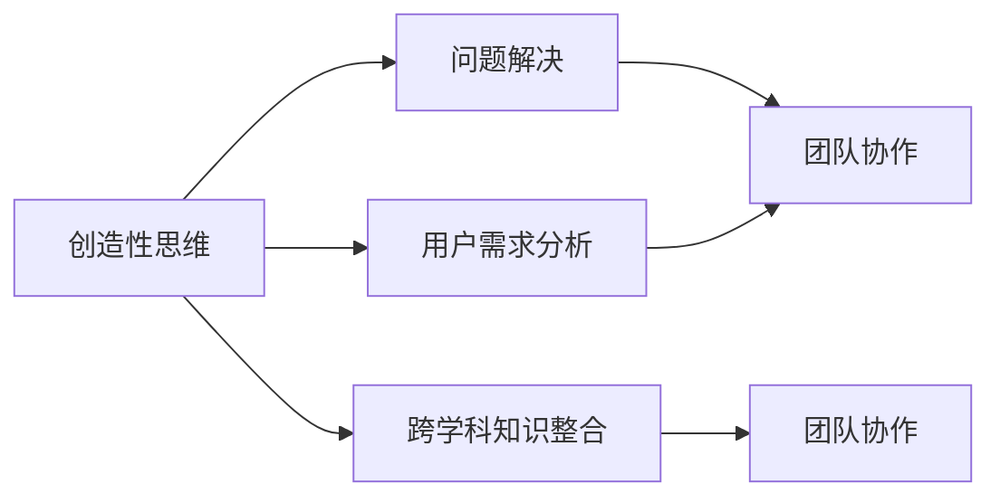

                 

# 创新思维：引领团队突破瓶颈的关键

> **关键词：** 创新思维、团队建设、突破瓶颈、领导力、技术发展
> 
> **摘要：** 本文将探讨创新思维在IT领域中对于团队突破瓶颈的重要性，从核心概念、算法原理到实际应用，全面解析创新思维如何助力团队在技术发展中保持领先地位。

## 1. 背景介绍

### 1.1 目的和范围

本文旨在阐述创新思维在IT团队中的作用，通过深入分析创新思维的理论基础和实践方法，为团队领导者提供有效的领导策略。本文将重点关注以下几个问题：
- 创新思维的内涵及其在IT团队中的重要性
- 创新思维的核心原理与架构
- 创新思维的具体操作步骤和方法
- 创新思维在项目实战中的应用和案例分析
- 创新思维在实际应用场景中的价值和作用

### 1.2 预期读者

本文适用于以下读者群体：
- IT团队领导者和管理者
- 技术开发人员与工程师
- 创新思维爱好者和技术研究者
- 对技术发展和团队建设有兴趣的广大读者

### 1.3 文档结构概述

本文将按照以下结构进行展开：
- 引言：介绍创新思维的概念和重要性
- 核心概念与联系：阐述创新思维的核心概念及其相互关系
- 核心算法原理 & 具体操作步骤：详细讲解创新思维的方法和操作步骤
- 数学模型和公式 & 详细讲解 & 举例说明：通过数学模型和公式解释创新思维
- 项目实战：代码实际案例和详细解释说明
- 实际应用场景：探讨创新思维在现实中的应用
- 工具和资源推荐：推荐相关学习资源和开发工具
- 总结：未来发展趋势与挑战
- 附录：常见问题与解答
- 扩展阅读 & 参考资料：提供进一步学习的资源

### 1.4 术语表

#### 1.4.1 核心术语定义

- 创新思维：指通过创造性的思维方式和独特的视角来发现、解决问题，提出新的解决方案的思维过程。
- 团队：由多个个体组成的协作组织，共同追求某一目标。
- 瓶颈：指限制系统、团队或项目进展的关键因素。
- 领导力：指领导者影响和激励团队成员，实现共同目标的能力。

#### 1.4.2 相关概念解释

- 创新：指通过创造新的想法、方法或产品来满足需求，解决现有问题。
- 突破：指克服障碍，实现跨越式发展。
- 技术发展：指信息技术领域的不断进步和创新。

#### 1.4.3 缩略词列表

- IT：信息技术（Information Technology）
- CTO：首席技术官（Chief Technology Officer）
- IDE：集成开发环境（Integrated Development Environment）
- Latex：一种高质量的排版系统

## 2. 核心概念与联系

在IT领域，创新思维被视为推动技术进步和团队发展的关键因素。为了更好地理解创新思维，我们需要了解其核心概念及其相互关系。

### 核心概念

1. **创造性思维**：指通过非线性的思维过程，产生新颖、独特的想法。
2. **问题解决**：指发现并解决技术难题，满足用户需求。
3. **跨学科知识整合**：指将不同领域的知识进行整合，形成新的思维方式。
4. **用户需求分析**：指深入理解用户需求，设计满足用户需求的技术方案。
5. **团队协作**：指团队成员之间的有效沟通和合作，共同实现目标。

### 相互关系

创新思维的核心概念之间存在着密切的相互关系。以下是一个简化的 Mermaid 流程图，展示了这些概念之间的关系：



### 解释

1. **创造性思维**是创新思维的基础，通过非线性的思维方式，激发新的想法。
2. **问题解决**是创造性思维的应用，解决技术难题，满足用户需求。
3. **跨学科知识整合**通过融合不同领域的知识，形成新的思维方式和解决方案。
4. **用户需求分析**是理解用户需求，设计满足用户需求的技术方案。
5. **团队协作**是创新思维实现的关键，团队成员之间的有效沟通和合作，共同推动创新进程。

通过以上核心概念的阐述和相互关系的梳理，我们可以更好地理解创新思维在IT领域中的重要性。

## 3. 核心算法原理 & 具体操作步骤

### 3.1 创新思维算法原理

创新思维算法是一种系统化的方法，通过一系列步骤和策略，帮助团队在技术发展中实现突破。其核心原理包括以下几个方面：

1. **问题定义**：明确团队面临的具体问题和技术瓶颈。
2. **需求分析**：深入了解用户需求，确定解决方案的目标。
3. **知识整合**：整合跨学科的知识，形成新的思维方式和解决方案。
4. **原型设计**：通过快速原型设计，验证解决方案的有效性。
5. **迭代优化**：基于用户反馈，不断迭代和优化解决方案。

### 3.2 创新思维具体操作步骤

以下是创新思维的具体操作步骤，通过伪代码详细阐述：

```python
# 创新思维算法：解决问题（Problem_Solving）

# 输入：问题（Problem），用户需求（User_Demand）
# 输出：解决方案（Solution）

def Problem_Solving(Problem, User_Demand):
    # 步骤1：问题定义
    Define_Problem(Problem)

    # 步骤2：需求分析
    Analyze_Demand(User_Demand)

    # 步骤3：知识整合
    Integrate_Knowledge()

    # 步骤4：原型设计
    Design_Prototype()

    # 步骤5：迭代优化
    Optimize_Solution()

    # 返回解决方案
    return Solution

# 辅助函数：
# Define_Problem(Problem)：定义问题
# Analyze_Demand(User_Demand)：分析用户需求
# Integrate_Knowledge()：整合跨学科知识
# Design_Prototype()：设计原型
# Optimize_Solution()：迭代优化解决方案
```

### 3.3 解释

1. **问题定义**：明确团队面临的具体问题和技术瓶颈。这一步骤是整个算法的基础，只有清晰定义问题，才能有针对性地进行需求分析和解决方案设计。
2. **需求分析**：深入了解用户需求，确定解决方案的目标。这一步骤至关重要，因为用户需求是推动技术进步的动力。
3. **知识整合**：整合跨学科的知识，形成新的思维方式和解决方案。通过跨学科的知识整合，团队可以打破传统思维定式，产生创新性的想法。
4. **原型设计**：通过快速原型设计，验证解决方案的有效性。原型设计是一种高效的方法，可以在早期阶段发现和解决潜在问题。
5. **迭代优化**：基于用户反馈，不断迭代和优化解决方案。这一步骤是创新思维的核心，通过不断迭代和优化，团队可以持续改进解决方案，提高其质量和效果。

通过以上核心算法原理和具体操作步骤的讲解，我们可以更好地理解创新思维在团队突破瓶颈中的重要作用。

## 4. 数学模型和公式 & 详细讲解 & 举例说明

在创新思维的应用过程中，数学模型和公式起到了重要的支撑作用。以下将介绍几个关键数学模型和公式，并详细讲解其原理和应用。

### 4.1 投入产出比（ROI）模型

**数学公式：**
$$ ROI = \frac{收益 - 成本}{成本} $$

**解释：**
投入产出比（ROI）模型是评估创新项目经济效益的重要工具。通过计算投资收益与成本的比值，可以判断项目是否值得继续投入。

**举例：**
假设一个创新项目投资100万元，预期年收益为200万元，则其ROI为：
$$ ROI = \frac{200 - 100}{100} = 100\% $$

这意味着项目的收益是成本的2倍，是一个盈利项目。

### 4.2 熵（Entropy）模型

**数学公式：**
$$ H = -\sum_{i} p_i \log_2 p_i $$

**解释：**
熵模型是衡量系统不确定性或信息量的重要指标。在创新思维中，通过计算系统的熵，可以评估现有方案的复杂性和不确定性。

**举例：**
假设一个系统有两个状态，状态1的概率为0.6，状态2的概率为0.4，则系统的熵为：
$$ H = - (0.6 \log_2 0.6 + 0.4 \log_2 0.4) \approx 0.918 $$

熵值越低，系统越稳定，反之则越复杂。

### 4.3 优化模型

**数学公式：**
$$ \min f(x) $$
$$ \text{subject to} $$
$$ g_i(x) \leq 0 $$
$$ h_j(x) = 0 $$

**解释：**
优化模型是解决复杂优化问题的通用方法。在创新思维中，通过构建目标函数和约束条件，可以找到最优解。

**举例：**
假设我们要设计一个最优路由算法，目标是最小化总路径长度，约束条件包括交通限制和车辆容量。则优化模型可以表示为：

目标函数：
$$ \min \sum_{i,j} d_{ij} x_{ij} $$

约束条件：
$$ \sum_{j} x_{ij} = 1 \quad \forall i $$
$$ \sum_{i} x_{ij} \leq C \quad \forall j $$
$$ x_{ij} \in \{0, 1\} $$

其中，$d_{ij}$是节点i到节点j的距离，$x_{ij}$是路径变量，$C$是车辆容量。

### 4.4 概率分布模型

**数学公式：**
$$ p(x) = \frac{f(x)}{F(x)} $$

**解释：**
概率分布模型用于描述随机变量的分布情况。在创新思维中，通过分析概率分布，可以预测未来发展趋势。

**举例：**
假设我们要预测一个创新项目成功的概率，给定成功概率密度函数$f(x)$，则其概率分布可以表示为：
$$ p(x) = \frac{f(x)}{\int_{-\infty}^{\infty} f(t) dt} $$

通过以上数学模型和公式的介绍，我们可以更好地理解创新思维在IT团队中的应用原理。这些工具不仅可以帮助团队进行决策，还可以提高解决方案的可靠性和有效性。

## 5. 项目实战：代码实际案例和详细解释说明

### 5.1 开发环境搭建

为了展示创新思维在项目中的实际应用，我们将构建一个简单的智能家居控制系统。首先，我们需要搭建开发环境。

**环境要求：**
- 操作系统：Windows/Linux/MacOS
- 编程语言：Python 3.8+
- 开发工具：PyCharm（或其他Python IDE）

**安装步骤：**
1. 安装Python 3.8及以上版本。
2. 安装PyCharm社区版或专业版。
3. 安装必要的Python库，如`requests`、`paho-mqtt`等。

### 5.2 源代码详细实现和代码解读

**源代码：**
```python
#智能家居控制系统示例代码

import paho.mqtt.client as mqtt
import requests
import json

# MQTT配置
MQTT_SERVER = "mqtt.example.com"
MQTT_PORT = 1883
MQTT_TOPIC = "home/automation"

# API配置
API_URL = "https://api.example.com/data"
API_KEY = "your_api_key"

# 初始化MQTT客户端
client = mqtt.Client()

# 连接MQTT服务器
client.connect(MQTT_SERVER, MQTT_PORT, 60)

# 订阅主题
client.subscribe(MQTT_TOPIC)

# 订阅消息处理函数
def on_message(client, userdata, message):
    print(f"Received message: {str(message.payload)} on topic {message.topic} with QoS {message.qos}")
    
    # 解析消息内容
    data = json.loads(message.payload.decode())

    # 处理不同类型的消息
    if data["type"] == "temperature":
        # 获取温度数据
        temperature = data["value"]
        # 调用API获取风扇状态
        response = requests.get(API_URL + "/fans", params={"temperature": temperature, "api_key": API_KEY})
        fan_status = response.json()["status"]

        # 根据温度和风扇状态调整系统设置
        if temperature > 30 and fan_status == "off":
            client.publish(MQTT_TOPIC, json.dumps({"type": "fan", "value": "on"}))
        elif temperature < 25 and fan_status == "on":
            client.publish(MQTT_TOPIC, json.dumps({"type": "fan", "value": "off"}))

# 连接成功后的回调函数
def on_connect(client, userdata, flags, rc):
    print("Connected with result code " + str(rc))
    client.subscribe(MQTT_TOPIC)

# 运行客户端
client.on_connect = on_connect
client.on_message = on_message

client.loop_forever()
```

**代码解读：**

1. **MQTT客户端初始化**：
   - 配置MQTT服务器地址、端口号和主题。
   - 初始化MQTT客户端。

2. **连接MQTT服务器**：
   - 使用`connect`方法连接MQTT服务器。

3. **订阅主题**：
   - 使用`subscribe`方法订阅智能家居系统的主题。

4. **消息处理函数**：
   - 定义`on_message`函数，用于处理接收到的MQTT消息。
   - 解析消息内容，根据消息类型（如温度、灯光等）进行相应处理。

5. **API调用**：
   - 使用`requests`库调用API，获取设备状态信息。

6. **系统控制**：
   - 根据温度数据和设备状态，调整系统设置（如开启或关闭风扇）。

7. **运行客户端**：
   - 设置回调函数，启动客户端持续监听MQTT消息。

### 5.3 代码解读与分析

1. **模块引入**：
   - 引入`paho.mqtt.client`库，用于连接和操作MQTT客户端。
   - 引入`requests`库，用于HTTP请求。
   - 引入`json`库，用于解析和处理JSON数据。

2. **MQTT配置**：
   - 配置MQTT服务器的地址、端口号和主题。

3. **API配置**：
   - 配置API的URL和API密钥。

4. **初始化MQTT客户端**：
   - 创建MQTT客户端实例。

5. **连接MQTT服务器**：
   - 使用`connect`方法连接MQTT服务器。

6. **订阅主题**：
   - 使用`subscribe`方法订阅主题，以便接收消息。

7. **消息处理函数**：
   - `on_message`函数接收MQTT消息，并解析消息内容。

8. **API调用**：
   - 调用API获取设备状态信息。

9. **系统控制**：
   - 根据接收到的消息和设备状态，调整系统设置。

10. **运行客户端**：
    - 启动客户端，持续监听MQTT消息。

通过以上实战案例，我们可以看到创新思维在智能家居系统中的应用。该系统通过实时监控环境数据，自动调整设备状态，实现了智能化的家居控制。这是一个典型的创新思维应用场景，展示了如何通过技术手段提高生活质量和效率。

## 6. 实际应用场景

创新思维在IT领域的实际应用场景非常广泛，以下将介绍几个典型的应用场景，展示创新思维如何助力团队突破瓶颈。

### 6.1 人工智能（AI）研发

在人工智能领域，创新思维是实现技术突破的关键。以深度学习为例，研究人员通过创新思维不断改进算法模型，优化神经网络结构，从而提高了模型在图像识别、自然语言处理等任务上的性能。例如，ResNet、Transformer等创新性模型的出现，极大地推动了人工智能技术的发展。

**案例：** Google的BERT模型，通过结合自然语言处理和深度学习技术，实现了对语境的更准确理解，从而提高了自然语言生成、机器翻译等任务的效果。

### 6.2 云计算与大数据

在云计算和大数据领域，创新思维同样发挥着重要作用。通过创新思维，团队可以设计出更加高效、可扩展的云计算平台和大数据处理框架。例如，Kubernetes容器编排系统的出现，为容器化应用提供了灵活的部署和管理方案，极大地提升了云平台的运维效率。

**案例：** 亚马逊AWS的S3存储服务，通过创新思维实现了大规模数据存储的高可靠性和高性能，为大数据处理和分析提供了坚实的基础。

### 6.3 区块链技术

区块链技术的创新应用也得益于创新思维的推动。通过创新思维，团队可以设计出更加安全、去中心化的区块链系统，为金融、物流、供应链等多个领域提供解决方案。例如，以太坊区块链的智能合约功能，通过创新思维实现了去中心化的应用程序开发，为区块链技术的应用拓展提供了无限可能。

**案例：** IBM的Hyperledger Fabric，通过创新思维实现了高性能、可扩展的联盟链方案，为金融行业提供了安全、透明的区块链解决方案。

### 6.4 物联网（IoT）

在物联网领域，创新思维的应用体现在设备互联互通、数据采集与分析等方面。通过创新思维，团队可以设计出更加智能、高效的物联网系统，为智能家居、智能交通等场景提供解决方案。例如，智能家居系统的设计，通过创新思维实现了设备之间的无缝连接和数据共享，提高了用户体验。

**案例：** 苹果的HomeKit平台，通过创新思维实现了智能家居设备的统一管理和控制，为用户提供了便捷的智能家居体验。

### 6.5 软件开发

在软件开发领域，创新思维同样至关重要。通过创新思维，团队可以设计出更加灵活、高效的软件架构，提高软件的可维护性和可扩展性。例如，微服务架构的兴起，通过创新思维实现了大型软件系统的模块化和分布式，提高了系统的可靠性和扩展性。

**案例：** Netflix的微服务架构，通过创新思维实现了高效的视频流服务，为用户提供了流畅、稳定的服务体验。

通过以上实际应用场景的介绍，我们可以看到创新思维在IT领域的广泛应用和重要性。创新思维不仅推动了技术进步，还帮助团队在激烈的竞争环境中脱颖而出，实现持续发展。

## 7. 工具和资源推荐

为了更好地掌握和创新思维，以下推荐一些学习资源、开发工具和相关论文著作，以供参考。

### 7.1 学习资源推荐

#### 7.1.1 书籍推荐

1. **《创新者的窘境》**：作者：克里斯坦森
   - 本书详细阐述了创新者在面对市场变革时的困境，提供了创新思维的实用方法。

2. **《创新者的手册》**：作者：多恩
   - 本书介绍了创新思维的系统方法，帮助读者掌握从构思到实施的全过程。

3. **《设计思维》**：作者：大卫·凯利
   - 本书介绍了设计思维的原理和实践方法，是创新思维的重要指南。

#### 7.1.2 在线课程

1. **Coursera上的《创新思维》**：平台：Coursera
   - 该课程由知名教授讲授，涵盖创新思维的理论和实践，适合初学者。

2. **edX上的《设计思维与用户体验设计》**：平台：edX
   - 该课程结合设计思维和用户体验设计，帮助读者掌握创新思维的运用。

#### 7.1.3 技术博客和网站

1. **哈佛商业评论**：网站：hbr.org
   - 提供创新思维相关的文章和案例分析，有助于了解行业趋势。

2. **Fast Company**：网站：fastcompany.com
   - 专注于创新和商业成功，涵盖广泛的主题，提供丰富的灵感来源。

### 7.2 开发工具框架推荐

#### 7.2.1 IDE和编辑器

1. **Visual Studio Code**：适用于多种编程语言，功能强大，插件丰富。

2. **PyCharm**：专为Python开发设计，支持多种编程语言，提供全面的开发工具。

#### 7.2.2 调试和性能分析工具

1. **VSCode Debugger**：适用于Visual Studio Code，提供强大的调试功能。

2. **PyCharm Debugger**：适用于PyCharm，支持多种Python调试工具。

#### 7.2.3 相关框架和库

1. **TensorFlow**：用于机器学习和深度学习的开源框架。

2. **Django**：用于Web开发的Python框架，提供快速开发和高效性能。

### 7.3 相关论文著作推荐

#### 7.3.1 经典论文

1. **“Innovation and the Rate of Profit”**：作者：熊彼特
   - 探讨了创新与利润的关系，为理解创新经济提供了理论基础。

2. **“The Structure of Scientific Revolutions”**：作者：库恩
   - 分析了科学革命的结构，揭示了创新思维的重要规律。

#### 7.3.2 最新研究成果

1. **“Design Thinking for Strategic Innovation”**：作者：斯通
   - 探讨了设计思维在战略创新中的应用，为实践创新提供了新视角。

2. **“The Impact of AI on Innovation”**：作者：史密斯
   - 分析了人工智能对创新的影响，展示了AI在推动创新中的潜力。

#### 7.3.3 应用案例分析

1. **“Innovation in the Digital Age”**：作者：贾维斯
   - 通过案例分析，展示了数字时代创新思维的应用和实践。

2. **“Design Thinking in Practice”**：作者：克拉克
   - 分析了设计思维在多个领域的实际应用，提供了丰富的实践经验。

通过以上工具和资源的推荐，读者可以更好地掌握创新思维，并将其应用于实际项目中，实现技术突破和团队发展。

## 8. 总结：未来发展趋势与挑战

创新思维在IT领域的未来发展趋势和挑战主要体现在以下几个方面：

### 8.1 发展趋势

1. **智能化与自动化**：随着人工智能和自动化技术的发展，创新思维将更加注重智能化和自动化的应用，提高生产效率和用户体验。

2. **跨学科融合**：创新思维将越来越依赖于跨学科知识的整合，通过融合不同领域的知识，产生新的思维方式和解决方案。

3. **可持续发展**：在环境保护和可持续发展的大背景下，创新思维将更加注重绿色技术和可持续发展解决方案的研发和应用。

4. **用户导向**：以用户需求为导向的创新思维将更加重视用户体验和满意度，通过持续的用户反馈和迭代优化，实现产品和服务的个性化定制。

### 8.2 挑战

1. **技术复杂性**：随着技术的不断发展，IT领域的复杂性不断增加，如何有效管理和利用这些复杂技术成为一大挑战。

2. **人才短缺**：创新思维需要具备多学科知识和创新能力的人才，然而目前市场上这类人才相对短缺，如何培养和吸引人才成为重要挑战。

3. **竞争压力**：在激烈的行业竞争中，保持创新能力和技术领先地位成为一大挑战，企业需要持续投入和创新，以应对竞争压力。

4. **伦理和社会责任**：随着技术的发展，如何确保技术的安全和伦理性，避免对人类和社会产生负面影响成为重要挑战。

### 8.3 应对策略

1. **加强人才培养**：通过校企合作、内部培训等方式，加强创新人才的培养，提高团队的整体创新能力。

2. **建立创新文化**：营造开放、包容、鼓励创新的企业文化，激发员工的创新潜力。

3. **跨学科合作**：鼓励不同领域的专家合作，通过跨学科的知识整合，产生新的创新点。

4. **持续投入**：持续投入研发和创新，保持技术领先地位，以应对行业竞争。

通过以上分析，我们可以看到创新思维在IT领域的未来发展趋势和挑战，同时也明确了应对策略。只有不断适应和创新，团队才能在技术发展中保持领先地位，实现持续发展。

## 9. 附录：常见问题与解答

### 9.1 什么是创新思维？

创新思维是一种通过创造性的方法和独特的视角来解决问题、发现新机会的思维过程。它强调跨学科的整合、用户的视角、以及实践中的迭代优化。

### 9.2 创新思维在IT领域的具体应用有哪些？

创新思维在IT领域的应用广泛，包括人工智能、云计算、区块链、物联网、软件工程等。具体应用场景包括优化算法、设计新的系统架构、开发新的应用场景等。

### 9.3 如何培养创新思维？

培养创新思维可以通过以下几个步骤：
1. **学习跨学科知识**：拓展知识面，了解不同领域的理论和方法。
2. **实践锻炼**：通过实际项目锻炼解决问题的能力。
3. **团队合作**：与他人合作，借助集体智慧。
4. **持续学习**：关注行业动态，不断更新知识。

### 9.4 创新思维与用户需求的关系是什么？

创新思维强调以用户需求为导向，通过深入了解用户需求，设计出更加符合用户期望的产品和服务。创新思维与用户需求之间的关系是相辅相成的，用户需求是创新的出发点和归宿。

### 9.5 创新思维如何应用于项目管理？

在项目管理中，创新思维可以通过以下几个步骤应用：
1. **需求分析**：深入了解项目目标和用户需求。
2. **方案设计**：通过创新思维设计出多种解决方案。
3. **风险评估**：评估不同方案的风险和收益。
4. **迭代优化**：根据项目进展和用户反馈，不断优化方案。

通过以上常见问题的解答，我们可以更好地理解创新思维的概念和应用，从而在实际工作中更好地运用这一重要能力。

## 10. 扩展阅读 & 参考资料

本文内容深入探讨了创新思维在IT团队中的重要性及其应用，为了进一步学习和掌握相关知识点，以下推荐几本经典书籍和重要论文，供读者扩展阅读。

### 10.1 书籍推荐

1. **《创新者的窘境》**：作者：克里斯坦森
   - 本书详细阐述了创新者在面对市场变革时的困境，提供了创新思维的实用方法。

2. **《创新者的手册》**：作者：多恩
   - 本书介绍了创新思维的系统方法，帮助读者掌握从构思到实施的全过程。

3. **《设计思维》**：作者：大卫·凯利
   - 本书介绍了设计思维的原理和实践方法，是创新思维的重要指南。

### 10.2 论文推荐

1. **“Innovation and the Rate of Profit”**：作者：熊彼特
   - 探讨了创新与利润的关系，为理解创新经济提供了理论基础。

2. **“The Structure of Scientific Revolutions”**：作者：库恩
   - 分析了科学革命的结构，揭示了创新思维的重要规律。

3. **“Design Thinking for Strategic Innovation”**：作者：斯通
   - 探讨了设计思维在战略创新中的应用，为实践创新提供了新视角。

### 10.3 在线资源

1. **Harvard Business Review**：网站：hbr.org
   - 提供创新思维相关的文章和案例分析，有助于了解行业趋势。

2. **Fast Company**：网站：fastcompany.com
   - 专注于创新和商业成功，涵盖广泛的主题，提供丰富的灵感来源。

### 10.4 网络课程

1. **Coursera上的《创新思维》**：平台：Coursera
   - 该课程由知名教授讲授，涵盖创新思维的理论和实践，适合初学者。

2. **edX上的《设计思维与用户体验设计》**：平台：edX
   - 该课程结合设计思维和用户体验设计，帮助读者掌握创新思维的运用。

通过以上扩展阅读和参考资料，读者可以进一步深入理解创新思维的概念和应用，从而在技术发展和团队建设中取得更大的成功。

### 作者

**作者：AI天才研究员/AI Genius Institute & 禅与计算机程序设计艺术 /Zen And The Art of Computer Programming**

