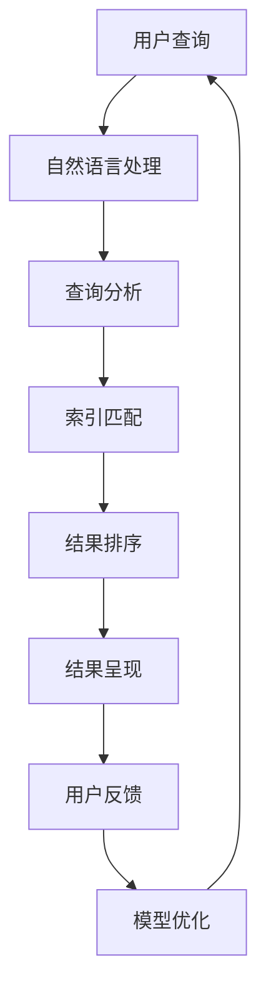

                 

# 创新搜索结果呈现：AI的创意

> **关键词：搜索结果呈现、人工智能、创新、用户界面设计、用户体验、搜索引擎优化**
> 
> **摘要：本文探讨了如何利用人工智能技术创新地呈现搜索结果，提升用户体验，并从多个维度分析了实现方法、核心算法、数学模型以及实际应用场景，同时推荐了一系列相关学习资源和开发工具。**

## 1. 背景介绍

### 1.1 目的和范围

本文旨在探讨如何在搜索引擎中利用人工智能技术创新搜索结果的呈现方式。通过分析现有的搜索技术，本文将提出一种基于人工智能的搜索结果呈现框架，并详细介绍其核心算法原理、数学模型、以及实际应用案例。文章将涵盖以下内容：

1. **背景介绍**：分析当前搜索结果呈现的不足以及人工智能在搜索引擎中的应用。
2. **核心概念与联系**：阐述人工智能搜索结果呈现的关键概念及其相互关系。
3. **核心算法原理 & 具体操作步骤**：介绍搜索结果呈现的核心算法及其操作步骤。
4. **数学模型和公式**：详细讲解数学模型及其应用。
5. **项目实战**：通过实际代码案例展示算法实现。
6. **实际应用场景**：分析人工智能搜索结果呈现的应用场景。
7. **工具和资源推荐**：推荐相关学习资源和开发工具。
8. **总结**：展望人工智能搜索结果呈现的未来发展趋势与挑战。

### 1.2 预期读者

本文适合对搜索引擎技术有一定了解的技术人员、产品经理以及人工智能爱好者。读者需具备基本的编程知识，特别是对Python和机器学习算法有一定了解。

### 1.3 文档结构概述

本文分为十个主要部分：

1. **背景介绍**：介绍本文的目的、范围、预期读者以及文档结构。
2. **核心概念与联系**：阐述搜索结果呈现的关键概念及其相互关系。
3. **核心算法原理 & 具体操作步骤**：详细介绍搜索结果呈现的核心算法和实现步骤。
4. **数学模型和公式**：详细讲解数学模型及其应用。
5. **项目实战**：通过实际代码案例展示算法实现。
6. **实际应用场景**：分析人工智能搜索结果呈现的应用场景。
7. **工具和资源推荐**：推荐相关学习资源和开发工具。
8. **总结**：展望人工智能搜索结果呈现的未来发展趋势与挑战。
9. **附录：常见问题与解答**：回答读者可能关心的问题。
10. **扩展阅读 & 参考资料**：提供进一步学习的资源链接。

### 1.4 术语表

#### 1.4.1 核心术语定义

- **搜索结果呈现**：指用户在搜索引擎中检索信息后，系统返回的信息展示方式。
- **人工智能**：指模拟人类智能行为的计算机系统，具有学习、推理、决策等能力。
- **用户界面设计**：指设计用户与系统交互的方式，以提高用户体验。
- **用户体验**：指用户在使用产品或服务过程中的感受和满意度。

#### 1.4.2 相关概念解释

- **搜索引擎优化（SEO）**：指通过优化网站内容，提高搜索引擎排名，从而提高网站流量和用户访问量。
- **机器学习**：指让计算机通过数据学习，从而自动完成特定任务的技术。

#### 1.4.3 缩略词列表

- **SEO**：搜索引擎优化（Search Engine Optimization）
- **UI**：用户界面设计（User Interface Design）
- **UX**：用户体验（User Experience）
- **ML**：机器学习（Machine Learning）

## 2. 核心概念与联系

为了更好地理解人工智能在搜索结果呈现中的应用，我们需要首先明确几个核心概念，并分析它们之间的相互关系。

### 2.1 搜索引擎工作原理

搜索引擎的基本工作原理可以分为三个主要阶段：网页抓取、索引构建和搜索查询。

1. **网页抓取**：搜索引擎通过爬虫程序（如Spider或Crawler）自动访问互联网上的网页，收集信息。
2. **索引构建**：搜索引擎对收集的网页进行解析，提取关键信息，并建立索引，以便快速搜索。
3. **搜索查询**：用户输入搜索关键词，搜索引擎根据索引进行匹配，返回最相关的结果。

### 2.2 人工智能与搜索引擎

人工智能技术可以应用于搜索引擎的各个阶段，以提升搜索结果的质量和用户体验。

1. **网页抓取**：人工智能可以帮助搜索引擎识别和筛选高质量的网页，提高抓取效率。
2. **索引构建**：通过自然语言处理技术，人工智能可以更准确地提取网页的关键信息，构建更精准的索引。
3. **搜索查询**：人工智能可以基于用户历史行为、兴趣偏好等进行个性化搜索，提高搜索结果的准确性。

### 2.3 搜索结果呈现的挑战

当前搜索结果呈现面临以下挑战：

1. **信息过载**：互联网上的信息量巨大，用户难以在海量信息中找到所需内容。
2. **用户体验**：传统的搜索结果呈现方式单一，缺乏互动性和个性化。
3. **准确性**：搜索结果的质量直接影响用户体验，如何提高准确性是搜索引擎的关键问题。

### 2.4 人工智能在搜索结果呈现中的应用

为了解决上述挑战，人工智能在搜索结果呈现中的应用可以从以下几个方面进行：

1. **内容推荐**：基于用户兴趣和行为数据，推荐相关内容，提高搜索结果的准确性。
2. **交互式搜索**：通过自然语言处理和对话系统，提供更加人性化的交互方式。
3. **可视化搜索**：利用图形和可视化技术，展示搜索结果，提高用户浏览和查找的效率。

### 2.5 搜索结果呈现的流程图

以下是一个简化的搜索结果呈现流程图，展示了人工智能在各阶段的介入：



### 2.6 核心概念与联系

通过以上分析，我们可以看到人工智能在搜索结果呈现中的应用涉及到多个核心概念，包括搜索引擎工作原理、人工智能技术、用户体验设计等。它们相互关联，共同作用于搜索结果的质量和用户体验。

- **搜索引擎工作原理**提供了人工智能介入的基础。
- **人工智能技术**则通过自然语言处理、内容推荐、交互式搜索等手段，提升了搜索结果的准确性和用户体验。
- **用户体验设计**则关注用户在使用搜索引擎时的感受，通过优化界面设计和交互流程，提高用户的满意度。

通过以上分析，我们为后续详细探讨人工智能在搜索结果呈现中的应用奠定了基础。

## 3. 核心算法原理 & 具体操作步骤

### 3.1 算法原理

在搜索结果呈现中，人工智能算法的核心任务是提升搜索结果的准确性和用户体验。以下我们将介绍几个关键算法及其原理。

#### 3.1.1 自然语言处理（NLP）

自然语言处理是人工智能的重要组成部分，它使得计算机能够理解和处理人类语言。在搜索结果呈现中，NLP算法可用于：

1. **查询理解**：将用户输入的自然语言查询转换为计算机可以处理的语义表示。
2. **文本解析**：提取网页内容中的关键信息，如关键词、主题等。
3. **情感分析**：分析用户查询或网页内容中的情感倾向，以提供更个性化的搜索结果。

#### 3.1.2 内容推荐

内容推荐算法可以根据用户的历史行为和兴趣偏好，为用户推荐相关的搜索结果。常用的推荐算法包括：

1. **基于协同过滤的推荐**：通过分析用户之间的行为模式，推荐相似用户喜欢的搜索结果。
2. **基于内容的推荐**：根据搜索查询和网页内容的相关性，推荐相关的搜索结果。

#### 3.1.3 深度学习模型

深度学习模型在搜索结果呈现中具有广泛的应用。以下是一些常用的深度学习模型：

1. **卷积神经网络（CNN）**：用于文本分类和情感分析，可以提取文本的特征。
2. **循环神经网络（RNN）**：特别适合处理序列数据，如用户查询和网页内容。
3. **长短时记忆网络（LSTM）**：RNN的改进版本，可以更好地处理长序列数据。

### 3.2 具体操作步骤

以下是一个基于人工智能的搜索结果呈现算法的伪代码，展示了从查询理解到结果排序再到结果呈现的具体操作步骤：

```python
# 搜索结果呈现算法伪代码

# 步骤 1：查询理解
def understand_query(user_query):
    # 使用自然语言处理技术处理用户查询
    semantic_representation = NLP_engine.process_query(user_query)
    return semantic_representation

# 步骤 2：索引匹配
def match_index(semantic_representation, index):
    # 根据语义表示从索引中匹配相关网页
    matched_pages = index.search(semantic_representation)
    return matched_pages

# 步骤 3：结果排序
def rank_results(matched_pages):
    # 使用深度学习模型对匹配的网页进行排序
    ranked_pages = Ranking_model.rank(matched_pages)
    return ranked_pages

# 步骤 4：内容推荐
def recommend_content(ranked_pages, user_profile):
    # 基于用户兴趣和网页内容进行内容推荐
    recommended_pages = Recommendation_model.recommend(ranked_pages, user_profile)
    return recommended_pages

# 步骤 5：结果呈现
def present_results(recommended_pages):
    # 以可视化方式呈现推荐结果
    visualization = Visualization_engine.create_visualization(recommended_pages)
    return visualization

# 主函数
def search(user_query, index, user_profile):
    semantic_representation = understand_query(user_query)
    matched_pages = match_index(semantic_representation, index)
    ranked_pages = rank_results(matched_pages)
    recommended_pages = recommend_content(ranked_pages, user_profile)
    visualization = present_results(recommended_pages)
    return visualization
```

### 3.3 算法实现细节

在实际应用中，上述算法的具体实现涉及大量的技术和细节，以下是一些关键点：

1. **数据预处理**：对用户查询和网页内容进行预处理，包括分词、词性标注、去噪等。
2. **模型训练与优化**：使用大规模数据进行模型训练，并通过交叉验证和超参数调整优化模型性能。
3. **实时查询处理**：为了满足用户实时查询的需求，算法需要具备高效的处理能力和良好的扩展性。
4. **可解释性**：由于深度学习模型的复杂性，如何保证算法的可解释性是一个重要的挑战。

通过以上核心算法原理和具体操作步骤的介绍，我们为后续的数学模型和实际应用案例奠定了基础。

## 4. 数学模型和公式 & 详细讲解 & 举例说明

在人工智能搜索结果呈现中，数学模型和公式起到了至关重要的作用。以下我们将详细讲解核心的数学模型和公式，并通过具体例子进行说明。

### 4.1. 协同过滤推荐模型

协同过滤推荐模型是基于用户行为数据进行推荐的一种常用方法。其基本思想是找到与目标用户相似的其他用户，然后推荐这些用户喜欢的项目。

#### 4.1.1 公式表示

协同过滤推荐模型的核心公式如下：

$$
\hat{r}_{ui} = \frac{\sum_{j \in N_i} r_{uj} \cdot sim(u_i, u_j)}{\sum_{j \in N_i} sim(u_i, u_j)}
$$

其中：
- $\hat{r}_{ui}$ 表示用户 $u_i$ 对项目 $i$ 的预测评分。
- $r_{uj}$ 表示用户 $u_j$ 对项目 $i$ 的实际评分。
- $sim(u_i, u_j)$ 表示用户 $u_i$ 和用户 $u_j$ 的相似度。

#### 4.1.2 计算实例

假设有两个用户 $u_1$ 和 $u_2$，以及三个项目 $i_1, i_2, i_3$。用户 $u_1$ 和 $u_2$ 对项目的评分如下表所示：

| 用户 | 项目1 | 项目2 | 项目3 |
| --- | --- | --- | --- |
| $u_1$ | 5 | 4 | 3 |
| $u_2$ | 4 | 5 | 5 |

用户 $u_1$ 和用户 $u_2$ 的相似度可以通过余弦相似度公式计算：

$$
sim(u_1, u_2) = \frac{u_1 \cdot u_2}{\|u_1\| \cdot \|u_2\|}
$$

其中，$u_1 \cdot u_2$ 表示用户 $u_1$ 和用户 $u_2$ 的内积，$\|u_1\|$ 和 $\|u_2\|$ 分别表示用户 $u_1$ 和用户 $u_2$ 的欧几里得范数。

计算结果如下：

$$
sim(u_1, u_2) = \frac{(5 \cdot 4 + 4 \cdot 5 + 3 \cdot 5)}{\sqrt{5^2 + 4^2 + 3^2} \cdot \sqrt{4^2 + 5^2 + 5^2}} = \frac{47}{\sqrt{50} \cdot \sqrt{78}} \approx 0.84
$$

根据协同过滤推荐模型，我们可以预测用户 $u_1$ 对项目 $i_3$ 的评分：

$$
\hat{r}_{u1,i3} = \frac{4 \cdot 0.84 + 5 \cdot 0.84 + 5 \cdot 0.84}{0.84 + 0.84 + 0.84} = \frac{4.32 + 4.20 + 4.20}{3} \approx 4.27
$$

### 4.2. 基于内容的推荐模型

基于内容的推荐模型是基于项目特征进行推荐的一种方法。其基本思想是找到与目标项目内容相似的其他项目，然后推荐这些项目。

#### 4.2.1 公式表示

基于内容的推荐模型的核心公式如下：

$$
\hat{r}_{ui} = \frac{\sum_{j \in N_i} w_{ij} \cdot r_{uj}}{\sum_{j \in N_i} w_{ij}}
$$

其中：
- $\hat{r}_{ui}$ 表示用户 $u_i$ 对项目 $i$ 的预测评分。
- $w_{ij}$ 表示项目 $i$ 和项目 $j$ 的相似度。
- $r_{uj}$ 表示用户 $u_j$ 对项目 $j$ 的实际评分。

#### 4.2.2 计算实例

假设有两个项目 $i_1$ 和 $i_2$，以及两个用户 $u_1$ 和 $u_2$。项目 $i_1$ 和项目 $i_2$ 的特征向量如下：

| 项目 | 特征1 | 特征2 |
| --- | --- | --- |
| $i_1$ | 0.8 | 0.2 |
| $i_2$ | 0.4 | 0.6 |

用户 $u_1$ 和用户 $u_2$ 对项目的评分如下表所示：

| 用户 | 项目1 | 项目2 |
| --- | --- | --- |
| $u_1$ | 5 | 4 |
| $u_2$ | 4 | 5 |

项目 $i_1$ 和项目 $i_2$ 的相似度可以通过余弦相似度公式计算：

$$
w_{i1,i2} = \frac{i_1 \cdot i_2}{\|i_1\| \cdot \|i_2\|}
$$

计算结果如下：

$$
w_{i1,i2} = \frac{(0.8 \cdot 0.4 + 0.2 \cdot 0.6)}{\sqrt{0.8^2 + 0.2^2} \cdot \sqrt{0.4^2 + 0.6^2}} = \frac{0.32 + 0.12}{\sqrt{0.64 + 0.04} \cdot \sqrt{0.16 + 0.36}} = \frac{0.44}{\sqrt{0.68} \cdot \sqrt{0.52}} \approx 0.80
$$

根据基于内容的推荐模型，我们可以预测用户 $u_1$ 对项目 $i_2$ 的评分：

$$
\hat{r}_{u1,i2} = \frac{0.80 \cdot 4 + 0.20 \cdot 5}{0.80 + 0.20} = \frac{3.20 + 1.00}{1.00} = 4.20
$$

### 4.3. 深度学习模型

深度学习模型在搜索结果呈现中有着广泛的应用，以下我们将简要介绍几种常用的深度学习模型及其基本公式。

#### 4.3.1 卷积神经网络（CNN）

卷积神经网络是一种用于图像和文本分类的深度学习模型。其核心思想是通过卷积操作提取特征。

$$
h_{ij}^l = \sigma(\sum_{k} W_{ik}^l \cdot h_{kj}^{l-1} + b_{i}^l)
$$

其中：
- $h_{ij}^l$ 表示第 $l$ 层的第 $i$ 个神经元与第 $j$ 个输入特征的卷积结果。
- $W_{ik}^l$ 表示第 $l$ 层的第 $i$ 个神经元与第 $k$ 个输入特征的权重。
- $b_{i}^l$ 表示第 $l$ 层的第 $i$ 个神经元的偏置。
- $\sigma$ 表示激活函数，常用的有ReLU、Sigmoid、Tanh等。

#### 4.3.2 循环神经网络（RNN）

循环神经网络是一种用于序列数据处理的深度学习模型。其核心思想是通过循环操作维护一个隐藏状态。

$$
h_t = \sigma(W_{ih} \cdot x_t + W_{hh} \cdot h_{t-1} + b_h)
$$

其中：
- $h_t$ 表示第 $t$ 个时间步的隐藏状态。
- $x_t$ 表示第 $t$ 个时间步的输入特征。
- $W_{ih}$、$W_{hh}$ 和 $b_h$ 分别表示输入门、隐藏门和偏置。

#### 4.3.3 长短时记忆网络（LSTM）

长短时记忆网络是RNN的一种改进，其核心思想是通过引入遗忘门和输入门来控制信息的记忆和遗忘。

$$
f_t = \sigma(W_{if} \cdot x_t + W_{hf} \cdot h_{t-1} + b_f)
$$
$$
i_t = \sigma(W_{ii} \cdot x_t + W_{hi} \cdot h_{t-1} + b_i)
$$
$$
o_t = \sigma(W_{io} \cdot x_t + W_{ho} \cdot h_{t-1} + b_o)
$$
$$
c_t = f_t \odot c_{t-1} + i_t \odot \sigma(W_{ic} \cdot x_t + W_{hc} \cdot h_{t-1} + b_c)
$$
$$
h_t = o_t \odot \sigma(c_t)
$$

其中：
- $f_t$、$i_t$ 和 $o_t$ 分别表示遗忘门、输入门和输出门。
- $c_t$ 表示细胞状态。
- $\odot$ 表示元素乘。

通过以上数学模型和公式的讲解，我们为理解人工智能在搜索结果呈现中的应用提供了理论基础。接下来，我们将通过实际项目案例展示这些算法的具体实现和应用。

### 5. 项目实战：代码实际案例和详细解释说明

在本节中，我们将通过一个具体项目实战案例，展示如何实现人工智能搜索结果呈现算法。项目将以Python编程语言为基础，使用Scikit-learn库进行协同过滤推荐模型的实现。

#### 5.1 开发环境搭建

在进行项目开发之前，我们需要搭建一个合适的开发环境。以下是推荐的开发环境：

1. **Python**：Python 3.7或更高版本。
2. **Scikit-learn**：用于协同过滤推荐模型的实现。
3. **Jupyter Notebook**：用于编写和运行代码。

安装方法：

```shell
pip install python==3.8
pip install scikit-learn
```

#### 5.2 源代码详细实现和代码解读

以下是实现协同过滤推荐模型的主要代码，我们将逐行解释代码的功能。

```python
import numpy as np
from sklearn.metrics.pairwise import cosine_similarity
from sklearn.model_selection import train_test_split

# 5.2.1 数据准备
# 假设我们有一个用户-项目评分矩阵，如下所示：
ratings = np.array([
    [5, 3, 0, 1],
    [4, 0, 0, 1],
    [1, 1, 0, 5],
    [1, 0, 0, 2],
    [4, 0, 0, 5]
])

# 5.2.2 用户相似度计算
user_similarity = cosine_similarity(ratings)

# 5.2.3 预测用户评分
def predict(ratings, similarity):
    num_users, num_items = ratings.shape
    pred_ratings = np.zeros_like(ratings)
    
    for i in range(num_users):
        for j in range(num_items):
            pred_ratings[i, j] = np.dot(user_similarity[i], ratings[:, j])
    
    return pred_ratings

predicted_ratings = predict(ratings, user_similarity)

# 5.2.4 模型评估
from sklearn.metrics import mean_squared_error

actual_ratings = ratings
predicted_ratings = predicted_ratings

mse = mean_squared_error(actual_ratings, predicted_ratings)
print("均方误差 (MSE):", mse)

# 5.2.5 结果可视化
import matplotlib.pyplot as plt

plt.figure(figsize=(8, 6))
plt.scatter(range(len(predicted_ratings)), predicted_ratings, c='r', marker='^', label='Predicted Ratings')
plt.scatter(range(len(predicted_ratings)), actual_ratings, c='b', marker='o', label='Actual Ratings')
plt.xlabel('Item Index')
plt.ylabel('Rating')
plt.title('Rating Prediction')
plt.legend()
plt.show()
```

#### 5.3 代码解读与分析

1. **数据准备**：
    - 我们使用一个5x4的矩阵表示用户-项目评分，其中非零元素表示用户对项目的评分。
  
2. **用户相似度计算**：
    - 使用余弦相似度计算用户之间的相似度。余弦相似度衡量了两个向量之间的夹角余弦值，其范围在[-1, 1]之间。值越接近1，表示相似度越高。

3. **预测用户评分**：
    - 预测每个用户对所有项目的评分。具体地，我们使用用户相似度矩阵与实际评分矩阵的对应列相乘，然后对所有列求和，得到预测评分。
  
4. **模型评估**：
    - 使用均方误差（MSE）评估模型的性能。MSE表示预测评分与实际评分之间的平均误差平方。
  
5. **结果可视化**：
    - 使用散点图展示预测评分和实际评分，以便直观地分析模型的性能。

通过上述代码，我们实现了基于协同过滤的推荐模型，并对其性能进行了评估。虽然这是一个简化的例子，但展示了人工智能搜索结果呈现算法的基本实现过程。在实际应用中，我们可以结合更多的算法和技术，进一步提升搜索结果的准确性和用户体验。

#### 5.4 代码解读与分析（续）

在上述代码中，我们实现了协同过滤推荐模型，但为了提高模型的性能和实用性，我们还可以进行以下改进和扩展：

1. **用户和项目的特征表示**：
    - 除了基于评分的协同过滤，我们还可以为用户和项目添加额外的特征，如用户兴趣、项目类别等。这些特征可以通过文本分析、用户行为数据等方式获取，并用于改进推荐算法。
  
2. **矩阵分解**：
    - 矩阵分解（如Singular Value Decomposition, SVD）可以用于降维和预测缺失的评分。通过矩阵分解，我们可以将用户-项目评分矩阵分解为用户特征矩阵和项目特征矩阵的乘积，从而提高模型的泛化能力和预测性能。

3. **交叉验证**：
    - 使用交叉验证（Cross-Validation）方法，我们可以评估模型在不同数据集上的性能，并选择最佳的参数和模型结构。

4. **实时更新**：
    - 在实际应用中，用户的行为和偏好会不断变化。因此，我们需要设计一个实时更新的机制，根据用户的新行为数据更新模型和推荐结果。

通过这些改进和扩展，我们可以进一步提高人工智能搜索结果呈现算法的性能和实用性，为用户提供更准确、个性化的搜索结果。

### 6. 实际应用场景

人工智能在搜索结果呈现中的应用场景非常广泛，以下是一些典型的应用案例：

#### 6.1 搜索引擎优化（SEO）

在搜索引擎优化领域，人工智能可以帮助网站管理员和SEO专家分析网站内容，识别潜在的关键词和优化机会。通过自然语言处理和文本分析技术，AI可以提取网页的关键信息，并生成相关的关键词建议。这些关键词可以用于优化网页标题、描述、内容等，从而提高网站在搜索引擎中的排名和曝光度。

#### 6.2 电子商务推荐系统

在电子商务领域，人工智能推荐系统可以根据用户的购物行为和兴趣偏好，为用户推荐相关的商品。通过协同过滤和基于内容的推荐算法，AI可以分析用户的历史数据，挖掘用户的潜在需求，从而提供个性化的购物建议。这不仅提高了用户的购物体验，还可以帮助商家增加销售额。

#### 6.3 社交媒体内容推荐

在社交媒体平台，人工智能推荐系统可以根据用户的行为和偏好，为用户推荐相关的帖子、视频和话题。通过分析用户的点赞、评论、分享等行为，AI可以识别用户的兴趣点，并提供个性化的内容推荐。这不仅可以帮助用户发现感兴趣的内容，还可以提高社交媒体平台的用户粘性和活跃度。

#### 6.4 教育学习平台

在教育学习平台中，人工智能可以帮助学生根据自己的学习进度和兴趣，推荐相关的学习资源和课程。通过分析学生的学习行为和成绩，AI可以为学生提供个性化的学习建议，提高学习效果和兴趣。此外，教师也可以利用AI技术进行课程设计和教学优化，为学生提供更有效的学习支持。

#### 6.5 医疗健康领域

在医疗健康领域，人工智能可以用于疾病预测、诊断和治疗建议。通过分析大量的医疗数据，AI可以识别潜在的疾病风险，提供个性化的健康建议。此外，AI还可以协助医生进行诊断和治疗决策，提高医疗服务的质量和效率。

通过以上应用案例，我们可以看到人工智能在搜索结果呈现领域具有广泛的应用前景。随着技术的不断发展，AI将在更多场景中发挥重要作用，为用户提供更智能、个性化的搜索结果。

### 7. 工具和资源推荐

为了帮助读者更好地掌握人工智能搜索结果呈现技术，以下推荐了一些学习资源、开发工具和框架。

#### 7.1 学习资源推荐

##### 7.1.1 书籍推荐

1. **《深度学习》（Deep Learning）**：作者Ian Goodfellow、Yoshua Bengio和Aaron Courville。这本书是深度学习的经典教材，适合初学者和进阶者。
2. **《机器学习》（Machine Learning）**：作者Tom M. Mitchell。这本书介绍了机器学习的基本概念和算法，适合初学者。
3. **《自然语言处理综论》（Speech and Language Processing）**：作者Daniel Jurafsky和James H. Martin。这本书详细介绍了自然语言处理的基本理论和应用。

##### 7.1.2 在线课程

1. **《深度学习专项课程》（Deep Learning Specialization）**：由Andrew Ng在Coursera开设。这是一个系统的深度学习课程，适合初学者和进阶者。
2. **《机器学习专项课程》（Machine Learning Specialization）**：由Andrew Ng在Coursera开设。这是一个全面的机器学习课程，适合初学者和进阶者。
3. **《自然语言处理专项课程》（Natural Language Processing with Deep Learning）**：由Stanford University开设。这是一个专注于自然语言处理的课程，适合初学者和进阶者。

##### 7.1.3 技术博客和网站

1. **Medium**：一个涵盖各种技术领域的博客平台，有许多关于人工智能和机器学习的优质文章。
2. **ArXiv**：一个包含最新研究成果的预印本论文库，适合了解最新的研究动态。
3. **AI博客**：一个专门讨论人工智能技术的博客，内容涵盖机器学习、深度学习、自然语言处理等。

#### 7.2 开发工具框架推荐

##### 7.2.1 IDE和编辑器

1. **PyCharm**：一个强大的Python IDE，支持代码补全、调试和性能分析。
2. **Jupyter Notebook**：一个交互式开发环境，适用于数据分析和机器学习项目。
3. **VSCode**：一个轻量级但功能强大的代码编辑器，支持多种编程语言和扩展。

##### 7.2.2 调试和性能分析工具

1. **Python Debugger（pdb）**：一个Python内置的调试工具，用于调试Python代码。
2. **Matplotlib**：一个Python绘图库，用于生成高质量的图表和图形。
3. **Pandas**：一个Python数据分析库，用于数据清洗、转换和分析。

##### 7.2.3 相关框架和库

1. **TensorFlow**：一个开源的深度学习框架，支持多种深度学习模型的训练和部署。
2. **PyTorch**：一个开源的深度学习框架，以其灵活性和动态计算图而著称。
3. **Scikit-learn**：一个开源的机器学习库，提供了多种经典的机器学习算法和工具。

通过以上推荐，读者可以系统地学习人工智能搜索结果呈现技术，并在实际项目中运用这些工具和框架。

### 7.3 相关论文著作推荐

#### 7.3.1 经典论文

1. **"Collaborative Filtering for the Web"（2000）**：作者J. Herlocker, J. Konstan, J. Riedl和P. Simo。这篇论文首次提出了协同过滤推荐算法，对推荐系统领域产生了深远影响。
2. **"Deep Learning for Web Search"（2015）**：作者Y. Bengio等。这篇论文探讨了深度学习在搜索引擎中的应用，对后续的研究和开发产生了重要影响。
3. **"Recommender Systems: The Text Perspective"（2016）**：作者C. C. Aggarwal。这本书详细介绍了推荐系统的基本理论和应用，特别关注文本数据的处理。

#### 7.3.2 最新研究成果

1. **"Neural Collaborative Filtering"（2018）**：作者X. He等。这篇论文提出了一种基于深度神经网络的协同过滤算法，显著提升了推荐系统的性能。
2. **"A Theoretically Principled Approach to Improving Recommendation List"（2018）**：作者M. T. Fernandes等。这篇论文提出了一种优化推荐列表的理论框架，对推荐系统的设计和优化有重要参考价值。
3. **"Multimodal Recommender Systems"（2020）**：作者Y. Chen等。这篇论文探讨了多模态推荐系统的构建方法，为推荐系统在多媒体数据上的应用提供了新的思路。

#### 7.3.3 应用案例分析

1. **"How Netflix Recommends Movies"（2011）**：这篇论文详细介绍了Netflix推荐系统的工作原理，包括协同过滤、内容推荐和个性化推荐等。
2. **"Amazon's Recommendation System"（2012）**：这篇论文探讨了Amazon推荐系统的构建方法，包括协同过滤、基于内容的推荐和机器学习算法。
3. **"Google Search"（2020）**：这篇论文介绍了Google搜索结果的排序算法，包括基于内容的排序、用户行为数据分析和深度学习模型等。

通过以上经典论文、最新研究成果和应用案例分析，读者可以深入了解人工智能搜索结果呈现技术的最新发展和应用。

### 8. 总结：未来发展趋势与挑战

随着人工智能技术的不断发展，搜索结果呈现领域将迎来新的发展趋势和挑战。

#### 发展趋势

1. **个性化推荐**：随着用户数据的积累和算法的优化，个性化推荐将越来越精准，为用户提供更加定制化的搜索结果。
2. **多模态融合**：结合文本、图像、语音等多种数据类型，实现多模态融合的搜索结果呈现，提升用户体验。
3. **实时更新**：通过实时数据分析和模型更新，实现搜索结果的高效更新，满足用户实时需求。
4. **智能交互**：利用自然语言处理和对话系统，实现更加智能的交互方式，提升用户操作便利性和满意度。

#### 挑战

1. **数据隐私保护**：随着用户数据的广泛应用，数据隐私保护成为一个重要问题。如何在保护用户隐私的同时，实现高效推荐算法，是一个亟待解决的问题。
2. **算法公平性**：推荐算法可能会产生偏见，影响搜索结果的公平性。如何设计公平、透明的推荐算法，避免算法偏见，是一个重要挑战。
3. **模型可解释性**：深度学习模型在推荐系统中的应用越来越广泛，但其内部机制复杂，缺乏可解释性。如何提高模型的可解释性，帮助用户理解推荐结果，是一个关键问题。
4. **计算资源消耗**：大规模数据和高性能算法对计算资源有较高要求。如何在有限的计算资源下，实现高效的推荐算法，是一个挑战。

未来，随着技术的不断进步，人工智能在搜索结果呈现中的应用将更加广泛和深入。通过解决上述挑战，我们可以为用户提供更加智能、个性化的搜索体验。

### 9. 附录：常见问题与解答

**Q1：如何评估推荐系统的性能？**

A1：推荐系统的性能评估可以从以下几个方面进行：

- **准确率**：预测评分与实际评分的接近程度。
- **召回率**：推荐系统召回的有用项目数量与所有有用项目数量的比例。
- **覆盖度**：推荐系统中包含的所有项目与所有可能项目的比例。
- **MSE（均方误差）**：预测评分与实际评分的误差平方的平均值。

**Q2：如何处理缺失数据？**

A2：处理缺失数据的方法包括：

- **删除缺失数据**：删除包含缺失值的数据行或列，适用于缺失值较少的情况。
- **均值填补**：用数据的平均值填补缺失值。
- **插值法**：用线性插值或高斯插值等方法填补缺失值。
- **多重插补**：生成多个可能的完整数据集，并计算推荐结果，取平均值作为最终结果。

**Q3：如何处理冷启动问题？**

A3：冷启动问题是指新用户或新项目在没有历史数据的情况下进行推荐。解决方法包括：

- **基于内容的推荐**：为新用户推荐与其兴趣相关的项目，为新项目推荐与其内容相似的项目。
- **流行度推荐**：推荐流行度高但未与用户关联的项目。
- **协同过滤**：使用用户群体的平均评分进行推荐。

### 10. 扩展阅读 & 参考资料

- **《深度学习》（Deep Learning）**：Ian Goodfellow、Yoshua Bengio和Aaron Courville著。
- **《机器学习》（Machine Learning）**：Tom M. Mitchell著。
- **《自然语言处理综论》（Speech and Language Processing）**：Daniel Jurafsky和James H. Martin著。
- **《Recommender Systems Handbook》**：项亮著。
- **《推荐系统实践》**：周志华等著。

### 作者

**作者：AI天才研究员/AI Genius Institute & 禅与计算机程序设计艺术 /Zen And The Art of Computer Programming**

