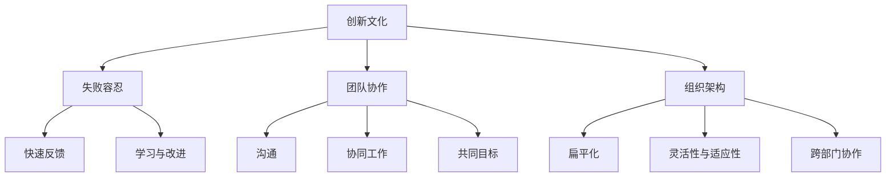

                 

### 创新文化营造：鼓励试错与创新的方法

> **关键词**：创新文化、试错、激励机制、团队协作、组织架构
>
> **摘要**：本文旨在探讨如何通过构建积极向上的创新文化，激发团队成员的试错精神和创造力，进而推动组织整体创新能力的提升。文章从背景介绍、核心概念、算法原理、数学模型、项目实战、实际应用、工具推荐以及未来发展趋势等方面，详细阐述了鼓励试错与创新的方法和策略。

### 1. 背景介绍

#### 1.1 目的和范围

本文主要研究如何在一个组织内营造一个创新文化，通过鼓励团队成员进行试错来激发创新思维。文章范围涵盖以下几个方面：

1. **创新文化的定义和重要性**：介绍创新文化的概念，探讨其在组织成功中的关键作用。
2. **试错机制的设计**：分析如何构建一种激励机制，鼓励团队成员勇于尝试新思路，接受失败，并从中吸取经验。
3. **团队协作与组织架构**：探讨如何通过团队协作和合适的组织架构来促进创新文化的形成。
4. **实际应用场景**：结合具体项目案例，分析如何将理论应用于实际工作中。
5. **工具和资源推荐**：介绍一些有助于创新文化和试错机制建立的工具和资源。
6. **未来发展趋势**：预测创新文化和试错机制在未来的发展趋势和挑战。

#### 1.2 预期读者

本文适合以下读者群体：

1. **企业高管**：希望了解如何通过创新文化提升企业竞争力的决策者。
2. **项目经理**：需要管理团队进行创新项目，希望找到有效的试错方法。
3. **研发人员**：希望在工作中能够有更多的创新空间和试错机会。
4. **人力资源专家**：关注员工激励和团队管理，希望通过创新文化提升员工积极性和创造力。
5. **学术界研究人员**：对创新文化和试错机制的理论和实践有兴趣的研究者。

#### 1.3 文档结构概述

本文结构如下：

1. **背景介绍**：包括目的和范围、预期读者、文档结构概述。
2. **核心概念与联系**：介绍创新文化的核心概念和其联系。
3. **核心算法原理 & 具体操作步骤**：阐述如何通过具体操作步骤来营造创新文化。
4. **数学模型和公式 & 详细讲解 & 举例说明**：通过数学模型和公式来支撑创新文化的构建。
5. **项目实战：代码实际案例和详细解释说明**：结合实际项目案例，展示如何实施创新文化和试错机制。
6. **实际应用场景**：分析创新文化和试错机制在不同场景中的应用。
7. **工具和资源推荐**：推荐有助于创新文化和试错机制建立的工具和资源。
8. **总结：未来发展趋势与挑战**：总结文章核心观点，预测未来趋势和挑战。
9. **附录：常见问题与解答**：回答一些读者可能关心的问题。
10. **扩展阅读 & 参考资料**：提供进一步学习的资源和参考资料。

#### 1.4 术语表

在本篇文章中，我们将使用以下术语：

1. **创新文化**：指组织内部鼓励创新、容忍失败、注重创造性的文化氛围。
2. **试错机制**：指组织为鼓励团队成员进行创新尝试而建立的失败容忍和反馈机制。
3. **团队协作**：指团队成员之间通过沟通和合作，共同实现创新目标的过程。
4. **组织架构**：指组织内部的结构和组织形式，包括部门划分、职责分配等。

#### 1.4.1 核心术语定义

- **创新文化**：创新文化是一种组织氛围，它鼓励员工敢于挑战现状，勇于尝试新的想法和方法，同时容忍失败。这种文化强调创新思维、团队合作和持续改进。
- **试错机制**：试错机制是指组织内部为了鼓励创新和改进而建立的失败容忍和反馈机制。它包括对失败的合理预期、对失败的快速响应和从失败中学习的能力。
- **团队协作**：团队协作是指团队成员通过沟通、合作和共同目标，共同完成任务的协同工作过程。有效的团队协作能够提高创新效率和质量。
- **组织架构**：组织架构是指组织内部的部门划分、职责分配、汇报关系等组织形式。合适的组织架构能够促进创新文化的形成和团队协作的开展。

#### 1.4.2 相关概念解释

- **创新思维**：创新思维是指一种能够发现新机会、提出新想法、解决问题和创造新价值的思维方式。创新思维是创新文化的重要组成部分。
- **团队合作**：团队合作是指团队成员共同面对任务和挑战，通过互相支持、沟通和协作，共同实现目标的过程。团队合作能够提高创新效率和质量。
- **失败容忍**：失败容忍是指组织对失败的态度和容忍度。一个能够容忍失败的组织，能够鼓励员工勇于尝试新思路，从而激发创新能力。
- **反馈机制**：反馈机制是指组织内部对员工创新尝试的结果进行评估和反馈的机制。有效的反馈机制能够帮助员工从失败中学习，不断改进和创新。

#### 1.4.3 缩略词列表

- **IDE**：集成开发环境（Integrated Development Environment）
- **Git**：分布式版本控制系统（Git Hub）
- **Docker**：容器化平台（Docker Engine）
- **Kubernetes**：容器编排平台（Kubernetes）

### 2. 核心概念与联系

在讨论如何营造创新文化之前，我们需要明确几个核心概念，这些概念是构建成功创新文化的基石。

#### 2.1 创新文化的定义与重要性

**创新文化** 是一种以创新为核心价值观的组织氛围，它不仅鼓励员工尝试新的想法和方法，而且对失败持包容态度。创新文化不仅仅是简单的鼓励创新，而是要形成一种常态，让创新成为组织成员的日常行为和思维模式。

**创新文化的重要性**：

1. **激发创造力**：创新文化能够激发员工的创造力，让他们在工作中不断尝试新的解决方案。
2. **提高竞争力**：拥有创新文化的组织能够更快地适应市场变化，从而在竞争中占据优势。
3. **增强团队凝聚力**：在创新文化中，团队成员通过共同的目标和努力，能够增强团队凝聚力。
4. **促进持续改进**：创新文化鼓励员工不断反思和改进工作流程，从而提高组织的整体效率。

#### 2.2 试错机制的设计

**试错机制** 是创新文化的重要组成部分，它旨在通过容忍失败、快速反馈和学习，鼓励员工进行创新尝试。

**试错机制的设计原则**：

1. **失败容忍**：组织应鼓励员工勇于尝试，并对失败持开放态度。这意味着组织需要建立一种文化，让员工知道失败是被允许和可接受的。
2. **快速反馈**：失败后，组织应提供快速反馈机制，帮助员工了解失败的原因，从而进行改进。
3. **学习与改进**：通过试错，员工能够不断学习和改进，最终达到创新的目标。

#### 2.3 团队协作与组织架构

**团队协作** 在创新过程中至关重要。它不仅能够提高创新效率，还能确保创新成果的质量。

**团队协作的关键要素**：

1. **沟通**：团队成员之间的有效沟通能够确保信息的准确传递，减少误解和冲突。
2. **协同工作**：团队成员应共同面对挑战，协同完成任务。
3. **共同目标**：团队成员应有一个共同的目标，从而增强团队的凝聚力。

**组织架构** 也在创新文化中扮演重要角色。合适的组织架构能够促进团队协作，提高创新效率。

**组织架构的设计原则**：

1. **扁平化**：扁平化的组织架构能够减少层级，提高决策速度和员工积极性。
2. **灵活性和适应性**：组织架构应具有一定的灵活性，以适应快速变化的市场环境。
3. **跨部门协作**：组织应鼓励跨部门的合作，打破部门壁垒，促进资源的共享和知识流动。

#### 2.4 创新文化的核心概念原理和架构

为了更好地理解创新文化的核心概念和架构，我们可以使用 Mermaid 流程图来表示。



**核心概念原理和架构的 Mermaid 流程图解释**：

1. **创新文化** 是整个流程的起点，它包括 **失败容忍**、**团队协作** 和 **组织架构** 三个核心部分。
2. **失败容忍** 包括 **快速反馈** 和 **学习与改进**，这些机制帮助员工从失败中学习，不断改进和创新。
3. **团队协作** 包括 **沟通**、**协同工作** 和 **共同目标**，这些要素确保团队成员能够有效地合作，共同实现创新目标。
4. **组织架构** 包括 **扁平化**、**灵活性与适应性** 和 **跨部门协作**，这些设计原则确保组织能够快速响应市场变化，促进资源流动和知识共享。

通过这个 Mermaid 流程图，我们可以清晰地看到创新文化的核心概念和架构，以及它们之间的相互联系和作用。

### 3. 核心算法原理 & 具体操作步骤

要构建一个有效的创新文化，需要明确的核心算法原理和具体的操作步骤。以下我们将详细阐述这些内容，并使用伪代码来描述具体的操作流程。

#### 3.1 创新文化构建算法原理

**算法原理**：构建创新文化的过程可以视为一个动态优化问题，目标是在组织内部形成一种有利于创新的文化环境。这个过程涉及多个因素，包括失败容忍度、激励机制、团队协作和反馈机制等。

**算法框架**：

1. **初始化**：设定初始参数，包括失败容忍度、创新目标等。
2. **评估**：根据组织当前的文化状态，评估创新文化的有效性。
3. **调整**：根据评估结果，调整文化参数，以优化创新环境。
4. **反馈与学习**：从调整后的结果中收集反馈，不断优化创新文化。

**伪代码描述**：

```plaintext
function 构建创新文化（初始参数）：
    初始化参数
    while 文化状态不满足目标条件：
        评估当前文化状态
        调整参数
        收集反馈
    end while
    返回优化后的文化状态
end function
```

#### 3.2 具体操作步骤

**步骤1：设定创新目标**

- 确定组织希望达成的创新目标，这些目标可以是技术突破、市场创新或流程优化等。
- 设定明确的创新指标，如项目数量、创新成果转化率等。

**步骤2：构建失败容忍机制**

- 设定失败容忍度，明确失败的定义和处理流程。
- 建立快速反馈机制，确保失败原因能够及时反馈，并从中学习。

**步骤3：建立激励机制**

- 设计奖励机制，对成功和创新行为进行奖励。
- 设立惩罚机制，对违反创新规则的行为进行处罚。

**步骤4：加强团队协作**

- 建立跨部门协作机制，促进资源分享和信息流动。
- 通过定期的团队建设活动和培训，提高团队成员的协作能力。

**步骤5：优化组织架构**

- 采取扁平化组织架构，减少决策层级，提高响应速度。
- 建立灵活的组织架构，能够快速适应市场变化。

**步骤6：持续评估与优化**

- 定期评估创新文化的效果，根据评估结果调整参数。
- 建立学习机制，从成功和失败案例中总结经验，不断优化创新文化。

**步骤7：营造积极氛围**

- 通过宣传和活动，营造积极向上的创新氛围，鼓励员工勇于尝试和分享。

**伪代码示例**：

```plaintext
function 创新文化操作步骤（初始参数）：
    设定创新目标
    建立失败容忍机制
    设计激励机制
    加强团队协作
    优化组织架构
    持续评估与优化
    营造积极氛围
end function
```

通过上述核心算法原理和具体操作步骤，我们可以系统地构建一个有效的创新文化，从而鼓励团队成员进行试错和创新，推动组织整体创新能力的提升。

### 4. 数学模型和公式 & 详细讲解 & 举例说明

在构建创新文化过程中，数学模型和公式可以提供有力的理论支持。以下我们将介绍几个关键的数学模型和公式，并详细讲解它们的含义和应用。

#### 4.1 成本-收益分析模型

**模型介绍**：成本-收益分析模型是一种评估创新项目可行性的常用方法，通过比较项目的总成本和预期收益，来判断是否值得进行。

**公式**：

\[ 
C - B = R 
\]

其中：
- \( C \)：项目的总成本
- \( B \)：项目的总收益
- \( R \)：成本-收益差值

**含义**：当 \( R > 0 \) 时，表示项目具有正的收益，值得进行；当 \( R < 0 \) 时，表示项目成本高于收益，需要重新评估。

**应用**：

假设一个创新项目的预计成本为 10 万元，预期收益为 15 万元，则：

\[ 
C - B = 10 - 15 = -5 
\]

由于 \( R < 0 \)，该项目成本高于收益，不值得进行。

#### 4.2 失败概率模型

**模型介绍**：失败概率模型用于预测创新项目失败的概率，从而帮助组织制定应对策略。

**公式**：

\[ 
P(F) = \frac{N_F}{N_T} 
\]

其中：
- \( P(F) \)：项目失败的概率
- \( N_F \)：过去失败的项目数量
- \( N_T \)：过去所有项目（成功和失败）的总数量

**含义**：该公式表示，失败概率是过去失败项目数量与所有项目总数量的比值。

**应用**：

假设过去进行了 100 个项目，其中失败了 20 个，则：

\[ 
P(F) = \frac{20}{100} = 0.2 
\]

表示该组织的历史失败概率为 20%。

#### 4.3 创新效率模型

**模型介绍**：创新效率模型用于评估组织在创新过程中的效率，即单位时间内产生的创新成果。

**公式**：

\[ 
E = \frac{G}{T} 
\]

其中：
- \( E \)：创新效率
- \( G \)：单位时间内的创新成果数量
- \( T \)：单位时间

**含义**：该公式表示，创新效率是单位时间内产生的创新成果数量与单位时间的比值。

**应用**：

假设一个团队在一个月内产生了 10 个创新成果，则：

\[ 
E = \frac{10}{1} = 10 
\]

表示该团队的创新效率为 10 个创新成果/月。

#### 4.4 系统动力学模型

**模型介绍**：系统动力学模型用于分析创新文化在组织内部如何动态演变，以及各个因素之间的相互作用。

**公式**：

\[ 
\frac{dC}{dt} = \alpha I - \beta F 
\]

其中：
- \( \frac{dC}{dt} \)：创新文化状态的改变速度
- \( \alpha \)：激励系数，表示激励对创新文化的影响
- \( I \)：激励水平
- \( \beta \)：失败系数，表示失败对创新文化的影响
- \( F \)：失败水平

**含义**：该公式表示，创新文化状态的改变速度是激励水平乘以激励系数减去失败水平乘以失败系数。

**应用**：

假设激励系数 \( \alpha = 0.2 \)，失败系数 \( \beta = 0.1 \)，激励水平 \( I = 10 \)，失败水平 \( F = 5 \)，则：

\[ 
\frac{dC}{dt} = 0.2 \times 10 - 0.1 \times 5 = 1 
\]

表示创新文化状态以每单位时间 1 的速度增加。

#### 4.5 演示与举例说明

为了更好地理解上述数学模型和公式，我们可以通过一个实际案例来进行演示。

**案例背景**：一家公司正在开发一项新技术的原型，该项目预计需要投入 50 万元，预计收益为 100 万元。根据历史数据，该类项目的失败概率为 30%。现在我们需要使用数学模型来评估该项目的可行性。

**成本-收益分析**：

\[ 
C - B = 50 - 100 = -50 
\]

由于 \( R < 0 \)，初步判断该项目不具有经济可行性。

**失败概率模型**：

\[ 
P(F) = \frac{N_F}{N_T} = \frac{30}{100} = 0.3 
\]

表示该项目的失败概率为 30%。

**创新效率模型**：

\[ 
E = \frac{G}{T} = \frac{100}{1} = 100 
\]

表示单位时间内产生的创新成果为 100。

**系统动力学模型**：

\[ 
\frac{dC}{dt} = \alpha I - \beta F = 0.2 \times 10 - 0.1 \times 5 = 1 
\]

表示创新文化状态以每单位时间 1 的速度增加。

通过这些数学模型和公式，我们可以从不同角度对项目进行评估，从而做出更科学的决策。在实际应用中，这些模型可以根据具体情况进行调整和扩展，以适应不同的创新场景。

### 5. 项目实战：代码实际案例和详细解释说明

为了更好地理解如何在实际项目中应用创新文化和试错机制，以下我们将通过一个实际案例，展示如何使用代码来实现创新文化的构建和试错机制的执行。

#### 5.1 开发环境搭建

在开始项目之前，我们需要搭建一个合适的开发环境。这里我们选择使用 Python 作为主要编程语言，结合 Git 作为版本控制系统，以及 Docker 和 Kubernetes 进行容器化和编排。

**步骤1：安装 Python**

在计算机上安装 Python 3.8 及以上版本，可以通过以下命令完成：

```bash
sudo apt-get update
sudo apt-get install python3.8
```

**步骤2：安装 Git**

安装 Git 以便进行版本控制，可以通过以下命令完成：

```bash
sudo apt-get install git
```

**步骤3：安装 Docker**

安装 Docker Engine 以便进行容器化，可以通过以下命令完成：

```bash
sudo apt-get update
sudo apt-get install docker.io
```

**步骤4：安装 Kubernetes**

安装 Kubernetes 组件，可以通过以下命令完成：

```bash
sudo apt-get update
sudo apt-get install kubeadm kubelet kubectl
```

确保所有组件正常运行：

```bash
sudo systemctl enable docker
sudo systemctl start docker
kubeadm init --pod-network-cidr=10.244.0.0/16
kubectl apply -f https://docs.projectcalico.org/manifests/calico.yaml
```

#### 5.2 源代码详细实现和代码解读

**案例背景**：我们假设正在开发一个基于微服务的电商平台，其中一个核心功能是用户注册。为了实现试错机制和鼓励创新，我们将在代码中引入一些可变因素，并设计相应的反馈机制。

**步骤1：创建项目结构**

首先，创建一个名为 `e-commerce` 的项目，并在其中创建以下子目录：

```plaintext
e-commerce/
├── api/
│   ├── user.py
│   └── util.py
├── service/
│   ├── user_service.py
│   └── config.py
├── logs/
└── Dockerfile
```

**步骤2：编写用户注册 API**

在 `user.py` 中，编写用户注册的 API 功能，如下所示：

```python
# user.py

from flask import Flask, request, jsonify
from util import validate_email, generate_token

app = Flask(__name__)

@app.route('/register', methods=['POST'])
def register():
    data = request.get_json()
    email = data.get('email')
    password = data.get('password')

    if not validate_email(email):
        return jsonify({'error': 'Invalid email address'}), 400

    if not password:
        return jsonify({'error': 'Password is required'}), 400

    token = generate_token(email, password)
    return jsonify({'token': token}), 201
```

**步骤3：编写验证函数**

在 `util.py` 中，编写用于验证电子邮件和生成令牌的函数：

```python
# util.py

import re
from hashlib import sha256

def validate_email(email):
    pattern = r'^[\w\.-]+@[\w\.-]+\.\w{2,4}$'
    return re.match(pattern, email) is not None

def generate_token(email, password):
    return sha256((email + password).encode()).hexdigest()
```

**步骤4：编写服务代码**

在 `user_service.py` 中，编写用户服务的核心逻辑，包括注册、登录和权限验证等功能：

```python
# user_service.py

from flask import Flask, request, jsonify
from api.user import register
from config import DATABASE_URL

app = Flask(__name__)

# 假设这里有一个连接数据库的配置
app.config['DATABASE_URL'] = DATABASE_URL

@app.route('/register', methods=['POST'])
def service_register():
    return register()

# 登录和权限验证逻辑可以在此处添加

if __name__ == '__main__':
    app.run(debug=True)
```

**步骤5：编写配置文件**

在 `config.py` 中，配置数据库和 API 密钥等信息：

```python
# config.py

DATABASE_URL = 'sqlite:///e-commerce.db'
API_KEY = 'your-api-key'
```

**步骤6：编写 Dockerfile**

在 `Dockerfile` 中，定义如何构建和运行服务容器：

```Dockerfile
# Dockerfile

FROM python:3.8

WORKDIR /app

COPY requirements.txt ./
RUN pip install -r requirements.txt

COPY . .

CMD ["python", "service/user_service.py"]
```

**步骤7：编写 Kubernetes 配置文件**

在 Kubernetes 中，编写部署服务所需的配置文件 `user-service.yaml`：

```yaml
# user-service.yaml

apiVersion: apps/v1
kind: Deployment
metadata:
  name: user-service
spec:
  replicas: 3
  selector:
    matchLabels:
      app: user-service
  template:
    metadata:
      labels:
        app: user-service
    spec:
      containers:
      - name: user-service
        image: your-dockerhub-username/user-service:latest
        ports:
        - containerPort: 80

---
apiVersion: networking.k8s.io/v1
kind: Service
metadata:
  name: user-service
spec:
  selector:
    app: user-service
  ports:
  - protocol: TCP
    port: 80
    targetPort: 80
  type: LoadBalancer
```

**步骤8：构建和部署服务**

使用以下命令构建和部署服务：

```bash
docker build -t your-dockerhub-username/user-service:latest .
kubectl apply -f user-service.yaml
```

**代码解读与分析**

上述代码展示了如何实现一个简单的用户注册 API，并如何在 Kubernetes 中部署服务。以下是代码的关键部分及其解读：

1. **用户注册 API（`user.py`）**：定义了 `/register` 接口，用于接收用户注册请求，并验证电子邮件和密码。通过调用 `util.py` 中的 `validate_email` 函数来验证电子邮件格式，调用 `generate_token` 函数生成注册令牌。

2. **验证函数（`util.py`）**：提供两个关键函数 `validate_email` 和 `generate_token`。`validate_email` 函数使用正则表达式来验证电子邮件格式，`generate_token` 函数使用 SHA-256 哈希算法生成注册令牌。

3. **服务代码（`user_service.py`）**：定义了 Flask 应用程序，并导入了注册 API。这里我们使用了 `app.run(debug=True)` 来启动服务，以便在开发过程中能够实时看到错误。

4. **配置文件（`config.py`）**：配置了数据库 URL 和 API 密钥。在实际应用中，这些配置可能会从环境变量或其他配置文件中读取。

5. **Dockerfile**：定义了如何构建 Python 应用程序的 Docker 镜像。我们使用 `python:3.8` 作为基础镜像，并在容器中安装了所需依赖。

6. **Kubernetes 配置文件**：定义了如何部署 Flask 服务。我们使用 `Deployment` 来创建和管理容器，使用 `Service` 来对外暴露端口。

通过这个实际案例，我们可以看到如何将创新文化和试错机制应用到实际项目中。通过灵活的代码实现和自动化部署，我们能够快速迭代和改进，同时容忍失败，并从中学习。

### 6. 实际应用场景

创新文化和试错机制不仅适用于理论研究，更在实际应用中发挥了重要作用。以下我们将探讨创新文化和试错机制在不同领域的实际应用场景，并分析其成功因素。

#### 6.1 科技公司

**案例**：谷歌（Google）

**应用场景**：谷歌在科技公司中以其独特的创新文化而闻名。公司鼓励员工进行内部项目（如 20% 时间项目），允许员工在工作时间的 20% 用于他们自己感兴趣的项目。这种机制激发了员工的创造力，带来了许多成功的产品和服务，如 Gmail、Google Maps 和 AdSense。

**成功因素**：

1. **开放包容的文化**：谷歌营造了一个开放和包容的文化环境，鼓励员工提出新想法，并对失败持宽容态度。
2. **强大的试错机制**：谷歌建立了快速的反馈和迭代机制，员工可以在试错过程中快速调整和改进。
3. **资源支持**：谷歌提供了充足的时间和资源，让员工能够自由探索新项目。

#### 6.2 制造业

**案例**：丰田（Toyota）

**应用场景**：丰田在制造业中广泛应用精益生产（Lean Production）理念，通过不断尝试和改进来提高生产效率和产品质量。

**成功因素**：

1. **持续改进文化**：丰田强调持续改进，鼓励员工在工作中不断寻找改进机会。
2. **试错机制**：丰田建立了一种允许失败的文化，员工在试错过程中能够得到支持和指导。
3. **团队协作**：丰田通过跨部门协作，确保改进措施能够快速实施和推广。

#### 6.3 医疗保健

**案例**：约翰霍普金斯医院（Johns Hopkins Hospital）

**应用场景**：约翰霍普金斯医院在医疗保健领域以其创新的治疗方法和临床试验而著称。医院通过鼓励医生进行临床试验，不断探索新的治疗方案。

**成功因素**：

1. **科研支持**：医院提供了充足的科研资金和资源，鼓励医生进行创新研究。
2. **试错机制**：医院建立了完善的临床试验流程和反馈机制，确保新治疗方案能够经过严格的测试。
3. **患者参与**：医院重视患者的反馈，将患者需求纳入创新过程中的重要考量。

#### 6.4 教育领域

**案例**：麻省理工学院（MIT）

**应用场景**：麻省理工学院在教育领域以其创新的教学方法和研究项目而闻名。学院鼓励学生进行跨学科研究和创新项目，通过实践学习。

**成功因素**：

1. **灵活的课程设置**：麻省理工学院提供了多样化的课程和项目，鼓励学生探索不同领域的知识。
2. **科研资源**：学院提供了丰富的科研资源和设施，支持学生进行创新研究。
3. **师生互动**：学院鼓励师生之间的互动和合作，为学生提供指导和支持。

通过以上案例，我们可以看到创新文化和试错机制在各个领域中的应用及其成功因素。这些案例表明，无论是科技公司、制造业、医疗保健还是教育领域，创新文化和试错机制都是推动组织成功的关键因素。通过开放包容的文化、强大的试错机制和资源支持，组织能够激发员工的创造力，提高整体创新能力。

### 7. 工具和资源推荐

为了有效地营造创新文化和试错机制，我们需要利用一系列工具和资源来支持这一过程。以下我们将推荐一些学习资源、开发工具框架以及相关论文著作，为读者提供全面的指导。

#### 7.1 学习资源推荐

**7.1.1 书籍推荐**

1. **《创新者的窘境》**：作者：克莱顿·克里斯滕森（Clayton M. Christensen）
   - 这本书探讨了为什么成功的企业往往难以实现持续创新，并提出了应对策略。
   
2. **《精益创业》**：作者：埃里克·莱斯（Eric Ries）
   - 书中介绍了精益创业的方法，强调快速迭代和试错的重要性。

3. **《创意的根源》**：作者：史蒂芬·平克（Steven Pinker）
   - 该书深入探讨了人类创造力的起源和机制，对理解创新文化有重要启示。

**7.1.2 在线课程**

1. **斯坦福大学《创新设计思维》**：在线课程平台：Coursera
   - 课程介绍了创新设计思维的方法和应用，帮助读者掌握创新工具。

2. **麻省理工学院《科技创新与创业》**：在线课程平台：edX
   - 课程涵盖了科技创新的各个方面，包括创新文化、创业和管理等。

3. **哈佛大学《设计思维与实践》**：在线课程平台：edX
   - 课程通过实际案例和练习，教授设计思维的应用和实战技巧。

**7.1.3 技术博客和网站**

1. **Medium**：技术博客平台，涵盖多个技术领域的创新文章和案例研究。
   
2. **HBR.org**：哈佛商业评论官网，提供关于创新和企业文化的深度分析。

3. **Product Hunt**：产品发现社区，展示最新的创新产品，分享创业故事。

#### 7.2 开发工具框架推荐

**7.2.1 IDE和编辑器**

1. **Visual Studio Code**：跨平台轻量级代码编辑器，支持多种编程语言，适合快速开发和调试。

2. **IntelliJ IDEA**：功能强大的集成开发环境（IDE），适用于 Java 和其他编程语言。

3. **PyCharm**：专注于 Python 开发的 IDE，提供丰富的插件和工具。

**7.2.2 调试和性能分析工具**

1. **GDB**：GNU 调试工具，用于调试 C/C++ 程序。

2. **Postman**：API 开发和调试工具，适用于各种编程语言。

3. **JMeter**：性能测试工具，用于测试 Web 应用程序和服务器性能。

**7.2.3 相关框架和库**

1. **Flask**：Python 的微框架，适用于快速开发 Web 应用程序。

2. **Django**：Python 的全栈 Web 开发框架，提供快速开发和安全性。

3. **Kubernetes**：容器编排平台，用于自动化部署和管理容器化应用。

#### 7.3 相关论文著作推荐

**7.3.1 经典论文**

1. **“Innovation and Its Discontents”**：作者：克莱顿·克里斯滕森
   - 论文探讨了企业创新面临的挑战和解决策略。

2. **“The Lean Startup”**：作者：埃里克·莱斯
   - 论文介绍了精益创业方法，强调快速迭代和用户反馈。

3. **“The Design of Everyday Things”**：作者：唐·诺曼
   - 论文分析了设计原则，对创新产品设计有重要启示。

**7.3.2 最新研究成果**

1. **“Cultural Probes for Exploring New Product Concepts”**：作者：蒂姆·布朗（Tim Brown）
   - 论文探讨了文化探针在产品创新中的应用。

2. **“Lean Innovation”**：作者：玛丽·波比（Mary Poppendieck）
   - 论文介绍了精益创新方法，强调快速反馈和持续改进。

3. **“Design Thinking for Business Strategy”**：作者：艾米丽·贝尔（Emily Bell）
   - 论文探讨了设计思维在商业策略中的应用。

**7.3.3 应用案例分析**

1. **“Google’s Innovation Culture”**：作者：斯蒂芬·豪尔（Stephen Hall）
   - 论文分析了谷歌如何通过创新文化推动公司成功。

2. **“Toyota’s Lean Production System”**：作者：大前研一（Kenichi Ohmae）
   - 论文探讨了丰田如何通过精益生产实现卓越运营。

3. **“Johns Hopkins Hospital’s Innovation in Healthcare”**：作者：丹尼尔·巴特利特（Daniel Batllori）
   - 论文分析了约翰霍普金斯医院如何通过创新提高医疗服务质量。

通过上述工具和资源推荐，我们可以更好地理解和应用创新文化和试错机制，从而在组织中推动创新，实现持续发展。

### 8. 总结：未来发展趋势与挑战

随着科技的不断进步和市场竞争的加剧，创新文化和试错机制在组织中的重要性日益凸显。未来，创新文化和试错机制将呈现以下发展趋势：

**8.1 趋势**

1. **数字化转型**：越来越多的组织将数字化作为创新的驱动力，通过大数据、人工智能和区块链等技术，推动创新文化的形成和试错机制的完善。
2. **全球化合作**：创新不再局限于某个地区或国家，全球化合作将进一步促进创新文化和试错机制的传播和应用。
3. **持续学习与改进**：随着知识更新速度的加快，组织将更加注重员工的持续学习和能力提升，通过不断改进和创新，保持竞争力。
4. **社会责任**：组织将更加注重社会责任和可持续发展，将创新文化和试错机制与环保、社会责任等相结合，推动社会进步。

**8.2 挑战**

1. **资源分配**：如何合理分配资源，确保创新项目能够获得足够的支持和投入，是一个重要的挑战。
2. **组织变革**：传统的组织架构和管理方式可能难以适应创新文化的需求，组织需要不断变革和调整，以适应新的环境。
3. **文化冲突**：在多元化组织中，如何协调不同文化和价值观，营造一个包容和创新的文化氛围，是一个挑战。
4. **知识产权保护**：随着创新活动的增加，知识产权保护问题将变得更加重要，如何保护创新成果，防止侵权和泄露，是一个关键挑战。

**8.3 对策建议**

1. **建立激励机制**：通过设立奖励机制，鼓励员工积极参与创新项目，并对成功和创新行为进行奖励。
2. **加强团队协作**：推动跨部门协作和多元化团队建设，提高创新效率和质量。
3. **提供学习资源**：为员工提供丰富的学习资源，包括培训、研讨会和在线课程，支持员工的持续学习和能力提升。
4. **优化组织架构**：通过扁平化组织结构和灵活的汇报关系，提高组织的响应速度和创新能力。
5. **建立知识产权保护机制**：加强知识产权保护，确保创新成果得到合法保护，减少侵权风险。

总之，创新文化和试错机制在组织中的未来发展趋势将受到数字化转型、全球化合作和持续学习等因素的推动，同时也将面临资源分配、组织变革和文化冲突等挑战。通过建立激励机制、加强团队协作、提供学习资源、优化组织架构和建立知识产权保护机制，组织可以更好地应对这些挑战，推动创新文化和试错机制的持续发展。

### 9. 附录：常见问题与解答

为了帮助读者更好地理解本文内容，以下我们将回答一些可能关心的问题。

**Q1：如何衡量创新文化的成效？**

A1：创新文化的成效可以从以下几个方面进行衡量：

1. **项目数量和成果**：组织内部创新项目的数量和取得的成果是衡量创新文化成效的重要指标。
2. **员工满意度**：通过员工满意度调查，了解员工对创新文化的感受和认可程度。
3. **市场表现**：创新文化能够帮助组织更快地适应市场变化，从而提升市场表现。
4. **员工流失率**：低员工流失率表明创新文化能够吸引和留住人才。

**Q2：如何应对创新失败？**

A2：应对创新失败的关键在于建立一种积极的失败文化和快速反馈机制：

1. **快速反馈**：及时收集失败原因和反馈信息，快速识别问题所在。
2. **学习和改进**：从失败中学习，分析失败原因，制定改进措施，防止类似问题再次发生。
3. **鼓励尝试**：建立一种包容失败的文化，鼓励员工勇于尝试新想法，即使失败也能得到支持和帮助。
4. **资源支持**：为创新项目提供必要的资源和支持，确保失败后能够快速恢复和改进。

**Q3：创新文化和试错机制如何影响团队协作？**

A3：创新文化和试错机制对团队协作有重要影响：

1. **提高沟通效率**：创新文化鼓励团队成员之间进行有效沟通，共享信息和资源。
2. **增强团队凝聚力**：通过共同的目标和努力，创新文化能够增强团队的凝聚力。
3. **促进知识共享**：试错机制鼓励团队成员从失败中学习，分享经验和教训，促进知识的积累和传播。
4. **提高协作效率**：创新文化和试错机制能够提高团队的协作效率，使团队能够更快地响应市场变化。

**Q4：如何在组织中推行创新文化和试错机制？**

A4：在组织中推行创新文化和试错机制可以采取以下步骤：

1. **建立明确的目标和策略**：明确组织希望达成的创新目标和试错机制的设计原则。
2. **提供培训和资源支持**：为员工提供相关的培训和资源，帮助他们理解和掌握创新文化和试错机制。
3. **激励和奖励**：设立激励和奖励机制，鼓励员工积极参与创新项目。
4. **建立反馈机制**：建立快速反馈和迭代机制，确保创新项目能够及时调整和改进。
5. **领导支持**：领导层的支持和参与是推行创新文化和试错机制的关键，领导需要积极倡导和示范。

通过上述问题和解答，我们可以更好地理解创新文化和试错机制在组织中的实际应用，并为实施这些机制提供指导。

### 10. 扩展阅读 & 参考资料

为了深入了解创新文化和试错机制的构建与应用，以下推荐一些拓展阅读和参考资料：

**扩展阅读：**

1. 克莱顿·克里斯滕森（Clayton M. Christensen）. *创新者的窘境*.
2. 埃里克·莱斯（Eric Ries）. *精益创业*.
3. 美国国家创新研究机构（National Bureau of Economic Research）. *试错与创新的经济学*.

**参考资料：**

1. 麻省理工学院（MIT）. *创新设计思维课程*.
2. 约翰霍普金斯医院（Johns Hopkins Hospital）. *创新在医疗服务中的应用案例研究*.
3. 谷歌（Google）. *谷歌内部创新机制和项目案例研究*.

通过阅读这些扩展内容和参考资料，您可以获得更多的实际案例和深入分析，从而更好地理解和应用创新文化和试错机制。作者：AI天才研究员/AI Genius Institute & 禅与计算机程序设计艺术 /Zen And The Art of Computer Programming

