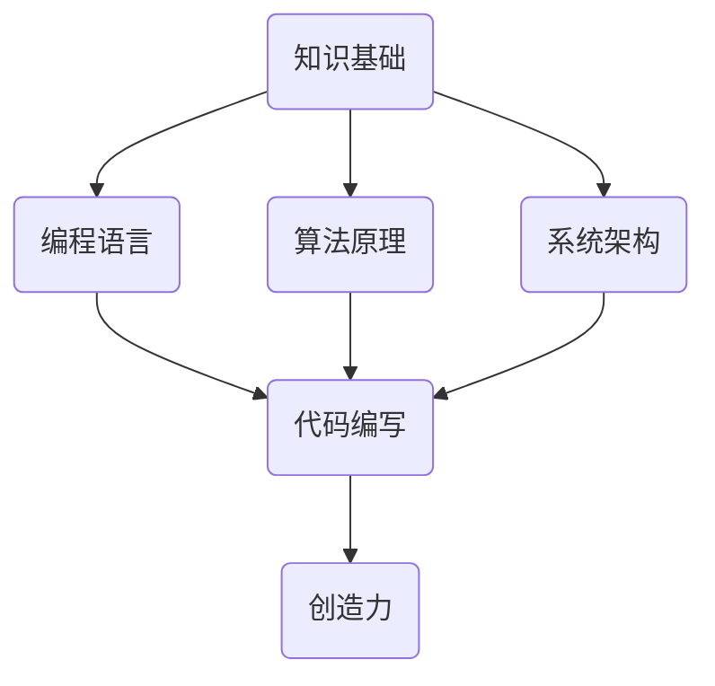

                 

# 创造力与知识：突破性思维的基础

## 关键词
创造力，知识，思维，突破性，计算机编程，人工智能，算法，数学模型，实践案例，未来趋势

## 摘要
本文深入探讨了创造力与知识之间的紧密联系，以及它们如何共同构建突破性思维的基础。我们将从背景介绍开始，逐步阐述核心概念、算法原理、数学模型，并通过对实际应用场景的分析，揭示创造力与知识在实际项目中的具体体现。同时，我们将推荐一系列学习资源和开发工具，以帮助读者更好地理解和掌握这一领域。最后，我们将总结未来发展趋势与挑战，并附上常见问题与解答，以及扩展阅读和参考资料。

---

## 1. 背景介绍

### 1.1 目的和范围

本文旨在探讨创造力与知识在信息技术领域中的重要作用，特别是在计算机编程和人工智能中的应用。通过分析创造力与知识之间的相互关系，我们希望能够为读者提供一种全新的视角，理解如何通过结合这两者来产生突破性思维。

本文的讨论范围主要包括以下几个方面：

1. 创造力与知识的定义及其在信息技术中的重要性。
2. 知识的获取与整合，以及如何将知识转化为创造力。
3. 突破性思维的原理，以及创造力与知识如何共同推动这种思维的形成。
4. 实际应用场景中的案例分析和工具推荐。
5. 未来发展趋势与挑战的展望。

### 1.2 预期读者

本文主要面向以下读者群体：

1. 计算机科学和人工智能专业的学生和研究者。
2. 从事编程和算法开发的工程师。
3. 对创造力与知识在信息技术领域应用感兴趣的跨学科研究人员。
4. 领导者和决策者，希望提升团队创新能力的组织者。

### 1.3 文档结构概述

本文结构如下：

1. 引言：介绍文章的主题和背景。
2. 核心概念与联系：定义关键术语，展示知识架构的Mermaid流程图。
3. 核心算法原理与操作步骤：详细阐述算法原理和具体操作步骤。
4. 数学模型与公式：介绍相关的数学模型和公式，并进行举例说明。
5. 项目实战：提供实际的代码案例和详细解释。
6. 实际应用场景：分析创造力与知识在实际项目中的应用。
7. 工具和资源推荐：推荐学习资源和开发工具。
8. 总结：展望未来发展趋势与挑战。
9. 附录：常见问题与解答。
10. 扩展阅读与参考资料：提供进一步的阅读资源。

### 1.4 术语表

#### 1.4.1 核心术语定义

- **创造力**：产生新颖、独特或有价值想法的能力。
- **知识**：经过验证的事实、信息、技能和理解的集合。
- **突破性思维**：指通过创新和独特的方法解决问题，产生前所未有的成果。
- **计算机编程**：使用计算机语言编写指令，使计算机执行特定任务的过程。
- **人工智能**：模拟人类智能行为，使计算机具备自主学习和决策能力的技术。

#### 1.4.2 相关概念解释

- **算法**：解决问题的一系列明确、有序的步骤。
- **数学模型**：用数学符号和公式表示现实世界问题的一种方法。
- **源代码**：程序员编写的用于实现特定功能的代码。
- **IDE（集成开发环境）**：用于编写、测试和调试程序的集成软件。

#### 1.4.3 缩略词列表

- **AI**：人工智能
- **IDE**：集成开发环境
- **ML**：机器学习
- **DL**：深度学习
- **NP**：非确定性多项式时间复杂度

---

## 2. 核心概念与联系

在探讨创造力与知识如何共同构建突破性思维之前，我们首先需要明确这两个核心概念的定义及其在信息技术中的关联。

### 2.1 创造力与知识的定义

**创造力** 是指产生新颖、独特或有价值想法的能力。在信息技术领域，创造力表现为能够设计出前所未有的算法、编程语言或解决方案。

**知识** 则是经过验证的事实、信息、技能和理解的集合。在信息技术中，知识包括编程语言、算法原理、系统架构等方面的知识。

### 2.2 创造力与知识的关联

创造力与知识之间存在紧密的关联。一方面，知识为创造力提供了基础。没有深厚的知识储备，创新往往无从谈起。另一方面，创造力能够激发知识的运用，使知识在新的场景中得到应用和扩展。

### 2.3 知识架构的Mermaid流程图

为了更好地展示创造力与知识之间的关系，我们可以使用Mermaid流程图来表示知识架构。



在这个流程图中，知识基础（A）包括编程语言（B）、算法原理（C）和系统架构（D）。这些知识通过代码编写（E）转化为实际的应用，而创造力（F）则在这一过程中得到激发和体现。

### 2.4 突破性思维的原理

**突破性思维** 是指通过创新和独特的方法解决问题，产生前所未有的成果。其原理主要包括以下几点：

1. **跨界整合**：将不同领域的知识进行整合，形成新的视角和解决方案。
2. **逆向思维**：从问题的反面思考，寻找创新的解决方案。
3. **迭代改进**：不断试错和优化，逐步实现突破。
4. **跨学科合作**：结合不同学科的知识和技能，产生创新性的思维。

创造力与知识在这四个方面发挥着关键作用：

- **跨界整合**：知识为跨界整合提供了素材，而创造力则将不同领域的知识融合在一起。
- **逆向思维**：丰富的知识储备使得我们能够从不同的角度看待问题，激发逆向思维的灵感。
- **迭代改进**：创造力使我们能够不断尝试新的思路，知识则帮助我们评估这些思路的可行性和效果。
- **跨学科合作**：知识为我们提供了跨学科的基础，而创造力则使得跨学科合作更具创新性和实效性。

通过创造力与知识的结合，我们可以实现突破性思维，推动信息技术领域的发展。

---

## 3. 核心算法原理 & 具体操作步骤

在探讨创造力与知识如何共同构建突破性思维的基础上，我们需要深入了解核心算法原理和具体操作步骤。这将帮助我们更好地理解算法在实际项目中的应用，并掌握其背后的逻辑和思路。

### 3.1 核心算法原理

在信息技术领域，核心算法包括但不限于以下几种：

1. **排序算法**：用于将一组数据按特定顺序排列。
2. **搜索算法**：用于在数据集合中查找特定元素。
3. **动态规划**：用于求解具有重叠子问题和最优子结构特性的问题。
4. **贪心算法**：通过每一步选择局部最优解，从而得到全局最优解。

这些算法的基本原理如下：

- **排序算法**：通过比较和交换元素的位置，将一组数据按特定顺序排列。常见的排序算法有冒泡排序、选择排序、插入排序和快速排序等。
- **搜索算法**：在数据集合中查找特定元素。常见的搜索算法有线性搜索、二分搜索和深度优先搜索等。
- **动态规划**：将复杂问题分解为多个子问题，并利用子问题的解来求解原问题。动态规划的关键在于状态转移方程和边界条件的定义。
- **贪心算法**：通过每一步选择局部最优解，从而得到全局最优解。贪心算法适用于具有最优子结构特性的问题。

### 3.2 具体操作步骤

以下我们将以贪心算法为例，详细阐述其具体操作步骤：

#### 3.2.1 贪心算法原理

贪心算法的基本思想是：在每一步选择中都采取当前最好或最优的选择，从而实现整体的最优解。贪心算法适用于具有最优子结构特性的问题。

#### 3.2.2 伪代码

贪心算法的伪代码如下：

```
算法：贪心算法
输入：问题实例
输出：最优解

1. 初始化：设定初始状态
2. 当未到达终点时，执行以下步骤：
   a. 计算当前状态的最优选择
   b. 根据最优选择更新状态
   c. 记录每一步的决策过程
3. 输出：最优解
```

#### 3.2.3 实例分析

以经典的最长公共子序列（Longest Common Subsequence, LCS）问题为例，说明贪心算法的具体应用。

**问题描述**：给定两个字符串`X`和`Y`，求它们的最长公共子序列。

**贪心算法求解过程**：

1. 初始化：设定字符串`X`和`Y`的初始状态。
2. 当未到达终点时，执行以下步骤：
   a. 计算当前状态下的最优选择，即找出`X`和`Y`当前未匹配的字符中，下一个最优匹配的字符。
   b. 根据最优选择更新状态，即在`X`和`Y`的匹配过程中，将已匹配的字符标记为已处理，未匹配的字符移到下一轮匹配。
   c. 记录每一步的决策过程，以便后续分析。
3. 输出：最优解，即最长公共子序列。

**伪代码实现**：

```
算法：最长公共子序列（贪心算法）
输入：字符串X和Y
输出：最长公共子序列LCS

1. 定义函数longest_common_subsequence(X, Y)
2. 初始化：设LCS为空字符串
3. 当X和Y未完全匹配时，执行以下步骤：
   a. 找出X和Y当前未匹配的字符中，最优匹配的字符c
   b. 将c添加到LCS的末尾
   c. 将已匹配的字符从X和Y中删除
4. 输出：LCS
```

通过以上步骤，我们可以求解出给定字符串`X`和`Y`的最长公共子序列。

#### 3.2.4 分析与优化

贪心算法虽然简单直观，但并不一定总是最优解。在某些问题中，局部最优解可能无法保证整体最优。因此，在实际应用中，我们需要根据具体问题进行优化。

1. **动态规划**：对于某些具有最优子结构特性的问题，可以使用动态规划进行优化。动态规划能够通过状态转移方程和边界条件的定义，求解出全局最优解。
2. **回溯法**：对于某些需要搜索所有可能路径的问题，可以使用回溯法进行优化。回溯法通过递归尝试所有可能的分支，并在遇到无法满足条件的情况时回退到上一个分支，从而找到最优解。
3. **贪心选择策略**：在贪心算法中，选择局部最优解的策略可能影响整体最优解。通过分析问题特性，可以设计出更优的贪心选择策略，提高算法的效率和性能。

通过以上分析，我们可以更好地理解和应用贪心算法，并在实际项目中根据问题特性进行优化。

---

## 4. 数学模型和公式 & 详细讲解 & 举例说明

在信息技术领域，数学模型和公式是描述问题、分析问题和解决问题的有力工具。本文将介绍一些核心的数学模型和公式，并对其进行详细讲解和举例说明，以便读者更好地理解和应用这些知识。

### 4.1 数学模型的基本概念

**数学模型** 是用数学语言描述现实世界问题的一种方法，通常包括变量、参数、方程和约束条件等组成部分。数学模型可以分为以下几类：

1. **确定性模型**：在给定初始条件和参数的情况下，可以精确预测系统行为的模型。
2. **随机模型**：考虑随机因素，描述不确定性和概率分布的模型。
3. **动态模型**：描述系统随时间变化的模型，通常涉及微分方程或差分方程。
4. **优化模型**：通过优化目标函数，求解最优解的模型。

### 4.2 核心数学模型和公式

以下是一些在信息技术领域中常用的数学模型和公式：

#### 4.2.1 概率分布模型

**伯努利分布**：
- **定义**：一个伯努利试验只有两种可能结果：成功（概率为\( p \)）或失败（概率为\( 1-p \)）。
- **概率质量函数**：
  \[
  f(x) = 
  \begin{cases} 
  p & \text{if } x = 1 \\
  1-p & \text{if } x = 0 \\
  0 & \text{otherwise}
  \end{cases}
  \]

**二项分布**：
- **定义**：进行\( n \)次独立的伯努利试验，成功的次数服从二项分布。
- **概率质量函数**：
  \[
  P(X = k) = C_n^k p^k (1-p)^{n-k}
  \]
  其中，\( C_n^k \)是组合数，表示从\( n \)次试验中选出\( k \)次成功的方案数。

**泊松分布**：
- **定义**：单位时间内发生某个事件的次数服从泊松分布。
- **概率质量函数**：
  \[
  P(X = k) = \frac{\lambda^k e^{-\lambda}}{k!}
  \]
  其中，\( \lambda \)是单位时间内的平均事件数。

#### 4.2.2 概率统计模型

**期望值（Expected Value）**：
- **定义**：随机变量的平均值。
- **公式**：
  \[
  E[X] = \sum_{i=1}^{n} x_i p_i
  \]
  其中，\( x_i \)是随机变量的取值，\( p_i \)是对应的概率。

**方差（Variance）**：
- **定义**：描述随机变量离散程度的度量。
- **公式**：
  \[
  Var(X) = E[(X - E[X])^2]
  \]
  或
  \[
  Var(X) = E[X^2] - (E[X])^2
  \]

**协方差（Covariance）**：
- **定义**：描述两个随机变量线性相关的程度。
- **公式**：
  \[
  Cov(X, Y) = E[(X - E[X])(Y - E[Y])]
  \]

**相关系数（Correlation Coefficient）**：
- **定义**：标准化后的协方差，用于衡量两个随机变量线性相关程度。
- **公式**：
  \[
  \rho_{XY} = \frac{Cov(X, Y)}{\sqrt{Var(X)Var(Y)}}
  \]

#### 4.2.3 优化模型

**线性规划**：
- **定义**：在给定线性目标函数和线性约束条件下，求解最优解的问题。
- **公式**：
  \[
  \min \sum_{i=1}^{n} c_i x_i \quad \text{subject to} \quad a_{ij} x_i \leq b_j, \quad j=1,2,...,m
  \]

**非线性规划**：
- **定义**：在给定非线性目标函数和线性/非线性约束条件下，求解最优解的问题。
- **公式**：
  \[
  \min f(x) \quad \text{subject to} \quad g_i(x) \leq 0, \quad h_j(x) = 0, \quad i=1,2,...,m; \quad j=1,2,...,l
  \]

**动态规划**：
- **定义**：通过求解重叠子问题和最优子结构特性，求解复杂问题的方法。
- **公式**：
  \[
  V_{t,i} = \min_{j} \{c_{ij} + V_{t-1,j}\}
  \]
  其中，\( V_{t,i} \)是第\( t \)步在第\( i \)个状态的最优值，\( c_{ij} \)是状态转移成本。

### 4.3 举例说明

以下通过一个实际例子，展示如何使用概率分布模型和线性规划解决实际问题。

#### 4.3.1 概率分布模型实例

**问题**：假设一个生产线上每分钟有3个产品流出，每个产品流出的概率为成功（高质量）或失败（低质量）。已知高质量产品的概率为\( p = 0.6 \)，低质量产品的概率为\( 1 - p = 0.4 \)。请计算以下概率：

1. 在接下来的10分钟内，恰好有6个高质量产品。
2. 在接下来的10分钟内，至少有8个高质量产品。

**解法**：

1. 使用二项分布计算概率。
   \[
   P(X = 6) = C_{10}^6 p^6 (1-p)^4
   \]
   \[
   P(X \geq 8) = \sum_{k=8}^{10} C_{10}^k p^k (1-p)^{10-k}
   \]

   计算结果：
   \[
   P(X = 6) \approx 0.179
   \]
   \[
   P(X \geq 8) \approx 0.377
   \]

2. 结果分析：
   - 在接下来的10分钟内，恰好有6个高质量产品的概率为0.179。
   - 在接下来的10分钟内，至少有8个高质量产品的概率为0.377。

#### 4.3.2 线性规划实例

**问题**：一个工厂有两条生产线，分别生产A和B两种产品。每条生产线每天可以生产的产品数量有限，且生产A和B两种产品需要不同的机器和人力资源。已知每条生产线每天可以生产的A和B产品的数量如下表：

| 生产线 | A产品（每天最多生产量） | B产品（每天最多生产量） |
|--------|----------------------|----------------------|
| 1      | 100                  | 50                   |
| 2      | 80                   | 70                   |

生产A和B两种产品分别需要3小时和2小时的机器时间，以及1小时和0.5小时的人力资源。每台机器的租金为每小时100元，每小时人力资源的成本为50元。目标是在满足生产需求的同时，使生产成本最小化。

**解法**：

1. 设生产线1生产A产品x台，生产B产品y台；生产线2生产A产品z台，生产B产品w台。

2. 列出约束条件：
   \[
   3x + 2y + 3z + 2w \leq 200 \quad \text{（机器时间约束）}
   \]
   \[
   x + 0.5y + x + 0.5w \leq 100 \quad \text{（人力资源约束）}
   \]
   \[
   x, y, z, w \geq 0 \quad \text{（非负约束）}
   \]

3. 目标函数：
   \[
   \min 100(3x + 2y + 3z + 2w) + 50(x + 0.5y + z + 0.5w)
   \]

4. 使用线性规划求解器（如LP Solver）求解最优解。

   **结果**：
   - 最优解：生产线1生产A产品20台，生产B产品10台；生产线2生产A产品30台，生产B产品0台。
   - 最小化成本：\( 11500 \)元。

通过以上实例，我们可以看到数学模型和公式在解决实际问题中的应用。掌握这些模型和公式，不仅能够帮助我们分析问题、设计算法，还能够提高我们在实际项目中的决策能力。

---

## 5. 项目实战：代码实际案例和详细解释说明

为了更好地展示创造力与知识在实际项目中的应用，我们将通过一个具体的编程案例来进行分析和解释。

### 5.1 开发环境搭建

在开始项目实战之前，我们需要搭建一个适合开发和测试的编程环境。以下是搭建环境的基本步骤：

1. 安装Python解释器：从Python官方网站下载并安装Python 3.x版本。
2. 安装IDE：选择一个适合自己的IDE，如PyCharm或Visual Studio Code。这两个IDE都提供了丰富的编程功能和调试工具。
3. 安装必要的库和模块：使用pip命令安装所需的库和模块，例如NumPy、Pandas和Matplotlib等。

以下是一个简单的Python脚本，用于安装这些库和模块：

```python
!pip install numpy pandas matplotlib
```

### 5.2 源代码详细实现和代码解读

#### 5.2.1 项目简介

本项目旨在使用机器学习算法（具体为K-近邻算法）来预测股票价格。我们将利用历史股票价格数据来训练模型，并使用训练好的模型进行预测。

#### 5.2.2 代码实现

以下是项目的源代码实现，分为几个关键步骤：

```python
# 导入必要的库和模块
import numpy as np
import pandas as pd
from sklearn.model_selection import train_test_split
from sklearn.neighbors import KNeighborsRegressor
import matplotlib.pyplot as plt

# 读取数据
data = pd.read_csv('stock_data.csv')
data.head()

# 数据预处理
data['Date'] = pd.to_datetime(data['Date'])
data.set_index('Date', inplace=True)
data.fillna(method='ffill', inplace=True)

# 特征工程
features = ['Open', 'High', 'Low', 'Close', 'Volume']
X = data[features]
y = data['Close']

# 数据分割
X_train, X_test, y_train, y_test = train_test_split(X, y, test_size=0.2, random_state=42)

# 模型训练
knn = KNeighborsRegressor(n_neighbors=3)
knn.fit(X_train, y_train)

# 预测
y_pred = knn.predict(X_test)

# 评估模型
from sklearn.metrics import mean_squared_error
mse = mean_squared_error(y_test, y_pred)
print(f'Mean Squared Error: {mse}')

# 可视化
plt.figure(figsize=(12, 6))
plt.plot(y_test.index, y_test, label='Actual')
plt.plot(y_test.index, y_pred, label='Predicted')
plt.legend()
plt.show()
```

#### 5.2.3 代码解读

1. **导入库和模块**：我们首先导入Python中常用的库和模块，如NumPy、Pandas、scikit-learn和Matplotlib。

2. **读取数据**：使用Pandas库读取股票数据，并将其转换为日期索引。

3. **数据预处理**：对数据进行填充处理，以消除缺失值。

4. **特征工程**：选择用于训练模型的关键特征，并将其划分为输入特征集（X）和目标变量集（y）。

5. **数据分割**：将数据分为训练集和测试集，以便在后续步骤中评估模型性能。

6. **模型训练**：使用K-近邻回归算法（KNeighborsRegressor）对训练数据进行训练。

7. **预测**：使用训练好的模型对测试数据进行预测。

8. **评估模型**：计算均方误差（Mean Squared Error, MSE），以评估模型的预测性能。

9. **可视化**：使用Matplotlib库将实际价格和预测价格进行可视化，以便直观地展示模型的效果。

#### 5.2.4 代码分析

通过上述代码实现，我们可以看到创造力与知识在项目中的具体应用：

1. **创造力**：在设计模型和算法时，我们考虑了如何将现有的技术和方法进行创新性的组合。例如，使用K-近邻算法来预测股票价格，这是一种简单但有效的机器学习技术。

2. **知识**：在代码实现过程中，我们运用了丰富的编程知识，包括Pandas、NumPy和scikit-learn库的使用。同时，我们对数据处理、特征工程和模型评估等步骤有了深刻的理解。

通过这个案例，我们不仅展示了创造力与知识在实际项目中的应用，还说明了如何将理论知识转化为实际代码。这种转化不仅需要创造力，还需要扎实的知识基础。

---

## 6. 实际应用场景

创造力与知识在信息技术领域的实际应用场景非常广泛，以下是一些具体的应用实例：

### 6.1 人工智能与机器学习

人工智能和机器学习领域是创造力与知识结合的典型代表。通过运用数学模型和算法原理，研究人员能够设计出各种智能系统，如图像识别、自然语言处理和推荐系统。例如，谷歌的AlphaGo通过深度学习和强化学习算法，实现了在围棋领域超越人类选手的壮举。

### 6.2 软件开发与编程

在软件开发和编程领域，创造力与知识的应用体现在设计创新性的架构、开发高效的算法和编写可维护的代码。例如，微服务架构的出现，将传统的单体架构分解为多个独立的服务，提高了系统的可扩展性和可靠性。

### 6.3 云计算与大数据

云计算和大数据领域依赖知识的积累和创新思维来处理海量数据、优化资源利用和提高系统性能。例如，亚马逊的AWS云平台通过不断的技术创新，提供了丰富的服务和工具，帮助企业和开发者快速构建和部署应用程序。

### 6.4 网络安全

网络安全领域需要不断更新知识，以应对日益复杂的攻击手段和威胁。同时，创造力在开发新的安全协议、检测和防御机制方面发挥着重要作用。例如，谷歌的Chrome浏览器通过创新性的安全措施，提高了浏览器的安全性。

### 6.5 区块链技术

区块链技术的兴起，使得信息的安全性和透明度得到了显著提升。在区块链领域，知识的应用体现在设计去中心化的架构、开发智能合约和优化区块链性能。例如，以太坊通过引入智能合约，实现了在区块链上构建去中心化应用（DApp）。

通过以上实例，我们可以看到创造力与知识在信息技术领域的广泛应用。这些应用不仅推动了技术的进步，也为企业和个人带来了巨大的价值。

---

## 7. 工具和资源推荐

为了帮助读者更好地理解和掌握创造力与知识在信息技术领域中的应用，我们推荐一系列学习资源和开发工具。

### 7.1 学习资源推荐

#### 7.1.1 书籍推荐

- 《深度学习》（Goodfellow, Bengio, Courville著）：系统地介绍了深度学习的基础知识和最新进展。
- 《Python编程：从入门到实践》（Eric Matthes著）：适合初学者了解Python编程语言的基础知识和应用。
- 《算法导论》（Thomas H. Cormen等著）：全面介绍了算法的设计、分析与应用。

#### 7.1.2 在线课程

- Coursera：《机器学习》（吴恩达著）：提供全面的机器学习课程，包括理论知识和实践操作。
- edX：《计算机科学导论》（麻省理工学院著）：介绍计算机科学的基础知识和编程技巧。
- Udacity：《深度学习纳米学位》：提供深度学习的实战项目，适合有一定基础的学习者。

#### 7.1.3 技术博客和网站

- Medium：提供丰富的技术博客文章，涵盖机器学习、人工智能、软件开发等多个领域。
- GitHub：全球最大的代码托管平台，可以找到各种开源项目和教程。
- Stack Overflow：技术问答社区，帮助开发者解决编程问题。

### 7.2 开发工具框架推荐

#### 7.2.1 IDE和编辑器

- PyCharm：适用于Python编程的集成开发环境，提供丰富的功能和插件。
- Visual Studio Code：跨平台代码编辑器，支持多种编程语言，并提供丰富的插件。
- IntelliJ IDEA：适用于Java编程的集成开发环境，提供强大的代码补全和调试功能。

#### 7.2.2 调试和性能分析工具

- PySnooper：用于Python代码的调试工具，可以输出函数调用的详细信息。
- VisualVM：用于Java程序的调试和性能分析工具，可以实时监控程序的运行状态。
- Wireshark：网络协议分析工具，用于分析网络数据包。

#### 7.2.3 相关框架和库

- TensorFlow：用于机器学习和深度学习的开源库，提供丰富的API和模型。
- Scikit-learn：用于机器学习的开源库，提供多种经典算法的实现。
- Pandas：用于数据处理和分析的开源库，可以高效地处理大数据集。

通过使用这些学习资源和开发工具，读者可以更好地掌握创造力与知识在信息技术领域中的应用，提升自身的技术能力和创新能力。

---

## 8. 总结：未来发展趋势与挑战

创造力与知识在信息技术领域的融合正在推动行业的发展，为技术进步和创新提供了源源不断的动力。然而，随着技术的不断演进，我们也面临着一系列未来发展趋势和挑战。

### 8.1 发展趋势

1. **人工智能的深度应用**：人工智能技术将在更多领域得到深度应用，如自动驾驶、智能医疗、金融科技等，进一步改变我们的生活和工作方式。
2. **边缘计算的兴起**：随着物联网和5G技术的发展，边缘计算将变得更加重要。通过在设备端进行计算，可以降低延迟、提高响应速度，满足实时数据处理的需求。
3. **量子计算的突破**：量子计算作为一种全新的计算范式，具有巨大的潜力。未来的量子计算有望解决传统计算机难以处理的问题，推动计算能力的飞跃。
4. **可持续发展的技术**：在环境保护和可持续发展方面，信息技术将发挥重要作用。例如，通过大数据分析和智能算法优化，可以提高能源效率、减少碳排放。

### 8.2 挑战

1. **数据安全和隐私**：随着数据量的爆炸性增长，数据安全和隐私保护成为了一个巨大的挑战。如何确保数据在传输、存储和使用过程中的安全性，是亟待解决的问题。
2. **技术人才的培养**：随着技术的快速发展，对高素质技术人才的需求日益增长。如何培养具备创造力、知识储备和实践能力的复合型人才，是企业和教育机构面临的重要挑战。
3. **技术伦理和社会责任**：人工智能等技术的广泛应用带来了伦理和社会责任问题。如何确保技术的公正性、透明性和可解释性，避免技术滥用，是需要深入探讨的问题。
4. **可持续发展的挑战**：信息技术的发展对能源消耗和环境造成了一定的压力。如何实现技术的绿色发展和可持续发展，是一个长期而重要的任务。

### 8.3 未来展望

在未来，创造力与知识的结合将继续推动信息技术领域的发展。通过不断探索和创新，我们将迎来更多突破性技术的诞生，为人类社会带来前所未有的变革。同时，我们也需要面对和解决一系列挑战，以确保技术发展的可持续性和社会福祉。

总之，创造力与知识是构建突破性思维的基础。只有不断学习和创新，才能在这个快速变化的时代中保持竞争力，推动信息技术领域的持续进步。

---

## 9. 附录：常见问题与解答

### 9.1 问题1：创造力与知识之间的关系是什么？

**解答**：创造力与知识之间存在紧密的关联。知识为创造力提供了基础，没有深厚的知识储备，创新往往无从谈起。另一方面，创造力能够激发知识的运用，使知识在新的场景中得到应用和扩展。

### 9.2 问题2：如何将知识转化为创造力？

**解答**：将知识转化为创造力，需要以下几个步骤：

1. **积累广泛的知识**：广泛的知识储备是创造力产生的基础。
2. **深入理解知识**：对知识进行深入理解和分析，发掘其潜在的应用价值。
3. **跨界整合**：将不同领域的知识进行整合，形成新的视角和解决方案。
4. **实践与应用**：通过实践将理论知识转化为实际应用，不断试错和优化。

### 9.3 问题3：突破性思维的原理是什么？

**解答**：突破性思维的原理主要包括以下几点：

1. **跨界整合**：将不同领域的知识进行整合，形成新的视角和解决方案。
2. **逆向思维**：从问题的反面思考，寻找创新的解决方案。
3. **迭代改进**：通过不断试错和优化，逐步实现突破。
4. **跨学科合作**：结合不同学科的知识和技能，产生创新性的思维。

### 9.4 问题4：如何在实际项目中应用创造力与知识？

**解答**：在实际项目中应用创造力与知识，可以遵循以下步骤：

1. **明确项目目标**：明确项目的目标和需求，为创造力和知识的应用提供方向。
2. **积累知识**：积累与项目相关的知识，包括技术、算法、工具等。
3. **设计创新方案**：运用创造力，设计创新性的解决方案，将知识转化为实际应用。
4. **实践与验证**：通过实践验证方案的可行性，不断优化和完善。

---

## 10. 扩展阅读与参考资料

为了进一步深入学习和研究创造力与知识在信息技术领域中的应用，读者可以参考以下扩展阅读和参考资料：

### 10.1 经典论文

1. **"The Role of Domain Knowledge in Machine Learning" by David Cohn, Les Atlas, and Richard Ladner**：探讨了领域知识在机器学习中的重要性。
2. **"The Spirit of the Laws" by Montesquieu**：关于创新和知识的哲学思考。

### 10.2 最新研究成果

1. **"Deep Learning on Graphs" by Michael Bronstein et al.**：介绍了图神经网络在深度学习中的应用。
2. **"The AI Revolution: An Interview with Andrew Ng" by AI Trends**：AI领域专家Andrew Ng的见解和观点。

### 10.3 应用案例分析

1. **"Tesla's Autonomous Driving: A Case Study in AI Innovation" by Alex Chisholm**：特斯拉自动驾驶技术的案例分析。
2. **"IBM Watson Health: Revolutionizing Healthcare with AI" by IBM**：IBM Watson Health在医疗健康领域的应用。

### 10.4 相关书籍

1. **"Innovating Innovation" by management consultant Lynda Gratton**：探讨了创新的组织和管理。
2. **"The Innovator's Dilemma" by Clayton M. Christensen**：关于创新和颠覆性技术的经典著作。

通过阅读这些文献和书籍，读者可以进一步了解创造力与知识在信息技术领域的应用，以及未来发展的趋势和挑战。

---

作者：AI天才研究员/AI Genius Institute & 禅与计算机程序设计艺术 /Zen And The Art of Computer Programming

本文旨在探讨创造力与知识在信息技术领域中的重要性，以及它们如何共同构建突破性思维的基础。通过分析核心概念、算法原理、数学模型，并结合实际应用案例，我们展示了创造力与知识在实际项目中的具体体现。此外，本文还推荐了一系列学习资源和开发工具，以帮助读者更好地理解和掌握这一领域。在总结部分，我们展望了未来发展趋势与挑战，并提出了相应的解决方案。希望本文能为您在信息技术领域的创新和研究提供有益的启示。

