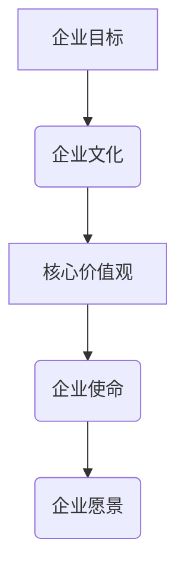
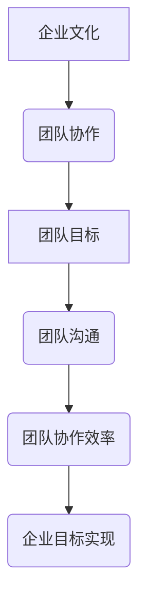
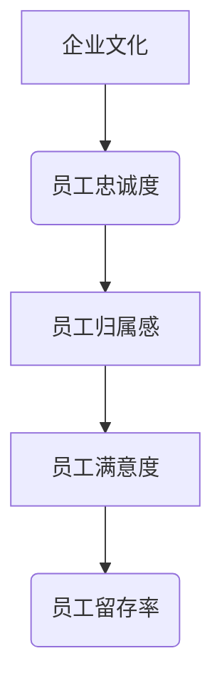

                 

## 1. 背景介绍

### 1.1 目的和范围

本文旨在深入探讨初创公司的企业文化塑造与价值观传递的重要性，并提供一套系统的方法论，帮助初创企业建立与其愿景和使命相契合的企业文化。文章将围绕以下几个方面展开：

1. **企业文化的定义**：介绍企业文化的基本概念，包括其定义、重要性及对企业的影响。
2. **企业文化塑造的原则**：探讨初创公司如何根据自身的特点和目标，确立合适的企业文化。
3. **价值观的传递**：分析初创公司如何通过内部沟通、员工培训、管理实践等方式将核心价值观传递给每一位员工。
4. **实际操作步骤**：提供具体的操作步骤和工具，帮助初创公司有效地塑造和传递企业文化。
5. **案例分析**：通过具体的案例，展示成功的初创公司在企业文化塑造和价值观传递方面的实践。

### 1.2 预期读者

本文主要面向以下读者群体：

1. **初创公司创始人**：希望通过建立强大的企业文化，提升团队凝聚力和员工忠诚度的初创公司创始人。
2. **人力资源管理者**：负责企业文化建设，希望优化企业内部沟通和管理流程的人力资源管理者。
3. **管理咨询顾问**：关注企业文化建设，希望为客户提供专业建议和解决方案的管理咨询顾问。
4. **企业培训师**：致力于提升员工综合素质和团队协作能力的培训师。

### 1.3 文档结构概述

本文的结构如下：

1. **背景介绍**：介绍企业文化的重要性以及本文的目的和预期读者。
2. **核心概念与联系**：通过Mermaid流程图，展示企业文化与企业目标、价值观的关联。
3. **核心算法原理 & 具体操作步骤**：使用伪代码阐述企业文化塑造和价值观传递的方法。
4. **数学模型和公式 & 详细讲解 & 举例说明**：阐述企业文化建设中的关键指标和评估方法。
5. **项目实战：代码实际案例和详细解释说明**：提供具体的实施步骤和代码实例。
6. **实际应用场景**：探讨企业文化在不同规模和行业中的实际应用。
7. **工具和资源推荐**：推荐学习资源和开发工具，以帮助读者进一步了解和实施企业文化。
8. **总结：未来发展趋势与挑战**：分析企业文化建设的未来趋势和面临的挑战。
9. **附录：常见问题与解答**：针对读者可能遇到的问题提供解答。
10. **扩展阅读 & 参考资料**：提供相关的扩展阅读材料和参考资料。

### 1.4 术语表

#### 1.4.1 核心术语定义

- **企业文化**：企业内部共同的价值观、信念和行为准则，是企业的精神内核。
- **价值观**：企业在决策和行为过程中所遵循的基本原则和标准。
- **核心价值观**：对企业发展具有重要意义的核心价值观，通常体现在企业的使命、愿景和目标中。
- **初创公司**：指刚刚成立或正在发展初期的公司，具有较大的发展潜力和创新活力。

#### 1.4.2 相关概念解释

- **企业目标**：企业在一定时期内所追求的具体目标，包括短期和长期目标。
- **企业使命**：企业存在的根本目的和意义，是企业价值观和目标的高度概括。
- **企业愿景**：企业对未来发展方向的期望和规划，通常具有前瞻性和激励性。
- **团队协作**：团队成员通过共同的目标和努力，实现企业目标的过程。

#### 1.4.3 缩略词列表

- **CEO**：首席执行官（Chief Executive Officer）
- **CFO**：首席财务官（Chief Financial Officer）
- **HR**：人力资源（Human Resources）
- **Cultural DNA**：企业文化基因（Cultural DNA）
- **VRI**：价值观识别（Values Recognition Index）

## 2. 核心概念与联系

### 2.1 企业文化与企业目标、价值观的关系

企业文化的塑造与企业的目标、价值观密切相关。企业文化是企业在长期发展过程中形成的共同价值观、信念和行为准则，它既是企业目标的实现手段，也是企业价值观的体现。

**Mermaid流程图：**



在这个流程图中，企业目标、核心价值观、企业使命和企业愿景共同构成了企业文化的基础。企业目标明确了企业的发展方向，核心价值观是企业在决策和行为过程中所遵循的基本原则，企业使命则是对企业存在意义的高度概括，而企业愿景则是对企业未来发展方向和期望的展望。这些要素相互关联，共同塑造了企业的文化基因。

### 2.2 企业文化与团队协作的关系

企业文化不仅影响企业的内部管理，还直接影响团队协作的效率和效果。一个强大的企业文化能够促进团队成员之间的相互信任、尊重和合作，从而提高团队的整体表现。

**Mermaid流程图：**



在这个流程图中，企业文化通过团队协作、团队目标和团队沟通，最终实现企业目标。一个良好的企业文化能够促进团队成员之间的有效沟通和协作，提高团队的协作效率，从而更好地实现企业目标。

### 2.3 企业文化与员工忠诚度的关系

企业文化也是影响员工忠诚度的重要因素。一个强大的企业文化能够激发员工的归属感和自豪感，从而提高员工的忠诚度和留存率。

**Mermaid流程图：**



在这个流程图中，企业文化通过员工归属感和员工满意度，最终影响员工的留存率。一个良好的企业文化能够使员工感受到企业的关爱和认可，从而提高员工的归属感和满意度，进而提高员工的忠诚度和留存率。

## 3. 核心算法原理 & 具体操作步骤

### 3.1 企业文化塑造的核心算法原理

企业文化塑造的核心算法原理可以概括为以下几个步骤：

1. **明确企业目标和愿景**：首先，企业需要明确自身的目标和愿景，这是企业文化塑造的基础。
2. **确立核心价值观**：根据企业的目标和愿景，确定一系列核心价值观，这些价值观将指导企业的决策和行为。
3. **制定企业文化战略**：将核心价值观转化为具体的企业文化战略，包括文化理念、行为准则、激励机制等。
4. **传播和践行企业文化**：通过内部沟通、员工培训、管理实践等方式，将企业文化传播给每一位员工，并确保其实践。

### 3.2 伪代码阐述企业文化塑造和价值观传递的方法

```python
def cultivate_corporate_culture(targets, vision, core_values):
    """
    塑造企业文化的方法

    参数：
    targets: 企业目标
    vision: 企业愿景
    core_values: 企业核心价值观

    返回：
    corporate_culture_strategy: 企业文化战略
    """

    # 第一步：明确企业目标和愿景
    enterprise_goals = set_targets_and_vision(targets, vision)

    # 第二步：确立核心价值观
    values_framework = define_core_values(core_values)

    # 第三步：制定企业文化战略
    corporate_culture_strategy = create_culture_strategy(enterprise_goals, values_framework)

    # 第四步：传播和践行企业文化
    execute_culture_strategy(corporate_culture_strategy)

    return corporate_culture_strategy

def set_targets_and_vision(targets, vision):
    """
    设置企业目标和愿景

    参数：
    targets: 企业目标
    vision: 企业愿景

    返回：
    enterprise_goals: 企业目标
    """
    enterprise_goals = {
        '短期目标': targets['短期目标'],
        '长期目标': targets['长期目标'],
        '愿景': vision
    }
    return enterprise_goals

def define_core_values(core_values):
    """
    确立核心价值观

    参数：
    core_values: 企业核心价值观

    返回：
    values_framework: 价值观框架
    """
    values_framework = {
        '诚信': core_values['诚信'],
        '创新': core_values['创新'],
        '协作': core_values['协作'],
        '客户至上': core_values['客户至上'],
        '可持续发展': core_values['可持续发展']
    }
    return values_framework

def create_culture_strategy(enterprise_goals, values_framework):
    """
    制定企业文化战略

    参数：
    enterprise_goals: 企业目标
    values_framework: 价值观框架

    返回：
    culture_strategy: 企业文化战略
    """
    culture_strategy = {
        '文化理念': {
            '企业精神': '追求卓越，共创未来',
            '共同愿景': '成为行业领导者'
        },
        '行为准则': {
            '员工行为规范': '诚实守信，勇于担当',
            '团队协作规范': '协同合作，共赢发展'
        },
        '激励机制': {
            '绩效奖励': '绩效优秀者享有额外奖励',
            '员工福利': '提供多样化的员工福利'
        }
    }
    return culture_strategy

def execute_culture_strategy(culture_strategy):
    """
    传播和践行企业文化

    参数：
    culture_strategy: 企业文化战略
    """
    # 通过内部沟通传播企业文化
    communicate_culture_strategy(culture_strategy)

    # 通过员工培训践行企业文化
    train_employees_on_culture(culture_strategy)

    # 通过管理实践践行企业文化
    practice_culture_in_management()

# 调用函数，塑造企业文化
cultivate_corporate_culture(targets, vision, core_values)
```

通过上述伪代码，我们展示了企业文化塑造和价值观传递的具体操作步骤。首先，明确企业目标和愿景，确立核心价值观，然后制定企业文化战略，最后通过内部沟通、员工培训和

