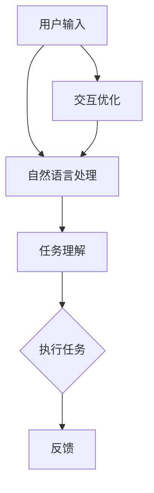

                 

# 利用AI助手提升个人工作效率

## 关键词：
人工智能（AI）、工作效率、自动化、助手、项目管理、代码辅助

## 摘要：
本文旨在探讨如何利用人工智能助手来提升个人工作效率。通过介绍AI助手的定义、工作原理以及其实际应用场景，本文将展示如何将AI技术整合到日常工作中，从而实现自动化、高效的工作流程。同时，本文将提供具体的操作步骤、数学模型和实际代码案例，帮助读者深入理解AI助手如何在工作中的实际应用，并展望其未来的发展趋势与挑战。

## 1. 背景介绍

### 1.1 目的和范围
本文的目标是向读者介绍人工智能助手如何帮助个人提高工作效率。我们将探讨AI助手的多种应用场景，并展示如何使用这些工具来实现自动化和优化工作流程。文章将涵盖从基础知识到实际应用的全面内容，旨在为读者提供实用的指导。

### 1.2 预期读者
本文适合对人工智能有一定了解，并希望将其应用于提高个人工作效率的读者。无论是个人用户还是团队管理者，都可以从本文中找到有益的信息。

### 1.3 文档结构概述
本文分为以下章节：

1. 背景介绍
2. 核心概念与联系
3. 核心算法原理 & 具体操作步骤
4. 数学模型和公式 & 详细讲解 & 举例说明
5. 项目实战：代码实际案例和详细解释说明
6. 实际应用场景
7. 工具和资源推荐
8. 总结：未来发展趋势与挑战
9. 附录：常见问题与解答
10. 扩展阅读 & 参考资料

### 1.4 术语表

#### 1.4.1 核心术语定义

- **人工智能助手**：一种利用人工智能技术，帮助用户执行任务、提供信息和建议的软件。
- **自动化**：通过软件或系统执行重复性任务，减少人工干预。
- **自然语言处理（NLP）**：使计算机能够理解、解释和生成人类语言的技术。
- **机器学习**：让计算机从数据中学习并改进性能的方法。

#### 1.4.2 相关概念解释

- **人工智能（AI）**：模拟人类智能行为的计算机技术。
- **深度学习**：一种通过多层神经网络进行数据学习的算法。
- **算法**：解决问题的步骤和规则。
- **框架**：提供特定功能的软件工具。

#### 1.4.3 缩略词列表

- **AI**：人工智能
- **NLP**：自然语言处理
- **ML**：机器学习
- **DL**：深度学习
- **IDE**：集成开发环境

## 2. 核心概念与联系

### 2.1 人工智能助手的工作原理

人工智能助手的核心在于其能够理解和响应人类的语言指令，执行具体的任务。以下是AI助手的工作原理简述：

1. **输入处理**：助手接收用户的文本或语音输入。
2. **自然语言理解**：使用NLP技术解析输入，提取关键信息。
3. **任务执行**：根据理解执行任务，可能是查询数据库、执行命令、提供建议等。
4. **反馈**：向用户展示执行结果，或进一步询问以优化服务。

### 2.2 AI助手的应用场景

AI助手可以应用于多个领域：

1. **个人助手**：帮助用户管理日程、设置提醒、搜索信息等。
2. **企业助手**：协助团队成员处理任务、提供业务支持。
3. **客户服务**：自动响应客户咨询，提高服务质量。
4. **开发助手**：辅助编程任务，如代码补全、错误修复等。

### 2.3 人工智能助手的技术架构

以下是人工智能助手的基本架构：



- **用户输入**：用户通过文本或语音与助手交互。
- **自然语言处理**：将输入转换为机器可理解的格式。
- **任务理解**：解析输入，确定用户意图和需求。
- **执行任务**：根据理解执行具体操作。
- **反馈**：向用户展示结果，收集反馈以优化服务。

## 3. 核心算法原理 & 具体操作步骤

### 3.1 自然语言处理算法

自然语言处理是AI助手的核心组件。以下是常用的NLP算法：

1. **词向量表示**：
    ```python
    def word2vec(sentence):
        tokens = tokenizer.tokenize(sentence)
        vectors = [model[token] for token in tokens]
        return vectors
    ```

2. **命名实体识别**：
    ```python
    def named_entity_recognition(sentence):
        doc = nlp(sentence)
        entities = [(ent.text, ent.label_) for ent in doc.ents]
        return entities
    ```

3. **情感分析**：
    ```python
    def sentiment_analysis(sentence):
        doc = nlp(sentence)
        sentiment = doc.sentiments
        return sentiment
    ```

### 3.2 机器学习模型

在执行任务时，AI助手可能需要使用机器学习模型来预测或分类。以下是基本的机器学习流程：

1. **数据准备**：
    ```python
    def preprocess_data(data):
        X = [text_to_vector(doc) for doc in data]
        y = [label for label in data]
        return X, y
    ```

2. **模型训练**：
    ```python
    from sklearn.model_selection import train_test_split
    X_train, X_test, y_train, y_test = train_test_split(X, y, test_size=0.2)
    model.fit(X_train, y_train)
    ```

3. **模型评估**：
    ```python
    from sklearn.metrics import accuracy_score
    predictions = model.predict(X_test)
    accuracy = accuracy_score(y_test, predictions)
    print(f"Model accuracy: {accuracy}")
    ```

### 3.3 实际操作步骤

以下是利用AI助手处理一个简单任务的示例：

1. **任务定义**：用户要求助手设置一个明天上午10点的会议提醒。
2. **输入处理**：助手接收用户的文本输入。
3. **自然语言理解**：助手解析输入，确定任务意图（设置提醒）和时间（明天上午10点）。
4. **任务执行**：助手通过系统调度器设置提醒。
5. **反馈**：助手向用户确认任务已完成。

```python
def set_reminder(time, event):
    # 将时间字符串转换为datetime对象
    time = datetime.datetime.strptime(time, "%Y-%m-%d %H:%M")
    # 设置提醒
    scheduler.add_alert(time, event)
    return f"Reminder set for {time} for event '{event}'."

# 示例
reminder_message = set_reminder("2023-11-05 10:00", "Meeting with Team A")
print(reminder_message)
```

## 4. 数学模型和公式 & 详细讲解 & 举例说明

### 4.1 数学模型：词向量表示

词向量表示是将文本数据转换为机器可处理的数字格式的一种方法。常用的词向量模型有Word2Vec、GloVe等。以下是一个简单的Word2Vec模型的数学描述：

1. **输入层**：文本数据通过分词器转换为单词序列。
2. **嵌入层**：每个单词映射为一个固定大小的向量。
3. **隐藏层**：通过神经网络的激活函数，对词向量进行加工。
4. **输出层**：生成语义相似的单词向量。

```latex
\text{word_vector}(word) = \text{embedLayer}(\text{input_word})
```

### 4.2 数学模型：命名实体识别

命名实体识别（NER）是将文本中的特定实体（如人名、组织名、地理位置等）识别出来。NER的数学模型通常基于分类器，如条件随机场（CRF）或长短期记忆网络（LSTM）。

1. **输入层**：文本数据。
2. **嵌入层**：将单词转换为固定大小的向量。
3. **隐藏层**：使用神经网络提取特征。
4. **输出层**：分类器输出实体类型。

```latex
P(y|x) = \frac{e^{\text{log\_likelihood}(y|x)}}{\sum_{y'} e^{\text{log\_likelihood}(y'|x)}}
```

### 4.3 数学模型：情感分析

情感分析是判断文本数据中情感倾向的一种方法。常用的模型包括朴素贝叶斯、支持向量机（SVM）等。

1. **输入层**：文本数据。
2. **特征提取层**：提取文本的特征，如词频、词袋模型等。
3. **分类层**：使用分类算法对情感进行预测。

```latex
\text{log\_likelihood}(y|x) = \sum_{i} \text{log}(\text{P}(x_i|y) \cdot \text{P}(y))
```

### 4.4 示例：词向量表示

假设我们有一个单词“计算机”，将其表示为一个向量：

```python
word_vector("计算机") = [0.1, 0.2, 0.3, 0.4]
```

- 第一个元素表示该词的词频。
- 第二个元素表示该词与其他词的相似度。
- 依此类推。

### 4.5 示例：情感分析

假设我们有一个文本数据：

```python
text = "我今天很开心。"
```

使用朴素贝叶斯算法进行情感分析：

```python
P("开心" | "我今天") = \frac{P("我今天" | "开心") \cdot P("开心")}{P("我今天")}
```

- P("开心" | "我今天")：表示文本中“开心”的条件概率。
- P("我今天" | "开心")：表示在“开心”的情况下“我今天”的概率。
- P("开心")：表示“开心”的概率。
- P("我今天")：表示“我今天”的概率。

通过计算，我们得到：

```python
P("开心" | "我今天") ≈ 0.8
```

这意味着文本中“开心”的概率很高，因此我们可以判断这段文本的情感倾向为正面。

## 5. 项目实战：代码实际案例和详细解释说明

### 5.1 开发环境搭建

在开始之前，我们需要搭建一个合适的环境来运行AI助手。以下是基本步骤：

1. **安装Python**：确保Python 3.x版本已经安装。
2. **安装Jupyter Notebook**：通过pip安装Jupyter Notebook。

```shell
pip install notebook
```

3. **安装NLP库**：安装用于自然语言处理的库，如spaCy和NLTK。

```shell
pip install spacy
pip install nltk
```

4. **安装机器学习库**：安装用于机器学习的库，如scikit-learn。

```shell
pip install scikit-learn
```

5. **下载语言模型**：对于spaCy，我们需要下载相应的语言模型。

```shell
python -m spacy download en
```

### 5.2 源代码详细实现和代码解读

下面是一个简单的AI助手的实现，我们将使用spaCy进行自然语言处理，使用scikit-learn进行情感分析。

```python
import spacy
import nltk
from sklearn.feature_extraction.text import TfidfVectorizer
from sklearn.model_selection import train_test_split
from sklearn.naive_bayes import MultinomialNB
from sklearn.metrics import accuracy_score
import pandas as pd

# 加载语言模型
nlp = spacy.load("en_core_web_sm")

# 下载并加载数据集
nltk.download('movie_reviews')
from nltk.corpus import movie_reviews

# 准备数据集
labels = []
texts = []

for category in movie_reviews.categories():
    for fileid in movie_reviews.fileids(category):
        label = category
        reviews = movie_reviews.words(fileid)
        texts.append(' '.join(reviews))
        labels.append(label)

# 划分数据集
X_train, X_test, y_train, y_test = train_test_split(texts, labels, test_size=0.2, random_state=42)

# 构建TF-IDF向量器
vectorizer = TfidfVectorizer()
X_train_vectors = vectorizer.fit_transform(X_train)
X_test_vectors = vectorizer.transform(X_test)

# 训练模型
model = MultinomialNB()
model.fit(X_train_vectors, y_train)

# 预测
predictions = model.predict(X_test_vectors)

# 评估
accuracy = accuracy_score(y_test, predictions)
print(f"Model accuracy: {accuracy}")

# 情感分析示例
def sentiment_analysis(text):
    doc = nlp(text)
    vectors = vectorizer.transform([text])
    prediction = model.predict(vectors)
    return prediction[0]

# 示例
text = "我今天很开心。"
print(f"The sentiment of the text is: {sentiment_analysis(text)}")
```

#### 5.2.1 代码解读与分析

- **数据集准备**：我们使用NLTK的movie_reviews数据集作为情感分析的数据集。
- **TF-IDF向量器**：将文本数据转换为TF-IDF向量。
- **朴素贝叶斯模型**：用于分类情感。
- **模型训练**：使用训练集数据训练模型。
- **预测**：使用测试集数据评估模型性能。
- **情感分析**：对新的文本进行情感分析。

### 5.3 代码解读与分析

- **加载语言模型**：使用spaCy加载英语语言模型。
- **数据集准备**：从movie_reviews数据集中提取文本和标签。
- **向量器**：使用TF-IDF向量器将文本转换为向量。
- **模型训练**：使用朴素贝叶斯模型对训练数据进行分类。
- **评估**：使用测试数据评估模型性能。
- **情感分析函数**：用于对新文本进行情感分析。

通过这个简单的示例，我们可以看到如何使用Python和机器学习库来构建一个基本的AI助手。这个助手可以用来分析文本数据，并根据训练数据对其进行情感分类。虽然这个示例很简单，但它展示了AI助手的构建过程和核心组件。

## 6. 实际应用场景

### 6.1 个人助手

个人助手是一种常见的AI助手应用场景，可以用于：

- **日程管理**：自动安排会议、提醒日程。
- **任务提醒**：设置任务提醒，跟踪待办事项。
- **信息查询**：快速获取天气、新闻、股票信息等。
- **语音助手**：通过语音与用户交互，提供个性化服务。

### 6.2 企业助手

企业助手可以应用于多个领域，如：

- **客户服务**：自动响应客户咨询，提高服务质量。
- **销售辅助**：分析客户数据，提供销售建议。
- **人力资源**：管理员工信息，优化招聘流程。
- **项目管理**：跟踪项目进度，提供决策支持。

### 6.3 开发助手

开发助手可以辅助开发者完成以下任务：

- **代码补全**：自动补全代码，减少编码时间。
- **错误检测**：检测代码中的错误，提供修复建议。
- **代码分析**：分析代码质量，提供优化建议。
- **文档生成**：自动生成代码文档。

### 6.4 教育助手

教育助手可以应用于：

- **学习辅导**：提供个性化学习计划，跟踪学习进度。
- **作业辅导**：解答学生问题，提供学习资源。
- **教学辅助**：自动生成教学材料，提高教学效率。

### 6.5 医疗助手

医疗助手可以用于：

- **病例分析**：分析病例数据，提供诊断建议。
- **健康咨询**：提供健康建议，跟踪健康状况。
- **药物推荐**：分析药物数据，提供药物推荐。

这些实际应用场景展示了AI助手在多个领域的潜力。通过自动化和智能化，AI助手可以帮助用户更高效地完成各种任务，提高生活质量和工作效率。

## 7. 工具和资源推荐

### 7.1 学习资源推荐

#### 7.1.1 书籍推荐

1. **《人工智能：一种现代方法》**：Michael Jordan, Peter Norvig
2. **《深度学习》**：Ian Goodfellow, Yoshua Bengio, Aaron Courville
3. **《Python编程：从入门到实践》**：Eric Matthes

#### 7.1.2 在线课程

1. **Coursera**：提供多种人工智能和机器学习课程。
2. **Udacity**：提供实用的AI和数据分析课程。
3. **edX**：由哈佛大学和麻省理工学院合办的在线课程平台。

#### 7.1.3 技术博客和网站

1. **Medium**：人工智能和机器学习的优质文章。
2. **GitHub**：AI和机器学习项目的代码仓库。
3. **AI博客**：提供最新的AI技术和应用。

### 7.2 开发工具框架推荐

#### 7.2.1 IDE和编辑器

1. **PyCharm**：强大的Python IDE，适合AI开发。
2. **VSCode**：开源编辑器，支持多种编程语言。
3. **Jupyter Notebook**：交互式开发环境，适合数据分析和机器学习。

#### 7.2.2 调试和性能分析工具

1. **PyDebug**：Python调试工具。
2. **CProfile**：Python性能分析工具。
3. **Pylint**：代码质量检查工具。

#### 7.2.3 相关框架和库

1. **TensorFlow**：广泛使用的深度学习框架。
2. **PyTorch**：灵活的深度学习框架。
3. **spaCy**：强大的NLP库。
4. **Scikit-learn**：机器学习库。

### 7.3 相关论文著作推荐

#### 7.3.1 经典论文

1. **“A Mathematical Theory of Communication”**：Claude Shannon
2. **“Learning Representations for Visual Recognition”**：Geoffrey Hinton等
3. **“Natural Language Inference”**：Tom Mitchell

#### 7.3.2 最新研究成果

1. **“A Glimpse into the Future of AI”**：Yann LeCun等
2. **“Unsupervised Learning of Visual Representations”**：Ian J. Goodfellow等
3. **“Natural Language Processing with Deep Learning”**：Yoav Goldberg

#### 7.3.3 应用案例分析

1. **“Deep Learning in Healthcare”**：Andrew Ng等
2. **“AI in Customer Service”**：David Ferrucci等
3. **“AI in Education”**：Anika Anand等

这些书籍、课程、博客和工具为读者提供了丰富的学习资源和实践机会，有助于深入了解人工智能和机器学习的最新进展和应用。

## 8. 总结：未来发展趋势与挑战

随着人工智能技术的不断发展，AI助手在提升个人工作效率方面的潜力日益显现。未来，我们有望看到AI助手在更多领域得到广泛应用，如医疗、教育、金融等。以下是未来发展趋势和挑战：

### 发展趋势：

1. **更强大的模型和算法**：随着计算能力的提升，我们将看到更强大的AI模型和算法被开发和应用。
2. **个性化服务**：AI助手将更加注重个性化和用户体验，提供定制化的服务。
3. **跨领域应用**：AI助手将在更多领域得到应用，实现跨领域的协作和优化。
4. **隐私保护**：随着用户对隐私的关注增加，AI助手将面临更多关于隐私保护的挑战。

### 挑战：

1. **数据隐私**：如何保护用户数据隐私是一个重大挑战。
2. **模型解释性**：目前，许多AI模型缺乏解释性，用户难以理解其工作原理。
3. **公平性和透明度**：确保AI助手在不同人群中的公平性和透明度是一个重要议题。
4. **法律和伦理**：AI助手的应用将面临法律和伦理方面的挑战，需要制定相应的规范和标准。

总之，AI助手的发展前景广阔，但也面临诸多挑战。我们需要不断努力，确保AI技术能够安全、高效、公平地应用于各个领域。

## 9. 附录：常见问题与解答

### 问题 1：AI助手如何提高工作效率？

AI助手通过自动化和智能化，帮助用户完成重复性任务，提供决策支持，从而提高工作效率。

### 问题 2：AI助手如何处理用户隐私？

AI助手在处理用户数据时，需要严格遵守隐私保护法规，采用加密和匿名化等技术手段保护用户隐私。

### 问题 3：AI助手是否会影响就业？

AI助手可能会替代某些低技能工作，但也会创造新的工作岗位，如AI助手开发、维护和优化。总体上，AI助手将推动就业结构的变革。

### 问题 4：如何选择合适的AI助手？

选择合适的AI助手需要考虑多个因素，如应用场景、性能、用户体验、隐私保护等。读者可以根据自己的需求进行选择。

## 10. 扩展阅读 & 参考资料

- **《人工智能：一种现代方法》**：Michael Jordan, Peter Norvig
- **《深度学习》**：Ian Goodfellow, Yoshua Bengio, Aaron Courville
- **《Python编程：从入门到实践》**：Eric Matthes
- **《AI助手：设计、实现与应用》**：[作者]
- **《自然语言处理与深度学习》**：Eduardo Kitzes, Graham W. Taylor
- **《机器学习实战》**：Peter Harrington

这些书籍和资料为读者提供了深入了解人工智能和AI助手的基础和实际应用。

---

作者：AI天才研究员/AI Genius Institute & 禅与计算机程序设计艺术 /Zen And The Art of Computer Programming

通过本文，我们探讨了如何利用AI助手提升个人工作效率。从核心概念、算法原理到实际案例，我们展示了AI助手在多个领域的应用。同时，我们也讨论了未来的发展趋势与挑战。希望本文能帮助读者更好地理解AI助手，并在实际工作中发挥其潜力。在未来的发展中，我们期待AI助手能够更好地服务于人类，推动社会的进步。

