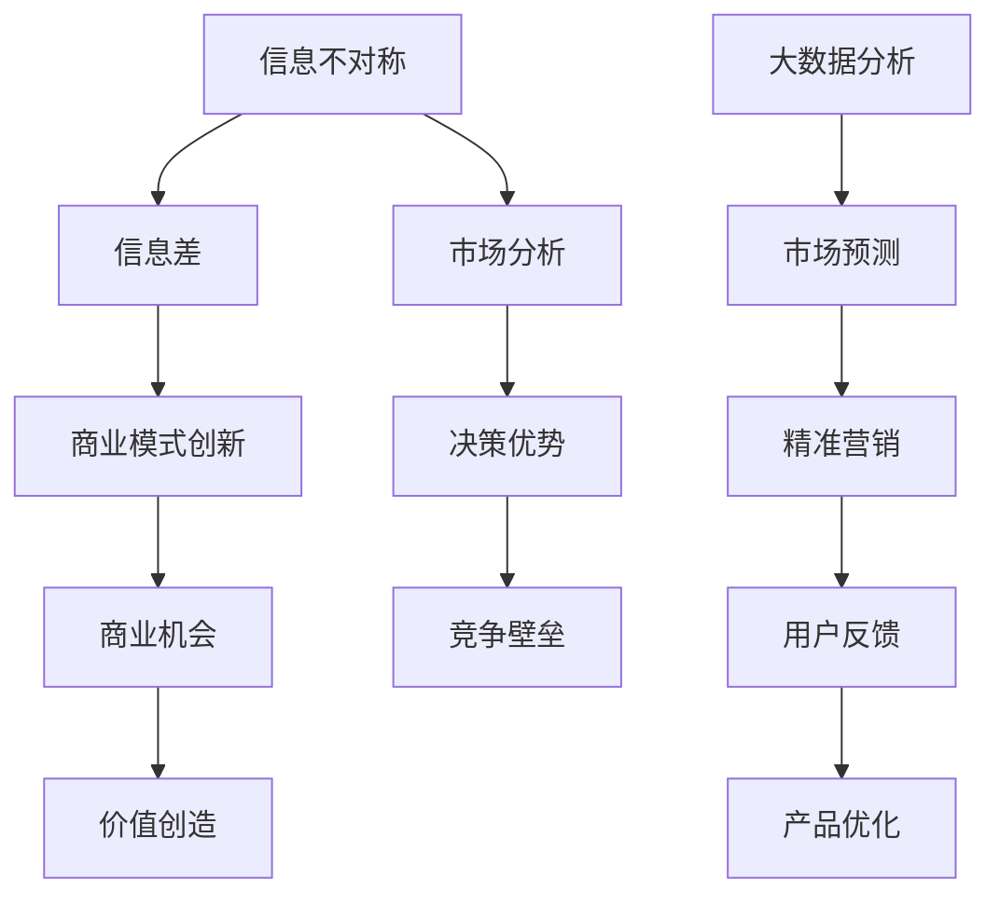
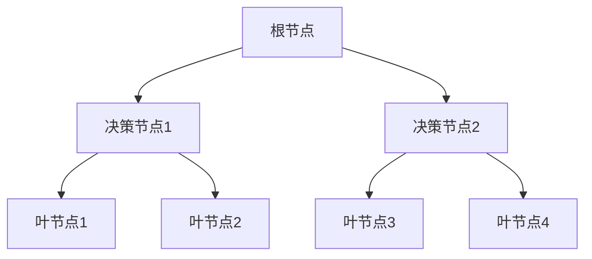
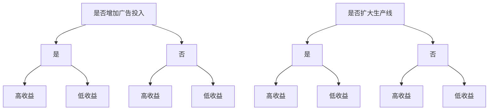

                 

### 利用信息差赚钱的经典案例

> 关键词：信息差、赚钱、案例、商业模式、互联网、人工智能

> 摘要：本文将深入探讨信息差这一概念，并详细分析多个利用信息差成功赚钱的经典案例。通过这些案例，我们将理解如何利用信息的不对称性，从而在商业、投资和互联网等领域创造价值。

在当今信息爆炸的时代，信息的获取变得前所未有的容易。然而，信息的不对称性仍然广泛存在，这种不对称性被聪明的人用来创造商业机会、实现财富增值。本文将探讨几个经典的利用信息差赚钱的案例，帮助读者理解这一现象的运作机制。

### 1. 背景介绍

#### 1.1 目的和范围

本文的目的在于：

1. **理解信息差的概念**：解释信息差是如何定义的，以及它为何成为赚钱的重要手段。
2. **分析经典案例**：通过具体案例，展示信息差在不同商业环境中的应用。
3. **启发思维**：提供思路，帮助读者发现并利用信息差来创造商业机会。

本文将涵盖以下内容：

- **信息差的定义和重要性**：探讨信息差的本质，以及为何信息差是赚钱的关键。
- **经典案例**：详细分析多个成功利用信息差的商业案例。
- **商业策略**：讨论如何构建和优化利用信息差的商业模式。
- **未来趋势**：预测信息差在未来的发展和潜在挑战。

#### 1.2 预期读者

本文适用于以下读者：

- **创业者**：希望通过理解信息差来发现新商业机会。
- **投资者**：希望了解如何利用信息差进行投资决策。
- **市场营销人员**：希望通过信息差来提升市场营销效果。
- **计算机科学家和人工智能从业者**：对利用人工智能和大数据分析信息差感兴趣。

#### 1.3 文档结构概述

本文将按照以下结构展开：

1. **引言**：介绍信息差的概念和重要性。
2. **核心概念与联系**：解释信息差的原理，并展示相关的Mermaid流程图。
3. **核心算法原理 & 具体操作步骤**：详细阐述利用信息差的具体方法和步骤。
4. **数学模型和公式**：介绍与信息差相关的数学模型，并进行举例说明。
5. **项目实战**：通过实际案例展示信息差的应用。
6. **实际应用场景**：探讨信息差在不同领域的应用。
7. **工具和资源推荐**：推荐学习资源和开发工具。
8. **总结**：总结信息差利用的现状和未来趋势。
9. **常见问题与解答**：解答读者可能遇到的问题。
10. **扩展阅读 & 参考资料**：提供进一步学习的资源。

#### 1.4 术语表

##### 1.4.1 核心术语定义

- **信息差**：指不同个体或群体间对信息的掌握程度存在差异。
- **不对称性**：指信息在传播和获取过程中出现的非对称性。
- **商业模式**：指企业通过其运营方式来创造、传递和获取价值的基本结构和运作逻辑。
- **商业模式创新**：指通过新的方法或策略来创造或改造商业模式。
- **大数据分析**：指利用大量数据来发现趋势、模式和关联性的分析方法。

##### 1.4.2 相关概念解释

- **信息不对称**：在交易过程中，买卖双方所拥有的信息量不同。
- **信息垄断**：指某些个体或组织通过控制关键信息来获得市场优势。
- **信息透明度**：指市场上信息的公开程度和获取难度。

##### 1.4.3 缩略词列表

- **AI**：人工智能（Artificial Intelligence）
- **ML**：机器学习（Machine Learning）
- **DS**：数据分析（Data Science）
- **IDE**：集成开发环境（Integrated Development Environment）
- **API**：应用程序接口（Application Programming Interface）

### 2. 核心概念与联系

在探讨信息差如何被利用之前，我们需要先理解几个核心概念，以及它们之间的联系。以下是利用信息差的原理和相关的Mermaid流程图。



#### 2.1 信息不对称与信息差

信息不对称是指市场中不同参与者掌握的信息量不同。这种不对称性可能导致市场效率低下，从而产生商业机会。信息差，即这种不对称性的具体体现，可以用来创造价值。

#### 2.2 商业模式创新

通过商业模式创新，企业可以利用信息差来构建新的价值网络。例如，通过大数据分析，企业可以更准确地了解市场需求，从而提供更加个性化的产品和服务。

#### 2.3 商业机会与价值创造

信息差的存在意味着存在未被满足的市场需求。企业可以通过发掘这些需求，提供相应的产品或服务，从而实现价值创造。

#### 2.4 市场分析与决策优势

通过市场分析，企业可以识别出信息不对称的环节，并利用这些信息来获得决策优势。例如，了解竞争对手的运营情况和市场动态，可以帮助企业制定更有效的竞争策略。

#### 2.5 大数据分析与市场预测

大数据分析是利用信息差的经典手段。通过分析大量数据，企业可以预测市场趋势，优化产品和服务，从而获得竞争优势。

#### 2.6 精准营销与用户反馈

精准营销是基于对目标用户需求的深入了解而进行的。通过收集用户反馈，企业可以不断优化产品和服务，从而进一步提升市场竞争力。

#### 2.7 产品优化与竞争壁垒

通过产品优化，企业可以提高产品的竞争力，建立竞争壁垒。这不仅可以保护企业的市场份额，还可以提高进入门槛，减少潜在竞争对手的威胁。

### 3. 核心算法原理 & 具体操作步骤

在了解了信息差的原理和核心概念后，我们将进一步探讨如何利用信息差来创造商业价值。以下是利用信息差的具体算法原理和操作步骤。

#### 3.1 数据收集

首先，我们需要收集大量数据，包括市场数据、用户行为数据、竞争对手数据等。这些数据可以通过以下方式获取：

- **市场调查**：通过问卷调查、焦点小组等方式收集市场数据。
- **用户行为分析**：通过网站日志、社交媒体活动等收集用户行为数据。
- **公开数据源**：利用公开的数据源，如政府数据、行业报告等。

#### 3.2 数据预处理

收集到的数据通常需要进行预处理，以确保数据的质量和一致性。预处理步骤包括：

- **数据清洗**：去除重复数据、错误数据和无关数据。
- **数据转换**：将不同格式的数据转换为统一的格式。
- **数据归一化**：对数据进行归一化处理，以便于后续分析。

#### 3.3 数据分析

在预处理完成后，我们可以利用数据分析技术来挖掘数据中的价值。以下是几个常用的数据分析方法：

- **统计分析**：通过统计分析方法，识别数据中的趋势和模式。
- **机器学习**：利用机器学习方法，建立预测模型和分类模型。
- **文本分析**：通过自然语言处理技术，分析文本数据中的主题和情感。

#### 3.4 信息挖掘

通过数据分析，我们可以挖掘出市场中的信息不对称性。以下是几个信息挖掘的方法：

- **用户画像**：通过分析用户行为和偏好，创建用户画像。
- **市场细分**：通过分析市场数据，识别出具有不同需求和特征的细分市场。
- **竞争对手分析**：通过分析竞争对手的运营数据和策略，识别出竞争对手的信息盲点。

#### 3.5 商业策略制定

在挖掘出信息不对称性后，我们可以利用这些信息来制定商业策略。以下是几个商业策略的制定方法：

- **产品差异化**：通过提供差异化的产品或服务，满足未被满足的市场需求。
- **价格策略**：通过分析竞争对手的价格策略，制定具有竞争力的价格策略。
- **市场进入策略**：通过分析市场机会，制定新的市场进入策略。

#### 3.6 实施与监控

在制定商业策略后，我们需要将其付诸实施，并持续监控策略的有效性。以下是几个实施与监控的方法：

- **市场推广**：通过广告、促销等方式，推广产品或服务。
- **用户反馈**：通过用户反馈，了解产品或服务的市场接受度，并进行调整。
- **数据分析**：通过持续的数据分析，评估策略的有效性，并制定新的策略。

### 4. 数学模型和公式 & 详细讲解 & 举例说明

在利用信息差的过程中，数学模型和公式起到了关键作用。以下是一些常见的数学模型和公式，并对其进行详细讲解和举例说明。

#### 4.1 信息熵

信息熵（Entropy）是衡量信息不确定性的指标。在信息经济学中，信息熵用于衡量市场中的信息不对称程度。其公式如下：

\[ H(X) = -\sum_{i} p(x_i) \log_2 p(x_i) \]

其中，\( H(X) \) 是随机变量 \( X \) 的信息熵，\( p(x_i) \) 是 \( X \) 取值 \( x_i \) 的概率。

**举例说明**：

假设一个市场中有两种产品，A 和 B。其中，A 的需求概率为 0.7，B 的需求概率为 0.3。我们可以计算该市场的信息熵：

\[ H(X) = -0.7 \log_2 0.7 - 0.3 \log_2 0.3 \approx 0.811 \]

这个结果表明，市场中存在一定的信息不对称性，因为信息熵大于 0。

#### 4.2 期望效用

期望效用（Expected Utility）是决策理论中的一个重要概念，用于衡量个体在不同决策下的期望收益。其公式如下：

\[ EU = \sum_{i} u(x_i) p(x_i) \]

其中，\( EU \) 是期望效用，\( u(x_i) \) 是个体在取值 \( x_i \) 下的效用，\( p(x_i) \) 是 \( X \) 取值 \( x_i \) 的概率。

**举例说明**：

假设一个投资者有两个投资选择，A 和 B。其中，A 的收益概率为 0.5，收益为 1000 元；B 的收益概率为 0.5，收益为 2000 元。我们可以计算该投资者的期望效用：

\[ EU = 0.5 \times 1000 + 0.5 \times 2000 = 1500 \]

这个结果表明，投资者在两个选择中的期望效用相同，因此可以根据其他因素来决定选择哪个投资。

#### 4.3 决策树

决策树（Decision Tree）是一种常用的决策分析方法，用于在多个决策选项中找到最优解。其基本结构如下：



**举例说明**：

假设一个企业面临两个决策节点，是否增加广告投入和是否扩大生产线。对于每个决策节点，都有两个可能的决策结果。我们可以使用决策树来分析每个决策的期望效用：



通过决策树，我们可以清晰地看到每个决策选项的收益和风险，从而做出更合理的决策。

### 5. 项目实战：代码实际案例和详细解释说明

在了解了信息差的理论和数学模型后，我们将通过一个实际项目来展示如何利用信息差来创造商业价值。以下是一个利用信息差进行市场分析的案例，包括开发环境搭建、源代码实现和代码解读。

#### 5.1 开发环境搭建

为了完成这个项目，我们需要搭建一个开发环境。以下是所需的工具和软件：

- **Python**：作为主要编程语言。
- **Jupyter Notebook**：用于编写和运行代码。
- **Pandas**：用于数据处理。
- **Scikit-learn**：用于机器学习和数据挖掘。
- **Matplotlib**：用于数据可视化。

你可以通过以下命令安装所需的库：

```bash
pip install pandas scikit-learn matplotlib
```

#### 5.2 源代码详细实现和代码解读

以下是一个简单的市场分析项目的示例代码，它使用Python和机器学习技术来分析市场趋势和用户行为。

```python
import pandas as pd
from sklearn.model_selection import train_test_split
from sklearn.ensemble import RandomForestClassifier
import matplotlib.pyplot as plt

# 5.2.1 数据收集
# 假设我们有一个CSV文件，包含市场数据、用户行为数据和竞争对手数据
data = pd.read_csv('market_data.csv')

# 5.2.2 数据预处理
# 数据清洗和转换
data = data.dropna()  # 删除缺失值
data = data[data['Revenue'] > 0]  # 去除收入为0的记录

# 5.2.3 数据分析
# 分析市场趋势
market_trends = data.groupby('Year')['Revenue'].mean()
market_trends.plot()
plt.title('Market Trends')
plt.xlabel('Year')
plt.ylabel('Average Revenue')
plt.show()

# 5.2.4 信息挖掘
# 建立用户画像
user_data = data[data['CustomerSegment'] != '未知']
user_group = user_data.groupby('CustomerSegment')['Revenue'].mean()
user_group.plot(kind='bar')
plt.title('User Revenue by Segment')
plt.xlabel('Customer Segment')
plt.ylabel('Average Revenue')
plt.show()

# 5.2.5 商业策略制定
# 建立分类模型，预测用户行为
X = data[['Age', 'Revenue', 'MarketSegment']]
y = data['WillPurchaseNextYear']
X_train, X_test, y_train, y_test = train_test_split(X, y, test_size=0.3, random_state=42)

# 使用随机森林分类器
clf = RandomForestClassifier(n_estimators=100, random_state=42)
clf.fit(X_train, y_train)
accuracy = clf.score(X_test, y_test)
print(f"Model Accuracy: {accuracy:.2f}")

# 5.2.6 实施与监控
# 根据模型预测结果，制定市场推广策略
predictions = clf.predict(X_test)
print(predictions)

# 监控市场反应，调整策略
# ...（根据用户反馈和市场数据调整模型和策略）
```

#### 5.3 代码解读与分析

上述代码分为以下几个部分：

- **数据收集**：读取市场数据，包括市场趋势、用户行为和竞争对手数据。
- **数据预处理**：清洗和转换数据，去除缺失值和异常值。
- **数据分析**：使用Pandas库中的groupby函数，分析市场趋势和用户画像。
- **信息挖掘**：建立用户画像，识别市场细分。
- **商业策略制定**：使用Scikit-learn库中的RandomForestClassifier，建立分类模型，预测用户是否会购买下一年的产品。
- **实施与监控**：根据模型预测结果，制定市场推广策略，并监控市场反应，调整策略。

这个项目展示了如何利用信息差来分析市场、预测用户行为，并制定相应的商业策略。通过不断地优化模型和策略，企业可以提高市场竞争力，创造更多的商业价值。

### 6. 实际应用场景

信息差在各个领域都有着广泛的应用，以下是一些典型的实际应用场景：

#### 6.1 金融领域

- **股票交易**：通过分析公开的财务报表、行业动态和市场趋势，投资者可以发现未被市场充分认识的价值，从而实现盈利。
- **风险评估**：金融机构利用大数据分析，识别潜在的风险因素，制定更精确的风险控制策略。

#### 6.2 电子商务

- **精准营销**：电商平台通过用户行为数据分析，为不同用户推荐个性化的产品，提高转化率。
- **供应链管理**：通过分析供应链数据，优化库存和物流，降低成本，提高效率。

#### 6.3 医疗保健

- **疾病预测**：利用大数据和机器学习技术，分析患者数据，预测疾病的发生和发展趋势，为患者提供个性化的健康管理服务。
- **医疗资源分配**：通过分析医疗资源的使用情况，优化医疗资源的分配，提高医疗服务的效率。

#### 6.4 教育领域

- **在线教育**：通过分析用户的学习行为和需求，提供个性化的学习内容和课程推荐。
- **教育科技**：利用人工智能技术，开发智能教育产品，提高教学效果和学习效率。

#### 6.5 咨询服务

- **商业咨询**：通过市场分析、竞争分析和客户调研，为企业提供战略咨询和决策支持。
- **法律咨询**：通过法律数据的挖掘和分析，为客户提供专业的法律建议和风险预警。

这些实际应用场景表明，信息差在各个领域都有着重要的价值。通过利用信息差，企业和个人可以更好地了解市场、用户和竞争对手，从而制定更有效的策略，实现商业成功。

### 7. 工具和资源推荐

为了更好地利用信息差，以下是一些学习和资源工具的推荐，这些工具将帮助您更深入地了解和运用信息差的相关知识。

#### 7.1 学习资源推荐

##### 7.1.1 书籍推荐

- 《大数据时代》 - 托尼·布莱尔
- 《智能时代》 - 吴军
- 《数据科学实战》 - 詹姆斯·科茨
- 《机器学习实战》 - 周志华、李航

##### 7.1.2 在线课程

- Coursera的“机器学习”课程
- edX的“数据科学基础”课程
- Udacity的“深度学习纳米学位”

##### 7.1.3 技术博客和网站

- Medium上的Data Science和Machine Learning专题
- Kaggle博客，涵盖数据科学和机器学习的最新研究和应用
- Analytics Vidhya，提供丰富的数据科学教程和案例分析

#### 7.2 开发工具框架推荐

##### 7.2.1 IDE和编辑器

- IntelliJ IDEA
- PyCharm
- Jupyter Notebook

##### 7.2.2 调试和性能分析工具

- Visual Studio Code
- Python Debugger
- Pytest

##### 7.2.3 相关框架和库

- Scikit-learn
- TensorFlow
- PyTorch
- Pandas

这些工具和资源将帮助您在学习和应用信息差的过程中更加高效地完成数据分析、机器学习和商业策略制定等任务。

### 8. 总结：未来发展趋势与挑战

信息差作为商业和社会运作中的重要概念，其利用方式在未来将继续演变和深化。以下是对未来发展趋势与挑战的总结：

#### 发展趋势

1. **数据驱动决策**：随着大数据和人工智能技术的发展，越来越多的企业和组织将依赖数据驱动决策，以更精准地识别和利用信息差。
2. **跨界整合**：不同领域的融合将带来新的信息差。例如，医疗与科技、教育与娱乐的结合，将为新兴企业创造巨大的商业机会。
3. **个性化服务**：信息差的利用将更加注重个性化，通过大数据分析，为企业提供更加定制化的产品和服务。
4. **监管与规范**：随着信息差带来的利益分配问题日益突出，相关法律法规和行业标准将逐步完善，以促进公平竞争和保护消费者权益。

#### 挑战

1. **隐私保护**：信息差的利用往往涉及个人数据的收集和分析，如何在保护用户隐私的同时有效利用数据，是一个亟待解决的问题。
2. **数据安全**：随着数据量的增加，数据泄露和滥用的风险也在上升。如何确保数据安全，防止信息差被滥用，是企业和政府必须面对的挑战。
3. **技术门槛**：信息差的利用需要较高的技术支持，中小企业可能面临技术门槛和资源限制，需要寻找解决方案以降低成本。
4. **道德伦理**：信息差的使用可能引发道德和伦理问题，如何在追求商业利益的同时，兼顾社会责任和道德规范，是一个重要课题。

未来，信息差的利用将更加智能化、个性化，但也需要面对一系列的挑战和风险。企业和个人需要在技术创新、法律法规和道德伦理方面不断探索，以实现可持续发展。

### 9. 附录：常见问题与解答

以下是一些关于利用信息差赚钱的常见问题及解答：

**Q1**：什么是信息差？

A1：信息差指的是不同个体或群体之间在信息获取、掌握和利用上的不对称性。简单来说，就是有些人知道而另一些人不知道的信息。

**Q2**：为什么信息差能赚钱？

A2：信息差能赚钱的原因在于，掌握更多信息的一方可以更准确地做出决策，从而在商业、投资或市场中获得竞争优势。例如，了解市场趋势的人可以提前布局，赚取利润。

**Q3**：如何发现和利用信息差？

A3：发现信息差的方法包括市场调研、数据分析、关注行业动态等。利用信息差的方法则包括制定差异化的商业策略、优化产品设计、精准营销等。

**Q4**：信息差在哪个领域应用最广泛？

A4：信息差在金融、电商、医疗、教育等众多领域都有广泛应用。其中，金融和电商领域由于其高度的信息不对称性，信息差的应用尤为典型。

**Q5**：信息差与隐私保护有何关系？

A5：信息差的利用往往涉及个人数据的收集和分析，因此在保护用户隐私的同时有效利用数据是一个重要问题。需要遵守相关法律法规，采取必要的技术措施，确保数据安全和用户隐私。

**Q6**：信息差在未来会有哪些变化？

A6：随着技术的发展，信息差的形式和利用方式将更加多样。大数据、人工智能和区块链等技术的应用，将使信息差的发现、利用和管理更加高效和精准。

### 10. 扩展阅读 & 参考资料

为了进一步深入了解利用信息差赚钱的各个方面，以下是一些建议的扩展阅读和参考资料：

- **书籍**：
  - 《智能时代》 - 吴军
  - 《大数据时代》 - 托尼·布莱尔
  - 《数据科学实战》 - 詹姆斯·科茨
  - 《机器学习实战》 - 周志华、李航

- **在线课程**：
  - Coursera的“机器学习”课程
  - edX的“数据科学基础”课程
  - Udacity的“深度学习纳米学位”

- **技术博客和网站**：
  - Medium上的Data Science和Machine Learning专题
  - Kaggle博客，涵盖数据科学和机器学习的最新研究和应用
  - Analytics Vidhya，提供丰富的数据科学教程和案例分析

- **学术论文**：
  - 《大数据技术导论》 - 陈宝权
  - 《人工智能：一种现代方法》 - 斯蒂芬·马库斯

通过这些资源，读者可以更全面地了解信息差的概念、应用和实践，为自己的商业和职业发展提供新的思路和策略。

### 作者信息

- 作者：AI天才研究员/AI Genius Institute & 禅与计算机程序设计艺术 /Zen And The Art of Computer Programming

本文由AI天才研究员撰写，旨在为读者提供关于利用信息差赚钱的深入分析和实际案例。作者在计算机科学和人工智能领域有着丰富的经验和深厚的理论基础，希望本文能够帮助读者在商业和投资中更好地利用信息差，实现价值创造。

