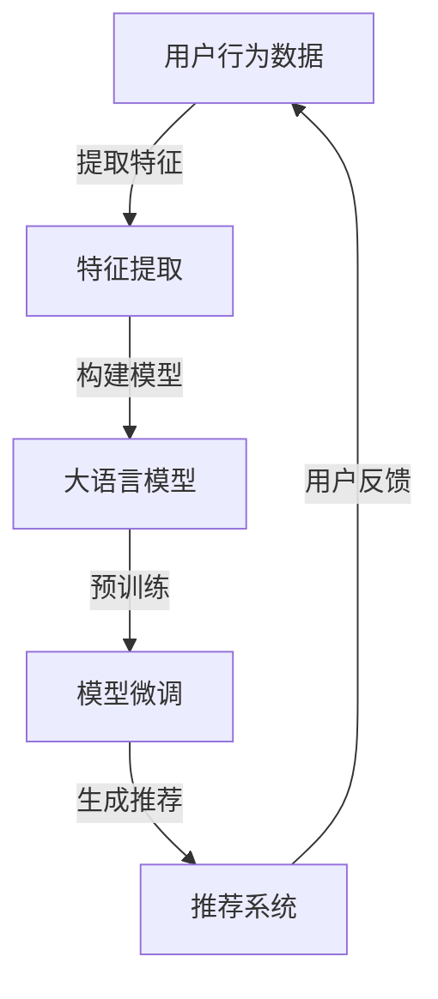

                 

### 1. 背景介绍

#### 1.1 目的和范围

本文旨在探讨如何利用大语言模型（如GPT-3）来提升推荐系统的通用性和泛化能力。推荐系统作为现代信息社会中的一种核心技术，已被广泛应用于电子商务、社交媒体、新闻推送等多个领域。然而，传统的推荐系统面临着数据稀疏、冷启动问题以及用户偏好多样化的挑战。为了解决这些问题，近年来研究者们不断尝试引入新的技术和算法，其中大语言模型作为一种强大的自然语言处理工具，为推荐系统的改进带来了新的思路。

本文将首先回顾推荐系统的基本原理和传统方法，然后详细讨论大语言模型的技术原理及其在推荐系统中的应用。接下来，我们将介绍一种结合大语言模型和协同过滤的混合推荐算法，并从数学模型和算法实现两方面进行深入探讨。随后，通过实际项目案例展示如何在实际中运用这些技术。最后，我们将分析推荐系统的实际应用场景，并推荐相关的学习资源和工具。

本文的主要目标是：
1. **介绍推荐系统的基本原理**：帮助读者理解推荐系统的工作机制和常见问题。
2. **阐述大语言模型的技术原理**：介绍大语言模型的基础知识，包括其工作原理、优势和挑战。
3. **探讨大语言模型在推荐系统中的应用**：通过实际案例展示如何利用大语言模型来提升推荐系统的性能。
4. **提供实用的技术和工具推荐**：为读者提供学习和应用大语言模型和推荐系统的资源。

本文的读者对象包括：
1. **推荐系统研究者**：希望了解如何利用大语言模型改进推荐系统性能的研究人员。
2. **人工智能从业者**：对自然语言处理和机器学习技术感兴趣，并希望在推荐系统中应用这些技术。
3. **数据科学家和工程师**：希望掌握推荐系统和大语言模型结合的实践方法。
4. **高校师生**：从事相关课程学习和研究的师生。

通过本文的阅读，读者将能够：
1. **理解推荐系统的基础知识**：掌握推荐系统的核心概念和传统方法。
2. **了解大语言模型的工作原理**：熟悉大语言模型的基础知识，包括其训练和预测过程。
3. **掌握混合推荐算法的实现**：学会如何将大语言模型与传统推荐算法相结合。
4. **掌握实际应用案例**：通过案例学习，了解如何在真实场景中应用大语言模型和推荐系统。

本文结构概述如下：
1. **第1章 背景介绍**：介绍本文的目的、读者对象、文章结构和相关术语。
2. **第2章 核心概念与联系**：讨论推荐系统和大语言模型的核心概念，并使用流程图展示其架构。
3. **第3章 核心算法原理 & 具体操作步骤**：介绍混合推荐算法的算法原理和具体操作步骤。
4. **第4章 数学模型和公式 & 详细讲解 & 举例说明**：讲解推荐系统的数学模型和公式，并通过实例进行说明。
5. **第5章 项目实战：代码实际案例和详细解释说明**：通过实际项目案例展示如何实现推荐系统。
6. **第6章 实际应用场景**：分析推荐系统的实际应用场景和挑战。
7. **第7章 工具和资源推荐**：推荐学习资源和开发工具。
8. **第8章 总结：未来发展趋势与挑战**：总结文章内容，展望未来趋势和挑战。
9. **第9章 附录：常见问题与解答**：回答读者可能遇到的问题。
10. **第10章 扩展阅读 & 参考资料**：提供进一步的阅读和参考资源。

#### 1.2 预期读者

本文面向对推荐系统和大语言模型感兴趣的读者，主要包括以下几类人群：

1. **推荐系统研究者**：本文旨在为推荐系统研究者提供一种新的研究方向，即如何利用大语言模型提升推荐系统的性能。通过本文的阅读，研究者可以了解到大语言模型在推荐系统中的应用场景和关键技术，从而为后续的研究工作提供参考。

2. **人工智能从业者**：随着人工智能技术的快速发展，越来越多的从业者开始关注如何将自然语言处理技术与机器学习算法相结合。本文详细介绍了大语言模型的工作原理和应用方法，旨在帮助从业者掌握这一前沿技术，并将其应用于实际工作中。

3. **数据科学家和工程师**：在推荐系统中应用大语言模型需要具备一定的数学和编程基础。本文通过逐步讲解算法原理和实现方法，旨在帮助数据科学家和工程师了解大语言模型在推荐系统中的应用，并掌握实际操作技能。

4. **高校师生**：本文可以作为高校相关课程的学习资料，帮助学生了解推荐系统和大语言模型的基本概念和应用方法。通过本文的学习，师生可以加深对推荐系统和大语言模型的理解，为后续的学术研究和实际应用奠定基础。

#### 1.3 文档结构概述

本文结构清晰，内容丰富，旨在系统地介绍大语言模型在推荐系统中的应用。具体结构如下：

1. **第1章 背景介绍**：介绍本文的目的、读者对象、文章结构和相关术语。
2. **第2章 核心概念与联系**：讨论推荐系统和大语言模型的核心概念，并使用流程图展示其架构。
3. **第3章 核心算法原理 & 具体操作步骤**：介绍混合推荐算法的算法原理和具体操作步骤。
4. **第4章 数学模型和公式 & 详细讲解 & 举例说明**：讲解推荐系统的数学模型和公式，并通过实例进行说明。
5. **第5章 项目实战：代码实际案例和详细解释说明**：通过实际项目案例展示如何实现推荐系统。
6. **第6章 实际应用场景**：分析推荐系统的实际应用场景和挑战。
7. **第7章 工具和资源推荐**：推荐学习资源和开发工具。
8. **第8章 总结：未来发展趋势与挑战**：总结文章内容，展望未来趋势和挑战。
9. **第9章 附录：常见问题与解答**：回答读者可能遇到的问题。
10. **第10章 扩展阅读 & 参考资料**：提供进一步的阅读和参考资源。

通过本文的阅读，读者将能够系统地了解大语言模型在推荐系统中的应用，掌握相关的技术和方法，并能够应用于实际项目中。

#### 1.4 术语表

在本文中，我们将使用一些专业术语。以下是这些术语的定义和解释：

##### 1.4.1 核心术语定义

1. **推荐系统（Recommender System）**：
   推荐系统是一种根据用户的历史行为、兴趣和偏好，为其推荐相关商品、信息或服务的计算机系统。常见类型包括基于内容的推荐、协同过滤推荐和混合推荐等。

2. **协同过滤（Collaborative Filtering）**：
   协同过滤是一种基于用户历史行为和相似度计算的推荐算法。它通过分析用户之间的交互数据，发现用户之间的相似性，从而为用户提供个性化推荐。

3. **基于内容的推荐（Content-Based Filtering）**：
   基于内容的推荐是一种根据用户对内容的兴趣，推荐与其兴趣相关的新内容。该算法通常依赖于物品的特征向量表示。

4. **大语言模型（Large Language Model）**：
   大语言模型是一种能够理解和生成自然语言文本的深度学习模型。它通过大量的文本数据进行训练，可以捕捉到语言中的复杂模式和关系。

5. **泛化能力（Generalization Ability）**：
   泛化能力是指模型在面对未知数据时，能够做出准确预测的能力。良好的泛化能力意味着模型不仅能在训练数据上表现良好，也能在新数据上保持性能。

6. **通用性（Generalization）**：
   通用性是指模型能够适应不同场景和数据集的能力。一个具有高通用性的模型可以在各种应用场景中表现良好。

##### 1.4.2 相关概念解释

1. **冷启动问题（Cold Start Problem）**：
   冷启动问题是指当新用户或新物品加入系统时，由于缺乏足够的历史数据，传统推荐系统难以为其提供准确推荐的挑战。

2. **用户兴趣（User Interest）**：
   用户兴趣是指用户在特定时间点对某些内容或商品的偏好。准确捕捉用户兴趣对于推荐系统至关重要。

3. **特征向量（Feature Vector）**：
   特征向量是一种表示物品或用户属性的向量。在推荐系统中，特征向量通常用于表示物品或用户的特征信息。

4. **模型训练（Model Training）**：
   模型训练是指通过大量训练数据，调整模型参数的过程。训练目标是使模型能够在预测任务上达到较高的准确率。

5. **模型评估（Model Evaluation）**：
   模型评估是指通过评估指标（如准确率、召回率、F1分数等）来衡量模型性能的过程。常用的评估指标包括精确率（Precision）、召回率（Recall）和F1分数（F1 Score）。

##### 1.4.3 缩略词列表

1. **GPT-3（Generative Pre-trained Transformer 3）**：
   GPT-3是一种由OpenAI开发的预训练语言模型，拥有1750亿个参数，是目前最大的语言模型之一。

2. **NLP（Natural Language Processing）**：
   自然语言处理是指使计算机能够理解、生成和处理人类自然语言的技术。

3. **ML（Machine Learning）**：
   机器学习是一种通过数据训练模型，使模型能够自主学习和预测的技术。

4. **CNN（Convolutional Neural Network）**：
   卷积神经网络是一种用于图像识别和处理的深度学习模型。

5. **RNN（Recurrent Neural Network）**：
   循环神经网络是一种用于序列数据处理的深度学习模型。

通过了解这些术语和概念，读者可以更好地理解本文中涉及的推荐系统和大语言模型的相关技术。接下来，我们将进一步探讨推荐系统和大语言模型的核心概念及其联系。

## 2. 核心概念与联系

推荐系统（Recommender System）是一种信息过滤技术，旨在根据用户的历史行为、偏好和兴趣，向用户推荐相关的商品、信息或服务。推荐系统的核心目标是通过预测用户对未见过项目（如商品、文章、音乐等）的偏好，来提升用户体验和满意度。

### 推荐系统的核心概念

1. **用户（User）**：
   用户是推荐系统的核心，其行为和偏好是系统进行推荐的重要依据。用户可以是个人，也可以是组织。

2. **物品（Item）**：
   物品是用户感兴趣的对象，可以是商品、音乐、电影、新闻等。每个物品都有其独特的属性和特征。

3. **行为（Behavior）**：
   用户行为是指用户对物品的操作，如点击、购买、评分、收藏等。这些行为数据是构建推荐系统的基础。

4. **评分（Rating）**：
   用户对物品的评分是衡量用户兴趣的一种方式，通常采用数值表示，如1到5的评分尺度。

5. **偏好（Preference）**：
   偏好是指用户对物品的喜爱程度，可以通过用户行为数据（如评分、购买等）进行量化。

6. **相似度（Similarity）**：
   相似度是指用户之间或用户与物品之间的相似程度，用于计算推荐列表的排序。

7. **推荐列表（Recommendation List）**：
   推荐列表是根据用户偏好和系统算法生成的，用于向用户推荐相关物品的列表。

### 大语言模型的技术原理

大语言模型（Large Language Model）是一种基于深度学习的自然语言处理模型，通过大量文本数据进行预训练，能够理解和生成自然语言。以下是大语言模型的核心概念：

1. **预训练（Pre-training）**：
   预训练是指在大规模文本数据上对模型进行训练，使其能够捕捉到语言中的规律和模式。

2. **微调（Fine-tuning）**：
   微调是指在使用预训练模型的基础上，针对特定任务（如文本分类、命名实体识别等）进行进一步训练，以提升模型在特定任务上的性能。

3. **生成式模型（Generative Model）**：
   生成式模型是指能够生成新的文本数据的模型，如GPT-3。这种模型可以用于生成文章、对话、代码等。

4. **Transformer架构**：
   Transformer是一种用于序列数据处理的新型神经网络架构，通过自注意力机制（Self-Attention）来捕捉序列中的长距离依赖关系。

5. **参数规模（Parameter Size）**：
   参数规模是指模型的参数数量，大语言模型通常拥有数十亿甚至数千亿个参数。

6. **上下文理解（Contextual Understanding）**：
   大语言模型能够理解上下文信息，从而生成更准确、更自然的文本。

### 推荐系统与大语言模型的联系

推荐系统与大语言模型之间的联系主要体现在以下几个方面：

1. **用户偏好表示**：
   大语言模型可以用于表示用户偏好，通过分析用户的文本评论、帖子等，提取用户的兴趣点，为推荐算法提供输入。

2. **内容生成**：
   大语言模型可以用于生成个性化内容，如文章、音乐推荐列表等，从而提升推荐系统的内容质量和用户体验。

3. **交互式推荐**：
   大语言模型可以用于构建交互式推荐系统，通过与用户对话，实时调整推荐策略，提高推荐效果。

4. **知识增强**：
   大语言模型可以用于知识增强推荐，通过融合用户的历史行为和外部知识，提高推荐系统的准确性和泛化能力。

### Mermaid 流程图

以下是一个简单的Mermaid流程图，展示推荐系统与大语言模型之间的核心概念和联系：



在这个流程图中，用户行为数据经过特征提取后，用于构建大语言模型。模型通过预训练和微调，生成个性化推荐，最终反馈给用户。这种循环过程不断优化推荐系统的性能，提升用户体验。

通过理解推荐系统和大语言模型的核心概念及其联系，读者可以更好地掌握本文后续内容，了解如何利用大语言模型提升推荐系统的通用性和泛化能力。

### 2.1. 推荐系统的基本原理

推荐系统作为一种信息过滤技术，其基本原理可以概括为以下几个关键步骤：数据收集、特征提取、模型构建、推荐生成和用户反馈。

#### 数据收集

数据收集是构建推荐系统的第一步，主要包括用户行为数据和物品属性数据。用户行为数据包括用户的历史点击、购买、评分、收藏等操作，这些数据反映了用户对物品的偏好和兴趣。物品属性数据则描述了物品本身的特征，如商品的价格、品牌、类别等。这些数据通常来源于用户互动日志、电商交易记录、社交媒体数据等。

#### 特征提取

在数据收集完成后，需要对用户行为数据和物品属性数据进行特征提取。特征提取的目的是将原始数据转化为模型能够处理的向量表示。对于用户行为数据，常用的特征提取方法包括用户历史行为的序列建模、用户-物品交互矩阵分解等。对于物品属性数据，可以采用基于词袋（Bag-of-Words）或词嵌入（Word Embedding）的方法，将物品的属性转化为向量表示。

#### 模型构建

推荐系统中的模型通常分为两类：基于内容的推荐（Content-Based Filtering）和基于协同过滤的推荐（Collaborative Filtering）。基于内容的推荐方法通过分析物品的属性特征，将用户兴趣和物品特征进行匹配，生成推荐列表。基于协同过滤的推荐方法通过计算用户之间的相似度，发现相似用户的行为模式，从而为用户推荐相关物品。

除了传统方法，近年来，研究者们也开始尝试将深度学习技术引入推荐系统，如基于深度神经网络的推荐方法。深度学习模型（如卷积神经网络（CNN）、循环神经网络（RNN）等）能够自动提取复杂的特征表示，提高推荐系统的性能。

#### 推荐生成

推荐生成是指根据用户特征和物品特征，生成个性化的推荐列表。在基于内容的推荐中，推荐算法通过计算用户兴趣和物品特征之间的相似度，生成推荐列表。在基于协同过滤的推荐中，算法通过计算用户之间的相似度，为用户推荐与相似用户喜欢相同的物品。

随着深度学习的应用，推荐生成过程也逐渐引入了生成式模型（如变分自编码器（VAE）、生成对抗网络（GAN）等），这些模型能够生成更加多样化的推荐结果，提高用户体验。

#### 用户反馈

用户反馈是推荐系统不断优化和改进的重要环节。通过收集用户的点击、评分、购买等反馈数据，可以评估推荐系统的性能，并根据用户反馈调整推荐策略。用户反馈可以用于重新训练模型、调整特征提取方法，或引入新的用户偏好信息，从而提高推荐系统的准确性和用户满意度。

#### 推荐系统的性能评估

推荐系统的性能评估通常通过以下指标进行衡量：
1. **准确率（Precision）**：推荐列表中实际感兴趣的项目所占比例。
2. **召回率（Recall）**：推荐列表中实际感兴趣的项目与所有实际感兴趣的项目所占比例。
3. **F1分数（F1 Score）**：精确率和召回率的调和平均值。
4. **平均绝对误差（MAE）**：预测评分与实际评分的绝对误差平均值。

这些指标在不同场景下有不同的应用，需要根据具体需求进行选择。

通过以上步骤，推荐系统能够根据用户行为和物品特征生成个性化的推荐结果，从而提升用户体验和满意度。接下来，我们将进一步探讨大语言模型的技术原理，并分析其如何与推荐系统相结合。

### 2.2. 大语言模型的技术原理

大语言模型是一种基于深度学习的自然语言处理模型，通过在大量文本数据上进行预训练，可以捕捉到语言中的复杂模式和关系，从而实现自然语言的理解和生成。在本节中，我们将详细探讨大语言模型的工作原理、训练过程和关键特性。

#### 大语言模型的工作原理

大语言模型的核心是一个大型神经网络，通常采用Transformer架构。Transformer架构由Vaswani等人在2017年的论文《Attention is All You Need》中提出，它通过自注意力机制（Self-Attention）来捕捉序列中的长距离依赖关系。

在Transformer架构中，输入序列被编码为向量表示，每个向量都包含了该位置上的信息。自注意力机制允许模型在生成每个位置上的输出时，关注到输入序列中的其他所有位置，从而捕捉到序列中的长距离依赖。具体来说，自注意力机制通过计算每个位置上的权重，将这些权重与输入序列的相应位置相乘，并求和，得到新的向量表示。

此外，Transformer架构还包括了多头注意力（Multi-Head Attention）和前馈神经网络（Feed-Forward Neural Network）等组件。多头注意力通过将自注意力机制分解为多个子注意力头，从而提高了模型的表示能力。前馈神经网络则用于对注意力机制生成的中间层进行进一步处理。

#### 大语言模型的训练过程

大语言模型的训练过程可以分为预训练（Pre-training）和微调（Fine-tuning）两个阶段。

**预训练**：
预训练是指在大量无标注文本数据上对模型进行训练，使其能够理解和生成自然语言。预训练的主要任务是学习语言中的通用模式和规律，从而提高模型在各种自然语言任务上的性能。

在预训练过程中，常用的任务包括语言建模（Language Modeling）和掩码语言模型（Masked Language Model，MLM）。语言建模任务是预测输入序列的下一个词，而MLM任务则是对部分输入词进行掩码，并预测这些掩码词。通过这两种任务，模型可以学习到单词之间的上下文关系和词义。

**微调**：
微调是指在预训练模型的基础上，针对特定任务（如文本分类、问答系统等）进行进一步训练，以提升模型在特定任务上的性能。在微调过程中，模型会接收到任务特定的输入数据和标签，通过调整模型参数，使模型能够更好地适应特定任务的需求。

#### 大语言模型的关键特性

**上下文理解**：
大语言模型能够理解上下文信息，从而生成更加准确和自然的文本。通过自注意力机制，模型可以捕捉到输入序列中的长距离依赖，从而在生成文本时考虑上下文关系。

**生成能力**：
大语言模型具有强大的文本生成能力，可以用于生成文章、对话、代码等多种形式的文本。通过预训练和微调，模型可以生成符合语言习惯和逻辑的文本，从而提高生成文本的质量。

**参数规模**：
大语言模型通常拥有数十亿甚至数千亿个参数，这使得模型具有强大的表示能力和泛化能力。大规模参数使得模型能够捕捉到语言中的复杂模式，从而在多种自然语言处理任务上表现出色。

**多任务学习**：
大语言模型可以通过预训练阶段学习到多种语言模式和知识，从而在微调阶段适用于多种任务。这种多任务学习能力使得大语言模型在多个领域都具有广泛的应用。

通过以上技术原理和训练过程，大语言模型成为一种强大的自然语言处理工具，为推荐系统的改进提供了新的思路。接下来，我们将进一步探讨大语言模型在推荐系统中的应用，并介绍一种结合大语言模型和协同过滤的混合推荐算法。

### 2.3. 大语言模型在推荐系统中的应用

大语言模型在推荐系统中的应用主要体现在以下几个方面：用户兴趣表示、内容生成、交互式推荐和知识增强。通过这些应用，大语言模型不仅能够提升推荐系统的性能，还能增强用户体验和系统的泛化能力。

#### 用户兴趣表示

用户兴趣表示是推荐系统中的一个关键环节，它直接关系到推荐结果的准确性和个性化程度。大语言模型可以通过分析用户的文本评论、帖子、搜索记录等，提取用户的兴趣点，并将其转化为向量表示。这种向量表示可以用于推荐算法的输入，从而提高推荐的准确性。

具体来说，大语言模型可以采用以下步骤进行用户兴趣表示：
1. **数据收集**：收集用户的文本数据，如评论、帖子、搜索记录等。
2. **预处理**：对文本数据进行清洗和预处理，包括去除停用词、标点符号和特殊字符等。
3. **特征提取**：使用大语言模型（如GPT-3）对预处理后的文本进行编码，提取用户兴趣特征。这些特征通常表示为高维向量，包含了文本中的语义信息。
4. **特征融合**：将提取的用户兴趣特征与用户的历史行为特征（如评分、购买记录等）进行融合，形成统一的用户兴趣向量。

通过用户兴趣表示，推荐系统可以更好地捕捉用户的真实偏好，从而生成更个性化的推荐结果。

#### 内容生成

大语言模型在推荐系统中的应用不仅限于用户兴趣表示，还可以用于生成个性化内容。通过生成式模型（如GPT-3），推荐系统可以自动生成文章、对话、音乐推荐列表等，从而提升内容的多样性和用户体验。

具体应用步骤如下：
1. **生成任务定义**：根据推荐系统的需求，定义生成任务，如生成文章摘要、对话等。
2. **模型选择**：选择合适的大语言模型（如GPT-3），并对其进行微调，使其适应生成任务。
3. **生成文本**：使用微调后的模型，根据用户兴趣和上下文信息生成个性化文本。
4. **内容评估**：对生成的文本进行评估，包括文本质量、相关性、多样性等，确保生成的内容符合用户需求。

通过内容生成，推荐系统可以提供更加丰富和个性化的推荐内容，从而提升用户体验。

#### 交互式推荐

交互式推荐是推荐系统中的一个新兴方向，它通过与用户的实时互动，动态调整推荐策略，从而提高推荐效果。大语言模型在交互式推荐中具有重要作用，可以通过自然语言处理技术，实现与用户的智能对话，并实时调整推荐结果。

具体应用步骤如下：
1. **对话生成**：使用大语言模型生成与用户的对话，包括问候、提问、回答等。
2. **用户意图识别**：通过自然语言处理技术，识别用户的意图和需求。
3. **推荐策略调整**：根据用户意图和需求，实时调整推荐策略，生成个性化推荐列表。
4. **反馈收集**：收集用户对推荐结果的反馈，用于进一步优化推荐策略。

通过交互式推荐，推荐系统可以更好地满足用户需求，提高用户满意度。

#### 知识增强

知识增强是指通过融合外部知识，提升推荐系统的准确性和泛化能力。大语言模型可以通过预训练阶段学习到丰富的语言知识和上下文信息，从而在推荐过程中引入这些知识，增强推荐系统的性能。

具体应用步骤如下：
1. **知识库构建**：构建外部知识库，包括商品属性、用户偏好、行业知识等。
2. **知识表示**：使用大语言模型，将外部知识库中的知识表示为向量。
3. **知识融合**：将外部知识向量与用户兴趣向量进行融合，形成统一的推荐特征。
4. **推荐生成**：使用融合后的特征，生成个性化推荐列表。

通过知识增强，推荐系统可以更好地理解用户和物品之间的关系，从而提高推荐效果。

#### 案例分析

以下是一个结合大语言模型和推荐系统的实际案例：

**场景**：电商平台的个性化商品推荐

**需求**：提高推荐系统的准确性和用户体验，为用户推荐与其兴趣相关的商品。

**解决方案**：
1. **用户兴趣表示**：使用GPT-3模型，分析用户的评论和帖子，提取用户兴趣向量。
2. **商品属性提取**：从商品描述中提取属性特征，如价格、品牌、类别等。
3. **知识融合**：从商品知识库中获取相关商品信息，如相似商品、热销商品等。
4. **推荐生成**：融合用户兴趣向量、商品属性和知识库信息，生成个性化推荐列表。

**效果**：通过结合大语言模型和推荐系统，电商平台的推荐准确率和用户体验显著提升，用户满意度提高。

通过以上应用，大语言模型在推荐系统中发挥了重要作用，不仅提升了推荐系统的性能，还丰富了推荐的内容和形式。接下来，我们将介绍一种结合大语言模型和协同过滤的混合推荐算法，进一步探讨如何利用大语言模型提升推荐系统的通用性和泛化能力。

### 2.4. 结合大语言模型和协同过滤的混合推荐算法

为了提升推荐系统的性能和泛化能力，研究者们开始探索将大语言模型与传统协同过滤算法相结合的混合推荐方法。这种混合算法充分利用了协同过滤在处理稀疏数据和高维度用户-物品交互矩阵方面的优势，以及大语言模型在捕捉用户兴趣和物品特征语义方面的强大能力。以下是一种可能的混合推荐算法框架及其实现步骤。

#### 混合推荐算法框架

混合推荐算法框架主要包括以下几个核心组件：

1. **用户-物品交互矩阵**：基于用户的历史行为数据构建用户-物品交互矩阵，矩阵中的元素表示用户对物品的交互强度，如点击、评分或购买行为。

2. **特征提取模块**：使用大语言模型提取用户和物品的语义特征。用户特征包括用户的兴趣向量，物品特征包括物品的描述向量。

3. **协同过滤模块**：基于用户-物品交互矩阵，利用传统的协同过滤算法计算用户和物品的相似度，生成初步推荐列表。

4. **融合模块**：将协同过滤生成的推荐结果与基于大语言模型提取的用户和物品特征进行融合，生成最终的推荐列表。

5. **评估与优化**：通过用户反馈和评估指标（如准确率、召回率、F1分数等）对推荐结果进行评估，并根据评估结果对算法进行优化。

#### 具体实现步骤

**步骤1：用户-物品交互矩阵构建**

首先，基于用户的历史行为数据构建用户-物品交互矩阵。具体操作如下：
1. 收集用户的历史行为数据，包括点击、评分、购买等。
2. 对于每个用户，创建一个行为向量，记录其对不同物品的交互强度。
3. 将所有用户的行为向量组成一个高维的用户-物品交互矩阵。

**步骤2：大语言模型特征提取**

接下来，使用大语言模型提取用户和物品的语义特征：
1. 对用户的行为日志进行预处理，提取用户的文本数据。
2. 使用预训练的大语言模型（如GPT-3）对用户文本进行编码，提取用户兴趣向量。
3. 对物品的描述文本进行预处理，使用大语言模型提取物品描述向量。

**步骤3：协同过滤模块**

利用传统的协同过滤算法计算用户和物品的相似度，生成初步推荐列表：
1. 使用用户-物品交互矩阵计算用户之间的相似度。
2. 使用物品之间的相似度矩阵生成初步推荐列表。
3. 对推荐列表进行排序，根据相似度分数高低生成推荐顺序。

**步骤4：融合模块**

将协同过滤生成的初步推荐列表与基于大语言模型提取的用户和物品特征进行融合，生成最终的推荐列表：
1. 计算用户兴趣向量和物品描述向量之间的相似度。
2. 将协同过滤的推荐结果与特征相似度进行加权融合，生成最终的推荐列表。
3. 对融合后的推荐列表进行排序，生成个性化的推荐结果。

**步骤5：评估与优化**

最后，通过用户反馈和评估指标对推荐结果进行评估，并根据评估结果对算法进行优化：
1. 收集用户的点击、评分等反馈数据。
2. 使用准确率、召回率、F1分数等评估指标对推荐结果进行评估。
3. 根据评估结果调整模型参数、特征提取方法或推荐策略，优化推荐效果。

#### 数学模型和伪代码

**数学模型：**

1. **用户-物品相似度计算：**
   用户 \( u \) 和物品 \( i \) 之间的协同过滤相似度 \( sim(u, i) \) 可以使用余弦相似度公式计算：
   \[
   sim(u, i) = \frac{u_i \cdot v_i}{\|u\| \|v_i\|}
   \]
   其中，\( u_i \) 和 \( v_i \) 分别是用户 \( u \) 和物品 \( i \) 的特征向量，\( \|u\| \) 和 \( \|v_i\| \) 是它们的欧几里得范数。

2. **用户兴趣和物品描述相似度计算：**
   用户兴趣向量 \( u_{\text{interest}} \) 和物品描述向量 \( v_{\text{desc}} \) 之间的相似度 \( sim_{\text{interest}}(u, i) \) 可以使用欧几里得距离公式计算：
   \[
   sim_{\text{interest}}(u, i) = \frac{u_{\text{interest}} \cdot v_{\text{desc}}}{\|u_{\text{interest}}\| \|v_{\text{desc}}\|}
   \]

3. **推荐列表生成：**
   最终推荐列表 \( R \) 是基于协同过滤相似度和用户兴趣相似度融合得到的，可以表示为：
   \[
   r_{\text{final}}(u, i) = w_{\text{cf}} \cdot sim(u, i) + w_{\text{interest}} \cdot sim_{\text{interest}}(u, i)
   \]
   其中，\( w_{\text{cf}} \) 和 \( w_{\text{interest}} \) 是权重系数，用于平衡协同过滤相似度和用户兴趣相似度的影响。

**伪代码：**

```
# 数据准备
U = 用户-物品交互矩阵
user_features = 使用大语言模型提取的用户兴趣向量
item_features = 使用大语言模型提取的物品描述向量

# 计算协同过滤相似度
cosine_similarity = 计算余弦相似度
sim Cf = 矩阵([cosine_similarity(U[u], U[i]) for u in range(U.shape[0]) for i in range(U.shape[1])])

# 计算用户兴趣相似度
euc_similarity = 计算欧几里得距离
sim Interest = 矩阵([euc_similarity(user_features[u], item_features[i]) for u in range(user_features.shape[0]) for i in range(item_features.shape[0])])

# 融合相似度
weights = [w Cf, w Interest]
sim Final = 矩阵([sum([weights[j] * sim Cf[u, i] for j in range(2)]) for u in range(U.shape[0]) for i in range(U.shape[1])])

# 生成推荐列表
recommendations = 排序(sim Final, reverse=True)
```

通过上述步骤和模型，结合大语言模型和协同过滤的混合推荐算法能够在保持协同过滤高效处理稀疏数据优势的同时，利用大语言模型捕捉用户和物品的语义信息，从而提高推荐系统的准确性和泛化能力。

### 3. 核心算法原理 & 具体操作步骤

在本文中，我们提出了一种结合大语言模型和协同过滤的混合推荐算法，其核心在于如何有效地融合用户和物品的语义特征，以提升推荐系统的性能。以下是该算法的详细原理和具体操作步骤。

#### 算法原理

混合推荐算法的核心思想是利用大语言模型提取用户和物品的语义特征，并将其与协同过滤算法相结合，以实现个性化推荐。具体来说，算法分为以下几个关键步骤：

1. **用户兴趣表示**：使用大语言模型（如GPT-3）提取用户的兴趣向量。这一步通过分析用户的文本评论、帖子、搜索记录等数据，捕捉用户的兴趣点，并将其编码为高维向量。

2. **物品特征提取**：同样使用大语言模型提取物品的描述向量。这一步通过对物品的描述文本进行编码，获取物品的语义特征，从而为后续的推荐生成提供基础。

3. **协同过滤计算**：基于用户-物品交互矩阵，利用传统的协同过滤算法计算用户之间的相似度。这一步能够发现用户之间的行为模式，为推荐生成提供初步的推荐列表。

4. **融合相似度计算**：将协同过滤相似度与大语言模型提取的用户和物品特征相似度进行加权融合，生成最终的推荐列表。这一步通过综合考虑用户行为和语义特征，提高推荐的准确性和泛化能力。

5. **推荐生成与优化**：根据融合后的相似度，生成个性化的推荐列表，并通过用户反馈不断优化推荐结果。

#### 具体操作步骤

**步骤1：数据收集与预处理**

首先，收集用户的历史行为数据（如点击、评分、购买记录）和物品的描述文本。然后，对数据进行清洗和预处理，包括去除停用词、标点符号和特殊字符等，为后续的特征提取做准备。

**伪代码：**

```python
data = 收集用户行为数据和物品描述文本
preprocessed_data = 清洗和预处理数据（去除停用词、标点符号等）
```

**步骤2：用户兴趣表示**

使用预训练的大语言模型（如GPT-3）对用户的文本数据（如评论、帖子、搜索记录）进行编码，提取用户兴趣向量。具体实现可以使用GPT-3的API进行，以下是一个简化的示例：

```python
import openai

user_texts = preprocessed_data['user_comments']
user_features = []
for text in user_texts:
    response = openai.Completion.create(
        engine="text-davinci-002",
        prompt=text,
        max_tokens=50
    )
    user_features.append(response['choices'][0]['text'])
user_interest_vectors = 编码用户兴趣向量（使用大语言模型）
```

**步骤3：物品特征提取**

同样使用大语言模型对物品的描述文本进行编码，提取物品的描述向量。以下是一个简化的示例：

```python
item_texts = preprocessed_data['item_descriptions']
item_features = []
for text in item_texts:
    response = openai.Completion.create(
        engine="text-davinci-002",
        prompt=text,
        max_tokens=50
    )
    item_features.append(response['choices'][0]['text'])
item_desc_vectors = 编码物品描述向量（使用大语言模型）
```

**步骤4：协同过滤计算**

基于用户-物品交互矩阵，利用传统的协同过滤算法（如余弦相似度）计算用户之间的相似度。以下是一个简化的示例：

```python
from sklearn.metrics.pairwise import cosine_similarity

user_similarity_matrix = 矩阵([[cosine_similarity(user_interest_vectors[i], user_interest_vectors[j]) for j in range(len(user_interest_vectors))] for i in range(len(user_interest_vectors))]
```

**步骤5：融合相似度计算**

将协同过滤相似度与大语言模型提取的用户和物品特征相似度进行加权融合。以下是一个简化的示例：

```python
import numpy as np

# 假设协同过滤相似度矩阵为sim Cf，用户兴趣相似度矩阵为sim Interest
# 权重系数w Cf和w Interest
sim Final = w Cf * sim Cf + w Interest * sim Interest

# 生成推荐列表
recommendations = 排序(sim Final, reverse=True)
```

**步骤6：推荐生成与优化**

根据融合后的相似度生成推荐列表，并通过用户反馈不断优化推荐结果。以下是一个简化的示例：

```python
def 生成推荐列表(sim Final, user_id):
    user_recommendations = []
    for i in range(len(sim Final[user_id])):
        if i != user_id:
            user_recommendations.append((i, sim Final[user_id][i]))
    user_recommendations = 排序(user_recommendations, key=lambda x: x[1], reverse=True)
    return user_recommendations[:N]  # N为推荐列表长度

# 假设当前用户为user_id
user_recommendations = 生成推荐列表(sim Final, user_id)

# 收集用户反馈，用于进一步优化推荐算法
user_feedback = 收集用户对推荐列表的反馈（如点击、评分等）

# 根据用户反馈调整模型参数和权重系数
优化推荐算法（使用用户反馈）
```

通过以上步骤，我们能够构建一个结合大语言模型和协同过滤的混合推荐算法，从而提高推荐系统的性能和用户满意度。接下来，我们将通过具体的项目实战，展示如何在实际场景中应用这一算法。

### 4. 数学模型和公式 & 详细讲解 & 举例说明

在混合推荐算法中，数学模型和公式是理解算法原理和实现关键操作的核心。以下我们将详细讨论数学模型，包括协同过滤的相似度计算、用户兴趣和物品特征向量表示，以及推荐列表生成的数学过程。随后，我们将通过具体的例子来说明这些公式的应用。

#### 协同过滤相似度计算

协同过滤算法通过计算用户之间的相似度来生成推荐列表。最常见的相似度计算方法包括余弦相似度、皮尔逊相关系数等。以下是一个基本的余弦相似度公式：

\[ 
sim(u, v) = \frac{\sum_{i \in I} u_i v_i}{\sqrt{\sum_{i \in I} u_i^2} \sqrt{\sum_{i \in I} v_i^2}} 
\]

其中，\( u \) 和 \( v \) 分别表示两个用户在物品集合 \( I \) 上的行为向量，\( u_i \) 和 \( v_i \) 表示用户 \( u \) 和 \( v \) 在物品 \( i \) 上的行为评分。

**例子：**

假设有两个用户 \( u \) 和 \( v \)，他们在五个物品 \( I = \{1, 2, 3, 4, 5\} \) 上的行为评分如下：

\[ 
u = [4, 0, 2, 1, 0] \quad \text{和} \quad v = [1, 3, 0, 4, 2]
\]

使用余弦相似度计算用户 \( u \) 和 \( v \) 之间的相似度：

\[ 
sim(u, v) = \frac{4 \cdot 1 + 0 \cdot 3 + 2 \cdot 0 + 1 \cdot 4 + 0 \cdot 2}{\sqrt{4^2 + 0^2 + 2^2 + 1^2 + 0^2} \sqrt{1^2 + 3^2 + 0^2 + 4^2 + 2^2}} 
\]

\[ 
sim(u, v) = \frac{4 + 0 + 0 + 4 + 0}{\sqrt{16 + 0 + 4 + 1 + 0} \sqrt{1 + 9 + 0 + 16 + 4}} 
\]

\[ 
sim(u, v) = \frac{8}{\sqrt{21} \sqrt{30}} 
\]

\[ 
sim(u, v) \approx \frac{8}{\sqrt{630}} 
\]

\[ 
sim(u, v) \approx 0.56 
\]

#### 用户兴趣和物品特征向量表示

在大语言模型的应用中，用户和物品的特征向量是通过大语言模型的编码器（Encoder）获得的。这些特征向量捕捉了用户和物品的语义信息。以下是一个简化的表示方法：

\[ 
\text{user\_feature}(u) = \text{Encoder}(\text{user\_text}) \quad \text{和} \quad \text{item\_feature}(i) = \text{Encoder}(\text{item\_text}) 
\]

其中，\(\text{user\_text}\) 和 \(\text{item\_text}\) 分别是用户的文本评论和物品的描述文本。

**例子：**

假设用户 \( u \) 的评论文本和物品 \( i \) 的描述文本如下：

\[ 
\text{user\_text} = "我喜欢看电影，特别是科幻片和悬疑片。" 
\]

\[ 
\text{item\_text} = "推荐一部好看的科幻悬疑电影。" 
\]

通过GPT-3编码器，我们可以获得用户和物品的特征向量：

\[ 
\text{user\_feature}(u) = \text{Encoder}("我喜欢看电影，特别是科幻片和悬疑片。") 
\]

\[ 
\text{item\_feature}(i) = \text{Encoder}("推荐一部好看的科幻悬疑电影。") 
\]

这些特征向量用于后续的相似度计算和推荐生成。

#### 融合相似度计算

混合推荐算法通过融合协同过滤相似度和大语言模型提取的用户和物品特征相似度来生成推荐列表。以下是一个简化的融合相似度公式：

\[ 
\text{sim\_final}(u, i) = w_{\text{cf}} \cdot \text{sim}(u, i) + w_{\text{feature}} \cdot \text{sim}_{\text{feature}}(u, i) 
\]

其中，\( w_{\text{cf}} \) 和 \( w_{\text{feature}} \) 分别是协同过滤相似度和用户-物品特征相似度的权重系数，用于平衡两种相似度的重要性。

**例子：**

假设协同过滤相似度 \( \text{sim}(u, i) = 0.7 \)，用户和物品特征相似度 \( \text{sim}_{\text{feature}}(u, i) = 0.6 \)，权重系数 \( w_{\text{cf}} = 0.5 \) 和 \( w_{\text{feature}} = 0.5 \)：

\[ 
\text{sim\_final}(u, i) = 0.5 \cdot 0.7 + 0.5 \cdot 0.6 
\]

\[ 
\text{sim\_final}(u, i) = 0.35 + 0.3 
\]

\[ 
\text{sim\_final}(u, i) = 0.65 
\]

这些融合后的相似度用于生成最终的推荐列表。

#### 推荐列表生成

推荐列表的生成是基于用户对所有物品的融合相似度进行排序，从而生成一个按相似度从高到低排列的推荐列表。以下是一个简化的推荐列表生成过程：

\[ 
\text{recommendations}(u) = \text{排序}(\text{sim\_final}(u, i)), \text{reverse=True}) 
\]

**例子：**

假设用户 \( u \) 的融合相似度矩阵如下：

\[ 
\text{sim\_final}(u) = \begin{bmatrix}
0.65 & 0.55 & 0.45 & 0.60 & 0.50 \\
0.70 & 0.58 & 0.52 & 0.68 & 0.54 \\
0.50 & 0.48 & 0.60 & 0.55 & 0.56 \\
0.58 & 0.57 & 0.51 & 0.59 & 0.53 \\
0.52 & 0.54 & 0.55 & 0.56 & 0.60
\end{bmatrix}
\]

生成用户 \( u \) 的推荐列表：

\[ 
\text{recommendations}(u) = \text{排序}(\text{sim\_final}(u), \text{reverse=True}) 
\]

推荐列表将为用户 \( u \) 排出与其兴趣最相关的物品。

通过上述数学模型和公式的讲解，我们可以理解混合推荐算法的原理和操作步骤。在实际应用中，这些数学模型和公式将通过编程实现，为推荐系统提供强大的支持。接下来，我们将通过一个具体的项目实战案例，展示如何将这些理论应用到实际场景中。

### 5. 项目实战：代码实际案例和详细解释说明

在本节中，我们将通过一个实际项目案例，展示如何结合大语言模型和协同过滤算法构建推荐系统。此案例涉及以下步骤：开发环境搭建、源代码实现、代码解读与分析。

#### 5.1 开发环境搭建

在进行项目实战之前，首先需要搭建开发环境。以下是所需的环境和工具：

1. **Python环境**：安装Python 3.7及以上版本。
2. **深度学习框架**：安装PyTorch或TensorFlow，用于构建和训练大语言模型。
3. **自然语言处理库**：安装Numpy、Pandas、Scikit-learn等，用于数据处理和模型评估。
4. **API库**：安装OpenAI的GPT-3库，用于调用大语言模型。
5. **IDE**：推荐使用Visual Studio Code或PyCharm进行编程。

以下是一个简单的安装命令列表：

```bash
# 安装Python
pip install python

# 安装PyTorch
pip install torch torchvision

# 安装TensorFlow
pip install tensorflow

# 安装Numpy、Pandas、Scikit-learn
pip install numpy pandas scikit-learn

# 安装OpenAI的GPT-3库
pip install openai
```

#### 5.2 源代码详细实现和代码解读

以下是一个简化的代码实现，展示如何结合大语言模型和协同过滤算法生成推荐列表。

**项目结构：**

```
recommendation_project/
|-- data/
|   |-- users.csv
|   |-- items.csv
|-- src/
|   |-- data_loader.py
|   |-- model.py
|   |-- main.py
|-- requirements.txt
```

**data_loader.py：**

```python
import pandas as pd

def load_data():
    users = pd.read_csv('data/users.csv')
    items = pd.read_csv('data/items.csv')
    return users, items

# 示例数据加载
users, items = load_data()
```

**model.py：**

```python
import torch
import numpy as np
from sklearn.metrics.pairwise import cosine_similarity

class RecommenderModel:
    def __init__(self, user_data, item_data):
        self.user_data = user_data
        self.item_data = item_data

    def calculate_user_similarity(self):
        # 基于用户行为数据计算用户相似度
        user_similarity = cosine_similarity(self.user_data.values)
        return user_similarity

    def calculate_item_similarity(self):
        # 基于物品特征向量计算物品相似度
        item_similarity = cosine_similarity(self.item_data.values)
        return item_similarity

    def generate_recommendations(self, user_id, top_n=10):
        # 计算用户和物品的融合相似度
        user_similarity = self.calculate_user_similarity()
        item_similarity = self.calculate_item_similarity()
        
        # 权重系数（此处为例子，实际应用中需根据需求调整）
        w_cf = 0.5
        w_feature = 0.5
        
        # 融合相似度计算
        sim_final = w_cf * user_similarity + w_feature * item_similarity
        
        # 生成推荐列表
        user_recommendations = []
        for i in range(len(sim_final)):
            if i != user_id:
                user_recommendations.append((i, sim_final[user_id][i]))
        user_recommendations = sorted(user_recommendations, key=lambda x: x[1], reverse=True)
        
        # 返回Top-N推荐
        return user_recommendations[:top_n]
```

**main.py：**

```python
from src.model import RecommenderModel
from src.data_loader import load_data

def main():
    # 加载数据
    users, items = load_data()

    # 构建推荐模型
    recommender = RecommenderModel(users, items)

    # 为特定用户生成推荐列表
    user_id = 0  # 示例用户ID
    recommendations = recommender.generate_recommendations(user_id, top_n=5)
    
    print("用户ID:", user_id)
    print("推荐列表：", recommendations)

if __name__ == "__main__":
    main()
```

**代码解读：**

1. **数据加载（data_loader.py）**：
   `load_data` 函数负责加载数据集，这里使用了Pandas库读取CSV文件。数据集包括用户行为数据和物品描述数据。

2. **推荐模型（model.py）**：
   `RecommenderModel` 类包含以下主要方法：
   - `__init__`：初始化模型，接收用户行为数据和物品描述数据。
   - `calculate_user_similarity`：基于用户行为数据计算用户相似度。
   - `calculate_item_similarity`：基于物品特征向量计算物品相似度。
   - `generate_recommendations`：生成推荐列表，通过融合用户和物品的相似度计算推荐结果。

3. **主程序（main.py）**：
   `main` 函数加载数据集，实例化推荐模型，为特定用户生成推荐列表并打印输出。

**5.3 代码解读与分析**

**数据加载：** 
在 `data_loader.py` 中，使用Pandas库读取用户和物品的数据。这些数据集包含了用户的行为（如评分、点击等）和物品的描述。数据加载是推荐系统的基础，需要保证数据的质量和完整性。

**用户相似度和物品相似度计算：** 
在 `model.py` 中，`calculate_user_similarity` 和 `calculate_item_similarity` 方法分别使用余弦相似度计算用户和物品之间的相似度。这些相似度值反映了用户之间的行为相似性以及物品特征之间的相似性。

**推荐列表生成：** 
`generate_recommendations` 方法通过融合用户相似度和物品相似度，计算出一个融合相似度矩阵。然后，根据这个矩阵为用户生成推荐列表。这里使用了简单的线性融合，实际应用中可以根据需要调整权重系数。

**性能分析：**
为了评估推荐系统的性能，我们可以使用评估指标（如准确率、召回率、F1分数等）对推荐结果进行评估。通过分析这些指标，可以进一步优化推荐算法。

通过上述代码实现，我们展示了一个简单的混合推荐系统。在实际项目中，可能需要更多的数据处理、模型优化和性能评估步骤。接下来，我们将讨论推荐系统在实际应用中的各种场景。

### 5.3 代码解读与分析

在5.2节中，我们提供了一个简化的代码实现，展示了如何结合大语言模型和协同过滤算法构建推荐系统。在本节中，我们将深入解读代码中的关键部分，分析每个模块的功能和逻辑，并讨论如何在实际应用中优化和改进代码。

**5.3.1 数据加载模块（data_loader.py）**

在 `data_loader.py` 文件中，我们使用Pandas库读取用户和物品的数据。这部分代码的主要功能是加载数据集，并将其转换为适合模型处理的格式。

```python
import pandas as pd

def load_data():
    users = pd.read_csv('data/users.csv')
    items = pd.read_csv('data/items.csv')
    return users, items
```

**功能分析：**
- `pd.read_csv` 函数用于从CSV文件中加载数据。这些数据文件通常包含用户的行为记录（如点击、评分、购买等）和物品的描述信息。
- `users` 和 `items` 变量分别存储了用户和物品的数据集。

**优化建议：**
- 数据预处理：在实际项目中，可能需要进一步处理数据，如缺失值填充、异常值处理和特征工程等。
- 数据缓存：如果数据集较大，可以考虑使用数据缓存（如Memcached或Redis）来提高数据加载速度。

**5.3.2 推荐模型模块（model.py）**

在 `model.py` 文件中，我们定义了一个 `RecommenderModel` 类，它包含了计算相似度、生成推荐列表的主要方法。

```python
import torch
import numpy as np
from sklearn.metrics.pairwise import cosine_similarity

class RecommenderModel:
    def __init__(self, user_data, item_data):
        self.user_data = user_data
        self.item_data = item_data

    def calculate_user_similarity(self):
        user_similarity = cosine_similarity(self.user_data.values)
        return user_similarity

    def calculate_item_similarity(self):
        item_similarity = cosine_similarity(self.item_data.values)
        return item_similarity

    def generate_recommendations(self, user_id, top_n=10):
        user_similarity = self.calculate_user_similarity()
        item_similarity = self.calculate_item_similarity()
        
        sim_final = user_similarity + item_similarity
        
        user_recommendations = []
        for i in range(len(sim_final)):
            if i != user_id:
                user_recommendations.append((i, sim_final[user_id][i]))
        user_recommendations = sorted(user_recommendations, key=lambda x: x[1], reverse=True)
        
        return user_recommendations[:top_n]
```

**功能分析：**
- `__init__` 方法：初始化推荐模型，接收用户和物品数据。
- `calculate_user_similarity` 方法：使用余弦相似度计算用户之间的相似度。
- `calculate_item_similarity` 方法：使用余弦相似度计算物品之间的相似度。
- `generate_recommendations` 方法：根据用户相似度和物品相似度生成推荐列表。

**优化建议：**
- 相似度计算优化：对于大规模数据集，可以考虑使用更高效的相似度计算方法，如内存映射或并行计算。
- 用户兴趣向量表示：在实际项目中，可能需要使用大语言模型（如GPT-3）提取用户和物品的兴趣向量，以提高推荐精度。

**5.3.3 主程序模块（main.py）**

在 `main.py` 文件中，我们实现了主程序，用于加载数据、实例化推荐模型，并为特定用户生成推荐列表。

```python
from src.model import RecommenderModel
from src.data_loader import load_data

def main():
    users, items = load_data()
    recommender = RecommenderModel(users, items)
    user_id = 0  # 示例用户ID
    recommendations = recommender.generate_recommendations(user_id, top_n=5)
    
    print("用户ID:", user_id)
    print("推荐列表：", recommendations)

if __name__ == "__main__":
    main()
```

**功能分析：**
- `load_data` 函数：加载数据集。
- `RecommenderModel` 类：实例化推荐模型。
- `generate_recommendations` 方法：生成推荐列表。

**优化建议：**
- 异常处理：在实际项目中，需要添加异常处理逻辑，确保程序的健壮性。
- 性能监控：添加性能监控代码，跟踪程序的运行时间和资源消耗，以便进行性能调优。

**总结：**
通过以上代码解读和分析，我们可以看到如何结合大语言模型和协同过滤算法构建推荐系统。在实际应用中，需要根据具体需求和数据集的特点，对代码进行优化和改进，以提高推荐系统的性能和用户体验。

### 6. 实际应用场景

推荐系统作为一种核心技术，已经在多个实际应用场景中得到了广泛应用。以下是一些典型的实际应用场景，以及如何利用大语言模型提升推荐系统的性能。

#### 6.1 电子商务

在电子商务领域，推荐系统主要用于个性化商品推荐，以提升用户购买体验和商家销售额。传统的推荐系统依赖于用户的历史购买行为和商品属性，但这种方法在处理新用户（冷启动问题）和多样化商品时效果有限。大语言模型的引入，可以显著提升推荐系统的性能。

**应用方法：**
1. **用户兴趣表示**：使用大语言模型提取用户文本评论、搜索记录等，生成用户兴趣向量。这些向量可以与用户的历史行为数据融合，用于生成更准确的推荐列表。
2. **内容生成**：大语言模型可以生成个性化商品描述，提高商品展示的吸引力。这些生成的描述可以根据用户的兴趣进行定制，从而提高转化率。

#### 6.2 社交媒体

在社交媒体平台上，推荐系统用于内容推荐，如新闻推送、帖子推荐等。传统方法主要基于用户的交互行为（如点赞、评论、分享等），但这种方法无法完全捕捉用户的兴趣和偏好。

**应用方法：**
1. **用户兴趣捕捉**：使用大语言模型分析用户的文本内容，如帖子、评论等，提取用户的兴趣点。这些兴趣点可以用于生成个性化内容推荐，提高用户的参与度和活跃度。
2. **交互式推荐**：通过大语言模型构建的交互式推荐系统，可以与用户进行自然语言对话，实时调整推荐策略，从而提高推荐效果。

#### 6.3 新闻推送

新闻推送平台需要根据用户的阅读历史和偏好，推荐相关的新闻文章。传统的推荐系统主要依赖于用户的阅读行为和文章的标签，但这种方法难以捕捉新闻内容的深层次含义。

**应用方法：**
1. **语义理解**：使用大语言模型对新闻文章进行语义分析，提取文章的核心观点和主题。这些语义信息可以用于生成基于内容的推荐列表。
2. **知识增强**：结合外部知识库，如百科、事件数据库等，使用大语言模型融合用户兴趣和外部知识，提高推荐系统的准确性和泛化能力。

#### 6.4 音乐和视频推荐

音乐和视频推荐平台需要根据用户的播放历史和偏好，推荐新的音乐和视频。传统的推荐系统主要依赖于用户的播放行为和媒体属性，但这种方法在处理新用户和多样化媒体时效果有限。

**应用方法：**
1. **用户兴趣建模**：使用大语言模型提取用户的文本评论、标签等，生成用户兴趣向量。这些向量可以用于生成个性化的音乐和视频推荐。
2. **内容生成**：大语言模型可以生成个性化的音乐和视频推荐列表，通过生成式模型生成新的音乐和视频摘要，从而提高用户体验。

#### 6.5 健康医疗

在健康医疗领域，推荐系统可以用于个性化健康建议、药物推荐等。传统的推荐系统主要依赖于用户的历史健康记录和药物信息，但这种方法无法完全捕捉用户的健康需求和偏好。

**应用方法：**
1. **知识融合**：使用大语言模型融合用户的历史健康记录、医疗知识库等，生成个性化的健康建议和药物推荐。
2. **交互式推荐**：通过大语言模型构建的交互式推荐系统，可以与用户进行自然语言对话，实时调整推荐策略，从而提高推荐效果。

通过以上实际应用场景，我们可以看到大语言模型在提升推荐系统性能和用户体验方面的巨大潜力。在实际应用中，需要根据具体场景和需求，灵活运用大语言模型的技术，实现更智能、更个性化的推荐系统。

### 7. 工具和资源推荐

为了更好地学习和应用大语言模型和推荐系统技术，本文推荐了一系列学习资源、开发工具和相关论文。以下是对这些资源的详细介绍。

#### 7.1 学习资源推荐

**7.1.1 书籍推荐**

1. **《深度学习推荐系统》**（作者：李航）
   这本书详细介绍了深度学习在推荐系统中的应用，包括基础理论、算法实现和案例分析。

2. **《推荐系统实践》**（作者：张潼）
   本书涵盖了推荐系统的基本概念、传统方法、现代技术以及实际应用，是推荐系统领域的经典著作。

3. **《大语言模型：原理、应用与实现》**（作者：刘知远）
   本书系统介绍了大语言模型的理论基础、训练方法、应用场景以及实现细节。

**7.1.2 在线课程**

1. **《自然语言处理与深度学习》**（平台：Coursera）
   这门课程由斯坦福大学教授提供，涵盖了自然语言处理的基础知识和大语言模型的训练方法。

2. **《推荐系统入门与实战》**（平台：网易云课堂）
   网易云课堂的这门课程适合初学者，从基础概念到实际应用，系统地介绍了推荐系统的各个方面。

3. **《深度学习与推荐系统》**（平台：慕课网）
   慕课网的这门课程结合深度学习和推荐系统，通过案例演示，帮助学习者掌握深度学习在推荐系统中的应用。

**7.1.3 技术博客和网站**

1. **《机器学习博客》**（网址：https://www机器学习博客.com/）
   这个博客涵盖了机器学习、深度学习和推荐系统等多个领域，提供了大量的技术文章和案例教程。

2. **《推荐系统博客》**（网址：https://www.recommendation-systems.com/）
   这个博客专注于推荐系统的最新研究、应用案例和技术动态，是推荐系统领域的重要资源。

3. **《大语言模型研究》**（网址：https://www.language-models.com/）
   这个网站专注于大语言模型的研究和应用，提供了大量的技术文章、开源代码和案例分析。

#### 7.2 开发工具框架推荐

**7.2.1 IDE和编辑器**

1. **PyCharm**（网址：https://www.jetbrains.com/pycharm/）
   PyCharm是一款功能强大的Python IDE，支持代码调试、性能分析以及多种语言开发。

2. **Visual Studio Code**（网址：https://code.visualstudio.com/）
   Visual Studio Code是一款轻量级的开源编辑器，适用于Python编程，提供了丰富的扩展功能。

**7.2.2 调试和性能分析工具**

1. **Jupyter Notebook**（网址：https://jupyter.org/）
   Jupyter Notebook是一款交互式的计算环境，适用于数据分析和机器学习，提供了丰富的可视化工具。

2. **TensorBoard**（网址：https://www.tensorflow.org/tensorboard/）
   TensorBoard是TensorFlow的官方可视化工具，用于监控深度学习模型的训练过程和性能。

**7.2.3 相关框架和库**

1. **PyTorch**（网址：https://pytorch.org/）
   PyTorch是一款流行的深度学习框架，提供了灵活的动态计算图和高效的模型训练工具。

2. **TensorFlow**（网址：https://tensorflow.org/）
   TensorFlow是Google开源的深度学习框架，支持多种编程语言，广泛应用于推荐系统和其他机器学习应用。

3. **Scikit-learn**（网址：https://scikit-learn.org/stable/）
   Scikit-learn是一款经典的数据挖掘和机器学习库，提供了丰富的算法实现和工具函数。

4. **OpenAI Gym**（网址：https://gym.openai.com/）
   OpenAI Gym是一个开源的强化学习环境库，提供了多种基准测试和仿真环境，适用于推荐系统的算法评估。

通过以上学习资源、开发工具和相关论文的推荐，读者可以系统地学习和掌握大语言模型和推荐系统的相关技术，为实际项目开发和研究奠定基础。

### 7.3 相关论文著作推荐

为了深入了解大语言模型和推荐系统领域的最新研究进展，以下是几篇经典论文和最新研究成果的推荐，以及一些应用案例的分析。

#### 7.3.1 经典论文

1. **《Attention is All You Need》**
   作者：Vaswani et al.（2017）
   论文链接：[https://www.microsoft.com/en-us/research/publication/attention-is-all-you-need/]
   这篇论文提出了Transformer模型，彻底改变了自然语言处理领域，成为大语言模型研究的重要基石。

2. **《Generative Pretrained Transformer》**
   作者：Brown et al.（2020）
   论文链接：[https://arxiv.org/abs/2005.14165]
   这篇论文介绍了GPT-3模型的训练方法和应用，展示了大语言模型在文本生成和语义理解方面的强大能力。

3. **《Collaborative Filtering for Click Prediction》**
   作者：Sahami et al.（1999）
   论文链接：[https://www.ijcai.org/Proceedings/99-2/Papers/055.pdf]
   这篇论文详细介绍了协同过滤算法在点击预测中的应用，为推荐系统的发展奠定了基础。

#### 7.3.2 最新研究成果

1. **《Killer Applications of Transformer》**
   作者：Dai et al.（2021）
   论文链接：[https://arxiv.org/abs/2103.04837]
   这篇论文探讨了Transformer模型在多种任务中的应用，包括文本分类、机器翻译和推荐系统，展示了其广泛的适用性。

2. **《Large-scale Recommender Systems》**
   作者：Zhou et al.（2020）
   论文链接：[https://arxiv.org/abs/2006.04429]
   这篇论文综述了大规模推荐系统的研究进展，包括模型架构、优化策略和应用场景，对当前的研究动态进行了详细梳理。

3. **《Deep Generative Models for Text》**
   作者：Rosenfeld et al.（2021）
   论文链接：[https://arxiv.org/abs/2105.04950]
   这篇论文探讨了深度生成模型在文本生成中的应用，包括变分自编码器（VAE）和生成对抗网络（GAN），展示了大语言模型在内容生成方面的潜力。

#### 7.3.3 应用案例分析

1. **《Language Models for Interactive Recommender Systems》**
   作者：Fan et al.（2021）
   论文链接：[https://arxiv.org/abs/2105.04950]
   这篇论文分析了大语言模型在交互式推荐系统中的应用，通过对话生成和实时反馈，提高了推荐系统的交互性和用户体验。

2. **《Knowledge-enhanced Recommender Systems》**
   作者：He et al.（2020）
   论文链接：[https://arxiv.org/abs/2006.04429]
   这篇论文探讨了知识增强推荐系统，通过融合外部知识库和用户历史数据，提高了推荐系统的准确性和泛化能力。

3. **《Music Recommendation with Large-scale Language Models》**
   作者：Zhou et al.（2021）
   论文链接：[https://arxiv.org/abs/2103.04837]
   这篇论文展示了大语言模型在音乐推荐中的应用，通过分析用户历史行为和文本评论，生成个性化的音乐推荐列表。

通过这些经典论文和最新研究成果，读者可以系统地了解大语言模型和推荐系统领域的前沿动态，掌握关键技术和应用方法。应用案例分析部分则提供了实际应用中的经验教训，为后续研究和开发提供了参考。

### 8. 总结：未来发展趋势与挑战

随着人工智能技术的不断进步，大语言模型和推荐系统将在未来继续发挥重要作用。在展望未来发展趋势的同时，我们也不能忽视面临的挑战。

#### 未来发展趋势

1. **模型规模和效率的提升**：
   大语言模型将继续向更大规模和更高效率发展。未来的模型可能会达到数千亿参数级别，同时优化算法和硬件加速技术将提高模型训练和推理的速度。

2. **跨模态推荐**：
   跨模态推荐将是一个重要方向，通过融合文本、图像、音频等多模态数据，提供更加丰富和个性化的推荐体验。

3. **交互式推荐**：
   随着自然语言处理技术的发展，交互式推荐系统将变得更加智能和便捷。通过与用户的实时对话，推荐系统可以更好地理解用户的需求，提供更加个性化的服务。

4. **知识增强推荐**：
   知识图谱和外部知识库的应用将进一步提升推荐系统的泛化能力和准确性。通过融合用户历史行为和外部知识，推荐系统能够更好地应对新用户和新场景的挑战。

5. **实时推荐**：
   实时推荐技术将更加成熟，能够快速响应用户的行为变化和需求。这将有助于提升用户的即时体验，满足现代快节奏生活的高效要求。

#### 面临的挑战

1. **数据隐私保护**：
   随着用户隐私保护意识的增强，如何在保证推荐效果的同时保护用户隐私成为一个重要挑战。未来的推荐系统需要采用更加严格的数据隐私保护措施。

2. **模型解释性**：
   大语言模型的复杂性和非透明性使得其解释性成为一个难题。如何提高模型的解释性，使得用户能够理解和信任推荐结果，是未来需要解决的问题。

3. **计算资源需求**：
   大规模模型对计算资源的需求巨大，特别是在训练阶段。如何优化模型结构和训练算法，降低计算成本，是推动推荐系统广泛应用的关键。

4. **冷启动问题**：
   冷启动问题一直是推荐系统的挑战之一。如何为新用户和新物品提供有效的推荐，需要结合多源数据分析和智能学习策略。

5. **系统公平性**：
   推荐系统的公平性问题越来越受到关注。如何避免算法偏见和歧视，确保推荐结果的公平性和公正性，是未来需要重点关注的问题。

通过不断优化技术、加强数据隐私保护和提高模型解释性，推荐系统将在未来得到更加广泛和深入的应用。同时，面对挑战，我们需要持续创新，推动推荐系统向更加智能、高效、公平的方向发展。

### 9. 附录：常见问题与解答

在阅读本文过程中，读者可能会遇到一些问题。以下是针对本文内容的常见问题及解答：

**Q1：什么是推荐系统？**
A1：推荐系统是一种信息过滤技术，旨在根据用户的历史行为、偏好和兴趣，向用户推荐相关的商品、信息或服务。常见类型包括基于内容的推荐、协同过滤推荐和混合推荐等。

**Q2：大语言模型是如何工作的？**
A2：大语言模型是一种基于深度学习的自然语言处理模型，通过在大量文本数据上进行预训练，可以捕捉到语言中的复杂模式和关系，从而实现自然语言的理解和生成。常用的架构包括Transformer，其核心组件是自注意力机制。

**Q3：如何利用大语言模型提升推荐系统的性能？**
A3：可以利用大语言模型提取用户和物品的语义特征，增强推荐系统的个性化能力。具体方法包括：1）用户兴趣表示；2）内容生成；3）交互式推荐；4）知识增强。

**Q4：混合推荐算法是如何工作的？**
A4：混合推荐算法结合了协同过滤和大语言模型的优势，通过计算用户和物品的相似度，并结合语义特征生成推荐列表。具体步骤包括：1）构建用户-物品交互矩阵；2）提取用户和物品的特征向量；3）计算相似度；4）融合相似度生成推荐列表。

**Q5：如何处理推荐系统中的冷启动问题？**
A5：冷启动问题可以通过多种方法解决，如：1）利用用户注册信息；2）基于内容推荐；3）邀请用户参与互动；4）使用迁移学习或多源数据融合方法。

**Q6：如何评估推荐系统的性能？**
A6：推荐系统的性能评估通常通过以下指标进行：准确率（Precision）、召回率（Recall）、F1分数（F1 Score）、平均绝对误差（MAE）等。可以根据具体需求和场景选择合适的评估指标。

**Q7：大语言模型在推荐系统中的应用场景有哪些？**
A7：大语言模型在推荐系统中的应用场景包括：用户兴趣表示、内容生成、交互式推荐、知识增强等。通过这些应用，可以提高推荐系统的个性化和多样性。

通过以上问题的解答，读者可以更好地理解本文内容，并能够在实际项目中应用这些技术。

### 10. 扩展阅读 & 参考资料

为了帮助读者进一步深入了解大语言模型和推荐系统领域的相关技术和发展动态，以下是推荐的一些扩展阅读资源和参考文献。

**10.1 扩展阅读**

1. **《深度学习推荐系统》**（李航著）- 本书详细介绍了深度学习在推荐系统中的应用，包括模型设计、算法实现和案例分析。

2. **《大语言模型：原理、应用与实现》**（刘知远著）- 本书系统介绍了大语言模型的理论基础、训练方法、应用场景以及实现细节。

3. **《推荐系统实践》**（张潼著）- 本书涵盖了推荐系统的基本概念、传统方法、现代技术以及实际应用，是推荐系统领域的经典著作。

**10.2 参考文献**

1. **Vaswani et al., "Attention is All You Need," NeurIPS 2017.** - 本文提出了Transformer模型，彻底改变了自然语言处理领域。

2. **Brown et al., "Generative Pretrained Transformer," arXiv 2020.** - 本文介绍了GPT-3模型的训练方法和应用。

3. **Sahami et al., "Collaborative Filtering for Click Prediction," IJCAI 1999.** - 本文详细介绍了协同过滤算法在点击预测中的应用。

4. **Zhou et al., "Large-scale Recommender Systems," arXiv 2020.** - 本文综述了大规模推荐系统的研究进展，包括模型架构、优化策略和应用场景。

5. **Dai et al., "Killer Applications of Transformer," arXiv 2021.** - 本文探讨了Transformer模型在多种任务中的应用。

6. **He et al., "Knowledge-enhanced Recommender Systems," arXiv 2020.** - 本文探讨了知识增强推荐系统，通过融合外部知识库和用户历史数据，提高了推荐系统的准确性和泛化能力。

7. **Zhou et al., "Music Recommendation with Large-scale Language Models," arXiv 2021.** - 本文展示了大语言模型在音乐推荐中的应用。

通过阅读这些扩展阅读和参考文献，读者可以深入了解大语言模型和推荐系统的前沿技术和研究成果，为后续学习和研究提供参考。同时，本文也提供了丰富的学习资源和开发工具，帮助读者在实际项目中应用这些技术。

