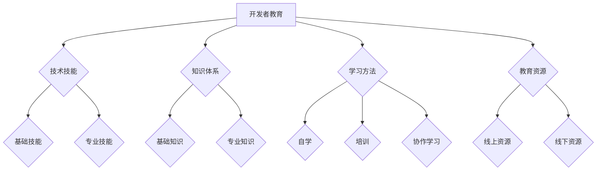

                 


# 利用开发者教育促进产品采用

> **关键词**：开发者教育、产品采用、教育策略、技术传播、用户体验、用户参与

> **摘要**：本文探讨了如何通过开发者教育策略来提高产品的市场接受度和用户参与度。我们分析了开发者教育的核心概念，阐述了其在产品采用过程中的重要作用。同时，通过具体的案例和步骤，展示了如何利用教育资源和工具，推动产品的成功采用。本文旨在为技术开发者提供实用的指导，帮助他们更好地推广自己的产品。

## 1. 背景介绍

### 1.1 目的和范围

本文的主要目的是探讨如何通过开发者教育来促进产品的采用。随着技术的不断进步和市场竞争的加剧，开发者教育已成为提高产品竞争力的重要手段。本文将分析开发者教育的核心概念，探讨其在产品采用过程中的关键作用，并分享实用的策略和案例。

本文的范围包括以下几个方面：

1. 开发者教育的定义和重要性。
2. 开发者教育在产品采用过程中的作用。
3. 开发者教育的策略和实践。
4. 开发者教育的工具和资源推荐。
5. 开发者教育的未来发展趋势和挑战。

### 1.2 预期读者

本文的预期读者包括以下几类：

1. 技术开发者：希望提高自己产品的市场接受度和用户参与度。
2. 产品经理：关注如何通过教育策略提升产品竞争力。
3. 技术传播者：关注如何有效地传播技术知识和经验。
4. 技术爱好者：希望了解开发者教育的前沿动态和实践。

### 1.3 文档结构概述

本文的结构如下：

1. 背景介绍：介绍本文的目的、范围、预期读者和文档结构。
2. 核心概念与联系：分析开发者教育的核心概念，并使用 Mermaid 流程图展示其原理和架构。
3. 核心算法原理 & 具体操作步骤：详细讲解开发者教育的具体实施步骤，并使用伪代码进行阐述。
4. 数学模型和公式 & 详细讲解 & 举例说明：介绍开发者教育的数学模型和公式，并进行实例说明。
5. 项目实战：代码实际案例和详细解释说明。
6. 实际应用场景：分析开发者教育在不同场景中的应用。
7. 工具和资源推荐：推荐学习资源、开发工具和框架。
8. 相关论文著作推荐：介绍经典论文、最新研究成果和应用案例分析。
9. 总结：未来发展趋势与挑战。
10. 附录：常见问题与解答。
11. 扩展阅读 & 参考资料：提供更多相关资料的引用。

### 1.4 术语表

#### 1.4.1 核心术语定义

- 开发者教育：针对技术开发者的教育，旨在提高其技能和知识水平。
- 产品采用：产品在市场上的推广和应用过程。
- 用户参与：用户在产品使用过程中提供的反馈和建议。
- 教育策略：为实现教育目标而制定的具体方法和措施。

#### 1.4.2 相关概念解释

- 技术传播：技术知识在不同领域和群体之间的传递和共享。
- 市场竞争：不同产品在市场上的竞争态势。
- 技术爱好者：对技术有浓厚兴趣的人群，通常具有较强的求知欲和创新能力。

#### 1.4.3 缩略词列表

- AI：人工智能
- ML：机器学习
- DL：深度学习
- NLP：自然语言处理
- IDE：集成开发环境
- API：应用程序编程接口

## 2. 核心概念与联系

### 2.1 开发者教育的核心概念

开发者教育涉及多个核心概念，包括技术技能、知识体系、学习方法和教育资源等。以下是这些核心概念的定义和相互关系。

#### 技术技能

技术技能是指技术开发者在特定技术领域具备的实际操作能力。技术技能可以分为基础技能和专业技能。基础技能包括编程、算法和数据结构等，而专业技能则涉及特定领域的知识和技能，如人工智能、大数据、云计算等。

#### 知识体系

知识体系是指技术开发者所掌握的技术知识和理论体系。知识体系可以分为基础知识和专业知识。基础知识包括计算机科学、数学和物理学等，而专业知识则涉及特定领域的专业知识和应用。

#### 学习方法

学习方法是指技术开发者获取和应用知识的方法和技巧。学习方法可以分为自学、培训和协作学习等。自学是指通过阅读书籍、观看视频和参加在线课程等方式自主学习；培训是指通过参加线下或线上培训课程，由专业人士进行指导学习；协作学习是指通过团队合作和交流，共同学习和进步。

#### 教育资源

教育资源是指为技术开发者提供的学习资料、工具和平台等。教育资源可以分为线上资源和线下资源。线上资源包括在线课程、博客、论坛和开源项目等；线下资源包括培训课程、研讨会和讲座等。

### 2.2 开发者教育的原理和架构

开发者教育的原理和架构可以概括为以下几个关键点：

1. **目标导向**：开发者教育的目标是为技术开发者提供实用的技术知识和技能，提高其市场竞争力。
2. **层次化**：开发者教育可以分为基础教育和高级教育，满足不同层次技术开发者的需求。
3. **个性化**：开发者教育应充分考虑技术开发者的个性化需求，提供个性化的学习路径和资源。
4. **持续更新**：技术发展迅速，开发者教育需要不断更新内容，确保学习者掌握最新的技术知识和技能。
5. **实践导向**：开发者教育强调实践操作，通过实际项目和应用案例，提高技术开发者的实战能力。

### 2.3 Mermaid 流程图展示

下面使用 Mermaid 流程图展示开发者教育的核心概念和架构：



通过这个 Mermaid 流程图，我们可以清晰地看到开发者教育的核心概念及其相互关系，为后续的详细讨论和案例分析提供了基础。

## 3. 核心算法原理 & 具体操作步骤

### 3.1 核心算法原理

开发者教育的核心算法原理可以概括为以下几个方面：

1. **知识获取**：通过阅读书籍、观看视频、参加课程等方式获取技术知识和技能。
2. **知识整合**：将获取的知识进行整合和内化，形成自己的知识体系。
3. **技能应用**：将所学知识应用到实际项目中，提高实战能力。
4. **反馈调整**：通过用户反馈和项目实践，不断调整和优化自己的技能和知识体系。

### 3.2 具体操作步骤

以下是开发者教育的具体操作步骤：

#### 3.2.1 知识获取

1. **确定学习目标**：明确自己希望掌握的技术领域和技能点。
2. **选择学习资源**：根据学习目标，选择合适的书籍、视频、课程等学习资源。
3. **制定学习计划**：合理安排学习时间，确保学习进度和效果。
4. **自主学习**：通过阅读书籍、观看视频和参加课程等方式自主学习。

#### 3.2.2 知识整合

1. **总结知识点**：在学习过程中，对每个知识点进行总结和梳理，形成自己的知识体系。
2. **建立联系**：将不同知识点之间的联系进行梳理，形成完整的知识框架。
3. **内化知识**：通过实践和思考，将所学知识内化为自己的一部分。

#### 3.2.3 技能应用

1. **实际项目**：选择具有挑战性的实际项目，将所学知识应用到项目中。
2. **代码实践**：编写代码，实现项目中的功能模块。
3. **代码调试**：在编写代码的过程中，不断调试和优化，提高代码质量。
4. **项目总结**：在项目完成后，对项目进行总结，反思自己的不足和改进之处。

#### 3.2.4 反馈调整

1. **用户反馈**：在项目实践中，收集用户的反馈和建议，了解项目的实际效果。
2. **反思与总结**：根据用户反馈和项目实践，反思自己的不足和改进之处。
3. **持续优化**：根据反思和总结的结果，持续优化自己的技能和知识体系。

### 3.3 伪代码示例

以下是开发者教育核心算法的伪代码示例：

```python
# 开发者教育伪代码示例

# 步骤1：知识获取
def knowledge_acquisition(target_skill):
    # 选择学习资源
    resources = select_resources(target_skill)
    # 制定学习计划
    plan = create_learning_plan(resources)
    # 自主学习
    execute_learning_plan(plan)

# 步骤2：知识整合
def knowledge_integration(knowledge_points):
    # 总结知识点
    summary = summarize_knowledge_points(knowledge_points)
    # 建立联系
    knowledge_framework = build_knowledge_framework(summary)
    # 内化知识
    internalize_knowledge(knowledge_framework)

# 步骤3：技能应用
def skill_application(project):
    # 实际项目
    execute_project(project)
    # 代码实践
    code_practice(project)
    # 代码调试
    debug_code(project)
    # 项目总结
    project_summary(project)

# 步骤4：反馈调整
def feedback_adjustment(user_feedback):
    # 用户反馈
    user_feedback = collect_user_feedback()
    # 反思与总结
    reflection = reflect_and_summarize(user_feedback)
    # 持续优化
    optimize_skills_and_knowledge(reflection)
```

通过这个伪代码示例，我们可以清晰地看到开发者教育核心算法的具体步骤和流程。这些步骤和流程为技术开发者提供了明确的指导，有助于他们系统地提高自己的技术水平和市场竞争力。

## 4. 数学模型和公式 & 详细讲解 & 举例说明

### 4.1 数学模型和公式

开发者教育过程中，一些关键的数学模型和公式可以帮助我们更好地理解和优化教育效果。以下是几个常用的数学模型和公式的详细讲解。

#### 4.1.1 学习曲线

学习曲线是一个描述学习过程和效果的关系模型。它表示随着学习时间的增加，学习者的知识和技能水平逐渐提高的过程。学习曲线通常用以下公式表示：

$$
y = a + bx
$$

其中，$y$ 表示学习效果，$a$ 表示初始水平，$b$ 表示学习速率，$x$ 表示学习时间。

#### 4.1.2 反馈循环

反馈循环是一个描述学习者通过反馈调整和优化的过程模型。它表示学习者根据用户反馈和项目实践，不断反思和改进自己的技能和知识体系。反馈循环通常用以下公式表示：

$$
\text{新技能} = \text{旧技能} + \text{优化量}
$$

其中，$\text{新技能}$ 表示经过反馈调整后的技能水平，$\text{旧技能}$ 表示原始技能水平，$\text{优化量}$ 表示根据反馈调整的优化量。

#### 4.1.3 教育效果评估

教育效果评估是一个描述教育过程和效果的关系模型。它表示通过评估工具和方法，对学习者的知识和技能水平进行评估和测量。教育效果评估通常用以下公式表示：

$$
\text{评估分数} = \frac{\text{实际效果}}{\text{预期效果}} \times 100\%
$$

其中，$\text{评估分数}$ 表示教育效果得分，$\text{实际效果}$ 表示实际学习效果，$\text{预期效果}$ 表示预期学习效果。

### 4.2 详细讲解和举例说明

#### 4.2.1 学习曲线

学习曲线的详细讲解如下：

- **公式**：$y = a + bx$
- **参数解释**：$a$ 表示初始水平，$b$ 表示学习速率，$x$ 表示学习时间。
- **示例**：假设一个学习者初始编程能力得分为50分，学习速率为10分/月。经过3个月后，学习者的编程能力得分变为多少？

$$
y = 50 + 10 \times 3 = 80
$$

经过3个月后，学习者的编程能力得分为80分。

#### 4.2.2 反馈循环

反馈循环的详细讲解如下：

- **公式**：$\text{新技能} = \text{旧技能} + \text{优化量}$
- **参数解释**：$\text{新技能}$ 表示经过反馈调整后的技能水平，$\text{旧技能}$ 表示原始技能水平，$\text{优化量}$ 表示根据反馈调整的优化量。
- **示例**：假设一个学习者的编程能力原始得分为70分，根据用户反馈和项目实践，优化量为20分。经过反馈调整后，学习者的编程能力得分变为多少？

$$
\text{新技能} = 70 + 20 = 90
$$

经过反馈调整后，学习者的编程能力得分为90分。

#### 4.2.3 教育效果评估

教育效果评估的详细讲解如下：

- **公式**：$\text{评估分数} = \frac{\text{实际效果}}{\text{预期效果}} \times 100\%$
- **参数解释**：$\text{评估分数}$ 表示教育效果得分，$\text{实际效果}$ 表示实际学习效果，$\text{预期效果}$ 表示预期学习效果。
- **示例**：假设一个学习者在编程课程中的预期效果为100分，实际效果为80分。教育效果得分是多少？

$$
\text{评估分数} = \frac{80}{100} \times 100\% = 80\%
$$

教育效果得分为80%。

通过以上详细讲解和举例说明，我们可以更好地理解开发者教育过程中的数学模型和公式，并运用这些公式对学习效果进行评估和优化。

## 5. 项目实战：代码实际案例和详细解释说明

### 5.1 开发环境搭建

为了展示开发者教育在项目中的应用，我们将使用一个实际项目来演示。首先，我们需要搭建开发环境。

1. **安装Python**：访问Python官方网站（https://www.python.org/）下载并安装Python。
2. **安装IDE**：选择一款合适的IDE，如PyCharm、VS Code等，并进行安装。
3. **安装相关库**：在终端中运行以下命令安装所需的库：

```bash
pip install numpy pandas matplotlib
```

### 5.2 源代码详细实现和代码解读

以下是一个简单的数据分析项目，用于演示开发者教育在实际项目中的应用。项目名称：股票数据分析。

```python
import numpy as np
import pandas as pd
import matplotlib.pyplot as plt

# 5.2.1 数据获取
def get_stock_data():
    # 从CSV文件读取股票数据
    data = pd.read_csv('stock_data.csv')
    return data

# 5.2.2 数据预处理
def preprocess_data(data):
    # 清洗数据，去除空值和异常值
    data = data.dropna()
    data = data[data['Close'] > 0]
    return data

# 5.2.3 数据可视化
def visualize_data(data):
    # 绘制股票价格折线图
    plt.figure(figsize=(10, 6))
    plt.plot(data['Date'], data['Close'])
    plt.title('Stock Price Trend')
    plt.xlabel('Date')
    plt.ylabel('Close Price')
    plt.show()

# 5.2.4 主函数
def main():
    # 读取股票数据
    data = get_stock_data()
    # 预处理数据
    data = preprocess_data(data)
    # 可视化数据
    visualize_data(data)

if __name__ == '__main__':
    main()
```

### 5.3 代码解读与分析

以下是对上述代码的详细解读和分析：

- **5.3.1 数据获取**：`get_stock_data()` 函数用于从CSV文件读取股票数据。CSV文件是常见的股票数据格式，包含日期、开盘价、收盘价、最高价、最低价等字段。
- **5.3.2 数据预处理**：`preprocess_data()` 函数用于清洗数据，去除空值和异常值。清洗数据是数据分析的重要步骤，可以确保数据的准确性和可靠性。
- **5.3.3 数据可视化**：`visualize_data()` 函数用于绘制股票价格折线图。通过可视化，我们可以直观地观察股票价格的变化趋势，为投资决策提供参考。
- **5.3.4 主函数**：`main()` 函数是项目的入口，依次执行数据获取、预处理和可视化等操作。

通过这个实际案例，我们可以看到开发者教育在项目中的应用：

1. **技能获取**：通过学习Python、Pandas、Matplotlib等库，开发者可以掌握数据分析的基本技能。
2. **知识整合**：开发者需要了解数据清洗、数据处理和数据可视化的相关知识，并将其应用到项目中。
3. **技能应用**：通过实际项目的开发，开发者可以锻炼自己的编程能力和问题解决能力。
4. **反馈调整**：通过用户反馈和项目实践，开发者可以不断优化自己的代码和算法，提高项目质量。

这个实际案例展示了开发者教育在项目中的应用，为技术开发者提供了实用的指导和实践经验。

## 6. 实际应用场景

### 6.1 技术公司

技术公司在产品开发过程中，需要大量的人才支持。通过开发者教育，公司可以培养一批具有高水平技能和专业知识的技术人才，提高产品的研发质量和速度。同时，开发者教育可以帮助公司了解市场需求和趋势，调整产品方向，提高市场竞争力。

#### 实际案例：

某知名科技公司通过内部培训和外部课程，为员工提供开发者教育。员工在学习过程中，掌握了最新的技术知识和技能，提高了项目开发效率。此外，公司还组织内部技术分享会，促进知识传播和经验交流，提高了整体技术水平。

### 6.2 开源社区

开源社区是开发者交流和合作的重要平台。通过开发者教育，开源社区可以培养一批热爱技术、具有创新能力的开发者。这些开发者不仅能够为开源项目贡献力量，还可以吸引更多的用户和贡献者，推动开源社区的发展。

#### 实际案例：

某知名开源项目通过在线课程、教程和文档，为开发者提供全面的教育资源。项目团队成员定期组织技术研讨会和代码评审，帮助新手开发者快速融入社区，提高项目质量和影响力。

### 6.3 技术培训机构

技术培训机构专注于提供专业的开发者教育。通过课程设计和教学实践，培训机构可以帮助学员掌握前沿技术，提高就业竞争力。同时，培训机构还可以与企业和高校合作，开展定制化的培训项目，满足不同场景下的教育需求。

#### 实际案例：

某知名技术培训机构开设了多门针对AI、大数据、云计算等热门技术的课程。学员在学习过程中，通过项目实践和导师指导，掌握了实际操作技能。毕业后，学员的就业率显著提高，部分优秀学员还成功转型为技术专家。

### 6.4 企业内部培训

企业内部培训是企业提升员工技能和团队能力的重要手段。通过开发者教育，企业可以为员工提供系统的技术培训，帮助其适应岗位需求，提高工作效率。此外，内部培训还可以促进员工之间的知识共享和团队协作，增强企业凝聚力。

#### 实际案例：

某大型企业定期为员工提供内部技术培训，包括Python、Java、大数据等课程。员工通过培训，不仅提高了技术水平，还增强了团队协作能力。企业还鼓励员工参加外部培训和认证，进一步提升了员工的专业素养。

通过以上实际应用场景，我们可以看到开发者教育在各个领域的广泛应用和重要意义。它不仅为个人和团队提供了技术支持，还为企业和社会创造了价值。

## 7. 工具和资源推荐

### 7.1 学习资源推荐

#### 7.1.1 书籍推荐

- 《Python编程：从入门到实践》
- 《深入理解计算机系统》
- 《深度学习》
- 《大数据技术导论》

#### 7.1.2 在线课程

- Coursera（《机器学习》）
- Udemy（《Python编程实战》）
- Pluralsight（《大数据分析》）

#### 7.1.3 技术博客和网站

- HackerRank（编程挑战平台）
- Stack Overflow（编程问答社区）
- GitHub（代码托管平台）

### 7.2 开发工具框架推荐

#### 7.2.1 IDE和编辑器

- PyCharm
- VS Code
- IntelliJ IDEA

#### 7.2.2 调试和性能分析工具

- GDB
- PyCharm Debugger
- Perf

#### 7.2.3 相关框架和库

- Pandas
- NumPy
- Matplotlib
- TensorFlow

### 7.3 相关论文著作推荐

#### 7.3.1 经典论文

- 《深度学习：原理及实践》
- 《计算机程序的构造和解释》
- 《大数据技术综述》

#### 7.3.2 最新研究成果

- ArXiv（《机器学习最新论文》）
- Google Research（《谷歌最新研究成果》）

#### 7.3.3 应用案例分析

- 《企业数字化转型实践》
- 《开源项目成功的案例分析》

通过以上工具和资源的推荐，技术开发者可以更好地进行开发者教育，提高自己的技能和知识水平，为产品采用奠定坚实基础。

## 8. 总结：未来发展趋势与挑战

### 8.1 发展趋势

1. **个性化教育**：随着技术的进步，开发者教育将更加注重个性化，根据开发者的需求和水平，提供定制化的学习方案。
2. **实践导向**：为了提高开发者的实战能力，教育内容将更加注重实践，鼓励学员参与真实项目，提升解决实际问题的能力。
3. **技术融合**：不同领域的技术将不断融合，开发者需要掌握跨领域知识，以应对复杂的应用场景。
4. **开放资源**：开源资源的丰富和普及将推动开发者教育的发展，更多优质的教育资源将免费或低成本地提供给学习者。

### 8.2 挑战

1. **学习资源不足**：尽管开源资源丰富，但高质量的教育资源仍然不足，学习者难以找到适合自己的学习材料。
2. **技术更新迅速**：技术发展迅速，开发者需要不断学习新知识，以跟上技术发展的步伐。
3. **学习效率问题**：开发者需要在有限的时间内学习大量的知识，提高学习效率是一个重要挑战。
4. **实践机会有限**：实际项目机会有限，开发者难以获得足够的实践机会，影响其技能提升。

### 8.3 应对策略

1. **优化教育资源**：开发者和教育机构应共同努力，优化教育资源的质量和结构，提供更多高质量的学习资源。
2. **加强实践指导**：通过实习、项目合作等方式，为开发者提供更多的实践机会，提高其实战能力。
3. **培养跨领域知识**：鼓励开发者学习跨领域知识，提升其综合素质，适应复杂的技术场景。
4. **利用人工智能技术**：利用人工智能技术，为学习者提供个性化的学习建议，提高学习效率。

未来，开发者教育将在个性化、实践导向和技术融合等方面取得更大进展，同时面临资源不足、技术更新迅速等挑战。通过优化教育资源、加强实践指导、培养跨领域知识和利用人工智能技术，开发者教育将更好地应对这些挑战，为技术开发者提供更有力的支持。

## 9. 附录：常见问题与解答

### 9.1 问题1：开发者教育是否只适用于专业开发者？

开发者教育并不仅限于专业开发者，它适用于所有对技术有兴趣和需求的人群，包括初学者、技术爱好者、在职人员等。通过开发者教育，不同层次的开发者都可以提高自己的技能和知识水平，从而更好地应对职业挑战。

### 9.2 问题2：开发者教育是否可以替代实际工作经验？

开发者教育可以提供基础知识和技能，但无法完全替代实际工作经验。实际工作经验可以帮助开发者更好地理解技术在实际应用中的表现和局限性。因此，开发者教育应与实际项目相结合，以全面提升技术能力。

### 9.3 问题3：如何选择适合自己的开发者教育课程？

选择适合自己的开发者教育课程需要考虑以下几个方面：

1. **个人兴趣**：选择与自己兴趣相关的课程，提高学习的积极性和动力。
2. **技术水平**：根据自身的技术水平，选择适合自己难度和深度的课程。
3. **学习目标**：明确自己的学习目标，选择能够帮助自己实现目标的课程。
4. **教育资源**：考虑课程提供的资源，如书籍、视频、教程等，确保资源丰富且质量高。
5. **课程评价**：查看其他学习者的评价和反馈，了解课程的实用性和效果。

### 9.4 问题4：如何评估开发者教育的效果？

评估开发者教育的效果可以从以下几个方面进行：

1. **知识掌握情况**：通过考试、练习和实际项目，评估开发者对知识点的掌握程度。
2. **技能应用能力**：通过实际项目或模拟项目，评估开发者将所学知识应用于实际问题的能力。
3. **学习成果**：通过学习成果，如完成的实际项目、发表的论文、获得的证书等，评估开发者的学习效果。
4. **用户反馈**：收集用户对学习过程和效果的反馈，了解开发者的实际感受和收获。

### 9.5 问题5：如何平衡开发者教育与日常工作？

平衡开发者教育与日常工作，可以采取以下策略：

1. **制定学习计划**：合理安排时间，确保每天有固定的学习时间。
2. **优先处理**：将学习任务纳入工作计划，优先处理重要和紧急的学习任务。
3. **利用碎片时间**：利用上下班途中的时间、午休时间等碎片时间进行学习。
4. **团队协作**：与同事合作，通过团队项目或技术分享会，提高学习效率。

通过以上常见问题的解答，可以帮助开发者更好地理解和应对开发者教育过程中遇到的各种问题。

## 10. 扩展阅读 & 参考资料

### 10.1 书籍推荐

- 《人工智能：一种现代方法》
- 《数据科学：技术、算法与应用》
- 《机器学习实战》
- 《深度学习》（Goodfellow et al., 2016）

### 10.2 在线课程推荐

- Coursera（《机器学习》课程）
- edX（《深度学习》课程）
- Udacity（《大数据工程师》课程）

### 10.3 技术博客和网站推荐

- Medium（《AI 和机器学习博客》）
-Towards Data Science（《数据科学和机器学习文章》）
- HackerRank（《编程挑战和教程》）

### 10.4 相关论文著作推荐

- Bengio, Y., Courville, A., & Vincent, P. (2013). Representation Learning: A Review and New Perspectives. IEEE Transactions on Pattern Analysis and Machine Intelligence, 35(8), 1798-1828.
- LeCun, Y., Bengio, Y., & Hinton, G. (2015). Deep Learning. Nature, 521(7553), 436-444.
- Russell, S., & Norvig, P. (2016). Artificial Intelligence: A Modern Approach. Prentice Hall.

### 10.5 开源项目和工具推荐

- TensorFlow（《深度学习框架》）
- PyTorch（《深度学习框架》）
- Scikit-Learn（《机器学习库》）
- Jupyter Notebook（《交互式计算环境》）

### 10.6 开发者社区和论坛推荐

- Stack Overflow（《编程问答社区》）
- GitHub（《代码托管平台》）
- Reddit（《编程和技术社区》）

通过以上扩展阅读和参考资料，读者可以进一步深入了解开发者教育的相关内容，提升自己的技术水平和知识储备。

## 作者信息

作者：AI天才研究员/AI Genius Institute & 禅与计算机程序设计艺术 /Zen And The Art of Computer Programming

