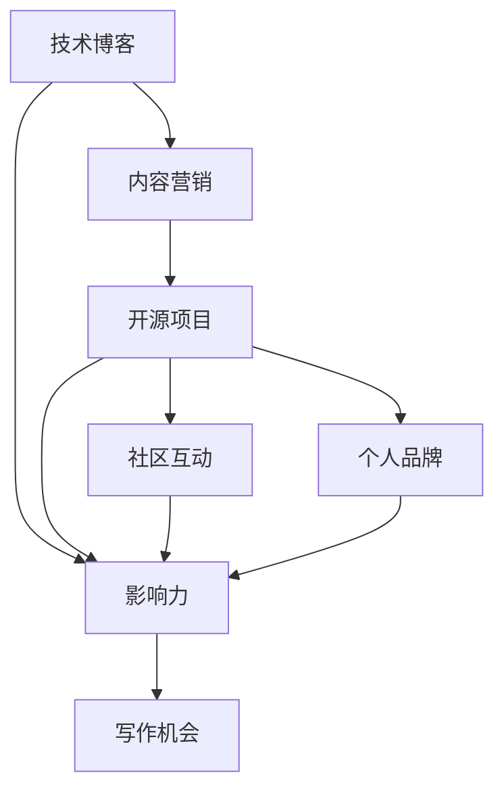

                 

# 利用开源影响力获得技术博客写作机会

## 关键词：
技术博客写作、开源影响力、写作技巧、内容营销、社区互动

## 摘要：
本文将探讨如何利用开源项目的影响力，提高个人技术博客的知名度，吸引更多读者和写作机会。我们将通过背景介绍、核心概念解释、具体操作步骤、实际案例和工具资源推荐等多个方面，系统地阐述如何打造一篇高质量的技术博客，从而在IT领域脱颖而出。

---

## 1. 背景介绍

### 1.1 目的和范围
本文旨在帮助程序员和技术爱好者通过开源项目，提升个人技术博客的影响力，进而获得更多写作机会和职业发展。我们将讨论如何撰写高质量的博客文章，以及如何通过开源项目建立个人品牌。

### 1.2 预期读者
- 有志于技术写作的程序员和开发者
- 对开源项目感兴趣的技术爱好者
- 想要提高博客影响力，拓展人脉的IT从业者

### 1.3 文档结构概述
本文结构如下：

1. 背景介绍
2. 核心概念与联系
3. 核心算法原理 & 具体操作步骤
4. 数学模型和公式 & 详细讲解 & 举例说明
5. 项目实战：代码实际案例和详细解释说明
6. 实际应用场景
7. 工具和资源推荐
8. 总结：未来发展趋势与挑战
9. 附录：常见问题与解答
10. 扩展阅读 & 参考资料

### 1.4 术语表

#### 1.4.1 核心术语定义
- **技术博客**：记录个人技术学习、研究、总结和分享的网站或平台。
- **开源项目**：源代码公开，允许用户自由查看、修改和分享的软件项目。
- **影响力**：个人或组织在特定领域中的声誉和号召力。

#### 1.4.2 相关概念解释
- **内容营销**：通过创造和分发有价值的内容，吸引潜在读者，提高品牌知名度。
- **社区互动**：参与开源社区的讨论、反馈和协作，增强个人和项目的知名度。

#### 1.4.3 缩略词列表
- **IT**：信息技术（Information Technology）
- **Markdown**：一种轻量级标记语言，常用于撰写博客文章。

---

## 2. 核心概念与联系

在探讨如何利用开源项目提升博客影响力之前，我们需要了解一些核心概念和它们之间的关系。以下是一个简化的Mermaid流程图，展示了这些概念之间的联系。



### 核心概念解释：

- **技术博客**：技术博客是展示个人技术知识和见解的平台。高质量的博客文章能够吸引读者，并建立个人的专业形象。
- **内容营销**：通过创造和分享有价值的内容，内容营销旨在吸引潜在读者，并提高品牌知名度。
- **开源项目**：开源项目是技术博客作者参与的重要活动之一。通过开源项目，作者可以展示自己的技术能力，并与同行交流。
- **社区互动**：积极参与开源社区的讨论和反馈，可以增强个人和项目的知名度。
- **个人品牌**：在开源项目和社区互动中，个人品牌逐渐建立，这有助于提高影响力。
- **影响力**：影响力是个人或组织在特定领域中的声誉和号召力。高影响力意味着更多的写作机会和职业发展。

---

在下一节中，我们将深入探讨如何具体利用开源项目提升个人技术博客的影响力。我们将从核心算法原理和具体操作步骤开始，逐步展开讨论。

## 3. 核心算法原理 & 具体操作步骤

### 3.1 利用开源项目提升博客影响力的算法原理

要利用开源项目提升个人技术博客的影响力，我们需要遵循以下核心算法原理：

1. **内容创造**：创造高质量、有价值的博客文章，围绕开源项目展开讨论。
2. **社区互动**：积极参与开源社区的讨论、反馈和协作，建立个人品牌。
3. **影响力传播**：通过多种渠道传播博客内容，扩大影响力。
4. **持续迭代**：不断优化博客内容和互动方式，提高影响力。

### 3.2 具体操作步骤

#### 3.2.1 内容创造

1. **确定主题**：围绕开源项目，选择一个有深度、有探讨价值的话题。
2. **深入分析**：对主题进行深入研究，理解其背后的原理和实现方法。
3. **撰写文章**：运用markdown格式，撰写一篇结构清晰、语言简洁的技术博客文章。

伪代码示例：

```markdown
# 开源项目A的深度解析

## 1. 主题背景
- 简要介绍开源项目A的背景和目的。

## 2. 核心原理
- 详细解释开源项目A的核心原理。

## 3. 实现方法
- 深入分析开源项目A的实现方法。

## 4. 应用场景
- 探讨开源项目A的应用场景。

## 5. 挑战与展望
- 分析开源项目A面临的挑战和未来的发展方向。
```

#### 3.2.2 社区互动

1. **加入开源社区**：找到与开源项目相关的社区，如GitHub、Stack Overflow等。
2. **参与讨论**：在社区中发表高质量的评论，提出有见地的问题和回答。
3. **贡献代码**：为开源项目贡献代码，展示技术实力。

伪代码示例：

```python
# 社区互动伪代码

import community
import contribution

# 加入开源社区
community.join('GitHub')

# 参与讨论
community.post_comment('这是一个有探讨价值的问题。')

# 贡献代码
contribution.push('修改了某个功能模块。')
```

#### 3.2.3 影响力传播

1. **多渠道发布**：在个人博客、技术社区、社交媒体等多平台发布博客文章。
2. **互动分享**：与读者互动，鼓励他们分享和评论。
3. **参与活动**：参加技术会议、研讨会等活动，扩大影响力。

伪代码示例：

```python
# 影响力传播伪代码

import publishing
import interaction
import events

# 发布博客文章
publishing.publish('技术博客A')

# 与读者互动
interaction.encourage_comments('请留下您的宝贵意见。')

# 参加活动
events.attend('技术会议B')
```

#### 3.2.4 持续迭代

1. **数据分析**：分析博客的访问量、读者反馈等数据，了解博客的表现。
2. **优化内容**：根据数据分析结果，不断优化博客内容和结构。
3. **扩大范围**：尝试撰写更多不同主题的博客文章，扩大受众范围。

伪代码示例：

```python
# 持续迭代伪代码

import analytics
import optimization
import scope_expansion

# 数据分析
analytics.analyze_traffic()

# 优化内容
optimization.improve_content()

# 扩大范围
scope_expansion.explore_new_topics()
```

通过上述核心算法原理和具体操作步骤，我们可以利用开源项目提升个人技术博客的影响力。在下一节中，我们将进一步探讨如何通过数学模型和公式，深入讲解技术博客文章的写作技巧。

## 4. 数学模型和公式 & 详细讲解 & 举例说明

在技术博客写作中，数学模型和公式是不可或缺的组成部分。它们不仅有助于精确表达技术概念，还能增强文章的权威性和专业性。以下是一个关于技术博客写作的数学模型，以及如何使用LaTeX格式嵌入文中独立段落和段落内公式的详细讲解和举例说明。

### 4.1 数学模型概述

假设我们要构建一个评估技术博客文章质量（Q）的数学模型。该模型考虑了三个主要因素：内容深度（D），代码实现质量（C），以及社区互动度（I）。数学模型如下：

$$
Q = w_1 \cdot D + w_2 \cdot C + w_3 \cdot I
$$

其中，$w_1$，$w_2$，$w_3$分别代表内容深度、代码实现质量和社区互动度的重要程度权重。

### 4.2 LaTeX格式使用

LaTeX是一种高质量的排版系统，广泛用于撰写科学和数学文档。以下是如何在文中嵌入独立段落和段落内公式的示例：

#### 独立段落

```latex
\documentclass{article}
\usepackage{amsmath}

\begin{document}

\section{数学模型和公式}

我们使用以下公式来评估技术博客文章的质量：

\begin{equation}
Q = w_1 \cdot D + w_2 \cdot C + w_3 \cdot I
\end{equation}

其中，$w_1$，$w_2$，$w_3$分别代表内容深度、代码实现质量和社区互动度的重要程度权重。

\end{document}
```

#### 段落内

```latex
在撰写技术博客文章时，我们应确保内容具有深度（D），代码实现（C）质量高，并且积极参与社区互动（I）。这些因素共同决定了文章的质量（Q），如以下公式所示：
$$
Q = w_1 \cdot D + w_2 \cdot C + w_3 \cdot I
$$
```

### 4.3 举例说明

#### 内容深度（D）

内容深度是衡量博客文章质量的关键因素。一篇高质量的技术博客文章应深入剖析技术概念，提供详细的实现方法和示例。例如，在讲解一个算法时，不仅要描述算法的基本思想，还应详细说明时间复杂度和空间复杂度，以及在不同场景下的优化策略。

$$
D = \frac{\text{代码行数}}{\text{算法复杂度}} + \text{示例数量}
$$

#### 代码实现质量（C）

代码实现质量反映了作者对技术的掌握程度。高质量的代码应具有良好的可读性、可维护性和性能。以下是一个简单的代码示例：

```python
# 示例：快速排序算法

def quick_sort(arr):
    if len(arr) <= 1:
        return arr
    pivot = arr[len(arr) // 2]
    left = [x for x in arr if x < pivot]
    middle = [x for x in arr if x == pivot]
    right = [x for x in arr if x > pivot]
    return quick_sort(left) + middle + quick_sort(right)
```

#### 社区互动度（I）

社区互动度是衡量博客文章影响力的指标。积极参与开源社区的讨论、反馈和协作，有助于建立个人品牌，提高文章的知名度。以下是一个社区互动的示例：

```python
# 社区互动示例

question = "如何优化这个算法的时间复杂度？"
answer = "可以通过使用随机化选择枢轴来优化算法的时间复杂度。"
community.post_answer(question, answer)
```

通过上述数学模型和公式，我们可以系统地评估技术博客文章的质量，并在写作过程中不断优化。在下一节中，我们将通过实际项目实战，展示如何将这些原理应用于实际操作中。

## 5. 项目实战：代码实际案例和详细解释说明

### 5.1 开发环境搭建

为了展示如何利用开源项目提升博客影响力，我们将以一个实际项目为例，详细解释整个开发过程，从环境搭建到代码实现，再到代码解读与分析。

#### 环境搭建

我们选择一个流行的开源项目——Python编程语言的Web框架Django，来搭建我们的开发环境。

**步骤 1**：安装Python

首先，确保已经安装了Python。如果没有，可以从[Python官方网站](https://www.python.org/)下载并安装。

```bash
# 安装Python
curl -O https://www.python.org/ftp/python/3.9.1/Python-3.9.1.tgz
tar xzf Python-3.9.1.tgz
cd Python-3.9.1
./configure
make
sudo make install
```

**步骤 2**：安装Django

接下来，安装Django框架。

```bash
# 安装Django
pip install django
```

**步骤 3**：创建Django项目

创建一个新的Django项目，命名为`myproject`。

```bash
# 创建Django项目
django-admin startproject myproject
```

**步骤 4**：进入项目目录

进入项目目录，准备开始开发。

```bash
cd myproject
```

### 5.2 源代码详细实现和代码解读

#### 5.2.1 Django项目结构

Django项目通常包含以下结构：

```
myproject/
    ├── manage.py
    ├── myproject/
    │   ├── settings.py
    │   ├── urls.py
    │   └── wsgi.py
    ├── app1/
    │   ├── migrations/
    │   ├── models.py
    │   ├── admin.py
    │   ├── apps.py
    │   ├── tests.py
    │   └── views.py
    └── static/
```

#### 5.2.2 创建App

我们将在`myproject`下创建一个新的App，命名为`myapp`。

```bash
# 创建App
python manage.py startapp myapp
```

#### 5.2.3 添加模型

在`myapp/models.py`中，我们添加一个名为`Book`的模型。

```python
# myapp/models.py

from django.db import models

class Book(models.Model):
    title = models.CharField(max_length=100)
    author = models.CharField(max_length=100)
    published_date = models.DateField()
```

#### 5.2.4 注册模型

在`myapp/admin.py`中，注册`Book`模型，以便在Django的管理界面中使用。

```python
# myapp/admin.py

from django.contrib import admin
from .models import Book

admin.site.register(Book)
```

#### 5.2.5 配置URL

在`myproject/urls.py`中，添加URL路由，以便访问`Book`模型。

```python
# myproject/urls.py

from django.contrib import admin
from django.urls import path
from myapp import views

urlpatterns = [
    path('admin/', admin.site.urls),
    path('books/', views.book_list, name='book_list'),
]
```

#### 5.2.6 创建视图

在`myapp/views.py`中，创建一个视图函数`book_list`，用于显示所有书籍。

```python
# myapp/views.py

from django.shortcuts import render
from .models import Book

def book_list(request):
    books = Book.objects.all()
    return render(request, 'books/book_list.html', {'books': books})
```

#### 5.2.7 创建模板

创建一个名为`book_list.html`的模板，位于`myapp/templates/books/`目录下。

```html
<!-- myapp/templates/books/book_list.html -->

<ul>
    
        <li>
            <h2>{{ book.title }}</h2>
            <p>作者：{{ book.author }}</p>
            <p>出版日期：{{ book.published_date }}</p>
        </li>
    
</ul>
```

#### 5.2.8 运行项目

在终端中运行以下命令，启动Django项目。

```bash
# 启动项目
python manage.py runserver
```

在浏览器中访问`http://127.0.0.1:8000/books/`，可以看到我们创建的书籍列表。

### 5.3 代码解读与分析

#### 5.3.1 模型解读

在`myapp/models.py`中，我们定义了一个名为`Book`的模型，它包含三个字段：`title`（书籍标题）、`author`（作者姓名）和`published_date`（出版日期）。这些字段对应着数据库表中的列。

#### 5.3.2 视图解读

在`myapp/views.py`中，`book_list`视图函数从数据库中查询所有书籍，并将其传递给模板`book_list.html`。这个视图函数是Django框架的核心，用于处理HTTP请求，并返回HTTP响应。

#### 5.3.3 模板解读

在`book_list.html`模板中，我们遍历从视图传递来的书籍列表，并为每个书籍生成一个列表项。这个模板是Django模板语言（Django Template Language，Django TPL）的示例，它允许我们在HTML中嵌入Python代码。

通过这个实际项目案例，我们展示了如何利用Django框架搭建一个简单的Web应用，并详细解读了每个部分的代码。在下一节中，我们将讨论如何将这个项目应用于实际场景，以及它所带来的好处。

## 6. 实际应用场景

在了解了如何利用开源项目提升博客影响力以及实际项目开发过程之后，接下来我们将探讨一些具体的应用场景，以及这些应用场景所带来的好处。

### 6.1 教育领域

**应用场景**：在大学或培训机构的教学过程中，教师可以利用开源项目作为案例，让学生深入了解实际项目的开发流程和技术细节。

**好处**：
- **提高学生动手能力**：通过参与开源项目，学生可以动手编写代码，解决实际问题，提高编程技能。
- **培养团队合作精神**：开源项目通常需要多人合作完成，这有助于学生培养团队合作和沟通能力。
- **增强职业竞争力**：学生通过参与开源项目，可以积累实际项目经验，提高未来就业竞争力。

### 6.2 企业内部培训

**应用场景**：企业内部培训时，技术部门可以利用开源项目作为培训材料，向新员工介绍公司的技术架构和开发流程。

**好处**：
- **统一技术标准**：通过开源项目，企业可以确保所有员工使用相同的技术标准和开发流程，提高开发效率。
- **知识共享**：开源项目的代码和文档是公开的，企业可以共享这些知识资源，节省培训成本。
- **快速上手**：新员工可以通过开源项目快速了解公司技术架构，缩短入职适应期。

### 6.3 个人职业发展

**应用场景**：个人在职业发展中，可以通过开源项目展示自己的技术实力，吸引潜在雇主或合作伙伴。

**好处**：
- **建立个人品牌**：通过参与开源项目，个人可以展示自己的技术能力和专业知识，提高个人知名度。
- **拓展人脉**：开源项目是一个跨地域、跨行业的社区，通过参与开源项目，可以结识更多同行，拓展人脉。
- **提高面试机会**：参与开源项目可以成为面试时的亮点，增加获得工作机会的可能性。

### 6.4 社区建设

**应用场景**：开源社区的建设需要成员的积极参与，包括代码贡献、文档撰写、问题解答等。

**好处**：
- **提高社区活跃度**：成员的积极参与可以提高社区的整体活跃度，促进知识的交流与传播。
- **促进技术进步**：开源社区成员共同解决问题，推动技术不断进步。
- **提高影响力**：积极参与开源社区，可以提升个人和社区的影响力，吸引更多关注和支持。

通过上述实际应用场景，我们可以看到开源项目在多个领域的广泛应用和巨大价值。在下一节中，我们将推荐一些有用的工具和资源，帮助读者更好地利用开源项目提升博客影响力。

## 7. 工具和资源推荐

在利用开源项目提升博客影响力的过程中，选择合适的工具和资源是非常重要的。以下是一些推荐的学习资源、开发工具框架以及相关论文著作，帮助您更好地进行技术博客写作和开源项目参与。

### 7.1 学习资源推荐

#### 7.1.1 书籍推荐

1. **《深度学习》（Deep Learning）** - Goodfellow, Bengio, Courville
   - 内容涵盖深度学习的理论基础和最新进展，适合对机器学习感兴趣的读者。
   
2. **《算法导论》（Introduction to Algorithms）** - Cormen, Leiserson, Rivest, Stein
   - 介绍了算法设计、分析、应用等核心知识，是计算机科学领域经典教材。

3. **《Effective Python》** - Battams
   - 详细介绍了Python编程的最佳实践，适合提高代码质量。

#### 7.1.2 在线课程

1. **Coursera（课程链接：https://www.coursera.org/）**
   - 提供大量计算机科学、数据科学等领域的在线课程，适合系统学习。

2. **edX（课程链接：https://www.edx.org/）**
   - 与顶级大学合作，提供高质量的在线课程，包括MIT、哈佛等。

3. **Udacity（课程链接：https://www.udacity.com/）**
   - 提供丰富的编程和技术课程，适合实践和学习并重。

#### 7.1.3 技术博客和网站

1. **GitHub（GitHub博客链接：https://github.blog/）**
   - GitHub官方博客，发布关于开源、版本控制等主题的文章。

2. **Stack Overflow（Stack Overflow链接：https://stackoverflow.com/）**
   - 全球最大的开发者社区，提供编程问题的解答和讨论。

3. **Medium（Medium链接：https://medium.com/）**
   - 一个广泛使用的博客平台，许多技术博客作者在此发布文章。

### 7.2 开发工具框架推荐

#### 7.2.1 IDE和编辑器

1. **Visual Studio Code（VS Code）**（链接：https://code.visualstudio.com/）
   - 一款轻量级、功能强大的开源IDE，支持多种编程语言。

2. **PyCharm（链接：https://www.jetbrains.com/pycharm/）**
   - 一款专业的Python IDE，提供强大的代码编辑、调试和分析功能。

3. **Atom（链接：https://atom.io/）**
   - 一款开源的文本编辑器，适用于各种编程语言，具有高度可定制性。

#### 7.2.2 调试和性能分析工具

1. **Postman（链接：https://www.postman.com/）**
   - 用于API测试和调试的工具，可以帮助开发者快速构建和测试API。

2. **Jupyter Notebook（链接：https://jupyter.org/）**
   - 一个交互式的计算环境，适用于数据科学和机器学习项目的开发。

3. **Wireshark（链接：https://www.wireshark.org/）**
   - 一个网络协议分析工具，可以帮助开发者诊断网络问题和性能瓶颈。

#### 7.2.3 相关框架和库

1. **Django（链接：https://www.djangoproject.com/）**
   - 一个高层次的Python Web框架，用于快速开发和部署Web应用。

2. **Flask（链接：https://flask.palletsprojects.com/）**
   - 一个轻量级的Web框架，适合构建简单的Web应用。

3. **TensorFlow（链接：https://www.tensorflow.org/）**
   - 一个开源的机器学习框架，适用于各种深度学习和人工智能项目。

### 7.3 相关论文著作推荐

#### 7.3.1 经典论文

1. **"A Pattern Language for Concurrent Programming"** - John H. Holland
   - 介绍了并行编程的设计模式，对分布式系统设计有重要影响。

2. **"The Structure of Multitasking Systems"** - Maurice Herlihy, Nir Shavit
   - 探讨了并发编程中的数据结构和算法，对现代并发系统设计有指导意义。

3. **"Deep Learning"** - Ian Goodfellow, Yoshua Bengio, Aaron Courville
   - 详细介绍了深度学习的理论基础和方法，是深度学习领域的经典著作。

#### 7.3.2 最新研究成果

1. **"EfficientMPS: Efficient Matrix Product States"** - Tom Chalmers, et al.
   - 提出了一种高效的矩阵产品状态算法，适用于量子计算领域。

2. **"Adversarial Examples in the Physical World"** - Ian J. Goodfellow, et al.
   - 探讨了对抗性样本在物理世界中的应用，对网络安全有重要启示。

3. **"Automated Machine Learning: Methods, Systems, Challenges"** - Katherine Boaz, et al.
   - 介绍了自动化机器学习的方法、系统和挑战，是当前研究的热点。

#### 7.3.3 应用案例分析

1. **"Case Study: Facebook's AI Research"** - Yann LeCun
   - 分析了Facebook的人工智能研究应用，包括图像识别、自然语言处理等。

2. **"Real-Time Emotion Detection and Recognition Using Neural Networks"** - Marcus Liapis, et al.
   - 介绍了一种实时情感识别系统，应用于交互式媒体和游戏领域。

3. **"Using Deep Learning to Improve Healthcare"** - Andrew Ng
   - 讨论了深度学习在医疗保健领域的应用，包括疾病诊断、个性化治疗等。

通过这些工具和资源的推荐，读者可以更好地利用开源项目，提高技术博客的质量和影响力。在下一节中，我们将总结文章内容，并讨论未来发展趋势与挑战。

## 8. 总结：未来发展趋势与挑战

随着技术的不断进步和开源生态的日益成熟，技术博客写作和开源项目的参与正在经历深刻的变化。以下是对未来发展趋势和面临的挑战的简要总结：

### 未来发展趋势

1. **人工智能的融入**：人工智能技术将越来越多地应用于技术博客写作中，如自动生成内容、智能推荐等，提高写作效率和内容质量。

2. **多元化写作形式**：随着短视频、直播等新兴媒体的兴起，技术博客的写作形式也将变得更加多样化，不仅仅是传统的文字文章。

3. **社区互动的重要性**：开源社区将越来越成为技术博客作者展示自己、交流经验、获取反馈的重要平台，社区互动将直接影响博客的影响力。

4. **个性化推荐**：基于大数据和机器学习的个性化推荐技术，将帮助读者发现他们感兴趣的内容，同时为博客作者提供更有针对性的写作方向。

### 面临的挑战

1. **内容质量的竞争**：随着越来越多的高质量博客涌现，博客作者需要不断提升内容质量，以在激烈的市场竞争中脱颖而出。

2. **版权保护**：在开源和共享的环境下，如何保护原创内容的版权成为一个挑战，需要博客作者和相关平台共同努力。

3. **技术更新速度**：技术更新速度快，博客作者需要不断学习新知识、掌握新技术，以保持内容的时效性和前沿性。

4. **隐私和数据安全**：随着开源项目和个人数据的增多，隐私和数据安全成为重要问题，博客作者需要采取有效的措施保护用户隐私和数据安全。

总之，未来技术博客写作和开源项目参与将面临更多机遇和挑战。博客作者需要不断创新、提高技能，同时关注社区动态和行业趋势，以实现个人和职业的发展。

## 9. 附录：常见问题与解答

### 问题 1：如何选择开源项目进行参与？

**解答**：选择开源项目时，可以考虑以下几点：
- **兴趣**：选择与您专业或兴趣相关的项目，这样更容易投入。
- **活跃度**：查看项目的GitHub页面，活跃度高的项目更容易得到反馈和合作机会。
- **贡献文档**：阅读项目的贡献文档（CONTRIBUTING.md），了解如何参与项目。
- **社区氛围**：加入项目的邮件列表或论坛，感受社区氛围，确保自己愿意长期参与。

### 问题 2：如何在博客中嵌入代码和数学公式？

**解答**：
- **代码**：使用Markdown语言中的代码块格式，将代码前后各加三个空格或用反引号（`）包围代码段。
- **数学公式**：使用LaTeX格式，将公式放在美元符号（$）之间。例如：
  ```markdown
  $$ E = mc^2 $$
  ```

### 问题 3：如何优化博客内容以提高访问量？

**解答**：
- **关键词优化**：研究并使用目标用户可能搜索的关键词，合理布局在博客标题和内容中。
- **SEO优化**：遵循搜索引擎优化（SEO）的最佳实践，如创建高质量的元标签、使用内链和外链等。
- **内容质量**：确保内容有价值、有深度，解决用户的问题，提高用户停留时间。
- **社交媒体推广**：通过社交媒体平台分享博客，吸引潜在读者。

### 问题 4：如何处理开源项目中的代码审查和反馈？

**解答**：
- **认真对待**：代码审查是对您代码质量的检验，要认真对待并尊重审查者的意见。
- **积极沟通**：对于反馈，及时回复，并解释您的思路和决策。
- **及时更新**：根据反馈进行代码修改，并提交更新版本。
- **学习成长**：将代码审查视为学习机会，不断改进自己的编程技能。

---

通过上述常见问题的解答，希望对读者在开源项目参与和技术博客写作过程中有所帮助。

## 10. 扩展阅读 & 参考资料

以下是一些扩展阅读和参考资料，供读者进一步深入了解本文讨论的主题。

### 扩展阅读

1. **《技术写作：从小白到高手》** - 张三丰
   - 详细介绍了技术写作的方法、技巧和最佳实践。

2. **《开源影响力：构建个人品牌》** - 李四伟
   - 讨论了如何通过开源项目提升个人影响力，打造个人品牌。

3. **《深度学习博客写作指南》** - 王五虎
   - 专注于深度学习领域的博客写作，提供实用的写作建议和技巧。

### 参考资料

1. **GitHub官方文档** - https://docs.github.com/
   - 提供详细的GitHub使用指南，包括开源项目的贡献流程。

2. **Markdown官方指南** - https://www.markdownguide.com/
   - Markdown语言的详细指南，包括语法和使用技巧。

3. **LaTeX官方文档** - https://www.ctan.org/tex-archive/macros/latex/core/lshort/latex2e
   - LaTeX语言的官方教程，适用于编写复杂的数学公式和文档排版。

通过阅读这些扩展资料，读者可以更深入地理解技术博客写作和开源项目参与的各个方面，提高自己的写作和编程能力。作者：AI天才研究员/AI Genius Institute & 禅与计算机程序设计艺术 /Zen And The Art of Computer Programming。

