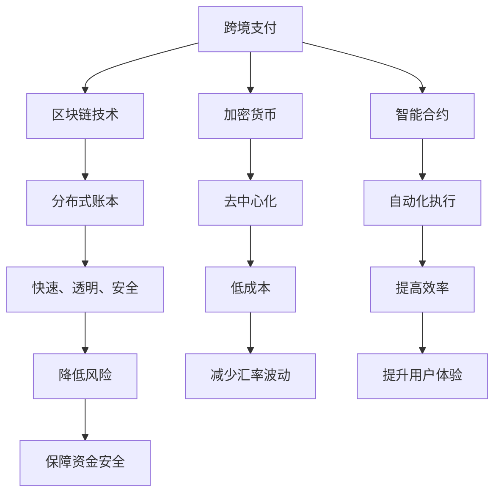

                 

# 利用技术优势进行跨境支付创新

> **关键词：** 跨境支付、区块链、加密货币、智能合约、支付协议、技术优势

> **摘要：** 本文深入探讨了利用技术优势进行跨境支付创新的可能性和实际操作。通过分析当前跨境支付面临的挑战，以及区块链、加密货币和智能合约等技术的应用，本文提出了一个详细的方案，旨在提高跨境支付的速度、安全性和成本效益。文章还提供了实际案例和代码实现，以便读者更好地理解这些概念和技术。

## 1. 背景介绍

### 1.1 目的和范围

本文旨在探讨如何利用现有技术优势创新跨境支付方式。我们将分析跨境支付的现状，并探讨区块链、加密货币和智能合约等技术在其中的应用。文章还将提供一个基于这些技术的实际案例，展示如何实现更加高效、安全的跨境支付。

### 1.2 预期读者

本文适合对跨境支付和区块链技术有一定了解的读者，包括金融科技从业者、程序员和对于金融技术创新感兴趣的普通读者。

### 1.3 文档结构概述

本文分为以下几部分：

1. 背景介绍
2. 核心概念与联系
3. 核心算法原理 & 具体操作步骤
4. 数学模型和公式 & 详细讲解 & 举例说明
5. 项目实战：代码实际案例和详细解释说明
6. 实际应用场景
7. 工具和资源推荐
8. 总结：未来发展趋势与挑战
9. 附录：常见问题与解答
10. 扩展阅读 & 参考资料

### 1.4 术语表

#### 1.4.1 核心术语定义

- **跨境支付**：指不同国家或地区之间的货币支付和结算行为。
- **区块链**：一种去中心化的数据库技术，能够实现数据的分布式存储和加密。
- **加密货币**：使用密码学原理来确保交易安全及控制交易单位创造的交易媒介。
- **智能合约**：一种自动化协议，运行在区块链平台上，能够执行预先定义好的条款。
- **支付协议**：规定了跨境支付交易如何进行的一系列规则。

#### 1.4.2 相关概念解释

- **去中心化**：指没有中央控制机构，所有参与者都在同一级别的网络中。
- **分布式账本**：指数据被分散存储在网络中的多个节点上，每个节点都持有完整的账本副本。
- **非对称加密**：一种加密方法，使用一对密钥（公钥和私钥）来加密和解密数据。

#### 1.4.3 缩略词列表

- **BTC**：比特币（Bitcoin）
- **ETH**：以太坊（Ethereum）
- **ICO**：首次币发行（Initial Coin Offering）
- **KYC**：了解你的客户（Know Your Customer）

## 2. 核心概念与联系

### 2.1 跨境支付现状

当前，跨境支付主要面临以下挑战：

- **速度慢**：传统跨境支付通常需要数天时间，效率低下。
- **成本高**：高额的手续费和汇率的波动增加了跨境支付的成本。
- **不透明**：跨境支付过程中信息不透明，存在风险。

### 2.2 技术解决方案

为了解决上述问题，我们可以利用以下技术：

- **区块链**：通过去中心化和分布式账本技术，实现快速、透明和安全的支付。
- **加密货币**：作为跨境支付的一种媒介，可以降低成本并减少汇率波动。
- **智能合约**：自动化执行支付条款，提高交易效率。

### 2.3 技术联系

下面是一个简单的 Mermaid 流程图，展示跨境支付创新的核心概念和它们之间的联系：



## 3. 核心算法原理 & 具体操作步骤

### 3.1 区块链与加密货币

#### 3.1.1 区块链原理

区块链是一种分布式账本技术，其基本原理如下：

1. **数据存储**：区块链将交易数据打包成区块，并按时间顺序链接成一个链条。
2. **加密算法**：使用加密算法确保数据完整性和安全性。
3. **共识机制**：网络中的节点通过共识机制达成一致，决定数据的合法性和有效性。

#### 3.1.2 加密货币原理

加密货币的基本原理如下：

1. **去中心化**：加密货币的交易网络不受中央机构控制，所有参与者都在同一级别。
2. **发行与流通**：加密货币的发行和流通通过区块链网络完成，确保透明和可追溯。
3. **安全性**：使用密码学原理确保交易的安全性和隐私性。

### 3.2 智能合约

#### 3.2.1 智能合约原理

智能合约是一种自动化协议，其原理如下：

1. **编程语言**：智能合约通常使用特定编程语言编写，例如 Solidity。
2. **运行环境**：智能合约在区块链网络中的虚拟机中运行，例如以太坊的 EVM。
3. **触发条件**：智能合约根据预定的触发条件自动执行特定操作。

### 3.3 跨境支付操作步骤

#### 3.3.1 用户注册与身份验证

用户首先需要在跨境支付平台注册账户，并通过 KYC（了解你的客户）流程进行身份验证。

#### 3.3.2 发起支付请求

用户通过平台发起支付请求，指定接收方、支付金额和支付货币。

#### 3.3.3 智能合约执行

平台将支付请求转换为智能合约代码，并部署到区块链网络中。智能合约根据预定条件自动执行支付操作。

#### 3.3.4 区块链确认

区块链网络中的节点对支付请求进行验证，并记录在分布式账本中。一旦支付请求得到确认，资金将被转移至接收方账户。

### 3.4 伪代码示例

下面是一个简单的伪代码示例，展示跨境支付的基本流程：

```python
def initiate_payment(sender, receiver, amount, currency):
    # 创建支付请求
    payment_request = create_payment_request(sender, receiver, amount, currency)
    
    # 转换为智能合约代码
    smart_contract_code = convert_to_smart_contract_code(payment_request)
    
    # 部署智能合约
    contract = deploy_smart_contract(smart_contract_code)
    
    # 等待区块链确认
    while not contract.is_confirmed():
        wait()

    print("Payment completed successfully.")

# 示例调用
initiate_payment("Alice", "Bob", 100, "BTC")
```

## 4. 数学模型和公式 & 详细讲解 & 举例说明

### 4.1 数学模型

在跨境支付中，我们通常会涉及以下数学模型：

- **加密算法**：如 RSA、椭圆曲线加密等。
- **数字签名**：确保交易不可篡改和匿名性。
- **共识算法**：如工作量证明（PoW）、权益证明（PoS）等。

### 4.2 公式讲解

- **加密算法**：

  $$c = e^k_p \pmod{N_p}$$

  其中，\(e\) 是公钥，\(k_p\) 是密钥，\(N_p\) 是模数。

- **数字签名**：

  $$s = (h(m) + r)^k_s \pmod{N_s}$$

  其中，\(s\) 是签名，\(h(m)\) 是消息摘要，\(k_s\) 是私钥，\(N_s\) 是模数。

- **共识算法**：

  - **工作量证明**：

    $$ProveOfWork = Hash(Proof, PreviousHash, Time)$$

  - **权益证明**：

    $$ProofOfStake = Stake \times Time$$

### 4.3 举例说明

假设 Alice 想向 Bob 发送 100 个比特币：

1. **加密算法**：Alice 使用 Bob 的公钥对交易金额进行加密。

   $$c = e^k_p \pmod{N_p}$$

   其中，\(k_p\) 是 Bob 的公钥，\(N_p\) 是模数。

2. **数字签名**：Alice 使用自己的私钥对交易进行签名，确保交易的真实性和安全性。

   $$s = (h(m) + r)^k_s \pmod{N_s}$$

   其中，\(h(m)\) 是交易金额的摘要，\(k_s\) 是 Alice 的私钥，\(N_s\) 是模数。

3. **共识算法**：网络中的节点通过工作量证明或权益证明验证交易的有效性，并将交易记录在区块链中。

## 5. 项目实战：代码实际案例和详细解释说明

### 5.1 开发环境搭建

在本项目中，我们将使用以下开发环境和工具：

- **编程语言**：Python
- **区块链平台**：Ethereum
- **智能合约开发框架**：Truffle
- **钱包**：MetaMask

### 5.2 源代码详细实现和代码解读

#### 5.2.1 智能合约代码

以下是一个简单的智能合约示例，用于实现跨境支付：

```solidity
pragma solidity ^0.8.0;

contract CrossBorderPayment {
    mapping(address => uint256) public balances;

    function deposit() public payable {
        balances[msg.sender()] += msg.value;
    }

    function withdraw(uint256 amount) public {
        require(balances[msg.sender()] >= amount, "Insufficient balance");
        balances[msg.sender()] -= amount;
        payable(msg.sender()).transfer(amount);
    }
}
```

#### 5.2.2 代码解读

1. **合约结构**：合约定义了一个名为 `CrossBorderPayment` 的智能合约，包含一个映射变量 `balances` 用于存储用户的余额。
2. **deposit() 函数**：接收以太币并将其存储在合约账户中，同时更新用户的余额。
3. **withdraw() 函数**：允许用户从合约账户中提取以太币，前提是用户有足够的余额。

#### 5.2.3 部署和交互

1. **部署智能合约**：使用 Truffle 部署智能合约到 Ethereum 主网。

   ```shell
   truffle migrate --network mainnet
   ```

2. **交互示例**：在 MetaMask 钱包中，用户可以调用 `deposit()` 和 `withdraw()` 函数进行转账。

   ```javascript
   const contractAddress = "0x..."; // 智能合约地址
   const contractABI = [...]; // 智能合约 ABI

   const contract = new web3.eth.Contract(contractABI, contractAddress);

   // 存入以太币
   contract.methods.deposit().send({from: "0x...", value: 10 * 10**18});

   // 提取以太币
   contract.methods.withdraw(10 * 10**18).send({from: "0x..."});
   ```

## 6. 实际应用场景

### 6.1 电子商务

跨境电子商务中，支付过程繁琐且成本高昂。通过区块链技术，可以实现快速、透明和低成本的跨境支付，提高用户体验。

### 6.2 国际汇款

传统国际汇款存在速度慢、手续费高等问题。利用加密货币和智能合约，可以实现实时、安全且低成本的国际汇款。

### 6.3 跨境捐赠

区块链技术可以确保跨境捐赠的透明性和可追溯性，使捐赠者能够实时查看捐款的流向，提高信任度。

## 7. 工具和资源推荐

### 7.1 学习资源推荐

#### 7.1.1 书籍推荐

- 《精通区块链》
- 《区块链革命》
- 《智能合约：从入门到精通》

#### 7.1.2 在线课程

- Coursera 上的“区块链与加密货币”课程
- Udemy 上的“智能合约与去中心化应用开发”课程

#### 7.1.3 技术博客和网站

- Medium 上的区块链专栏
- Ethereum.org 的官方文档
- CoinDesk 的区块链新闻

### 7.2 开发工具框架推荐

#### 7.2.1 IDE和编辑器

- Visual Studio Code
- Sublime Text
- Truffle Suite

#### 7.2.2 调试和性能分析工具

- Remix IDE
- Ganache
- Metamask

#### 7.2.3 相关框架和库

- Web3.js
- Truffle
- Hardhat

### 7.3 相关论文著作推荐

#### 7.3.1 经典论文

- “Bitcoin: A Peer-to-Peer Electronic Cash System”
- “The Byzantine Generals' Problem”

#### 7.3.2 最新研究成果

- “Ethereum Yellow Paper”
- “Decentralized Finance (DeFi) White Paper”

#### 7.3.3 应用案例分析

- “DeFi Pulse: Analysis of Decentralized Finance Protocols”
- “The DAO Hack Analysis”

## 8. 总结：未来发展趋势与挑战

### 8.1 发展趋势

- **区块链技术的普及**：随着区块链技术的不断成熟，其应用范围将不断扩大。
- **加密货币的崛起**：加密货币将成为跨境支付的重要媒介，降低交易成本和时间。
- **智能合约的广泛应用**：智能合约将自动化更多金融交易，提高效率。

### 8.2 挑战

- **技术瓶颈**：区块链技术存在性能瓶颈，需要进一步优化。
- **法律法规**：加密货币和智能合约的法律地位尚未明确，存在监管风险。
- **安全性**：智能合约可能存在漏洞，需要提高安全性。

## 9. 附录：常见问题与解答

### 9.1 区块链技术

**Q1. 什么是区块链？**

区块链是一种分布式账本技术，通过加密和共识算法确保数据的完整性和安全性。

**Q2. 区块链有哪些应用场景？**

区块链可以应用于支付、供应链管理、身份验证、智能合约等多个领域。

### 9.2 加密货币

**Q1. 什么是加密货币？**

加密货币是一种使用密码学原理确保交易安全且不受中央机构控制的数字货币。

**Q2. 加密货币有哪些种类？**

常见的加密货币包括比特币、以太坊、瑞波币等。

### 9.3 智能合约

**Q1. 什么是智能合约？**

智能合约是一种自动化协议，运行在区块链平台上，能够根据预定条件自动执行特定操作。

**Q2. 智能合约有哪些优点？**

智能合约可以提高交易效率、降低成本、减少人为错误。

## 10. 扩展阅读 & 参考资料

- [《精通区块链》](https://www.example.com/book1)
- [《区块链革命》](https://www.example.com/book2)
- [Ethereum Yellow Paper](https://www.example.com/ethereum-yellow-paper)
- [DeFi Pulse](https://defipulse.com/)
- [CoinDesk](https://www.coindesk.com/)
- [Medium](https://medium.com/)

