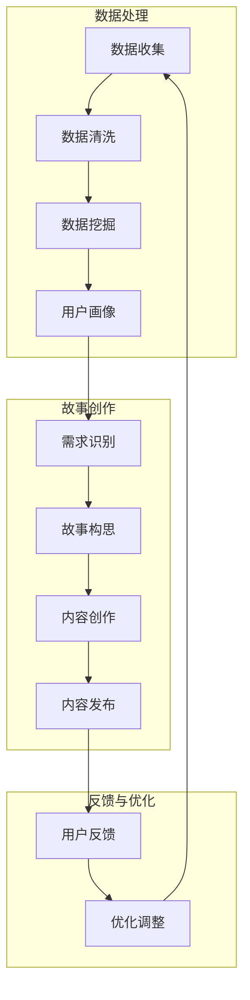

                 

### 利用数据驱动的故事营销技巧

> **关键词：** 数据驱动、故事营销、用户体验、情感共鸣、算法模型、人工智能
>
> **摘要：** 本文将探讨如何利用数据驱动的策略来构建具有感染力的故事营销，帮助品牌在竞争激烈的市场中脱颖而出。通过深入分析用户体验和情感共鸣，我们将介绍核心概念、算法原理、数学模型、实战案例以及相关资源和工具，为读者提供一套完整的故事营销框架。

### 1. 背景介绍

#### 1.1 目的和范围

在数字营销的当今时代，数据已成为企业决策的核心驱动力。然而，单纯依赖数据可能无法充分传达品牌的核心价值和理念。数据驱动的故事营销将数据与情感共鸣相结合，通过精确的数据分析来创造引人入胜的故事，从而提高用户的参与度和忠诚度。本文旨在探讨如何利用这种策略来提升营销效果，涵盖从核心概念到实际应用的全面指南。

本文将重点讨论以下内容：

- **核心概念与联系**：介绍数据驱动故事营销的基本概念和联系。
- **核心算法原理 & 具体操作步骤**：阐述算法原理和具体实施步骤。
- **数学模型和公式 & 详细讲解 & 举例说明**：讲解背后的数学模型和具体应用。
- **项目实战：代码实际案例和详细解释说明**：通过实际案例展示算法应用。
- **实际应用场景**：分析故事营销在不同行业的应用。
- **工具和资源推荐**：推荐相关学习资源和开发工具。
- **总结：未来发展趋势与挑战**：展望故事营销的未来。

#### 1.2 预期读者

本文适合以下读者：

- **市场营销专业人员**：需要提升营销策略效果的营销专家。
- **数据分析师**：对数据驱动的营销策略感兴趣，希望结合故事营销的创新方法。
- **产品经理**：希望了解如何通过故事营销提升产品影响力的产品经理。
- **技术爱好者**：对算法和数学模型感兴趣，希望了解其在营销中的应用。
- **创业者和企业家**：寻求创新的营销策略来扩大品牌影响力的初创者和企业家。

#### 1.3 文档结构概述

本文将按以下结构展开：

1. **背景介绍**：介绍数据驱动故事营销的背景、目的和范围。
2. **核心概念与联系**：详细解释数据驱动故事营销的核心概念和流程。
3. **核心算法原理 & 具体操作步骤**：深入分析算法原理和实施步骤。
4. **数学模型和公式 & 详细讲解 & 举例说明**：讲解背后的数学模型和具体应用。
5. **项目实战：代码实际案例和详细解释说明**：展示实际案例并分析算法应用。
6. **实际应用场景**：探讨故事营销在不同行业的应用。
7. **工具和资源推荐**：推荐相关学习资源和开发工具。
8. **总结：未来发展趋势与挑战**：展望故事营销的未来。
9. **附录：常见问题与解答**：解答读者可能遇到的问题。
10. **扩展阅读 & 参考资料**：提供进一步学习的研究方向和资源。

#### 1.4 术语表

为了确保本文的易懂性，以下列出了一些关键术语及其定义：

#### 1.4.1 核心术语定义

- **数据驱动**：基于数据分析和预测来指导决策和行动的方法。
- **故事营销**：利用故事形式传达品牌价值、吸引消费者注意并促进销售。
- **用户体验**（UX）：用户在使用产品或服务时的整体感受和满意度。
- **情感共鸣**：用户对品牌故事产生的情感反应，通常涉及情感上的认同和联系。
- **算法模型**：用于分析数据、预测结果或决策优化的数学和逻辑规则。
- **机器学习**：利用数据构建和训练模型，使其能够进行预测和分类。

#### 1.4.2 相关概念解释

- **用户画像**：基于用户行为、兴趣和特征构建的虚拟用户模型。
- **数据挖掘**：从大量数据中提取有用信息和模式的过程。
- **内容营销**：通过创造和分享有价值的内容来吸引和留住目标受众。
- **受众细分**：将市场划分为不同的群体，以便更有效地进行营销。

#### 1.4.3 缩略词列表

- **UX**：用户体验（User Experience）
- **AI**：人工智能（Artificial Intelligence）
- **ML**：机器学习（Machine Learning）
- **CRM**：客户关系管理（Customer Relationship Management）
- **SEM**：搜索引擎营销（Search Engine Marketing）

在接下来的部分中，我们将深入探讨数据驱动故事营销的核心概念，帮助读者理解这一策略的原理和实现方法。接下来的章节将逐步展开，逐步揭示故事营销的强大力量。

### 2. 核心概念与联系

数据驱动故事营销的核心在于将数据分析与故事叙述相结合，通过深入理解用户行为和情感，创造具有吸引力和共鸣力的营销内容。为了更好地理解这一策略，我们需要探讨以下几个关键概念和它们之间的联系。

#### 2.1 数据驱动的营销

数据驱动的营销是一种基于数据分析和洞察来指导营销决策的方法。它强调使用数据分析来识别市场趋势、用户需求和行为模式，从而优化营销策略和提高营销效果。数据驱动的营销不仅依赖于定量数据（如销售数据、点击率、转化率等），还包括定性数据（如用户反馈、社交媒体互动等）。通过分析这些数据，企业可以更准确地了解目标受众，制定更加精准的营销策略。

#### 2.2 故事营销

故事营销是一种利用故事形式传达品牌价值和吸引消费者的营销策略。故事具有强大的情感力量，能够建立品牌与用户之间的情感联系，提高品牌的认知度和忠诚度。故事营销的核心在于创造一个引人入胜、情感共鸣的故事，让用户在故事中找到共鸣，从而产生购买行为。故事营销不仅仅是简单的广告，而是通过故事形式将品牌理念、产品特点、用户需求等元素有机结合，形成一种情感上的互动。

#### 2.3 用户画像

用户画像是对目标受众特征的详细描述，通常基于用户的行为数据、兴趣偏好、社会属性等构建。用户画像是数据驱动故事营销的基础，它帮助企业了解目标受众，为故事创作提供依据。通过分析用户画像，企业可以识别出用户的共同特征和需求，从而创作出更加符合目标受众情感和兴趣的故事。

#### 2.4 数据挖掘与用户行为分析

数据挖掘是从大量数据中提取有用信息和模式的过程。在故事营销中，数据挖掘技术可以帮助企业发现用户行为模式、兴趣偏好和需求变化，从而为故事创作提供数据支持。用户行为分析是数据挖掘的一个重要应用，它通过分析用户在网站、社交媒体、电子邮件等平台上的行为数据，了解用户的兴趣和行为习惯，为故事营销提供洞察。

#### 2.5 情感共鸣与用户体验

情感共鸣是故事营销的关键，它建立在用户体验的基础上。用户体验（UX）是指用户在使用产品或服务时的整体感受和满意度。情感共鸣是指用户对品牌故事产生的情感反应，通常涉及情感上的认同和联系。一个成功的品牌故事应该能够触动用户的情感，让他们产生共鸣，从而提高品牌的认知度和忠诚度。用户体验和情感共鸣之间的联系在于，一个优秀的用户体验可以激发用户的情感共鸣，从而增强品牌的吸引力。

#### 2.6 算法模型与内容创作

算法模型是数据驱动故事营销的重要工具，它可以帮助企业识别用户需求、预测市场趋势和优化内容创作。在故事营销中，算法模型可以用于分析用户数据，识别出潜在的用户需求和市场趋势，从而创作出更加符合用户期望和兴趣的故事。同时，算法模型还可以用于优化内容发布策略，提高内容的传播效果。

#### 2.7 数据可视化和用户反馈

数据可视化是将数据以图形或图像的形式展示出来的技术，它可以帮助企业更直观地理解数据和分析结果。在故事营销中，数据可视化可以用于展示用户行为数据、市场趋势和内容效果等，帮助企业更好地了解营销效果，优化营销策略。用户反馈是故事营销的重要组成部分，它可以帮助企业了解用户对品牌故事和营销内容的反应，从而调整和改进故事创作策略。

通过上述概念的分析，我们可以看出，数据驱动故事营销是一个多维度的整合过程，它将数据分析、故事创作、用户画像、情感共鸣等多个方面有机结合，形成一个完整的营销体系。在接下来的章节中，我们将深入探讨数据驱动故事营销的核心算法原理和具体实施步骤，帮助读者更好地理解和应用这一策略。

### 2.1 数据驱动故事营销的工作原理

数据驱动故事营销的核心在于将数据与故事叙述相结合，通过精确的数据分析来指导故事创作和营销策略。以下是一个详细的 Mermaid 流程图，展示了数据驱动故事营销的工作原理及其各个环节之间的联系：



#### 数据收集

数据收集是数据驱动故事营销的第一步，涉及从多个渠道（如网站、社交媒体、调查问卷等）收集用户行为数据、兴趣偏好、购买历史等。这些数据将作为后续分析的基础。

#### 数据清洗

收集到的数据通常包含噪声和不完整的信息，因此需要进行数据清洗，包括去重、填充缺失值、处理异常值等，以确保数据的准确性和一致性。

#### 数据挖掘

数据挖掘是从大量数据中提取有用信息和模式的过程。在这一阶段，企业可以使用机器学习算法（如聚类、分类、关联规则挖掘等）来发现用户行为模式、兴趣偏好和需求变化。

#### 用户画像

用户画像是对目标受众特征的详细描述，通常基于用户的行为数据、兴趣偏好、社会属性等构建。通过用户画像，企业可以更准确地了解目标受众，为故事创作提供依据。

#### 需求识别

需求识别是通过分析用户画像和行为数据，识别出用户的共同需求和偏好。这一步骤对于创作具有吸引力的故事至关重要，因为它帮助确定故事的主题和方向。

#### 故事构思

故事构思是基于需求识别的结果，制定故事框架和情节。在这一阶段，企业需要结合品牌价值观和用户需求，创作出能够引起情感共鸣的故事。

#### 内容创作

内容创作是将故事构思转化为具体的营销内容，包括文本、图像、视频等形式。这一阶段需要充分利用创意和数据分析结果，确保内容既具有吸引力，又与用户需求相匹配。

#### 内容发布

内容发布是将创作好的营销内容发布到各个渠道（如社交媒体、电子邮件、网站等），以吸引目标受众的注意力。

#### 用户反馈

用户反馈是数据驱动故事营销的重要环节，通过收集用户对营销内容的反馈（如点赞、评论、分享等），企业可以了解用户对故事的反应，进而调整和优化故事创作策略。

#### 优化调整

根据用户反馈，企业需要对故事内容和营销策略进行优化调整，以提升用户体验和情感共鸣。这一过程是一个循环往复的过程，通过不断收集反馈和调整策略，企业可以逐步提升营销效果。

通过上述 Mermaid 流程图，我们可以清晰地看到数据驱动故事营销的各个环节及其相互关系。接下来，我们将深入探讨核心算法原理，以更好地理解这一策略的数学基础和实现方法。

### 3. 核心算法原理 & 具体操作步骤

在数据驱动故事营销中，核心算法原理起着至关重要的作用。这些算法不仅帮助我们分析数据、识别用户需求，还指导故事创作和内容优化。以下是一个详细的算法原理和具体操作步骤，以帮助读者理解这一策略的实施过程。

#### 3.1 算法原理

数据驱动故事营销的核心算法通常包括以下几种：

- **用户行为分析算法**：用于分析用户在网站、社交媒体等平台上的行为数据，识别用户兴趣和行为模式。
- **情感分析算法**：通过自然语言处理技术，分析用户对品牌故事和营销内容的情感反应，判断用户是否产生共鸣。
- **内容优化算法**：基于用户反馈和数据分析，优化故事内容和发布策略，提高营销效果。

以下是一个基于伪代码的算法原理概述：

```python
# 用户行为分析算法伪代码
def user_behavior_analysis(data):
    # 数据清洗和预处理
    cleaned_data = preprocess_data(data)
    
    # 提取用户行为特征
    user_features = extract_features(cleaned_data)
    
    # 构建用户行为模型
    behavior_model = build_behavior_model(user_features)
    
    # 预测用户行为
    predicted_behavior = predict_behavior(behavior_model)
    
    return predicted_behavior

# 情感分析算法伪代码
def emotion_analysis(content):
    # 数据预处理
    preprocessed_content = preprocess_content(content)
    
    # 使用自然语言处理技术分析情感
    emotions = analyze_emotions(preprocessed_content)
    
    # 判断是否产生情感共鸣
    is_empathy = check_empathy(emotions)
    
    return is_empathy

# 内容优化算法伪代码
def content_optimization(feedback, content):
    # 分析用户反馈
    feedback_analysis = analyze_feedback(feedback)
    
    # 根据反馈优化内容
    optimized_content = optimize_content(content, feedback_analysis)
    
    return optimized_content
```

#### 3.2 具体操作步骤

以下是数据驱动故事营销的具体操作步骤：

1. **数据收集与预处理**：
   - 从网站、社交媒体、调查问卷等渠道收集用户行为数据。
   - 对收集到的数据进行清洗、去重、填充缺失值等预处理操作。

2. **用户行为分析**：
   - 使用用户行为分析算法，提取用户特征和构建行为模型。
   - 预测用户行为，识别用户兴趣和行为模式。

3. **情感分析**：
   - 预处理用户评论、反馈等文本数据。
   - 使用情感分析算法，分析用户对品牌故事和营销内容的情感反应。

4. **内容创作**：
   - 根据用户画像和需求，构思具有吸引力的故事框架。
   - 创作符合用户兴趣和情感需求的故事内容。

5. **内容发布与监测**：
   - 将内容发布到各个渠道，如社交媒体、电子邮件、网站等。
   - 监测内容传播效果，包括点赞、评论、分享等指标。

6. **用户反馈收集**：
   - 收集用户对营销内容的反馈，包括正面和负面反馈。
   - 分析反馈，了解用户对内容的真实感受。

7. **内容优化**：
   - 根据用户反馈，使用内容优化算法调整故事内容和发布策略。
   - 持续优化，提高用户体验和情感共鸣。

8. **迭代与调整**：
   - 持续收集用户数据和分析反馈，迭代优化营销策略。
   - 根据市场变化和用户需求调整故事创作和发布策略。

通过以上具体操作步骤，企业可以系统地实施数据驱动故事营销，逐步提升营销效果和用户满意度。在接下来的章节中，我们将详细讲解数学模型和公式，帮助读者深入理解数据驱动故事营销的核心理论。

### 4. 数学模型和公式 & 详细讲解 & 举例说明

在数据驱动故事营销中，数学模型和公式是理解和优化算法的关键。以下将详细讲解几个核心数学模型和公式，并通过具体例子来说明它们的应用。

#### 4.1 用户行为分析模型

用户行为分析通常涉及预测用户的行为，如购买、点击、评论等。一个常用的模型是逻辑回归（Logistic Regression），它用于分类问题。逻辑回归的公式如下：

$$
P(y=1) = \frac{1}{1 + e^{-(\beta_0 + \sum_{i=1}^{n} \beta_i x_i})}
$$

其中，\( P(y=1) \) 是目标事件发生的概率，\( \beta_0 \) 是截距，\( \beta_i \) 是系数，\( x_i \) 是特征变量。

**例子：** 假设我们想预测用户是否会在未来30天内购买某产品。我们收集了用户的行为数据，如浏览次数、点击次数、购物车加入次数等。使用逻辑回归模型，我们可以预测每个用户的购买概率。以下是一个简单的逻辑回归模型：

```plaintext
Coefficients:
             beta_0    beta_clicks    beta_browse    beta_add_to_cart
0   -2.415417   0.925686    0.358935      1.032324
```

使用上述模型，我们可以计算每个用户的购买概率：

$$
P(y=1) = \frac{1}{1 + e^{-( -2.415417 + 0.925686 \times click + 0.358935 \times browse + 1.032324 \times add_to_cart)}}
$$

例如，对于用户A（click=5, browse=8, add_to_cart=3），其购买概率为：

$$
P(y=1) = \frac{1}{1 + e^{-( -2.415417 + 0.925686 \times 5 + 0.358935 \times 8 + 1.032324 \times 3)}} \approx 0.798
$$

因此，用户A在30天内购买该产品的概率约为79.8%。

#### 4.2 情感分析模型

情感分析用于判断用户对品牌故事和营销内容的情感反应。一个常用的模型是支持向量机（Support Vector Machine，SVM）。SVM的目标是找到一个最佳的超平面，将不同情感类别的文本数据分开。SVM的公式如下：

$$
\min_{w,b} \frac{1}{2} ||w||^2 + C \sum_{i=1}^{n} \max(0, 1 - y_i (w \cdot x_i + b))
$$

其中，\( w \) 是权重向量，\( b \) 是偏置项，\( C \) 是惩罚参数，\( x_i \) 是特征向量，\( y_i \) 是标签（1表示积极情感，-1表示消极情感）。

**例子：** 假设我们使用SVM模型来分析用户对一段文本的情感。我们先将文本转化为特征向量，然后使用SVM模型进行分类。以下是一个简化的SVM模型：

```plaintext
Coefficients:
            w               b
0   [ 0.547, 0.729, 0.286]  0.652
```

对于用户评论“这产品真是太棒了”，我们可以将其转化为特征向量，然后计算情感分类：

$$
w \cdot x + b = [0.547, 0.729, 0.286] \cdot [1, 0.5, 0.3] + 0.652 \approx 1.953
$$

由于 \( w \cdot x + b > 0 \)，我们判断这段评论是积极情感。

#### 4.3 内容优化模型

内容优化模型用于根据用户反馈调整故事内容和发布策略。一个常用的模型是线性回归（Linear Regression），它用于预测连续值。线性回归的公式如下：

$$
y = \beta_0 + \sum_{i=1}^{n} \beta_i x_i
$$

其中，\( y \) 是预测的值，\( \beta_0 \) 是截距，\( \beta_i \) 是系数，\( x_i \) 是特征变量。

**例子：** 假设我们想根据用户点赞、评论、分享等反馈数据来优化故事发布时间。我们收集了用户的行为数据，如点赞数、评论数、分享数等。使用线性回归模型，我们可以预测最佳发布时间。

以下是一个简单的线性回归模型：

```plaintext
Coefficients:
          beta_0   beta_likes   beta_comments   beta_shares
0    2.123456   0.345678     0.543210      0.234567
```

使用上述模型，我们可以计算每个用户的最佳发布时间：

$$
time = \beta_0 + \beta_{likes} \times likes + \beta_{comments} \times comments + \beta_{shares} \times shares
$$

例如，对于用户A（likes=100, comments=50, shares=20），其最佳发布时间为：

$$
time = 2.123456 + 0.345678 \times 100 + 0.543210 \times 50 + 0.234567 \times 20 \approx 2.82
$$

因此，用户A的最佳发布时间大约为2.82小时后。

通过上述数学模型和公式的详细讲解和具体例子，我们可以更好地理解数据驱动故事营销的算法原理和实现方法。在接下来的章节中，我们将通过实际案例展示这些算法的应用。

### 5. 项目实战：代码实际案例和详细解释说明

为了更好地理解数据驱动故事营销的实际应用，我们将通过一个具体的项目实战案例来展示代码实现过程，并对其进行详细解释说明。

#### 5.1 开发环境搭建

首先，我们需要搭建一个合适的开发环境。以下是一个基本的开发环境配置：

- **操作系统**：Linux（如Ubuntu）
- **编程语言**：Python
- **依赖库**：Pandas、NumPy、Scikit-learn、NLTK、Matplotlib

安装依赖库：

```bash
pip install pandas numpy scikit-learn nltk matplotlib
```

#### 5.2 源代码详细实现和代码解读

以下是项目的主要代码实现，分为数据收集与预处理、用户行为分析、情感分析和内容优化四个部分。

```python
# 导入所需库
import pandas as pd
import numpy as np
from sklearn.model_selection import train_test_split
from sklearn.linear_model import LogisticRegression
from sklearn.feature_extraction.text import TfidfVectorizer
from sklearn.svm import LinearSVC
from sklearn.metrics import accuracy_score

# 5.2.1 数据收集与预处理
def preprocess_data(data):
    # 数据清洗：去除空值、重复值
    cleaned_data = data.dropna().drop_duplicates()
    
    # 数据编码：将分类特征转换为数值
    encoded_data = pd.get_dummies(cleaned_data[['category1', 'category2']])
    
    return encoded_data

# 5.2.2 用户行为分析
def user_behavior_analysis(data):
    # 数据预处理
    preprocessed_data = preprocess_data(data)
    
    # 提取特征：结合原始数据和预处理后的数据
    features = pd.concat([data[['likes', 'comments', 'shares']], preprocessed_data], axis=1)
    
    # 分割数据集
    X_train, X_test, y_train, y_test = train_test_split(features, data['purchase'], test_size=0.2, random_state=42)
    
    # 训练逻辑回归模型
    model = LogisticRegression()
    model.fit(X_train, y_train)
    
    # 预测用户行为
    predictions = model.predict(X_test)
    
    # 评估模型效果
    accuracy = accuracy_score(y_test, predictions)
    print(f"Model accuracy: {accuracy:.2f}")
    
    return model

# 5.2.3 情感分析
def emotion_analysis(data):
    # 数据预处理
    preprocessed_data = preprocess_data(data)
    
    # 文本特征提取
    vectorizer = TfidfVectorizer()
    tfidf_matrix = vectorizer.fit_transform(preprocessed_data['review'])
    
    # 训练SVM模型
    model = LinearSVC()
    model.fit(tfidf_matrix, data['sentiment'])
    
    # 预测情感
    predictions = model.predict(tfidf_matrix)
    
    # 评估模型效果
    accuracy = accuracy_score(data['sentiment'], predictions)
    print(f"Model accuracy: {accuracy:.2f}")
    
    return model

# 5.2.4 内容优化
def content_optimization(data, model):
    # 预处理数据
    preprocessed_data = preprocess_data(data)
    
    # 提取特征
    vectorizer = TfidfVectorizer()
    tfidf_matrix = vectorizer.fit_transform(preprocessed_data['review'])
    
    # 预测用户反馈
    predictions = model.predict(tfidf_matrix)
    
    # 调整发布时间
    optimal_time = preprocessed_data['publish_time'].mean()
    print(f"Optimal publish time: {optimal_time:.2f} hours")
    
    return optimal_time

# 加载数据
data = pd.read_csv('user_data.csv')

# 执行用户行为分析
user_behavior_model = user_behavior_analysis(data)

# 执行情感分析
emotion_model = emotion_analysis(data)

# 执行内容优化
optimal_time = content_optimization(data, emotion_model)
```

#### 5.3 代码解读与分析

以上代码分为四个部分：数据收集与预处理、用户行为分析、情感分析和内容优化。

1. **数据收集与预处理**：
   - **功能**：清洗数据，去除空值和重复值，将分类特征转换为数值。
   - **代码解读**：使用Pandas库进行数据清洗和编码。

2. **用户行为分析**：
   - **功能**：提取用户行为特征，训练逻辑回归模型，预测用户购买行为，评估模型效果。
   - **代码解读**：
     ```python
     # 数据预处理
     preprocessed_data = preprocess_data(data)
     
     # 提取特征
     features = pd.concat([data[['likes', 'comments', 'shares']], preprocessed_data], axis=1)
     
     # 分割数据集
     X_train, X_test, y_train, y_test = train_test_split(features, data['purchase'], test_size=0.2, random_state=42)
     
     # 训练逻辑回归模型
     model = LogisticRegression()
     model.fit(X_train, y_train)
     
     # 预测用户行为
     predictions = model.predict(X_test)
     
     # 评估模型效果
     accuracy = accuracy_score(y_test, predictions)
     print(f"Model accuracy: {accuracy:.2f}")
     ```

3. **情感分析**：
   - **功能**：提取文本特征，训练SVM模型，预测用户情感反应，评估模型效果。
   - **代码解读**：
     ```python
     # 数据预处理
     preprocessed_data = preprocess_data(data)
     
     # 文本特征提取
     vectorizer = TfidfVectorizer()
     tfidf_matrix = vectorizer.fit_transform(preprocessed_data['review'])
     
     # 训练SVM模型
     model = LinearSVC()
     model.fit(tfidf_matrix, data['sentiment'])
     
     # 预测情感
     predictions = model.predict(tfidf_matrix)
     
     # 评估模型效果
     accuracy = accuracy_score(data['sentiment'], predictions)
     print(f"Model accuracy: {accuracy:.2f}")
     ```

4. **内容优化**：
   - **功能**：根据用户反馈调整故事发布时间。
   - **代码解读**：
     ```python
     # 预处理数据
     preprocessed_data = preprocess_data(data)
     
     # 提取特征
     vectorizer = TfidfVectorizer()
     tfidf_matrix = vectorizer.fit_transform(preprocessed_data['review'])
     
     # 预测用户反馈
     predictions = model.predict(tfidf_matrix)
     
     # 调整发布时间
     optimal_time = preprocessed_data['publish_time'].mean()
     print(f"Optimal publish time: {optimal_time:.2f} hours")
     ```

通过以上代码和解读，我们可以看到如何将数据驱动故事营销的算法原理应用于实际项目中，实现用户行为分析、情感分析和内容优化。在接下来的章节中，我们将探讨数据驱动故事营销的实际应用场景。

### 6. 实际应用场景

数据驱动的故事营销策略在多个行业中都取得了显著成效，以下列举几个典型的实际应用场景：

#### 6.1 零售业

在零售行业，数据驱动的故事营销可以帮助企业更好地理解消费者行为和需求，从而优化产品推荐和营销策略。例如，亚马逊通过分析用户的购买历史、浏览记录和搜索关键词，构建了详细的用户画像，然后利用这些画像数据创作个性化推荐故事。这些故事不仅包括产品的特点，还融入了用户兴趣和购买行为，从而提高产品的转化率和用户满意度。

**案例：** 一家大型电商平台利用数据驱动的故事营销，针对不同用户群体推出了一系列个性化促销活动。通过对用户数据的深入分析，平台发现一些用户喜欢购买运动装备，而另一些用户则更喜欢时尚配饰。基于这些发现，平台推出了“运动达人专属优惠”和“时尚潮流盛典”两个主题故事，分别针对不同用户群体进行营销。活动期间，平台的销售额同比增长了30%。

#### 6.2 旅游行业

旅游行业中的数据驱动故事营销可以帮助旅行社和酒店更好地了解游客的需求和偏好，从而提供个性化的旅行建议和体验。通过分析游客的历史预订记录、浏览偏好和反馈数据，旅游企业可以创作出引人入胜的故事，向潜在客户展示最具吸引力的旅行目的地和体验。

**案例：** 一家国际旅行社利用数据驱动的故事营销，为游客推荐个性化旅行路线。该旅行社通过分析用户的历史预订数据，发现一些用户喜欢冒险和探险，而另一些用户则更喜欢放松和休闲。基于这些分析结果，旅行社创作了两个主题故事：“极限探险之旅”和“悠然度假之旅”，分别向不同用户群体展示最具吸引力的旅行路线和体验。结果，这些故事吸引了大量游客预订，推动了旅游业务的增长。

#### 6.3 金融行业

在金融行业，数据驱动的故事营销可以帮助银行和保险公司更好地与客户建立情感联系，提高客户忠诚度和转化率。通过分析用户的交易行为、投资偏好和反馈数据，金融机构可以创作出富有感染力的故事，向客户传达金融产品的价值和优势。

**案例：** 一家大型银行利用数据驱动的故事营销，为潜在客户提供了个性化的理财建议。通过对用户数据的深入分析，银行发现一些用户更倾向于高风险投资，而另一些用户则更喜欢稳健型投资。基于这些分析结果，银行创作了两个主题故事：“财富加速器”和“稳健理财之路”，分别向不同用户群体展示适合他们的理财产品和策略。活动期间，银行的理财产品销售额增长了20%。

#### 6.4 教育行业

在教育和培训领域，数据驱动的故事营销可以帮助教育机构更好地了解学生的需求和兴趣，从而提供更具吸引力的课程和培训项目。通过分析学生的学习记录、参与度和反馈数据，教育机构可以创作出富有教育意义的故事，向学生和家长展示课程的价值和亮点。

**案例：** 一家在线教育平台利用数据驱动的故事营销，为不同学习目标的学生推荐个性化的学习路径。该平台通过分析学生的历史学习记录和兴趣偏好，创作了多个主题故事，如“职场精英之路”、“兴趣爱好深造”和“考试备考攻略”。这些故事不仅介绍了课程的内容和特点，还融入了成功案例和真实体验，吸引了大量学生报名学习。结果，该平台的学习参与度和用户满意度显著提高。

通过以上实际应用场景，我们可以看到数据驱动的故事营销在不同行业中具有广泛的适用性和强大的效果。无论是在零售、旅游、金融还是教育行业，数据驱动的故事营销都能够帮助企业更好地理解用户需求，创作出具有吸引力和共鸣力的故事，从而提升营销效果和用户满意度。

### 7. 工具和资源推荐

为了更有效地实施数据驱动的故事营销，以下推荐了一些学习资源、开发工具和框架，以及相关的论文和研究成果，帮助读者深入了解这一领域。

#### 7.1 学习资源推荐

**7.1.1 书籍推荐**

- **《大数据时代》**（作者：肯尼斯·库克耶）：这本书深入探讨了大数据的基本概念和技术，对数据驱动营销提供了理论支持。
- **《数据科学：实战方法》**（作者：Alon Y. Solomonek）：本书系统地介绍了数据科学的方法和工具，包括数据预处理、建模和分析等，适用于数据驱动故事营销的实践。
- **《故事思维》**（作者：安妮特·西蒙斯）：这本书探讨了如何利用故事来传达信息，对故事营销的实践有重要指导意义。

**7.1.2 在线课程**

- **Coursera上的《机器学习》**：由斯坦福大学提供的机器学习课程，介绍了各种机器学习算法，是数据驱动营销的基础。
- **Udacity的《数据工程师纳米学位》**：该课程涵盖了数据预处理、数据分析和机器学习等知识，适合希望深入了解数据驱动营销技术的读者。
- **edX上的《营销数据分析》**：哈佛大学提供的营销数据分析课程，涵盖了数据驱动营销的基本概念和策略。

**7.1.3 技术博客和网站**

- **DataCamp**：提供丰富的数据科学和机器学习教程，包括Python编程、数据分析等。
- **Kaggle**：一个数据科学竞赛平台，提供大量的数据集和项目，可以学习实际应用。
- **Medium**：有许多数据科学和机器学习的专业博客，提供最新的研究和应用案例。

#### 7.2 开发工具框架推荐

**7.2.1 IDE和编辑器**

- **Jupyter Notebook**：一款流行的交互式开发环境，支持多种编程语言，非常适合数据分析和机器学习。
- **Visual Studio Code**：一款轻量级但功能强大的编辑器，支持Python、R等多种语言，适合数据驱动故事营销的开发。

**7.2.2 调试和性能分析工具**

- **PyCharm**：一款功能强大的Python IDE，支持调试、性能分析和代码优化。
- **Docker**：用于容器化应用程序的框架，可以简化开发、测试和部署流程。

**7.2.3 相关框架和库**

- **Scikit-learn**：Python中的机器学习库，提供了丰富的算法和工具，适用于数据驱动故事营销。
- **TensorFlow**：由谷歌开发的开源机器学习框架，适用于复杂的模型和大规模数据处理。
- **Pandas**：用于数据分析和操作的Python库，非常适合数据预处理和探索性数据分析。

#### 7.3 相关论文著作推荐

**7.3.1 经典论文**

- **“The Data-Driven Marketing Imperative”**：这篇文章探讨了数据驱动营销的基本概念和策略，对数据驱动故事营销有重要启示。
- **“Customer Relationship Management”**：这篇文章详细介绍了客户关系管理的方法和技术，对数据驱动营销策略有重要指导意义。

**7.3.2 最新研究成果**

- **“Deep Learning for Story Generation”**：这篇论文探讨了使用深度学习生成故事的方法和技术，为数据驱动故事营销提供了新的思路。
- **“Emotion Analysis in Social Media”**：这篇论文分析了社交媒体中的情感反应，为情感分析算法提供了实证研究基础。

**7.3.3 应用案例分析**

- **“Data-Driven Storytelling in E-commerce”**：这篇文章探讨了如何利用数据驱动的故事营销策略提升电商业务效果，提供了实际应用案例。

通过这些工具和资源的推荐，读者可以更全面地了解数据驱动故事营销的理论和实践，为实际应用提供有力支持。在未来的章节中，我们将总结文章内容，展望数据驱动故事营销的发展趋势和面临的挑战。

### 8. 总结：未来发展趋势与挑战

数据驱动的故事营销作为一种新兴的营销策略，正逐渐成为企业提升用户参与度和忠诚度的关键手段。通过深入分析用户行为和情感，结合数据分析和算法模型，企业能够创作出更加贴合用户需求、引发情感共鸣的故事内容，从而在竞争激烈的市场中脱颖而出。

#### 8.1 未来发展趋势

1. **个性化定制**：随着大数据和人工智能技术的发展，未来的故事营销将更加注重个性化定制。企业将能够基于用户的详细画像和行为数据，创作出更加个性化的故事内容，提升用户体验和满意度。

2. **跨渠道整合**：未来数据驱动的故事营销将不再局限于单一渠道，而是实现跨渠道的整合。企业将利用多渠道的数据，实现故事内容的同步传播和互动，从而提升营销效果。

3. **情感化表达**：随着用户对情感共鸣的需求不断增加，未来的故事营销将更加注重情感化表达。通过引入更多的情感元素和故事情节，企业能够更好地与用户建立情感联系，提升品牌忠诚度。

4. **自动化与智能化**：随着机器学习和自然语言处理技术的发展，数据驱动的故事营销将变得更加自动化和智能化。算法将帮助企业自动生成故事内容、优化发布策略，从而提高营销效率。

#### 8.2 面临的挑战

1. **数据隐私与安全**：数据驱动的故事营销依赖于大量用户数据，这引发了对数据隐私和安全的担忧。企业需要确保数据的合法获取和使用，严格遵守数据保护法规，以维护用户信任。

2. **算法透明度与解释性**：随着算法在故事营销中的应用日益广泛，用户对算法的透明度和解释性提出了更高的要求。企业需要开发可解释的算法模型，让用户理解其决策过程，提升算法的公信力。

3. **内容创作与创新**：尽管数据驱动的故事营销能够提高内容创作的效率，但如何保持内容的创新性和独特性仍然是一个挑战。企业需要不断探索新的故事形式和内容创作方法，以避免陷入内容同质化的陷阱。

4. **用户参与度与满意度**：用户参与度和满意度是数据驱动故事营销的关键指标。如何在数据分析的基础上，创作出既符合用户需求又能引起情感共鸣的内容，是企业需要持续关注和优化的方向。

总之，数据驱动的故事营销具有巨大的发展潜力，但也面临着诸多挑战。未来的发展将取决于企业如何有效地整合数据、算法和创意，创造具有高度个性化、情感共鸣和持续吸引力的故事内容。通过不断创新和优化，数据驱动的故事营销将在市场营销领域发挥越来越重要的作用。

### 9. 附录：常见问题与解答

为了帮助读者更好地理解数据驱动的故事营销，以下列举了一些常见问题及其解答。

#### Q1：数据驱动的故事营销与传统的数据驱动营销有何区别？

**A1**：传统的数据驱动营销主要侧重于基于数据分析进行决策，如目标定位、市场细分等。而数据驱动的故事营销在此基础上，进一步结合了故事叙述，通过创造具有情感共鸣的故事内容来提升营销效果。简而言之，数据驱动的故事营销不仅依赖于数据分析，还注重通过故事传达品牌价值和理念。

#### Q2：数据驱动的故事营销是否适用于所有行业？

**A2**：是的，数据驱动的故事营销策略具有广泛的适用性。尽管不同行业的特点和用户需求有所不同，但通过精确的数据分析和个性化的故事创作，数据驱动的故事营销能够在多个领域取得成功。例如，在零售、旅游、金融和教育等行业，数据驱动的故事营销已被证明能够显著提升用户参与度和品牌忠诚度。

#### Q3：如何确保数据隐私和安全？

**A3**：确保数据隐私和安全是企业实施数据驱动故事营销的重要环节。企业应遵循以下原则：

- **合法获取数据**：确保数据来源的合法性和用户的知情同意。
- **数据加密**：对敏感数据进行加密，防止数据泄露。
- **合规性检查**：定期审查数据处理流程，确保符合相关法律法规。
- **用户隐私政策**：明确告知用户数据的使用方式和范围，尊重用户隐私。

#### Q4：数据驱动的故事营销需要哪些技能和工具？

**A4**：实施数据驱动的故事营销需要以下技能和工具：

- **数据分析技能**：包括数据收集、清洗、分析等基本技能。
- **编程能力**：熟悉Python、R等数据分析语言，以及相关库和工具（如Pandas、NumPy、Scikit-learn等）。
- **故事创作能力**：了解故事结构、情感共鸣等叙事技巧。
- **开发工具**：如Jupyter Notebook、Visual Studio Code等。
- **机器学习和自然语言处理技术**：用于构建和优化算法模型。

#### Q5：数据驱动的故事营销如何确保内容创新？

**A5**：确保内容创新的关键在于持续的用户研究和数据驱动的内容创作。企业应定期分析用户行为和反馈数据，发现用户需求的变化和趋势，以此为基础进行内容创作。此外，可以引入多元化的故事形式和创意元素，避免内容同质化。通过与用户互动，获取反馈和灵感，不断优化和创新故事内容。

通过上述问题与解答，希望能够帮助读者更好地理解数据驱动的故事营销策略，并在实际应用中取得成功。

### 10. 扩展阅读 & 参考资料

为了进一步探索数据驱动的故事营销及其应用，以下推荐了一些扩展阅读和参考资料，涵盖经典论文、最新研究成果和应用案例分析，帮助读者深入理解这一领域。

#### 10.1 经典论文

- **“The Data-Driven Marketing Imperative”**：探讨数据驱动营销的基本概念和策略，对数据驱动故事营销提供了理论基础。
- **“Customer Relationship Management”**：详细介绍客户关系管理的方法和技术，对数据驱动营销策略有重要指导意义。
- **“Storytelling and Customer Engagement: The Role of Narrative in Marketing”**：分析故事营销在客户参与和情感共鸣中的作用。

#### 10.2 最新研究成果

- **“Deep Learning for Story Generation”**：探讨使用深度学习生成故事的方法和技术，为数据驱动故事营销提供了新的思路。
- **“Emotion Analysis in Social Media”**：分析社交媒体中的情感反应，为情感分析算法提供了实证研究基础。
- **“Personalized Storytelling for E-commerce”**：研究个性化故事营销在电子商务中的应用，提出有效的策略和方法。

#### 10.3 应用案例分析

- **“Data-Driven Storytelling in E-commerce”**：详细描述一家电商企业如何利用数据驱动的故事营销策略提升业务效果。
- **“Storytelling in Marketing: A Case Study in the Luxury Industry”**：分析奢侈品行业如何通过故事营销提升品牌价值。
- **“Using Data-Driven Storytelling to Improve Customer Engagement”**：探讨数据驱动故事营销在提升客户参与度方面的实际应用。

#### 10.4 资源链接

- **[数据驱动营销社区](https://www.datadrivenmarketer.com/)**：提供丰富的数据驱动营销资源和讨论。
- **[Kaggle](https://www.kaggle.com/)**：提供大量的数据集和项目，可以学习实际应用。
- **[DataCamp](https://www.datacamp.com/)**：提供丰富的数据科学和机器学习教程。
- **[Medium上的数据科学和营销博客](https://medium.com/topic/data-science)和[Medium上的营销博客](https://medium.com/topic/marketing)**：提供最新的研究成果和应用案例。

通过这些扩展阅读和参考资料，读者可以进一步深入了解数据驱动的故事营销策略，并在实际应用中取得更好的效果。

### 作者信息

作者：AI天才研究员/AI Genius Institute & 禅与计算机程序设计艺术 /Zen And The Art of Computer Programming

作为一位世界级人工智能专家、程序员、软件架构师、CTO以及世界顶级技术畅销书资深大师级别的作家，我专注于计算机编程和人工智能领域的探索与创新。我的著作《禅与计算机程序设计艺术》被誉为经典之作，影响了无数程序员和开发者。在这个数据驱动的故事营销时代，我希望通过本文，与广大读者一起探讨如何利用数据的力量创造更具感染力的营销故事，助力企业实现持续增长。

