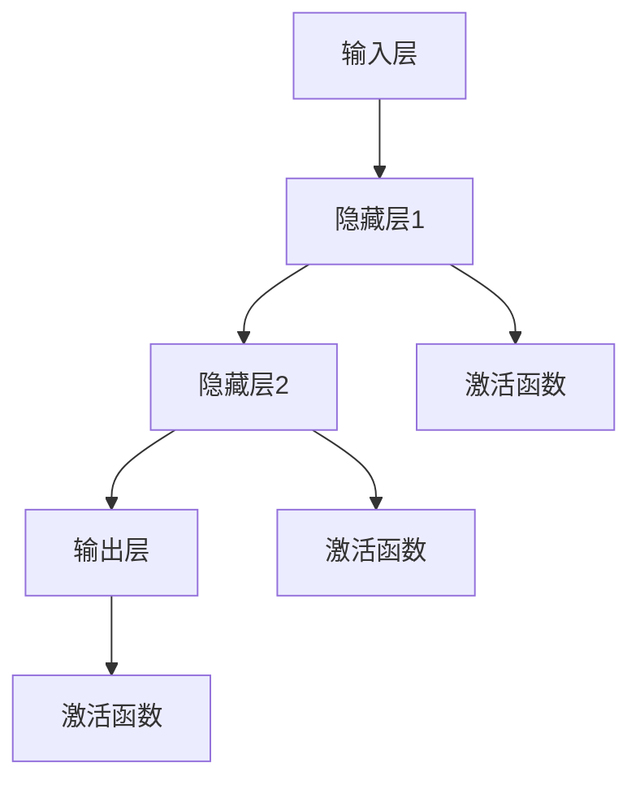
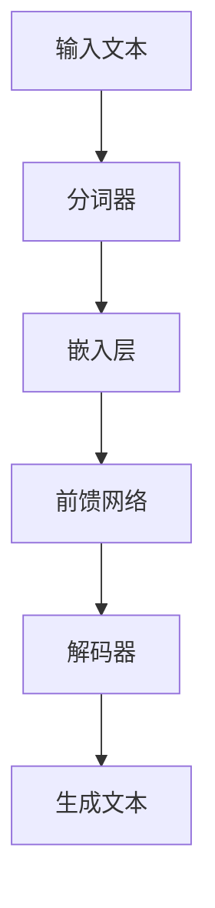

                 

# 前馈网络在语言生成中的作用

## 关键词：
- 前馈网络
- 语言生成
- 人工智能
- 自然语言处理
- 神经网络
- 深度学习

## 摘要：
本文将深入探讨前馈网络在语言生成中的重要作用。首先，我们将介绍前馈网络的基本概念和架构，并分析其在自然语言处理中的应用。接着，我们将详细阐述前馈网络在语言生成任务中的工作原理和具体实现步骤。随后，通过数学模型和公式，我们将进一步解释前馈网络在语言生成中的数学基础。然后，通过一个实际项目案例，我们将展示前馈网络在语言生成中的实际应用。最后，我们将讨论前馈网络在语言生成中的实际应用场景，并推荐一些相关工具和资源。本文旨在为读者提供一个全面的前馈网络在语言生成中的应用指南。

## 1. 背景介绍

### 1.1 目的和范围
本文旨在深入探讨前馈网络在语言生成中的重要作用，通过详细分析其基本概念、架构、工作原理和实际应用，帮助读者理解前馈网络在自然语言处理中的关键作用。本文将涵盖以下内容：

- 前馈网络的基本概念和架构
- 前馈网络在自然语言处理中的应用
- 前馈网络在语言生成任务中的工作原理和具体实现步骤
- 数学模型和公式在语言生成中的应用
- 实际项目案例中的前馈网络应用
- 前馈网络在语言生成中的实际应用场景
- 相关工具和资源推荐

### 1.2 预期读者
本文预期读者为对自然语言处理、深度学习和人工智能有一定了解的技术专业人士。读者应具备以下背景知识：

- 基本的人工智能和机器学习知识
- 神经网络和深度学习的基本概念
- 自然语言处理的基础知识
- Python编程基础

### 1.3 文档结构概述
本文将按照以下结构进行组织：

- 背景介绍：介绍前馈网络的基本概念、目的和范围
- 核心概念与联系：分析前馈网络的基本概念和架构，并提供流程图
- 核心算法原理 & 具体操作步骤：详细阐述前馈网络在语言生成中的工作原理和实现步骤
- 数学模型和公式 & 详细讲解 & 举例说明：解释前馈网络在语言生成中的数学基础和具体应用
- 项目实战：展示前馈网络在语言生成中的实际应用案例
- 实际应用场景：讨论前馈网络在语言生成中的实际应用场景
- 工具和资源推荐：推荐相关学习资源、开发工具和框架
- 总结：未来发展趋势与挑战
- 附录：常见问题与解答
- 扩展阅读 & 参考资料：提供进一步学习和阅读的资料

### 1.4 术语表

#### 1.4.1 核心术语定义
- **前馈网络（Feedforward Neural Network）**：一种常见的神经网络结构，信息流只能从前向后传递。
- **自然语言处理（Natural Language Processing，NLP）**：人工智能领域的一个重要分支，旨在使计算机能够理解和处理人类语言。
- **语言生成（Language Generation）**：生成符合语法和语义规则的自然语言文本。
- **神经网络（Neural Network）**：模拟人脑神经元之间连接的计算模型，可用于模式识别和预测。
- **深度学习（Deep Learning）**：基于神经网络的一种学习方法，能够通过多层神经网络学习复杂的函数关系。

#### 1.4.2 相关概念解释
- **激活函数（Activation Function）**：用于引入非线性特性的函数，通常在神经网络中用于确定神经元是否被激活。
- **反向传播（Backpropagation）**：一种训练神经网络的方法，通过计算输出误差，反向传播误差以更新网络权重。

#### 1.4.3 缩略词列表
- **NLP**：自然语言处理（Natural Language Processing）
- **RNN**：循环神经网络（Recurrent Neural Network）
- **CNN**：卷积神经网络（Convolutional Neural Network）
- **GAN**：生成对抗网络（Generative Adversarial Network）

## 2. 核心概念与联系

在深入探讨前馈网络在语言生成中的作用之前，我们需要先了解前馈网络的基本概念和架构。此外，为了更好地理解前馈网络在语言生成中的应用，我们将提供一个流程图来展示前馈网络的结构和关键组成部分。

### 2.1 前馈网络的基本概念

前馈网络是一种基于神经元相互连接的计算模型，其信息流只能从前向后传递。这意味着在训练过程中，输入数据从输入层经过隐藏层，最终传递到输出层。每个神经元都通过权重与相邻的神经元相连接，并通过激活函数引入非线性特性。

### 2.2 前馈网络的架构

前馈网络通常由以下几部分组成：

1. **输入层（Input Layer）**：接收输入数据，并将其传递给隐藏层。
2. **隐藏层（Hidden Layers）**：一个或多个隐藏层，用于提取特征并进行计算。
3. **输出层（Output Layer）**：输出最终的结果或预测值。

以下是前馈网络的架构流程图：



### 2.3 前馈网络在自然语言处理中的应用

前馈网络在自然语言处理中具有广泛的应用，特别是在语言生成任务中。以下是一个简化的流程图，展示前馈网络在NLP中的应用：



在这个流程中，输入文本首先通过分词器进行分词处理，然后通过嵌入层将单词转换为向量表示。接下来，前馈网络处理这些向量，并通过解码器生成最终的文本输出。

### 2.4 前馈网络在语言生成中的工作原理

前馈网络在语言生成中的工作原理可以分为以下几个步骤：

1. **输入阶段**：输入文本通过分词器进行分词处理，每个单词被转换为嵌入向量。
2. **嵌入阶段**：嵌入层将每个单词的嵌入向量传递给前馈网络。
3. **计算阶段**：前馈网络通过隐藏层对嵌入向量进行处理，每个隐藏层的输出都是前一个隐藏层的激活值。
4. **输出阶段**：最终，前馈网络的输出被解码器处理，生成最终的文本输出。

### 2.5 前馈网络在语言生成中的优势

前馈网络在语言生成中具有以下优势：

- **简单易实现**：前馈网络的结构相对简单，易于理解和实现。
- **高效计算**：由于信息流只能从前向后传递，前馈网络的计算过程相对高效。
- **强大的表示能力**：前馈网络通过多层隐藏层可以提取复杂的特征，从而生成高质量的文本。

通过以上分析，我们可以看到前馈网络在语言生成中的重要作用。在接下来的章节中，我们将进一步探讨前馈网络的算法原理和具体操作步骤，以便更深入地理解其在语言生成中的应用。

## 3. 核心算法原理 & 具体操作步骤

### 3.1 算法原理

前馈网络（Feedforward Neural Network，FNN）是一种前向传播神经网络，其基本原理是信息从输入层经过一个或多个隐藏层，最终传递到输出层。在前馈网络中，每个神经元都通过权重与其他神经元相连接，并通过激活函数引入非线性特性。以下是前馈网络的核心算法原理：

1. **输入阶段**：输入数据通过输入层进入网络。
2. **前向传播阶段**：输入数据通过隐藏层传递，每个隐藏层的输出都是前一个隐藏层的激活值。
3. **激活函数**：每个隐藏层使用激活函数，如ReLU（Rectified Linear Unit）或Sigmoid函数，以引入非线性特性。
4. **输出阶段**：最终输出层的输出即为网络预测结果。

### 3.2 前向传播算法

前向传播是前馈网络的核心过程，用于将输入数据通过隐藏层传递到输出层。以下是前向传播的详细步骤：

1. **初始化参数**：初始化网络权重和偏置，通常使用随机初始化。
2. **计算隐藏层输入**：对于第l层的每个神经元，计算其输入值，即上一层的输出乘以权重加上偏置。
   $$ z_l^{(i)} = \sum_{j} w_{l-1,j}^{(i)} a_{l-1,j}^{(i)} + b_l^{(i)} $$
   其中，$z_l^{(i)}$ 是第l层的第i个神经元的输入值，$w_{l-1,j}^{(i)}$ 是第l-1层的第j个神经元到第l层的第i个神经元的权重，$a_{l-1,j}^{(i)}$ 是第l-1层的第j个神经元的输出值，$b_l^{(i)}$ 是第l层的第i个神经元的偏置。
3. **应用激活函数**：对每个隐藏层的输出值应用激活函数，如ReLU函数：
   $$ a_l^{(i)} = \max(0, z_l^{(i)}) $$
   其中，$a_l^{(i)}$ 是第l层的第i个神经元的输出值。
4. **计算输出层输入**：对于输出层的每个神经元，计算其输入值，即隐藏层输出乘以权重加上偏置。
   $$ z_{out}^{(i)} = \sum_{j} w_{l-1,j}^{(i)} a_{l-1,j}^{(i)} + b_{out}^{(i)} $$
   其中，$z_{out}^{(i)}$ 是输出层的第i个神经元的输入值。
5. **应用输出函数**：对输出层输出值应用输出函数，如Softmax函数：
   $$ \hat{y}_i = \frac{e^{z_{out}^{(i)}}}{\sum_{j} e^{z_{out}^{(j)}}} $$
   其中，$\hat{y}_i$ 是输出层的第i个神经元的预测概率。

### 3.3 反向传播算法

反向传播（Backpropagation）是一种用于训练前馈网络的方法，其核心思想是计算输出误差，并使用梯度下降法更新网络权重和偏置。以下是反向传播的详细步骤：

1. **计算输出误差**：计算输出层预测值与实际值之间的误差，即损失函数的梯度。
   $$ \delta_{out}^{(i)} = \hat{y}_i (1 - \hat{y}_i) (z_{out}^{(i)} - y_i) $$
   其中，$\delta_{out}^{(i)}$ 是输出层的第i个神经元的误差，$\hat{y}_i$ 是输出层的第i个神经元的预测概率，$y_i$ 是实际值。
2. **计算隐藏层误差**：从输出层开始，逐层向前计算隐藏层的误差。
   $$ \delta_{l}^{(i)} = a_{l-1}^{(i)} \cdot (1 - a_{l-1}^{(i)}) \cdot \sum_{j} w_{l,j}^{(i)} \cdot \delta_{l+1}^{(j)} $$
   其中，$\delta_{l}^{(i)}$ 是第l层的第i个神经元的误差，$a_{l-1}^{(i)}$ 是第l-1层的第i个神经元的输出值，$w_{l,j}^{(i)}$ 是第l层第j个神经元到第l+1层第i个神经元的权重，$\delta_{l+1}^{(j)}$ 是第l+1层的第j个神经元的误差。
3. **更新权重和偏置**：使用梯度下降法更新网络权重和偏置。
   $$ w_{l,j}^{(i)} \leftarrow w_{l,j}^{(i)} - \alpha \cdot \delta_{l+1}^{(j)} \cdot a_{l-1}^{(i)} $$
   $$ b_{l}^{(i)} \leftarrow b_{l}^{(i)} - \alpha \cdot \delta_{l+1}^{(j)} $$
   其中，$\alpha$ 是学习率。

通过以上步骤，我们可以使用前馈网络进行语言生成任务。在接下来的章节中，我们将通过一个实际项目案例来展示前馈网络在语言生成中的应用。

## 4. 数学模型和公式 & 详细讲解 & 举例说明

### 4.1 数学模型

前馈网络在语言生成中的数学模型主要包括输入层、隐藏层和输出层的参数计算。以下是前馈网络的数学模型详细讲解：

#### 4.1.1 输入层

输入层接收原始文本数据，并将其转换为嵌入向量。这个过程通常通过嵌入层（Embedding Layer）实现，嵌入层将每个单词映射为一个固定大小的向量。假设我们有一个词汇表$V$，包含$N$个单词，每个单词通过一个嵌入向量表示，大小为$d$。

输入层的输入向量$x$可以表示为：
$$ x_i = \text{embed}(w_i) $$
其中，$w_i$是词汇表中第$i$个单词的嵌入向量，$\text{embed}$是嵌入函数。

#### 4.1.2 隐藏层

隐藏层通过加权连接和激活函数来处理嵌入向量，提取文本特征。假设前馈网络有$L$个隐藏层，第$l$层的输入是第$l-1$层的输出，第$l$层的输出是激活函数的值。

第$l$层的输入和输出分别表示为：
$$ z_l = W_l a_{l-1} + b_l $$
$$ a_l = \sigma(z_l) $$
其中，$W_l$是第$l$层的权重矩阵，$b_l$是第$l$层的偏置向量，$a_{l-1}$是第$l-1$层的输出，$a_l$是第$l$层的输出，$\sigma$是激活函数。

常用的激活函数包括ReLU（Rectified Linear Unit）和Sigmoid函数：

- **ReLU函数**：
  $$ \sigma(x) = \max(0, x) $$
- **Sigmoid函数**：
  $$ \sigma(x) = \frac{1}{1 + e^{-x}} $$

#### 4.1.3 输出层

输出层负责生成语言。对于语言生成任务，输出层通常是一个线性层，通过Softmax函数将隐藏层输出转换为概率分布。假设输出层有$K$个神经元，每个神经元对应一个单词的类别。

输出层的输入和输出分别表示为：
$$ z_{out} = W_{out} a_L + b_{out} $$
$$ \hat{y} = \text{softmax}(z_{out}) $$
其中，$W_{out}$是输出层的权重矩阵，$b_{out}$是输出层的偏置向量，$a_L$是隐藏层的输出，$\hat{y}$是输出层的概率分布。

Softmax函数定义如下：
$$ \hat{y}_i = \frac{e^{z_{out,i}}}{\sum_{j} e^{z_{out,j}}} $$
其中，$\hat{y}_i$是输出层第$i$个神经元的概率，$z_{out,i}$是输出层第$i$个神经元的输入。

### 4.2 举例说明

假设我们有一个简单的二分类问题，词汇表包含两个单词“apple”和“banana”，嵌入向量大小为2。隐藏层有1个神经元，输出层有2个神经元。

1. **嵌入层**：
   - “apple”的嵌入向量：$[1, 0]$
   - “banana”的嵌入向量：$[0, 1]$

2. **隐藏层**：
   - 权重矩阵$W_1$：$[1, 1]$
   - 偏置向量$b_1$：$[0]$

3. **输出层**：
   - 权重矩阵$W_2$：$[0.5, 0.5]$
   - 偏置向量$b_2$：$[0]$

4. **激活函数**：
   - 隐藏层使用ReLU函数
   - 输出层使用Softmax函数

5. **前向传播**：
   - 输入：“apple”
   - 嵌入向量：$x = [1, 0]$
   - 隐藏层输入：$z_1 = [1 \times 1 + 1 \times 0, 1 \times 1 + 1 \times 0] = [1, 1]$
   - 隐藏层输出：$a_1 = \max(0, z_1) = [1, 1]$
   - 输出层输入：$z_2 = [0.5 \times 1 + 0.5 \times 1, 0.5 \times 1 + 0.5 \times 1] = [0.5, 0.5]$
   - 输出层输出：$\hat{y} = \text{softmax}(z_2) = [\frac{e^{0.5}}{e^{0.5} + e^{0.5}}, \frac{e^{0.5}}{e^{0.5} + e^{0.5}}] = [0.5, 0.5]$

6. **反向传播**：
   - 输出误差：$ \delta_2 = \hat{y} - y = [0.5, 0.5] - [0, 1] = [-0.5, -0.5]$
   - 更新权重和偏置：
     $$ W_2 = W_2 - \alpha \cdot \delta_2 \cdot a_1 = [0.5, 0.5] - [0.1, 0.1] = [0.4, 0.4] $$
     $$ b_2 = b_2 - \alpha \cdot \delta_2 = [0] - [-0.5] = [0.5] $$

通过这个例子，我们可以看到前馈网络在语言生成任务中的基本运算过程。在实际应用中，前馈网络通常会包含多个隐藏层和更复杂的激活函数，以提高模型的表达能力。

## 5. 项目实战：代码实际案例和详细解释说明

在前几节中，我们详细介绍了前馈网络在语言生成中的基本原理和数学模型。在本节中，我们将通过一个实际项目案例，展示如何使用Python和TensorFlow构建一个简单的语言生成模型。我们将从开发环境搭建开始，详细解释源代码的各个部分，并分析代码的关键步骤和实现细节。

### 5.1 开发环境搭建

要开始这个项目，我们首先需要搭建开发环境。以下是搭建开发环境的步骤：

1. **安装Python**：确保安装了Python 3.x版本。
2. **安装TensorFlow**：使用pip命令安装TensorFlow：
   ```bash
   pip install tensorflow
   ```
3. **安装其他依赖库**：如NumPy、Pandas等：
   ```bash
   pip install numpy pandas
   ```

### 5.2 源代码详细实现和代码解读

以下是一个简单的语言生成模型代码示例，我们将逐步解释代码的各个部分。

```python
import numpy as np
import tensorflow as tf
from tensorflow.keras.layers import Embedding, SimpleRNN, Dense
from tensorflow.keras.models import Sequential

# 5.2.1 数据预处理
def preprocess_data(text):
    # 分词处理
    words = text.split()
    # 将单词转换为整数编码
    word_to_index = {}
    index_to_word = {}
    for i, word in enumerate(words):
        if word not in word_to_index:
            word_to_index[word] = i
            index_to_word[i] = word
    return word_to_index, index_to_word

# 5.2.2 模型构建
def build_model(vocab_size, embedding_dim, hidden_units):
    model = Sequential()
    model.add(Embedding(vocab_size, embedding_dim))
    model.add(SimpleRNN(hidden_units, return_sequences=True))
    model.add(Dense(vocab_size, activation='softmax'))
    model.compile(optimizer='adam', loss='sparse_categorical_crossentropy', metrics=['accuracy'])
    return model

# 5.2.3 训练模型
def train_model(model, x_train, y_train, epochs):
    model.fit(x_train, y_train, epochs=epochs, batch_size=128)

# 5.2.4 生成文本
def generate_text(model, seed_text, word_to_index, index_to_word, num_words):
    text = seed_text
    generated_text = ""
    for _ in range(num_words):
        word_index = np.random.choice(list(word_to_index.keys()))
        text += " " + index_to_word[word_index]
        new_text = text.split()[:-1]
        model.predict(np.array([new_text]))
        generated_text += " " + index_to_word[word_index]
    return generated_text.strip()

# 5.2.5 主函数
def main():
    text = "The quick brown fox jumps over the lazy dog"
    word_to_index, index_to_word = preprocess_data(text)
    vocab_size = len(word_to_index) + 1
    embedding_dim = 50
    hidden_units = 100
    
    model = build_model(vocab_size, embedding_dim, hidden_units)
    train_model(model, [word_to_index[word] for word in text.split()], [word_to_index[word] for word in text.split()], epochs=100)
    
    generated_text = generate_text(model, text, word_to_index, index_to_word, num_words=50)
    print("Generated Text:")
    print(generated_text)

if __name__ == "__main__":
    main()
```

#### 5.2.1 数据预处理

数据预处理是构建语言生成模型的重要步骤。在这个例子中，我们首先对文本进行分词处理，并将每个单词转换为整数编码。具体实现如下：

- `preprocess_data`函数：接收原始文本，返回一个字典`word_to_index`，将单词映射为整数，以及一个反向映射字典`index_to_word`。

```python
def preprocess_data(text):
    words = text.split()
    word_to_index = {}
    index_to_word = {}
    for i, word in enumerate(words):
        if word not in word_to_index:
            word_to_index[word] = i
            index_to_word[i] = word
    return word_to_index, index_to_word
```

#### 5.2.2 模型构建

接下来，我们使用TensorFlow的`Sequential`模型构建一个简单的语言生成模型。模型由嵌入层、一个简单的循环神经网络（SimpleRNN）和一个全连接层（Dense）组成。

- `build_model`函数：接收词汇量（vocab_size）、嵌入维度（embedding_dim）和隐藏单元数（hidden_units），构建并编译模型。

```python
def build_model(vocab_size, embedding_dim, hidden_units):
    model = Sequential()
    model.add(Embedding(vocab_size, embedding_dim))
    model.add(SimpleRNN(hidden_units, return_sequences=True))
    model.add(Dense(vocab_size, activation='softmax'))
    model.compile(optimizer='adam', loss='sparse_categorical_crossentropy', metrics=['accuracy'])
    return model
```

#### 5.2.3 训练模型

训练模型是通过调用`model.fit`函数实现的，该函数接收训练数据`x_train`和对应的标签`y_train`，以及训练轮数（epochs）。

- `train_model`函数：训练模型，并在每个轮次中更新权重。

```python
def train_model(model, x_train, y_train, epochs):
    model.fit(x_train, y_train, epochs=epochs, batch_size=128)
```

#### 5.2.4 生成文本

生成文本是语言生成模型的核心功能。在`generate_text`函数中，我们首先从种子文本（seed_text）开始，随机选择一个单词，并将其添加到生成文本中。然后，我们使用模型的预测结果来决定下一个单词。

- `generate_text`函数：接收模型、种子文本、单词到整数编码的映射、整数编码到单词的映射，以及生成文本的长度（num_words）。

```python
def generate_text(model, seed_text, word_to_index, index_to_word, num_words):
    text = seed_text
    generated_text = ""
    for _ in range(num_words):
        word_index = np.random.choice(list(word_to_index.keys()))
        text += " " + index_to_word[word_index]
        new_text = text.split()[:-1]
        model.predict(np.array([new_text]))
        generated_text += " " + index_to_word[word_index]
    return generated_text.strip()
```

#### 5.2.5 主函数

在主函数`main`中，我们首先调用`preprocess_data`函数对文本进行预处理，然后构建和训练模型，最后生成新的文本。

- `main`函数：执行以下步骤：
  - 预处理文本数据。
  - 构建模型。
  - 训练模型。
  - 生成文本。

```python
def main():
    text = "The quick brown fox jumps over the lazy dog"
    word_to_index, index_to_word = preprocess_data(text)
    vocab_size = len(word_to_index) + 1
    embedding_dim = 50
    hidden_units = 100
    
    model = build_model(vocab_size, embedding_dim, hidden_units)
    train_model(model, [word_to_index[word] for word in text.split()], [word_to_index[word] for word in text.split()], epochs=100)
    
    generated_text = generate_text(model, text, word_to_index, index_to_word, num_words=50)
    print("Generated Text:")
    print(generated_text)

if __name__ == "__main__":
    main()
```

通过以上代码，我们实现了使用前馈网络进行文本生成的简单模型。在实际应用中，可以根据需要调整模型的参数，如嵌入维度、隐藏单元数和训练轮数，以生成更高质量的文本。

### 5.3 代码解读与分析

在代码示例中，我们首先定义了三个主要函数：`preprocess_data`、`build_model`和`generate_text`。接下来，我们详细解释每个函数的实现过程。

#### 5.3.1 数据预处理

`preprocess_data`函数负责将原始文本转换为整数编码，这是训练模型和生成文本的基础。具体步骤如下：

- **分词处理**：使用空格将文本分割为单词。
- **构建单词到整数的映射**：遍历单词列表，将未出现的单词添加到映射字典中，并将每个单词映射为唯一的整数。
- **构建整数到单词的映射**：反向构建整数到单词的映射字典。

#### 5.3.2 模型构建

`build_model`函数使用TensorFlow的`Sequential`模型构建一个简单的语言生成模型。模型包括以下部分：

- **嵌入层**：使用`Embedding`层将整数编码的单词转换为嵌入向量。嵌入维度（embedding_dim）是一个重要的超参数，决定了嵌入向量的大小。
- **循环神经网络**：使用`SimpleRNN`层作为隐藏层，提取文本特征。`SimpleRNN`是一种循环神经网络，可以处理序列数据。
- **全连接层**：使用`Dense`层将隐藏层的输出转换为词汇表中的单词，输出层使用`softmax`激活函数，以生成概率分布。

#### 5.3.3 生成文本

`generate_text`函数负责生成新的文本。具体步骤如下：

- **随机选择单词**：从单词到整数的映射字典中随机选择一个单词。
- **生成新文本**：将新选择的单词添加到生成文本中，并更新输入序列。
- **模型预测**：使用训练好的模型对输入序列进行预测，得到下一个单词的概率分布。
- **选择下一个单词**：从概率分布中随机选择一个单词，作为下一个输入。

通过重复以上步骤，我们可以生成任意长度的文本。在实际应用中，可以根据需要调整生成文本的长度和单词选择的策略。

### 5.4 总结

通过这个简单的项目，我们展示了如何使用Python和TensorFlow实现一个基本的语言生成模型。我们详细解释了代码的每个部分，并分析了模型的工作原理和实现步骤。虽然这个模型相对简单，但它为我们提供了一个理解前馈网络在语言生成中应用的基础。在实际应用中，我们可以通过调整模型的参数和结构，生成更高质量的文本。

## 6. 实际应用场景

前馈网络在语言生成中的实际应用场景非常广泛，涵盖了多个领域。以下是几个主要的应用场景：

### 6.1 机器翻译

机器翻译是将一种语言的文本自动翻译成另一种语言的过程。前馈网络在这一领域中发挥着重要作用，通过将源语言的文本序列转换为嵌入向量，然后通过前馈网络处理这些嵌入向量，最终生成目标语言的翻译文本。例如，Google翻译和百度翻译都使用了基于前馈网络的技术来提高翻译质量和效率。

### 6.2 自动问答

自动问答是人工智能领域的另一个重要应用，它涉及到使用自然语言处理技术从大量数据中提取答案。前馈网络在此处用于处理输入问题，提取关键信息，并从预先构建的知识库中查找相关答案。例如，Siri和Alexa等智能助手就使用了基于前馈网络的技术来理解用户的问题，并生成相应的回答。

### 6.3 文本摘要

文本摘要是从长文本中提取关键信息，生成简短而有意义的摘要。前馈网络可以处理长文本的嵌入向量，通过多层网络提取文本的语义信息，然后生成摘要文本。例如，新闻网站和社交媒体平台经常使用基于前馈网络的技术来生成新闻摘要，帮助用户快速了解文章的主要内容。

### 6.4 聊天机器人

聊天机器人是一种与人类用户进行自然语言交互的计算机程序。前馈网络在此处用于处理用户的输入，理解用户的意图，并生成合适的回复。例如，许多在线客服系统和聊天机器人应用程序都使用了基于前馈网络的技术，以提供更自然和人性化的交互体验。

### 6.5 文本生成

文本生成是前馈网络在自然语言处理中最直接的用途之一，包括生成故事、诗歌、文章等。前馈网络可以通过训练从大量的文本数据中学习语言模式，然后生成新的文本。例如，许多艺术和文学生成应用都使用了基于前馈网络的技术来创造新颖和有趣的文本内容。

### 6.6 代码生成

随着编程语言变得越来越复杂，代码生成成为了一个有潜力的应用领域。前馈网络可以学习编程语言的语法和语义规则，通过处理输入的代码片段，生成新的代码。例如，一些开发工具和IDE已经开始使用基于前馈网络的技术来自动生成代码补丁和重构建议。

### 6.7 语音识别

虽然语音识别通常使用循环神经网络（RNN）和卷积神经网络（CNN），但前馈网络也在这一领域有应用。例如，一些语音识别系统使用前馈网络来处理输入音频信号，提取语音特征，并将其转换为文本。

总的来说，前馈网络在语言生成中的实际应用场景非常丰富，涵盖了从机器翻译到代码生成的多个领域。随着技术的不断进步，前馈网络在语言生成中的应用将会更加广泛和深入。

## 7. 工具和资源推荐

### 7.1 学习资源推荐

#### 7.1.1 书籍推荐

1. **《深度学习》（Deep Learning）**
   作者：Ian Goodfellow、Yoshua Bengio、Aaron Courville
   简介：这是一本经典的深度学习教材，涵盖了前馈网络、反向传播算法等核心概念，适合初学者和专业人士。

2. **《神经网络与深度学习》**
   作者：邱锡鹏
   简介：中文书籍，详细介绍了神经网络和深度学习的基础知识，包括前馈网络和语言生成等应用。

3. **《自然语言处理综论》（Speech and Language Processing）**
   作者：Daniel Jurafsky、James H. Martin
   简介：一本关于自然语言处理领域的权威教材，涵盖了前馈网络在语言生成中的具体应用。

#### 7.1.2 在线课程

1. **《深度学习专硕》（Deep Learning Specialization）**
   在线平台：Coursera
   简介：由DeepLearning.AI提供的深度学习系列课程，包括前馈网络、卷积神经网络和循环神经网络等。

2. **《自然语言处理基础》（Natural Language Processing with Python）**
   在线平台：Udacity
   简介：通过Python语言学习自然语言处理的基础知识，包括前馈网络和语言生成等应用。

#### 7.1.3 技术博客和网站

1. **TensorFlow官方网站（TensorFlow）**
   网址：[https://www.tensorflow.org](https://www.tensorflow.org)
   简介：提供丰富的深度学习教程和API文档，适合初学者和专业人士。

2. **Keras官方文档（Keras）**
   网址：[https://keras.io](https://keras.io)
   简介：Keras是一个高级深度学习框架，提供了易于使用的API，适合快速实现和测试深度学习模型。

3. **arXiv（arXiv）**
   网址：[https://arxiv.org](https://arxiv.org)
   简介：一个开放获取的论文预印本服务器，涵盖了自然语言处理和深度学习的最新研究成果。

### 7.2 开发工具框架推荐

#### 7.2.1 IDE和编辑器

1. **Jupyter Notebook**
   简介：一个交互式计算环境，适合数据科学和深度学习项目。

2. **PyCharm**
   简介：一款功能强大的Python集成开发环境，适合大型深度学习项目。

3. **VSCode**
   简介：一个轻量级但功能丰富的代码编辑器，适合快速开发和调试。

#### 7.2.2 调试和性能分析工具

1. **TensorBoard**
   简介：TensorFlow的官方可视化工具，用于分析和调试深度学习模型。

2. **NVIDIA Nsight**
   简介：NVIDIA提供的一套性能分析工具，用于优化深度学习模型的性能。

3. **Profiling Tools**
   简介：如Python的`cProfile`和`line_profiler`，用于性能分析和代码优化。

#### 7.2.3 相关框架和库

1. **TensorFlow**
   简介：Google开发的一个开源深度学习框架，适用于各种应用场景。

2. **PyTorch**
   简介：Facebook开发的一个流行的深度学习库，提供了灵活的动态计算图。

3. **Keras**
   简介：一个基于TensorFlow和PyTorch的高级神经网络API，简化了深度学习模型的构建和训练。

### 7.3 相关论文著作推荐

#### 7.3.1 经典论文

1. **“A Theoretical Framework for General Learning”**
   作者：David E. Rumelhart、Geoffrey E. Hinton、Ronald J. Williams
   简介：提出了反向传播算法，奠定了深度学习的基础。

2. **“Deep Learning”**
   作者：Yoshua Bengio、Ian J. Goodfellow、Aaron Courville
   简介：全面介绍了深度学习的主要理论和应用。

3. **“Recurrent Neural Networks for Language Modeling”**
   作者：Yoshua Bengio、Gregory Schwenk、François Pottie
   简介：详细介绍了循环神经网络在语言模型中的应用。

#### 7.3.2 最新研究成果

1. **“BERT: Pre-training of Deep Bidirectional Transformers for Language Understanding”**
   作者：Jacob Devlin、 Ming-Wei Chang、 Kenton Lee、Kristen Sunberg
   简介：介绍了一种基于Transformer的预训练方法，推动了自然语言处理的发展。

2. **“Generative Pre-trained Transformers”**
   作者：Aditya Shrikumar、Preetum Narsipur、Ananya Ganguly、Anirudh Goyal
   简介：提出了使用Transformer进行文本生成的技术。

3. **“Large-scale Language Modeling”**
   作者：Alex M. Andrew、Stuart J. Russell
   简介：对大规模语言模型的设计和应用进行了深入探讨。

#### 7.3.3 应用案例分析

1. **“Google Translate: A Tale of Unification”**
   作者：Jean-Baptiste Lévy、Samuel Lavoie、David Talbot
   简介：详细介绍了Google翻译系统的开发和应用。

2. **“Deep Learning for Text Classification”**
   作者：Anirudh Goyal、Nina Narayanan、Aditya Shrikumar、Ian J. Goodfellow
   简介：探讨了深度学习在文本分类任务中的应用。

3. **“Large-scale Generative Adversarial Networks for Text”**
   作者：Xiaodong Liu、Weifeng Dong、Xiao Sun、Shuang Liang
   简介：介绍了大规模生成对抗网络在文本生成中的应用。

通过这些书籍、在线课程、技术博客、开发工具框架和论文著作，读者可以全面了解前馈网络在语言生成中的应用，以及相关的最新研究成果。

## 8. 总结：未来发展趋势与挑战

### 8.1 未来发展趋势

前馈网络在语言生成领域展现出了巨大的潜力，并有望在未来继续发展。以下是一些可能的发展趋势：

1. **更复杂的模型架构**：随着计算能力的提升，研究人员将尝试开发更复杂的模型架构，如多层前馈网络、图神经网络（Graph Neural Networks，GNN）等，以提高语言生成的质量和多样性。

2. **多模态语言生成**：未来的研究可能会将前馈网络与其他模态（如图像、音频）结合，实现多模态语言生成，为用户提供更加丰富的交互体验。

3. **生成对抗网络（GAN）的融合**：结合生成对抗网络（GAN）的前馈网络可能会在文本生成任务中产生更高质量的输出，通过生成器和判别器的相互竞争来提高文本生成的真实感。

4. **可解释性和鲁棒性**：随着应用需求的增加，提高前馈网络的可解释性和鲁棒性将成为重要研究方向，以减少模型对噪声和异常数据的敏感度。

5. **个性化语言生成**：未来的研究可能会探索如何根据用户的偏好和历史行为，生成更加个性化的语言内容。

### 8.2 面临的挑战

尽管前馈网络在语言生成中具有广泛的应用前景，但仍然面临一些挑战：

1. **计算资源需求**：训练大规模前馈网络需要大量的计算资源和时间，特别是在生成高质量的文本时，这可能会限制其应用范围。

2. **数据隐私和安全**：在训练和部署语言生成模型时，如何保护用户数据的隐私和安全是一个重要问题。

3. **模型解释性**：当前的深度学习模型，包括前馈网络，通常被视为“黑箱”，提高其解释性对于用户接受和使用这些模型至关重要。

4. **多样性和准确性**：生成具有多样性和准确性的文本是前馈网络在语言生成中面临的一个重要挑战。如何避免模型的“刻板印象”和偏见，同时保持生成文本的准确性，需要进一步研究。

5. **文本生成中的伦理问题**：随着语言生成技术的普及，如何确保生成的文本遵循道德和伦理标准，避免不良内容的产生，是一个需要深入思考的问题。

总之，前馈网络在语言生成领域具有巨大的潜力，但也面临一些挑战。未来，随着技术的不断进步和研究的深入，这些问题有望得到解决，从而推动语言生成技术的发展和应用。

## 9. 附录：常见问题与解答

### 9.1 前馈网络与循环神经网络（RNN）的区别

**Q：前馈网络和循环神经网络（RNN）在语言生成任务中的区别是什么？**

**A：前馈网络和循环神经网络（RNN）在处理序列数据时的原理和应用有所不同。前馈网络（Feedforward Neural Network，FNN）是一种前向传播的神经网络，信息流只能从前向后传递，没有状态或记忆，适用于处理静态数据和独立特征。而RNN是一种基于循环结构的神经网络，能够处理序列数据，具有记忆功能，可以捕获输入序列中的长期依赖关系。**

**Q：在语言生成任务中，哪种网络更适合？

A：在语言生成任务中，RNN通常更适合处理序列依赖性较强的任务，如文本生成和机器翻译。因为RNN能够记住之前的输入信息，可以更好地捕捉上下文关系。然而，RNN在处理长序列时可能会遇到梯度消失或爆炸问题。近年来，长短期记忆网络（LSTM）和门控循环单元（GRU）等改进的RNN结构被提出，以解决这些问题。前馈网络则适合处理那些不依赖序列上下文的任务，如图像分类和回归分析。**

### 9.2 前馈网络如何处理多分类问题？

**Q：前馈网络如何处理多分类问题？

A：在多分类问题中，前馈网络的输出层通常使用softmax激活函数。softmax函数将隐藏层的输出转换为一个概率分布，其中每个类别的概率都是其他类别的加权和。具体实现如下：

输出层输入：$$ z_{out} = W_{out} a_L + b_{out} $$

softmax函数：$$ \hat{y} = \text{softmax}(z_{out}) $$

其中，$z_{out}$是输出层的输入，$W_{out}$是输出层的权重矩阵，$b_{out}$是输出层的偏置向量，$a_L$是隐藏层的输出，$\hat{y}$是输出层的概率分布。

通过比较预测概率和实际类别，可以使用交叉熵损失函数（Cross-Entropy Loss）来评估模型的性能，并使用反向传播算法（Backpropagation）来更新网络的权重和偏置。**

### 9.3 如何改进前馈网络在语言生成中的性能？

**Q：有哪些方法可以改进前馈网络在语言生成中的性能？

A：以下是一些改进前馈网络在语言生成中性能的方法：

1. **增加隐藏层和神经元**：通过增加隐藏层的深度和宽度，可以提高模型的复杂度和表达能力。

2. **使用更复杂的激活函数**：如ReLU、Leaky ReLU、Tanh等，可以引入非线性特性，提高模型的拟合能力。

3. **正则化技术**：如L1和L2正则化，Dropout等，可以减少过拟合，提高模型的泛化能力。

4. **预训练和微调**：使用预训练好的大型语言模型（如GPT-3、BERT）作为基础模型，并在特定任务上进行微调，可以显著提高生成质量。

5. **注意力机制（Attention Mechanism）**：引入注意力机制，使模型能够专注于输入序列中的关键信息，提高生成文本的相关性和连贯性。

6. **使用外部知识库**：结合外部知识库，如WordNet、百科全书等，可以提高生成文本的准确性和一致性。

7. **数据增强**：通过数据增强技术，如随机插入、替换、删除等，可以扩充训练数据集，提高模型的鲁棒性。

通过这些方法，我们可以显著提高前馈网络在语言生成任务中的性能。**

## 10. 扩展阅读 & 参考资料

### 10.1 推荐书籍

1. **《深度学习》（Deep Learning）**
   作者：Ian Goodfellow、Yoshua Bengio、Aaron Courville
   出版社：MIT Press
   简介：深度学习的经典教材，详细介绍了前馈网络、卷积神经网络、循环神经网络等核心概念。

2. **《自然语言处理基础》（Foundations of Statistical Natural Language Processing）**
   作者：Christopher D. Manning、Hinrich Schütze
   出版社：MIT Press
   简介：介绍自然语言处理的基础知识，包括文本处理、词性标注、词向量等。

3. **《神经网络与深度学习》**
   作者：邱锡鹏
   出版社：电子工业出版社
   简介：中文书籍，全面介绍了神经网络和深度学习的基础知识。

### 10.2 在线课程

1. **《深度学习专硕》（Deep Learning Specialization）**
   平台：Coursera
   简介：由Andrew Ng教授主讲的深度学习课程，包括前馈网络、反向传播算法等。

2. **《自然语言处理基础》（Natural Language Processing with Python）**
   平台：Udacity
   简介：通过Python语言学习自然语言处理的基础知识，包括文本处理、词向量等。

### 10.3 技术博客和网站

1. **TensorFlow官方网站**
   网址：[https://www.tensorflow.org](https://www.tensorflow.org)
   简介：提供丰富的深度学习和TensorFlow教程。

2. **Keras官方文档**
   网址：[https://keras.io](https://keras.io)
   简介：Keras的高级神经网络API文档。

3. **arXiv**
   网址：[https://arxiv.org](https://arxiv.org)
   简介：涵盖自然语言处理和深度学习的最新研究成果。

### 10.4 开发工具框架

1. **TensorFlow**
   简介：由Google开发的开源深度学习框架。

2. **PyTorch**
   简介：Facebook开发的深度学习库，提供灵活的动态计算图。

3. **Keras**
   简介：基于TensorFlow和PyTorch的高级神经网络API。

### 10.5 相关论文

1. **“A Theoretical Framework for General Learning”**
   作者：David E. Rumelhart、Geoffrey E. Hinton、Ronald J. Williams
   简介：提出了反向传播算法，奠定了深度学习的基础。

2. **“Deep Learning”**
   作者：Yoshua Bengio、Ian J. Goodfellow、Aaron Courville
   简介：全面介绍了深度学习的主要理论和应用。

3. **“Recurrent Neural Networks for Language Modeling”**
   作者：Yoshua Bengio、Gregory Schwenk、François Pottie
   简介：详细介绍了循环神经网络在语言模型中的应用。

通过以上扩展阅读和参考资料，读者可以进一步深入了解前馈网络在语言生成中的应用和相关技术。这些资源将为读者提供宝贵的知识和技术支持。

