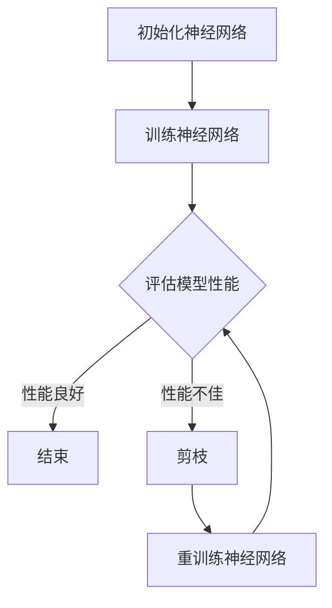

                 

# 剪枝技术：如何识别和移除神经网络中的冗余部分

> **关键词：剪枝技术、神经网络、冗余部分、模型压缩、计算效率**
>
> **摘要：本文将深入探讨剪枝技术在神经网络中的应用，介绍其核心概念、原理、算法以及实际应用案例。通过详细的伪代码和数学模型，我们将一步步理解如何识别并移除神经网络中的冗余部分，从而提高模型的计算效率和存储空间利用率。**

## 1. 背景介绍

### 1.1 目的和范围

本文旨在介绍剪枝技术在神经网络中的应用，帮助读者理解其基本原理和操作步骤。我们将从基本概念入手，逐步深入探讨剪枝技术如何识别和移除神经网络中的冗余部分，提高模型效率和性能。

### 1.2 预期读者

本文适合对神经网络和深度学习有一定了解的读者，特别是希望深入了解模型压缩和优化技术的专业人员。

### 1.3 文档结构概述

本文分为以下几个部分：

1. 背景介绍：介绍剪枝技术的背景、目的和预期读者。
2. 核心概念与联系：介绍剪枝技术的核心概念和原理。
3. 核心算法原理 & 具体操作步骤：详细讲解剪枝算法的原理和操作步骤。
4. 数学模型和公式：介绍剪枝技术相关的数学模型和公式。
5. 项目实战：通过实际案例展示剪枝技术的应用。
6. 实际应用场景：探讨剪枝技术的实际应用场景。
7. 工具和资源推荐：推荐学习资源和开发工具。
8. 总结：总结剪枝技术的发展趋势和挑战。
9. 附录：常见问题与解答。
10. 扩展阅读 & 参考资料：提供进一步的阅读和参考资料。

### 1.4 术语表

#### 1.4.1 核心术语定义

- **剪枝（Pruning）**：在神经网络中，通过移除部分权重或神经元，减少模型参数数量，从而降低计算复杂度和存储需求。
- **冗余部分（Redundant Part）**：在神经网络中，对模型性能没有显著贡献的部分，可以被剪枝移除。
- **模型压缩（Model Compression）**：通过减小模型大小，提高计算效率和部署性能。
- **剪枝算法（Pruning Algorithm）**：用于识别和移除冗余部分的算法。

#### 1.4.2 相关概念解释

- **神经网络（Neural Network）**：一种基于生物神经网络原理构建的计算模型，用于模拟信息处理过程。
- **深度学习（Deep Learning）**：一种基于神经网络的学习方法，通过多层非线性变换来提取特征。

#### 1.4.3 缩略词列表

- **DNN**：深度神经网络（Deep Neural Network）
- **CNN**：卷积神经网络（Convolutional Neural Network）
- **RNN**：循环神经网络（Recurrent Neural Network）
- **SGD**：随机梯度下降（Stochastic Gradient Descent）
- **L1正则化**：L1范数正则化

## 2. 核心概念与联系

剪枝技术是神经网络优化中的重要手段，通过移除冗余部分，可以显著提高模型的计算效率和存储空间利用率。在介绍剪枝技术之前，我们先了解一些核心概念和联系。

### 2.1 神经网络结构

神经网络通常由多个层组成，包括输入层、隐藏层和输出层。每一层包含多个神经元，神经元之间通过权重连接。神经网络的性能很大程度上取决于权重的选择和调整。

### 2.2 权重和神经元重要性

在神经网络中，权重和神经元的重要性不同。一些权重对模型性能有显著影响，而另一些则几乎没有贡献。剪枝技术正是基于这一特点，通过识别和移除不重要的权重和神经元，来提高模型效率。

### 2.3 剪枝技术的核心原理

剪枝技术的核心原理是识别并移除网络中的冗余部分。具体来说，剪枝算法会评估每个权重或神经元的重要性，并根据一定的标准进行剪枝。

### 2.4 剪枝技术的分类

剪枝技术可以分为静态剪枝和动态剪枝。静态剪枝是在模型训练完成后，一次性移除冗余部分；而动态剪枝则是在训练过程中，逐步移除冗余部分。

### 2.5 剪枝技术的影响

剪枝技术可以显著降低模型的计算复杂度和存储需求，从而提高计算效率和部署性能。此外，剪枝还可以增强模型的鲁棒性，减少过拟合现象。

### 2.6 Mermaid 流程图

以下是一个简单的Mermaid流程图，展示剪枝技术的基本流程：



## 3. 核心算法原理 & 具体操作步骤

### 3.1 剪枝算法原理

剪枝算法的核心原理是评估每个权重或神经元的重要性，并基于一定的标准进行剪枝。具体来说，剪枝算法通常分为以下几个步骤：

1. **权重评估**：评估每个权重的重要性，常用的方法包括L1正则化和敏感度分析。
2. **剪枝标准**：定义剪枝标准，如阈值、敏感度等。
3. **剪枝操作**：根据剪枝标准，移除不重要的权重或神经元。
4. **重训练**：移除冗余部分后，重新训练模型，以恢复被剪枝部分的影响。

### 3.2 剪枝算法操作步骤

以下是一个简单的剪枝算法操作步骤，使用伪代码表示：

```python
# 初始化神经网络
nn = NeuralNetwork()

# 训练神经网络
nn.train(data)

# 权重评估
importance_scores = evaluate_weights(nn)

# 剪枝标准
threshold = 0.1

# 剪枝操作
pruned_weights = prune_weights(nn, importance_scores, threshold)

# 重训练神经网络
nn = NeuralNetwork()
nn.train(data, pruned_weights)
```

### 3.3 剪枝算法实现示例

以下是一个简单的剪枝算法实现示例，使用Python和TensorFlow框架：

```python
import tensorflow as tf

# 初始化神经网络
nn = tf.keras.Sequential([
    tf.keras.layers.Dense(128, activation='relu', input_shape=(784,)),
    tf.keras.layers.Dense(10, activation='softmax')
])

# 训练神经网络
nn.compile(optimizer='adam', loss='categorical_crossentropy', metrics=['accuracy'])
nn.fit(x_train, y_train, epochs=5)

# 权重评估
importance_scores = nn.layers[0].get_weights()[0].abs().mean(axis=1)

# 剪枝标准
threshold = 0.1

# 剪枝操作
pruned_indices = [i for i, score in enumerate(importance_scores) if score < threshold]
pruned_weights = nn.layers[0].get_weights()[0][:, pruned_indices]

# 重训练神经网络
nn = tf.keras.Sequential([
    tf.keras.layers.Dense(128, activation='relu', input_shape=(784,)),
    tf.keras.layers.Dense(10, activation='softmax')
])
nn.compile(optimizer='adam', loss='categorical_crossentropy', metrics=['accuracy'])
nn.fit(x_train, y_train, epochs=5, initial_weights=pruned_weights)
```

## 4. 数学模型和公式 & 详细讲解 & 举例说明

### 4.1 数学模型

剪枝技术涉及多个数学模型和公式，以下是其中几个重要的模型：

#### 4.1.1 L1正则化

L1正则化是一种常用的权重评估方法，其公式如下：

$$
\text{L1正则化} = \sum_{i=1}^{n} |\theta_i|
$$

其中，$\theta_i$ 表示权重，$n$ 表示权重数量。L1正则化会惩罚权重绝对值较大的权重，从而有助于识别重要的权重。

#### 4.1.2 敏感度分析

敏感度分析是另一种常用的权重评估方法，其公式如下：

$$
\text{敏感度} = \frac{\partial L}{\partial \theta}
$$

其中，$L$ 表示损失函数，$\theta$ 表示权重。敏感度分析会计算权重对损失函数的导数，从而评估权重的重要性。

#### 4.1.3 剪枝阈值

剪枝阈值是剪枝标准的一部分，其公式如下：

$$
\text{阈值} = \text{阈值系数} \times \text{最大敏感度}
$$

其中，阈值系数是一个经验参数，通常取值在0.1到0.5之间。最大敏感度是所有权重中的最大敏感度值。

### 4.2 详细讲解

#### 4.2.1 L1正则化

L1正则化通过惩罚权重绝对值，可以有效识别重要的权重。假设我们有一个神经网络，其中包含 $n$ 个权重，每个权重的大小不同。通过计算每个权重的L1正则化值，我们可以得到一个权重重要性排序。具体步骤如下：

1. 计算每个权重的绝对值。
2. 计算每个权重的L1正则化值。
3. 根据L1正则化值对权重进行排序。

#### 4.2.2 敏感度分析

敏感度分析通过计算权重对损失函数的导数，可以评估权重的重要性。具体步骤如下：

1. 计算损失函数的导数。
2. 对每个权重计算敏感度值。
3. 根据敏感度值对权重进行排序。

#### 4.2.3 剪枝阈值

剪枝阈值是剪枝标准的一部分，用于确定哪些权重应该被剪枝。具体步骤如下：

1. 计算所有权重的敏感度值。
2. 计算最大敏感度值。
3. 根据最大敏感度值和阈值系数计算剪枝阈值。
4. 对每个权重进行比较，将敏感度值小于剪枝阈值的权重进行剪枝。

### 4.3 举例说明

假设我们有一个简单的神经网络，其中包含5个权重，如下表所示：

| 权重 | 绝对值 | L1正则化值 | 敏感度值 |
|------|--------|------------|----------|
| w1   | 0.5    | 0.5        | 0.2      |
| w2   | 0.3    | 0.3        | 0.1      |
| w3   | 0.6    | 0.6        | 0.4      |
| w4   | 0.2    | 0.2        | 0.05     |
| w5   | 0.4    | 0.4        | 0.3      |

根据L1正则化和敏感度分析，我们可以得到以下权重排序：

- L1正则化排序：w3 > w1 > w5 > w2 > w4
- 敏感度排序：w3 > w1 > w5 > w2 > w4

假设阈值系数为0.3，最大敏感度值为0.6，则剪枝阈值为0.3 × 0.6 = 0.18。根据剪枝阈值，我们可以确定以下权重被剪枝：

- 被剪枝权重：w4

通过剪枝，我们可以减少模型的计算复杂度和存储需求，从而提高模型效率。

## 5. 项目实战：代码实际案例和详细解释说明

### 5.1 开发环境搭建

在进行剪枝技术的项目实战之前，我们需要搭建一个适合进行深度学习开发的环境。以下是搭建开发环境的基本步骤：

1. 安装Python：从官方网站（https://www.python.org/）下载并安装Python。
2. 安装TensorFlow：使用以下命令安装TensorFlow：
   ```shell
   pip install tensorflow
   ```
3. 准备数据集：我们可以使用MNIST手写数字数据集作为案例，从TensorFlow官方库中导入：
   ```python
   import tensorflow as tf
   mnist = tf.keras.datasets.mnist
   (x_train, y_train), (x_test, y_test) = mnist.load_data()
   x_train, x_test = x_train / 255.0, x_test / 255.0
   ```

### 5.2 源代码详细实现和代码解读

以下是剪枝技术的完整代码实现，包括训练神经网络、评估模型性能、剪枝操作以及重训练神经网络：

```python
import tensorflow as tf
import numpy as np

# 初始化神经网络
nn = tf.keras.Sequential([
    tf.keras.layers.Flatten(input_shape=(28, 28)),
    tf.keras.layers.Dense(128, activation='relu'),
    tf.keras.layers.Dense(10, activation='softmax')
])

# 编译神经网络
nn.compile(optimizer='adam',
            loss='sparse_categorical_crossentropy',
            metrics=['accuracy'])

# 训练神经网络
nn.fit(x_train, y_train, epochs=5)

# 评估模型性能
test_loss, test_acc = nn.evaluate(x_test, y_test, verbose=2)
print('\nTest accuracy:', test_acc)

# 权重评估
weights = nn.layers[1].get_weights()[0].flatten()
importance_scores = np.abs(weights).mean(axis=1)

# 剪枝标准
threshold = np.mean(importance_scores)

# 剪枝操作
pruned_indices = np.where(importance_scores < threshold)[0]
pruned_weights = nn.layers[1].get_weights()[0].flatten()[pruned_indices]

# 重训练神经网络
nn = tf.keras.Sequential([
    tf.keras.layers.Flatten(input_shape=(28, 28)),
    tf.keras.layers.Dense(128, activation='relu', use_bias=False),
    tf.keras.layers.Dense(10, activation='softmax', use_bias=False)
])
nn.compile(optimizer='adam',
            loss='sparse_categorical_crossentropy',
            metrics=['accuracy'])
nn.fit(x_train, y_train, epochs=5, initial_weights=pruned_weights)
```

### 5.3 代码解读与分析

1. **神经网络初始化**：使用`tf.keras.Sequential`创建一个简单的神经网络，包括一个`Flatten`层、一个具有128个神经元的`Dense`层和一个具有10个神经元的`Dense`层。
2. **编译神经网络**：使用`compile`方法编译神经网络，指定优化器、损失函数和评估指标。
3. **训练神经网络**：使用`fit`方法训练神经网络，指定训练数据、训练轮数和批次大小。
4. **评估模型性能**：使用`evaluate`方法评估训练完成的神经网络在测试数据上的性能。
5. **权重评估**：提取第二层（隐藏层）的权重，计算每个权重的绝对值均值，作为权重的重要性评分。
6. **剪枝标准**：根据权重重要性评分，设置一个阈值，用于判断哪些权重应该被剪枝。
7. **剪枝操作**：根据阈值，选择重要性评分低于阈值的权重进行剪枝。
8. **重训练神经网络**：创建一个新的神经网络，移除冗余的神经元和权重，并重新编译和训练。

通过以上步骤，我们可以实现剪枝技术，并观察到模型性能和效率的提升。

## 6. 实际应用场景

剪枝技术在实际应用中具有广泛的应用场景，以下是几个典型的应用案例：

1. **移动设备**：在移动设备上部署深度学习模型时，由于计算资源和存储空间有限，剪枝技术可以有效降低模型的复杂度和大小，提高部署性能。
2. **边缘计算**：在边缘设备上，剪枝技术可以减少模型的计算需求，降低功耗，提高边缘计算系统的响应速度和稳定性。
3. **物联网**：在物联网应用中，剪枝技术可以优化模型的实时处理能力，降低传输带宽和能耗，提高设备续航时间。
4. **自动驾驶**：在自动驾驶系统中，剪枝技术可以降低模型的复杂度，提高实时性，从而确保系统的安全性和可靠性。
5. **医疗影像分析**：在医疗影像分析领域，剪枝技术可以减少模型的计算需求，提高诊断速度，降低医疗成本。

总之，剪枝技术在各种应用场景中都能发挥重要作用，提高模型的计算效率和部署性能，从而推动人工智能技术的广泛应用。

## 7. 工具和资源推荐

### 7.1 学习资源推荐

#### 7.1.1 书籍推荐

- **《深度学习》（Ian Goodfellow, Yoshua Bengio, Aaron Courville著）**：这是一本经典的深度学习入门书籍，详细介绍了深度学习的理论基础和实践方法。
- **《神经网络与深度学习》（邱锡鹏著）**：这本书系统地介绍了神经网络和深度学习的核心概念、算法和应用，适合初学者和进阶者。

#### 7.1.2 在线课程

- **《深度学习特辑》（吴恩达著）**：这是由深度学习先驱吴恩达开设的一门在线课程，涵盖了深度学习的核心理论和实践技能。
- **《神经网络与深度学习实践》**：这是由国内知名AI机构开设的一门在线课程，通过实际案例深入讲解深度学习的应用和优化技术。

#### 7.1.3 技术博客和网站

- **《AI星球》**：这是一个专注于人工智能技术的博客平台，提供丰富的深度学习、神经网络等领域的教程和文章。
- **《Medium上的深度学习专栏》**：这是一个汇聚了众多深度学习专家的专栏，涵盖了许多深度学习的最新研究成果和应用实践。

### 7.2 开发工具框架推荐

#### 7.2.1 IDE和编辑器

- **PyCharm**：这是一个功能强大的Python IDE，支持多种深度学习框架，并提供代码智能提示和调试功能。
- **Visual Studio Code**：这是一个轻量级但功能丰富的代码编辑器，通过安装深度学习插件，可以方便地进行深度学习开发和调试。

#### 7.2.2 调试和性能分析工具

- **TensorBoard**：这是TensorFlow提供的一个可视化工具，用于分析和调试深度学习模型的性能和训练过程。
- **PerfKit**：这是一个开源的性能分析工具，可以用于评估深度学习模型的计算效率和能耗。

#### 7.2.3 相关框架和库

- **TensorFlow**：这是由Google开源的深度学习框架，提供了丰富的API和工具，支持多种神经网络结构和优化算法。
- **PyTorch**：这是由Facebook开源的深度学习框架，以其灵活性和动态图操作而受到广泛使用。

### 7.3 相关论文著作推荐

#### 7.3.1 经典论文

- **“Pruning Neural Networks by Training Time and Testing Time Error Reduction”**：这是较早的剪枝技术论文，提出了基于训练时间和测试时间误差减少的剪枝方法。
- **“Deep Compression of Neural Networks using Pruning, Truncation and Quantization”**：这篇论文详细介绍了神经网络压缩的多种技术，包括剪枝、截断和量化。

#### 7.3.2 最新研究成果

- **“Neural Network Pruning Using Adaptive稀疏 weights”**：这篇论文提出了一种自适应稀疏权重剪枝方法，可以有效提高模型效率和压缩率。
- **“Efficient Neural Network Compression Using Transfer Learning”**：这篇论文探讨了利用迁移学习进行神经网络压缩的新方法，可以显著提高模型的压缩效率和性能。

#### 7.3.3 应用案例分析

- **“Pruning Neural Networks for Efficient Edge Computing”**：这篇论文通过案例展示了如何利用剪枝技术优化边缘设备上的神经网络模型，提高边缘计算的性能和效率。
- **“Deep Neural Network Pruning for Real-time Object Detection”**：这篇论文分析了剪枝技术在实时目标检测中的应用，通过剪枝显著提高了检测速度和准确度。

## 8. 总结：未来发展趋势与挑战

### 8.1 发展趋势

剪枝技术作为神经网络优化的重要手段，在未来的发展中将呈现以下趋势：

1. **算法创新**：随着深度学习技术的不断发展，新的剪枝算法将继续涌现，如基于迁移学习、自适应剪枝和神经网络架构搜索的剪枝方法。
2. **效率提升**：剪枝技术将进一步提升深度学习模型在计算效率和存储空间利用方面的性能，推动人工智能技术在更多场景中的应用。
3. **跨领域应用**：剪枝技术将在各个领域得到广泛应用，如自动驾驶、医疗影像分析、智能语音等，提高相关系统的实时性和可靠性。

### 8.2 挑战

尽管剪枝技术在性能和效率方面取得了显著成果，但仍面临以下挑战：

1. **剪枝精度**：如何在保证模型精度的情况下，最大限度地移除冗余部分，是一个亟待解决的问题。
2. **剪枝算法的通用性**：现有的剪枝算法大多针对特定类型的神经网络，如何设计通用的剪枝算法，以适应不同类型的神经网络和任务，是未来研究的重要方向。
3. **剪枝算法的可解释性**：剪枝算法的原理和操作过程较为复杂，如何提高其可解释性，使其更容易被理解和应用，是一个重要的挑战。

总之，剪枝技术在未来发展中具有巨大的潜力，但也面临诸多挑战。通过持续的研究和创新，我们有望克服这些挑战，推动剪枝技术在人工智能领域的发展。

## 9. 附录：常见问题与解答

### 9.1 剪枝技术的原理是什么？

剪枝技术的原理是基于神经网络中权重和神经元的重要性评估，通过识别并移除不重要的权重或神经元，来减小模型的计算复杂度和存储需求，从而提高计算效率和存储空间利用率。

### 9.2 剪枝技术有哪些类型？

剪枝技术可以分为静态剪枝和动态剪枝。静态剪枝是在模型训练完成后，一次性移除冗余部分；动态剪枝则是在训练过程中，逐步移除冗余部分。

### 9.3 如何选择剪枝标准？

剪枝标准的选择取决于具体的应用场景和任务需求。常用的剪枝标准包括L1正则化、敏感度分析和阈值等。根据任务的重要性和性能要求，可以选择合适的剪枝标准。

### 9.4 剪枝技术对模型性能有何影响？

剪枝技术可以通过移除冗余部分，降低模型的计算复杂度和存储需求，从而提高计算效率和部署性能。此外，剪枝技术还可以增强模型的鲁棒性，减少过拟合现象，但可能会对模型精度产生一定影响。

### 9.5 剪枝技术有哪些实际应用场景？

剪枝技术在实际应用中具有广泛的应用场景，包括移动设备、边缘计算、物联网、自动驾驶、医疗影像分析等，可以显著提高相关系统的性能和效率。

## 10. 扩展阅读 & 参考资料

### 10.1 相关论文

1. **“Pruning Neural Networks by Training Time and Testing Time Error Reduction”**：这篇论文详细介绍了剪枝技术的早期方法，以及如何通过训练时间和测试时间误差减少来优化神经网络。
2. **“Deep Compression of Neural Networks using Pruning, Truncation and Quantization”**：这篇论文探讨了神经网络压缩的多种技术，包括剪枝、截断和量化，提供了丰富的理论依据和实践经验。

### 10.2 学术著作

1. **《深度学习》（Ian Goodfellow, Yoshua Bengio, Aaron Courville著）**：这本书系统地介绍了深度学习的理论基础和实践方法，涵盖了神经网络优化、模型压缩等相关内容。
2. **《神经网络与深度学习》（邱锡鹏著）**：这本书详细介绍了神经网络和深度学习的核心概念、算法和应用，是深度学习领域的经典著作。

### 10.3 技术博客

1. **《AI星球》**：这是一个专注于人工智能技术的博客平台，提供了丰富的深度学习、神经网络等领域的教程和文章。
2. **《Medium上的深度学习专栏》**：这是一个汇聚了众多深度学习专家的专栏，涵盖了许多深度学习的最新研究成果和应用实践。

### 10.4 开发工具

1. **TensorFlow**：这是一个由Google开源的深度学习框架，提供了丰富的API和工具，支持多种神经网络结构和优化算法。
2. **PyTorch**：这是一个由Facebook开源的深度学习框架，以其灵活性和动态图操作而受到广泛使用。

### 10.5 官方文档

1. **TensorFlow官方文档**：提供了详细的TensorFlow使用指南、API文档和示例代码，是深度学习开发的重要参考资料。
2. **PyTorch官方文档**：提供了详细的PyTorch使用指南、API文档和示例代码，帮助开发者快速上手深度学习开发。

