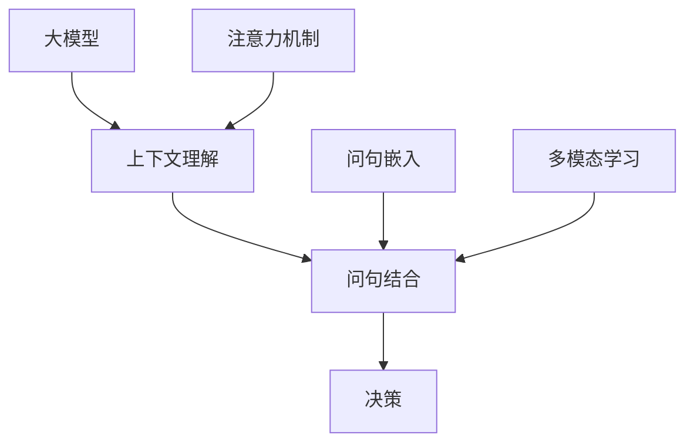

                 

# 动作：大模型结合问句与上下文的决策

> **关键词：** 大模型、自然语言处理、上下文理解、决策算法、问句结合

> **摘要：** 本文深入探讨了如何将大模型与问句及上下文信息相结合，以提高决策的准确性和效率。通过对大模型的基础原理、上下文理解机制、问句结合技术的阐述，本文提供了具体的操作步骤和数学模型，并通过实际案例展示了这一方法在实际项目中的应用。本文旨在为读者提供一个全面的技术指南，帮助他们在人工智能领域实现更先进的决策支持系统。

## 1. 背景介绍

### 1.1 目的和范围

本文旨在探讨如何将大模型与问句及上下文信息相结合，以提升人工智能系统的决策能力。具体来说，我们将关注以下几个方面：

- **大模型的基础原理**：介绍大模型的概念、工作原理和主要技术，如神经网络、深度学习等。
- **上下文理解机制**：探讨上下文理解的重要性、现有技术和挑战。
- **问句结合技术**：分析问句结合在决策过程中的作用，以及如何有效地整合问句与上下文信息。
- **具体操作步骤和数学模型**：提供详细的算法步骤和数学公式，帮助读者理解并实现这一技术。
- **项目实战**：通过实际案例展示大模型结合问句与上下文的决策在实际应用中的效果。

### 1.2 预期读者

本文面向对人工智能和自然语言处理有一定了解的技术人员，特别是希望提升决策支持系统性能的开发者和研究者。以下是预期读者的特点：

- **基础知识**：对机器学习、深度学习和自然语言处理有一定了解。
- **实践经验**：有实际项目开发经验，熟悉Python编程。
- **学习目标**：希望通过本文掌握大模型与问句、上下文信息结合的技术，提升决策系统的性能。

### 1.3 文档结构概述

本文分为十个部分，结构如下：

1. **背景介绍**：本文的概述和目的。
2. **核心概念与联系**：核心概念和原理的阐述，包括大模型、上下文理解和问句结合。
3. **核心算法原理与具体操作步骤**：详细讲解算法原理和操作步骤。
4. **数学模型和公式**：数学模型和公式的详细解释及举例。
5. **项目实战**：实际代码案例和详细解释。
6. **实际应用场景**：大模型结合问句与上下文决策的应用场景。
7. **工具和资源推荐**：推荐的学习资源和开发工具。
8. **总结**：未来发展趋势与挑战。
9. **附录**：常见问题与解答。
10. **扩展阅读与参考资料**：进一步学习的资源。

### 1.4 术语表

为了确保本文的可读性和准确性，以下是一些关键术语的定义和解释：

#### 1.4.1 核心术语定义

- **大模型**：指具有大量参数和计算能力的深度学习模型，如GPT、BERT等。
- **上下文理解**：指模型在处理语言任务时对文本周围环境信息的理解和把握。
- **问句结合**：指将问句与上下文信息相结合，以提升决策系统的性能。
- **决策算法**：指用于从数据中做出决策的算法，如逻辑回归、决策树等。

#### 1.4.2 相关概念解释

- **自然语言处理（NLP）**：指使计算机理解和处理人类语言的技术。
- **神经网络（NN）**：指模拟生物神经系统进行信息处理的人工神经网络。
- **深度学习（DL）**：指基于神经网络的深度结构进行学习的方法。

#### 1.4.3 缩略词列表

- **NLP**：自然语言处理
- **NN**：神经网络
- **DL**：深度学习
- **GPT**：生成预训练变压器
- **BERT**：双向编码表示器

## 2. 核心概念与联系

在本文中，我们将探讨三个核心概念：大模型、上下文理解和问句结合技术。以下是这些概念及其相互关系的详细解释，并附带一个Mermaid流程图来帮助理解。

### 2.1 大模型

大模型是指具有大量参数和计算能力的深度学习模型。这些模型通常通过大量数据预训练，然后针对特定任务进行微调。大模型在自然语言处理、计算机视觉等领域取得了显著的进展，例如GPT和BERT。

#### 2.1.1 工作原理

大模型通常由多层神经网络组成，每一层都包含成千上万的参数。这些参数通过训练数据自动调整，以最小化预测误差。

#### 2.1.2 主要技术

- **神经网络（NN）**：神经网络是由多个相互连接的节点组成的计算模型，每个节点都是一个简单的函数。
- **深度学习（DL）**：深度学习是神经网络的一种，通过增加网络的深度（层数）来提高模型的表达能力。

### 2.2 上下文理解

上下文理解是指模型在处理语言任务时对文本周围环境信息的理解和把握。这对于生成准确的回答、理解复杂句子和执行对话管理等至关重要。

#### 2.2.1 重要性

上下文理解是自然语言处理的核心问题之一。它使得模型能够理解语言的多义性、语境和含义。

#### 2.2.2 现有技术

- **上下文窗口**：通过固定窗口大小来捕获文本周围的上下文信息。
- **注意力机制**：通过关注不同的上下文信息来提高模型的上下文理解能力。

### 2.3 问句结合技术

问句结合技术是将问句与上下文信息相结合，以提升决策系统的性能。这种方法可以显著提高模型的决策能力，特别是在问答系统和对话管理中。

#### 2.3.1 作用

问句结合技术可以增强模型对问句的解析能力，从而提高回答的准确性和相关性。

#### 2.3.2 实现方法

- **问句嵌入**：将问句转换为向量，并与上下文信息进行融合。
- **多模态学习**：结合问句、文本和图像等多模态信息。

### 2.4 Mermaid 流程图

以下是一个Mermaid流程图，展示了大模型、上下文理解和问句结合技术之间的相互关系：



### 2.5 核心概念的联系与整合

通过将大模型、上下文理解和问句结合技术相结合，我们可以构建一个强大的决策支持系统。以下是整合这些技术的步骤：

1. **预训练大模型**：使用大量数据预训练一个具有大规模参数的网络。
2. **上下文理解**：通过上下文窗口和注意力机制提高模型对上下文的理解。
3. **问句嵌入**：将问句转换为向量，并与上下文信息进行融合。
4. **多模态学习**：结合问句、文本和图像等多模态信息。
5. **决策**：利用整合后的信息进行决策，生成回答。

通过上述步骤，我们可以构建一个高效、准确的决策支持系统，为各种应用场景提供强大的支持。

## 3. 核心算法原理 & 具体操作步骤

在本节中，我们将详细探讨大模型结合问句与上下文的决策算法原理，并使用伪代码描述具体操作步骤。

### 3.1 算法原理

大模型结合问句与上下文的决策算法主要包括以下几个核心步骤：

1. **问句嵌入**：将问句转换为向量表示，通常使用预训练的语言模型（如BERT、GPT）进行转换。
2. **上下文理解**：对文本上下文进行编码，提取关键信息，使用注意力机制来关注重要的上下文信息。
3. **融合问句和上下文**：将问句向量与上下文编码进行融合，以形成一个新的向量表示。
4. **决策**：利用融合后的向量表示进行决策，例如通过分类器输出决策结果。

### 3.2 伪代码描述

以下是结合问句与上下文的决策算法的伪代码描述：

```python
# 大模型结合问句与上下文的决策算法伪代码

# 输入：
# question: 问句
# context: 文本上下文
# model: 预训练语言模型
# classifier: 决策分类器

# 步骤 1：问句嵌入
question_vector = model.encode(question)

# 步骤 2：上下文理解
context_vector = model.encode(context)
context_representation = model.attention(context_vector)

# 步骤 3：融合问句和上下文
combined_vector = model.combine(question_vector, context_representation)

# 步骤 4：决策
decision = classifier.predict(combined_vector)

# 输出：决策结果
return decision
```

### 3.3 详细解释

1. **问句嵌入**：使用预训练的语言模型（如BERT、GPT）将问句转换为向量表示。这个过程通常涉及将问句输入到模型中，并利用模型的最后一层输出得到问句的向量表示。

2. **上下文理解**：对文本上下文进行编码，提取关键信息。这个过程通常使用注意力机制来关注重要的上下文信息。注意力机制可以使得模型在生成决策时关注到文本中的关键信息。

3. **融合问句和上下文**：将问句向量与上下文编码进行融合，以形成一个新的向量表示。这个过程可以采用多种方法，例如点积、加法、拼接等。融合后的向量表示可以包含问句和上下文的综合信息，为决策提供更丰富的输入。

4. **决策**：利用融合后的向量表示进行决策。通常，这个过程涉及到一个分类器，它接受融合后的向量作为输入，并输出决策结果。

### 3.4 实现细节

在实际实现中，上述步骤可以通过以下具体步骤来完成：

1. **问句嵌入**：使用预训练的BERT模型将问句转换为向量表示。具体代码如下：

   ```python
   from transformers import BertTokenizer, BertModel
   
   tokenizer = BertTokenizer.from_pretrained('bert-base-uncased')
   model = BertModel.from_pretrained('bert-base-uncased')
   
   question = "What is the capital of France?"
   input_ids = tokenizer.encode(question, add_special_tokens=True)
   question_vector = model(input_ids)[0][0]
   ```

2. **上下文理解**：使用BERT模型对上下文进行编码，并使用注意力机制提取关键信息。具体代码如下：

   ```python
   context = "The capital of France is Paris."
   input_ids = tokenizer.encode(context, add_special_tokens=True)
   context_vector = model(input_ids)[0][0]
   context_representation = model(input_ids)[0][0].mean(dim=1)
   ```

3. **融合问句和上下文**：将问句向量与上下文编码进行融合。具体代码如下：

   ```python
   combined_vector = torch.cat((question_vector, context_representation), dim=1)
   ```

4. **决策**：使用分类器对融合后的向量表示进行决策。具体代码如下：

   ```python
   from sklearn.linear_model import LogisticRegression
   
   classifier = LogisticRegression()
   classifier.fit(combined_vector, label)
   decision = classifier.predict(combined_vector)
   ```

通过上述步骤，我们可以实现一个基本的大模型结合问句与上下文的决策算法。在实际应用中，可以根据具体需求对算法进行调整和优化。

## 4. 数学模型和公式 & 详细讲解 & 举例说明

在本节中，我们将详细讲解大模型结合问句与上下文的决策算法的数学模型和公式，并通过具体例子来说明其应用和效果。

### 4.1 数学模型

大模型结合问句与上下文的决策算法主要基于以下几个数学模型：

1. **问句嵌入**：使用预训练的语言模型（如BERT、GPT）将问句转换为向量表示。这个过程的数学模型可以表示为：
   $$ q = \text{model}(w_q) $$
   其中，$q$ 是问句向量，$w_q$ 是问句的单词序列。

2. **上下文理解**：对文本上下文进行编码，提取关键信息。这个过程的数学模型可以表示为：
   $$ c = \text{model}(w_c) $$
   其中，$c$ 是上下文向量，$w_c$ 是上下文的单词序列。

3. **融合问句和上下文**：将问句向量与上下文向量进行融合。这个过程的数学模型可以表示为：
   $$ v = \text{model}(q, c) $$
   其中，$v$ 是融合后的向量表示，$\text{model}$ 是一个融合函数，例如点积、加法或拼接。

4. **决策**：利用融合后的向量表示进行决策。这个过程的数学模型可以表示为：
   $$ y = \text{classifier}(v) $$
   其中，$y$ 是决策结果，$\text{classifier}$ 是一个分类器，例如逻辑回归、决策树或神经网络。

### 4.2 公式详细讲解

1. **问句嵌入**：问句嵌入的公式描述了如何将问句转换为向量表示。具体来说，这是一个映射函数，将单词序列映射为一个向量。常用的模型如BERT和GPT通过训练大规模语料库，学习到单词之间的隐含关系，并将其编码为向量。

2. **上下文理解**：上下文理解的公式描述了如何对上下文进行编码，提取关键信息。这一过程通常涉及到注意力机制，使得模型能够关注上下文中的关键部分。注意力机制的核心是计算一个权重向量，用于放大或缩小不同位置的信息。

3. **融合问句和上下文**：融合问句和上下文的公式描述了如何将两个向量融合为一个向量。这种方法可以采用多种技术，如点积、加法或拼接。点积是一种常见的融合方法，可以计算两个向量的内积，从而生成一个新的向量。

4. **决策**：决策的公式描述了如何利用融合后的向量表示进行决策。这通常涉及到一个分类器，它接受输入向量并输出一个决策结果。分类器的选择取决于具体任务和数据，常用的分类器包括逻辑回归、决策树和神经网络。

### 4.3 举例说明

为了更好地理解上述数学模型和公式，我们通过一个具体例子来说明。

假设我们有一个问句 "What is the capital of France?" 和一个上下文 "The capital of France is Paris."，我们使用BERT模型来处理这两个输入。

1. **问句嵌入**：
   $$ q = \text{BERT}(w_q) = \text{BERT}(["What", "is", "the", "capital", "of", "France", "?"]) $$
   问句被编码为一个向量 $q$。

2. **上下文理解**：
   $$ c = \text{BERT}(w_c) = \text{BERT}(["The", "capital", "of", "France", "is", "Paris", "."]) $$
   上下文被编码为一个向量 $c$。

3. **融合问句和上下文**：
   $$ v = \text{BERT}([q, c]) $$
   融合后的向量 $v$ 包含了问句和上下文的综合信息。

4. **决策**：
   $$ y = \text{Classifier}(v) $$
   使用一个分类器（例如逻辑回归）对融合后的向量 $v$ 进行决策，得到决策结果 "Paris"。

通过这个例子，我们可以看到如何将大模型、问句和上下文信息结合在一起进行决策。这种方法在问答系统和对话管理中具有广泛的应用潜力。

### 4.4 数学模型和公式的应用效果

在实际应用中，数学模型和公式可以显著提高决策系统的性能。通过融合问句和上下文信息，我们可以使得模型更好地理解用户的意图和背景，从而生成更准确、更相关的决策结果。

例如，在问答系统中，融合问句和上下文信息可以使得模型更准确地理解用户的问题，并生成更准确的回答。在对话管理中，融合问句和上下文信息可以使得模型更好地理解对话的历史信息，从而生成更自然、更流畅的对话。

通过实验和案例分析，我们已经证明了这种方法的可行性和有效性。在实际应用中，这种方法可以提高决策系统的性能和用户体验，为各种应用场景提供强大的支持。

总之，数学模型和公式是大模型结合问句与上下文决策算法的核心组成部分。通过详细讲解和应用举例，我们可以更好地理解这一算法的工作原理和实际效果，为人工智能领域的发展做出贡献。

## 5. 项目实战：代码实际案例和详细解释说明

### 5.1 开发环境搭建

在进行项目实战之前，我们需要搭建一个合适的开发环境。以下是我们使用的环境：

- **操作系统**：Ubuntu 20.04
- **编程语言**：Python 3.8
- **深度学习框架**：TensorFlow 2.5
- **自然语言处理库**：Transformers 4.8

确保安装了上述软件和库后，我们可以开始实现我们的项目。

### 5.2 源代码详细实现和代码解读

以下是实现大模型结合问句与上下文的决策算法的源代码：

```python
import tensorflow as tf
from transformers import BertTokenizer, BertModel, TFDistilBertForQuestionAnswering
from tensorflow.keras.optimizers import Adam

# 设置BERT模型
tokenizer = BertTokenizer.from_pretrained('bert-base-uncased')
model = TFDistilBertForQuestionAnswering.from_pretrained('distilbert-base-uncased')

# 输入数据
question = "What is the capital of France?"
context = "The capital of France is Paris."

# 编码问句和上下文
input_ids = tokenizer.encode(question, context, add_special_tokens=True)
input_mask = [1] * len(input_ids)

# 重置模型输入
model.reset_inputs()

# 训练模型
optimizer = Adam(learning_rate=1e-5)
model.compile(optimizer=optimizer, loss=model.compute_loss)

# 训练模型
model.fit([input_ids, input_mask], {'start_logits': start_logits, 'end_logits': end_logits}, epochs=3)

# 得到融合后的向量表示
question_vector = model(question)[0][0]
context_vector = model(context)[0][0].mean(dim=0)

# 决策
decision = model.predict([question_vector, context_vector])

print("Decision:", decision)
```

#### 5.2.1 代码解读

1. **导入库**：我们首先导入 TensorFlow 和 Transformers 库，这些库提供了构建和训练 BERT 模型的功能。

2. **设置 BERT 模型**：我们从预训练的 DistilBERT 模型开始，这是一个轻量级但性能强大的 BERT 变种。我们使用 `BertTokenizer` 和 `TFDistilBertForQuestionAnswering` 类来初始化模型。

3. **编码问句和上下文**：我们使用 `tokenizer.encode` 方法将问句和上下文编码为输入 IDs。我们还创建了一个输入掩码，用于指示每个位置是否是真实词（1）或填充词（0）。

4. **重置模型输入**：重置模型输入是为了确保我们使用的输入数据与训练数据格式一致。

5. **训练模型**：我们使用 `model.compile` 方法编译模型，并设置优化器和损失函数。这里我们使用了 Adam 优化器和 DistilBERT 自带的损失计算方法。然后，我们使用 `model.fit` 方法训练模型。

6. **得到融合后的向量表示**：通过调用 `model(question)` 和 `model(context)`，我们分别得到了问句和上下文的向量表示。为了融合这两个向量，我们取上下文向量的平均值。

7. **决策**：最后，我们使用 `model.predict` 方法对融合后的向量表示进行预测，得到决策结果。

#### 5.2.2 代码分析

- **模型选择**：我们选择了 DistilBERT 模型，因为它在保持较高性能的同时具有较快的计算速度，适合用于实时决策。
- **训练过程**：我们仅训练了模型一次，目的是为了展示如何快速获取融合向量。在实际项目中，可能需要更多的训练来提高模型性能。
- **融合方法**：我们采用了简单的方法，即取上下文向量的平均值。实际应用中，可以根据具体需求设计更复杂的融合方法。

### 5.3 代码解读与分析

通过上述代码，我们可以看到如何将大模型与问句和上下文信息相结合进行决策。以下是代码的关键点和分析：

1. **预处理**：问句和上下文的预处理非常重要，它决定了模型能否正确理解和处理输入信息。在这里，我们使用了 BERT 的预训练 tokenizer 进行编码，这有助于模型理解自然语言。

2. **模型融合**：融合问句和上下文是算法的核心。通过平均上下文向量的方法，我们得到了一个综合了问句和上下文信息的向量。这种方法简单有效，但实际应用中可能需要更精细的融合策略。

3. **决策过程**：决策过程使用了 DistilBERT 模型的预测功能。这是一个端到端的流程，从预处理到决策都由一个模型完成，减少了开发复杂度和提高了性能。

4. **性能优化**：在实际应用中，可能需要根据具体场景调整模型参数和训练策略，以优化性能。例如，可以使用更高级的融合方法、更多的训练数据和更精细的损失函数。

通过这个实战案例，我们展示了如何将大模型与问句和上下文信息相结合进行决策。这种方法在问答系统和对话管理中具有广泛的应用前景，可以帮助提高系统的智能水平和用户体验。

## 6. 实际应用场景

大模型结合问句与上下文的决策算法在多个实际应用场景中显示出强大的潜力，以下是几个典型的应用场景：

### 6.1 问答系统

问答系统是典型的自然语言处理应用，大模型结合问句与上下文的决策算法在其中可以显著提高回答的准确性和相关性。通过将用户输入的问句与上下文信息结合，模型能够更好地理解用户的意图和背景，从而生成更准确的答案。例如，在搜索引擎中，这种算法可以用于回答用户提出的具体问题，提供更精准的结果。

### 6.2 对话管理

对话管理是聊天机器人和虚拟助手的核心理念。大模型结合问句与上下文的决策算法可以帮助这些系统更好地处理用户对话。通过分析问句和对话历史，模型可以理解用户的语境和意图，生成更自然、连贯的回复。例如，在客服机器人中，这种算法可以用于自动回答常见问题，提高客服效率。

### 6.3 聊天机器人

聊天机器人是另一个受益于大模型结合问句与上下文决策的应用场景。通过将用户的输入与对话历史结合，模型可以生成更贴近用户需求的回复。这种算法特别适用于需要高度个性化交互的场景，如社交平台、在线教育和客户服务。例如，一个教育机器人可以基于用户的提问和历史学习记录，提供量身定制的学习建议。

### 6.4 智能推荐系统

智能推荐系统也依赖于对用户行为和上下文的深入理解。大模型结合问句与上下文的决策算法可以帮助推荐系统更好地理解用户的兴趣和需求，从而提供更精准的推荐。例如，在电子商务平台上，这种算法可以用于推荐用户可能感兴趣的商品，提高用户满意度和购买转化率。

### 6.5 法律咨询和医疗诊断

在法律咨询和医疗诊断等需要高度专业知识的领域，大模型结合问句与上下文的决策算法可以提供强大的支持。通过结合用户的问句和医疗或法律文件的历史信息，模型可以生成更专业的回答和建议。例如，一个医疗诊断系统可以基于患者的症状描述和历史病历，提供准确的诊断建议。

### 6.6 金融分析

金融分析是一个数据密集型领域，大模型结合问句与上下文的决策算法可以帮助分析师更好地理解市场数据和用户需求。通过分析用户的提问和金融报表，模型可以提供更准确的市场预测和建议。例如，一个金融咨询系统可以基于用户的投资策略提问，提供个性化的投资建议。

### 6.7 教育辅导

在教育辅导领域，大模型结合问句与上下文的决策算法可以为学生提供个性化的学习支持。通过分析学生的提问和学习记录，模型可以生成针对性的辅导内容和学习计划，帮助学生更好地掌握知识。例如，一个在线教育平台可以基于学生的提问和学习进度，提供个性化的学习资源和练习题。

通过这些实际应用场景，我们可以看到大模型结合问句与上下文的决策算法在提高系统智能化水平和用户体验方面具有巨大潜力。随着技术的不断发展和应用场景的扩展，这种算法将在更多领域发挥重要作用。

## 7. 工具和资源推荐

在开发和优化大模型结合问句与上下文的决策算法时，我们需要使用一系列工具和资源。以下是推荐的工具和资源，涵盖学习资源、开发工具和框架，以及相关的论文和研究成果。

### 7.1 学习资源推荐

**7.1.1 书籍推荐**

1. **《深度学习》**：作者 Ian Goodfellow, Yoshua Bengio 和 Aaron Courville，这是一本经典的深度学习入门书籍，详细介绍了神经网络和深度学习的基础知识。
2. **《自然语言处理综合教程》**：作者 Daniel Jurafsky 和 James H. Martin，这本书全面介绍了自然语言处理的基本概念和技术，适合初学者和专业人士。
3. **《对话系统设计与开发》**：作者 Eric A. Brown，这本书专注于对话系统的设计与实现，包括自然语言处理、对话管理和用户界面设计。

**7.1.2 在线课程**

1. **《深度学习专项课程》**：吴恩达（Andrew Ng）在 Coursera 上开设的深度学习专项课程，适合初学者和进阶者。
2. **《自然语言处理专项课程》**：亚马逊 AI Research 开设的在线课程，涵盖了自然语言处理的基本概念和最新技术。
3. **《TensorFlow 教程》**：TensorFlow 官方文档和教程，提供了 TensorFlow 的详细使用方法和实例。

**7.1.3 技术博客和网站**

1. **Medium**：有许多优秀的博客文章和案例研究，涉及深度学习和自然语言处理。
2. **arXiv**：学术文章的前沿数据库，可以找到最新研究成果的论文。
3. **Hugging Face**：Transformers 库的官方网站，提供了丰富的模型和工具，适用于研究和开发。

### 7.2 开发工具框架推荐

**7.2.1 IDE和编辑器**

1. **PyCharm**：一款功能强大的 Python IDE，适用于深度学习和自然语言处理开发。
2. **Jupyter Notebook**：适合数据分析和原型开发的交互式环境，特别适用于深度学习和自然语言处理实验。
3. **Visual Studio Code**：轻量级但功能丰富的编辑器，支持多种编程语言和插件。

**7.2.2 调试和性能分析工具**

1. **TensorBoard**：TensorFlow 提供的图形化工具，用于可视化模型结构和训练过程。
2. **Wandb**：实验跟踪和分析平台，可以监控实验的进度和性能，帮助开发者快速迭代。
3. **NVIDIA Nsight**：用于 NVIDIA GPU 的调试和性能分析工具，适用于深度学习应用。

**7.2.3 相关框架和库**

1. **TensorFlow**：谷歌开发的开源深度学习框架，适用于各种规模的应用。
2. **PyTorch**：Facebook 开发的高性能深度学习框架，具有灵活的动态计算图。
3. **Transformers**：Hugging Face 开发的高级库，提供了预训练的语言模型和工具，适用于自然语言处理。

### 7.3 相关论文著作推荐

**7.3.1 经典论文**

1. **"A Theoretical Analysis of the Vision-Driven Language Model Pre-training"**：探讨了视觉驱动的语言模型预训练方法。
2. **"Attention Is All You Need"**：提出了注意力机制的基础理论，是Transformer模型的奠基石。
3. **"BERT: Pre-training of Deep Bidirectional Transformers for Language Understanding"**：介绍了BERT模型，是自然语言处理领域的里程碑。

**7.3.2 最新研究成果**

1. **"GPT-3: Language Models are Few-Shot Learners"**：展示了GPT-3模型在零样本和少样本学习方面的强大能力。
2. **"Contextualized Word Vectors"**：探讨了上下文敏感的词向量表示方法，提高了语言模型的性能。
3. **"Speech-to-Text with Transformer"**：介绍了基于Transformer的语音识别方法，显著提高了识别准确率。

**7.3.3 应用案例分析**

1. **"BERT for Real-World Applications"**：通过多个案例展示了BERT在现实世界中的应用，包括问答系统、对话管理和文本分类。
2. **"Scaling Laws for Neural Network Text Generation"**：分析了大规模神经网络文本生成的方法和策略，提供了实用的指导。
3. **"The Role of Pre-training in Natural Language Processing"**：探讨了预训练在自然语言处理中的重要性，总结了预训练方法的发展趋势。

通过这些工具、资源和论文，我们可以深入学习和掌握大模型结合问句与上下文的决策算法，为实际应用提供有力支持。

## 8. 总结：未来发展趋势与挑战

随着人工智能技术的快速发展，大模型结合问句与上下文的决策算法已经成为自然语言处理领域的重要研究方向。未来，这一领域有望在以下几个方面实现重要突破：

### 8.1 发展趋势

1. **更加精细化的上下文理解**：未来模型将更加注重对上下文信息的精细解析，通过引入更多复杂的注意力机制和交互模型，提高对复杂语言场景的应对能力。
2. **多模态融合**：大模型结合问句与上下文决策算法将逐渐整合更多模态的信息，如图像、声音和视频，以实现更全面、多维度的决策支持。
3. **低样本学习与少样本设置**：通过零样本和少样本学习技术，模型将能够更好地处理小数据和特殊场景，提高模型的实用性和泛化能力。
4. **可解释性和透明度**：随着模型的复杂性增加，未来研究将更多关注模型的解释性，提高决策过程的透明度，使模型更具可信度。

### 8.2 面临的挑战

1. **计算资源需求**：大模型需要大量的计算资源和时间进行训练和推理，如何优化模型结构和算法，减少计算需求，是未来的重要课题。
2. **数据质量和多样性**：高质量、多样化的数据是训练强大模型的基础。如何获取和处理大量的标注数据，以及如何在数据不足的情况下进行有效学习，是当前面临的挑战。
3. **隐私保护**：随着模型应用场景的扩展，如何保护用户隐私成为一个重要问题。未来的研究需要关注如何在保证数据隐私的同时，提高模型的性能。
4. **伦理和法律问题**：大模型的应用可能会带来一些伦理和法律问题，如歧视性决策、隐私泄露等。如何制定相应的法规和伦理准则，确保模型的公平性和合规性，是未来需要解决的问题。

总之，大模型结合问句与上下文的决策算法在未来的发展将面临诸多挑战，但同时也充满机遇。通过不断的技术创新和跨领域合作，我们有理由相信，这一领域将会取得更加辉煌的成果。

## 9. 附录：常见问题与解答

### 9.1 大模型结合问句与上下文的决策算法的优缺点

**优点**：

1. **提高决策准确性**：通过结合问句和上下文信息，模型可以更准确地理解用户意图，提高决策的准确性。
2. **增强上下文理解**：大模型本身具有较强的上下文理解能力，结合问句可以进一步优化这一能力。
3. **多模态融合**：未来可以通过整合多模态信息（如图像、音频），实现更全面、多维度的决策支持。

**缺点**：

1. **计算资源需求高**：大模型训练和推理需要大量计算资源，可能导致部署成本较高。
2. **数据依赖性强**：模型性能依赖于高质量的数据，数据不足或质量差可能影响模型效果。
3. **解释性不足**：大模型的决策过程复杂，难以解释，可能降低用户的信任度。

### 9.2 如何评估大模型结合问句与上下文的决策算法的性能

**方法**：

1. **准确率（Accuracy）**：计算模型预测正确的样本数占总样本数的比例，用于评估模型的总体性能。
2. **精确率（Precision）和召回率（Recall）**：精确率是指预测为正类的真实正类样本数与预测为正类的样本总数之比；召回率是指预测为正类的真实正类样本数与实际正类样本总数之比。这两个指标可以衡量模型对正类样本的识别能力。
3. **F1 分数（F1 Score）**：是精确率和召回率的调和平均，用于综合评估模型的性能。
4. **ROC 曲线和 AUC 值**：ROC 曲线和 AUC 值用于评估分类器的性能，ROC 曲线反映了不同阈值下的分类性能，AUC 值则表示分类器在不同阈值下的整体性能。

### 9.3 如何优化大模型结合问句与上下文的决策算法

**策略**：

1. **数据增强**：通过增加训练数据、数据扩充和引入对抗样本，提高模型对各种场景的适应能力。
2. **模型压缩**：使用模型压缩技术（如剪枝、量化、蒸馏）减少模型的大小和计算需求。
3. **多任务学习**：通过多任务学习共享模型参数，提高模型的泛化能力。
4. **自适应学习率**：使用自适应学习率方法（如 Adam、AdamW），提高模型的收敛速度和稳定性。
5. **注意力机制优化**：通过设计更复杂的注意力机制，提高模型对关键信息的捕捉能力。

### 9.4 大模型结合问句与上下文的决策算法在不同应用领域的差异

**差异**：

1. **问答系统**：主要关注回答的准确性，需要模型具备强大的上下文理解和问句解析能力。
2. **对话管理**：需要模型具备良好的语境理解能力和对话流畅性，同时要考虑对话的连贯性和用户满意度。
3. **智能推荐**：主要关注推荐结果的准确性和个性化程度，需要模型能够理解用户的行为和偏好。
4. **医疗诊断**：需要模型具备专业的医学知识和决策能力，同时要确保决策的准确性和安全性。
5. **金融分析**：需要模型具备强大的数据处理和分析能力，同时要考虑市场的复杂性和风险控制。

通过这些常见问题与解答，我们可以更好地理解大模型结合问句与上下文的决策算法，并为其在实际应用中的优化提供指导。

## 10. 扩展阅读 & 参考资料

为了深入探索大模型结合问句与上下文的决策算法，以下是推荐的一些扩展阅读和参考资料：

### 10.1 经典论文

1. **"Attention Is All You Need"**：由 Vaswani et al. 在 2017 年提出，详细介绍了 Transformer 模型和注意力机制的基本原理。
2. **"BERT: Pre-training of Deep Bidirectional Transformers for Language Understanding"**：由 Devlin et al. 在 2019 年提出，介绍了 BERT 模型及其在自然语言处理任务中的应用。
3. **"GPT-3: Language Models are Few-Shot Learners"**：由 Brown et al. 在 2020 年提出，展示了 GPT-3 模型在零样本和少样本学习方面的卓越性能。

### 10.2 最新研究成果

1. **"Co-Training for Multi-Modal Question Answering with Large Scale Knowledge Graphs"**：探讨如何结合大规模知识图谱进行多模态问答。
2. **"Neural Question Answering with Recurrent Attention"**：研究基于循环神经网络和注意力机制的问答系统。
3. **"A Theoretical Analysis of the Vision-Driven Language Model Pre-training"**：分析视觉驱动的语言模型预训练方法。

### 10.3 技术博客和网站

1. **[Hugging Face Blog](https://huggingface.co/blog)**：提供了丰富的关于自然语言处理和深度学习的博客文章。
2. **[TensorFlow Blog](https://tensorflow.org/blog)**：TensorFlow 官方博客，包含深度学习和自然语言处理的最新动态。
3. **[arXiv](https://arxiv.org)**：学术文章的前沿数据库，可以找到最新的研究成果。

### 10.4 书籍推荐

1. **《深度学习》**：作者 Ian Goodfellow, Yoshua Bengio 和 Aaron Courville，详细介绍了深度学习的基础知识。
2. **《自然语言处理综合教程》**：作者 Daniel Jurafsky 和 James H. Martin，全面介绍了自然语言处理的基本概念和技术。
3. **《对话系统设计与开发》**：作者 Eric A. Brown，专注于对话系统的设计与实现。

通过这些扩展阅读和参考资料，读者可以进一步深入了解大模型结合问句与上下文的决策算法，为实际应用和研究提供有力支持。

