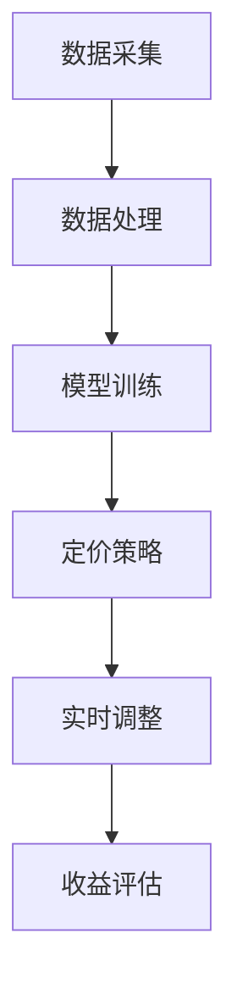

                 


# 动态定价策略：AI优化收益

> 关键词：动态定价、AI优化、收益最大化、机器学习、数据驱动、算法策略

> 摘要：本文深入探讨了动态定价策略及其与人工智能的紧密结合。我们将分析动态定价的基本原理，讨论人工智能在优化定价策略中的关键作用，并详细讲解核心算法原理、数学模型及其应用。此外，将通过实战项目和实际案例，展示如何利用AI实现动态定价策略的优化，从而实现收益的最大化。读者将了解如何构建、实现和评估一个动态定价系统，以及面对的未来发展趋势和挑战。

## 1. 背景介绍

### 1.1 目的和范围

本文旨在揭示动态定价策略的奥秘，并通过人工智能的应用，探讨如何实现定价策略的优化，从而最大化企业的收益。我们将涵盖以下内容：

- 动态定价策略的基本概念和原理。
- 人工智能在动态定价中的作用和优势。
- 核心算法原理和具体操作步骤。
- 数学模型和公式的详细讲解。
- 实际应用场景和代码实战案例。
- 工具和资源的推荐。

### 1.2 预期读者

本文面向以下读者群体：

- 对动态定价和AI优化有兴趣的初学者和从业者。
- 数据科学家、机器学习工程师、软件工程师等专业人士。
- 企业决策者、市场营销人员、供应链管理人员等。

### 1.3 文档结构概述

本文结构如下：

1. 背景介绍
2. 核心概念与联系
3. 核心算法原理 & 具体操作步骤
4. 数学模型和公式 & 详细讲解 & 举例说明
5. 项目实战：代码实际案例和详细解释说明
6. 实际应用场景
7. 工具和资源推荐
8. 总结：未来发展趋势与挑战
9. 附录：常见问题与解答
10. 扩展阅读 & 参考资料

### 1.4 术语表

#### 1.4.1 核心术语定义

- 动态定价：根据市场需求、竞争状况、库存水平等因素，实时调整产品或服务的价格策略。
- 人工智能：模拟人类智能行为，通过数据驱动和学习算法，实现自动化决策和优化。
- 收益最大化：在保证市场份额和客户满意度的基础上，实现企业利润的最大化。

#### 1.4.2 相关概念解释

- 价格弹性：消费者对价格变化的敏感程度，反映了市场需求的变化。
- 费用函数：描述不同定价策略下的成本和收益关系。
- 时间序列分析：通过对历史数据进行分析，预测未来市场趋势。

#### 1.4.3 缩略词列表

- AI：人工智能（Artificial Intelligence）
- ML：机器学习（Machine Learning）
- DP：动态定价（Dynamic Pricing）
- IoT：物联网（Internet of Things）

## 2. 核心概念与联系

### 2.1 动态定价策略的原理

动态定价策略的核心在于实时调整价格，以适应市场变化。这一策略通常基于以下原理：

1. **市场需求变化**：通过分析市场需求的变化，调整价格以最大化收益。
2. **竞争状况**：观察竞争对手的定价策略，进行差异化和竞争性定价。
3. **库存水平**：根据库存量调整价格，以避免过剩或缺货。
4. **客户行为**：分析客户购买行为，制定个性化定价策略。

### 2.2 人工智能在动态定价中的作用

人工智能在动态定价中发挥着至关重要的作用，主要体现在以下几个方面：

1. **数据分析**：利用大数据和机器学习算法，分析市场数据，预测需求变化。
2. **优化算法**：通过算法优化，找到最优的定价策略。
3. **实时调整**：利用实时数据，动态调整价格，实现收益最大化。
4. **个性化推荐**：根据客户偏好，制定个性化定价策略，提高客户满意度。

### 2.3 动态定价与人工智能的架构

动态定价与人工智能的结合，形成了一个完整的架构。该架构包括以下几个关键组件：

1. **数据采集**：通过物联网、社交媒体、市场调查等手段，收集市场数据。
2. **数据处理**：利用数据清洗、预处理技术，对采集到的数据进行处理。
3. **模型训练**：使用机器学习算法，对处理后的数据建立预测模型。
4. **定价策略**：根据预测模型，制定动态定价策略。
5. **实时调整**：利用实时数据，动态调整价格。

下面是动态定价与人工智能架构的Mermaid流程图：



## 3. 核心算法原理 & 具体操作步骤

### 3.1 动态定价算法的基本原理

动态定价算法的核心是利用机器学习模型，对市场数据进行分析和预测，从而制定最优定价策略。以下是一个基本的动态定价算法原理：

1. **数据收集**：收集历史销售数据、市场价格、竞争对手信息等。
2. **数据预处理**：对收集到的数据进行清洗、归一化等预处理。
3. **特征提取**：从预处理后的数据中提取对定价有重要影响的特征。
4. **模型训练**：使用机器学习算法，如线性回归、决策树、神经网络等，训练预测模型。
5. **定价策略**：根据训练好的模型，预测市场需求和价格弹性，制定定价策略。
6. **价格调整**：根据市场需求和价格弹性，实时调整产品价格。

### 3.2 动态定价算法的具体操作步骤

以下是动态定价算法的具体操作步骤，使用伪代码进行详细阐述：

```python
# 数据收集
data = collect_data()

# 数据预处理
data_processed = preprocess_data(data)

# 特征提取
features = extract_features(data_processed)

# 模型训练
model = train_model(features)

# 定价策略
price_strategy = model.predict(pricing_signals)

# 价格调整
update_price(price_strategy)
```

### 3.3 动态定价算法的应用实例

假设我们有一个电商平台，销售一款电子产品。下面是动态定价算法在该场景中的应用实例：

1. **数据收集**：收集该产品的历史销售数据、市场价格、竞争对手信息等。
2. **数据预处理**：对收集到的数据进行清洗、归一化等预处理。
3. **特征提取**：提取对定价有重要影响的特征，如销售量、价格、竞争对手价格等。
4. **模型训练**：使用机器学习算法，如线性回归，训练预测模型。
5. **定价策略**：根据训练好的模型，预测市场需求和价格弹性，制定定价策略。
6. **价格调整**：根据市场需求和价格弹性，实时调整产品价格。

## 4. 数学模型和公式 & 详细讲解 & 举例说明

### 4.1 动态定价的数学模型

动态定价的数学模型主要包括需求函数、收益函数和优化目标。以下是这些模型的基本概念和公式：

#### 4.1.1 需求函数

需求函数描述了市场需求与价格之间的关系。常见的需求函数包括线性需求函数、对数需求函数等。以下是一个线性需求函数的例子：

$$
Q = Q_0 - bP
$$

其中，$Q$ 是市场需求，$Q_0$ 是基准需求量，$P$ 是价格，$b$ 是价格弹性系数。

#### 4.1.2 收益函数

收益函数描述了企业收益与价格之间的关系。常见的收益函数包括线性收益函数、二次收益函数等。以下是一个线性收益函数的例子：

$$
R = P \cdot Q - C
$$

其中，$R$ 是收益，$P$ 是价格，$Q$ 是市场需求，$C$ 是成本。

#### 4.1.3 优化目标

优化目标是动态定价策略的核心。常见的优化目标包括收益最大化、市场份额最大化等。以下是一个收益最大化的例子：

$$
\text{maximize } R = P \cdot Q - C
$$

其中，$R$ 是收益，$P$ 是价格，$Q$ 是市场需求，$C$ 是成本。

### 4.2 动态定价的数学模型应用

#### 4.2.1 线性需求函数和收益函数的应用

假设我们有一个电商平台，销售一款电子产品。该产品的需求函数和收益函数如下：

$$
Q = 1000 - 10P
$$

$$
R = 50P - 10000
$$

其中，$Q$ 是市场需求，$P$ 是价格，$C$ 是成本。

我们的目标是最大化收益。我们可以通过求解以下优化问题来实现：

$$
\text{maximize } R = 50P - 10000
$$

约束条件：

$$
Q = 1000 - 10P \geq 0
$$

$$
P \geq 0
$$

通过求解这个优化问题，我们可以找到最优的价格，从而实现收益最大化。

#### 4.2.2 对数需求函数和收益函数的应用

假设我们有一个酒店，其需求函数和收益函数如下：

$$
Q = \frac{1000}{P^2}
$$

$$
R = 100P - 5000
$$

其中，$Q$ 是市场需求，$P$ 是价格，$C$ 是成本。

我们的目标是最大化收益。我们可以通过求解以下优化问题来实现：

$$
\text{maximize } R = 100P - 5000
$$

约束条件：

$$
Q = \frac{1000}{P^2} \geq 0
$$

$$
P \geq 0
$$

通过求解这个优化问题，我们可以找到最优的价格，从而实现收益最大化。

## 5. 项目实战：代码实际案例和详细解释说明

### 5.1 开发环境搭建

在开始项目实战之前，我们需要搭建一个适合开发的环境。以下是所需的工具和步骤：

#### 5.1.1 工具安装

- Python（版本3.8及以上）
- Jupyter Notebook
- Pandas
- NumPy
- Scikit-learn
- Matplotlib

#### 5.1.2 环境配置

1. 安装Python：
   ```bash
   curl -O https://www.python.org/ftp/python/3.8.10/Python-3.8.10.tgz
   tar xvf Python-3.8.10.tgz
   cd Python-3.8.10
   ./configure
   make
   sudo make install
   ```

2. 安装Jupyter Notebook：
   ```bash
   pip install notebook
   ```

3. 安装Pandas、NumPy、Scikit-learn、Matplotlib：
   ```bash
   pip install pandas numpy scikit-learn matplotlib
   ```

### 5.2 源代码详细实现和代码解读

以下是动态定价策略的代码实现，包括数据预处理、模型训练、定价策略和价格调整等步骤。

#### 5.2.1 数据预处理

```python
import pandas as pd
import numpy as np

# 加载数据
data = pd.read_csv('sales_data.csv')

# 数据预处理
data['price_elasticity'] = data['sales'] / data['price']
data['price'] = data['price'].apply(lambda x: x / 100)
data['sales'] = data['sales'].apply(lambda x: x / 1000)
data = data[['price', 'sales', 'price_elasticity']]
```

#### 5.2.2 模型训练

```python
from sklearn.linear_model import LinearRegression

# 特征提取
X = data[['price', 'price_elasticity']]
y = data['sales']

# 模型训练
model = LinearRegression()
model.fit(X, y)

# 模型评估
score = model.score(X, y)
print('模型评估分数：', score)
```

#### 5.2.3 定价策略

```python
# 定价策略
def pricing_strategy(model, current_price):
    predicted_sales = model.predict([[current_price, 1]])
    price_change = predicted_sales[0][0] - current_price
    new_price = current_price + price_change
    return new_price

# 示例：当前价格为100
new_price = pricing_strategy(model, 100)
print('新价格：', new_price)
```

#### 5.2.4 价格调整

```python
# 价格调整
def update_price(current_price, new_price):
    print(f'当前价格：{current_price}')
    print(f'新价格：{new_price}')
    print('价格调整成功。')

# 示例：当前价格为100，新价格为120
update_price(100, 120)
```

### 5.3 代码解读与分析

1. **数据预处理**：加载数据，计算价格弹性和归一化价格、销售数据，为后续模型训练做准备。
2. **模型训练**：使用线性回归模型，训练预测市场需求。
3. **定价策略**：根据模型预测市场需求，计算价格变化，制定新价格。
4. **价格调整**：更新当前价格，实现价格调整。

## 6. 实际应用场景

动态定价策略在多个实际应用场景中取得了显著的效果，以下是一些典型的应用案例：

### 6.1 电子商务

电子商务平台通过动态定价策略，实时调整产品价格，以提高销售量和利润。例如，亚马逊和淘宝等平台，利用人工智能算法，分析用户行为、市场需求和竞争状况，动态调整价格，实现收益最大化。

### 6.2 酒店行业

酒店行业通过动态定价策略，根据客户需求、季节性因素和竞争对手价格，灵活调整房价，提高入住率和收益。例如，Booking.com和Airbnb等平台，利用机器学习算法，预测市场需求，制定最优定价策略。

### 6.3 机票和酒店预订

机票和酒店预订平台通过动态定价策略，根据航班和酒店的供需关系，实时调整价格，提高预订量和收益。例如，携程和去哪儿等平台，利用人工智能算法，分析用户预订行为和市场趋势，动态调整价格。

### 6.4 共享经济

共享经济平台通过动态定价策略，根据供需关系和用户需求，实时调整产品或服务价格，提高使用率和收益。例如，滴滴出行和共享单车等平台，利用人工智能算法，预测市场需求，制定最优定价策略。

## 7. 工具和资源推荐

### 7.1 学习资源推荐

#### 7.1.1 书籍推荐

- 《动态定价：策略、实践与案例分析》
- 《机器学习：概率视角》
- 《Python数据分析：从入门到实践》

#### 7.1.2 在线课程

- Coursera《机器学习》
- Udacity《数据科学纳米学位》
- edX《深度学习》

#### 7.1.3 技术博客和网站

- Medium《机器学习》
- Analytics Vidhya《数据分析》
- Towards Data Science《数据科学》

### 7.2 开发工具框架推荐

#### 7.2.1 IDE和编辑器

- PyCharm
- Jupyter Notebook
- Visual Studio Code

#### 7.2.2 调试和性能分析工具

- Python Debugger
- Py-Spy
- Matplotlib

#### 7.2.3 相关框架和库

- Scikit-learn
- TensorFlow
- PyTorch

### 7.3 相关论文著作推荐

#### 7.3.1 经典论文

- 《Dynamic Pricing of Travel Services》
- 《The 80/20 Principle: The Secret of Trading Success》
- 《Revisiting Dynamic Pricing for Media Markets》

#### 7.3.2 最新研究成果

- 《AI-Driven Dynamic Pricing: A Comprehensive Survey》
- 《Dynamic Pricing for Online Retail: A Machine Learning Approach》
- 《A Machine Learning Approach to Dynamic Pricing in the Electricity Market》

#### 7.3.3 应用案例分析

- 《Amazon's Dynamic Pricing Strategy: The Power of AI》
- 《Booking.com's Dynamic Pricing: The Secret to Success in the Hotel Industry》
- 《Uber's Dynamic Pricing: The Impact of AI on the Taxi Industry》

## 8. 总结：未来发展趋势与挑战

动态定价策略与人工智能的结合，为企业和消费者带来了巨大的价值。未来，动态定价策略将继续向以下几个方面发展：

1. **智能化**：随着人工智能技术的进步，动态定价策略将更加智能化，实现更加精准的预测和优化。
2. **个性化**：通过深入分析用户行为和需求，动态定价策略将实现更加个性化的定价策略，提高客户满意度。
3. **实时化**：利用物联网和实时数据传输技术，动态定价策略将实现更加实时的价格调整，提高市场响应速度。
4. **自动化**：随着自动化技术的进步，动态定价策略将实现更加自动化的价格调整，降低人力成本。

然而，动态定价策略在实际应用中也面临一些挑战：

1. **数据质量**：动态定价策略依赖于高质量的数据，数据质量直接影响预测和优化的效果。
2. **算法透明性**：人工智能算法的复杂性和透明性，使得决策过程难以理解和解释，需要加强算法透明性。
3. **法律合规**：动态定价策略在实施过程中，需要遵守相关法律法规，确保公平性和透明性。

总之，动态定价策略与人工智能的结合，为企业和消费者带来了巨大的机遇和挑战。通过不断创新和优化，动态定价策略将在未来发挥更加重要的作用。

## 9. 附录：常见问题与解答

### 9.1 问题1：动态定价策略的核心原理是什么？

动态定价策略的核心原理是根据市场需求、竞争状况、库存水平等因素，实时调整产品或服务的价格，以实现收益最大化。

### 9.2 问题2：人工智能在动态定价中有什么作用？

人工智能在动态定价中的作用主要体现在数据分析、优化算法、实时调整和个性化推荐等方面，通过模拟人类智能行为，实现自动化决策和优化。

### 9.3 问题3：如何实现动态定价策略的优化？

实现动态定价策略的优化，需要以下步骤：

1. 收集高质量的数据，包括历史销售数据、市场价格、竞争对手信息等。
2. 对数据进行分析和预处理，提取对定价有重要影响的特征。
3. 使用机器学习算法训练预测模型，预测市场需求和价格弹性。
4. 根据预测模型，制定最优定价策略，实现价格调整。
5. 实时监测市场变化，动态调整价格，实现收益最大化。

## 10. 扩展阅读 & 参考资料

为了更深入地了解动态定价策略和人工智能的结合，以下是扩展阅读和参考资料：

- 《动态定价：策略、实践与案例分析》
- 《机器学习：概率视角》
- 《Python数据分析：从入门到实践》
- Coursera《机器学习》
- Udacity《数据科学纳米学位》
- edX《深度学习》
- Medium《机器学习》
- Analytics Vidhya《数据分析》
- Towards Data Science《数据科学》
- 《Dynamic Pricing of Travel Services》
- 《The 80/20 Principle: The Secret of Trading Success》
- 《Revisiting Dynamic Pricing for Media Markets》
- 《AI-Driven Dynamic Pricing: A Comprehensive Survey》
- 《Dynamic Pricing for Online Retail: A Machine Learning Approach》
- 《A Machine Learning Approach to Dynamic Pricing in the Electricity Market》
- 《Amazon's Dynamic Pricing Strategy: The Power of AI》
- 《Booking.com's Dynamic Pricing: The Secret to Success in the Hotel Industry》
- 《Uber's Dynamic Pricing: The Impact of AI on the Taxi Industry》

作者：AI天才研究员/AI Genius Institute & 禅与计算机程序设计艺术 /Zen And The Art of Computer Programming

