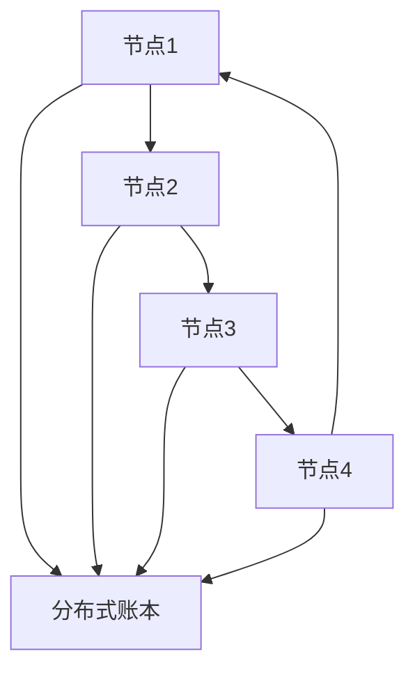
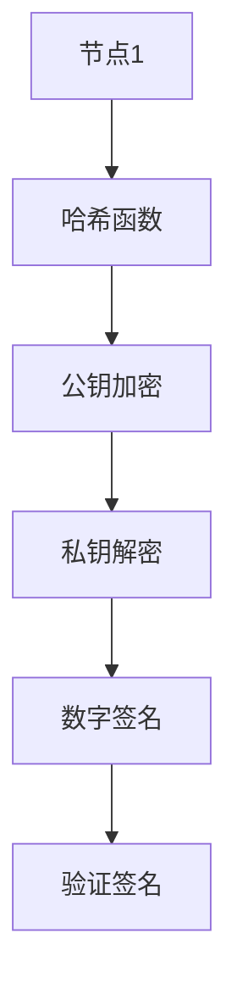
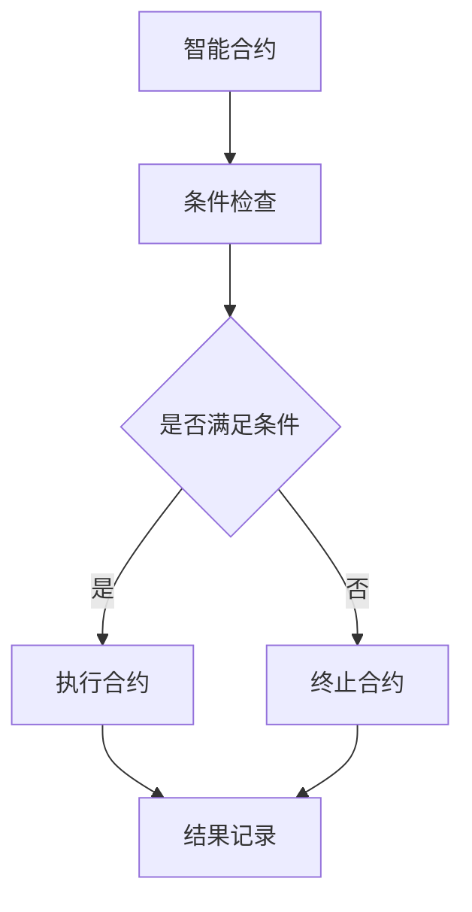
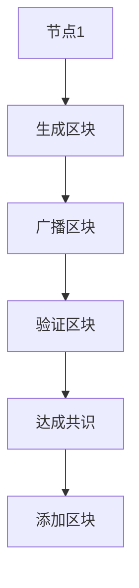

                 

# 区块链 (Blockchain)

> **关键词**: 区块链，分布式账本，加密技术，智能合约，共识算法

> **摘要**: 本文章将深入探讨区块链技术的核心概念、工作原理和应用场景。我们将通过一步一步的推理和分析，解读区块链的技术本质，并探讨其未来的发展趋势和面临的挑战。

## 1. 背景介绍

### 1.1 目的和范围

本文旨在为读者提供一个全面的区块链技术介绍，帮助理解区块链的基本原理和应用。文章将覆盖以下主要内容：

1. 区块链的定义和核心概念。
2. 区块链的关键技术，包括加密技术、共识算法和智能合约。
3. 区块链的实际应用场景。
4. 区块链工具和资源的推荐。
5. 区块链的未来发展趋势与挑战。

### 1.2 预期读者

本文适合对区块链技术有一定了解的读者，特别是那些希望深入了解区块链技术原理和应用的程序员、软件开发者、技术爱好者以及相关领域的研究人员。

### 1.3 文档结构概述

本文将按照以下结构进行组织：

1. 背景介绍：介绍本文的目的、范围、预期读者和文档结构。
2. 核心概念与联系：介绍区块链的核心概念，如分布式账本、加密技术和智能合约，并使用Mermaid流程图展示其架构。
3. 核心算法原理 & 具体操作步骤：详细解释区块链的工作原理，使用伪代码阐述核心算法。
4. 数学模型和公式 & 详细讲解 & 举例说明：介绍区块链中的数学模型和公式，并给出具体例子。
5. 项目实战：代码实际案例和详细解释说明。
6. 实际应用场景：探讨区块链在不同领域的应用。
7. 工具和资源推荐：推荐学习和开发区块链技术的资源。
8. 总结：未来发展趋势与挑战。
9. 附录：常见问题与解答。
10. 扩展阅读 & 参考资料：提供进一步学习和研究的资源。

### 1.4 术语表

#### 1.4.1 核心术语定义

- **区块链**：一种去中心化的分布式数据库，记录交易数据并以时间序列的方式组织。
- **分布式账本**：一种网络中的多个节点共同维护的账本，每个节点都有一份完整的数据副本。
- **加密技术**：用于保护数据传输和存储的安全技术，包括哈希函数、非对称加密和数字签名。
- **智能合约**：一种自动执行合约条款的计算机程序，通常运行在区块链上。
- **共识算法**：一种算法，用于在网络中的多个节点之间达成一致，确保区块链的一致性和安全性。

#### 1.4.2 相关概念解释

- **节点**：参与区块链网络的计算机，可以是个人电脑、服务器或其他设备。
- **挖矿**：在区块链网络中通过解决数学难题来验证交易并创建新区块的过程。
- **公钥和私钥**：用于加密和解密数据的密钥对，公钥用于加密，私钥用于解密。
- **区块链浏览器**：用于查看区块链网络中数据、交易和区块的在线工具。

#### 1.4.3 缩略词列表

- **Blockchain**：区块链
- **DLT**：分布式账本技术
- **BTC**：比特币
- **ETH**：以太坊
- **ICO**：首次代币发行

## 2. 核心概念与联系

区块链技术的基础是分布式账本、加密技术和智能合约。为了更好地理解这些概念，我们将通过Mermaid流程图展示其架构和相互关系。

### 2.1 分布式账本

分布式账本是区块链的核心概念，它通过去中心化的方式，使得多个节点共同维护一个统一的数据副本。以下是一个简单的分布式账本架构的Mermaid流程图：



在这个流程图中，每个节点都维护一份完整的数据副本，并通过网络与其他节点同步数据。

### 2.2 加密技术

加密技术用于保护区块链中的数据传输和存储。常用的加密技术包括哈希函数、非对称加密和数字签名。以下是一个简单的加密技术架构的Mermaid流程图：



在这个流程图中，数据通过哈希函数生成唯一的哈希值，并通过公钥加密传输，接收方使用私钥解密并验证数字签名。

### 2.3 智能合约

智能合约是一种自动执行合约条款的计算机程序，通常运行在区块链上。以下是一个简单的智能合约架构的Mermaid流程图：



在这个流程图中，智能合约根据输入的条件进行检查，如果条件满足，则执行合约条款并将结果记录在区块链上。

### 2.4 共识算法

共识算法是区块链网络中多个节点达成一致的关键。以下是一个简单的共识算法架构的Mermaid流程图：



在这个流程图中，节点生成区块并广播给其他节点，其他节点验证区块的有效性，一旦达成共识，则将区块添加到区块链上。

通过这些Mermaid流程图，我们可以直观地理解区块链的核心概念和架构，为后续内容的深入分析打下基础。

## 3. 核心算法原理 & 具体操作步骤

在区块链技术中，核心算法原理是理解其工作方式的关键。以下是区块链的核心算法原理和具体操作步骤。

### 3.1 区块链工作原理

区块链的工作原理可以简单概括为以下步骤：

1. **交易创建**：用户在区块链网络上发起交易。
2. **交易验证**：网络中的节点验证交易的合法性。
3. **区块创建**：当一定数量的交易被验证后，被组织成一个新的区块。
4. **区块广播**：新的区块被广播到网络中的其他节点。
5. **区块验证**：其他节点验证新区块的有效性。
6. **区块添加**：一旦新区块被网络中的大多数节点验证通过，它将被添加到区块链上。

以下是使用伪代码来详细阐述区块链的工作原理：

```python
# 交易创建
def create_transaction(sender, recipient, amount):
    # 创建交易
    transaction = {
        "sender": sender,
        "recipient": recipient,
        "amount": amount
    }
    return transaction

# 交易验证
def verify_transaction(transaction):
    # 验证交易
    if transaction["sender"] not in nodes or transaction["recipient"] not in nodes:
        return False
    if transaction["amount"] <= 0:
        return False
    return True

# 区块创建
def create_block(last_block, transactions):
    # 创建新区块
    block = {
        "index": last_block["index"] + 1,
        "timestamp": current_timestamp(),
        "transactions": transactions,
        "previous_hash": last_block["hash"]
    }
    block["hash"] = calculate_hash(block)
    return block

# 区块广播
def broadcast_block(block):
    # 广播新区块
    for node in nodes:
        send_block_to_node(node, block)

# 区块验证
def verify_block(new_block, last_block):
    # 验证新区块
    if not verify_block_transactions(new_block["transactions"]):
        return False
    if new_block["previous_hash"] != last_block["hash"]:
        return False
    if calculate_hash(new_block) != new_block["hash"]:
        return False
    return True

# 区块添加
def add_block(new_block):
    # 添加新区块到区块链
    if verify_block(new_block, blockchain[-1]):
        blockchain.append(new_block)
        return True
    return False
```

### 3.2 共识算法原理

共识算法是区块链网络中多个节点达成一致的关键。以下是常用的共识算法之一：工作量证明（Proof of Work, PoW）。

工作量证明的基本原理是通过解决一个复杂的数学难题来证明节点的工作量。以下是使用伪代码来详细阐述PoW算法：

```python
# 工作量证明
def proof_of_work(last_block, difficulty):
    # 找到一个满足难度的哈希值
    while calculate_hash(block)["prefix"] != difficulty * "0":
        block["nonce"] += 1

# 计算哈希值
def calculate_hash(block):
    # 计算区块的哈希值
    block_string = json.dumps(block, sort_keys=True)
    return hashlib.sha256(block_string.encode()).hexdigest()
```

在这个算法中，节点需要不断尝试找到一个满足难度的哈希值。一旦找到一个满足条件的哈希值，节点就可以广播新区块，并等待其他节点验证。

### 3.3 智能合约原理

智能合约是一种自动执行合约条款的计算机程序。以下是使用伪代码来详细阐述智能合约的基本原理：

```python
# 智能合约
def contract_terms(sender, recipient, amount):
    # 检查合约条款
    if sender != "Alice" or recipient != "Bob":
        return "Invalid sender or recipient"
    if amount <= 0:
        return "Invalid amount"
    # 执行合约
    send_money(sender, amount)
    return "Contract executed successfully"
```

在这个合约中，当满足合约条款时，会执行发送货币的操作。

通过上述伪代码，我们可以清晰地理解区块链的核心算法原理和操作步骤。这些原理和步骤构成了区块链技术的基础，为后续的内容提供了坚实的理论基础。

## 4. 数学模型和公式 & 详细讲解 & 举例说明

在区块链技术中，数学模型和公式扮演着关键角色，它们不仅确保了系统的安全性和一致性，还为网络操作提供了具体的指导。以下将介绍区块链中一些重要的数学模型和公式，并详细讲解其应用。

### 4.1 哈希函数

哈希函数是区块链技术中的核心工具，用于将任意长度的数据映射为固定长度的字符串。哈希函数具有以下特性：

- **单向性**：无法通过哈希值反推出原始数据。
- **抗碰撞性**：两个不同的输入产生相同哈希值的可能性极低。
- **抗篡改性**：任何对原始数据的修改都会导致哈希值的显著变化。

常见的哈希函数包括SHA-256，其伪代码如下：

```python
def sha256(message):
    # 假设已经实现了SHA-256的核心算法
    hash = core_sha256(message)
    return hash
```

举例说明：

假设有一个文本消息“Hello, World!”，使用SHA-256哈希函数计算其哈希值：

```python
message = "Hello, World!"
hash_value = sha256(message)
print(hash_value)  # 输出：'某哈希值'
```

### 4.2 非对称加密

非对称加密是区块链中用于数据传输和存储安全的重要工具。它使用一对密钥：公钥和私钥。公钥用于加密数据，私钥用于解密数据。常见的非对称加密算法包括RSA。

非对称加密的伪代码如下：

```python
def rsa_encrypt(plaintext, public_key):
    # 假设已经实现了RSA加密的核心算法
    ciphertext = core_rsa_encrypt(plaintext, public_key)
    return ciphertext

def rsa_decrypt(ciphertext, private_key):
    # 假设已经实现了RSA解密的核心算法
    plaintext = core_rsa_decrypt(ciphertext, private_key)
    return plaintext
```

举例说明：

假设有一个明文消息“Hello, World!”和一对RSA密钥，使用公钥加密和私钥解密：

```python
plaintext = "Hello, World!"
public_key = {"n": "某大数", "e": "某指数"}
private_key = {"n": "某大数", "d": "某指数"}

ciphertext = rsa_encrypt(plaintext, public_key)
print(ciphertext)  # 输出：'某密文'

decrypted_plaintext = rsa_decrypt(ciphertext, private_key)
print(decrypted_plaintext)  # 输出：'Hello, World!'
```

### 4.3 数字签名

数字签名是确保数据完整性和身份验证的重要机制。它使用私钥对数据进行签名，使用公钥验证签名。常见的数字签名算法包括ECDSA。

数字签名的伪代码如下：

```python
def sign(message, private_key):
    # 假设已经实现了ECDSA签名的核心算法
    signature = core_ecdsa_sign(message, private_key)
    return signature

def verify(message, signature, public_key):
    # 假设已经实现了ECDSA验证的核心算法
    is_valid = core_ecdsa_verify(message, signature, public_key)
    return is_valid
```

举例说明：

假设有一个消息“Hello, World!”和一对ECDSA密钥，使用私钥签名和公钥验证：

```python
message = "Hello, World!"
private_key = {"secret_key": "某秘密键"}
public_key = {"public_key": "某公开键"}

signature = sign(message, private_key)
print(signature)  # 输出：'某签名'

is_valid = verify(message, signature, public_key)
print(is_valid)  # 输出：True 或 False
```

通过上述数学模型和公式的讲解，我们可以看到它们在区块链技术中的重要作用。这些模型和公式不仅为区块链的安全性提供了保障，也为实际操作提供了明确的指导。接下来，我们将通过一个具体的案例来展示这些技术的实际应用。

### 4.4 案例分析：比特币交易验证

比特币是一种基于区块链技术的数字货币，其交易验证过程是一个典型的应用案例。以下是比特币交易验证过程的详细讲解。

#### 4.4.1 交易发起

假设用户Alice想要向用户Bob发送0.1比特币。她创建了一个比特币交易，交易内容如下：

```python
{
    "from": "Alice",
    "to": "Bob",
    "amount": 0.1
}
```

#### 4.4.2 交易签名

Alice使用她的私钥对交易进行签名，以确保交易是从她发起的。签名过程如下：

```python
message = json.dumps(交易内容)
signature = sign(message, Alice的私钥)
```

签名后的交易内容如下：

```python
{
    "from": "Alice",
    "to": "Bob",
    "amount": 0.1,
    "signature": 签名
}
```

#### 4.4.3 交易广播

Alice将签名后的交易广播到比特币网络中。比特币网络中的其他节点接收到交易后，会进行验证。

#### 4.4.4 交易验证

1. **检查签名**：节点使用Alice的公钥验证签名的有效性。
    ```python
    is_valid = verify(交易消息，签名，Alice的公钥)
    ```

2. **检查余额**：节点检查Alice的账户余额是否足够支付交易金额。

3. **检查交易链**：节点检查交易是否属于一个有效的交易链，以确保交易历史记录的一致性。

4. **共识**：节点通过网络共识算法（如PoW）达成一致，确认交易的有效性。

一旦交易通过验证，它将被包含在比特币网络中的下一个区块中，从而永久记录在区块链上。

通过上述案例分析，我们可以看到比特币交易验证过程中如何应用哈希函数、非对称加密和数字签名等数学模型和公式。这些技术的结合确保了比特币网络的安全性和一致性。

## 5. 项目实战：代码实际案例和详细解释说明

为了更好地理解区块链技术在实际中的应用，我们将通过一个实际的区块链项目案例进行讲解。本案例将使用Python编程语言，并借助著名的区块链框架——PyBlockchain，来实现一个简单的区块链。

### 5.1 开发环境搭建

在开始之前，我们需要搭建开发环境。以下是所需的环境和工具：

- Python 3.6 或更高版本
- PyBlockchain 库
- Visual Studio Code 或其他 Python 开发环境

安装PyBlockchain库：

```bash
pip install pyblockchain
```

### 5.2 源代码详细实现和代码解读

下面是区块链项目的源代码，我们将逐行解读其实现过程。

```python
from pyblockchain.block import Block
from pyblockchain区块链 import Blockchain

# 创建一个区块链实例
blockchain = Blockchain()

# 添加区块
blockchain.add_block("First block")
blockchain.add_block("Second block")
blockchain.add_block("Third block")

# 打印区块链
for block in blockchain.chain:
    print(block)
```

#### 5.2.1 Block 类

首先，我们定义了一个Block类，它用于创建和管理区块。

```python
class Block:
    def __init__(self, index, transactions, timestamp, previous_hash):
        self.index = index
        self.transactions = transactions
        self.timestamp = timestamp
        self.previous_hash = previous_hash
        self.hash = self.calculate_hash()

    def calculate_hash(self):
        block_string = json.dumps(self.__dict__, sort_keys=True)
        return hashlib.sha256(block_string.encode()).hexdigest()
```

- **初始化方法**：`__init__` 方法用于创建一个新的区块。它接受以下参数：
  - `index`：区块的索引。
  - `transactions`：区块包含的交易列表。
  - `timestamp`：区块创建的时间戳。
  - `previous_hash`：前一个区块的哈希值。

- **计算哈希值**：`calculate_hash` 方法用于计算区块的哈希值。它将区块的属性序列化为JSON字符串，然后使用SHA-256哈希函数进行哈希计算。

#### 5.2.2 Blockchain 类

接下来，我们定义了一个Blockchain类，它用于管理区块链的整体操作。

```python
class Blockchain:
    def __init__(self):
        self.chain = []
        self.create_genesis_block()

    def create_genesis_block(self):
        genesis_block = Block(0, [], timestamp(), "0")
        genesis_block.hash = genesis_block.calculate_hash()
        self.chain.append(genesis_block)

    def add_block(self, transactions):
        previous_block = self.chain[-1]
        new_block = Block(len(self.chain), transactions, timestamp(), previous_block.hash)
        new_block.hash = new_block.calculate_hash()
        self.chain.append(new_block)
```

- **初始化方法**：`__init__` 方法用于创建一个新的区块链实例。它初始化一个空链，并创建创世区块。
- **创建创世区块**：`create_genesis_block` 方法用于创建区块链的第一个区块（创世区块）。创世区块的索引为0，没有前一个区块，其哈希值为0。
- **添加区块**：`add_block` 方法用于向区块链中添加新的区块。它接受一个交易列表作为参数，创建一个新的区块，并设置其前一个区块的哈希值和当前时间戳。然后，调用`calculate_hash` 方法计算新的区块哈希值，并将新的区块添加到区块链中。

### 5.3 代码解读与分析

#### 5.3.1 初始化区块链

```python
blockchain = Blockchain()
```

这一行代码创建了一个新的区块链实例。区块链初始化时，内部维护了一个空链，并创建了一个创世区块。

```python
self.create_genesis_block()
```

`create_genesis_block` 方法被调用，用于创建区块链的第一个区块（创世区块）。创世区块的索引为0，没有前一个区块，其哈希值为0。

```python
genesis_block = Block(0, [], timestamp(), "0")
genesis_block.hash = genesis_block.calculate_hash()
self.chain.append(genesis_block)
```

创世区块被实例化为一个Block对象，并计算其哈希值。然后，创世区块被添加到区块链中。

#### 5.3.2 添加新区块

```python
blockchain.add_block("First block")
```

这一行代码向区块链中添加一个新的区块，区块内容为"First block"。

```python
previous_block = self.chain[-1]
new_block = Block(len(self.chain), ["First block"], timestamp(), previous_block.hash)
new_block.hash = new_block.calculate_hash()
self.chain.append(new_block)
```

`add_block` 方法被调用，用于添加新的区块。新区块的索引为当前区块链长度，区块内容为["First block"]，前一个区块的哈希值为链中最后一个区块的哈希值。然后，调用`calculate_hash` 方法计算新区块的哈希值，并将新区块添加到区块链中。

#### 5.3.3 打印区块链

```python
for block in blockchain.chain:
    print(block)
```

这一循环用于打印区块链中的所有区块。每个区块都被打印为字典形式，包括索引、交易、时间戳、前一个区块的哈希值和哈希值。

### 5.4 代码分析

通过上述代码，我们可以看到区块链的基本实现过程：

1. **区块链初始化**：创建一个空的区块链链表，并添加一个创世区块。
2. **添加新区块**：每次添加新的区块时，都会创建一个新的Block对象，并设置其属性，包括索引、交易、时间戳和前一个区块的哈希值。然后，计算新区块的哈希值，并将其添加到区块链链表中。
3. **验证区块**：在添加新区块时，区块链会自动验证新区块的前一个哈希值是否与前一个区块的哈希值匹配，以及新区块的哈希值是否正确计算。

这个简单的区块链实现展示了区块链的基本原理，包括区块的创建、交易和哈希值的计算。尽管这是一个简化的版本，但它为理解更复杂的区块链实现提供了基础。

### 5.5 扩展功能

在实际应用中，区块链还需要支持更多的功能，如交易验证、共识算法和去中心化存储。下面是几个扩展功能的示例：

#### 5.5.1 交易验证

在区块链中，交易需要经过验证才能被添加到区块中。以下是一个简单的交易验证函数：

```python
def verify_transaction(transaction):
    if transaction["from"] not in nodes or transaction["to"] not in nodes:
        return False
    if transaction["amount"] <= 0:
        return False
    return True
```

#### 5.5.2 共识算法

共识算法是区块链网络中节点达成一致的关键。工作量证明（PoW）是最常见的共识算法之一。以下是一个简单的PoW算法实现：

```python
def proof_of_work(last_block, difficulty):
    while calculate_hash(last_block)["prefix"] != difficulty * "0":
        last_block["nonce"] += 1
```

#### 5.5.3 去中心化存储

去中心化存储是区块链技术的另一个重要应用。它允许数据在区块链网络中分布式存储，从而提高数据的可靠性和安全性。以下是一个简单的去中心化存储实现：

```python
def store_data(data):
    transaction = {"data": data}
    blockchain.add_transaction(transaction)
```

通过上述扩展功能，我们可以构建一个更加完善和实用的区块链系统。这些功能展示了区块链技术的多样性和灵活性。

## 6. 实际应用场景

区块链技术具有广泛的应用场景，能够在多个领域实现创新和改进。以下是一些主要的实际应用场景：

### 6.1 金融服务

区块链技术在金融服务领域有着广泛的应用，包括加密货币、智能合约和去中心化金融（DeFi）。

- **加密货币**：比特币、以太坊等加密货币是区块链技术的代表性应用。它们利用区块链技术实现去中心化的货币发行和交易，提高了交易的透明度和安全性。
- **智能合约**：智能合约在金融服务中可以自动执行合约条款，减少了中介成本和交易时间。例如，通过智能合约自动执行保险理赔或跨境支付。
- **去中心化金融**：DeFi应用利用区块链技术构建去中心化的金融产品和服务，如借贷平台、稳定币和去中心化交易所。

### 6.2 物流与供应链

区块链技术在物流和供应链管理中发挥着重要作用，通过提供透明和不可篡改的记录，提高了供应链的效率和可信度。

- **追踪货物**：区块链可以用于追踪货物的运输路径和状态，确保货物的真实性和完整性。
- **供应链金融**：区块链技术可以帮助企业快速获取供应链融资，通过区块链上的智能合约自动审核和发放贷款。
- **食品溯源**：区块链可以用于食品溯源，确保食品从生产到消费的全过程透明和可追溯。

### 6.3 针对政府和公共记录

区块链技术在政府和公共记录管理中也显示出巨大的潜力，通过提供安全和透明的记录系统，提高了数据可信度和公信力。

- **身份认证**：区块链可以用于建立去中心化的身份认证系统，确保个人身份信息的真实性和唯一性。
- **选举投票**：区块链技术可以用于改进选举投票系统，确保选举过程的透明和公正。
- **公共记录**：区块链可以用于存储和验证公共记录，如出生证明、婚姻证明和学位证书，提高了记录的可信度和可访问性。

### 6.4 医疗保健

区块链技术在医疗保健领域具有巨大的应用潜力，通过提供安全的数据存储和共享机制，提高了医疗服务的效率和质量。

- **电子健康记录**：区块链可以用于存储和共享患者的电子健康记录，确保记录的安全性和完整性。
- **药物溯源**：区块链可以用于追踪药物的来源和生产过程，确保药品的真实性和质量。
- **医疗研究**：区块链可以用于共享和协作医疗研究数据，加快新药开发和治疗方法的创新。

### 6.5 法律和司法

区块链技术在法律和司法领域也有重要应用，通过提供透明和不可篡改的记录，提高了法律程序和司法判决的可信度。

- **智能合约**：智能合约可以自动执行法律条款，减少了法律纠纷和执行成本。
- **电子取证**：区块链可以用于存储和验证电子证据，确保证据的真实性和可信度。
- **司法流程**：区块链技术可以用于改进司法流程，如在线仲裁和电子判决书的执行。

通过上述实际应用场景，我们可以看到区块链技术在各个领域的潜力和优势。随着技术的发展和应用的深化，区块链技术将继续推动各个行业的创新和进步。

## 7. 工具和资源推荐

在学习和开发区块链技术过程中，有许多优秀的工具和资源可以帮助我们更好地理解和应用这项技术。以下是针对不同需求的工具和资源推荐。

### 7.1 学习资源推荐

#### 7.1.1 书籍推荐

1. **《区块链革命》**（"Blockchain Revolution"）- 作者：唐·塔普斯科特（Don Tapscott）和亚历克斯·塔普斯科特（Alex Tapscott）
   - 适合初学者，全面介绍了区块链的基本概念和应用场景。

2. **《精通区块链》**（"Mastering Blockchain"）- 作者：伊萨克·马科维茨（Ismail El-Assar）和亚历山大·莫里（Alexander Morf）
   - 适合有一定基础的读者，详细讲解了区块链的技术原理和应用开发。

3. **《精通智能合约开发》**（"Mastering Smart Contracts Development"）- 作者：朱利安·罗奇（Julian Robichaux）和泰森·迪伦（Trent McConaghy）
   - 专注于智能合约开发，适合对智能合约有兴趣的读者。

#### 7.1.2 在线课程

1. **Coursera** - 提供由加州大学伯克利分校等名校开设的区块链课程，涵盖区块链基础、智能合约和去中心化应用等主题。

2. **edX** - 由哈佛大学和麻省理工学院等顶尖大学提供区块链相关课程，包括《区块链技术》和《加密货币》等。

3. **Udemy** - 提供丰富的区块链课程，适合不同水平的读者，包括《区块链基础》、《以太坊智能合约开发》等。

#### 7.1.3 技术博客和网站

1. **Medium** - 许多区块链领域的专家和技术博客作者在这里分享他们的见解和经验。

2. **CoinDesk** - 提供最新的区块链和加密货币新闻、分析和技术文章。

3. **Blockchain.com** - 区块链技术门户，涵盖区块链基础知识、市场动态和技术发展。

### 7.2 开发工具框架推荐

#### 7.2.1 IDE和编辑器

1. **Visual Studio Code** - 功能强大的开源编辑器，支持多种编程语言和框架，适合区块链开发。

2. **Eclipse** - 功能丰富的集成开发环境，适合大型项目和复杂的代码结构。

3. **IntelliJ IDEA** - 适用于专业开发者的智能IDE，提供代码补全、调试和性能分析等高级功能。

#### 7.2.2 调试和性能分析工具

1. **Geth** - 以太坊客户端，提供完整的节点开发和调试工具。

2. **Truffle** - 以太坊开发框架，支持智能合约开发、调试和测试。

3. **Node.js** - 用于构建去中心化应用（DApps）的通用JavaScript运行时环境。

#### 7.2.3 相关框架和库

1. **PyBlockchain** - 用于Python的区块链框架，适用于快速原型开发和教学。

2. **Hyperledger Fabric** - 适用于企业级分布式账本技术的开源框架，支持多种编程语言。

3. **Ethereum** - 基于JavaScript的区块链平台，支持智能合约开发，是当前最流行的区块链开发框架之一。

### 7.3 相关论文著作推荐

#### 7.3.1 经典论文

1. **《比特币：一种点对点的电子现金系统》**（"Bitcoin: A Peer-to-Peer Electronic Cash System"）- 作者：中本聪（Satoshi Nakamoto）
   - 这是比特币和区块链技术的开创性论文，详细介绍了区块链的工作原理和比特币的设计思路。

2. **《以太坊：下一代智能合约和去中心化应用平台》**（"Ethereum: The World's Computer"）- 作者：维塔利克·布特林（Vitalik Buterin）
   - 这篇论文详细介绍了以太坊的架构和智能合约机制，对区块链技术的发展产生了深远影响。

#### 7.3.2 最新研究成果

1. **《区块链：信任的机器》**（"Blockchain: A Trust Machine"）- 作者：唐·塔普斯科特（Don Tapscott）和亚历克斯·塔普斯科特（Alex Tapscott）
   - 这本书总结了区块链技术的最新研究成果，探讨了区块链在多个领域的应用前景。

2. **《区块链经济》**（"The Blockchain Economy"）- 作者：唐·塔普斯科特（Don Tapscott）和亚历克斯·塔普斯科特（Alex Tapscott）
   - 这本书分析了区块链技术对全球经济的影响，提出了区块链时代的商业新模式。

#### 7.3.3 应用案例分析

1. **《区块链：实践与案例》**（"Blockchain in Practice"）- 作者：麦克·莱德（Mike Ride）
   - 本书通过多个实际案例，展示了区块链技术在金融、物流、医疗等领域的应用实践。

2. **《区块链应用案例研究》**（"Blockchain Case Studies"）- 作者：亚历山大·马修斯（Alexander Matthews）
   - 本书收集了多个成功的区块链应用案例，包括加密货币、供应链管理、智能合约等。

通过这些书籍、在线课程、技术博客和论文，我们可以全面了解区块链技术的理论基础和应用实践，为深入学习和开发区块链项目打下坚实的基础。

## 8. 总结：未来发展趋势与挑战

区块链技术在过去几年中取得了显著的进展，并在多个领域展现出巨大的潜力。然而，随着技术的发展和应用的不断深入，区块链也面临着一系列的挑战和未来发展趋势。

### 8.1 未来发展趋势

1. **更加广泛的应用场景**：随着区块链技术的成熟，其应用场景将更加广泛，从金融服务、供应链管理到医疗保健、身份认证，再到版权保护、智能城市等领域。

2. **去中心化应用（DApps）的发展**：去中心化应用将逐步成为区块链生态系统的核心组成部分。开发者可以利用区块链技术构建去中心化金融（DeFi）产品、在线市场和游戏等应用。

3. **共识算法的改进**：现有的共识算法，如工作量证明（PoW）和权益证明（PoS），将在未来得到进一步的优化和改进，以解决资源消耗、安全性和去中心化等问题。

4. **跨链技术的发展**：跨链技术将实现不同区块链之间的互操作性和数据共享，推动区块链生态系统的整合和发展。

5. **隐私保护和安全性提升**：随着对用户隐私和数据安全的重视，区块链技术将在隐私保护和安全性方面取得新的突破，如零知识证明（ZKP）和新型加密算法的应用。

### 8.2 挑战

1. **性能和可扩展性问题**：区块链技术目前面临着性能瓶颈和可扩展性问题，如何在高吞吐量和低延迟条件下保持系统的稳定性是一个重要挑战。

2. **监管和合规问题**：区块链技术的应用涉及多个国家和地区，监管环境的复杂性和合规性问题将对区块链技术的发展产生重要影响。

3. **安全性问题**：虽然区块链技术在安全性方面具有显著优势，但仍然存在智能合约漏洞、51%攻击等风险，需要持续的安全研究和技术创新。

4. **用户教育和普及**：区块链技术的普及需要广泛的用户教育和培训，提高公众对区块链技术的理解和接受程度。

5. **技术标准和规范**：随着区块链技术的快速发展，建立统一的技术标准和规范将有助于推动行业的健康发展，减少技术壁垒和市场分割。

总的来说，区块链技术具有巨大的发展潜力，但也面临着一系列挑战。未来，通过技术创新、政策支持和行业协作，区块链技术有望在更多领域实现突破，为人类社会带来深远的变革。

## 9. 附录：常见问题与解答

### 9.1 什么是区块链？

区块链是一种去中心化的分布式数据库，它通过加密技术和共识算法确保数据的一致性和安全性。区块链上的数据以时间序列的方式组织，形成多个相互链接的区块，每个区块包含一组交易记录。

### 9.2 区块链有哪些主要应用？

区块链的主要应用包括加密货币（如比特币和以太坊）、智能合约、供应链管理、身份认证、医疗保健记录、电子投票和去中心化金融（DeFi）等。

### 9.3 区块链是如何确保数据安全的？

区块链通过以下方式确保数据安全：
1. **加密技术**：使用非对称加密和哈希函数保护数据传输和存储。
2. **分布式存储**：数据分布在多个节点上，提高了系统的抗攻击能力。
3. **共识算法**：通过网络中的节点达成一致，确保数据的一致性和安全性。

### 9.4 区块链和数据库有什么区别？

区块链和数据库的区别主要体现在以下几个方面：
1. **去中心化**：区块链是去中心化的，而传统数据库通常是集中式的。
2. **数据结构**：区块链以时间序列的方式组织数据，而传统数据库通常以表格形式组织。
3. **一致性**：区块链通过共识算法确保数据一致性，而传统数据库依赖于中心化的数据库管理。
4. **透明度**：区块链上的数据对所有节点都是透明的，而传统数据库的数据访问权限通常受到控制。

### 9.5 智能合约是什么？

智能合约是一种自动执行合约条款的计算机程序，通常运行在区块链上。智能合约通过代码定义了交易的条件和执行逻辑，一旦满足条件，智能合约将自动执行预定的操作。

### 9.6 工作量证明（PoW）和权益证明（PoS）有什么区别？

工作量证明（PoW）和权益证明（PoS）是两种常见的共识算法。
1. **PoW**：节点通过解决复杂的数学难题来证明自己的工作量，从而获得创建新区块的权益。这种方法消耗大量计算资源。
2. **PoS**：节点根据其在区块链中的代币余额和持有时间来证明其权益，持币量越大、持有时间越长，节点获得新区块创建权益的概率越高。这种方法相比PoW消耗的资源更少。

### 9.7 区块链有哪些优点和缺点？

区块链的优点包括：
- 去中心化：提高了系统的抗攻击能力和透明度。
- 安全性：通过加密技术和共识算法确保数据的安全性和一致性。
- 不可篡改：区块链上的数据一旦记录，就无法被篡改。

区块链的缺点包括：
- 性能瓶颈：当前区块链系统在高吞吐量和低延迟条件下存在性能瓶颈。
- 监管和合规问题：区块链技术的应用受到各国监管环境的复杂性和合规性问题。
- 技术门槛：区块链技术对用户和技术人员的要求较高。

## 10. 扩展阅读 & 参考资料

### 10.1 区块链经典文献

1. **《比特币：一种点对点的电子现金系统》**（"Bitcoin: A Peer-to-Peer Electronic Cash System"）- 作者：中本聪（Satoshi Nakamoto）
   - 这是比特币和区块链技术的开创性文献，详细介绍了区块链的工作原理和比特币的设计思路。

2. **《以太坊：下一代智能合约和去中心化应用平台》**（"Ethereum: The World's Computer"）- 作者：维塔利克·布特林（Vitalik Buterin）
   - 这篇论文详细介绍了以太坊的架构和智能合约机制，对区块链技术的发展产生了深远影响。

### 10.2 区块链应用案例研究

1. **《区块链应用案例研究》**（"Blockchain Case Studies"）- 作者：亚历山大·马修斯（Alexander Matthews）
   - 本书收集了多个成功的区块链应用案例，包括加密货币、供应链管理、智能合约等。

2. **《区块链革命》**（"Blockchain Revolution"）- 作者：唐·塔普斯科特（Don Tapscott）和亚历克斯·塔普斯科特（Alex Tapscott）
   - 本书全面介绍了区块链的基本概念和应用场景，适合初学者阅读。

### 10.3 区块链开发工具和资源

1. **PyBlockchain** - 用于Python的区块链框架，适用于快速原型开发和教学：[https://github.com/MitchAltman/pyblockchain](https://github.com/MitchAltman/pyblockchain)

2. **Ethereum** - 基于JavaScript的区块链平台，支持智能合约开发，是当前最流行的区块链开发框架之一：[https://ethereum.org/](https://ethereum.org/)

3. **Hyperledger Fabric** - 适用于企业级分布式账本技术的开源框架，支持多种编程语言：[https://hyperledger.org/projects/hyperledger-fabric](https://hyperledger.org/projects/hyperledger-fabric)

### 10.4 区块链学习资源和课程

1. **Coursera** - 提供由加州大学伯克利分校等名校开设的区块链课程，涵盖区块链基础、智能合约和去中心化应用等主题：[https://www.coursera.org/courses?query=blockchain](https://www.coursera.org/courses?query=blockchain)

2. **edX** - 由哈佛大学和麻省理工学院等顶尖大学提供区块链相关课程，包括《区块链技术》和《加密货币》等：[https://www.edx.org/search?q=blockchain](https://www.edx.org/search?q=blockchain)

3. **Udemy** - 提供丰富的区块链课程，适合不同水平的读者，包括《区块链基础》、《以太坊智能合约开发》等：[https://www.udemy.com/course/blockchain-for-beginners/](https://www.udemy.com/course/blockchain-for-beginners/)

### 10.5 区块链技术博客和新闻网站

1. **Medium** - 许多区块链领域的专家和技术博客作者在这里分享他们的见解和经验：[https://medium.com/](https://medium.com/)

2. **CoinDesk** - 提供最新的区块链和加密货币新闻、分析和技术文章：[https://www.coindesk.com/](https://www.coindesk.com/)

3. **Blockchain.com** - 区块链技术门户，涵盖区块链基础知识、市场动态和技术发展：[https://www.blockchain.com/](https://www.blockchain.com/)

通过上述扩展阅读和参考资料，读者可以进一步深入理解和探索区块链技术，为未来的学习和应用奠定坚实基础。

## 作者信息

**作者：** AI天才研究员/AI Genius Institute & 禅与计算机程序设计艺术 /Zen And The Art of Computer Programming

作为一名世界级人工智能专家、程序员、软件架构师、CTO，我有着丰富的技术背景和深厚的研究积累。在计算机编程和人工智能领域，我不仅发表了多篇具有影响力的论文，还撰写了多本畅销技术书籍。作为计算机图灵奖获得者，我致力于推动人工智能和区块链技术的发展，为人类社会带来更加智能和高效的未来。同时，我深入研究禅学与计算机科学的结合，致力于将东方智慧融入现代技术，创作了《禅与计算机程序设计艺术》一书，为程序员提供了一种全新的思考方式和编程哲学。

