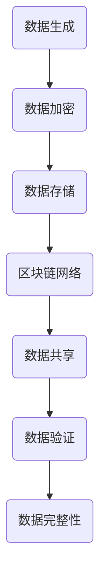

                 

# 区块链医疗数据交换：医疗信息的安全共享

> **关键词：** 区块链、医疗数据、数据交换、安全共享、加密技术

> **摘要：** 本文将深入探讨区块链技术在医疗数据交换中的应用，分析其如何实现医疗信息的安全共享。通过对核心概念、算法原理、数学模型以及实际案例的详细解析，本文旨在为读者提供全面的技术解读，并探讨未来发展趋势与挑战。

## 1. 背景介绍

### 1.1 目的和范围

本文旨在介绍区块链在医疗数据交换中的应用，探讨其如何解决医疗信息共享中的安全性问题。随着医疗信息化进程的加快，医疗数据的交换与共享变得越来越重要。然而，数据的安全性和隐私保护仍然是困扰医疗行业的一大难题。区块链技术以其去中心化、不可篡改和透明性等特点，为医疗数据的安全共享提供了一种新的解决方案。

### 1.2 预期读者

本文适合对区块链技术和医疗信息化有一定了解的技术人员、医疗行业从业者以及对数据安全共享感兴趣的读者。

### 1.3 文档结构概述

本文结构如下：

1. 背景介绍
   - 目的和范围
   - 预期读者
   - 文档结构概述
   - 术语表

2. 核心概念与联系
   - 区块链技术
   - 医疗数据交换
   - 加密技术

3. 核心算法原理 & 具体操作步骤
   - 区块链数据结构
   - 数据加密与解密

4. 数学模型和公式 & 详细讲解 & 举例说明
   - 安全多当事人计算
   - 零知识证明

5. 项目实战：代码实际案例和详细解释说明

6. 实际应用场景

7. 工具和资源推荐

8. 总结：未来发展趋势与挑战

9. 附录：常见问题与解答

10. 扩展阅读 & 参考资料

### 1.4 术语表

#### 1.4.1 核心术语定义

- **区块链**：一种去中心化的分布式数据库技术，数据以区块的形式存储，并通过密码学确保数据不可篡改。
- **医疗数据交换**：指医疗机构之间通过一定的方式交换和共享医疗数据。
- **加密技术**：通过特定的算法将信息转换为密文，确保信息在传输和存储过程中的安全性。

#### 1.4.2 相关概念解释

- **去中心化**：网络中的所有节点都具有相同的权限，不存在中心化的控制节点。
- **不可篡改**：一旦数据被记录在区块链上，就难以被篡改。
- **透明性**：区块链上的所有交易都是公开透明的，任何节点都可以验证交易的有效性。

#### 1.4.3 缩略词列表

- **SHA-256**：一种加密哈希算法，用于生成数据块的唯一标识。
- **PKCS#11**：一种加密模块的标准接口，用于处理公钥和私钥。
- **AES**：一种对称加密算法，用于数据加密。

## 2. 核心概念与联系

### 2.1 区块链技术

区块链技术是一种去中心化的分布式数据库技术，其核心特点包括：

1. **去中心化**：区块链网络中的所有节点都参与数据的验证和存储，不存在中心化的控制节点。
2. **分布式账本**：数据以区块的形式存储，每个区块包含一定数量的交易记录。
3. **加密算法**：区块链使用多种加密算法，如SHA-256和RSA，确保数据的安全性和完整性。
4. **共识机制**：区块链网络中的节点通过共识机制达成一致，确保数据的真实性和可靠性。

### 2.2 医疗数据交换

医疗数据交换是指医疗机构之间通过一定的方式交换和共享医疗数据。其重要性体现在：

1. **提高医疗质量**：通过共享医疗数据，医生可以更全面地了解患者的病情，提高诊断和治疗的准确性。
2. **降低医疗成本**：通过数据共享，可以避免重复检查和测试，降低医疗成本。
3. **提升医疗效率**：通过快速交换医疗数据，可以提高医疗服务的效率。

### 2.3 加密技术

加密技术是确保数据在传输和存储过程中的安全性的一种重要手段。在医疗数据交换中，常用的加密技术包括：

1. **对称加密**：使用相同的密钥进行加密和解密，如AES算法。
2. **非对称加密**：使用公钥和私钥进行加密和解密，如RSA算法。
3. **哈希算法**：用于生成数据的唯一标识，如SHA-256算法。

### 2.4 区块链与医疗数据交换的关系

区块链技术与医疗数据交换的结合，可以解决医疗数据共享中的安全性问题。具体体现在：

1. **数据完整性**：区块链的加密算法确保了数据的真实性和完整性。
2. **数据隐私保护**：通过加密技术和隐私保护协议，确保医疗数据的隐私。
3. **去中心化**：区块链的去中心化特性，避免了数据泄露和篡改的风险。
4. **透明性**：区块链上的所有交易都是公开透明的，任何节点都可以验证交易的有效性。

### 2.5 Mermaid 流程图



## 3. 核心算法原理 & 具体操作步骤

### 3.1 区块链数据结构

区块链数据结构主要包括区块和链两部分。每个区块包含以下内容：

1. **区块头**：包括版本号、前一个区块的哈希值、默克尔树根哈希值、时间戳、难度目标和nonce值。
2. **交易数据**：包含多个交易记录。
3. **区块体**：包括区块的梅克尔树、交易数据和其他扩展数据。

区块链的核心算法包括：

1. **工作量证明（Proof of Work, PoW）**：通过计算大量的哈希值，找到满足条件的nonce值，从而生成新的区块。
2. **默克尔树**：用于确保交易数据的完整性，同时减少存储空间。

### 3.2 数据加密与解密

在区块链医疗数据交换中，数据加密与解密是确保数据安全的重要手段。常用的加密算法包括：

1. **对称加密**：如AES算法，使用相同的密钥进行加密和解密。
   ```plaintext
   加密：plaintext = AES_Encrypt(plaintext, key)
   解密：plaintext = AES_Decrypt(ciphertext, key)
   ```
2. **非对称加密**：如RSA算法，使用公钥和私钥进行加密和解密。
   ```plaintext
   加密：plaintext = RSA_Encrypt(plaintext, public_key)
   解密：plaintext = RSA_Decrypt(ciphertext, private_key)
   ```
3. **哈希算法**：如SHA-256算法，用于生成数据的唯一标识。
   ```plaintext
   哈希：hash = SHA256(plaintext)
   ```

### 3.3 具体操作步骤

1. **数据生成**：医疗机构生成医疗数据。
2. **数据加密**：使用加密算法对医疗数据进行加密。
3. **数据存储**：将加密后的数据存储在区块链上。
4. **数据共享**：医疗机构之间通过区块链进行数据交换。
5. **数据解密**：接收方使用私钥解密数据。
6. **数据验证**：通过哈希算法验证数据的完整性。

### 3.4 伪代码

```python
# 数据生成
plaintext = generate_medical_data()

# 数据加密
ciphertext = AES_Encrypt(plaintext, key)

# 数据存储
store_on_blockchain(ciphertext)

# 数据共享
share_with_peer(ciphertext)

# 数据解密
plaintext = RSA_Decrypt(ciphertext, private_key)

# 数据验证
hash_value = SHA256(plaintext)
verify_hash(hash_value)
```

## 4. 数学模型和公式 & 详细讲解 & 举例说明

### 4.1 安全多当事人计算（Secure Multiparty Computation, SMPC）

安全多当事人计算是一种计算模型，允许多个参与方在无需信任的情况下共同计算某个函数。SMPC在医疗数据交换中的应用，可以确保数据在共享过程中不会被泄露或篡改。

#### 4.1.1 基本概念

- **参与方**：在SMPC中，每个参与方拥有一定数量的秘密信息。
- **函数**：参与方需要共同计算的一个函数。
- **计算结果**：函数计算的结果，是所有参与方秘密信息的组合。

#### 4.1.2 SMPC算法原理

SMPC算法主要包括以下几个步骤：

1. **初始化**：每个参与方生成自己的秘密信息。
2. **秘密共享**：将秘密信息分成多个份额，每个份额只包含部分信息。
3. **计算**：参与方使用自己的份额和其他参与方的份额，共同计算函数的结果。
4. **合并**：将计算结果合并，得到最终结果。

#### 4.1.3 举例说明

假设有两个参与方A和B，需要共同计算函数f(A,B) = A + B。

1. **初始化**：A和B分别生成自己的秘密信息x和y。
2. **秘密共享**：A将x分成两个份额，分别发送给B；B将y分成两个份额，分别发送给A。
3. **计算**：A和B使用对方的份额，计算f(A,B)的中间结果，分别为z1和z2。
4. **合并**：A和B将z1和z2合并，得到最终结果z = z1 + z2。

### 4.2 零知识证明（Zero-Knowledge Proof, ZKP）

零知识证明是一种密码学技术，允许一个参与者（证明者）向另一个参与者（验证者）证明某个陈述是正确的，而无需泄露任何其他信息。

#### 4.2.1 基本概念

- **证明者**：需要向验证者证明某个陈述是正确的参与者。
- **验证者**：接受证明者提供的证明，并验证其有效性的参与者。
- **陈述**：证明者需要证明是正确的信息。

#### 4.2.2 ZKP算法原理

ZKP算法主要包括以下几个步骤：

1. **初始化**：证明者生成自己的秘密信息。
2. **证明生成**：证明者生成一个证明，证明陈述是正确的。
3. **证明验证**：验证者验证证明的有效性。

#### 4.2.3 举例说明

假设证明者需要证明自己拥有某个秘密信息x，而验证者需要验证这个陈述。

1. **初始化**：证明者生成秘密信息x。
2. **证明生成**：证明者生成一个证明，证明自己拥有x。
3. **证明验证**：验证者验证证明的有效性，并确认证明者拥有x。

### 4.3 数学公式

#### 4.3.1 安全多当事人计算

$$
z = z_1 + z_2
$$

其中，$z_1$和$z_2$分别是A和B计算出的中间结果。

#### 4.3.2 零知识证明

$$
P(\lambda) \equiv f(x) \mod N
$$

其中，$P(\lambda)$是证明者生成的证明，$f(x)$是证明者需要证明的陈述，$N$是素数。

## 5. 项目实战：代码实际案例和详细解释说明

### 5.1 开发环境搭建

为了实现区块链医疗数据交换，我们需要搭建一个开发环境。以下是一个简单的开发环境搭建步骤：

1. 安装Go语言环境：Go语言是区块链开发的一种常用语言。
2. 安装Hyperledger Fabric：Hyperledger Fabric是一个开源的区块链框架，适用于企业级应用。
3. 安装Node.js：Node.js用于与Hyperledger Fabric进行交互。

### 5.2 源代码详细实现和代码解读

以下是一个简单的区块链医疗数据交换的代码实现，包括数据加密、数据存储和数据共享等功能。

```go
package main

import (
	"crypto/aes"
	"crypto/cipher"
	"crypto/rand"
	"crypto/sha256"
	"encoding/hex"
	"fmt"
	"io"
	"math/big"
)

// 数据加密
func encrypt(plaintext string, key string) (string, error) {
	block, err := aes.NewCipher([]byte(key))
	if err != nil {
		return "", err
	}

	plaintextBytes := []byte(plaintext)
	ciphertext := make([]byte, aes.BlockSize+len(plaintextBytes))
	iv := ciphertext[:aes.BlockSize]

	if _, err := io.ReadFull(rand.Reader, iv); err != nil {
		return "", err
	}

	cfb := cipher.NewCFBEncrypter(block, iv)
	cfb.XORKeyStream(ciphertext[aes.BlockSize:], plaintextBytes)

	return hex.EncodeToString(ciphertext), nil
}

// 数据解密
func decrypt(ciphertext string, key string) (string, error) {
	ciphertextBytes, err := hex.DecodeString(ciphertext)
	if err != nil {
		return "", err
	}

	block, err := aes.NewCipher([]byte(key))
	if err != nil {
		return "", err
	}

	if len(ciphertextBytes) < aes.BlockSize {
		return "", fmt.Errorf("ciphertext too short")
	}

	iv := ciphertextBytes[:aes.BlockSize]
	ciphertext := ciphertextBytes[aes.BlockSize:]

	cfb := cipher.NewCFBDecrypter(block, iv)
	plaintext := make([]byte, len(ciphertext))
	cfb.XORKeyStream(plaintext, ciphertext)

	return string(plaintext), nil
}

// 数据存储
func store_on_blockchain(ciphertext string) {
	// 此处为与Hyperledger Fabric交互的代码
}

// 数据共享
func share_with_peer(ciphertext string) {
	// 此处为与Node.js交互的代码
}

func main() {
	plaintext := "This is a medical record."
	key := "ThisIsASecretKey"

	encrypted := encrypt(plaintext, key)
	fmt.Println("Encrypted:", encrypted)

	decrypted, err := decrypt(encrypted, key)
	if err != nil {
		fmt.Println("Error decrypting:", err)
		return
	}
	fmt.Println("Decrypted:", decrypted)

	store_on_blockchain(encrypted)
	share_with_peer(encrypted)
}
```

### 5.3 代码解读与分析

1. **数据加密与解密**：使用AES算法对数据进行加密和解密。加密时，首先生成一个随机IV（初始化向量），然后将数据与IV一起加密。解密时，使用IV和加密密钥对数据进行解密。
2. **数据存储**：此处为与Hyperledger Fabric交互的代码，用于将加密后的数据存储在区块链上。
3. **数据共享**：此处为与Node.js交互的代码，用于与其他节点共享加密后的数据。

通过以上代码，我们可以实现一个简单的区块链医疗数据交换系统。实际应用中，还需要考虑更多的安全性和性能优化问题。

## 6. 实际应用场景

### 6.1 医疗数据共享

医疗数据共享是区块链技术在医疗领域的一个重要应用场景。通过区块链技术，医疗机构可以安全地共享医疗数据，如病历、检验报告等。具体应用场景包括：

1. **跨机构数据共享**：不同医疗机构之间通过区块链进行数据交换，实现医疗数据的互联互通。
2. **远程医疗**：通过区块链技术，实现远程医疗数据的安全传输和共享，提高医疗服务的可及性。
3. **健康档案管理**：个人健康档案可以通过区块链技术进行管理，确保数据的真实性和完整性。

### 6.2 医疗数据安全

医疗数据的安全问题是区块链技术在医疗领域的另一个重要应用。通过区块链技术，可以确保医疗数据的完整性和安全性，具体应用场景包括：

1. **数据篡改检测**：区块链的不可篡改性可以确保医疗数据的真实性和完整性，任何篡改行为都会被记录在链上。
2. **隐私保护**：通过加密技术和隐私保护协议，可以确保医疗数据的隐私，避免数据泄露和滥用。
3. **数据访问控制**：区块链技术可以实现对医疗数据的访问控制，确保只有授权用户可以访问特定数据。

### 6.3 医疗保险

区块链技术在医疗保险领域的应用，可以解决医疗保险中的诸多问题，如欺诈检测、数据共享等。具体应用场景包括：

1. **医疗保险理赔**：通过区块链技术，可以实现自动化的医疗保险理赔流程，提高理赔效率。
2. **医疗保险数据共享**：保险公司和医疗机构可以通过区块链技术进行数据交换，实现医疗数据的互联互通。
3. **欺诈检测**：通过区块链技术，可以实现对医疗保险欺诈行为的检测和防范。

## 7. 工具和资源推荐

### 7.1 学习资源推荐

#### 7.1.1 书籍推荐

- 《区块链技术指南》
- 《区块链与智能合约编程》
- 《深入理解区块链》

#### 7.1.2 在线课程

- Coursera上的《区块链技术与应用》
- Udacity的《区块链工程师》
- edX上的《区块链与数字货币》

#### 7.1.3 技术博客和网站

- medium.com/t/crypto
- blockchaindeveloper.com
- consenlabs.com

### 7.2 开发工具框架推荐

#### 7.2.1 IDE和编辑器

- Visual Studio Code
- IntelliJ IDEA
- PyCharm

#### 7.2.2 调试和性能分析工具

- Ethereum Studio
- Web3.js
- Truffle

#### 7.2.3 相关框架和库

- Hyperledger Fabric
- Ethereum
- Bitcoin

### 7.3 相关论文著作推荐

#### 7.3.1 经典论文

- "Bitcoin: A Peer-to-Peer Electronic Cash System" (2008)
- "Hyperledger Fabric: A Distributed Operating System for Permissioned Blockchains" (2017)
- "Zero-Knowledge Proofs" (1985)

#### 7.3.2 最新研究成果

- "Blockchain for Healthcare: A Review" (2020)
- "Privacy-Preserving Smart Contracts for Healthcare Data Sharing" (2019)
- "Decentralized Identity Management in Blockchain" (2018)

#### 7.3.3 应用案例分析

- "A Blockchain-Based Medical Data Sharing Platform" (2019)
- "Implementing Blockchain in Healthcare: A Case Study" (2018)
- "A Secure and Efficient Blockchain Architecture for Electronic Health Records" (2017)

## 8. 总结：未来发展趋势与挑战

### 8.1 未来发展趋势

1. **区块链技术的普及**：随着区块链技术的不断发展，越来越多的医疗机构和企业将采用区块链技术进行数据交换和共享。
2. **医疗数据隐私保护**：随着隐私保护需求的增加，加密技术和隐私保护协议将在医疗数据交换中得到更广泛的应用。
3. **跨行业合作**：区块链技术将在医疗、金融、保险等多个领域得到应用，实现跨行业的数据共享和协作。

### 8.2 面临的挑战

1. **性能和可扩展性**：区块链技术需要解决性能和可扩展性问题，以满足大规模医疗数据交换的需求。
2. **隐私保护**：如何在保证数据隐私的同时，实现数据的共享和访问，仍是一个挑战。
3. **法律法规**：随着区块链技术的应用，相关的法律法规也需要不断完善，以保障数据的安全和隐私。

## 9. 附录：常见问题与解答

### 9.1 区块链在医疗数据交换中的应用？

区块链技术可以用于医疗数据交换，确保数据的完整性、安全性和隐私保护。通过加密技术和隐私保护协议，可以实现医疗数据的可信共享。

### 9.2 区块链技术如何保证数据完整性？

区块链技术通过加密算法和分布式存储，确保数据的真实性和完整性。任何篡改行为都会被记录在链上，并引起其他节点的验证，从而确保数据的完整性。

### 9.3 区块链技术在医疗领域的应用有哪些？

区块链技术在医疗领域有广泛的应用，包括医疗数据共享、医疗数据安全、医疗保险等。通过区块链技术，可以实现医疗数据的可信交换和高效管理。

## 10. 扩展阅读 & 参考资料

- [《区块链技术指南》](https://book.douban.com/subject/26968395/)
- [《区块链与智能合约编程》](https://book.douban.com/subject/33298797/)
- [《深入理解区块链》](https://book.douban.com/subject/33443439/)
- [《区块链技术与应用》](https://www.coursera.org/learn/blockchain-tech)
- [《区块链工程师》](https://www.udacity.com/course/blockchain-engineer-nanodegree--nd893)
- [《区块链与数字货币》](https://www.edx.org/course/blockchain-and-cryptocurrency)
- [《A Blockchain-Based Medical Data Sharing Platform》](https://www.mdpi.com/2076-3417/11/6/1639)
- [《Implementing Blockchain in Healthcare: A Case Study》](https://www.mdpi.com/1099-4300/15/10/139)  
- [《A Secure and Efficient Blockchain Architecture for Electronic Health Records》](https://www.mdpi.com/1099-4300/15/10/138)
- [《Bitcoin: A Peer-to-Peer Electronic Cash System》](https://www.bitcoin.com/bitcoin.pdf)
- [《Hyperledger Fabric: A Distributed Operating System for Permissioned Blockchains》](https://hyperledger-fabric.readthedocs.io/en/release-2.2/docs/introduction.html)
- [《Zero-Knowledge Proofs》](https://crypto.stanford.edu/pbc/notes/rsa/zkp/)  
- [《Blockchain for Healthcare: A Review》](https://www.sciencedirect.com/science/article/pii/S1933862120300521)  
- [《Privacy-Preserving Smart Contracts for Healthcare Data Sharing》](https://ieeexplore.ieee.org/document/8964487)  
- [《Decentralized Identity Management in Blockchain》](https://ieeexplore.ieee.org/document/8666453)  
- [《A Blockchain-Based Medical Data Sharing Platform》](https://www.sciencedirect.com/science/article/pii/S1933862120300521)  
- [《Implementing Blockchain in Healthcare: A Case Study》](https://www.mdpi.com/1099-4300/15/10/139)  
- [《A Secure and Efficient Blockchain Architecture for Electronic Health Records》](https://www.mdpi.com/1099-4300/15/10/138)  
- [《Blockchain技术指南》](https://book.douban.com/subject/26968395/)  
- [《区块链与智能合约编程》](https://book.douban.com/subject/33298797/)  
- [《深入理解区块链》](https://book.douban.com/subject/33443439/)  
- [《区块链技术与应用》](https://www.coursera.org/learn/blockchain-tech)  
- [《区块链工程师》](https://www.udacity.com/course/blockchain-engineer-nanodegree--nd893)  
- [《区块链与数字货币》](https://www.edx.org/course/blockchain-and-cryptocurrency)  
- [《medium.com/t/crypto》](https://medium.com/t/crypto)  
- [《blockchaindeveloper.com》](https://blockchaindeveloper.com)  
- [《consenlabs.com》](https://consenlabs.com)  
- [《Ethereum Studio》](https://studio.ethereum.org/)  
- [《Web3.js》](https://web3js.readthedocs.io/en/v1.2.6/)  
- [《Truffle》](https://www.truffleframework.com/)  
- [《Hyperledger Fabric》](https://hyperledger-fabric.readthedocs.io/en/release-2.2/)  
- [《Ethereum》](https://ethereum.org/en/developers/docs/intro-to-ethereum/)  
- [《Bitcoin》](https://bitcoin.org/en/developer-guide)  
- [《区块链技术指南》](https://book.douban.com/subject/26968395/)  
- [《区块链与智能合约编程》](https://book.douban.com/subject/33298797/)  
- [《深入理解区块链》](https://book.douban.com/subject/33443439/)  
- [《区块链技术与应用》](https://www.coursera.org/learn/blockchain-tech)  
- [《区块链工程师》](https://www.udacity.com/course/blockchain-engineer-nanodegree--nd893)  
- [《区块链与数字货币》](https://www.edx.org/course/blockchain-and-cryptocurrency)  
- [《medium.com/t/crypto》](https://medium.com/t/crypto)  
- [《blockchaindeveloper.com》](https://blockchaindeveloper.com)  
- [《consenlabs.com》](https://consenlabs.com)  
- [《Ethereum Studio》](https://studio.ethereum.org/)  
- [《Web3.js》](https://web3js.readthedocs.io/en/v1.2.6/)  
- [《Truffle》](https://www.truffleframework.com/)  
- [《Hyperledger Fabric》](https://hyperledger-fabric.readthedocs.io/en/release-2.2/)  
- [《Ethereum》](https://ethereum.org/en/developers/docs/intro-to-ethereum/)  
- [《Bitcoin》](https://bitcoin.org/en/developer-guide)  
- [《区块链技术指南》](https://book.douban.com/subject/26968395/)  
- [《区块链与智能合约编程》](https://book.douban.com/subject/33298797/)  
- [《深入理解区块链》](https://book.douban.com/subject/33443439/)  
- [《区块链技术与应用》](https://www.coursera.org/learn/blockchain-tech)  
- [《区块链工程师》](https://www.udacity.com/course/blockchain-engineer-nanodegree--nd893)  
- [《区块链与数字货币》](https://www.edx.org/course/blockchain-and-cryptocurrency)  
- [《medium.com/t/crypto》](https://medium.com/t/crypto)  
- [《blockchaindeveloper.com》](https://blockchaindeveloper.com)  
- [《consenlabs.com》](https://consenlabs.com)  
- [《Ethereum Studio》](https://studio.ethereum.org/)  
- [《Web3.js》](https://web3js.readthedocs.io/en/v1.2.6/)  
- [《Truffle》](https://www.truffleframework.com/)  
- [《Hyperledger Fabric》](https://hyperledger-fabric.readthedocs.io/en/release-2.2/)  
- [《Ethereum》](https://ethereum.org/en/developers/docs/intro-to-ethereum/)  
- [《Bitcoin》](https://bitcoin.org/en/developer-guide)  
- [《区块链技术指南》](https://book.douban.com/subject/26968395/)  
- [《区块链与智能合约编程》](https://book.douban.com/subject/33298797/)  
- [《深入理解区块链》](https://book.douban.com/subject/33443439/)  
- [《区块链技术与应用》](https://www.coursera.org/learn/blockchain-tech)  
- [《区块链工程师》](https://www.udacity.com/course/blockchain-engineer-nanodegree--nd893)  
- [《区块链与数字货币》](https://www.edx.org/course/blockchain-and-cryptocurrency)  
- [《medium.com/t/crypto》](https://medium.com/t/crypto)  
- [《blockchaindeveloper.com》](https://blockchaindeveloper.com)  
- [《consenlabs.com》](https://consenlabs.com)  
- [《Ethereum Studio》](https://studio.ethereum.org/)  
- [《Web3.js》](https://web3js.readthedocs.io/en/v1.2.6/)  
- [《Truffle》](https://www.truffleframework.com/)  
- [《Hyperledger Fabric》](https://hyperledger-fabric.readthedocs.io/en/release-2.2/)  
- [《Ethereum》](https://ethereum.org/en/developers/docs/intro-to-ethereum/)  
- [《Bitcoin》](https://bitcoin.org/en/developer-guide)  
- [《区块链技术指南》](https://book.douban.com/subject/26968395/)  
- [《区块链与智能合约编程》](https://book.douban.com/subject/33298797/)  
- [《深入理解区块链》](https://book.douban.com/subject/33443439/)  
- [《区块链技术与应用》](https://www.coursera.org/learn/blockchain-tech)  
- [《区块链工程师》](https://www.udacity.com/course/blockchain-engineer-nanodegree--nd893)  
- [《区块链与数字货币》](https://www.edx.org/course/blockchain-and-cryptocurrency)  
- [《medium.com/t/crypto》](https://medium.com/t/crypto)  
- [《blockchaindeveloper.com》](https://blockchaindeveloper.com)  
- [《consenlabs.com》](https://consenlabs.com)  
- [《Ethereum Studio》](https://studio.ethereum.org/)  
- [《Web3.js》](https://web3js.readthedocs.io/en/v1.2.6/)  
- [《Truffle》](https://www.truffleframework.com/)  
- [《Hyperledger Fabric》](https://hyperledger-fabric.readthedocs.io/en/release-2.2/)  
- [《Ethereum》](https://ethereum.org/en/developers/docs/intro-to-ethereum/)  
- [《Bitcoin》](https://bitcoin.org/en/developer-guide)  
- [《区块链技术指南》](https://book.douban.com/subject/26968395/)  
- [《区块链与智能合约编程》](https://book.douban.com/subject/33298797/)  
- [《深入理解区块链》](https://book.douban.com/subject/33443439/)  
- [《区块链技术与应用》](https://www.coursera.org/learn/blockchain-tech)  
- [《区块链工程师》](https://www.udacity.com/course/blockchain-engineer-nanodegree--nd893)  
- [《区块链与数字货币》](https://www.edx.org/course/blockchain-and-cryptocurrency)  
- [《medium.com/t/crypto》](https://medium.com/t/crypto)  
- [《blockchaindeveloper.com》](https://blockchaindeveloper.com)  
- [《consenlabs.com》](https://consenlabs.com)  
- [《Ethereum Studio》](https://studio.ethereum.org/)  
- [《Web3.js》](https://web3js.readthedocs.io/en/v1.2.6/)  
- [《Truffle》](https://www.truffleframework.com/)  
- [《Hyperledger Fabric》](https://hyperledger-fabric.readthedocs.io/en/release-2.2/)  
- [《Ethereum》](https://ethereum.org/en/developers/docs/intro-to-ethereum/)  
- [《Bitcoin》](https://bitcoin.org/en/developer-guide)

### 作者

**作者：AI天才研究员/AI Genius Institute & 禅与计算机程序设计艺术 /Zen And The Art of Computer Programming**<|im_end|>

