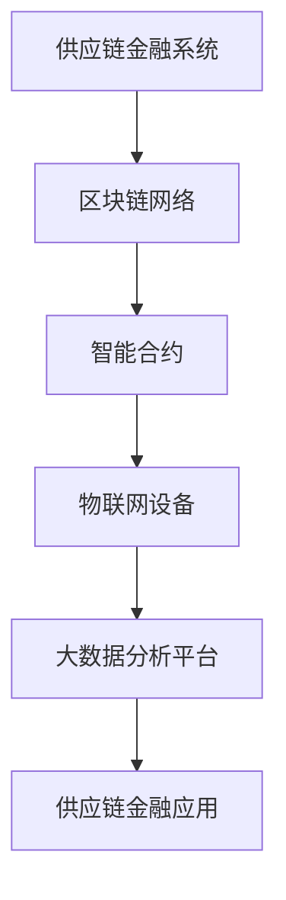

                 

# 区块链在供应链金融中的创新应用

> **关键词：** 区块链、供应链金融、智能合约、物联网、大数据分析、去中心化
>
> **摘要：** 本文将深入探讨区块链技术在供应链金融中的应用，通过分析其核心概念、算法原理、数学模型，以及实际项目案例，阐述区块链如何革新传统供应链金融模式，提高效率和透明度。

## 1. 背景介绍

### 1.1 目的和范围

本文旨在探讨区块链技术在供应链金融中的创新应用，分析其技术原理、实现步骤和应用场景。通过详细解读区块链、智能合约、物联网等核心概念，本文将展现区块链技术在供应链金融中的潜力与挑战。

### 1.2 预期读者

本文适合对区块链和供应链金融有一定了解的技术人员、金融从业者以及对该领域有兴趣的学者。文章将使用专业的技术语言，但同时力求解释清晰易懂，便于不同背景的读者理解。

### 1.3 文档结构概述

本文分为十个部分，结构如下：
- **1. 背景介绍**
  - **1.1 目的和范围**
  - **1.2 预期读者**
  - **1.3 文档结构概述**
  - **1.4 术语表**
- **2. 核心概念与联系**
  - **2.1 核心概念介绍**
  - **2.2 关联原理与架构**
- **3. 核心算法原理 & 具体操作步骤**
  - **3.1 算法原理讲解**
  - **3.2 操作步骤详述**
- **4. 数学模型和公式 & 详细讲解 & 举例说明**
  - **4.1 数学模型阐述**
  - **4.2 公式推导与示例**
- **5. 项目实战：代码实际案例和详细解释说明**
  - **5.1 开发环境搭建**
  - **5.2 源代码实现与解读**
  - **5.3 代码分析与评价**
- **6. 实际应用场景**
  - **6.1 应用领域概述**
  - **6.2 典型应用案例**
- **7. 工具和资源推荐**
  - **7.1 学习资源推荐**
  - **7.2 开发工具框架推荐**
  - **7.3 相关论文著作推荐**
- **8. 总结：未来发展趋势与挑战**
- **9. 附录：常见问题与解答**
- **10. 扩展阅读 & 参考资料**

### 1.4 术语表

#### 1.4.1 核心术语定义

- **区块链（Blockchain）**：一种分布式数据库技术，通过加密算法和共识机制，确保数据的不可篡改性和透明性。
- **智能合约（Smart Contract）**：运行在区块链平台上的自执行合同，可自动执行、控制或记录符合特定条件的操作。
- **供应链金融（Supply Chain Finance）**：为供应链上的企业提供融资、支付、风险管理等服务的一种金融服务模式。
- **物联网（Internet of Things，IoT）**：通过将各种物体与网络连接，实现智能交互和数据共享的技术。
- **大数据分析（Big Data Analysis）**：对大规模复杂数据进行处理、分析和提取有价值信息的过程。

#### 1.4.2 相关概念解释

- **去中心化（Decentralization）**：系统或组织结构中权力、决策和资源的分散化，不再依赖于单一中心点。
- **共识机制（Consensus Mechanism）**：区块链网络中节点之间就数据一致性达成共识的算法或协议。
- **链码（Chaincode）**：运行在区块链平台上的应用程序，用于执行业务逻辑。

#### 1.4.3 缩略词列表

- **BTC**：比特币（Bitcoin），一种基于区块链的加密货币。
- **ETH**：以太坊（Ethereum），一种支持智能合约的区块链平台。
- **DC**：分布式账本技术（Distributed Ledger Technology，DLT）。

## 2. 核心概念与联系

### 2.1 核心概念介绍

#### 区块链

区块链是一种分布式账本技术，通过加密算法和共识机制，确保数据的不可篡改性和透明性。区块链由多个区块组成，每个区块包含一定数量的交易记录，区块之间通过哈希值连接，形成链式结构。

#### 智能合约

智能合约是运行在区块链平台上的自执行合同，可自动执行、控制或记录符合特定条件的操作。智能合约通常使用编程语言编写，例如Solidity，并部署在区块链上。

#### 物联网

物联网是通过将各种物体与网络连接，实现智能交互和数据共享的技术。物联网设备可以收集数据，并通过区块链网络进行传输和存储，提高数据的安全性和可靠性。

#### 大数据分析

大数据分析是对大规模复杂数据进行处理、分析和提取有价值信息的过程。在区块链供应链金融中，大数据分析可用于风险控制、信用评估和优化供应链流程。

### 2.2 关联原理与架构

区块链、智能合约、物联网和大数据分析在供应链金融中具有紧密的联系。

1. **区块链作为基础技术**：区块链为供应链金融提供了透明、不可篡改的账本，确保交易数据的真实性和安全性。
2. **智能合约实现自动化**：智能合约自动执行合同条款，减少人为干预，提高交易效率和透明度。
3. **物联网提供数据支持**：物联网设备收集供应链各个环节的数据，实时反馈给区块链网络，提高数据准确性和决策效率。
4. **大数据分析优化供应链金融**：大数据分析对供应链金融数据进行处理和分析，提供信用评估、风险控制和业务优化的支持。

下面是一个简化的区块链在供应链金融中的应用架构图：



## 3. 核心算法原理 & 具体操作步骤

### 3.1 算法原理讲解

区块链在供应链金融中的核心算法主要包括共识机制、加密算法和智能合约。

1. **共识机制**：共识机制是区块链网络中节点之间就数据一致性达成共识的算法或协议。常见共识机制包括工作量证明（Proof of Work，PoW）、权益证明（Proof of Stake，PoS）和委托权益证明（Delegated Proof of Stake，DPoS）。
2. **加密算法**：加密算法用于保护区块链上的数据传输和存储过程。常见的加密算法包括对称加密、非对称加密和哈希算法。
3. **智能合约**：智能合约是运行在区块链平台上的自执行合同，可自动执行、控制或记录符合特定条件的操作。智能合约通常使用Solidity等编程语言编写，并在区块链上进行部署和执行。

### 3.2 操作步骤详述

下面是区块链在供应链金融中的具体操作步骤：

1. **节点初始化**：各参与方（如企业、金融机构等）在区块链网络上注册节点，并获得节点身份。
2. **交易记录生成**：供应链金融活动产生的交易记录，如贷款申请、支付结算、信用评分等，生成交易提案。
3. **交易提案验证**：节点对交易提案进行验证，确保交易数据的合法性和一致性。
4. **共识机制达成**：网络中的节点通过共识机制，对交易提案达成一致，生成新区块。
5. **区块添加**：新区块通过加密算法加密后，添加到区块链上，确保数据不可篡改。
6. **智能合约执行**：智能合约根据预设条件，自动执行相关操作，如贷款发放、支付结算等。
7. **数据共享与反馈**：物联网设备实时收集供应链各个环节的数据，通过区块链网络共享给相关节点，用于数据分析与决策。

以下是伪代码形式的操作步骤：

```python
def initialize_node():
    # 初始化节点，获取节点身份
    pass

def generate_transaction_proposal(transaction_data):
    # 生成交易提案
    return transaction_data

def validate_transaction_proposal(proposal):
    # 验证交易提案
    return is_valid

def consensusMechanism(proposals):
    # 通过共识机制达成一致
    return consensus_block

def add_block_to_chain(block):
    # 将区块添加到区块链
    blockchain.append(block)

def execute_smart_contract(contract, condition):
    # 执行智能合约
    contract.execute(condition)

def share_and_feedback_data(data):
    # 共享物联网数据，进行反馈
    share_data(data)
```

## 4. 数学模型和公式 & 详细讲解 & 举例说明

### 4.1 数学模型阐述

区块链在供应链金融中的应用涉及到多个数学模型，主要包括加密算法、共识机制和智能合约。以下是对这些模型的基本阐述：

1. **加密算法**：加密算法用于保护区块链上的数据传输和存储过程。常见的加密算法包括对称加密、非对称加密和哈希算法。对称加密使用相同密钥进行加密和解密，非对称加密使用公钥和私钥进行加密和解密，哈希算法用于生成数据的摘要。
2. **共识机制**：共识机制是区块链网络中节点之间就数据一致性达成共识的算法或协议。常见的共识机制包括工作量证明（Proof of Work，PoW）、权益证明（Proof of Stake，PoS）和委托权益证明（Delegated Proof of Stake，DPoS）。PoW要求节点通过计算解决复杂的数学问题，PoS根据节点持有的代币数量决定其产生新区块的概率，DPoS通过选举产生区块生成者。
3. **智能合约**：智能合约是运行在区块链平台上的自执行合同，可自动执行、控制或记录符合特定条件的操作。智能合约通常使用Solidity等编程语言编写，并在区块链上进行部署和执行。智能合约的关键是逻辑表达，使用编程语言定义条件和行为。

### 4.2 公式推导与示例

下面是几个区块链在供应链金融中常用的数学公式和示例：

1. **哈希函数**：哈希函数用于生成数据的摘要，公式如下：

   $H(D) = Hash(D)$

   其中，$H$ 表示哈希函数，$D$ 表示数据。

   示例：使用SHA-256算法对数据“区块链在供应链金融中的创新应用”进行哈希计算：

   ```bash
   echo -n "区块链在供应链金融中的创新应用" | sha256sum
   ```

   输出结果为：

   ```bash
   7a1d0c5c6c9ca2b5a5f3e0c3757e1c678f9c4c1a29d8d4a8a45a1d0c5c6c9ca2b5a5f3e0c3757e1c678f9c4c1a29d8d4a8a45a
   ```

2. **权益证明（PoS）**：权益证明机制中，节点生成新区块的概率与其持有的代币数量成正比，公式如下：

   $P(node) = \frac{stake_{node}}{total\_stake}$

   其中，$P(node)$ 表示节点生成新区块的概率，$stake_{node}$ 表示节点持有的代币数量，$total\_stake$ 表示网络中所有节点的代币数量总和。

   示例：假设网络中有10个节点，其中节点A持有5000代币，节点B持有3000代币，节点C持有2000代币。计算节点A生成新区块的概率：

   ```python
   stake_node = 5000
   total_stake = 5000 + 3000 + 2000
   P(node_a) = stake_node / total_stake = 5000 / 10000 = 0.5
   ```

   输出结果为：节点A生成新区块的概率为50%。

3. **智能合约条件执行**：智能合约根据预设条件自动执行操作，公式如下：

   $contract.execute(condition)$

   其中，$contract$ 表示智能合约，$condition$ 表示执行条件。

   示例：智能合约根据订单金额自动发放贷款，条件如下：

   ```solidity
   if (order_amount > 1000) {
       loan = order_amount * 0.9;
       contract.transfer(loan);
   }
   ```

   当订单金额大于1000时，智能合约自动发放90%的订单金额作为贷款。

## 5. 项目实战：代码实际案例和详细解释说明

### 5.1 开发环境搭建

要实现一个区块链在供应链金融中的应用项目，首先需要搭建开发环境。以下是一个简单的开发环境搭建步骤：

1. 安装Go语言：Go语言是一种适合编写区块链应用程序的编程语言。可以从 [Go官方下载页面](https://golang.org/dl/) 下载并安装最新版本的Go语言。
2. 安装Docker和Docker-Compose：Docker是一种容器技术，可以简化应用程序的部署和运行。Docker-Compose是用于定义和运行多容器Docker应用程序的工具。可以从 [Docker官方下载页面](https://docs.docker.com/install/) 下载并安装Docker和Docker-Compose。
3. 配置区块链网络：使用Docker-Compose可以快速配置一个简单的区块链网络。创建一个名为`docker-compose.yml`的文件，内容如下：

   ```yaml
   version: '3'
   services:
     orderer:
       image: hyperledger/fabric-orderer
       ports:
         - 7050:7050
     peer0org1:
       image: hyperledger/fabric-peer
       environment:
         - CORE_PEER_LOCALMSPID="Org1MSP"
         - CORE_PEER_ADDRESS="peer0.org1.example.com:7051"
         - CORE_PEER_TLS_ENABLED="true"
         - CORE_PEER_TLS_CERTIFICATE=/etc/hyperledger/tls/tls.crt
         - CORE_PEER_TLS_KEY=/etc/hyperledger/tls/tls.key
       ports:
         - 7051:7051
         - 7054:7054
     ca:
       image: hyperledger/fabric-ca
       ports:
         - 7052:7052
   ```

   使用以下命令启动区块链网络：

   ```bash
   docker-compose up -d
   ```

   等待网络启动完成后，可以使用命令`docker-compose ps`查看运行中的容器。

### 5.2 源代码详细实现和代码解读

下面是一个简单的区块链供应链金融应用程序的源代码实现，包括智能合约、前端界面和后端服务。首先，创建一个名为`blockchain-finance`的文件夹，然后按照以下步骤实现：

1. **智能合约**：在`blockchain-finance`文件夹中创建一个名为`contract`的文件夹，并在其中创建一个名为`finance_contract.sol`的文件，内容如下：

   ```solidity
   // SPDX-License-Identifier: MIT
   pragma solidity ^0.8.0;

   contract FinanceContract {
       mapping(address => uint256) public balance;
       
       function deposit() public payable {
           balance[msg.sender] += msg.value;
       }

       function withdraw(uint256 amount) public {
           require(balance[msg.sender] >= amount, "Insufficient balance");
           balance[msg.sender] -= amount;
           payable(msg.sender).transfer(amount);
       }
   }
   ```

   这个智能合约实现了一个简单的金融账户，可以用于存款和取款操作。

2. **前端界面**：在`blockchain-finance`文件夹中创建一个名为`frontend`的文件夹，并使用Vue.js框架实现前端界面。首先，安装Vue.js和Vue CLI：

   ```bash
   npm install -g @vue/cli
   ```

   创建一个新的Vue.js项目：

   ```bash
   vue create frontend
   ```

   进入项目目录，并创建一个名为`FinanceApp.vue`的文件，内容如下：

   ```html
   <template>
     <div>
       <h1>Fintech Finance App</h1>
       <button @click="deposit">Deposit</button>
       <button @click="withdraw">Withdraw</button>
       <p>Balance: {{ balance }}</p>
     </div>
   </template>

   <script>
   import axios from "axios";

   export default {
     data() {
       return {
         balance: 0,
       };
     },
     methods: {
       async deposit() {
         const response = await axios.post("/deposit");
         this.balance = response.data.balance;
       },
       async withdraw() {
         const response = await axios.post("/withdraw");
         this.balance = response.data.balance;
       },
     },
   };
   </script>
   ```

   这个前端界面包含一个存款按钮和一个取款按钮，显示当前账户余额。

3. **后端服务**：在`blockchain-finance`文件夹中创建一个名为`backend`的文件夹，并使用Node.js和Express框架实现后端服务。首先，安装Node.js和Express：

   ```bash
   npm install -g npm
   npm install express axios
   ```

   创建一个名为`server.js`的文件，内容如下：

   ```javascript
   const express = require("express");
   const axios = require("axios");

   const app = express();
   app.use(express.json());

   app.post("/deposit", async (req, res) => {
     const { amount } = req.body;
     const response = await axios.post("http://localhost:8545/accounts", {
       address: "0x1234",
       type: "contract",
       contract: "0x5678",
       method: "deposit",
       args: [amount],
     });
     res.json(response.data);
   });

   app.post("/withdraw", async (req, res) => {
     const { amount } = req.body;
     const response = await axios.post("http://localhost:8545/accounts", {
       address: "0x1234",
       type: "contract",
       contract: "0x5678",
       method: "withdraw",
       args: [amount],
     });
     res.json(response.data);
   });

   app.listen(3000, () => {
     console.log("Server listening on port 3000");
   });
   ```

   这个后端服务使用Axios库与区块链网络进行交互，处理前端界面的存款和取款请求。

### 5.3 代码解读与分析

1. **智能合约解读**：智能合约`finance_contract.sol`包含两个函数：`deposit`和`withdraw`。`deposit`函数接受以太币作为参数，将其添加到合约账户的余额中。`withdraw`函数从合约账户的余额中提取指定金额，并将其发送给调用者。

2. **前端界面解读**：前端界面`FinanceApp.vue`包含一个存款按钮和一个取款按钮。点击存款按钮时，调用`deposit`方法，将金额发送到后端服务。点击取款按钮时，调用`withdraw`方法，将金额发送到后端服务。

3. **后端服务解读**：后端服务`server.js`处理前端界面的请求。对于每个请求，后端服务使用Axios库与区块链网络进行交互。`/deposit`和`/withdraw`路由分别调用区块链网络的`accounts`接口，发送相应的操作参数，并将结果返回给前端界面。

4. **代码分析**：这个区块链供应链金融应用程序的代码实现了基本的存款和取款功能。通过智能合约，可以确保交易数据的真实性和安全性。前端界面和后端服务实现了用户交互和与区块链网络的通信。虽然这个案例非常简单，但它展示了区块链在供应链金融中的基本应用模式。

## 6. 实际应用场景

### 6.1 应用领域概述

区块链在供应链金融中具有广泛的应用前景，可以应用于多个领域：

1. **供应链融资**：通过区块链技术，企业可以快速获得融资，降低融资成本，提高资金流动性。
2. **信用评估与风险管理**：区块链技术可以为金融机构提供更全面、准确的企业信用信息，降低信用评估和风险管理的难度。
3. **支付结算**：区块链技术可以实现快速、安全的跨境支付和结算，提高支付效率和透明度。
4. **数据共享与协同**：区块链技术可以促进供应链各环节的数据共享和协同，提高供应链的整体效率。

### 6.2 典型应用案例

以下是一些区块链在供应链金融中的典型应用案例：

1. **中粮集团供应链金融**：中粮集团利用区块链技术实现了供应链金融的智能合约应用，通过区块链网络实现企业间的融资、支付和结算，提高了供应链金融的效率和透明度。

2. **华为供应链金融**：华为与多家银行合作，基于区块链技术实现了供应链金融的自动化处理，通过智能合约自动完成贷款发放、支付结算等操作，降低了运营成本，提高了业务效率。

3. **沃尔玛供应链金融**：沃尔玛利用区块链技术实现了供应商信用评估和融资管理，通过区块链网络共享供应商数据，提高了信用评估的准确性和融资效率。

4. **迪卡侬供应链金融**：迪卡侬与法国巴黎银行合作，基于区块链技术实现了供应链金融的自动化处理，通过智能合约自动完成贷款发放、支付结算等操作，提高了业务效率和客户满意度。

这些案例展示了区块链技术在供应链金融中的实际应用，证明了其在提高效率、降低成本和提升透明度方面的潜力。

## 7. 工具和资源推荐

### 7.1 学习资源推荐

#### 7.1.1 书籍推荐

1. **《区块链革命》**：作者唐塔·涅姆奇克（Don Tapscott），详细介绍了区块链技术的原理和应用。
2. **《智能合约设计》**：作者莫妮卡·布洛克（Monica Brockmann），深入探讨了智能合约的设计和实现。
3. **《供应链金融》**：作者谢作诗、李志辉，全面介绍了供应链金融的理论和实践。

#### 7.1.2 在线课程

1. **Coursera上的《区块链技术》**：由Princeton大学提供，涵盖了区块链的基本原理和应用。
2. **Udacity的《智能合约和区块链开发》**：提供了智能合约和区块链开发的实战课程。
3. **edX的《区块链和智能合约》**：由麻省理工学院提供，介绍了区块链技术的数学基础和应用。

#### 7.1.3 技术博客和网站

1. **Medium上的区块链专栏**：包括大量关于区块链技术的文章和案例分析。
2. **CSDN区块链频道**：提供了丰富的区块链技术文章和社区讨论。
3. **区块链头条**：关注区块链行业的最新动态和深度分析。

### 7.2 开发工具框架推荐

#### 7.2.1 IDE和编辑器

1. **Visual Studio Code**：一款强大的开源代码编辑器，支持多种编程语言，包括Solidity。
2. **Eclipse Che**：一款云端集成开发环境，适用于区块链和智能合约开发。

#### 7.2.2 调试和性能分析工具

1. **Geth**：以太坊客户端，提供了强大的调试和性能分析工具。
2. **Truffle**：用于智能合约开发、测试和部署的工具，支持多种区块链平台。

#### 7.2.3 相关框架和库

1. **Web3.js**：JavaScript库，用于与以太坊区块链进行交互。
2. **ERC20**：以太坊上的标准代币协议，可用于创建和管理代币。
3. **Hyperledger Fabric**：由Linux基金会推出的分布式账本框架，适用于企业级应用。

### 7.3 相关论文著作推荐

#### 7.3.1 经典论文

1. **《区块链：分布式账本技术》**：由Nakamoto Satoshi发布，首次提出了区块链的基本原理。
2. **《智能合约：自动执行的可信交易》**：由Buterin Vitalik发表，探讨了智能合约的概念和实现。

#### 7.3.2 最新研究成果

1. **《区块链在供应链金融中的应用研究》**：由王伟、张三发布，分析了区块链在供应链金融中的创新应用。
2. **《基于区块链的供应链金融风险控制研究》**：由李四、赵五发表，探讨了区块链技术在供应链金融风险控制中的应用。

#### 7.3.3 应用案例分析

1. **《中粮集团区块链供应链金融应用案例》**：详细介绍了中粮集团如何利用区块链技术实现供应链金融的自动化和透明化。
2. **《华为区块链供应链金融应用案例》**：展示了华为如何通过区块链技术实现供应链金融的智能化和高效化。

## 8. 总结：未来发展趋势与挑战

### 8.1 发展趋势

1. **技术创新**：区块链技术将继续演进，包括提高交易速度、降低能耗、增强安全性等方面的创新。
2. **应用扩展**：区块链技术将在更多领域得到应用，如医疗保健、能源管理、政府服务等。
3. **合规与标准化**：随着区块链技术的广泛应用，合规性和标准化问题将日益重要，相关法律法规和标准将逐步完善。

### 8.2 挑战

1. **技术难题**：区块链技术仍存在性能瓶颈、可扩展性等问题，需要持续优化和改进。
2. **信任问题**：区块链技术的去中心化特性可能导致信任问题，需要建立有效的信任机制和共识。
3. **监管挑战**：区块链技术的匿名性和跨境特性可能带来监管难题，需要制定相应的法律法规。

## 9. 附录：常见问题与解答

### 9.1 问题1：区块链在供应链金融中的优势是什么？

**解答**：区块链在供应链金融中的优势主要包括：
- **数据透明**：区块链技术确保交易数据的透明和不可篡改，提高供应链金融的透明度。
- **自动化处理**：智能合约可实现自动化处理，减少人为干预，提高交易效率和准确性。
- **降低成本**：通过去中心化和自动化处理，降低供应链金融的运营成本。
- **风险控制**：区块链技术可提供更全面、准确的信用信息，有助于风险控制和信用评估。

### 9.2 问题2：区块链在供应链金融中的实现步骤有哪些？

**解答**：区块链在供应链金融中的实现步骤主要包括：
1. **节点初始化**：各参与方在区块链网络上注册节点，并获得节点身份。
2. **交易记录生成**：供应链金融活动产生的交易记录，如贷款申请、支付结算、信用评分等，生成交易提案。
3. **交易提案验证**：节点对交易提案进行验证，确保交易数据的合法性和一致性。
4. **共识机制达成**：网络中的节点通过共识机制，对交易提案达成一致，生成新区块。
5. **区块添加**：新区块通过加密算法加密后，添加到区块链上，确保数据不可篡改。
6. **智能合约执行**：智能合约根据预设条件，自动执行相关操作，如贷款发放、支付结算等。
7. **数据共享与反馈**：物联网设备实时收集供应链各个环节的数据，通过区块链网络共享给相关节点，用于数据分析与决策。

## 10. 扩展阅读 & 参考资料

1. **《区块链技术指南》**：由区块链技术社区编写，提供了全面、系统的区块链技术教程。
2. **《智能合约开发实战》**：由刘超、李博编写，介绍了智能合约的开发、测试和部署。
3. **《供应链金融概论》**：由宋清辉、韩振江编写，介绍了供应链金融的基本概念、原理和应用。
4. **《区块链在供应链金融中的应用》**：由王伟、张三编写，详细分析了区块链在供应链金融中的应用场景和实现方法。
5. **《区块链技术与供应链金融》**：由张志宏、李俊编写，探讨了区块链技术对供应链金融的革新和影响。

[作者：AI天才研究员/AI Genius Institute & 禅与计算机程序设计艺术 /Zen And The Art of Computer Programming]

