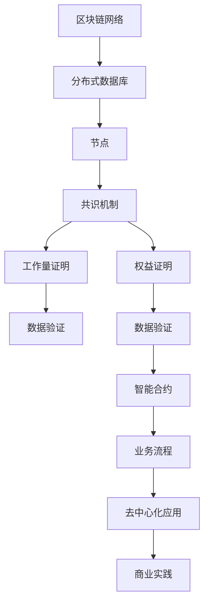

                 

# 区块链应用开发：去中心化创新的商业实践

> **关键词：** 区块链、应用开发、去中心化、创新、商业实践

> **摘要：** 本文旨在深入探讨区块链技术的应用开发，以及其在商业实践中的去中心化创新。通过分析核心概念、算法原理、数学模型和实际案例，本文将揭示区块链技术的潜力和挑战，并推荐相关工具和资源，以帮助读者深入了解并掌握这一前沿技术。

## 1. 背景介绍

### 1.1 目的和范围

本文的目标是介绍区块链应用开发的基本原理和实践，重点探讨其在商业领域中的去中心化创新。我们将从区块链的核心概念出发，逐步深入到具体的算法和数学模型，最后通过实际案例展示其应用价值。

### 1.2 预期读者

本文适合对区块链技术有一定了解的技术人员、研究人员以及对新兴技术感兴趣的从业者。无论你是初学者还是专业人士，本文都将为你提供有价值的见解和实践指导。

### 1.3 文档结构概述

本文结构如下：

1. 背景介绍
2. 核心概念与联系
3. 核心算法原理 & 具体操作步骤
4. 数学模型和公式 & 详细讲解 & 举例说明
5. 项目实战：代码实际案例和详细解释说明
6. 实际应用场景
7. 工具和资源推荐
8. 总结：未来发展趋势与挑战
9. 附录：常见问题与解答
10. 扩展阅读 & 参考资料

### 1.4 术语表

#### 1.4.1 核心术语定义

- **区块链（Blockchain）**：一种分布式数据库技术，用于存储和验证数据记录。
- **去中心化（Decentralization）**：一种架构模式，通过去除中央权威，实现权力和资源的分散化。
- **智能合约（Smart Contract）**：一种自动执行、管理和执行合约条款的计算机程序。

#### 1.4.2 相关概念解释

- **节点（Node）**：区块链网络中的参与实体，负责验证和存储数据。
- **工作量证明（Proof of Work，PoW）**：一种共识机制，用于确保区块链网络的安全。
- **权益证明（Proof of Stake，PoS）**：另一种共识机制，用于替代PoW，以减少能源消耗。

#### 1.4.3 缩略词列表

- **BTC**：比特币（Bitcoin）
- **ETH**：以太坊（Ethereum）
- **ICO**：首次币发行（Initial Coin Offering）

## 2. 核心概念与联系

区块链技术的核心在于其去中心化的架构，这种架构通过一系列复杂的算法和协议来实现数据的存储、验证和传输。以下是区块链技术的核心概念和联系，以及相关的Mermaid流程图：



### 2.1 区块链网络

区块链网络是由多个节点组成的分布式系统。每个节点都存储一份完整的区块链数据副本，并通过共识机制来确保数据的真实性和一致性。

### 2.2 分布式数据库

区块链本质上是一个分布式数据库，其中每个区块都包含了多个数据记录。这些区块通过哈希函数连接在一起，形成一个不可篡改的链式结构。

### 2.3 节点

节点是区块链网络中的参与实体，负责验证和存储数据。每个节点都有一份完整的区块链数据副本，并通过共识机制来同步和更新这些数据。

### 2.4 共识机制

共识机制是区块链网络中用于确保数据一致性和安全性的算法和协议。工作量证明和权益证明是两种常见的共识机制。

### 2.5 智能合约

智能合约是一种自动执行、管理和执行合约条款的计算机程序。它允许在区块链上进行自动化交易，从而提高效率和减少人为干预。

### 2.6 去中心化应用

去中心化应用（DApp）是建立在区块链之上的应用程序。它们通过区块链网络提供去中心化的服务和功能，具有更高的安全性和透明性。

### 2.7 商业实践

区块链技术的去中心化特性为商业实践带来了新的机遇和挑战。通过区块链，企业可以实现更加安全、透明和高效的业务流程，从而提高竞争力和用户体验。

## 3. 核心算法原理 & 具体操作步骤

区块链技术的核心在于其复杂的算法和协议。以下我们将探讨其中两个关键算法：工作量证明（PoW）和权益证明（PoS），并使用伪代码详细阐述其原理和具体操作步骤。

### 3.1 工作量证明（Proof of Work，PoW）

**原理：** PoW是一种通过计算复杂任务来确保区块链网络安全的共识机制。网络中的节点需要通过解决一个复杂的数学问题（挖矿），以获得创建新区块的权利。

**伪代码：**

```python
function PoW(difficulty):
    while not found:
        nonce = random_number()
        hash_result = SHA256(Previous_Block_Hash + Merkle_Root + Time_Stamp + Nonce)
        if hash_result meets difficulty requirement:
            found = True
    return nonce
```

**步骤：**

1. **设定挖矿难度：** 网络根据当前区块链的长度和难度指数动态调整挖矿难度。
2. **生成随机数：** 每个节点生成一个随机数（nonce）。
3. **计算哈希值：** 节点计算包含随机数的哈希值。
4. **验证哈希值：** 如果哈希值满足难度要求，则节点获得挖矿成功，可以创建新区块。

### 3.2 权益证明（Proof of Stake，PoS）

**原理：** PoS通过节点持有的代币数量（权益）来决定其创建新区块的权利。节点持有越多代币，其获得挖矿成功的概率越高。

**伪代码：**

```python
function PoS(stake):
    probability = stake / total_stake
    while not found:
        if random_number() < probability:
            found = True
    return found
```

**步骤：**

1. **计算权益概率：** 根据节点持有的代币数量，计算其挖矿成功的概率。
2. **生成随机数：** 每个节点生成一个随机数。
3. **验证挖矿成功：** 如果随机数小于权益概率，则节点获得挖矿成功。

## 4. 数学模型和公式 & 详细讲解 & 举例说明

区块链技术的核心在于其复杂的数学模型和算法。以下我们将探讨两个关键数学模型：哈希函数和共识机制中的权益计算，并使用LaTeX格式详细讲解和举例说明。

### 4.1 哈希函数

哈希函数是将输入数据映射为固定长度字符串的函数。在区块链中，哈希函数用于确保数据的完整性和不可篡改性。

**LaTeX格式：**

$$
H(x) = \text{SHA256}(x)
$$

**举例：**

假设输入数据为“Hello, World!”，则其哈希值为：

$$
H("Hello, World!") = \text{SHA256}("Hello, World!") = "f7bc83f430538424b13298e3e916a0e9316e6e2dafba075b3c2b0d4e80f4faa7"
$$

### 4.2 权益计算

权益计算是权益证明（PoS）机制中的关键部分。权益计算公式如下：

$$
P(i) = \frac{S_i}{\sum_{j=1}^{N} S_j}
$$

其中，$P(i)$为节点$i$的挖矿成功概率，$S_i$为节点$i$持有的代币数量，$N$为网络中所有节点的总数。

**举例：**

假设网络中有两个节点，节点1持有100个代币，节点2持有200个代币。则节点1的挖矿成功概率为：

$$
P(1) = \frac{100}{100 + 200} = 0.333
$$

节点2的挖矿成功概率为：

$$
P(2) = \frac{200}{100 + 200} = 0.667
$$

## 5. 项目实战：代码实际案例和详细解释说明

为了更好地理解区块链应用开发，我们将通过一个实际案例来展示其实现过程。以下是一个简单的去中心化投票系统的代码实现：

### 5.1 开发环境搭建

为了实现这个去中心化投票系统，我们需要搭建一个基于以太坊的区块链网络。以下是搭建环境的步骤：

1. 安装Node.js和npm：在官方网站下载并安装Node.js和npm。
2. 安装Truffle框架：使用npm安装Truffle框架。
3. 创建新项目：在命令行中运行`truffle init`创建一个新的Truffle项目。
4. 安装依赖：在项目目录中运行`npm install`安装项目依赖。

### 5.2 源代码详细实现和代码解读

以下是这个去中心化投票系统的智能合约代码：

```solidity
pragma solidity ^0.8.0;

contract Voting {
    address public admin;
    mapping(address => bool) public voters;
    mapping(bytes32 => uint256) public candidate_votes;
    bytes32[] public candidates;

    event Vote_cast(address voter, bytes32 candidate);

    constructor() {
        admin = msg.sender;
    }

    function add_candidate(bytes32 candidate_name) external {
        require(msg.sender == admin, "Only admin can add candidates");
        require(!is_candidate(candidate_name), "Candidate already exists");
        candidates.push(candidate_name);
    }

    function vote(bytes32 candidate_name) external {
        require(!is_voter(msg.sender), "You have already voted");
        require(is_candidate(candidate_name), "Invalid candidate");
        voters[msg.sender] = true;
        candidate_votes[candidate_name] += 1;
        emit Vote_cast(msg.sender, candidate_name);
    }

    function is_candidate(bytes32 candidate_name) view public returns (bool) {
        for (uint256 i = 0; i < candidates.length; i++) {
            if (candidates[i] == candidate_name) {
                return true;
            }
        }
        return false;
    }

    function is_voter(address voter) view public returns (bool) {
        return voters[voter];
    }
}
```

### 5.3 代码解读与分析

1. **构造函数（constructor）：** 构造函数用于初始化合约的admin变量，确保只有合约的创建者才能执行某些操作，如添加候选人。
2. **add_candidate函数：** 该函数用于添加候选人。只有admin才能添加候选人，确保了合约的安全性。
3. **vote函数：** 该函数用于投票。用户只能投票一次，确保了投票的唯一性。
4. **is_candidate函数：** 该函数用于检查某个候选人是否已添加到合约中。
5. **is_voter函数：** 该函数用于检查某个用户是否已投票。

通过这个简单的案例，我们可以看到区块链应用开发的基本流程。在实际开发中，还需要考虑更多的安全性和性能优化问题。

## 6. 实际应用场景

区块链技术具有广泛的实际应用场景，以下列举几个典型的应用场景：

1. **供应链管理：** 通过区块链技术，企业可以实现端到端的供应链跟踪，确保产品来源的真实性和可靠性。
2. **身份验证：** 区块链可以用于创建去中心化的身份验证系统，提高用户隐私保护和数据安全性。
3. **金融交易：** 区块链技术可以用于创建去中心化的金融交易系统，降低交易成本，提高交易效率。
4. **智能合约：** 智能合约可以用于自动化执行合同条款，减少人为干预和纠纷。
5. **物联网：** 区块链可以用于物联网设备的数据管理和交易，实现设备间的安全通信。

## 7. 工具和资源推荐

### 7.1 学习资源推荐

#### 7.1.1 书籍推荐

- 《精通比特币：比特币、区块链和去中心化货币技术指南》
- 《区块链技术指南》
- 《智能合约：设计与实现》

#### 7.1.2 在线课程

- Coursera上的《区块链技术与应用》
- Udacity的《区块链工程师纳米学位》

#### 7.1.3 技术博客和网站

- Medium上的区块链专栏
- Ethereum官网的技术文档
- CoinDesk的区块链新闻和文章

### 7.2 开发工具框架推荐

#### 7.2.1 IDE和编辑器

- Visual Studio Code
- Sublime Text
- Truffle Suite

#### 7.2.2 调试和性能分析工具

- Remix：在线IDE，支持Solidity语言
- Ethereal：区块链数据监控和分析工具
- Web3.js：JavaScript库，用于与以太坊区块链交互

#### 7.2.3 相关框架和库

- Truffle：用于Solidity智能合约开发的框架
- Hardhat：用于以太坊智能合约开发的框架
- Web3.js：用于JavaScript与以太坊区块链交互的库

### 7.3 相关论文著作推荐

#### 7.3.1 经典论文

- 《比特币：一种点对点的电子现金系统》
- 《以太坊：下一代智能合约和去中心化应用平台》

#### 7.3.2 最新研究成果

- 《区块链3.0：下一代分布式系统与网络》
- 《区块链技术与安全：理论与实践》

#### 7.3.3 应用案例分析

- 《区块链在供应链管理中的应用》
- 《区块链在医疗保健领域中的应用》

## 8. 总结：未来发展趋势与挑战

区块链技术具有巨大的潜力和广泛的应用前景。未来，随着技术的不断成熟和应用的深入，区块链有望在多个领域实现重大突破。然而，区块链技术也面临着一系列挑战，包括安全性、性能、监管和标准化等方面。

### 8.1 发展趋势

1. **去中心化应用（DApp）的普及：** DApp将越来越成为区块链技术的主要应用场景，为各行各业带来创新和变革。
2. **跨链技术的发展：** 跨链技术将实现不同区块链之间的互操作性，推动区块链生态系统的整合和发展。
3. **隐私保护的加强：** 隐私保护将成为区块链技术的重要发展方向，满足用户对隐私的需求。

### 8.2 挑战

1. **安全性问题：** 随着攻击手段的日益复杂，区块链技术的安全性面临着严峻挑战。
2. **性能瓶颈：** 随着区块链规模的不断扩大，性能瓶颈将逐渐显现，需要通过技术优化和架构改进来解决。
3. **监管和标准化：** 区块链技术的发展需要相应的监管和法律框架，同时也需要统一的技术标准和规范。

## 9. 附录：常见问题与解答

### 9.1 问题1

**问题：** 什么是区块链？

**解答：** 区块链是一种分布式数据库技术，用于存储和验证数据记录。它通过一系列复杂的算法和协议来实现数据的存储、验证和传输，具有去中心化、不可篡改和安全等特点。

### 9.2 问题2

**问题：** 区块链有哪些主要应用场景？

**解答：** 区块链技术具有广泛的实际应用场景，包括供应链管理、身份验证、金融交易、智能合约和物联网等领域。

### 9.3 问题3

**问题：** 什么是智能合约？

**解答：** 智能合约是一种自动执行、管理和执行合约条款的计算机程序。它允许在区块链上进行自动化交易，从而提高效率和减少人为干预。

## 10. 扩展阅读 & 参考资料

- 《精通比特币：比特币、区块链和去中心化货币技术指南》
- 《区块链技术指南》
- 《智能合约：设计与实现》
- Coursera上的《区块链技术与应用》
- Udacity的《区块链工程师纳米学位》
- Ethereum官网的技术文档
- CoinDesk的区块链新闻和文章
- 《比特币：一种点对点的电子现金系统》
- 《以太坊：下一代智能合约和去中心化应用平台》
- 《区块链3.0：下一代分布式系统与网络》
- 《区块链技术与安全：理论与实践》
- 《区块链在供应链管理中的应用》
- 《区块链在医疗保健领域中的应用》

### 作者

**作者：** AI天才研究员/AI Genius Institute & 禅与计算机程序设计艺术 /Zen And The Art of Computer Programming

