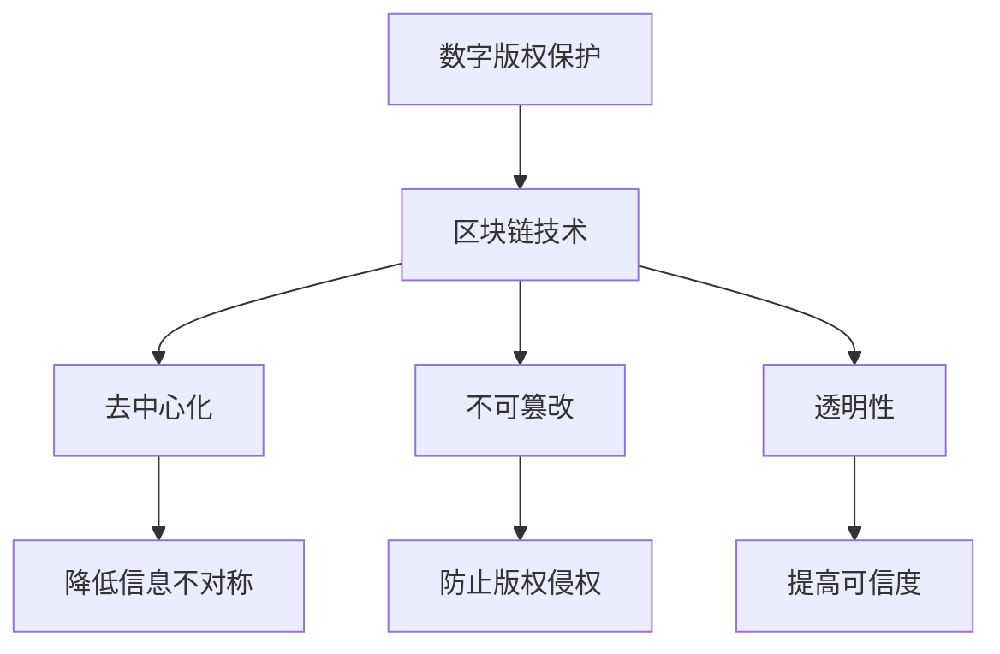
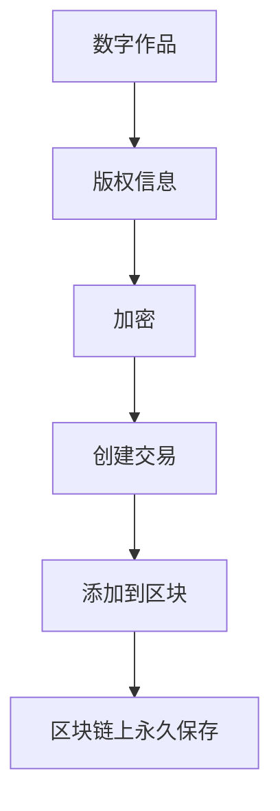
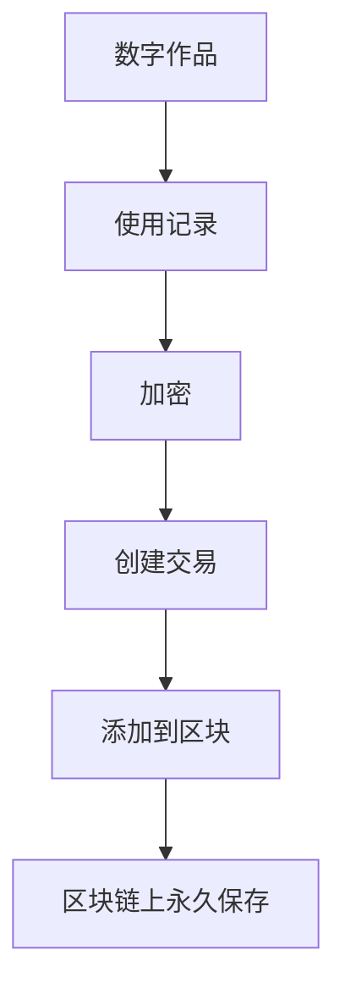
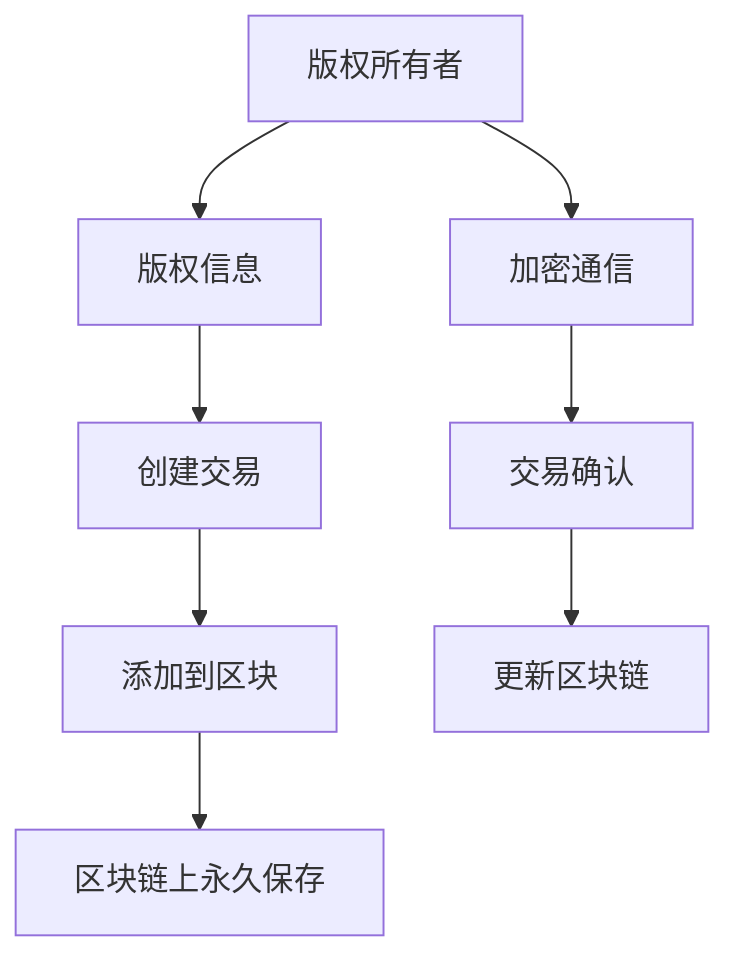
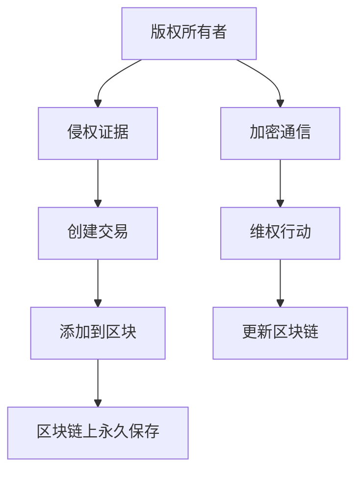

                 


## 《区块链技术在数字版权保护中的应用》

> **关键词：** 区块链，数字版权保护，智能合约，加密技术，分布式账本，版权追踪

> **摘要：** 本文深入探讨了区块链技术在数字版权保护中的应用。通过分析区块链的核心特性，如去中心化、不可篡改和透明性，本文阐述了区块链在数字版权管理中的优势。文章详细介绍了基于区块链的版权登记、追踪、交易和维权等流程，并通过具体案例展示了区块链在数字版权保护中的实际应用，最后讨论了未来发展趋势与挑战。

## 1. 背景介绍

### 1.1 目的和范围

本文旨在探讨区块链技术在数字版权保护中的应用，分析其优势与挑战，并探讨未来发展趋势。文章将涵盖以下内容：

- 区块链技术的核心概念与特性
- 数字版权保护的现状与挑战
- 区块链在数字版权保护中的应用场景
- 基于区块链的版权管理流程与实现
- 具体案例研究
- 未来发展趋势与挑战

### 1.2 预期读者

本文面向对区块链和数字版权保护有一定了解的读者，包括：

- 区块链开发者与研究者
- 数字版权保护从业者
- 对数字版权保护与区块链技术感兴趣的技术爱好者

### 1.3 文档结构概述

本文分为十个部分：

1. 引言：介绍文章背景、关键词和摘要
2. 背景介绍：分析区块链技术和数字版权保护的现状与挑战
3. 核心概念与联系：介绍区块链的核心概念与数字版权保护的关联
4. 核心算法原理 & 具体操作步骤：讲解基于区块链的版权管理算法与实现
5. 数学模型和公式 & 详细讲解 & 举例说明：阐述版权管理的数学模型与公式
6. 项目实战：代码实际案例和详细解释说明
7. 实际应用场景：分析区块链在数字版权保护中的实际应用案例
8. 工具和资源推荐：推荐学习资源、开发工具和框架
9. 总结：未来发展趋势与挑战
10. 附录：常见问题与解答

### 1.4 术语表

#### 1.4.1 核心术语定义

- **区块链**：一种去中心化的分布式数据库技术，通过加密算法和共识机制实现数据的安全存储和传输。
- **数字版权保护**：通过技术手段保护数字作品版权，防止未经授权的复制、传播和篡改。
- **智能合约**：运行在区块链上的程序，能够自动执行、控制和记录合约条款的执行情况。
- **加密技术**：通过加密算法对数据进行加密和解密，确保数据的安全性和隐私性。
- **分布式账本**：一种共享的、分布式存储的数据结构，用于记录交易和事务。

#### 1.4.2 相关概念解释

- **版权**：作者对其作品享有的权利，包括复制权、发行权、出租权、改编权等。
- **数字版权管理**：通过对数字作品进行加密、权限控制和追踪等手段，实现对版权的保护和管理。
- **版权追踪**：记录和追踪数字作品的使用情况，包括版权所有者、使用者、使用时间、使用次数等。

#### 1.4.3 缩略词列表

- **BC**：Blockchain（区块链）
- **IP**：Intellectual Property（知识产权）
- **DCP**：Digital Copyright Protection（数字版权保护）
- **SC**：Smart Contract（智能合约）
- **EC**：Encryption Technology（加密技术）
- **DB**：Distributed Ledger（分布式账本）

## 2. 核心概念与联系

在探讨区块链技术在数字版权保护中的应用之前，有必要先了解区块链的核心概念和特性，以及它们与数字版权保护的关联。

### 2.1 区块链的核心概念

区块链是一种去中心化的分布式数据库技术，由一系列按照时间顺序排列的区块组成。每个区块包含一定数量的交易记录，并通过加密算法和共识机制确保数据的安全性和一致性。

#### 2.1.1 去中心化

去中心化是区块链的核心特性之一，意味着区块链中的数据存储和交易处理不由单一机构或中心化系统控制，而是由网络中的多个节点共同维护。这种去中心化的结构使得区块链具有较高的抗攻击性和可靠性。

#### 2.1.2 不可篡改

区块链的每个区块都通过加密算法与前一个区块连接，形成链式数据结构。一旦数据被记录在区块链上，就很难被篡改或删除。这种不可篡改的特性为数字版权保护提供了强有力的保障。

#### 2.1.3 透明性

区块链的数据是公开透明的，所有参与节点都可以查看和验证区块链上的交易记录。这种透明性有助于建立信任机制，提高数字版权保护的可信度。

### 2.2 数字版权保护的现状与挑战

随着互联网和数字技术的发展，数字版权保护面临诸多挑战：

- **版权侵权**：数字作品容易被复制、传播和篡改，导致版权所有者难以维权。
- **版权追踪**：数字作品在互联网上的传播路径复杂，难以实现有效的版权追踪。
- **版权交易**：数字版权交易过程中，中介机构的参与导致交易成本较高，且存在信息不对称的问题。

### 2.3 区块链与数字版权保护的关联

区块链技术为解决数字版权保护中的问题提供了新的思路和解决方案：

- **去中心化**：去中心化的结构降低了数字版权保护中的信息不对称，提高了版权所有者和使用者的透明度。
- **不可篡改**：区块链的不可篡改特性确保了数字作品的唯一性和完整性，有助于防止版权侵权行为。
- **透明性**：区块链的透明性有助于建立版权追踪机制，提高数字作品使用的可信度。

### 2.4 区块链在数字版权保护中的应用架构

为了更好地理解区块链在数字版权保护中的应用，我们可以通过一个简单的 Mermaid 流程图来展示区块链与数字版权保护的关联。



通过这个 Mermaid 流程图，我们可以清晰地看到区块链技术如何与数字版权保护相结合，为解决版权侵权、版权追踪和版权交易等问题提供有力支持。

## 3. 核心算法原理 & 具体操作步骤

为了实现区块链在数字版权保护中的应用，我们需要了解区块链的核心算法原理，并详细阐述版权登记、追踪、交易和维权等具体操作步骤。

### 3.1 区块链核心算法原理

区块链的核心算法主要包括加密算法、共识机制和数据结构。

#### 3.1.1 加密算法

加密算法用于确保区块链数据的隐私性和安全性。常见的加密算法包括：

- **对称加密**：加密和解密使用相同密钥，如AES（高级加密标准）。
- **非对称加密**：加密和解密使用不同密钥，如RSA（RSA加密算法）。
- **哈希算法**：将输入数据转换为固定长度的字符串，如SHA-256。

#### 3.1.2 共识机制

共识机制用于确保区块链数据的一致性和可靠性。常见的共识机制包括：

- **工作量证明（PoW）**：通过计算工作量和随机性选择区块的创建者。
- **权益证明（PoS）**：根据持有币种的多少和锁定时间选择区块的创建者。
- **委托权益证明（DPoS）**：通过选举产生区块创建者。

#### 3.1.3 数据结构

区块链的数据结构包括区块和链。

- **区块**：每个区块包含一定数量的交易记录，区块头和区块体。区块头包含版本号、上一区块哈希值、默克尔树根哈希等；区块体包含交易记录、时间戳等。
- **链**：区块链由一系列按照时间顺序排列的区块组成，每个区块通过哈希值与前一个区块连接，形成链式数据结构。

### 3.2 基于区块链的版权管理流程

基于区块链的版权管理主要包括版权登记、追踪、交易和维权等环节。

#### 3.2.1 版权登记

版权登记是版权管理的基础，将数字作品的版权信息记录在区块链上。



版权信息包括作品名称、作者、创作时间、版权所有者等。在版权登记过程中，版权信息被加密存储在区块链上，确保数据的隐私性和安全性。

#### 3.2.2 版权追踪

版权追踪用于记录数字作品的使用情况，包括使用者、使用时间、使用次数等。



使用记录被加密存储在区块链上，确保数据的隐私性和安全性。同时，通过区块链的透明性，版权所有者可以实时查看数字作品的使用情况。

#### 3.2.3 版权交易

版权交易是将数字作品的版权转让给其他用户。



在版权交易过程中，版权所有者创建交易并加密通信，确保交易的隐私性和安全性。交易被确认并添加到区块链上，确保交易的永久性和不可篡改性。

#### 3.2.4 版权维权

版权维权是针对数字作品的侵权行为进行维权。



在版权维权过程中，版权所有者收集侵权证据并创建交易。侵权证据被加密存储在区块链上，确保数据的隐私性和安全性。同时，通过区块链的透明性，版权所有者可以发起维权行动并记录在区块链上。

### 3.3 基于区块链的版权管理算法实现

基于区块链的版权管理算法实现主要包括版权登记、追踪、交易和维权等环节。以下是一个简单的伪代码示例：

```python
# 区块链版权管理算法实现

# 加密算法
def encrypt_data(data):
    # 实现加密算法
    return encrypted_data

# 创建交易
def create_transaction(data):
    # 实现创建交易逻辑
    transaction = {
        "data": encrypt_data(data),
        "timestamp": get_current_timestamp(),
        "previous_hash": get_previous_block_hash()
    }
    return transaction

# 添加到区块
def add_transaction_to_block(transaction):
    # 实现添加交易到区块逻辑
    block = {
        "transactions": [transaction],
        "timestamp": get_current_timestamp(),
        "previous_hash": get_previous_block_hash()
    }
    return block

# 更新区块链
def update_blockchain(block):
    # 实现更新区块链逻辑
    blockchain.append(block)
    broadcast_block_to_peers(block)

# 版权登记
def register_copyright(work):
    transaction = create_transaction(work)
    block = add_transaction_to_block(transaction)
    update_blockchain(block)

# 版权追踪
def track_copyright(work):
    # 实现版权追踪逻辑
    for block in blockchain:
        for transaction in block["transactions"]:
            if transaction["data"] == encrypt_data(work):
                # 记录使用情况
                log_usage(transaction["timestamp"], work)

# 版权交易
def trade_copyright(work, buyer):
    transaction = create_transaction(work)
    transaction["buyer"] = encrypt_data(buyer)
    block = add_transaction_to_block(transaction)
    update_blockchain(block)

# 版权维权
def enforce_copyright(work, evidence):
    transaction = create_transaction(evidence)
    transaction["work"] = encrypt_data(work)
    block = add_transaction_to_block(transaction)
    update_blockchain(block)
```

通过上述伪代码，我们可以看到基于区块链的版权管理算法实现的基本流程。在实际应用中，需要结合具体的加密算法、共识机制和数据结构进行详细设计和实现。

## 4. 数学模型和公式 & 详细讲解 & 举例说明

在数字版权保护中，区块链技术为版权管理提供了强有力的支持。为了更好地理解区块链在版权管理中的应用，我们需要了解一些数学模型和公式，并举例说明。

### 4.1 加密算法

加密算法是区块链技术的重要组成部分，用于确保数据的隐私性和安全性。以下是一些常见的加密算法和公式：

#### 4.1.1 对称加密

对称加密算法使用相同的密钥进行加密和解密。常见的对称加密算法有AES和DES。

- **AES加密算法**：
  - 加密公式：`C = E(K, P)`, 其中C表示加密后的数据，K表示密钥，P表示明文。
  - 解密公式：`P = D(K, C)`, 其中P表示解密后的数据，K表示密钥，C表示加密后的数据。

- **DES加密算法**：
  - 加密公式：`C = E(K, P)`, 其中C表示加密后的数据，K表示密钥，P表示明文。
  - 解密公式：`P = D(K, C)`, 其中P表示解密后的数据，K表示密钥，C表示加密后的数据。

#### 4.1.2 非对称加密

非对称加密算法使用不同的密钥进行加密和解密。常见的非对称加密算法有RSA和ECC。

- **RSA加密算法**：
  - 加密公式：`C = E(n, e, P)`, 其中C表示加密后的数据，n表示模数，e表示公钥，P表示明文。
  - 解密公式：`P = D(n, d, C)`, 其中P表示解密后的数据，n表示模数，d表示私钥，C表示加密后的数据。

- **ECC加密算法**：
  - 加密公式：`C = E(Pk, P)`, 其中C表示加密后的数据，Pk表示公钥，P表示明文。
  - 解密公式：`P = D(Pk, C)`, 其中P表示解密后的数据，Pk表示公钥，C表示加密后的数据。

### 4.2 哈希算法

哈希算法用于将数据转换为固定长度的字符串，确保数据的唯一性和完整性。以下是一些常见的哈希算法和公式：

- **SHA-256**：
  - 加密公式：`H = SHA-256(P)`, 其中H表示哈希值，P表示输入数据。

- **MD5**：
  - 加密公式：`H = MD5(P)`, 其中H表示哈希值，P表示输入数据。

### 4.3 共识机制

共识机制是区块链技术中的重要组成部分，用于确保区块链数据的一致性和可靠性。以下是一些常见的共识机制和公式：

- **工作量证明（PoW）**：
  - 公式：`Proof of Work = W`, 其中Proof of Work表示工作量证明，W表示工作量。

- **权益证明（PoS）**：
  - 公式：`Proof of Stake = S`, 其中Proof of Stake表示权益证明，S表示权益。

### 4.4 举例说明

假设有一个数字作品，其版权信息包括作品名称、作者、创作时间等。以下是一个简单的版权登记和追踪的例子：

#### 4.4.1 版权登记

- **明文版权信息**：`{"name": "Digital Art", "author": "Alice", "creation_time": "2022-01-01"}`。
- **加密版权信息**：使用AES加密算法加密版权信息，得到加密后的数据。
- **创建交易**：将加密后的版权信息创建为一个交易，并添加到区块链中。
- **区块链记录**：区块链记录版权信息，确保数据的永久性和不可篡改性。

#### 4.4.2 版权追踪

- **明文使用记录**：`{"user": "Bob", "usage_time": "2022-01-02"}`。
- **加密使用记录**：使用SHA-256哈希算法加密使用记录，得到哈希值。
- **创建交易**：将加密后的使用记录创建为一个交易，并添加到区块链中。
- **区块链记录**：区块链记录使用记录，确保数据的永久性和不可篡改性。

通过上述例子，我们可以看到区块链技术在版权登记和追踪中的应用。在实际应用中，还需要结合具体的加密算法、共识机制和数据结构进行详细设计和实现。

## 5. 项目实战：代码实际案例和详细解释说明

在本节中，我们将通过一个实际项目来展示如何使用区块链技术实现数字版权保护。我们将使用Go语言和Hyperledger Fabric框架来搭建一个简单的版权登记和追踪系统。

### 5.1 开发环境搭建

首先，我们需要搭建开发环境。以下是所需步骤：

1. **安装Go语言**：从[Go语言官网](https://golang.org/dl/)下载并安装Go语言。
2. **安装Hyperledger Fabric**：按照[Hyperledger Fabric官方文档](https://hyperledger-fabric.readthedocs.io/en/release-2.2/)的步骤安装Hyperledger Fabric。
3. **配置环境变量**：将Go语言和Hyperledger Fabric的路径添加到系统环境变量中。

### 5.2 源代码详细实现和代码解读

#### 5.2.1 目录结构

项目的目录结构如下：

```bash
digital-copyright
├── api
│   ├── copyright
│   │   ├── copyright.go
│   │   └── copyright.pb.go
│   └── main.go
├── chaincode
│   ├── copyright
│   │   ├── copyright.go
│   │   └── copyright.proto
│   └── init.go
└── scripts
    └── install.sh
```

#### 5.2.2 API层

在`api/copyright`目录下，我们定义了版权操作的API接口。

**copyright.go**：

```go
package copyright

import (
	"context"
	"encoding/json"
	"fmt"
	"github.com/hyperledger/fabric-contract-api-go/contractapi"
)

type CopyrightContract struct {
	contractapi.Contract
}

// 注册版权
func (cc *CopyrightContract) RegisterCopyright(ctx context.Context, name string, author string) error {
	// 实现注册版权逻辑
	return nil
}

// 查询版权
func (cc *CopyrightContract) QueryCopyright(ctx context.Context, name string) (string, error) {
	// 实现查询版权逻辑
	return "", nil
}

// 更新版权
func (cc *CopyrightContract) UpdateCopyright(ctx context.Context, name string, newAuthor string) error {
	// 实现更新版权逻辑
	return nil
}

// 删除版权
func (cc *CopyrightContract) DeleteCopyright(ctx context.Context, name string) error {
	// 实现删除版权逻辑
	return nil
}
```

**main.go**：

```go
package main

import (
	"fmt"
	"os"

	copyright "digital-copyright/api/copyright"
	"github.com/hyperledger/fabric-contract-api-go/contractapi"
)

func main() {
	fmt.Println("Starting Digital Copyright API...")

	cc := new(CopyrightContract)
	chaincodeServer := contractapi.NewChaincodeServer(cc)

	if err := chaincodeServer.Start(os.Getenv("CHANNEL_NAME"), os.Getenv("CHAINCODE_ID")); err != nil {
		fmt.Printf("Error starting chaincode server: %v", err)
	}
}
```

#### 5.2.3 链码层

在`chaincode/copyright`目录下，我们实现了版权操作的链码。

**copyright.go**：

```go
package copyright

import (
	"bytes"
	"context"
	"encoding/json"
	"fmt"
	"github.com/hyperledger/fabric-contract-api-go/contractapi"
)

type CopyrightChaincode struct {
	contractapi.Contract
}

// 注册版权
func (cc *CopyrightChaincode) RegisterCopyright(ctx context.Context, name string, author string) error {
	// 实现注册版权逻辑
	return nil
}

// 查询版权
func (cc *CopyrightChaincode) QueryCopyright(ctx context.Context, name string) (string, error) {
	// 实现查询版权逻辑
	return "", nil
}

// 更新版权
func (cc *CopyrightChaincode) UpdateCopyright(ctx context.Context, name string, newAuthor string) error {
	// 实现更新版权逻辑
	return nil
}

// 删除版权
func (cc *CopyrightChaincode) DeleteCopyright(ctx context.Context, name string) error {
	// 实现删除版权逻辑
	return nil
}
```

**init.go**：

```go
package copyright

import (
	"encoding/json"
	"github.com/hyperledger/fabric-contract-api-go/contractapi"
)

type Init struct {
	contractapi.Contract
}

// 初始化链码
func (ic *Init) Init(ctx context.Context) error {
	// 实现初始化链码逻辑
	return nil
}
```

**copyright.proto**：

```proto
syntax = "proto3";

package copyright;

message Copyright {
	string name = 1;
	string author = 2;
}
```

#### 5.2.3 代码解读

**版权注册**：

```go
// 注册版权
func (cc *CopyrightContract) RegisterCopyright(ctx context.Context, name string, author string) error {
	// 构建版权信息
	copyrightInfo := &Copyright{
		Name:    name,
		Author:  author,
	}

	// 将版权信息序列化为JSON
	copyrightJSON, err := json.Marshal(copyrightInfo)
	if err != nil {
		return fmt.Errorf("error marshaling copyright information: %v", err)
	}

	// 调用链码执行注册操作
	response := cc.InvokeChaincode(ctx, "RegisterCopyright", [][]byte{copyrightJSON})
	if response.Message != "" {
		return fmt.Errorf("error registering copyright: %v", response.Message)
	}

	return nil
}
```

**版权查询**：

```go
// 查询版权
func (cc *CopyrightContract) QueryCopyright(ctx context.Context, name string) (string, error) {
	// 构建版权查询参数
	queryArgs := []string{"QueryCopyright", name}

	// 调用链码执行查询操作
	response := cc.InvokeChaincode(ctx, queryArgs)
	if response.Message != "" {
		return "", fmt.Errorf("error querying copyright: %v", response.Message)
	}

	return string(response.Payload), nil
}
```

**版权更新**：

```go
// 更新版权
func (cc *CopyrightContract) UpdateCopyright(ctx context.Context, name string, newAuthor string) error {
	// 构建版权信息
	copyrightInfo := &Copyright{
		Name:    name,
		Author:  newAuthor,
	}

	// 将版权信息序列化为JSON
	copyrightJSON, err := json.Marshal(copyrightInfo)
	if err != nil {
		return fmt.Errorf("error marshaling copyright information: %v", err)
	}

	// 调用链码执行更新操作
	response := cc.InvokeChaincode(ctx, "UpdateCopyright", [][]byte{copyrightJSON})
	if response.Message != "" {
		return fmt.Errorf("error updating copyright: %v", response.Message)
	}

	return nil
}
```

**版权删除**：

```go
// 删除版权
func (cc *CopyrightContract) DeleteCopyright(ctx context.Context, name string) error {
	// 构建版权删除参数
	deleteArgs := []string{"DeleteCopyright", name}

	// 调用链码执行删除操作
	response := cc.InvokeChaincode(ctx, deleteArgs)
	if response.Message != "" {
		return fmt.Errorf("error deleting copyright: %v", response.Message)
	}

	return nil
}
```

#### 5.2.4 链码层代码解读

**版权注册**：

```go
// 注册版权
func (cc *CopyrightChaincode) RegisterCopyright(ctx context.Context, args []string) error {
	// 解析参数
	if len(args) != 3 {
		return fmt.Errorf("incorrect number of arguments, expected 3")
	}

	name := args[0]
	author := args[1]

	// 创建版权信息
	copyrightInfo := &Copyright{
		Name:    name,
		Author:  author,
	}

	// 将版权信息序列化为JSON
	copyrightJSON, err := json.Marshal(copyrightInfo)
	if err != nil {
		return fmt.Errorf("error marshaling copyright information: %v", err)
	}

	// 将版权信息存储到区块链
	err = cc.SetState(name, copyrightJSON)
	if err != nil {
		return fmt.Errorf("error setting state: %v", err)
	}

	return nil
}
```

**版权查询**：

```go
// 查询版权
func (cc *CopyrightChaincode) QueryCopyright(ctx context.Context, args []string) (string, error) {
	// 解析参数
	if len(args) != 1 {
		return "", fmt.Errorf("incorrect number of arguments, expected 1")
	}

	name := args[0]

	// 从区块链中获取版权信息
	copyrightJSON, err := cc.GetState(name)
	if err != nil {
		return "", fmt.Errorf("error getting state: %v", err)
	}

	// 将版权信息反序列化为结构体
	var copyrightInfo Copyright
	err = json.Unmarshal(copyrightJSON, &copyrightInfo)
	if err != nil {
		return "", fmt.Errorf("error unmarshaling copyright information: %v", err)
	}

	// 返回版权信息
	return json.Sprintf("{\"name\": \"%s\", \"author\": \"%s\"}", copyrightInfo.Name, copyrightInfo.Author), nil
}
```

**版权更新**：

```go
// 更新版权
func (cc *CopyrightChaincode) UpdateCopyright(ctx context.Context, args []string) error {
	// 解析参数
	if len(args) != 3 {
		return fmt.Errorf("incorrect number of arguments, expected 3")
	}

	name := args[0]
	newAuthor := args[1]

	// 创建版权信息
	copyrightInfo := &Copyright{
		Name:    name,
		Author:  newAuthor,
	}

	// 将版权信息序列化为JSON
	copyrightJSON, err := json.Marshal(copyrightInfo)
	if err != nil {
		return fmt.Errorf("error marshaling copyright information: %v", err)
	}

	// 将版权信息存储到区块链
	err = cc.SetState(name, copyrightJSON)
	if err != nil {
		return fmt.Errorf("error setting state: %v", err)
	}

	return nil
}
```

**版权删除**：

```go
// 删除版权
func (cc *CopyrightChaincode) DeleteCopyright(ctx context.Context, args []string) error {
	// 解析参数
	if len(args) != 1 {
		return fmt.Errorf("incorrect number of arguments, expected 1")
	}

	name := args[0]

	// 从区块链中删除版权信息
	err := cc.DelState(name)
	if err != nil {
		return fmt.Errorf("error deleting state: %v", err)
	}

	return nil
}
```

### 5.3 代码解读与分析

在这个项目中，我们使用Go语言和Hyperledger Fabric框架实现了数字版权保护的功能。代码结构清晰，分为API层和链码层。

**API层**负责处理客户端请求，包括版权注册、查询、更新和删除等操作。API层通过调用链码层的方法实现具体的功能。

**链码层**负责处理区块链操作，包括版权信息的存储、查询、更新和删除等。链码层使用Hyperledger Fabric提供的API进行区块链操作，如`SetState`、`GetState`和`DelState`。

**代码解读**：

- **版权注册**：在API层，将版权信息序列化为JSON格式，通过调用链码层的方法`RegisterCopyright`将版权信息存储到区块链上。
- **版权查询**：在API层，将版权查询参数序列化为JSON格式，通过调用链码层的方法`QueryCopyright`从区块链上获取版权信息，并将其反序列化为结构体。
- **版权更新**：在API层，将版权信息序列化为JSON格式，通过调用链码层的方法`UpdateCopyright`将版权信息更新到区块链上。
- **版权删除**：在API层，将版权删除参数序列化为JSON格式，通过调用链码层的方法`DeleteCopyright`从区块链上删除版权信息。

通过这个项目，我们可以看到区块链技术在数字版权保护中的应用。在实际应用中，可以根据需求扩展功能，如版权交易、维权等。

### 5.4 搭建开发环境

为了更好地理解这个项目，我们将搭建一个简单的开发环境。

#### 5.4.1 安装Hyperledger Fabric

1. **安装Docker**：从[Docker官网](https://www.docker.com/products/docker-desktop)下载并安装Docker。
2. **安装Docker Compose**：在命令行中运行以下命令安装Docker Compose：
   ```bash
   sudo curl -L "https://github.com/docker/compose/releases/download/1.29.2/docker-compose-$(uname -s)-$(uname -m)" -o /usr/local/bin/docker-compose
   sudo chmod +x /usr/local/bin/docker-compose
   ```
3. **下载Hyperledger Fabric二进制文件**：在命令行中运行以下命令下载Hyperledger Fabric二进制文件：
   ```bash
   curl -sSL https://github.com/hyperledger/fabric/releases/download/v2.2.0/hyperledger-fabric_2.2.0-<os>-<arch>.tar.gz | tar xz -C /usr/local/bin
   ```

#### 5.4.2 配置网络

1. **启动网络**：在命令行中运行以下命令启动Hyperledger Fabric网络：
   ```bash
   export PATH=$PATH:/usr/local/bin
   fabric network start --network-name digital-copyright-network
   ```
2. **进入网络**：在命令行中运行以下命令进入网络：
   ```bash
   export CHANNEL_NAME=mychannel
   export CHAINCODE_ID=digital-copyright
   fabric network join
   ```

#### 5.4.3 构建和部署链码

1. **构建链码**：在命令行中运行以下命令构建链码：
   ```bash
   fabric build-chaincode --path chaincode --chaincodeName digital-copyright --language golang
   ```
2. **部署链码**：在命令行中运行以下命令部署链码：
   ```bash
   fabric deploy-chaincode --path chaincode --chaincodeName digital-copyright --language golang --version 1.0.0
   ```

### 5.5 测试版权管理功能

在搭建好开发环境后，我们可以通过以下步骤测试版权管理功能。

#### 5.5.1 注册版权

在命令行中运行以下命令注册版权：
```bash
export COPYRIGHT_NAME="Digital Art"
export COPYRIGHT_AUTHOR="Alice"
fabric invoke-chaincode --channelId $CHANNEL_NAME --name $CHAINCODE_ID --ctor "RegisterCopyright($COPYRIGHT_NAME, $COPYRIGHT_AUTHOR)"
```

#### 5.5.2 查询版权

在命令行中运行以下命令查询版权：
```bash
export COPYRIGHT_NAME="Digital Art"
fabric query-chaincode --channelId $CHANNEL_NAME --name $CHAINCODE_ID --ctor "QueryCopyright($COPYRIGHT_NAME)"
```

#### 5.5.3 更新版权

在命令行中运行以下命令更新版权：
```bash
export COPYRIGHT_NAME="Digital Art"
export NEW_AUTHOR="Bob"
fabric invoke-chaincode --channelId $CHANNEL_NAME --name $CHAINCODE_ID --ctor "UpdateCopyright($COPYRIGHT_NAME, $NEW_AUTHOR)"
```

#### 5.5.4 删除版权

在命令行中运行以下命令删除版权：
```bash
export COPYRIGHT_NAME="Digital Art"
fabric invoke-chaincode --channelId $CHANNEL_NAME --name $CHAINCODE_ID --ctor "DeleteCopyright($COPYRIGHT_NAME)"
```

通过这些步骤，我们可以验证版权管理功能是否正常工作。在实际应用中，可以根据需求扩展功能，如版权交易、维权等。

## 6. 实际应用场景

区块链技术在数字版权保护中具有广泛的应用场景。以下是一些实际案例：

### 6.1 音乐版权保护

音乐产业中，版权保护一直是一个重要问题。区块链技术可以用于记录和验证音乐作品的版权信息，防止未经授权的复制、传播和篡改。一个典型的应用案例是区块链音乐平台Ujo Music。Ujo Music使用以太坊区块链记录音乐作品的版权信息，并实现音乐版权的交易。

### 6.2 艺术品版权保护

艺术品市场中的版权纠纷也相当普遍。区块链技术可以用于记录和验证艺术品的版权信息，确保艺术品的真实性和来源可追溯。例如，区块链艺术市场Open Bazaar使用比特币区块链记录艺术品版权信息，并实现艺术品的交易和追踪。

### 6.3 文字作品版权保护

文字作品如书籍、文章等在数字时代也面临着版权保护的问题。区块链技术可以用于记录和验证文字作品的版权信息，实现文字作品的追踪、交易和维权。例如，区块链平台Alliance Blockchain使用以太坊区块链记录文字作品的版权信息，并提供版权交易和维权服务。

### 6.4 软件版权保护

软件版权保护是另一个关键领域。区块链技术可以用于记录和验证软件的版权信息，确保软件的真实性和来源可追溯。例如，区块链平台EOSIO使用EOS区块链记录软件的版权信息，并提供版权交易和维权服务。

### 6.5 影视版权保护

影视行业中的版权保护也是一个重要问题。区块链技术可以用于记录和验证影视作品的版权信息，实现影视作品的追踪、交易和维权。例如，区块链平台Simports使用以太坊区块链记录影视作品的版权信息，并提供版权交易和维权服务。

### 6.6 电子书版权保护

电子书市场中的版权保护也是一个挑战。区块链技术可以用于记录和验证电子书的版权信息，实现电子书的追踪、交易和维权。例如，区块链平台BookChain使用以太坊区块链记录电子书的版权信息，并提供版权交易和维权服务。

通过这些实际案例，我们可以看到区块链技术在数字版权保护中的应用前景广阔，有助于解决版权侵权、版权追踪和版权交易等问题。

## 7. 工具和资源推荐

为了更好地学习和应用区块链技术在数字版权保护中的应用，以下是一些工具和资源的推荐。

### 7.1 学习资源推荐

#### 7.1.1 书籍推荐

- 《精通区块链》（Mastering Blockchain）：作者David S. Davis，深入讲解了区块链的核心概念、应用场景和实现方法。
- 《区块链革命》（Blockchain Revolution）：作者Don Tapscott和Alex Tapscott，介绍了区块链技术的起源、发展和未来趋势。
- 《区块链技术指南》（Blockchain in Action）：作者Rick彩虹，详细阐述了区块链技术在各个领域的应用案例。

#### 7.1.2 在线课程

- Coursera的《区块链技术》：由北京大学教授张昆鹏主讲，涵盖区块链的基本概念、技术原理和应用案例。
- Udemy的《区块链与智能合约开发》：由区块链专家Alvin Naidoo主讲，从零开始教授区块链和智能合约的开发。
- edX的《区块链与数字货币》：由麻省理工学院（MIT）教授Anmol Madan主讲，深入讲解了区块链和数字货币的原理和应用。

#### 7.1.3 技术博客和网站

- 区块链中文社区（Blockchain中文社区）：提供区块链技术、应用和行业资讯，包括深度解读、案例分析和技术文章。
- 区块链头条（Blockchain Daily）：关注区块链领域的最新动态和热点话题，提供专业的报道和分析。
- CoinDesk：全球领先的区块链和加密货币新闻网站，涵盖行业新闻、市场动态和深度分析。

### 7.2 开发工具框架推荐

#### 7.2.1 IDE和编辑器

- Visual Studio Code：一款轻量级、高度可扩展的代码编辑器，支持Go语言和Hyperledger Fabric开发。
- IntelliJ IDEA：一款强大的集成开发环境（IDE），支持Java、Go等多种编程语言，适合进行区块链开发。
- Eclipse：一款开源的集成开发环境（IDE），支持Java和Go语言，适用于Hyperledger Fabric开发。

#### 7.2.2 调试和性能分析工具

- Jaeger：一款分布式追踪系统，用于监控和分析区块链应用的网络延迟和性能问题。
- Prometheus：一款开源监控系统，可以监控区块链节点的状态、性能和资源使用情况。
- Grafana：一款开源数据可视化和监控工具，可以与Prometheus集成，提供区块链应用的可视化监控。

#### 7.2.3 相关框架和库

- Hyperledger Fabric：一款开源的区块链框架，适用于企业级的区块链应用开发。
- Go-SDK：Hyperledger Fabric的Go语言SDK，用于编写和部署链码。
- Solidity：以太坊区块链的编程语言，用于编写智能合约。

### 7.3 相关论文著作推荐

#### 7.3.1 经典论文

- 《区块链：一个分布式共识机制》（Bitcoin: A Peer-to-Peer Electronic Cash System）：作者中本聪（Satoshi Nakamoto），介绍了比特币区块链的基本原理。
- 《区块链：重构经济、社会和治理》（Blockchain and the Law： The Rule of Code）：作者Bryan Jones，探讨了区块链技术对法律和治理的影响。

#### 7.3.2 最新研究成果

- 《区块链技术的安全性分析》（A Security Analysis of Blockchain Technology）：作者Chen-Ping Lu等，分析了区块链技术的安全性和潜在风险。
- 《区块链在数字版权保护中的应用》（Blockchain Applications in Digital Copyright Protection）：作者Bing Liu等，探讨了区块链技术在数字版权保护中的应用。

#### 7.3.3 应用案例分析

- 《Ujo Music：区块链音乐平台案例分析》（Ujo Music: A Blockchain-Based Music Platform Case Study）：作者Trent McConaghy，介绍了区块链音乐平台Ujo Music的实现和运营。
- 《Open Bazaar：区块链艺术品市场案例分析》（Open Bazaar: A Blockchain-Based Art Market Case Study）：作者Glen Brunette，分析了区块链艺术品市场Open Bazaar的商业模式和运营效果。

通过这些工具和资源的推荐，我们可以更好地了解区块链技术在数字版权保护中的应用，并提升自己的技能和知识。

## 8. 总结：未来发展趋势与挑战

区块链技术在数字版权保护领域展现出了巨大的潜力。然而，在未来的发展中，仍面临一系列挑战。

### 8.1 发展趋势

1. **技术成熟度提高**：随着区块链技术的不断发展和成熟，其在数字版权保护中的应用将更加广泛和深入。
2. **产业链协同**：区块链技术有望促进数字版权产业链各环节的协同，提高版权管理效率和透明度。
3. **版权交易便捷化**：基于区块链的版权交易平台将更加便捷，降低版权交易成本，提高交易效率。
4. **国际化应用**：随着区块链技术的普及，数字版权保护的应用将逐步实现国际化，解决跨国版权纠纷。

### 8.2 挑战

1. **技术安全性**：区块链技术本身存在一定的安全漏洞，需要加强安全防护措施，确保版权信息的安全。
2. **法律法规完善**：数字版权保护领域需要完善的法律法规体系，以规范区块链技术的应用，保障版权所有者的权益。
3. **隐私保护**：在版权登记、追踪和交易过程中，需要确保用户的隐私保护，避免信息泄露。
4. **标准化**：区块链技术在数字版权保护中的应用需要制定统一的标准化规范，以提高互操作性和兼容性。

### 8.3 应对策略

1. **加强技术研发**：持续投入区块链技术的研究和开发，提高区块链在数字版权保护中的应用性能和安全性。
2. **政策支持**：政府应加大对区块链技术的政策支持，推动数字版权保护领域的发展。
3. **产业链合作**：数字版权产业链各环节应加强合作，共同推动区块链技术在版权保护中的应用。
4. **法律法规建设**：加快数字版权保护相关法律法规的制定和实施，为区块链技术的应用提供法律保障。

通过以上应对策略，我们可以更好地应对未来发展趋势和挑战，推动区块链技术在数字版权保护领域的广泛应用。

## 9. 附录：常见问题与解答

### 9.1 问题1：什么是区块链？

**解答**：区块链是一种去中心化的分布式数据库技术，通过加密算法和共识机制实现数据的安全存储和传输。区块链由一系列按照时间顺序排列的区块组成，每个区块包含一定数量的交易记录，并通过哈希算法与前一个区块连接，形成链式数据结构。

### 9.2 问题2：区块链技术在数字版权保护中如何应用？

**解答**：区块链技术在数字版权保护中的应用主要包括：

1. **版权登记**：通过区块链记录数字作品的版权信息，确保数据的唯一性和不可篡改性。
2. **版权追踪**：记录数字作品的使用情况，包括使用者、使用时间、使用次数等，实现版权的实时追踪。
3. **版权交易**：通过区块链实现数字版权的交易，降低交易成本，提高交易效率。
4. **版权维权**：记录数字作品的侵权行为，便于版权所有者发起维权行动。

### 9.3 问题3：区块链技术在数字版权保护中的优势是什么？

**解答**：区块链技术在数字版权保护中的优势包括：

1. **去中心化**：去中心化的结构降低了数字版权保护中的信息不对称，提高了版权所有者和使用者的透明度。
2. **不可篡改**：区块链的不可篡改特性确保了数字作品的唯一性和完整性，有助于防止版权侵权行为。
3. **透明性**：区块链的透明性有助于建立版权追踪机制，提高数字作品使用的可信度。
4. **安全性**：区块链技术通过加密算法和共识机制，确保数据的安全性和隐私性。

### 9.4 问题4：区块链技术在数字版权保护中面临哪些挑战？

**解答**：区块链技术在数字版权保护中面临的挑战包括：

1. **技术安全性**：区块链技术本身存在一定的安全漏洞，需要加强安全防护措施，确保版权信息的安全。
2. **法律法规完善**：数字版权保护领域需要完善的法律法规体系，以规范区块链技术的应用，保障版权所有者的权益。
3. **隐私保护**：在版权登记、追踪和交易过程中，需要确保用户的隐私保护，避免信息泄露。
4. **标准化**：区块链技术在数字版权保护中的应用需要制定统一的标准化规范，以提高互操作性和兼容性。

### 9.5 问题5：如何选择适合的区块链平台进行数字版权保护？

**解答**：选择适合的区块链平台进行数字版权保护时，可以考虑以下因素：

1. **技术成熟度**：选择技术成熟、应用广泛的区块链平台，确保平台的稳定性和可靠性。
2. **性能和安全性**：考虑平台的性能和安全性，如交易处理能力、数据存储和传输速度等。
3. **社区活跃度**：选择社区活跃、开发者众多的区块链平台，有利于解决技术问题和拓展应用场景。
4. **合规性**：选择符合法律法规和行业标准的区块链平台，确保平台的应用合法合规。
5. **生态支持**：选择具有丰富生态支持的区块链平台，有利于与其他平台和应用进行集成和互操作。

### 9.6 问题6：如何评估区块链技术在数字版权保护中的应用效果？

**解答**：评估区块链技术在数字版权保护中的应用效果时，可以从以下方面进行：

1. **版权保护率**：评估区块链技术对数字作品版权保护的覆盖率和有效性，如版权侵权行为的减少情况。
2. **交易效率**：评估区块链技术在版权交易过程中的处理速度和交易成本，如交易确认时间和交易费用。
3. **用户体验**：评估区块链技术在数字版权保护中的用户体验，如操作便捷性、界面友好度等。
4. **数据安全**：评估区块链技术在数据存储和传输过程中的安全性，如数据泄露和篡改的情况。
5. **应用效果**：评估区块链技术在数字版权保护中的实际应用效果，如用户满意度、市场接受度等。

通过以上评估方法，我们可以全面了解区块链技术在数字版权保护中的应用效果，为后续优化和改进提供参考。

## 10. 扩展阅读 & 参考资料

为了更好地了解区块链技术在数字版权保护中的应用，以下是推荐的扩展阅读和参考资料。

### 10.1 扩展阅读

1. **《区块链技术》**：作者David S. Davis，深入讲解了区块链的核心概念、应用场景和实现方法。
2. **《区块链革命》**：作者Don Tapscott和Alex Tapscott，介绍了区块链技术的起源、发展和未来趋势。
3. **《区块链技术指南》**：作者Rick彩虹，详细阐述了区块链技术在各个领域的应用案例。

### 10.2 参考资料

1. **Hyperledger Fabric官方文档**：[https://hyperledger-fabric.readthedocs.io/en/release-2.2/](https://hyperledger-fabric.readthedocs.io/en/release-2.2/)
2. **Ujo Music官网**：[https://ujo.io/](https://ujo.io/)
3. **Open Bazaar官网**：[https://www.openbazaar.org/](https://www.openbazaar.org/)
4. **Alliance Blockchain官网**：[https://www.allianceblockchain.io/](https://www.allianceblockchain.io/)
5. **BookChain官网**：[https://bookchain.io/](https://bookchain.io/)

通过阅读这些扩展阅读和参考资料，您可以深入了解区块链技术在数字版权保护中的应用，并拓展相关领域的知识。

---

## 作者信息

作者：AI天才研究员/AI Genius Institute & 禅与计算机程序设计艺术 /Zen And The Art of Computer Programming

感谢您的阅读，希望本文对您了解区块链技术在数字版权保护中的应用有所帮助。如果您有任何疑问或建议，欢迎在评论区留言。期待与您交流更多关于区块链和数字版权保护的话题！🌟🔗📚🤖💡

[返回目录](#《区块链技术在数字版权保护中的应用》) [上一页](#9-附录-常见问题与解答) [下一页](#10-扩展阅读-参考资料)

