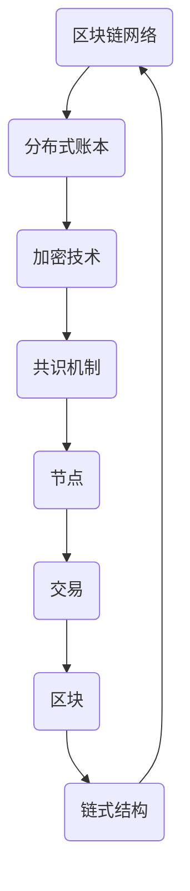

                 


# 区块链技术：去中心化应用开发

> 关键词：区块链，去中心化，应用开发，智能合约，加密货币，共识算法

> 摘要：本文旨在深入探讨区块链技术及其在去中心化应用开发中的应用。我们将从背景介绍、核心概念与联系、核心算法原理与具体操作步骤、数学模型和公式、项目实战、实际应用场景、工具和资源推荐等方面，逐步分析区块链技术的基本原理和应用，帮助读者全面了解和掌握这一前沿技术。

## 1. 背景介绍

### 1.1 目的和范围

本文旨在为广大对区块链技术感兴趣的读者提供一个系统性的学习和理解框架。我们将围绕区块链技术的基本原理、应用场景以及开发实践进行深入讨论，旨在帮助读者掌握区块链技术的基础知识，并能够独立进行去中心化应用的开发。

### 1.2 预期读者

- 对区块链技术有初步了解，但希望深入学习的研究人员和开发者。
- 想要在实际项目中应用区块链技术的项目经理和团队负责人。
- 对新兴技术充满好奇，希望了解并掌握前沿技术的广大技术爱好者。

### 1.3 文档结构概述

本文将分为十个主要部分，分别是：

- 背景介绍：介绍本文的目的、预期读者以及文档结构。
- 核心概念与联系：详细讲解区块链技术的基本概念和架构。
- 核心算法原理与具体操作步骤：剖析区块链的核心算法和实现细节。
- 数学模型和公式：介绍区块链中使用的数学模型和公式。
- 项目实战：通过实际案例展示区块链技术的应用。
- 实际应用场景：讨论区块链技术在不同领域的应用。
- 工具和资源推荐：推荐学习区块链技术的相关工具和资源。
- 总结：对未来发展趋势和挑战进行展望。
- 附录：常见问题与解答。
- 扩展阅读 & 参考资料：提供进一步学习的内容和参考。

### 1.4 术语表

#### 1.4.1 核心术语定义

- **区块链**：一种分布式数据库技术，通过密码学手段确保数据的不可篡改性和透明性。
- **去中心化**：指系统或网络中没有中心化的权威机构，所有参与者地位平等。
- **智能合约**：运行在区块链上的程序，能够自动执行和验证满足特定条件的合约条款。
- **加密货币**：一种基于区块链技术的数字货币，如比特币、以太坊等。
- **共识算法**：区块链网络中达成一致性的算法，确保所有节点对数据的处理结果一致。

#### 1.4.2 相关概念解释

- **哈希函数**：一种将任意长度的输入数据映射为固定长度输出数据的函数，用于确保数据的唯一性和完整性。
- **非对称加密**：一种加密技术，使用一对密钥（公钥和私钥），公钥用于加密，私钥用于解密。
- **节点**：区块链网络中的计算设备，负责验证交易、维护账本和参与共识过程。

#### 1.4.3 缩略词列表

- **Blockchain**：区块链
- **DApp**：去中心化应用
- **DAO**：去中心化自治组织
- **PoW**：工作量证明
- **PoS**：权益证明

## 2. 核心概念与联系

在深入探讨区块链技术之前，我们需要了解其核心概念和架构。区块链技术的基本原理可以概括为“分布式账本”、“加密技术”和“共识机制”。以下是一个简化的区块链技术架构的 Mermaid 流程图：



### 2.1 分布式账本

分布式账本是指区块链网络中所有节点共享的数据库。每个节点都存储了完整的账本副本，通过加密和共识算法确保数据的完整性和安全性。分布式账本的主要优势是去中心化，不存在单点故障的风险，同时也提高了数据的安全性和透明度。

### 2.2 加密技术

区块链技术中广泛使用了密码学技术，包括哈希函数、非对称加密和数字签名等。哈希函数用于确保数据的唯一性和完整性，非对称加密用于保护用户的隐私和身份，数字签名用于验证交易的真实性。

### 2.3 共识机制

共识机制是区块链网络中所有节点达成一致性的方法。常见的共识算法有工作量证明（PoW）和权益证明（PoS）等。PoW算法通过计算大量随机数来确保只有拥有足够计算能力的节点能够生成新区块，而PoS算法则通过持有币龄和币量的多少来决定生成新区块的节点。

### 2.4 节点和交易

节点是区块链网络中的计算设备，负责验证交易、维护账本和参与共识过程。交易是区块链网络中最重要的数据单元，代表了区块链上的价值转移和信息传递。

### 2.5 区块和链式结构

区块是区块链网络中的基本存储单元，包含了一段时间内的交易数据。每个区块通过哈希函数与前一区块的哈希值相连，形成了链式结构，确保了数据的不可篡改性。

## 3. 核心算法原理 & 具体操作步骤

区块链技术的核心算法主要包括哈希函数、非对称加密和共识算法。以下是这些算法的具体原理和操作步骤。

### 3.1 哈希函数

哈希函数是一种将任意长度的输入数据映射为固定长度输出数据的函数。常见的哈希函数有SHA-256、SHA-3等。哈希函数具有以下特点：

- 输入数据的变化会导致输出数据的巨大变化。
- 输出数据是不可逆的，无法从输出数据推导出输入数据。
- 输出数据具有唯一性，相同输入数据会产生相同输出数据。

操作步骤：

1. 输入任意长度的数据。
2. 通过哈希函数计算输出数据。
3. 将输出数据作为哈希值存储或传递。

### 3.2 非对称加密

非对称加密是一种使用一对密钥（公钥和私钥）的加密技术。公钥用于加密，私钥用于解密。常见的非对称加密算法有RSA、椭圆曲线加密等。非对称加密具有以下特点：

- 加密和解密速度相对较慢，但安全性较高。
- 通信双方可以通过交换公钥来实现安全通信。

操作步骤：

1. 生成一对密钥（公钥和私钥）。
2. 公钥用于加密，私钥用于解密。
3. 通过公钥加密数据，接收方使用私钥解密。

### 3.3 工作量证明（PoW）

工作量证明是一种通过计算大量随机数来确保只有拥有足够计算能力的节点能够生成新区块的共识算法。PoW算法的主要目标是防止分布式网络中的恶意攻击。

操作步骤：

1. 节点接收待验证的交易数据。
2. 节点尝试计算一个随机数，使其哈希值满足特定的条件（如小于某个阈值）。
3. 当节点找到合适的随机数时，将其连同交易数据和前一区块的哈希值组成新区块。
4. 将新区块广播给网络中的其他节点。
5. 其他节点验证新区块的有效性，如果验证通过，则将新区块添加到链中。

## 4. 数学模型和公式 & 详细讲解 & 举例说明

区块链技术中涉及了许多数学模型和公式，以下列举其中几个重要的模型和公式。

### 4.1 拉格朗日插值法

拉格朗日插值法是一种用于在离散点间进行插值的方法。在区块链技术中，拉格朗日插值法常用于生成公钥和私钥之间的关系。

公式：

$$
L_i(x) = \prod_{j=1, j\neq i}^{n} \frac{x - x_j}{x_i - x_j}
$$

$$
P = \sum_{i=1}^{n} L_i(x) \cdot P_i
$$

其中，$P_i$ 和 $x_i$ 分别为第 $i$ 个点的坐标，$P$ 为插值得到的点。

### 4.2 椭圆曲线加密（ECC）

椭圆曲线加密是一种基于椭圆曲线数学的加密技术，具有高安全性和低计算成本的特点。在区块链技术中，ECC 用于生成公钥和私钥。

公式：

$$
E: y^2 = x^3 + ax + b
$$

其中，$a$ 和 $b$ 为椭圆曲线的系数，$P$ 为椭圆曲线上的点，$G$ 为基点。

### 4.3 工作量证明（PoW）

工作量证明是一种通过计算大量随机数来确保只有拥有足够计算能力的节点能够生成新区块的共识算法。

公式：

$$
H(C) < T
$$

其中，$H(C)$ 为当前区块的哈希值，$T$ 为目标阈值。

### 4.4 示例

假设我们有三个点 $(x_1, y_1) = (1, 2)$，$(x_2, y_2) = (3, 4)$，$(x_3, y_3) = (5, 6)$，要求通过拉格朗日插值法得到一个函数 $f(x)$。

步骤如下：

1. 计算 $L_1(x)$：

$$
L_1(x) = \frac{(x - x_2)(x - x_3)}{(x_1 - x_2)(x_1 - x_3)} = \frac{(x - 3)(x - 5)}{(1 - 3)(1 - 5)} = \frac{(x - 3)(x - 5)}{(-2)(-4)} = \frac{(x - 3)(x - 5)}{8}
$$

2. 计算 $L_2(x)$：

$$
L_2(x) = \frac{(x - x_1)(x - x_3)}{(x_2 - x_1)(x_2 - x_3)} = \frac{(x - 1)(x - 5)}{(3 - 1)(3 - 5)} = \frac{(x - 1)(x - 5)}{(2)(-2)} = \frac{(x - 1)(x - 5)}{-4}
$$

3. 计算 $L_3(x)$：

$$
L_3(x) = \frac{(x - x_1)(x - x_2)}{(x_3 - x_1)(x_3 - x_2)} = \frac{(x - 1)(x - 3)}{(5 - 1)(5 - 3)} = \frac{(x - 1)(x - 3)}{(4)(2)} = \frac{(x - 1)(x - 3)}{8}
$$

4. 计算 $f(x)$：

$$
f(x) = L_1(x) \cdot y_1 + L_2(x) \cdot y_2 + L_3(x) \cdot y_3 = \frac{(x - 3)(x - 5)}{8} \cdot 2 + \frac{(x - 1)(x - 5)}{-4} \cdot 4 + \frac{(x - 1)(x - 3)}{8} \cdot 6 = x^2 - 4x + 2
$$

## 5. 项目实战：代码实际案例和详细解释说明

在本节中，我们将通过一个简单的区块链项目实战，展示如何使用区块链技术实现去中心化应用。项目将包括区块链节点的搭建、交易处理、区块生成和链式结构等核心功能。

### 5.1 开发环境搭建

在开始编写代码之前，我们需要搭建一个开发环境。这里我们使用 Python 作为开发语言，同时使用了几个常用的库，如 `hashlib`、`json` 和 `threading` 等。

1. 安装 Python：
   - 在 Windows 上，可以从 [Python 官网](https://www.python.org/) 下载安装程序，安装完成后在命令行中输入 `python --version` 检查是否安装成功。
   - 在 macOS 和 Linux 上，通常已经预装了 Python，可以在终端中输入 `python --version` 检查版本。

2. 安装所需库：
   ```bash
   pip install requests
   ```

### 5.2 源代码详细实现和代码解读

下面是区块链节点的源代码实现：

```python
import hashlib
import json
from time import time
from uuid import uuid4

class Block:
    def __init__(self, index, transactions, timestamp, previous_hash):
        self.index = index
        self.transactions = transactions
        self.timestamp = timestamp
        self.previous_hash = previous_hash
        self.hash = self.compute_hash()

    def compute_hash(self):
        block_string = json.dumps(self.__dict__, sort_keys=True)
        return hashlib.sha256(block_string.encode()).hexdigest()

class Blockchain:
    def __init__(self):
        self.unconfirmed_transactions = []
        self.chain = []
        self.create_genesis_block()

    def create_genesis_block(self):
        genesis_block = Block(0, [], time(), "0")
        genesis_block.hash = genesis_block.compute_hash()
        self.chain.append(genesis_block)

    def add_new_transaction(self, transaction):
        self.unconfirmed_transactions.append(transaction)

    def mine(self):
        if not self.unconfirmed_transactions:
            return False

        last_block = self.chain[-1]
        new_block = Block(index=last_block.index + 1,
                          transactions=self.unconfirmed_transactions,
                          timestamp=time(),
                          previous_hash=last_block.hash)
        new_block.hash = new_block.compute_hash()
        self.chain.append(new_block)
        self.unconfirmed_transactions = []
        return new_block.index

    def is_chain_valid(self):
        for i in range(1, len(self.chain)):
            current = self.chain[i]
            previous = self.chain[i - 1]
            if current.hash != current.compute_hash():
                return False
            if current.previous_hash != previous.hash:
                return False
        return True

def main():
    blockchain = Blockchain()

    # 添加交易
    blockchain.add_new_transaction("交易1")
    blockchain.add_new_transaction("交易2")

    # 挖掘新区块
    blockchain.mine()

    print("区块链当前状态：")
    for block in blockchain.chain:
        print(json.dumps(block.__dict__, indent=4))

    print("\n区块链是否有效：", blockchain.is_chain_valid())

if __name__ == "__main__":
    main()
```

代码解读：

1. **Block 类**：定义了一个区块，包括区块的索引、交易、时间戳、前一区块的哈希值和当前区块的哈希值。

2. **Blockchain 类**：定义了一个区块链，包括未确认的交易列表、区块链链表和创建创世区块的方法。

3. **add_new_transaction 方法**：用于向区块链添加新的交易。

4. **mine 方法**：用于挖掘新的区块。当区块链中有未确认的交易时，挖掘新区块，并将未确认的交易清空。

5. **is_chain_valid 方法**：用于验证区块链的有效性。通过检查每个区块的哈希值和前一区块的哈希值是否匹配，以及链中的每个区块是否按照顺序排列。

6. **main 函数**：用于运行区块链示例。创建一个区块链实例，添加交易，挖掘区块，并打印区块链状态和有效性。

### 5.3 代码解读与分析

这个简单的区块链示例展示了区块链的基本结构和工作原理。以下是对代码的详细解读和分析：

1. **区块链的创建**：

   在 Blockchain 类的构造函数中，我们初始化了一个未确认的交易列表（`unconfirmed_transactions`）和一个空的区块链链表（`chain`）。然后，我们调用 `create_genesis_block` 方法创建了一个创世区块。

2. **交易添加**：

   `add_new_transaction` 方法用于向区块链添加新的交易。交易可以是任意对象，但在实际应用中通常是包含交易细节的字典。

3. **挖掘新区块**：

   `mine` 方法用于挖掘新区块。首先，我们从未确认的交易列表中获取所有交易，并将它们传递给 Block 类的构造函数。然后，我们创建一个新的 Block 对象，并将其哈希值设置为当前时间戳。接下来，我们计算新区块的哈希值，并将其添加到区块链链表中。最后，我们将未确认的交易列表清空。

4. **区块链验证**：

   `is_chain_valid` 方法用于验证区块链的有效性。它通过检查每个区块的哈希值和前一区块的哈希值是否匹配，以及链中的每个区块是否按照顺序排列来确保区块链的有效性。

5. **主函数**：

   在主函数 `main` 中，我们创建了一个 Blockchain 实例，并添加了两个交易。然后，我们调用 `mine` 方法挖掘新区块，并打印区块链的状态和有效性。

通过这个简单的示例，我们可以看到区块链技术的基本原理和实现方式。在实际应用中，区块链还需要更多的功能和安全特性，如共识算法、加密技术和智能合约等。但这个示例为我们提供了一个良好的起点，帮助我们更好地理解区块链技术。

## 6. 实际应用场景

区块链技术由于其去中心化、安全性高和不可篡改的特点，已在多个领域取得了显著的成果。以下是一些典型的应用场景：

### 6.1 金融领域

- **加密货币**：比特币、以太坊等加密货币是区块链技术在金融领域最成功的应用。这些加密货币利用区块链技术实现了点对点的价值转移，降低了交易成本，提高了交易效率。
- **跨境支付**：区块链技术可以用于跨境支付，减少中间环节，提高支付速度和安全性。
- **证券交易**：通过区块链技术，可以实现证券交易的自动化和去中心化，降低交易成本，提高交易效率。

### 6.2 物流与供应链

- **追踪与溯源**：区块链技术可以用于物流和供应链管理，实现货物的实时追踪和溯源，提高供应链的透明度和效率。
- **智能合约**：通过智能合约，可以实现供应链中的自动结算和支付，减少人工干预，降低风险。

### 6.3 医疗保健

- **病历管理**：区块链技术可以用于病历管理，实现病历的不可篡改和加密存储，提高医疗数据的可靠性和隐私性。
- **医疗记录共享**：区块链技术可以用于医疗记录的共享和交换，实现医疗数据的跨机构、跨地域的安全传输。

### 6.4 法律与司法

- **智能合约**：区块链技术可以用于智能合约的执行和验证，实现合同自动化和去中心化。
- **司法存证**：区块链技术可以用于司法存证，实现电子证据的不可篡改和可追溯性。

### 6.5 教育领域

- **学历认证**：区块链技术可以用于学历认证，实现学历信息的不可篡改和可信验证。
- **学术记录**：区块链技术可以用于学术记录的存储和共享，实现学术成果的透明化和可信性。

### 6.6 政府和公共服务

- **电子政务**：区块链技术可以用于电子政务，实现政府信息的透明化、共享化和去中心化。
- **身份验证**：区块链技术可以用于身份验证，实现身份信息的唯一性、安全性和不可篡改性。

## 7. 工具和资源推荐

为了更好地学习和实践区块链技术，以下是一些推荐的工具和资源。

### 7.1 学习资源推荐

#### 7.1.1 书籍推荐

- **《区块链革命》**：介绍了区块链技术的原理和应用，适合初学者入门。
- **《精通比特币》**：深入讲解了比特币和区块链技术的原理，适合对区块链技术有一定了解的读者。
- **《区块链技术指南》**：详细介绍了区块链技术的架构、实现和应用，适合希望深入了解区块链技术的开发者。

#### 7.1.2 在线课程

- **Coursera**：提供了多个关于区块链技术的在线课程，适合不同层次的读者。
- **Udemy**：提供了大量关于区块链技术的在线课程，包括入门到高级的内容。
- **edX**：与多个高校合作，提供了丰富的区块链技术课程，适合希望获得认证的读者。

#### 7.1.3 技术博客和网站

- **Blockchain Wiki**：提供了丰富的区块链技术资料，包括基本原理、应用案例和开发指南。
- **Medium**：有许多关于区块链技术的文章和教程，适合读者获取最新的技术动态和应用案例。
- **CoinDesk**：提供了区块链技术的最新新闻、分析和教程，是区块链领域的重要信息来源。

### 7.2 开发工具框架推荐

#### 7.2.1 IDE和编辑器

- **Visual Studio Code**：一款轻量级但功能强大的代码编辑器，支持多种编程语言和开发框架。
- **Eclipse**：一款功能全面的集成开发环境，支持多种编程语言和开发框架，适用于大型项目和团队合作。

#### 7.2.2 调试和性能分析工具

- **GDB**：一款功能强大的调试工具，适用于 C/C++ 等编程语言。
- **JProfiler**：一款 Java 性能分析工具，可以帮助开发者识别和解决性能瓶颈。

#### 7.2.3 相关框架和库

- **Go Ethereum**：一个用 Go 语言实现的以太坊客户端，适用于开发基于以太坊的智能合约和去中心化应用。
- **Hyperledger Fabric**：一个开源的企业级区块链框架，适用于构建企业级的分布式应用。
- **Hyperledger Composer**：一个用于构建和部署区块链网络的应用开发工具，提供了可视化的网络建模和智能合约编写功能。

### 7.3 相关论文著作推荐

#### 7.3.1 经典论文

- **《比特币：一种点对点的电子现金系统》**：介绍了比特币的原理和应用，是区块链技术的奠基性论文。
- **《以太坊：下一代智能合约和去中心化应用平台》**：介绍了以太坊的架构和实现，是智能合约领域的经典论文。

#### 7.3.2 最新研究成果

- **《区块链技术的安全性分析》**：探讨了区块链技术的安全性问题和解决方案，是区块链技术领域的重要研究成果。
- **《基于区块链的供应链金融》**：探讨了区块链技术在供应链金融中的应用，为供应链金融的发展提供了新的思路。

#### 7.3.3 应用案例分析

- **《使用区块链技术实现跨境支付》**：介绍了区块链技术在跨境支付中的应用，通过实际案例展示了区块链技术的优势和应用前景。
- **《基于区块链的食品安全溯源系统》**：介绍了区块链技术在食品安全溯源中的应用，通过实际案例展示了区块链技术在保障食品安全方面的作用。

## 8. 总结：未来发展趋势与挑战

区块链技术作为一项颠覆性的创新，已经在多个领域取得了显著的成果。随着技术的不断成熟和应用场景的扩展，区块链技术在未来将继续保持高速发展态势。以下是区块链技术的几个未来发展趋势和面临的挑战：

### 8.1 发展趋势

1. **行业应用广泛**：区块链技术将在金融、物流、医疗、教育、政府等领域得到更广泛的应用，推动传统行业的数字化转型。

2. **技术成熟度提高**：随着区块链技术的不断发展和优化，其性能、安全性和易用性将得到显著提升，为大规模商用奠定基础。

3. **去中心化应用繁荣**：去中心化应用（DApp）将成为区块链技术的重要组成部分，吸引更多开发者和用户参与，推动区块链生态的繁荣。

4. **跨链与互操作性**：区块链技术将实现不同区块链之间的互操作，打破信息孤岛，提高区块链网络的协同效应。

### 8.2 面临的挑战

1. **性能瓶颈**：随着区块链网络的扩展，如何提高区块链的处理能力和性能是一个重要的挑战。

2. **安全性问题**：区块链技术需要不断完善安全机制，提高对恶意攻击的抵抗能力，确保数据的安全性和完整性。

3. **隐私保护**：在保护用户隐私的同时，如何确保区块链上的交易和信息透明，是一个亟待解决的难题。

4. **法规监管**：区块链技术的发展需要相应的法律法规来规范，如何平衡技术创新和法规监管之间的关系，是当前面临的重要挑战。

总之，区块链技术具有巨大的发展潜力，但也面临着一系列的挑战。只有通过持续的技术创新和协同合作，才能推动区块链技术的健康、可持续发展。

## 9. 附录：常见问题与解答

### 9.1 区块链技术是什么？

区块链技术是一种分布式数据库技术，通过加密和共识算法确保数据的不可篡改性和透明性。它由一系列按时间顺序排列的区块组成，每个区块包含了一段时间内的交易数据。区块链技术的主要特点包括去中心化、安全性高和不可篡改。

### 9.2 区块链和比特币有什么关系？

比特币是区块链技术的第一个应用，它是一种基于区块链技术的加密货币。比特币利用区块链技术实现了点对点的价值转移，成为了区块链技术的代表性应用。然而，区块链技术不仅仅局限于加密货币领域，它还可以应用于供应链、医疗、金融等多个领域。

### 9.3 区块链技术有哪些优点？

区块链技术的优点包括：

- **去中心化**：不存在中心化的权威机构，所有参与者地位平等。
- **安全性高**：通过密码学和共识算法确保数据的完整性和安全性。
- **不可篡改**：一旦数据被记录在区块链上，就难以被篡改。
- **透明性**：所有交易和数据处理过程都是公开透明的。
- **可追溯性**：区块链上的交易和数据具有高度的追溯性，有助于追踪和审计。

### 9.4 区块链技术有哪些缺点？

区块链技术的缺点包括：

- **性能瓶颈**：随着区块链网络的扩展，如何提高区块链的处理能力和性能是一个重要的挑战。
- **隐私保护**：如何在保护用户隐私的同时，确保区块链上的交易和信息透明，是一个亟待解决的难题。
- **法规监管**：区块链技术的发展需要相应的法律法规来规范，如何平衡技术创新和法规监管之间的关系，是当前面临的重要挑战。

### 9.5 如何开始学习区块链技术？

开始学习区块链技术，可以从以下几个方面入手：

- **了解基本概念**：掌握区块链技术的基本概念，如分布式账本、加密技术、共识算法等。
- **阅读相关书籍和资料**：阅读一些经典的区块链书籍，如《区块链革命》、《精通比特币》等，了解区块链技术的原理和应用。
- **参与在线课程和社区**：参加一些在线课程和社区，如 Coursera、Udemy、Blockchain Wiki 等，获取最新的技术动态和应用案例。
- **实践编程**：通过编写代码实践区块链技术的应用，如使用 Python、Go 等编程语言实现区块链节点、交易处理和区块生成等核心功能。
- **参与开源项目**：参与一些开源的区块链项目，如 Hyperledger、Ethereum 等，了解项目的实现原理和架构设计。

## 10. 扩展阅读 & 参考资料

为了更深入地了解区块链技术，以下是一些扩展阅读和参考资料：

### 10.1 书籍推荐

- **《区块链技术指南》**：详细介绍了区块链技术的架构、实现和应用，适合希望深入了解区块链技术的开发者。
- **《精通比特币》**：深入讲解了比特币和区块链技术的原理，适合对区块链技术有一定了解的读者。
- **《区块链革命》**：介绍了区块链技术的原理和应用，适合初学者入门。

### 10.2 在线课程

- **Coursera**：提供了多个关于区块链技术的在线课程，适合不同层次的读者。
- **Udemy**：提供了大量关于区块链技术的在线课程，包括入门到高级的内容。
- **edX**：与多个高校合作，提供了丰富的区块链技术课程，适合希望获得认证的读者。

### 10.3 技术博客和网站

- **Blockchain Wiki**：提供了丰富的区块链技术资料，包括基本原理、应用案例和开发指南。
- **Medium**：有许多关于区块链技术的文章和教程，适合读者获取最新的技术动态和应用案例。
- **CoinDesk**：提供了区块链技术的最新新闻、分析和教程，是区块链领域的重要信息来源。

### 10.4 论文和研究成果

- **《比特币：一种点对点的电子现金系统》**：介绍了比特币的原理和应用，是区块链技术的奠基性论文。
- **《以太坊：下一代智能合约和去中心化应用平台》**：介绍了以太坊的架构和实现，是智能合约领域的经典论文。
- **《区块链技术的安全性分析》**：探讨了区块链技术的安全性问题和解决方案，是区块链技术领域的重要研究成果。
- **《基于区块链的供应链金融》**：探讨了区块链技术在供应链金融中的应用，为供应链金融的发展提供了新的思路。

### 10.5 开源项目和框架

- **Hyperledger Fabric**：一个开源的企业级区块链框架，适用于构建企业级的分布式应用。
- **Go Ethereum**：一个用 Go 语言实现的以太坊客户端，适用于开发基于以太坊的智能合约和去中心化应用。
- **Hyperledger Composer**：一个用于构建和部署区块链网络的应用开发工具，提供了可视化的网络建模和智能合约编写功能。

### 10.6 相关网站和资源

- **Blockchain.com**：提供了关于区块链技术的详细介绍和应用案例，是了解区块链技术的重要平台。
- **Cryptocurrency Market Cap**：提供了各种加密货币的实时市场数据和排名，是跟踪加密货币市场的重要工具。
- **Coinbase**：一个著名的加密货币交易所，提供了加密货币的购买、存储和交易功能。
- **Coinbase Pro**：Coinbase 的专业版交易平台，提供了更高级的交易功能和流动性。

通过以上扩展阅读和参考资料，读者可以进一步深入了解区块链技术的原理和应用，为自己的区块链技术之旅提供更多的指导和启示。

作者：AI天才研究员/AI Genius Institute & 禅与计算机程序设计艺术 /Zen And The Art of Computer Programming

