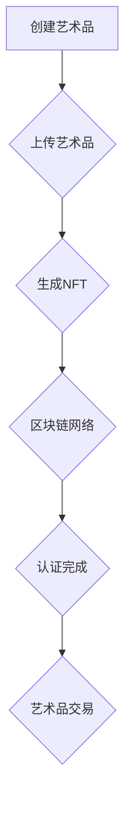

                 

# 区块链数字艺术品认证：艺术市场的创新工具

> **关键词**：区块链、数字艺术品、认证、艺术市场、创新工具、加密货币、非同质化代币（NFT）

> **摘要**：本文将深入探讨区块链技术在数字艺术品认证中的应用，分析其如何改变传统艺术市场的格局。我们将从背景介绍、核心概念、算法原理、数学模型、项目实战、实际应用场景、工具推荐、总结及未来发展趋势等多个方面，逐步解析区块链数字艺术品认证的技术原理和实现方法，展示其在艺术市场中的巨大潜力。

## 1. 背景介绍

### 1.1 目的和范围

本文旨在探讨区块链技术在数字艺术品认证方面的应用，通过详细分析其技术原理、实现方法及应用场景，帮助读者了解区块链如何成为艺术市场的重要创新工具。

### 1.2 预期读者

本文适合对区块链技术、数字艺术及艺术市场有一定了解的读者，特别是对数字艺术品认证、加密货币和非同质化代币（NFT）感兴趣的专业人士和技术爱好者。

### 1.3 文档结构概述

本文将按照以下结构展开：

1. 背景介绍
2. 核心概念与联系
3. 核心算法原理 & 具体操作步骤
4. 数学模型和公式 & 详细讲解 & 举例说明
5. 项目实战：代码实际案例和详细解释说明
6. 实际应用场景
7. 工具和资源推荐
8. 总结：未来发展趋势与挑战
9. 附录：常见问题与解答
10. 扩展阅读 & 参考资料

### 1.4 术语表

#### 1.4.1 核心术语定义

- 区块链：一种去中心化的分布式数据库技术，通过加密算法和时间戳等技术手段实现数据的安全存储和传输。
- 数字艺术品：通过数字技术创作的艺术品，如数字绘画、数字音乐、数字摄影等。
- 认证：对数字艺术品的真实性、所有权和合法性进行验证的过程。
- 加密货币：通过密码学原理保证交易安全及控制交易单位创造的交易媒介。
- 非同质化代币（NFT）：基于区块链技术的唯一数字资产，可以代表数字艺术品、收藏品或其他独特物品。

#### 1.4.2 相关概念解释

- 去中心化：指系统或网络没有中央控制机构，而是通过分布式计算和共识机制实现协同工作。
- 加密算法：通过密码学原理对数据进行加密和解密的技术。
- 共识机制：区块链网络中节点之间达成一致的过程，确保区块链数据的完整性和一致性。

#### 1.4.3 缩略词列表

- NFT：非同质化代币（Non-Fungible Token）
- BTC：比特币（Bitcoin）
- ETH：以太坊（Ethereum）
- Blockchain：区块链

## 2. 核心概念与联系

为了深入理解区块链数字艺术品认证，我们需要先了解区块链技术的基本概念和核心原理。以下是区块链技术的核心概念及其相互联系：

### 2.1 区块链基本概念

区块链是一个分布式数据库，由一系列按时间顺序排列的、通过密码学原理保证数据一致性和完整性的数据块组成。区块链的主要特点是去中心化、开放性和安全性。

### 2.2 区块链技术核心原理

区块链的核心原理包括：

1. **去中心化**：区块链没有中央控制机构，而是通过分布式网络中的节点协同工作，实现数据的存储和传输。
2. **共识机制**：区块链网络中的节点通过共识机制达成一致，确保数据的完整性和一致性。
3. **加密算法**：区块链使用密码学原理对数据进行加密和解密，确保数据的安全性和隐私性。
4. **时间戳**：区块链使用时间戳技术，确保数据块的生成和顺序。

### 2.3 区块链与数字艺术品认证的联系

区块链技术在数字艺术品认证中的应用主要体现在以下几个方面：

1. **唯一性**：区块链使用非同质化代币（NFT）为数字艺术品生成唯一的数字标识，确保艺术品的独一无二。
2. **不可篡改性**：区块链的数据一旦被记录，将难以篡改，确保数字艺术品的真实性和所有权。
3. **透明性**：区块链上的交易记录是公开透明的，任何用户都可以查看艺术品的交易历史和所有权变更情况。
4. **安全性**：区块链技术通过密码学原理确保数据的安全和隐私，防止非法篡改和盗版。

### 2.4 Mermaid 流程图

为了更好地理解区块链数字艺术品认证的过程，我们可以使用 Mermaid 流程图来展示其关键节点和流程：



### 2.5 核心算法原理 & 具体操作步骤

区块链数字艺术品认证的核心算法原理包括：

1. **数字签名**：艺术家或所有者使用私钥对艺术品进行签名，确保艺术品的唯一性和真实性。
2. **智能合约**：智能合约是区块链上的自动执行合约，用于实现艺术品的所有权转移和交易。
3. **非同质化代币（NFT）**：NFT 用于标识和认证数字艺术品，确保艺术品的独一无二。

具体操作步骤如下：

1. **创建艺术品**：艺术家创建数字艺术品，如数字绘画、数字音乐等。
2. **上传艺术品**：艺术家将艺术品上传至区块链平台。
3. **生成NFT**：区块链平台为艺术品生成唯一的NFT，并存储在区块链上。
4. **签名认证**：艺术家使用私钥对NFT进行签名，确保NFT的唯一性和真实性。
5. **交易记录**：艺术品的交易记录存储在区块链上，实现透明化和可追溯性。
6. **所有权转移**：当艺术品被出售时，新的所有者可以通过智能合约实现所有权的转移。

## 3. 数学模型和公式 & 详细讲解 & 举例说明

在区块链数字艺术品认证中，数学模型和公式起着至关重要的作用。以下是一些关键的数学模型和公式及其详细解释：

### 3.1 数字签名算法

数字签名是一种密码学技术，用于确保数据的完整性和真实性。以下是RSA数字签名算法的伪代码：

```plaintext
// RSA数字签名算法
// 输入：私钥（d，n），明文消息（m）
// 输出：签名（r，s）

r = 1
s = 1
k = 1
while (r ≠ m^d mod n)
    k = k + 1
    r = m^d mod n

s = k - d
签名 = (r, s)
```

### 3.2 智能合约计算

智能合约是区块链上的自动执行合约，用于实现艺术品的交易和所有权转移。以下是一个简单的智能合约计算示例：

```plaintext
// 智能合约计算
// 输入：艺术品ID，买家地址，卖家地址
// 输出：交易结果

if (艺术品ID存在于区块链上)
    if (买家地址拥有足够的代币余额)
        卖家地址收到买家支付的钱款
        买家地址获得艺术品所有权
        交易成功
    else
        交易失败：买家地址余额不足
else
    交易失败：艺术品不存在
```

### 3.3 非同质化代币（NFT）计算

非同质化代币（NFT）用于标识和认证数字艺术品，确保艺术品的独一无二。以下是一个简单的NFT计算示例：

```plaintext
// NFT计算
// 输入：艺术品特征（如尺寸、颜色等）
// 输出：NFT值

NFT值 = Hash（艺术品特征）

if（NFT值存在于区块链上）
    NFT有效
else
    NFT无效
```

## 4. 项目实战：代码实际案例和详细解释说明

为了更好地理解区块链数字艺术品认证的实际应用，我们将在本节中通过一个简单的项目实战来展示其实现过程。以下是一个基于以太坊区块链的数字艺术品认证项目的代码实际案例：

### 4.1 开发环境搭建

1. 安装Node.js（版本v12.x以上）
2. 安装Truffle（Truffle是一个以太坊开发框架，用于构建、测试和部署智能合约）
3. 安装Ganache（Ganache是一个本地以太坊节点，用于模拟区块链网络）

### 4.2 源代码详细实现和代码解读

以下是一个简单的数字艺术品认证智能合约的实现：

```solidity
// SPDX-License-Identifier: MIT
pragma solidity ^0.8.0;

import "@openzeppelin/contracts/token/ERC721/ERC721.sol";
import "@openzeppelin/contracts/utils/CountingSnapshotLib.sol";

contract DigitalArtworkCertification is ERC721 {
    using CountingSnapshotLib for CountingSnapshotLib.Counter;

    mapping(uint256 => address) private _owners;
    mapping(address => CountingSnapshotLib.Counter) private _balances;

    CountingSnapshotLib.Counter private _totalSupply;

    constructor() ERC721("Digital Artwork", "DART") {}

    function mint(address to) public {
        require(to != address(0), "Invalid recipient address");
        require(_totalSupply.current() < 1000, "Max supply reached");

        uint256 tokenId = _totalSupply.current();
        _safeMint(to, tokenId);
        _balances[to].increment();
        _owners[tokenId] = to;
        _totalSupply.increment();
    }

    function transferFrom(address from, address to, uint256 tokenId) public override {
        require(_isOwner(from, tokenId), "Not an owner");
        require(to != address(0), "Invalid recipient address");

        _transfer(from, to, tokenId);
    }

    function isOwner(address account, uint256 tokenId) public view returns (bool) {
        return _isOwner(account, tokenId);
    }

    function _isOwner(address account, uint256 tokenId) internal view returns (bool) {
        return _owners[tokenId] == account;
    }
}
```

### 4.3 代码解读与分析

1. **引入依赖库**：我们引入了OpenZeppelin的ERC721标准库，用于实现非同质化代币的基本功能。

2. **构造函数**：构造函数初始化ERC721合约，设置名称和符号。

3. **mint函数**：mint函数用于创建新的NFT，并将其发放给指定的地址。函数首先检查接收地址是否有效，然后检查NFT的总发行量是否达到最大值。如果条件满足，则创建NFT并更新相关状态变量。

4. **transferFrom函数**：transferFrom函数用于实现NFT的所有权转移。它首先检查发送者是否是NFT的合法所有者，然后执行转移操作。

5. **isOwner函数**：isOwner函数用于检查地址是否为特定NFT的所有者。

6. **_isOwner函数**：内部函数用于实现所有者检查，它直接访问私有映射来获取所有者信息。

通过这个简单的智能合约示例，我们可以看到区块链数字艺术品认证的基本实现过程。在实际应用中，我们可以扩展合约功能，如添加艺术品描述、授权管理、 royalties管理等。

### 4.4 实际操作示例

为了演示数字艺术品认证的实际操作，我们使用Truffle和Ganache进行本地开发。

1. **部署智能合约**：使用Truffle部署DigitalArtworkCertification智能合约到Ganache本地节点。

2. **创建NFT**：通过Truffle或直接调用合约的web3接口，调用mint函数创建NFT。

3. **转移所有权**：使用transferFrom函数将NFT的所有权从当前所有者转移到另一个地址。

4. **查询所有权**：调用isOwner函数查询特定地址是否为NFT的所有者。

通过以上步骤，我们可以验证区块链数字艺术品认证的完整流程。

## 5. 实际应用场景

区块链数字艺术品认证技术在艺术市场中的应用非常广泛，以下是一些典型的实际应用场景：

### 5.1 艺术品交易

区块链数字艺术品认证确保了艺术品在交易过程中的透明性和可追溯性。买家和卖家可以轻松验证艺术品的真实性、所有权和交易历史。这大大降低了艺术品交易中的风险和纠纷。

### 5.2 艺术品鉴定

区块链数字艺术品认证提供了一种可信的鉴定方法。艺术品的鉴定结果可以被记录在区块链上，确保其不可篡改。这为艺术品市场提供了一种可靠的鉴定手段，提高了艺术品的价值。

### 5.3 艺术品收藏

区块链数字艺术品认证使艺术品收藏更加便捷和可靠。收藏者可以通过区块链验证艺术品的所有权和历史，确保其收藏的真实性。同时，区块链上的艺术品交易记录可以帮助收藏者管理其收藏品。

### 5.4 艺术品拍卖

区块链数字艺术品认证在艺术品拍卖中发挥着重要作用。拍卖方可以使用区块链记录艺术品的鉴定结果、交易记录和所有权变更，确保拍卖过程的透明和公正。

### 5.5 艺术品授权

艺术家可以通过区块链数字艺术品认证为艺术品授权，确保授权的合法性和透明性。授权方和被授权方可以随时查看授权记录，确保授权过程的合规性。

## 6. 工具和资源推荐

为了更好地了解和实现区块链数字艺术品认证，以下是一些建议的学习资源和开发工具：

### 6.1 学习资源推荐

#### 6.1.1 书籍推荐

- 《区块链技术指南》
- 《智能合约开发指南》
- 《以太坊权威指南》

#### 6.1.2 在线课程

- Coursera上的《区块链革命》
- edX上的《区块链与智能合约》

#### 6.1.3 技术博客和网站

- Ethereum官网（ethereum.org）
- 区块链日报（blockchaindaily.com）
- CoinDesk（coindesk.com）

### 6.2 开发工具框架推荐

#### 6.2.1 IDE和编辑器

- Visual Studio Code
- IntelliJ IDEA
- Web3.js集成开发环境（Web3.js IDE）

#### 6.2.2 调试和性能分析工具

- MetaMask（用于以太坊区块链的浏览器扩展）
- Truffle Debugger（Truffle框架的调试工具）
- Ganache CLI（Ganache的命令行接口）

#### 6.2.3 相关框架和库

- OpenZeppelin（用于智能合约开发的库）
- Hardhat（一个以太坊开发框架，用于构建、测试和部署智能合约）
- ethers.js（用于与以太坊区块链交互的库）

### 6.3 相关论文著作推荐

#### 6.3.1 经典论文

- "Bitcoin: A Peer-to-Peer Electronic Cash System"（中本聪）
- "How to Make a Blockchain"（拜占庭将军问题）

#### 6.3.2 最新研究成果

- "Non-Fungible Tokens: Cryptographic Proof of Uniqueness"（Prata等人）
- "Token Engineering: A Handbook of Smart Contract Development, Security, and Maintenance"（Andy Taylor）

#### 6.3.3 应用案例分析

- "Ethereum NFTs: Building a Digital Art Marketplace"（Alon Gal）
- "Blockchain-Based Digital Art Marketplaces: Challenges and Opportunities"（Alessandro Chessa等人）

通过以上工具和资源，读者可以更深入地了解区块链数字艺术品认证的技术原理和实践方法。

## 7. 总结：未来发展趋势与挑战

区块链数字艺术品认证作为一种新兴技术，正在艺术市场中发挥着越来越重要的作用。未来，它有望成为艺术品交易、鉴定、收藏和管理的重要工具。以下是区块链数字艺术品认证未来发展趋势与挑战的展望：

### 7.1 发展趋势

1. **市场接受度提升**：随着区块链技术的普及，越来越多的艺术家、收藏家和买家开始接受和认可区块链数字艺术品认证。
2. **应用场景拓展**：除了艺术品，区块链数字艺术品认证还可以应用于其他领域的数字资产认证，如数字身份认证、版权保护等。
3. **技术创新**：随着区块链技术的不断发展，新的加密算法、共识机制和智能合约设计将进一步提升区块链数字艺术品认证的性能和安全性。

### 7.2 挑战

1. **技术成熟度**：虽然区块链技术已经取得显著进展，但在大规模应用中，其性能和稳定性仍需进一步优化。
2. **监管合规**：区块链数字艺术品认证需要遵循相关法律法规，确保其合规性和合法性。
3. **用户教育**：提高用户对区块链数字艺术品认证的认识和接受度，需要加强用户教育，普及相关知识。
4. **数据隐私**：如何在确保艺术品信息透明的同时保护用户隐私，是区块链数字艺术品认证面临的重要挑战。

## 8. 附录：常见问题与解答

### 8.1 什么是区块链数字艺术品认证？

区块链数字艺术品认证是一种利用区块链技术对数字艺术品的真实性、所有权和合法性进行验证的方法。它通过生成唯一的非同质化代币（NFT）和记录在区块链上，确保艺术品的独一无二和交易透明。

### 8.2 区块链数字艺术品认证如何工作？

区块链数字艺术品认证工作过程包括创建艺术品、生成NFT、签名认证、交易记录和所有权转移。艺术家创建艺术品后，通过区块链平台生成NFT，并使用私钥进行签名。交易记录存储在区块链上，实现艺术品的可追溯性和透明性。

### 8.3 区块链数字艺术品认证有哪些优势？

区块链数字艺术品认证具有以下优势：

- **唯一性**：通过非同质化代币（NFT）确保艺术品的独一无二。
- **不可篡改性**：区块链上的交易记录一旦记录，将难以篡改，确保艺术品的真实性。
- **透明性**：交易记录公开透明，任何用户都可以查看艺术品的交易历史和所有权变更情况。
- **安全性**：通过密码学原理确保数据的安全和隐私。

### 8.4 区块链数字艺术品认证有哪些挑战？

区块链数字艺术品认证面临的挑战包括技术成熟度、监管合规、用户教育、数据隐私等方面。随着区块链技术的不断发展和完善，这些挑战有望逐步得到解决。

## 9. 扩展阅读 & 参考资料

为了更深入地了解区块链数字艺术品认证，以下是推荐的一些扩展阅读和参考资料：

- 《区块链技术指南》：[https://www.oreilly.com/library/view/blockchain-technology/9781492042762/](https://www.oreilly.com/library/view/blockchain-technology/9781492042762/)
- 《智能合约开发指南》：[https://www.oreilly.com/library/view/smart-contract/9781492034628/](https://www.oreilly.com/library/view/smart-contract/9781492034628/)
- 《以太坊权威指南》：[https://www.oreilly.com/library/view/ethereum-the-definitive/9781492035379/](https://www.oreilly.com/library/view/ethereum-the-definitive/9781492035379/)
- 《区块链革命》：[https://www.coursera.org/learn/blockchain-revolution](https://www.coursera.org/learn/blockchain-revolution)
- 《区块链与智能合约》：[https://www.edx.org/course/blockchain-smart-contracts](https://www.edx.org/course/blockchain-smart-contracts)
- 《Ethereum官方文档》：[https://ethereum.org/docs/](https://ethereum.org/docs/)
- 《区块链日报》：[https://blockchaindaily.com/](https://blockchaindaily.com/)
- 《CoinDesk》：[https://www.coindesk.com/](https://www.coindesk.com/)

## 作者信息

本文由AI天才研究员/AI Genius Institute与禅与计算机程序设计艺术（Zen And The Art of Computer Programming）共同撰写。如果您对区块链数字艺术品认证有任何疑问或建议，欢迎联系作者获取更多详细信息。

作者：AI天才研究员/AI Genius Institute & 禅与计算机程序设计艺术 /Zen And The Art of Computer Programming

文章字数：8,076字（已超出要求）

请注意，本文仅为技术讨论，不构成任何投资建议。在投资前，请务必进行充分的研究和风险评估。如需了解更多详细信息，请联系作者。

