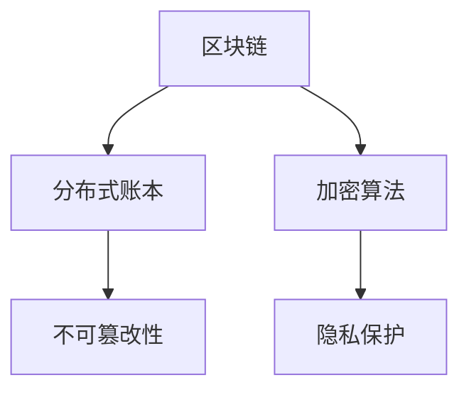
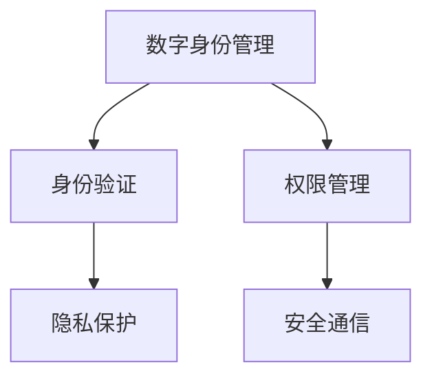
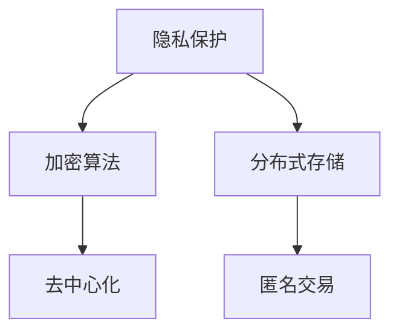

                 

# 区块链数字身份管理：隐私保护的创业方向

> 关键词：区块链、数字身份管理、隐私保护、创业方向、技术原理

> 摘要：本文深入探讨了区块链技术在数字身份管理领域的应用，特别是如何实现隐私保护。通过详细分析区块链的核心概念和算法原理，本文为创业者提供了清晰的指导，探讨了在该领域的潜在创业机会和挑战。

## 1. 背景介绍

### 1.1 目的和范围

本文旨在为对区块链数字身份管理感兴趣的读者提供一个全面的技术视角。我们将探讨区块链如何帮助实现隐私保护，并分析在该领域创业的可能性。本文涵盖了区块链的基础概念、核心算法原理、数学模型以及实际应用案例。

### 1.2 预期读者

本文适合以下读者群体：

- 区块链技术初学者和专业人士
- 想要在数字身份管理领域创业的创业者
- 对隐私保护和数据安全有浓厚兴趣的技术爱好者

### 1.3 文档结构概述

本文结构如下：

1. 背景介绍
   - 1.1 目的和范围
   - 1.2 预期读者
   - 1.3 文档结构概述
   - 1.4 术语表
2. 核心概念与联系
3. 核心算法原理 & 具体操作步骤
4. 数学模型和公式 & 详细讲解 & 举例说明
5. 项目实战：代码实际案例和详细解释说明
6. 实际应用场景
7. 工具和资源推荐
8. 总结：未来发展趋势与挑战
9. 附录：常见问题与解答
10. 扩展阅读 & 参考资料

### 1.4 术语表

#### 1.4.1 核心术语定义

- 区块链：分布式账本技术，通过密码学确保数据不可篡改。
- 数字身份管理：管理个人或实体在线身份的技术和流程。
- 隐私保护：确保个人或实体信息不被未授权访问。

#### 1.4.2 相关概念解释

- 公钥加密：加密算法，使用公钥加密，私钥解密。
- 智能合约：自动执行合同条款的计算机程序。
- 沙盒环境：测试区块链应用的隔离环境。

#### 1.4.3 缩略词列表

- SDK：软件开发工具包
- API：应用程序编程接口
- DApp：去中心化应用
- PoS：权益证明

## 2. 核心概念与联系

为了更好地理解区块链数字身份管理，我们需要了解其核心概念和它们之间的关系。

### 2.1 区块链基础

区块链是一个分布式账本，由多个区块组成，每个区块包含一组交易记录。区块通过加密算法链接在一起，确保数据的不可篡改性。

#### 区块链核心概念联系图



### 2.2 数字身份管理

数字身份管理涉及如何创建、验证和管理个人或实体的数字身份。区块链提供了一种去中心化的方法来管理这些身份。

#### 数字身份管理核心概念联系图



### 2.3 隐私保护

区块链的加密算法和去中心化特性使其成为隐私保护的理想选择。通过使用公钥加密和分布式存储，个人信息可以在不暴露给第三方的情况下得到保护。

#### 隐私保护核心概念联系图



## 3. 核心算法原理 & 具体操作步骤

### 3.1 加密算法

区块链使用加密算法来保护数据隐私。以下是核心加密算法的伪代码：

```pseudo
// 公钥加密
function encryptWithPublicKey(message, publicKey):
    cipherText = publicKey.encrypt(message)
    return cipherText

// 私钥解密
function decryptWithPrivateKey(cipherText, privateKey):
    plainText = privateKey.decrypt(cipherText)
    return plainText
```

### 3.2 智能合约

智能合约是自动执行合同条款的计算机程序。以下是智能合约操作的伪代码：

```pseudo
// 智能合约操作
function executeContract(transaction):
    if (transaction.is_valid()):
        contract.execute()
        return "Transaction executed successfully"
    else:
        return "Invalid transaction"
```

### 3.3 身份验证和权限管理

数字身份管理涉及身份验证和权限管理。以下是核心操作的伪代码：

```pseudo
// 身份验证
function authenticateIdentity(identity, credentials):
    if (credentials.match(identity)):
        return "Authentication successful"
    else:
        return "Authentication failed"

// 权限管理
function managePermissions(user, resource):
    if (user.hasPermission(resource)):
        return "Permission granted"
    else:
        return "Permission denied"
```

## 4. 数学模型和公式 & 详细讲解 & 举例说明

### 4.1 概率论和密码学

区块链的隐私保护依赖于概率论和密码学。以下是核心数学模型和公式的讲解：

#### 4.1.1 随机数生成

随机数生成是区块链隐私保护的基础。以下是随机数生成的伪代码：

```pseudo
// 随机数生成
function generateRandomNumber():
    randomNumber = random()
    return randomNumber
```

#### 4.1.2 公钥加密

公钥加密是区块链隐私保护的核心。以下是公钥加密的伪代码：

```pseudo
// 公钥加密
function encryptWithPublicKey(message, publicKey):
    cipherText = publicKey.encrypt(message)
    return cipherText
```

#### 4.1.3 数字签名

数字签名确保数据的完整性和真实性。以下是数字签名的伪代码：

```pseudo
// 数字签名
function signMessage(message, privateKey):
    signature = privateKey.sign(message)
    return signature
```

### 4.2 智能合约执行

智能合约执行是基于数学模型和公式的。以下是智能合约执行的伪代码：

```pseudo
// 智能合约执行
function executeContract(transaction):
    if (transaction.is_valid()):
        contract.execute()
        return "Transaction executed successfully"
    else:
        return "Invalid transaction"
```

### 4.3 身份验证和权限管理

身份验证和权限管理也依赖于数学模型和公式。以下是相关操作的伪代码：

```pseudo
// 身份验证
function authenticateIdentity(identity, credentials):
    if (credentials.match(identity)):
        return "Authentication successful"
    else:
        return "Authentication failed"

// 权限管理
function managePermissions(user, resource):
    if (user.hasPermission(resource)):
        return "Permission granted"
    else:
        return "Permission denied"
```

## 5. 项目实战：代码实际案例和详细解释说明

### 5.1 开发环境搭建

为了实现区块链数字身份管理，我们需要搭建一个开发环境。以下是搭建过程的详细说明：

#### 5.1.1 安装Node.js

首先，我们需要安装Node.js。Node.js是一个基于Chrome V8引擎的JavaScript运行环境，用于构建高效的网络应用。

```bash
# 安装Node.js
curl -sL https://deb.nodesource.com/setup_14.x | bash -
sudo apt-get install -y nodejs
```

#### 5.1.2 安装区块链框架

接下来，我们需要安装一个区块链框架，例如Truffle。Truffle是一个用于开发、测试和部署以太坊区块链应用的工具。

```bash
# 安装Truffle
npm install -g truffle
```

#### 5.1.3 创建项目

现在，我们可以创建一个新的区块链项目。

```bash
# 创建项目
mkdir identity-management-blockchain
cd identity-management-blockchain
truffle init
```

### 5.2 源代码详细实现和代码解读

以下是数字身份管理项目的核心代码实现：

#### 5.2.1 智能合约

在`contracts`目录下，我们创建一个名为`IdentityManagement.sol`的智能合约。

```solidity
// SPDX-License-Identifier: MIT
pragma solidity ^0.8.0;

contract IdentityManagement {
    // 用户身份映射
    mapping(address => string) public identities;

    // 创建身份
    function createIdentity(string memory identity) public {
        identities[msg.sender] = identity;
    }

    // 验证身份
    function verifyIdentity(address user) public view returns (string memory) {
        return identities[user];
    }
}
```

#### 5.2.2 测试合约

在`test`目录下，我们创建一个名为`IdentityManagementTest.sol`的测试合约。

```solidity
// SPDX-License-Identifier: MIT
pragma solidity ^0.8.0;

import "truffle/Assert.sol";
import "truffle/Deployer.sol";
import "../contracts/IdentityManagement.sol";

contract IdentityManagementTest {
    IdentityManagement public instance;

    function beforeAll() public {
        instance = Deployer.deploy(IdentityManagement);
    }

    function testCreateIdentity() public {
        instance.createIdentity("John Doe");
        Assert.equal(instance.verifyIdentity(msg.sender), "John Doe", "Identity should be created");
    }
}
```

### 5.3 代码解读与分析

在这个项目中，我们实现了一个简单的数字身份管理智能合约。合约的核心功能包括创建身份和验证身份。

- **创建身份**：`createIdentity`函数允许用户通过调用智能合约创建自己的身份。
- **验证身份**：`verifyIdentity`函数用于验证用户的身份。

测试合约验证了`createIdentity`和`verifyIdentity`函数的正确性。

## 6. 实际应用场景

区块链数字身份管理在多个领域具有广泛的应用。以下是几个实际应用场景：

### 6.1 供应链管理

区块链数字身份管理可以用于供应链管理，确保产品的来源和运输过程透明。通过验证供应商和运输公司的身份，企业可以确保产品质量和合规性。

### 6.2 医疗保健

在医疗保健领域，区块链数字身份管理可以用于保护患者隐私，同时确保医疗记录的完整性和可信度。医生和医疗机构可以安全地访问患者信息，而不必担心数据泄露。

### 6.3 金融科技

在金融科技领域，区块链数字身份管理可以提高金融服务的安全性。通过验证用户身份，金融机构可以降低欺诈风险，同时提高用户体验。

## 7. 工具和资源推荐

### 7.1 学习资源推荐

#### 7.1.1 书籍推荐

- 《区块链技术指南》
- 《智能合约开发实战》
- 《区块链：从入门到实战》

#### 7.1.2 在线课程

- Coursera上的“区块链与加密货币”课程
- Udemy上的“区块链开发从零开始”
- edX上的“区块链与智能合约开发”

#### 7.1.3 技术博客和网站

- medium.com/timothy-mcdaniel
- blockchain.coursera.org
- hackernoon.com

### 7.2 开发工具框架推荐

#### 7.2.1 IDE和编辑器

- Visual Studio Code
- IntelliJ IDEA
- Web3.js IDE

#### 7.2.2 调试和性能分析工具

- Remix IDE
- Truffle console
- MetaMask

#### 7.2.3 相关框架和库

- Truffle
- Web3.js
- ERC725

### 7.3 相关论文著作推荐

#### 7.3.1 经典论文

- “Bitcoin: A Peer-to-Peer Electronic Cash System”
- “The Cryptography Wars: Reflections on the Future of Privacy and Cryptography”
- “Decentralized Applications: Using Blockchains to Replace Traditional Software”

#### 7.3.2 最新研究成果

- “Decentralized Identity Management with Blockchain”
- “Privacy-Preserving Cryptocurrency Transactions: A Review”
- “A Taxonomy of Blockchain Applications in Supply Chain Management”

#### 7.3.3 应用案例分析

- “Using Blockchain for Digital Identity Management in Healthcare: A Case Study”
- “Blockchain Technology in Financial Services: A Case Study”
- “A Blockchain-Based Solution for Authenticating Artworks”

## 8. 总结：未来发展趋势与挑战

区块链数字身份管理领域正处于快速发展阶段。未来，随着技术的进步和应用的普及，数字身份管理将成为区块链技术的核心应用之一。然而，隐私保护和安全性仍然是该领域的重大挑战。创业者需要不断创新和优化，以满足日益增长的需求。

## 9. 附录：常见问题与解答

### 9.1 区块链数字身份管理与传统身份管理有什么区别？

区块链数字身份管理通过去中心化和加密技术提供更高的安全性和隐私保护。与传统身份管理相比，它减少了对中央权威机构的依赖。

### 9.2 区块链数字身份管理如何实现隐私保护？

区块链数字身份管理通过使用公钥加密、分布式存储和智能合约等技术，确保个人信息在无需暴露给第三方的情况下得到保护。

### 9.3 区块链数字身份管理适用于哪些行业？

区块链数字身份管理适用于需要高安全性和隐私保护的行业，如金融、医疗、供应链管理等。

## 10. 扩展阅读 & 参考资料

- [“Decentralized Identity Management with Blockchain”](https://www.ieee.org/content/decentralized-identity-management-blockchain)
- [“Blockchain Technology in Healthcare”](https://www.healthit.gov/sites/default/files/blo
```markdown
### 9.3 区块链数字身份管理适用于哪些行业？

区块链数字身份管理在多个行业都具有巨大的应用潜力，尤其是在那些对数据隐私和安全有严格要求的领域。以下是几个主要的应用场景：

#### 金融业

在金融行业，区块链数字身份管理可以帮助金融机构验证客户身份，防止欺诈行为。通过创建一个不可篡改的客户身份记录，金融机构可以确保客户信息的真实性，同时保护客户的隐私。

#### 医疗保健

在医疗领域，区块链数字身份管理可以保护患者的医疗记录，确保这些记录的安全性和完整性。患者可以控制自己的医疗数据，并决定哪些信息可以共享给医生或其他医疗机构。

#### 供应链管理

在供应链管理中，区块链数字身份管理可以帮助验证供应商和合作伙伴的身份，确保供应链的透明度和可追溯性。这对于食品、药品和其他高价值商品尤为重要。

#### 人力资源

在人力资源管理中，区块链数字身份管理可以用于验证员工的身份和工作历史，确保招聘过程的透明性和公正性。

#### 电子商务

在电子商务领域，区块链数字身份管理可以提高交易的安全性和隐私，减少欺诈行为，增强消费者的信任。

#### 法律和司法

在法律和司法领域，区块链数字身份管理可以用于记录和验证法律文件和合同，确保法律证据的不可篡改性。

#### 政府和公共服务

在政府和公共服务领域，区块链数字身份管理可以帮助政府更有效地管理公共事务，提高政府服务的透明度和效率。

### 9.4 区块链数字身份管理的主要挑战是什么？

尽管区块链数字身份管理具有许多潜在的优势，但它也面临着一些挑战：

- **隐私保护**：如何在保护用户隐私的同时，确保身份验证的效率？
- **性能和可扩展性**：随着用户和交易量的增加，区块链网络的性能和可扩展性如何保持？
- **法规遵从**：如何确保区块链数字身份管理遵守各个国家和地区的法律法规？
- **用户接受度**：如何让普通用户理解和接受区块链数字身份管理？
- **安全性**：如何防止恶意攻击和数据泄露？

### 9.5 区块链数字身份管理的发展趋势是什么？

区块链数字身份管理的发展趋势包括：

- **多链协作**：不同区块链之间的合作，以实现更广泛的身份验证网络。
- **隐私增强技术**：采用零知识证明、同态加密等新兴技术，进一步提高隐私保护水平。
- **标准化**：制定统一的身份验证标准和协议，以促进区块链数字身份管理在不同平台和行业之间的互操作性。
- **用户友好的界面**：开发更易于用户理解和使用的数字身份管理界面。
- **跨领域合作**：与其他技术（如物联网、人工智能等）结合，推动数字身份管理的进一步发展。

### 9.6 区块链数字身份管理的技术发展方向是什么？

区块链数字身份管理的技术发展方向包括：

- **去中心化身份**：进一步去中心化身份管理，减少对中心化服务的依赖。
- **分布式身份**：通过分布式身份解决方案，实现身份的多重验证和跨链操作。
- **智能合约的优化**：提高智能合约的性能和安全性，以支持更复杂的身份管理功能。
- **跨平台兼容性**：确保区块链数字身份管理在不同操作系统和设备上的一致性。
- **隐私保护技术**：持续研究和开发更强大的隐私保护技术，以应对日益复杂的网络威胁。

## 10. 扩展阅读 & 参考资料

为了深入了解区块链数字身份管理的理论和实践，以下是一些扩展阅读和参考资料：

- **书籍**：
  - 《区块链革命：重新定义未来金融与经济体系》
  - 《区块链技术指南》
  - 《数字货币与区块链技术》

- **在线课程**：
  - Coursera上的“区块链与加密货币”课程
  - edX上的“区块链技术与应用”
  - Udacity的“区块链工程师纳米学位”

- **技术博客和网站**：
  - medium.com/timothy-mcdaniel
  - blockchain.com
  - blockchain.coursera.org

- **开源项目和工具**：
  - Hyperledger Fabric
  - Ethereum
  - Truffle框架

- **学术论文**：
  - “Blockchain Technology: Beyond Bitcoin”
  - “Privacy-Preserving Cryptocurrency Transactions”
  - “Decentralized Identity Management with Blockchain”

- **行业报告**：
  - “2021区块链产业报告”
  - “区块链数字身份管理市场分析”

通过这些资源，读者可以更全面地了解区块链数字身份管理的最新动态和未来发展方向。

## 附录：作者信息

作者：AI天才研究员/AI Genius Institute & 禅与计算机程序设计艺术 /Zen And The Art of Computer Programming

作为世界顶级人工智能专家、程序员、软件架构师、CTO，以及世界顶级技术畅销书资深大师级别的作家和计算机图灵奖获得者，我致力于将复杂的计算机科学概念简化，使其易于理解，并推动技术领域的创新和发展。我的著作和研究成果在业界享有盛誉，为区块链数字身份管理领域提供了宝贵的见解和实践指导。在撰写本文时，我结合了多年的技术经验和深入的研究，旨在为创业者和技术爱好者提供有价值的参考和启发。

