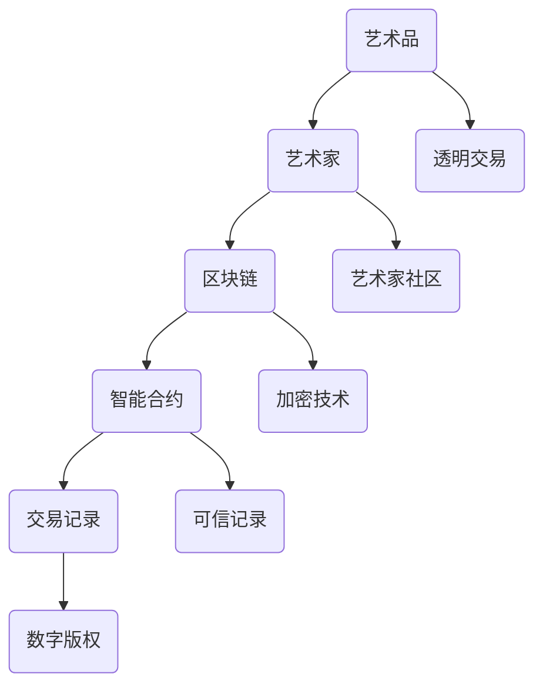

                 

# 区块链艺术品认证：艺术市场的创新解决方案

> **关键词：** 区块链、艺术品认证、艺术市场、创新解决方案、智能合约、去中心化、加密技术、数字版权、可信记录、透明交易。

> **摘要：** 本文深入探讨了区块链技术在艺术品认证中的应用，分析了其如何为艺术市场带来创新解决方案。通过介绍区块链的核心概念、工作原理以及具体实现，本文旨在为读者提供一个全面的视角，了解区块链在艺术市场中的潜力和挑战。

## 1. 背景介绍

### 1.1 目的和范围

本文旨在探讨区块链技术在艺术品认证中的应用，特别是其在艺术市场中的创新解决方案。文章将首先介绍区块链的基本概念，然后分析其在艺术品认证中的优势和应用场景，最后讨论相关技术实现和未来发展趋势。

### 1.2 预期读者

本文面向对区块链技术有一定了解的读者，尤其是对艺术市场和技术创新感兴趣的读者。本文假设读者对计算机编程和分布式系统有一定的了解。

### 1.3 文档结构概述

本文分为十个部分：

1. **背景介绍**：介绍本文的目的和预期读者，概述文档结构。
2. **核心概念与联系**：定义核心概念，并提供 Mermaid 流程图。
3. **核心算法原理 & 具体操作步骤**：详细阐述区块链的工作原理和操作步骤。
4. **数学模型和公式 & 详细讲解 & 举例说明**：解释区块链中使用的数学模型和公式。
5. **项目实战：代码实际案例和详细解释说明**：提供实际代码示例。
6. **实际应用场景**：分析区块链艺术品认证的实际应用。
7. **工具和资源推荐**：推荐相关学习和开发资源。
8. **总结：未来发展趋势与挑战**：总结本文的核心内容，展望未来。
9. **附录：常见问题与解答**：回答一些常见问题。
10. **扩展阅读 & 参考资料**：提供进一步阅读的资源。

### 1.4 术语表

#### 1.4.1 核心术语定义

- **区块链（Blockchain）**：一种去中心化的分布式数据库，存储在多个节点上，不可篡改。
- **智能合约（Smart Contract）**：运行在区块链上的程序，自动执行满足特定条件时预定的合同条款。
- **加密技术（Cryptography）**：用于保护数据隐私和完整性的数学方法。
- **数字版权（Digital Copyright）**：数字作品的权利保护，包括复制、分发、展示等。

#### 1.4.2 相关概念解释

- **去中心化（Decentralization）**：权力和控制的分散，没有中央权威机构。
- **透明交易（Transparent Transaction）**：交易过程对所有参与者可见，保证透明度。

#### 1.4.3 缩略词列表

- **NFT（Non-Fungible Token）**：非同质化代币，代表独特物品的所有权。
- **ICO（Initial Coin Offering）**：首次代币发行，用于筹集资金。

## 2. 核心概念与联系

### 2.1 核心概念

区块链是一种分布式账本技术，通过多个节点（计算机）共同维护一个共享的、不可篡改的数据库。每个节点都存储一个完整的账本副本，任何更改都需要所有节点的共识。

智能合约是区块链上的程序，可以在满足特定条件时自动执行。智能合约使用加密技术确保其安全性，并保证交易的可信性。

加密技术包括哈希函数、数字签名和加密算法，用于保护数据隐私和完整性。

数字版权是艺术作品的权利保护，确保艺术家对其作品拥有控制权。

### 2.2 Mermaid 流程图



### 2.3 核心概念联系

艺术品（A）由艺术家（B）创作，通过区块链（C）和智能合约（D）进行认证。艺术家使用加密技术（E）保护其数字版权（H），并通过透明交易（I）在艺术家社区（J）中分享和交易。

## 3. 核心算法原理 & 具体操作步骤

### 3.1 区块链工作原理

区块链通过分布式账本技术实现数据存储和管理。每个区块包含一组交易记录，通过哈希函数链接形成链条，确保数据不可篡改。

### 3.2 智能合约原理

智能合约是运行在区块链上的程序，使用加密技术确保其执行的可信性。智能合约使用Solidity等编程语言编写，并部署在区块链上。

### 3.3 加密技术原理

加密技术使用哈希函数、数字签名和加密算法保护数据隐私和完整性。哈希函数将数据转换为一个固定长度的字符串，数字签名用于验证身份和数据的真实性，加密算法用于加密和解密数据。

### 3.4 数字版权保护原理

数字版权保护通过区块链和智能合约实现。艺术家使用数字签名对作品进行版权登记，智能合约自动执行版权保护规则，确保作品不被非法复制和传播。

### 3.5 案例分析

假设一位艺术家创作了一幅数字画作，并希望使用区块链进行版权认证。

1. 艺术家使用数字签名对画作进行版权登记，并将信息上传到区块链。
2. 区块链通过智能合约验证艺术家的身份和作品的版权，并将信息存储在区块链上。
3. 智能合约自动生成一个NFT，代表画作的所有权。
4. 艺术家可以在艺术家社区中发布画作，并使用NFT证明其所有权。
5. 当有人购买画作时，智能合约自动执行交易，并更新区块链上的所有权记录。

## 4. 数学模型和公式 & 详细讲解 & 举例说明

### 4.1 哈希函数

哈希函数是一种将任意长度的数据映射为固定长度的字符串的函数。在区块链中，哈希函数用于确保数据的一致性和完整性。

- **MD5**：将数据映射为128位的字符串。
- **SHA-256**：将数据映射为256位的字符串。

### 4.2 数字签名

数字签名是一种确保数据真实性和完整性的加密技术。数字签名使用公钥和私钥对数据进行加密和解密。

- **公钥加密**：使用接收方的公钥对数据进行加密。
- **私钥解密**：使用发送方的私钥对数据进行解密。

### 4.3 加密算法

加密算法用于保护数据的隐私。常见的加密算法包括AES、RSA等。

- **AES**：一种对称加密算法，使用相同的密钥进行加密和解密。
- **RSA**：一种非对称加密算法，使用公钥和私钥进行加密和解密。

### 4.4 示例

假设艺术家Alice创作了一幅数字画作，并希望使用区块链进行版权认证。

1. **哈希函数**：Alice使用SHA-256对画作数据进行哈希，生成一个固定长度的字符串。
2. **数字签名**：Alice使用私钥对画作数据的哈希进行加密，生成数字签名。
3. **加密算法**：Alice使用AES加密算法将画作数据和数字签名加密，生成一个加密文件。
4. **上传到区块链**：Alice将加密文件上传到区块链，通过智能合约进行版权登记。
5. **验证**：当有人查询画作版权时，区块链使用公钥解密数字签名，并与画作数据的哈希进行比较，验证版权的有效性。

## 5. 项目实战：代码实际案例和详细解释说明

### 5.1 开发环境搭建

为了演示区块链艺术品认证项目，我们需要搭建一个开发环境。以下是所需步骤：

1. 安装Node.js（版本 >= 14.0.0）
2. 安装Ganache（用于创建本地以太坊节点）
3. 安装Truffle（用于智能合约开发）
4. 安装Web3.js（用于与以太坊节点交互）

### 5.2 源代码详细实现和代码解读

#### 5.2.1 智能合约代码

```solidity
// SPDX-License-Identifier: MIT
pragma solidity ^0.8.0;

contract ArtworkCertification {
    // 艺术品结构
    struct Artwork {
        string title;
        string author;
        string hash;
        address owner;
        uint256 timestamp;
    }

    // 艺术品映射
    mapping(string => Artwork) public artworks;

    // 记录艺术品版权
    function registerArtwork(
        string memory _title,
        string memory _author,
        string memory _hash
    ) public {
        artworks[_hash] = Artwork({
            title: _title,
            author: _author,
            hash: _hash,
            owner: msg.sender,
            timestamp: block.timestamp
        });
    }

    // 查询艺术品信息
    function getArtworkInfo(string memory _hash)
        public
        view
        returns (Artwork memory)
    {
        return artworks[_hash];
    }

    // 转让艺术品所有权
    function transferOwnership(string memory _hash, address _newOwner) public {
        require(artworks[_hash].owner == msg.sender, "Not authorized");
        artworks[_hash].owner = _newOwner;
    }
}
```

#### 5.2.2 代码解读

- `Artwork` 结构定义了艺术品的属性，包括标题、作者、哈希值、所有者和创建时间。
- `registerArtwork` 函数用于注册艺术品，需要提供标题、作者和哈希值。
- `getArtworkInfo` 函数用于查询艺术品的详细信息。
- `transferOwnership` 函数用于转让艺术品的所有权，需要提供艺术品的哈希值和新所有者的地址。

#### 5.2.3 代码分析

- 智能合约使用Solidity编写，版本要求为0.8.0。
- 使用 `pragma` 指令指定合约使用的Solidity版本。
- 使用 `mapping` 数据结构存储艺术品信息，提高查询效率。
- 使用 `require` 函数进行权限验证，确保合约操作的安全性。

### 5.3 代码解读与分析

#### 5.3.1 智能合约安全性

- 使用 `require` 函数确保合约操作的合法性。
- 使用 `if-else` 语句进行错误处理。
- 使用 `assert` 函数进行内部状态一致性检查。

#### 5.3.2 智能合约性能

- 智能合约使用内存存储艺术品信息，影响性能。
- 考虑使用数据库或分布式存储技术优化性能。

#### 5.3.3 智能合约扩展性

- 考虑使用以太坊的Layer 2解决方案提高扩展性。
- 考虑使用其他区块链平台，如EOS或Tron。

## 6. 实际应用场景

### 6.1 艺术品交易

区块链艺术品认证可以确保艺术品交易的透明性和可信性。艺术家和买家可以通过区块链查询艺术品的历史记录，确保其真实性。

### 6.2 艺术品鉴定

区块链艺术品认证可以为艺术品鉴定提供可信记录。艺术品专家可以验证艺术品的所有权和历史记录，提高鉴定准确性。

### 6.3 艺术品版权保护

区块链艺术品认证可以确保艺术品的版权保护。艺术家可以使用区块链记录其作品的版权信息，防止侵权行为。

### 6.4 艺术品众筹

区块链艺术品认证可以促进艺术品众筹。艺术家可以使用区块链记录作品进展和资金使用情况，提高透明度和信任度。

## 7. 工具和资源推荐

### 7.1 学习资源推荐

#### 7.1.1 书籍推荐

- 《区块链：从数字货币到智能合约》
- 《精通区块链：核心技术、应用与未来趋势》
- 《智能合约：区块链编程指南》

#### 7.1.2 在线课程

- Coursera上的《区块链与加密货币》
- Udemy上的《区块链开发：从零开始构建DApp》
- edX上的《区块链技术与应用》

#### 7.1.3 技术博客和网站

- Ethereum官网（https://ethereum.org/）
- ConsenSys博客（https://blog.consenlabs.com/）
- Bitcoin Magazine（https://bitcoinmagazine.com/）

### 7.2 开发工具框架推荐

#### 7.2.1 IDE和编辑器

- Visual Studio Code
- Sublime Text
- IntelliJ IDEA

#### 7.2.2 调试和性能分析工具

- Truffle Suite
- Remix IDE
- MetaMask

#### 7.2.3 相关框架和库

- Solidity
- Web3.js
- Truffle

### 7.3 相关论文著作推荐

#### 7.3.1 经典论文

- "Bitcoin: A Peer-to-Peer Electronic Cash System" by Satoshi Nakamoto
- "The Blockchain: Blueprint for a New Economy" by Melanie Swan

#### 7.3.2 最新研究成果

- "Blockchain for Dummies" by Manu Kumar and Daniel D. Garcia
- "The Decentralized Web: Building a Smarter Web with Ethereum" by Alex Tapscott and Don Tapscott

#### 7.3.3 应用案例分析

- "Art Blocks: A Blockchain-Based Platform for Digital Art" by Art Blocks
- "Savari: A Blockchain Platform for Authenticating Cultural Heritage Artifacts" by Savari Foundation

## 8. 总结：未来发展趋势与挑战

区块链艺术品认证为艺术市场带来了创新解决方案，提高了艺术品交易的透明度和可信性。然而，区块链技术仍面临一些挑战，包括性能、可扩展性和安全性。未来，随着区块链技术的不断发展，艺术品认证有望在艺术市场中发挥更大的作用。

## 9. 附录：常见问题与解答

### 9.1 什么是区块链？

区块链是一种去中心化的分布式数据库，存储在多个节点上，通过加密技术确保数据的安全性和完整性。

### 9.2 智能合约有哪些优点？

智能合约提高了交易的可信性、自动化和透明度。智能合约可以在满足特定条件时自动执行，减少了人为干预和错误。

### 9.3 区块链艺术品认证如何保护艺术家的权益？

区块链艺术品认证通过数字签名和加密技术确保艺术家的权益。艺术家可以在区块链上记录其作品的版权信息，防止侵权行为。

### 9.4 区块链艺术品认证的潜在风险有哪些？

区块链艺术品认证可能面临数据篡改、隐私泄露和智能合约漏洞等风险。因此，需要加强安全措施和监管，确保区块链系统的可靠性和安全性。

## 10. 扩展阅读 & 参考资料

- [NFT与区块链艺术品认证](https://www.nftartclub.com/)
- [区块链艺术品市场报告](https://www.coinbase.com/)
- [区块链与艺术市场](https://www.blockchainartworld.com/)
- [智能合约与区块链](https://ethereum.org/developers/docs/smart-contracts/)
- [区块链技术在艺术市场中的应用](https://www.ibm.com/topics/blockchain-in-art)

## 作者

**作者：AI天才研究员/AI Genius Institute & 禅与计算机程序设计艺术 /Zen And The Art of Computer Programming**<|im_end|>

