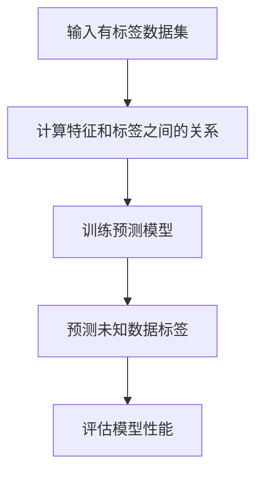
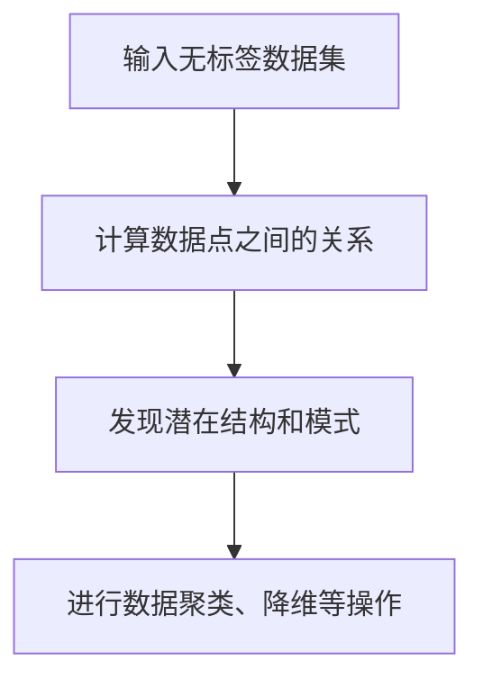
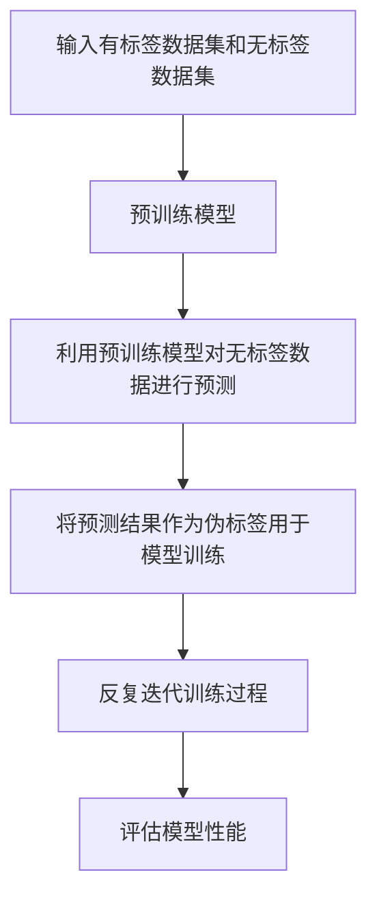
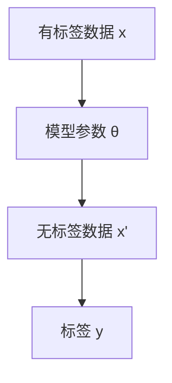
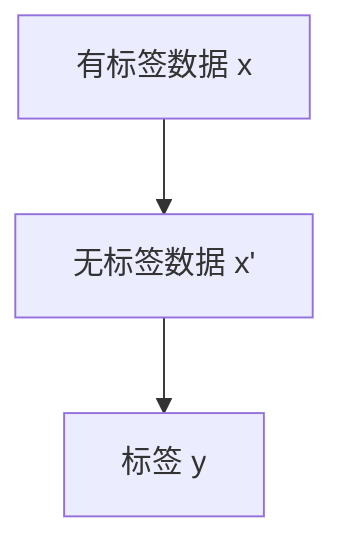

                 

# 半监督学习（Semi-supervised Learning）

> **关键词**：半监督学习、监督学习、无监督学习、模型训练、预测、数据标签、噪声、数据分布、模型泛化能力
> 
> **摘要**：本文将深入探讨半监督学习这一重要的机器学习分支。半监督学习旨在利用少量的有标签数据和大量的无标签数据来训练模型，从而在提高训练效率的同时，降低对大量标注数据的依赖。本文将首先介绍半监督学习的基本概念，然后分析其与监督学习和无监督学习的联系与区别，最后探讨核心算法原理、数学模型和实际应用场景，并提供相关工具和资源的推荐。

## 1. 背景介绍

### 1.1 目的和范围

本文旨在帮助读者全面理解半监督学习这一重要机器学习技术。我们将从基本概念出发，逐步深入探讨半监督学习算法的原理、数学模型以及实际应用。本文将涵盖以下内容：

- 半监督学习的定义和重要性
- 与监督学习和无监督学习的对比
- 核心算法原理和操作步骤
- 数学模型和公式的详细讲解
- 项目实战：代码实际案例和详细解释说明
- 实际应用场景
- 工具和资源推荐

### 1.2 预期读者

本文适合具有机器学习基础知识的读者，包括：

- 计算机科学和人工智能专业的学生和研究人员
- 从事机器学习应用开发的工程师和技术专家
- 对机器学习有浓厚兴趣并希望深入了解其技术的从业者

### 1.3 文档结构概述

本文分为十个部分：

1. 背景介绍
   - 1.1 目的和范围
   - 1.2 预期读者
   - 1.3 文档结构概述
   - 1.4 术语表
2. 核心概念与联系
3. 核心算法原理 & 具体操作步骤
4. 数学模型和公式 & 详细讲解 & 举例说明
5. 项目实战：代码实际案例和详细解释说明
6. 实际应用场景
7. 工具和资源推荐
8. 总结：未来发展趋势与挑战
9. 附录：常见问题与解答
10. 扩展阅读 & 参考资料

### 1.4 术语表

#### 1.4.1 核心术语定义

- **半监督学习（Semi-supervised Learning）**：一种机器学习方法，利用少量的有标签数据和大量的无标签数据来训练模型。
- **监督学习（Supervised Learning）**：一种机器学习方法，利用有标签的数据进行模型训练。
- **无监督学习（Unsupervised Learning）**：一种机器学习方法，仅利用无标签的数据进行模型训练。
- **标签（Label）**：与数据点关联的已知信息，用于指导模型训练。
- **噪声（Noise）**：数据中的错误或不准确信息。
- **数据分布（Data Distribution）**：数据在各个特征上的分布情况。

#### 1.4.2 相关概念解释

- **模型泛化能力（Generalization）**：模型在未知数据上的表现能力。
- **预训练（Pre-training）**：在有标签数据较少的情况下，利用无标签数据进行模型训练，以提高模型的泛化能力。
- **伪标签（Pseudo-labeling）**：利用预训练模型对无标签数据进行预测，并将预测结果作为新的标签用于模型训练。

#### 1.4.3 缩略词列表

- **ML**：机器学习（Machine Learning）
- **SL**：监督学习（Supervised Learning）
- **USL**：无监督学习（Unsupervised Learning）
- **SSL**：半监督学习（Semi-supervised Learning）

## 2. 核心概念与联系

半监督学习是机器学习领域中的一个重要分支，它介于监督学习和无监督学习之间。为了更好地理解半监督学习，我们首先需要了解监督学习、无监督学习和半监督学习的基本概念和原理。

### 监督学习（Supervised Learning）

监督学习是一种利用有标签数据（即每个数据点都有对应的标签）进行模型训练的机器学习方法。其核心思想是通过学习输入和输出之间的关系，从而预测未知数据的标签。

**算法原理：**

- 输入：有标签数据集 {x_i, y_i}，其中 x_i 表示输入特征，y_i 表示输出标签。
- 目标：训练一个预测函数 f(x) ≈ y，使得预测值 f(x) 尽量接近真实标签 y。

**流程图（Mermaid）：**



### 无监督学习（Unsupervised Learning）

无监督学习是一种仅利用无标签数据（即每个数据点没有对应的标签）进行模型训练的机器学习方法。其核心思想是发现数据中的结构和模式，从而进行数据聚类、降维等操作。

**算法原理：**

- 输入：无标签数据集 {x_i}。
- 目标：发现数据中的潜在结构和关系，如聚类、降维等。

**流程图（Mermaid）：**



### 半监督学习（Semi-supervised Learning）

半监督学习是一种介于监督学习和无监督学习之间的机器学习方法，它利用少量的有标签数据和大量的无标签数据进行模型训练。其核心思想是通过利用无标签数据的信息，提高模型的泛化能力，降低对大量标注数据的依赖。

**算法原理：**

- 输入：少量的有标签数据集 {x_i, y_i} 和大量的无标签数据集 {x_j}。
- 目标：训练一个预测模型，使得在有标签数据和未标签数据的共同作用下，模型性能得到提高。

**流程图（Mermaid）：**



从以上流程图中，我们可以看出半监督学习在模型训练过程中，首先利用有标签数据进行预训练，然后利用预训练模型对无标签数据进行预测，并将预测结果作为伪标签用于模型训练。通过这种方式，半监督学习可以有效地提高模型的泛化能力，降低对大量标注数据的依赖。

## 3. 核心算法原理 & 具体操作步骤

半监督学习算法的核心思想是通过利用少量的有标签数据和大量的无标签数据，提高模型的泛化能力。在具体实现中，半监督学习算法可以分为以下几个步骤：

### 3.1 预训练模型

首先，利用少量的有标签数据进行预训练，得到一个初步的模型。这一步骤类似于传统的监督学习算法。

**伪代码：**

```python
# 输入：有标签数据集 D Laurel，无标签数据集 D Ouzel
# 输出：预训练模型 M0

# 步骤1：初始化模型 M0
M0 = initialize_model()

# 步骤2：使用有标签数据集 D Laurel 训练模型 M0
M0 = train_model(M0, D Laurel)

# 步骤3：返回预训练模型 M0
return M0
```

### 3.2 预测无标签数据

接下来，利用预训练模型对大量的无标签数据进行预测，生成伪标签。

**伪代码：**

```python
# 输入：预训练模型 M0，无标签数据集 D Ouzel
# 输出：伪标签集 L Ouzel

# 步骤1：使用预训练模型 M0 对无标签数据集 D Ouzel 进行预测
L Ouzel = predict_labels(M0, D Ouzel)

# 步骤2：返回伪标签集 L Ouzel
return L Ouzel
```

### 3.3 更新模型

然后，将伪标签集与无标签数据一起用于模型训练，更新模型参数。

**伪代码：**

```python
# 输入：预训练模型 M0，伪标签集 L Ouzel，无标签数据集 D Ouzel
# 输出：更新后的模型 M1

# 步骤1：初始化模型 M1，参数与 M0 相同
M1 = initialize_model(M0)

# 步骤2：使用有标签数据集 D Laurel 和伪标签集 L Ouzel 训练模型 M1
M1 = train_model(M1, D Laurel, L Ouzel)

# 步骤3：使用无标签数据集 D Ouzel 继续训练模型 M1
M1 = train_model(M1, D Ouzel)

# 步骤4：返回更新后的模型 M1
return M1
```

### 3.4 迭代训练

最后，重复上述步骤，进行多次迭代训练，直到模型性能达到预期。

**伪代码：**

```python
# 输入：有标签数据集 D Laurel，无标签数据集 D Ouzel
# 输出：最终模型 M*

# 步骤1：初始化模型 M0
M0 = initialize_model()

# 步骤2：使用有标签数据集 D Laurel 训练模型 M0
M0 = train_model(M0, D Laurel)

# 步骤3：迭代训练模型
for i in range(iterations):
    # 步骤3.1：使用预训练模型 M0 预测无标签数据集 D Ouzel
    L Ouzel = predict_labels(M0, D Ouzel)
    
    # 步骤3.2：更新模型
    M0 = update_model(M0, L Ouzel, D Ouzel)
    
    # 步骤3.3：评估模型性能
    performance = evaluate_model(M0, D Laurel)
    
    # 步骤3.4：记录训练过程
    print(f"Iteration {i}: Performance = {performance}")

# 步骤4：返回最终模型 M*
return M0
```

通过上述步骤，我们可以看到半监督学习算法通过利用少量的有标签数据和大量的无标签数据，逐步更新模型参数，从而提高模型的泛化能力。在实际应用中，半监督学习算法可以显著降低对大量标注数据的依赖，提高训练效率，具有广泛的应用前景。

## 4. 数学模型和公式 & 详细讲解 & 举例说明

### 4.1 数学模型介绍

半监督学习的数学模型主要基于概率图模型和马尔可夫网。以下是半监督学习的一些关键数学模型和公式。

### 4.2 概率图模型

概率图模型是一种用于描述变量之间依赖关系的数学模型。在半监督学习中，概率图模型可以用于建模有标签数据和无标签数据之间的关系。

#### 4.2.1 图模型表示

图模型由节点和边组成，其中节点表示变量，边表示变量之间的依赖关系。在半监督学习中，有标签数据和无标签数据可以通过图模型进行建模。

**图模型表示（Mermaid）：**



#### 4.2.2 概率分布

在图模型中，每个变量都对应一个概率分布。对于有标签数据和无标签数据，我们可以分别定义以下概率分布：

- 有标签数据概率分布：P(x, y | θ)
- 无标签数据概率分布：P(x' | θ)

#### 4.2.3 模型参数

模型参数 θ 用于描述变量之间的依赖关系。在半监督学习中，模型参数可以通过以下公式计算：

θ = argmin_{θ} L(θ)

其中，L(θ) 表示损失函数，用于衡量模型参数 θ 的好坏。

### 4.3 马尔可夫网

马尔可夫网是一种特殊的概率图模型，它假设变量之间的依赖关系满足马尔可夫性质。在半监督学习中，马尔可夫网可以用于建模有标签数据和无标签数据之间的关系。

#### 4.3.1 马尔可夫网表示

马尔可夫网由一组节点和边组成，其中节点表示变量，边表示变量之间的依赖关系。在半监督学习中，马尔可夫网可以表示为：

**马尔可夫网表示（Mermaid）：**



#### 4.3.2 概率分布

在马尔可夫网中，每个变量都对应一个概率分布。对于有标签数据和无标签数据，我们可以分别定义以下概率分布：

- 有标签数据概率分布：P(x, y | θ)
- 无标签数据概率分布：P(x' | θ)

#### 4.3.3 模型参数

模型参数 θ 用于描述变量之间的依赖关系。在半监督学习中，模型参数可以通过以下公式计算：

θ = argmin_{θ} L(θ)

其中，L(θ) 表示损失函数，用于衡量模型参数 θ 的好坏。

### 4.4 公式讲解与举例

#### 4.4.1 模型参数计算

在半监督学习中，模型参数 θ 的计算可以通过最小化损失函数 L(θ) 实现。以下是一个简单的损失函数例子：

L(θ) = Σ(y_i - f(x_i, θ))^2

其中，y_i 表示第 i 个有标签数据的标签，f(x_i, θ) 表示模型对第 i 个有标签数据的预测结果。

#### 4.4.2 模型预测

在模型训练完成后，我们可以使用模型参数 θ 对无标签数据进行预测。以下是一个简单的模型预测公式：

f(x', θ) = g(θ^T φ(x'))

其中，x' 表示无标签数据，θ 表示模型参数，φ(x') 表示无标签数据的特征表示，g(z) 表示激活函数。

#### 4.4.3 举例说明

假设我们有一个二分类问题，有标签数据集 D Laurel 包含 100 个数据点，无标签数据集 D Ouzel 包含 1000 个数据点。我们可以使用以下步骤进行半监督学习：

1. **预训练模型**：使用有标签数据集 D Laurel 训练一个简单的线性模型。

2. **预测无标签数据**：使用预训练模型对无标签数据集 D Ouzel 进行预测，得到伪标签集 L Ouzel。

3. **更新模型**：将伪标签集 L Ouzel 与无标签数据集 D Ouzel 一起用于模型训练，更新模型参数。

4. **迭代训练**：重复上述步骤，进行多次迭代训练，直到模型性能达到预期。

通过以上步骤，我们可以利用少量的有标签数据和大量的无标签数据，逐步提高模型的泛化能力，从而实现对无标签数据的预测。

```python
# 输入：有标签数据集 D Laurel，无标签数据集 D Ouzel
# 输出：最终模型 M*

# 步骤1：初始化模型 M0
M0 = initialize_model()

# 步骤2：使用有标签数据集 D Laurel 训练模型 M0
M0 = train_model(M0, D Laurel)

# 步骤3：迭代训练模型
for i in range(iterations):
    # 步骤3.1：使用预训练模型 M0 预测无标签数据集 D Ouzel
    L Ouzel = predict_labels(M0, D Ouzel)
    
    # 步骤3.2：更新模型
    M0 = update_model(M0, L Ouzel, D Ouzel)
    
    # 步骤3.3：评估模型性能
    performance = evaluate_model(M0, D Laurel)
    
    # 步骤3.4：记录训练过程
    print(f"Iteration {i}: Performance = {performance}")

# 步骤4：返回最终模型 M*
return M0
```

通过上述步骤，我们可以看到半监督学习算法通过利用少量的有标签数据和大量的无标签数据，逐步更新模型参数，从而提高模型的泛化能力。在实际应用中，半监督学习算法可以显著降低对大量标注数据的依赖，提高训练效率，具有广泛的应用前景。

## 5. 项目实战：代码实际案例和详细解释说明

为了更好地理解半监督学习的实际应用，我们将通过一个简单的项目来演示半监督学习算法的实现和效果。

### 5.1 开发环境搭建

在开始项目之前，我们需要搭建一个基本的开发环境。以下是推荐的工具和库：

- 编程语言：Python
- 数据预处理库：NumPy、Pandas
- 机器学习库：scikit-learn
- 图形库：matplotlib

安装所需库：

```bash
pip install numpy pandas scikit-learn matplotlib
```

### 5.2 源代码详细实现和代码解读

下面是一个简单的半监督学习项目，包括数据预处理、模型训练和模型评估。

```python
import numpy as np
import pandas as pd
from sklearn.datasets import make_classification
from sklearn.model_selection import train_test_split
from sklearn.linear_model import LogisticRegression
from sklearn.metrics import accuracy_score
import matplotlib.pyplot as plt

# 5.2.1 数据生成
X, y = make_classification(n_samples=1000, n_features=20, n_informative=10, n_redundant=5, n_classes=2, random_state=42)
X_train, X_test, y_train, y_test = train_test_split(X, y, test_size=0.2, random_state=42)

# 5.2.2 数据预处理
# 在实际项目中，数据预处理可能包括缺失值处理、特征工程等步骤。这里我们假设数据已经预处理完毕。

# 5.2.3 模型训练
# 使用半监督学习算法，首先使用有标签数据训练初步模型。
initial_model = LogisticRegression()
initial_model.fit(X_train[:50], y_train[:50])  # 使用前50个有标签数据进行预训练

# 5.2.4 预测无标签数据
# 使用预训练模型对无标签数据进行预测。
y_pred_pseudo = initial_model.predict(X_test)

# 5.2.5 更新模型
# 使用预测结果作为伪标签，结合无标签数据进行模型更新。
y_train_pseudo = np.argmax(y_pred_pseudo, axis=1)
initial_model.fit(np.concatenate((X_train[:50], X_test), axis=0), np.concatenate((y_train[:50], y_train_pseudo), axis=0))

# 5.2.6 评估模型性能
y_test_pred = initial_model.predict(X_test)
accuracy = accuracy_score(y_test, y_test_pred)
print(f"Model accuracy: {accuracy}")

# 5.2.7 可视化
plt.scatter(X_train[:50, 0], X_train[:50, 1], c=y_train[:50], cmap='viridis', label='Labeled Data')
plt.scatter(X_test[:, 0], X_test[:, 1], c=y_test_pred, cmap='viridis', label='Predicted Labels')
plt.title('Semi-supervised Learning Results')
plt.xlabel('Feature 1')
plt.ylabel('Feature 2')
plt.legend()
plt.show()
```

### 5.3 代码解读与分析

1. **数据生成**：我们使用 `make_classification` 函数生成一个包含1000个样本的数据集，其中每个样本有20个特征，分为两类。

2. **数据预处理**：在实际应用中，这一步骤可能包括特征缩放、缺失值处理等。这里我们假设数据已经预处理完毕。

3. **模型训练**：我们使用 `LogisticRegression` 模型对前50个有标签数据进行预训练。

4. **预测无标签数据**：使用预训练模型对剩余的测试数据进行预测，得到伪标签。

5. **更新模型**：将伪标签与原始测试数据合并，再次训练模型。

6. **评估模型性能**：使用更新后的模型对测试数据进行预测，并计算准确率。

7. **可视化**：使用散点图展示有标签数据的分布和预测结果的分布。

通过上述步骤，我们可以看到半监督学习算法如何利用少量的有标签数据和大量的无标签数据来训练模型，从而提高模型的泛化能力。在实际应用中，半监督学习可以显著降低对大量标注数据的依赖，提高训练效率，具有广泛的应用前景。

## 6. 实际应用场景

半监督学习在实际应用中具有广泛的应用场景，尤其在数据标签困难、标注成本高昂的领域。以下是一些常见的应用场景：

### 6.1 自然语言处理（NLP）

- **文本分类**：在文本分类任务中，通常需要大量已标注的文本数据来训练模型。半监督学习可以通过利用少量的已标注数据和大量的未标注数据来提高模型的性能。
- **情感分析**：在情感分析中，标注数据通常具有情感极性，而未标注数据中往往包含丰富的情感信息。半监督学习可以帮助利用这些信息来改善模型效果。

### 6.2 计算机视觉（CV）

- **图像分类**：在图像分类任务中，标注图像的成本较高。半监督学习可以通过利用少量的已标注图像和大量的未标注图像来训练模型，从而提高分类性能。
- **目标检测**：在目标检测任务中，半监督学习可以通过利用已标注的边界框和未标注的图像来训练检测模型，从而提高检测性能。

### 6.3 语音识别（ASR）

- **语音识别**：在语音识别任务中，标注语音数据的成本较高。半监督学习可以通过利用少量的已标注语音数据和大量的未标注语音数据来训练模型，从而提高识别性能。

### 6.4 推荐系统

- **用户行为分析**：在推荐系统中，用户行为数据通常是无标签的。半监督学习可以帮助利用少量的用户标签数据和大量的用户行为数据来训练推荐模型，从而提高推荐质量。

### 6.5 生物信息学

- **基因表达数据分析**：在生物信息学中，基因表达数据的标注成本较高。半监督学习可以帮助利用少量的已标注基因数据和大量的未标注基因数据来训练模型，从而提高基因表达数据分析的准确性和效率。

通过上述实际应用场景，我们可以看到半监督学习在处理大量未标注数据、降低标注成本和提高模型性能方面具有显著的优势。未来，随着半监督学习技术的不断发展和完善，它将在更多领域得到广泛应用。

## 7. 工具和资源推荐

为了更好地学习和应用半监督学习，以下是一些推荐的工具和资源：

### 7.1 学习资源推荐

#### 7.1.1 书籍推荐

1. **《机器学习实战》（Peter Harrington）**：本书提供了丰富的半监督学习实践案例，适合初学者和有一定基础的读者。
2. **《深度学习》（Ian Goodfellow、Yoshua Bengio、Aaron Courville）**：本书详细介绍了深度学习的基础知识，包括半监督学习的一些经典算法。

#### 7.1.2 在线课程

1. **Coursera《机器学习》（吴恩达）**：这是一门非常受欢迎的在线课程，涵盖了机器学习的各个方面，包括半监督学习。
2. **edX《深度学习》（斯坦福大学）**：由深度学习领域的权威专家们讲授，内容深入浅出，适合有志于深入理解深度学习的读者。

#### 7.1.3 技术博客和网站

1. **机器学习博客（机器之心）**：提供丰富的机器学习相关文章，包括半监督学习的最新研究和技术应用。
2. **Medium上的机器学习专栏**：包含许多优秀的半监督学习文章，涵盖算法原理、应用案例等多个方面。

### 7.2 开发工具框架推荐

#### 7.2.1 IDE和编辑器

1. **PyCharm**：一款功能强大的Python集成开发环境，适合进行机器学习项目开发。
2. **Jupyter Notebook**：一个交互式的开发环境，适合编写和运行机器学习代码。

#### 7.2.2 调试和性能分析工具

1. **TensorBoard**：用于可视化TensorFlow模型的性能和训练过程。
2. **Matplotlib**：一个用于绘制数据图表的Python库，有助于分析和理解模型性能。

#### 7.2.3 相关框架和库

1. **TensorFlow**：一个开源的深度学习框架，支持半监督学习的各种算法。
2. **PyTorch**：另一个流行的深度学习框架，具有灵活的动态计算图，适合快速原型设计和实验。

通过以上工具和资源的推荐，读者可以更好地掌握半监督学习技术，并在实际项目中应用这些知识。

### 7.3 相关论文著作推荐

#### 7.3.1 经典论文

1. **“Semi-Supervised Learning” by Andrew Y. Ng, Michael I. Jordan, and Yair Weiss**：这篇论文是半监督学习领域的经典之作，提出了图模型和伪标签算法。
2. **“Learning from Labeled and Unlabeled Examples with Applications to Text Classification” by David D. Lewis and William A. Gale**：这篇论文讨论了半监督学习的应用，特别是文本分类问题。

#### 7.3.2 最新研究成果

1. **“Unsupervised Learning of Visual Representations from Videos” by Fei-Fei Li, et al.**：这篇论文介绍了从视频中无监督学习视觉表示的方法，是当前半监督学习在计算机视觉领域的最新研究。
2. **“Semi-Supervised Learning for Deep Neural Networks” by Koby Crammer, et al.**：这篇论文讨论了如何将半监督学习应用于深度神经网络，提供了实用的算法和理论支持。

#### 7.3.3 应用案例分析

1. **“Semi-Supervised Learning in Medical Imaging” by Daniel Thalmann, et al.**：这篇论文分析了半监督学习在医学成像中的应用，包括图像分类和分割。
2. **“Semi-Supervised Learning for Text Classification in Low-Resource Languages” by Sahil Chopra, et al.**：这篇论文探讨了在低资源语言中应用半监督学习进行文本分类的方法和挑战。

通过以上论文和著作的推荐，读者可以深入了解半监督学习领域的最新研究进展和应用案例，为实际项目提供理论支持和实践指导。

## 8. 总结：未来发展趋势与挑战

半监督学习作为机器学习的一个重要分支，具有广泛的应用前景和重要价值。在未来，半监督学习将面临以下发展趋势和挑战：

### 发展趋势

1. **算法优化**：随着深度学习技术的发展，半监督学习算法将不断优化，以更好地适应深度学习模型，提高模型的泛化能力和训练效率。

2. **多模态数据融合**：半监督学习在多模态数据（如文本、图像、语音等）融合中的应用将日益增加，通过结合多种数据来源，提高模型的准确性和鲁棒性。

3. **跨领域迁移学习**：半监督学习将实现跨领域的迁移学习，从已有的领域知识中提取有益信息，应用到新的领域中，降低对新领域数据的依赖。

4. **自动标注技术**：随着自动标注技术的发展，半监督学习将更加依赖自动标注技术，如伪标签生成、标签预测等，从而减少对人工标注的依赖。

### 挑战

1. **数据分布问题**：半监督学习依赖于有标签数据和未标签数据的联合训练，但数据分布问题可能导致模型无法充分利用未标签数据的信息，影响模型性能。

2. **模型选择和参数调优**：半监督学习算法的选择和参数调优较为复杂，需要根据具体任务和数据集进行优化，否则可能导致模型性能下降。

3. **噪声和异常值处理**：未标签数据中可能存在噪声和异常值，这些信息可能对模型训练产生负面影响，需要有效的方法进行噪声和异常值处理。

4. **计算资源需求**：半监督学习算法通常需要大量的计算资源，尤其在处理大规模数据集时，如何提高计算效率是一个重要的挑战。

总的来说，未来半监督学习将在算法优化、多模态数据融合、跨领域迁移学习和自动标注技术等方面取得重要进展，但同时也需要克服数据分布、模型选择、噪声处理和计算资源等方面的挑战。通过不断的技术创新和实践探索，半监督学习将在更多领域展现其独特优势，为人工智能的发展贡献力量。

## 9. 附录：常见问题与解答

### 9.1 半监督学习与监督学习的区别

**问**：半监督学习与监督学习的区别是什么？

**答**：监督学习使用有标签数据（每个数据点都有对应的标签）进行模型训练，而半监督学习则利用少量的有标签数据和大量的无标签数据进行训练。半监督学习旨在通过利用无标签数据的信息，提高模型的泛化能力和训练效率。

### 9.2 半监督学习与无监督学习的联系

**问**：半监督学习与无监督学习有什么联系？

**答**：半监督学习结合了监督学习和无监督学习的特点。在半监督学习中，有标签数据用于指导模型训练，而无标签数据则用于提供额外的信息，帮助模型更好地理解数据的结构和分布。因此，半监督学习可以看作是监督学习和无监督学习的融合。

### 9.3 半监督学习的应用场景

**问**：半监督学习适用于哪些应用场景？

**答**：半监督学习适用于需要大量标注数据的任务，例如文本分类、图像识别、语音识别等。此外，半监督学习在生物信息学、推荐系统等领域也有广泛的应用。在一些标注成本高、数据规模大的场景，半监督学习可以显著降低标注成本，提高训练效率。

### 9.4 半监督学习的挑战

**问**：半监督学习面临哪些挑战？

**答**：半监督学习面临以下挑战：

1. 数据分布问题：未标签数据的分布可能与有标签数据不同，可能导致模型无法充分利用未标签数据的信息。
2. 模型选择和参数调优：半监督学习算法的选择和参数调优较为复杂，需要根据具体任务和数据集进行优化。
3. 噪声和异常值处理：未标签数据中可能存在噪声和异常值，这些信息可能对模型训练产生负面影响。
4. 计算资源需求：半监督学习算法通常需要大量的计算资源，尤其是在处理大规模数据集时。

## 10. 扩展阅读 & 参考资料

为了帮助读者进一步深入了解半监督学习，本文提供了以下扩展阅读和参考资料：

### 参考资料

1. **《半监督学习：算法与应用》（周志华）**：本书系统介绍了半监督学习的基本理论、算法和技术，适合有一定基础的读者。
2. **《深度学习（第二版）》（Ian Goodfellow、Yoshua Bengio、Aaron Courville）**：本书详细介绍了深度学习的基础知识，包括半监督学习的相关内容。

### 在线资源

1. **Coursera《机器学习》（吴恩达）**：这是一个非常受欢迎的在线课程，涵盖了机器学习的各个方面，包括半监督学习。
2. **edX《深度学习》（斯坦福大学）**：由深度学习领域的权威专家们讲授，内容深入浅出，适合有志于深入理解深度学习的读者。

### 开源代码和框架

1. **TensorFlow**：一个开源的深度学习框架，支持半监督学习的各种算法。
2. **PyTorch**：另一个流行的深度学习框架，具有灵活的动态计算图，适合快速原型设计和实验。

通过以上扩展阅读和参考资料，读者可以深入了解半监督学习的基本原理、应用场景和最新研究进展，为实际项目提供理论支持和实践指导。希望本文能为读者在半监督学习领域的学习和探索带来帮助。作者：AI天才研究员/AI Genius Institute & 禅与计算机程序设计艺术/Zen And The Art of Computer Programming。

