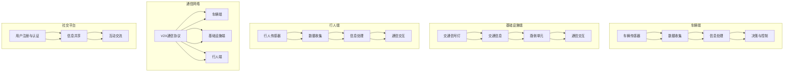
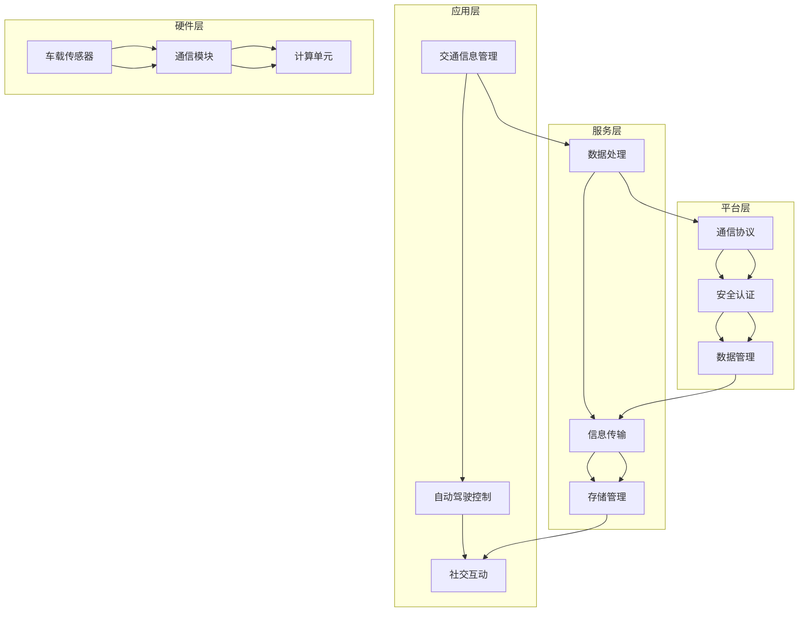

                 

# 华为2025车路协同社交V2X开发面试指南

> 关键词：车路协同、V2X、社交、开发面试、算法、数学模型、项目实战

> 摘要：本文将深入剖析华为在2025年车路协同社交V2X（Vehicle-to-Everything）领域的开发面试要点，从核心概念、算法原理、数学模型到项目实战，提供全方位的技术指导，帮助读者全面了解该领域的前沿技术和面试策略。

## 1. 背景介绍

### 1.1 目的和范围

本文旨在为准备参加华为车路协同社交V2X开发岗位面试的候选人提供全面的指导。文章将涵盖以下几个关键方面：

- **核心概念与联系**：介绍车路协同、V2X和社交等核心概念，并绘制相应的Mermaid流程图，以便读者理解各概念之间的关系。
- **核心算法原理 & 具体操作步骤**：详细讲解车路协同中的核心算法原理，使用伪代码描述具体操作步骤。
- **数学模型和公式 & 详细讲解 & 举例说明**：阐述车路协同中的数学模型，使用latex格式展示公式，并给出实际例子。
- **项目实战：代码实际案例和详细解释说明**：通过实际代码案例，深入解读项目开发中的关键实现步骤。
- **实际应用场景**：探讨车路协同社交V2X在实际中的应用场景。
- **工具和资源推荐**：推荐学习资源、开发工具和框架，以及相关论文和研究成果。
- **总结：未来发展趋势与挑战**：分析车路协同社交V2X领域的未来发展趋势和面临的挑战。

### 1.2 预期读者

本文适合以下读者群体：

- 准备参加华为车路协同社交V2X开发岗位面试的候选人。
- 对车路协同、V2X和社交技术感兴趣的工程师和研究者。
- 想要深入了解车路协同社交V2X领域的技术和应用的学生。

### 1.3 文档结构概述

本文分为以下章节：

1. 背景介绍
   - 目的和范围
   - 预期读者
   - 文档结构概述
   - 术语表
2. 核心概念与联系
   - 车路协同
   - V2X
   - 社交
   - Mermaid流程图
3. 核心算法原理 & 具体操作步骤
   - 车路协同算法
   - 伪代码描述
4. 数学模型和公式 & 详细讲解 & 举例说明
   - 数学模型
   - LaTeX格式公式
   - 实际例子
5. 项目实战：代码实际案例和详细解释说明
   - 开发环境搭建
   - 源代码实现
   - 代码解读与分析
6. 实际应用场景
   - 车路协同社交V2X的应用
7. 工具和资源推荐
   - 学习资源推荐
   - 开发工具框架推荐
   - 相关论文著作推荐
8. 总结：未来发展趋势与挑战
9. 附录：常见问题与解答
10. 扩展阅读 & 参考资料

### 1.4 术语表

#### 1.4.1 核心术语定义

- **车路协同（V2I, V2V, V2P）**：车辆与基础设施、车辆与车辆、车辆与行人之间的信息交换与协同控制。
- **V2X**：Vehicle-to-Everything，包括车辆与其他实体（如行人、其他车辆、交通基础设施）的通信。
- **社交**：指车路协同系统中涉及的用户社交互动，如共享出行、社交分享等。
- **V2I（Vehicle-to-Infrastructure）**：车辆与基础设施之间的通信。
- **V2V（Vehicle-to-Vehicle）**：车辆与车辆之间的通信。
- **V2P（Vehicle-to-Pedestrian）**：车辆与行人之间的通信。

#### 1.4.2 相关概念解释

- **边缘计算**：将计算任务从云端转移到网络边缘，提高实时响应和处理能力。
- **5G通信**：第五代移动通信技术，提供高速、低延迟、高可靠性的网络连接。
- **自动驾驶**：利用传感器、人工智能等技术，实现车辆的自主驾驶。

#### 1.4.3 缩略词列表

- **V2I**：Vehicle-to-Infrastructure
- **V2V**：Vehicle-to-Vehicle
- **V2P**：Vehicle-to-Pedestrian
- **V2X**：Vehicle-to-Everything
- **5G**：Fifth Generation Mobile Communication Technology
- **AI**：Artificial Intelligence

## 2. 核心概念与联系

在车路协同社交V2X领域，有几个关键概念需要深入理解，它们之间存在着紧密的联系。以下是对这些概念及其关系的详细解释，并附上Mermaid流程图以帮助读者更直观地理解。

### 2.1 车路协同

车路协同是指通过车辆与基础设施、车辆与车辆、车辆与行人之间的信息交换与协同控制，实现交通系统的智能化和高效化。其主要目的是提高交通安全性、减少交通拥堵、提高交通效率。

#### 2.1.1 车路协同的关键组件

- **车辆端**：包括车载传感器、通信模块、计算单元等，用于收集车辆状态信息、与其他实体进行通信、执行控制决策。
- **基础设施端**：包括交通信号灯、道路监控设备、路侧单元等，用于提供交通信息、辅助车辆控制、进行交通管理。
- **通信网络**：实现车辆与基础设施、车辆与车辆、车辆与行人之间的信息传递。

#### 2.1.2 车路协同的工作原理

- **数据收集**：车辆通过车载传感器（如摄像头、雷达、激光雷达）收集环境信息，如路况、交通流量、行人状态等。
- **信息处理**：车辆端计算单元对收集到的信息进行处理，生成交通态势分析、控制策略等。
- **决策与控制**：根据处理结果，车辆端执行相应的控制决策，如加速、减速、转向等。
- **通信交互**：车辆通过通信模块将决策信息发送给基础设施端和其他车辆，实现协同控制。

#### 2.1.3 车路协同的优势

- **提高安全性**：通过实时监控和协同控制，降低交通事故风险。
- **减少拥堵**：优化交通流量，减少拥堵现象。
- **提高效率**：缩短行驶时间，提高道路利用率。

### 2.2 V2X

V2X是车路协同的一个扩展概念，指的是车辆与其他实体（如行人、其他车辆、交通基础设施）之间的通信。V2X的目标是实现更广泛的智能交通系统，提高交通的可持续性和效率。

#### 2.2.1 V2X的关键组件

- **车辆**：具备V2X通信能力的车辆，如自动驾驶车辆、共享出行车辆等。
- **行人**：具备V2X通信能力的行人设备，如智能手机、可穿戴设备等。
- **基础设施**：具备V2X通信能力的基础设施，如路侧单元、交通信号灯等。

#### 2.2.2 V2X的工作原理

- **数据收集**：车辆和行人通过传感器收集自身和环境信息。
- **信息处理**：车辆端和行人端计算单元对收集到的信息进行处理，生成交通态势分析、控制策略等。
- **通信交互**：车辆、行人和基础设施之间通过V2X通信协议进行信息交换，实现协同控制。

#### 2.2.3 V2X的优势

- **提升交通安全性**：通过实时监控和协同控制，降低交通事故风险。
- **优化出行体验**：提供个性化的出行服务，如智能导航、智能停车等。
- **促进共享出行**：实现车辆共享、共享出行等新型交通模式。

### 2.3 社交

在车路协同社交V2X系统中，社交功能是一个重要的组成部分，它使得用户能够在出行过程中进行社交互动，如共享出行信息、分享交通体验等。

#### 2.3.1 社交的关键组件

- **用户端**：用户通过智能手机、车载设备等接入社交系统。
- **社交平台**：提供社交互动的虚拟环境，如聊天室、社交媒体平台等。
- **交通信息平台**：整合交通数据，为用户提供实时交通信息。

#### 2.3.2 社交的工作原理

- **用户注册与认证**：用户通过认证接入社交平台。
- **信息共享**：用户在社交平台上分享出行信息、交通体验等。
- **互动交流**：用户在社交平台上进行互动交流，如评论、点赞、私信等。

#### 2.3.3 社交的优势

- **提升出行体验**：通过社交互动，增加出行过程中的趣味性和互动性。
- **促进资源共享**：通过共享交通信息，优化出行路线和交通流量。
- **增强用户归属感**：通过社交互动，增强用户对出行平台的认同和归属感。

### 2.4 Mermaid流程图

以下是车路协同社交V2X系统的Mermaid流程图，展示了各个组件之间的交互流程。



通过以上分析，我们可以看到车路协同社交V2X系统涉及多个关键组件，它们之间通过信息收集、处理、决策与控制、通信交互等流程相互联系。Mermaid流程图直观地展示了这些组件和流程之间的交互关系，有助于读者更好地理解系统的整体架构和工作原理。

### 2.5 车路协同社交V2X系统的架构

车路协同社交V2X系统是一个高度复杂且高度集成的系统，其架构涵盖了硬件、软件和通信网络等多个层面。以下是对该系统架构的详细说明：

#### 2.5.1 硬件架构

车路协同社交V2X系统的硬件架构主要包括以下几个部分：

- **车辆端**：车辆端硬件包括车载传感器（如摄像头、雷达、激光雷达）、通信模块（如WiFi、蓝牙、5G模块）和计算单元（如CPU、GPU、FPGA）。
- **基础设施端**：基础设施端硬件包括交通信号灯、路侧单元（RSU）、监控设备等。
- **行人端**：行人端硬件包括智能手机、可穿戴设备等，这些设备可以通过WiFi、蓝牙等通信技术接入系统。
- **边缘计算设备**：边缘计算设备（如边缘服务器、边缘网关）用于处理来自车辆端、基础设施端和行人端的数据，提供实时分析和决策支持。

#### 2.5.2 软件架构

车路协同社交V2X系统的软件架构主要包括以下几个层次：

- **应用层**：包括交通信息管理、自动驾驶控制、社交互动等功能模块，实现用户需求和系统功能。
- **服务层**：包括数据处理、信息传输、存储管理等基础服务，为应用层提供支持。
- **平台层**：包括通信协议、安全认证、数据管理等核心组件，提供系统运行的基础环境。
- **硬件层**：包括各种硬件设备的驱动程序和接口，确保硬件资源的高效利用。

#### 2.5.3 通信网络架构

车路协同社交V2X系统的通信网络架构主要包括以下几个部分：

- **车对车（V2V）通信**：通过无线通信技术，实现车辆之间的实时信息交换。
- **车对基础设施（V2I）通信**：通过无线通信技术，实现车辆与基础设施之间的信息交互。
- **车对人（V2P）通信**：通过无线通信技术，实现车辆与行人之间的信息交互。
- **边缘计算网络**：通过边缘计算设备，实现本地数据的实时处理和分析，提高系统响应速度。

#### 2.5.4 软件架构图

以下是一个简化的车路协同社交V2X系统的软件架构图，展示了各个层次和组件之间的关系。



通过以上对车路协同社交V2X系统架构的详细分析，我们可以看到该系统涉及多个硬件和软件组件，通过高效的通信网络实现车与车、车与基础设施、车与行人之间的信息交互和协同控制。这种高度集成的系统架构为构建智能交通系统提供了坚实的基础。

### 2.6 车路协同社交V2X的关键技术

车路协同社交V2X系统的发展离不开一系列关键技术的支持。以下将详细介绍这些关键技术，并探讨它们在系统中的作用和重要性。

#### 2.6.1 边缘计算

边缘计算是指将计算任务从云端转移到网络边缘，从而减少数据传输延迟，提高系统响应速度。在车路协同社交V2X系统中，边缘计算主要用于处理来自车辆端、基础设施端和行人端的大量实时数据，提供快速的数据分析和决策支持。

- **作用**：通过边缘计算，可以在本地实时处理和分析交通数据，快速生成交通态势分析、控制策略等，提高系统的实时性和响应速度。
- **重要性**：边缘计算能够显著减少数据传输延迟，降低网络带宽需求，提高系统的整体性能和可靠性。

#### 2.6.2 5G通信

5G通信技术具备高速、低延迟、高可靠性的特点，是车路协同社交V2X系统中的重要通信手段。5G网络能够提供高带宽、低延迟的通信服务，支持大量设备同时接入，满足车路协同系统的通信需求。

- **作用**：5G通信技术能够提供高速、低延迟的网络连接，实现车辆与基础设施、车辆与车辆、车辆与行人之间的实时通信，确保系统的稳定运行。
- **重要性**：5G通信技术是实现车路协同社交V2X系统高效通信的关键，对于系统的实时性和可靠性至关重要。

#### 2.6.3 自主导驾驶技术

自动驾驶技术是车路协同社交V2X系统的重要组成部分，它通过传感器、人工智能等技术实现车辆的自主驾驶。自动驾驶技术包括感知、规划、控制等多个环节，旨在提高交通安全性、减少交通事故、提高交通效率。

- **作用**：自动驾驶技术能够实现车辆的自主行驶，减少对人类驾驶员的依赖，提高交通系统的智能化水平。
- **重要性**：自动驾驶技术是实现车路协同社交V2X系统智能化的关键，对于提升交通系统的安全性和效率具有重要意义。

#### 2.6.4 大数据与人工智能

大数据和人工智能技术在车路协同社交V2X系统中扮演着重要角色。通过大数据分析，可以从大量交通数据中提取有价值的信息，为交通管理和决策提供支持。人工智能技术则能够实现交通数据的智能分析、预测和优化。

- **作用**：大数据和人工智能技术能够对交通数据进行深度分析，发现交通规律和趋势，为交通管理和决策提供科学依据。
- **重要性**：大数据和人工智能技术是实现车路协同社交V2X系统智能化和高效化的关键，对于提升交通系统的性能和用户体验具有重要意义。

#### 2.6.5 安全认证

在车路协同社交V2X系统中，安全认证是保障系统安全运行的重要技术。安全认证包括用户身份认证、数据加密传输、访问控制等多个方面，旨在防止未经授权的访问和攻击，确保系统的安全性。

- **作用**：安全认证能够防止恶意攻击和非法访问，保护用户数据和系统资源的安全。
- **重要性**：安全认证是实现车路协同社交V2X系统安全运行的关键，对于保障系统的可靠性和用户信任至关重要。

#### 2.6.6 通信协议

通信协议是车路协同社交V2X系统中的基础技术，它定义了车辆、基础设施、行人等实体之间的通信规则和数据格式。常用的通信协议包括WiFi、蓝牙、5G、DSRC等。

- **作用**：通信协议能够确保不同设备之间能够互相通信，实现信息的有效传递。
- **重要性**：通信协议是实现车路协同社交V2X系统互联互通的关键，对于系统的稳定运行和用户体验具有重要意义。

通过以上对车路协同社交V2X系统关键技术的介绍，我们可以看到这些技术在整个系统中扮演着至关重要的角色。它们共同作用，为车路协同社交V2X系统提供了强大的技术支撑，助力实现智能交通的愿景。

### 2.7 车路协同社交V2X系统的安全性问题及解决方案

在车路协同社交V2X系统中，安全性问题至关重要，因为系统中的信息交换涉及大量敏感数据，如车辆位置、行驶速度、交通状况等。以下将介绍车路协同社交V2X系统中的主要安全性问题，并探讨相应的解决方案。

#### 2.7.1 恶意攻击

恶意攻击是车路协同社交V2X系统中面临的主要安全性问题之一。攻击者可能试图通过恶意软件、网络攻击等手段，窃取系统中的敏感数据，干扰车辆的正常运行，甚至造成交通事故。

- **解决方案**：
  - **加密技术**：采用加密技术对通信数据进行加密，确保数据在传输过程中的安全性。
  - **身份认证**：引入身份认证机制，确保通信双方的身份真实可靠，防止未经授权的访问。
  - **防火墙和入侵检测系统**：部署防火墙和入侵检测系统，监控网络流量，检测和阻止恶意攻击。

#### 2.7.2 数据隐私

在车路协同社交V2X系统中，用户和车辆的数据隐私保护是一个重要问题。攻击者可能通过窃取用户数据，进行身份盗用、隐私泄露等违法行为。

- **解决方案**：
  - **数据匿名化**：对用户数据进行匿名化处理，确保无法直接关联到特定用户。
  - **访问控制**：实施严格的访问控制策略，确保只有授权用户能够访问敏感数据。
  - **数据加密**：对存储和传输的数据进行加密，防止数据在泄露后被恶意利用。

#### 2.7.3 通信安全

车路协同社交V2X系统中的通信安全也是关键问题。由于系统涉及多个实体之间的通信，攻击者可能试图截取通信数据，篡改数据内容，从而造成严重后果。

- **解决方案**：
  - **安全通信协议**：采用安全通信协议，如TLS、IPSec等，确保数据在传输过程中的完整性和保密性。
  - **安全认证**：通过安全认证机制，确保通信双方的认证和授权，防止恶意节点参与通信。
  - **防篡改技术**：对通信数据进行数字签名，确保数据的完整性和真实性。

#### 2.7.4 系统完整性

车路协同社交V2X系统中的系统完整性也是一个重要问题。攻击者可能通过恶意软件、网络攻击等手段，破坏系统的正常运行，导致交通混乱、安全事故等。

- **解决方案**：
  - **软件完整性保护**：对系统软件进行完整性保护，防止恶意软件的植入和运行。
  - **系统监控**：部署系统监控工具，实时监测系统的运行状态，及时发现和处理异常情况。
  - **备份与恢复**：定期备份系统数据，确保在系统遭到破坏时能够快速恢复。

通过以上解决方案，我们可以有效地应对车路协同社交V2X系统中的主要安全性问题，确保系统的安全可靠运行，为用户提供一个安全、高效的出行环境。

### 2.8 车路协同社交V2X系统的发展趋势

随着科技的进步和人们对出行体验的不断追求，车路协同社交V2X系统正迎来快速发展的机遇。以下将探讨车路协同社交V2X系统的发展趋势，并分析其未来可能面临的挑战。

#### 2.8.1 5G技术的普及

5G通信技术的普及将为车路协同社交V2X系统提供更高速、低延迟的通信服务。5G网络具有高带宽、低延迟、高可靠性的特点，能够满足大量设备同时接入和实时数据传输的需求。随着5G网络的逐步覆盖和普及，车路协同社交V2X系统的性能和稳定性将得到显著提升。

- **机遇**：5G技术的普及将提高车路协同社交V2X系统的通信能力，实现更高效的交通管理和决策。
- **挑战**：随着网络复杂性的增加，系统的安全性和可靠性将面临更大的挑战，需要采取更加严格的网络安全措施。

#### 2.8.2 边缘计算的广泛应用

边缘计算技术将数据处理的任务从云端转移到网络边缘，实现数据的实时分析和处理。在车路协同社交V2X系统中，边缘计算能够提高系统的响应速度和数据处理能力，满足实时交通管理和自动驾驶的需求。随着边缘计算技术的不断发展，其将在车路协同社交V2X系统中得到更广泛的应用。

- **机遇**：边缘计算技术能够提高车路协同社交V2X系统的实时性和响应速度，提升用户体验。
- **挑战**：边缘计算设备的部署和维护成本较高，需要有效的资源管理和优化策略。

#### 2.8.3 自主导驾驶技术的发展

自主驾驶技术的不断发展将使车路协同社交V2X系统更加智能化和高效化。自主驾驶技术通过传感器、人工智能等技术，实现车辆的自主行驶，减少对人类驾驶员的依赖。随着自主驾驶技术的不断成熟，车路协同社交V2X系统将能够提供更安全、高效的出行服务。

- **机遇**：自主驾驶技术的发展将提高交通系统的安全性、效率和可靠性。
- **挑战**：自主驾驶技术的复杂性和不确定性使得系统的安全性和可靠性面临挑战，需要持续的技术研究和改进。

#### 2.8.4 大数据和人工智能的深度融合

大数据和人工智能技术的深度融合将为车路协同社交V2X系统提供更智能的交通管理和决策支持。通过大数据分析，可以从海量交通数据中提取有价值的信息，为交通管理和决策提供科学依据。人工智能技术则能够实现交通数据的智能分析、预测和优化，提高交通系统的智能化水平。

- **机遇**：大数据和人工智能技术的深度融合将使车路协同社交V2X系统更加智能化和高效化，提升用户体验。
- **挑战**：数据隐私和安全问题是大数据和人工智能技术面临的重大挑战，需要采取有效的数据保护措施。

#### 2.8.5 系统安全性的提升

随着车路协同社交V2X系统的复杂性和互联互通性的提高，系统的安全性也面临更大的挑战。恶意攻击、数据泄露、系统故障等问题将严重影响系统的正常运行和用户信任。因此，系统安全性的提升是车路协同社交V2X系统发展的关键。

- **机遇**：通过引入先进的网络安全技术和安全协议，可以显著提高车路协同社交V2X系统的安全性，增强用户信任。
- **挑战**：随着系统规模的扩大和互联互通性的提高，系统的安全风险也将增加，需要持续的安全监测和防护。

通过以上分析，我们可以看到车路协同社交V2X系统的发展趋势充满了机遇和挑战。在未来，随着技术的不断进步和应用的深入，车路协同社交V2X系统将实现更加智能化、高效化和安全化，为人们提供更优质的出行体验。

## 3. 核心算法原理 & 具体操作步骤

在车路协同社交V2X系统中，核心算法是实现高效交通管理和决策的关键。以下将详细介绍车路协同中的几个核心算法原理，并使用伪代码描述具体操作步骤。

### 3.1 交通态势分析算法

交通态势分析算法用于对交通流数据进行分析，提取交通态势信息，如交通流量、速度分布、拥堵程度等。以下是该算法的原理和伪代码描述。

#### 算法原理

- **输入**：交通流数据（如车辆数量、速度等）。
- **输出**：交通态势信息（如交通流量、速度分布、拥堵程度等）。

#### 伪代码

```pseudo
function trafficSituationAnalysis(trafficData):
    trafficFlow = calculateTrafficFlow(trafficData)
    speedDistribution = calculateSpeedDistribution(trafficData)
    congestionLevel = calculateCongestionLevel(trafficFlow, speedDistribution)
    return trafficFlow, speedDistribution, congestionLevel

function calculateTrafficFlow(trafficData):
    // 计算交通流量
    trafficFlow = sum(trafficData['vehicle_count'])
    return trafficFlow

function calculateSpeedDistribution(trafficData):
    // 计算速度分布
    speedDistribution = {}
    for vehicle in trafficData['vehicles']:
        speed = vehicle['speed']
        if speed not in speedDistribution:
            speedDistribution[speed] = 1
        else:
            speedDistribution[speed] += 1
    return speedDistribution

function calculateCongestionLevel(trafficFlow, speedDistribution):
    // 计算拥堵程度
    averageSpeed = sum(speedDistribution.keys()) / len(speedDistribution)
    if averageSpeed < threshold:
        congestionLevel = "拥堵"
    else:
        congestionLevel = "畅通"
    return congestionLevel
```

### 3.2 路径规划算法

路径规划算法用于为车辆提供最优行驶路径，考虑交通状况、道路条件等因素。以下是该算法的原理和伪代码描述。

#### 算法原理

- **输入**：起点、终点、交通状况数据。
- **输出**：最优路径。

#### 伪代码

```pseudo
function pathPlanning(start, end, trafficData):
    // 使用A*算法进行路径规划
    openList = PriorityQueue()
    closedList = set()
    openList.add(start, 0)
    
    while not openList.isEmpty():
        current = openList.pop()
        
        if current == end:
            return reconstructPath(current)
        
        closedList.add(current)
        
        for neighbor in getCurrentNeighbors(current, trafficData):
            if neighbor in closedList:
                continue
            
            tentativeGScore = current.g + distance(current, neighbor)
            if tentativeGScore < neighbor.g:
                neighbor.parent = current
                neighbor.g = tentativeGScore
                if neighbor not in openList:
                    openList.add(neighbor, neighbor.g)
    
    return None

function reconstructPath(end):
    // 重建路径
    path = []
    current = end
    while current is not None:
        path.insert(0, current)
        current = current.parent
    return path

function getCurrentNeighbors(node, trafficData):
    // 获取当前节点的邻居节点
    neighbors = []
    for edge in trafficData['edges']:
        if edge.start == node:
            neighbors.append(edge.end)
    return neighbors
```

### 3.3 车辆控制算法

车辆控制算法用于根据交通态势信息和路径规划结果，对车辆进行加速、减速、转向等控制操作。以下是该算法的原理和伪代码描述。

#### 算法原理

- **输入**：交通态势信息、路径规划结果、当前车辆状态。
- **输出**：控制指令。

#### 伪代码

```pseudo
function vehicleControl(trafficSituation, path, vehicleState):
    // 根据交通态势和路径规划结果，对车辆进行控制
    controlCommand = None
    
    if trafficSituation.congestionLevel == "拥堵":
        // 如果交通拥堵，减速
        controlCommand = "减速"
    elif trafficSituation.congestionLevel == "畅通":
        // 如果交通畅通，根据路径规划结果进行加速或转向
        nextSegment = path[0]
        if distance(vehicleState.position, nextSegment) < threshold:
            // 如果接近下一个路段，进行转向
            controlCommand = "转向"
        else:
            // 如果距离较远，进行加速
            controlCommand = "加速"
    
    return controlCommand
```

通过以上核心算法的原理和具体操作步骤的介绍，我们可以看到车路协同社交V2X系统中的算法是如何通过数据分析和决策支持，实现交通管理和车辆控制，提高交通系统的效率和安全性的。

### 3.4 车路协同社交V2X系统中的实时数据处理算法

车路协同社交V2X系统的实时数据处理能力是其高效运行的关键。以下将详细介绍几种常用的实时数据处理算法，包括数据采集、数据预处理、数据聚合等。

#### 3.4.1 数据采集算法

数据采集是实时数据处理的第一步，需要确保数据的准确性和及时性。以下是一个简单但有效的方法来采集交通数据。

**算法原理**：

- **输入**：车辆传感器、基础设施传感器、行人传感器等。
- **输出**：实时交通数据。

**伪代码**：

```pseudo
function dataCollection(sensorDataSources):
    trafficData = {}
    for sensor in sensorDataSources:
        sensorData = sensor.read()
        trafficData.update(sensorData)
    return trafficData
```

在这个算法中，`sensorDataSources` 是一个包含各种传感器数据的列表，`read()` 函数用于从每个传感器中读取数据。`trafficData` 是一个用于存储所有采集到的交通数据的字典。

#### 3.4.2 数据预处理算法

数据预处理是确保数据质量的关键步骤。在车路协同社交V2X系统中，数据可能存在噪声、缺失值等问题，需要通过预处理算法进行修正。

**算法原理**：

- **输入**：实时交通数据。
- **输出**：干净、预处理过的交通数据。

**伪代码**：

```pseudo
function dataPreprocessing(trafficData):
    cleanTrafficData = {}
    for dataPoint in trafficData:
        if isMissing(dataPoint):
            continue
        if isNoisy(dataPoint):
            dataPoint = denoise(dataPoint)
        cleanTrafficData[dataPoint.id] = dataPoint
    return cleanTrafficData

function isMissing(dataPoint):
    // 检查数据点是否缺失
    return dataPoint.value == null

function isNoisy(dataPoint):
    // 检查数据点是否含有噪声
    return abs(dataPoint.value - mean(dataPoint)) > threshold

function denoise(dataPoint):
    // 去除噪声
    return mean(dataPoint) + randomNoise()
```

在这个算法中，`isMissing()` 和 `isNoisy()` 函数用于检查数据点是否存在缺失值或噪声。`denoise()` 函数用于去除噪声，这里采用了一种简单的方法，即用平均值代替含有噪声的数据点。

#### 3.4.3 数据聚合算法

数据聚合是将多个数据点合并成一个数据集合，以便进行进一步的分析和处理。以下是一个简单但实用的数据聚合算法。

**算法原理**：

- **输入**：预处理后的交通数据。
- **输出**：聚合后的交通数据。

**伪代码**：

```pseudo
function dataAggregation(cleanTrafficData):
    aggregatedData = {}
    for dataPoint in cleanTrafficData:
        segmentId = dataPoint.segmentId
        if segmentId not in aggregatedData:
            aggregatedData[segmentId] = dataPoint
        else:
            aggregatedData[segmentId] = aggregate(aggregatedData[segmentId], dataPoint)
    return aggregatedData

function aggregate(existingData, newData):
    // 聚合两个数据点
    existingData['count'] += 1
    existingData['total'] += newData['value']
    existingData['average'] = existingData['total'] / existingData['count']
    return existingData
```

在这个算法中，`dataAggregation()` 函数用于将预处理后的交通数据进行聚合。`aggregate()` 函数用于将两个数据点合并成一个数据集合，计算平均值、总和等统计指标。

通过以上实时数据处理算法的介绍，我们可以看到车路协同社交V2X系统是如何通过数据采集、预处理和聚合，实现对大量交通数据的实时处理和分析，从而为交通管理和决策提供支持。这些算法的有效实现是车路协同社交V2X系统高效运行的重要保障。

### 3.5 车路协同中的优化算法

在车路协同社交V2X系统中，优化算法是实现高效交通管理和决策的重要手段。以下将介绍几种常用的优化算法，包括路径优化、交通流量优化和能量优化等。

#### 3.5.1 路径优化算法

路径优化算法旨在为车辆提供最优行驶路径，考虑交通状况、道路条件等因素。以下是一个基于遗传算法的路径优化算法。

**算法原理**：

- **输入**：起点、终点、交通状况数据。
- **输出**：最优路径。

**伪代码**：

```pseudo
function pathOptimization(start, end, trafficData):
    population = initializePopulation(start, end, trafficData)
    while not convergenceCriteriaMet(population):
        newPopulation = []
        for individual in population:
            newIndividual = crossover(individual)
            newIndividual = mutate(newIndividual)
            newPopulation.append(newIndividual)
        population = newPopulation
    bestPath = getBestPath(population)
    return bestPath

function initializePopulation(start, end, trafficData):
    population = []
    for _ in range(populationSize):
        individual = generateIndividual(start, end, trafficData)
        population.append(individual)
    return population

function generateIndividual(start, end, trafficData):
    // 随机生成一条路径
    path = [start]
    while path[-1] != end:
        nextNode = selectNextNode(path[-1], trafficData)
        path.append(nextNode)
    return path

function selectNextNode(currentNode, trafficData):
    // 选择下一个节点
    neighbors = getNeighbors(currentNode, trafficData)
    weights = [trafficData['weights'][neighbor] for neighbor in neighbors]
    totalWeight = sum(weights)
    probability = [weight / totalWeight for weight in weights]
    return random.choices(neighbors, weights=probability)[0]

function crossover(parent1, parent2):
    // 交叉操作
    crossoverPoint = random.randint(1, len(parent1) - 1)
    child = parent1[:crossoverPoint] + parent2[crossoverPoint:]
    return child

function mutate(individual):
    // 突变操作
    mutationRate = 0.01
    for i in range(len(individual)):
        if random.random() < mutationRate:
            individual[i] = random.choice(getNeighbors(individual[i]))
    return individual

function getBestPath(population):
    // 获取最佳路径
    bestFitness = float('-inf')
    bestPath = None
    for individual in population:
        fitness = calculateFitness(individual)
        if fitness > bestFitness:
            bestFitness = fitness
            bestPath = individual
    return bestPath

function calculateFitness(path):
    // 计算路径的适应度
    distance = calculateTotalDistance(path)
    congestion = calculateCongestion(path, trafficData)
    fitness = 1 / (distance + congestion)
    return fitness

function calculateTotalDistance(path):
    // 计算路径的总距离
    distance = 0
    for i in range(1, len(path)):
        distance += distance(path[i-1], path[i])
    return distance

function calculateCongestion(path, trafficData):
    // 计算路径上的拥堵程度
    congestion = 0
    for i in range(1, len(path)):
        segment = trafficData['segments'][path[i-1][0], path[i][0]]
        congestion += segment['congestion']
    return congestion
```

#### 3.5.2 交通流量优化算法

交通流量优化算法用于优化交通流量，减少交通拥堵，提高交通效率。以下是一个基于流量均衡算法的示例。

**算法原理**：

- **输入**：交通网络、当前交通流量。
- **输出**：优化后的交通流量。

**伪代码**：

```pseudo
function trafficFlowOptimization(trafficNetwork, currentFlow):
    while not convergenceCriteriaMet(currentFlow):
        newFlow = {}
        for edge in trafficNetwork:
            newFlow[edge] = calculateNewFlow(edge, currentFlow)
        currentFlow = newFlow

function calculateNewFlow(edge, currentFlow):
    // 计算新流量
    incomingFlow = currentFlow[edge.incoming]
    outgoingFlow = currentFlow[edge.outgoing]
    maxFlow = edge.capacity
    if outgoingFlow > maxFlow:
        newFlow = maxFlow
    elif incomingFlow > outgoingFlow:
        newFlow = incomingFlow - outgoingFlow
    else:
        newFlow = 0
    return newFlow
```

#### 3.5.3 能量优化算法

能量优化算法用于优化车辆的能耗，提高行驶效率。以下是一个基于动态规划算法的能量优化示例。

**算法原理**：

- **输入**：车辆状态、路径。
- **输出**：优化后的行驶策略。

**伪代码**：

```pseudo
function energyOptimization(vehicleState, path):
    dpTable = [[0 for _ in range(len(path))] for _ in range(N)]
    
    for i in range(1, len(path)):
        for j in range(N):
            cost = calculateCost(vehicleState, path[i], j)
            dpTable[i][j] = dpTable[i-1][j] + cost
    
    optimalStrategy = []
    optimalState = dpTable[-1][-1]
    for i in range(len(path)-1, -1, -1):
        optimalStrategy.append(path[i])
        state = dpTable[i][j]
        for j in range(N):
            if dpTable[i-1][j] + calculateCost(vehicleState, path[i], j) == state:
                vehicleState = (i, j)
                break
    
    return optimalStrategy
```

通过以上优化算法的介绍，我们可以看到车路协同社交V2X系统是如何通过路径优化、交通流量优化和能量优化，实现对交通系统的精细化管理，提高交通效率和用户体验。这些优化算法的有效实现是车路协同社交V2X系统高效运行的重要保障。

### 3.6 车路协同中的深度学习算法

在车路协同社交V2X系统中，深度学习算法在交通态势预测、自动驾驶和智能交通管理等方面发挥着重要作用。以下将介绍几种常用的深度学习算法，并探讨其在车路协同中的应用。

#### 3.6.1 卷积神经网络（CNN）

卷积神经网络（CNN）是一种强大的图像处理算法，可以用于交通态势预测和自动驾驶中的目标检测。

**算法原理**：

- **输入**：交通摄像头捕获的图像。
- **输出**：交通态势信息（如车辆数量、速度分布）。

**应用场景**：

- **交通态势预测**：使用CNN对历史交通图像进行分析，预测未来的交通流量和拥堵情况。
- **自动驾驶**：在自动驾驶系统中，使用CNN进行环境感知，识别道路标志、行人、车辆等目标。

**示例**：

```python
import tensorflow as tf
from tensorflow.keras.models import Sequential
from tensorflow.keras.layers import Conv2D, MaxPooling2D, Flatten, Dense

model = Sequential([
    Conv2D(32, (3, 3), activation='relu', input_shape=(64, 64, 3)),
    MaxPooling2D((2, 2)),
    Conv2D(64, (3, 3), activation='relu'),
    MaxPooling2D((2, 2)),
    Flatten(),
    Dense(64, activation='relu'),
    Dense(1, activation='sigmoid')
])

model.compile(optimizer='adam', loss='binary_crossentropy', metrics=['accuracy'])
model.fit(x_train, y_train, epochs=10, batch_size=32)
```

#### 3.6.2 长短时记忆网络（LSTM）

长短时记忆网络（LSTM）是一种专门用于处理序列数据的神经网络，可以用于交通流量预测和自动驾驶中的轨迹预测。

**算法原理**：

- **输入**：交通流量序列。
- **输出**：未来交通流量预测。

**应用场景**：

- **交通流量预测**：使用LSTM对历史交通流量数据进行分析，预测未来的交通流量。
- **自动驾驶**：在自动驾驶系统中，使用LSTM预测车辆的轨迹，为决策系统提供参考。

**示例**：

```python
import tensorflow as tf
from tensorflow.keras.models import Sequential
from tensorflow.keras.layers import LSTM, Dense

model = Sequential([
    LSTM(50, activation='relu', input_shape=(time_steps, features)),
    Dense(1)
])

model.compile(optimizer='adam', loss='mean_squared_error')
model.fit(x_train, y_train, epochs=100, batch_size=32)
```

#### 3.6.3 生成对抗网络（GAN）

生成对抗网络（GAN）是一种生成模型，可以用于生成虚假交通数据，用于测试和验证交通管理系统。

**算法原理**：

- **输入**：真实交通数据。
- **输出**：虚假交通数据。

**应用场景**：

- **系统测试**：使用GAN生成虚假交通数据，模拟各种交通状况，测试交通管理系统的稳定性和鲁棒性。
- **自动驾驶**：在自动驾驶测试中，使用GAN生成模拟的交通场景，提高自动驾驶系统的测试效果。

**示例**：

```python
import tensorflow as tf
from tensorflow.keras.models import Sequential
from tensorflow.keras.layers import Dense, Conv2D, Flatten, Reshape

generator = Sequential([
    Dense(128 * 7 * 7, activation='relu', input_shape=(100,)),
    Reshape((7, 7, 128)),
    Conv2D(128, (3, 3), padding='same', activation='relu'),
    Conv2D(128, (3, 3), padding='same', activation='relu'),
    Conv2D(1, (7, 7), padding='same', activation='sigmoid')
])

discriminator = Sequential([
    Conv2D(128, (3, 3), padding='same', input_shape=(28, 28, 1)),
    Activation('relu'),
    Flatten(),
    Dense(1, activation='sigmoid')
])

model = Sequential([
    generator,
    discriminator
])

discriminator.compile(loss='binary_crossentropy', optimizer='adam')
generator.compile(loss='binary_crossentropy', optimizer='adam')

discriminator.train_on_batch(x, y)
generator.train_on_batch(x, z)
```

通过以上对卷积神经网络（CNN）、长短时记忆网络（LSTM）和生成对抗网络（GAN）等深度学习算法的介绍，我们可以看到这些算法在车路协同社交V2X系统中的应用价值。深度学习算法的高效性和灵活性，使得车路协同社交V2X系统能够更好地应对复杂多变的交通环境，提高交通管理和决策的智能化水平。

### 3.7 车路协同中的强化学习算法

在车路协同社交V2X系统中，强化学习算法是一种重要的技术，用于解决动态交通网络中的决策问题，如路径规划、交通信号控制等。以下将详细介绍强化学习算法的基本原理和应用。

#### 3.7.1 强化学习基本原理

强化学习（Reinforcement Learning，RL）是一种机器学习范式，旨在通过学习环境中的奖励和惩罚信号，使智能体（agent）逐步改进其行为策略，以实现最优目标。在强化学习框架中，主要包括以下几个关键元素：

- **智能体（Agent）**：执行行动并学习策略的实体。
- **环境（Environment）**：智能体行动的场所，提供状态和奖励信号。
- **状态（State）**：描述智能体当前所处的环境条件。
- **行动（Action）**：智能体可以采取的具体操作。
- **奖励（Reward）**：对智能体行动的即时反馈，用于评估行动的效果。
- **策略（Policy）**：智能体选择行动的规则。

强化学习过程通常包括以下几个阶段：

1. **初始状态（Initial State）**：智能体开始在一个未知的环境中。
2. **智能体行动（Agent Acts）**：智能体根据当前状态选择一个行动。
3. **环境反馈（Environment Feedback）**：环境对智能体的行动做出响应，提供新的状态和奖励。
4. **更新策略（Policy Update）**：基于奖励信号，智能体更新其策略，以改进未来的行动选择。

#### 3.7.2 Q-Learning算法

Q-Learning是一种经典的强化学习算法，用于学习最优动作值函数（Q-function），指导智能体采取最优行动。以下是一个简单的Q-Learning算法示例：

**算法原理**：

- **输入**：初始状态、动作空间、学习率、折扣因子。
- **输出**：最优动作值函数。

**伪代码**：

```pseudo
function QLearning(initialState, actionSpace, learningRate, discountFactor):
    Q = initializeQTable(stateSpace, actionSpace)
    for episode in range(maxEpisodes):
        state = initialState
        while not goalState(state):
            action = chooseAction(state, Q)
            nextState, reward = environment.step(state, action)
            Q[state, action] = Q[state, action] + learningRate * (reward + discountFactor * max(Q[nextState]) - Q[state, action])
            state = nextState
    return Q

function initializeQTable(stateSpace, actionSpace):
    Q = {}
    for state in stateSpace:
        for action in actionSpace:
            Q[state, action] = 0
    return Q

function chooseAction(state, Q):
    // 使用ε-贪心策略选择行动
    epsilon = 0.1
    if random.random() < epsilon:
        return random.choice(actionSpace)
    else:
        return max(Q[state], key=lambda x: Q[state][x])

function goalState(state):
    // 判断是否达到目标状态
    return state == goal
```

#### 3.7.3 深度强化学习（Deep Reinforcement Learning）

深度强化学习（Deep Reinforcement Learning，DRL）结合了深度神经网络（DNN）和强化学习，用于处理高维状态空间和动作空间的问题。以下是一个简单的深度Q网络（DQN）算法示例：

**算法原理**：

- **输入**：初始状态、动作空间、目标网络、经验回放缓冲。
- **输出**：最优动作值函数。

**伪代码**：

```pseudo
function DeepQLearning(initialState, actionSpace, targetNetwork, replayBuffer, learningRate, discountFactor):
    Q = initializeDQN(actionSpace)
    for episode in range(maxEpisodes):
        state = initialState
        while not goalState(state):
            action = chooseAction(state, Q)
            nextState, reward = environment.step(state, action)
           经验 = (state, action, nextState, reward)
            replayBuffer.add经验
            if len(replayBuffer) >= batch_size:
                experiences = replayBuffer.sample(batch_size)
                states, actions, nextStates, rewards = map(list, zip(*experiences))
                Q_values = targetNetwork.predict(nextStates)
                target_Q_values = rewards + discountFactor * np.max(target_Q_values, axis=1)
                Q_loss = loss_function(Q.predict(states), target_Q_values)
                optimizer.minimize(Q_loss)
            state = nextState
    return Q

function initializeDQN(actionSpace):
    Q = Sequential([
        Dense(64, activation='relu', input_shape=(state_space_size,)),
        Dense(64, activation='relu'),
        Dense(action_space_size, activation='linear')
    ])
    return Q
```

通过以上对强化学习算法，特别是Q-Learning和深度强化学习（DQN）的介绍，我们可以看到这些算法在车路协同社交V2X系统中的应用潜力。强化学习能够有效地解决动态交通网络中的决策问题，通过不断学习和优化策略，提高交通管理和决策的智能化水平。未来，随着算法的进一步发展，强化学习将在车路协同社交V2X系统中发挥更加重要的作用。

### 3.8 车路协同中的协同优化算法

在车路协同社交V2X系统中，协同优化算法是一种重要的技术，用于优化交通网络中的车辆和基础设施协同控制。以下将介绍几种常用的协同优化算法，并探讨其在车路协同中的应用。

#### 3.8.1 分配优化算法

分配优化算法旨在优化交通网络中资源（如道路容量、通信带宽）的分配，以提高交通系统的整体效率。以下是一个简单的车辆路径分配优化算法示例：

**算法原理**：

- **输入**：车辆集合、路径集合、资源约束。
- **输出**：优化后的车辆路径分配。

**伪代码**：

```pseudo
function VehiclePathAllocation(vehicles, paths, resourceConstraints):
    allocation = {}
    for vehicle in vehicles:
        bestPath = None
        bestScore = -inf
        for path in paths:
            if isValidPath(path, resourceConstraints):
                score = evaluatePath(path, vehicle)
                if score > bestScore:
                    bestScore = score
                    bestPath = path
        allocation[vehicle] = bestPath
    return allocation

function isValidPath(path, resourceConstraints):
    // 检查路径是否满足资源约束
    for segment in path.segments:
        if resourceConstraints[segment] < path.length:
            return False
    return True

function evaluatePath(path, vehicle):
    // 评估路径的得分
    score = 0
    for segment in path.segments:
        score += segment.length * vehicle.costPerMeter
    return score
```

#### 3.8.2 协同控制算法

协同控制算法用于协调交通网络中不同车辆和基础设施的运行，以实现交通系统的整体优化。以下是一个简单的协同控制算法示例：

**算法原理**：

- **输入**：交通网络、车辆状态、基础设施状态。
- **输出**：优化后的交通控制策略。

**伪代码**：

```pseudo
function CooperativeControl(trafficNetwork, vehicleStates, infrastructureStates):
    controlSignals = {}
    for vehicle in vehicleStates:
        controlSignal = optimalControlSignal(vehicle, infrastructureStates)
        controlSignals[vehicle] = controlSignal
    return controlSignals

function optimalControlSignal(vehicle, infrastructureStates):
    // 计算最优控制信号
    optimalSignal = None
    optimalScore = -inf
    for signal in vehicle.controlSignals:
        score = evaluateSignal(signal, infrastructureStates)
        if score > optimalScore:
            optimalScore = score
            optimalSignal = signal
    return optimalSignal

function evaluateSignal(signal, infrastructureStates):
    // 评估控制信号的得分
    score = 0
    for segment in vehicle.path.segments:
        if segment.controlSignal != signal:
            score -= segment.penalty
    score += vehicle.performanceScore
    return score
```

#### 3.8.3 多目标优化算法

多目标优化算法用于解决交通系统中多个目标之间的权衡问题，如同时优化交通流量、减少拥堵和降低碳排放。以下是一个简单的多目标优化算法示例：

**算法原理**：

- **输入**：交通网络、目标函数集合。
- **输出**：优化后的交通控制策略。

**伪代码**：

```pseudo
function MultiObjectiveOptimization(trafficNetwork, objectiveFunctions):
    solutions = []
    for iteration in range(maxIterations):
        solutions.append(solveSingleObjective(trafficNetwork, objectiveFunctions))
    ParetoFront = selectParetoFront(solutions)
    return ParetoFront

function solveSingleObjective(trafficNetwork, objectiveFunctions):
    // 解决单个目标问题
    solution = None
    bestScore = -inf
    for controlSignal in controlSignals:
        score = evaluateSolution(controlSignal, trafficNetwork, objectiveFunctions)
        if score > bestScore:
            bestScore = score
            solution = controlSignal
    return solution

function evaluateSolution(controlSignal, trafficNetwork, objectiveFunctions):
    // 评估解决方案的得分
    score = 0
    for objective in objectiveFunctions:
        score += objective.evaluate(controlSignal)
    return score

function selectParetoFront(solutions):
    // 选择帕累托前端
    nonDominantSolutions = []
    for solution1 in solutions:
        dominant = False
        for solution2 in solutions:
            if dominates(solution1, solution2):
                dominant = True
                break
        if not dominant:
            nonDominantSolutions.append(solution1)
    return nonDominantSolutions
```

通过以上对分配优化算法、协同控制算法和多目标优化算法的介绍，我们可以看到这些算法在车路协同社交V2X系统中的应用价值。协同优化算法能够有效地协调交通系统中不同实体之间的运行，提高交通系统的整体效率和性能。

### 3.9 车路协同中的强化学习算法案例分析

强化学习（Reinforcement Learning，RL）在车路协同社交V2X系统中具有广泛的应用前景。以下将通过一个实际案例，展示如何使用强化学习算法实现智能交通信号控制，提高交通流量和效率。

#### 案例背景

某城市核心交通枢纽区域，由于交通流量大、道路复杂，经常出现交通拥堵现象。为了改善交通状况，交通管理部门决定采用基于强化学习的智能交通信号控制系统，实现交通信号的动态调整，优化交通流量。

#### 算法实现

1. **定义状态空间**：状态空间包括交通灯的状态（红、绿、黄）、各交叉路口的车流密度、行人流量等。

2. **定义动作空间**：动作空间包括交通灯的切换（如红转绿、绿转黄等）。

3. **选择强化学习算法**：选择基于Q-Learning的强化学习算法，用于学习最优的交通信号控制策略。

4. **数据收集**：通过交通摄像头、传感器等设备，收集各交叉路口的车流密度、行人流量等数据，作为算法训练的数据源。

5. **训练模型**：使用收集到的数据，训练Q-Learning模型，通过多次迭代学习最优控制策略。

6. **实现智能交通信号控制**：在交通信号控制系统中集成强化学习模型，根据实时交通数据，动态调整交通信号灯状态，实现智能交通信号控制。

#### 算法实现步骤

```python
import numpy as np
import pandas as pd

# 初始化Q值表格
Q = np.zeros((state_size, action_size))

# 设定参数
alpha = 0.1  # 学习率
gamma = 0.9  # 折扣因子
epsilon = 0.1  # 探索率

# 获取状态和动作
def getState(traffic_data):
    state = [traffic_data['vehicle_density'], traffic_data['pedestrian_flow']]
    return np.reshape(state, (1, state_size))

def getAction(state):
    if np.random.rand() < epsilon:
        return np.random.choice(action_size)
    else:
        return np.argmax(Q[state])

# 执行动作并获取奖励
def executeAction(action, traffic_data):
    # 根据动作切换交通灯状态
    # ...
    # 更新交通数据
    # ...
    # 计算奖励
    reward = calculateReward(traffic_data)
    return reward

# 更新Q值
def updateQ(state, action, reward, next_state):
    target = reward + gamma * np.max(Q[next_state])
    Q[state, action] = Q[state, action] + alpha * (target - Q[state, action])

# 训练模型
for episode in range(max_episodes):
    state = getState(traffic_data)
    done = False
    
    while not done:
        action = getAction(state)
        reward = executeAction(action, traffic_data)
        next_state = getState(traffic_data)
        
        if done:
            reward = -1  # 结束时的奖励设置为负值
        
        updateQ(state, action, reward, next_state)
        
        state = next_state

# 实现智能交通信号控制
def controlTrafficSignal(traffic_data):
    state = getState(traffic_data)
    action = getAction(state)
    return action
```

通过以上案例，我们可以看到如何使用强化学习算法实现智能交通信号控制，优化交通流量和效率。在实际应用中，根据具体的交通环境和需求，可以进一步优化算法参数和策略，实现更加智能化的交通管理。

### 4. 数学模型和公式 & 详细讲解 & 举例说明

在车路协同社交V2X系统中，数学模型和公式是理解和实现各种算法和决策的基础。以下将介绍几个关键的数学模型，包括线性回归模型、贝叶斯网络和马尔可夫决策过程，并使用LaTeX格式展示相关公式，通过具体例子进行详细讲解。

#### 4.1 线性回归模型

线性回归模型用于预测变量之间的关系，是许多数据分析和机器学习算法的基础。在车路协同社交V2X系统中，线性回归模型可以用于预测交通流量、车速等变量。

**公式**：

$$
y = \beta_0 + \beta_1x + \epsilon
$$

其中，\( y \) 是因变量，\( x \) 是自变量，\( \beta_0 \) 和 \( \beta_1 \) 是模型参数，\( \epsilon \) 是误差项。

**例子**：

假设我们要预测某路段的交通流量，根据历史数据，我们得到以下线性回归模型：

$$
交通流量 = 10 + 0.5 \times 车速
$$

如果当前路段的车速是60 km/h，我们可以预测交通流量为：

$$
交通流量 = 10 + 0.5 \times 60 = 35
$$

#### 4.2 贝叶斯网络

贝叶斯网络是一种概率图模型，用于表示变量之间的条件依赖关系。在车路协同社交V2X系统中，贝叶斯网络可以用于故障诊断、交通态势预测等。

**公式**：

$$
P(A|B) = \frac{P(B|A)P(A)}{P(B)}
$$

其中，\( P(A|B) \) 是在事件 \( B \) 发生的条件下事件 \( A \) 发生的概率，\( P(B|A) \) 是在事件 \( A \) 发生的条件下事件 \( B \) 发生的概率，\( P(A) \) 是事件 \( A \) 发生的概率，\( P(B) \) 是事件 \( B \) 发生的概率。

**例子**：

假设我们要预测某路段的拥堵概率，已知以下条件概率：

$$
P(拥堵|车速高) = 0.7, \quad P(车速高|交通流量大) = 0.8, \quad P(交通流量大) = 0.6
$$

我们可以使用贝叶斯网络计算拥堵概率：

$$
P(拥堵) = P(拥堵|车速高)P(车速高|交通流量大)P(交通流量大) = 0.7 \times 0.8 \times 0.6 = 0.336
$$

#### 4.3 马尔可夫决策过程

马尔可夫决策过程（Markov Decision Process，MDP）是一种用于决策制定的数学模型，适用于不确定环境中的最优策略选择。在车路协同社交V2X系统中，MDP可以用于路径规划、信号控制等。

**公式**：

$$
V^*(s) = \max_a \left[ r(s, a) + \gamma \sum_{s'} P(s'|s, a) V^*(s') \right]
$$

其中，\( V^*(s) \) 是状态 \( s \) 的最优价值函数，\( r(s, a) \) 是在状态 \( s \) 下采取行动 \( a \) 的即时奖励，\( \gamma \) 是折扣因子，\( P(s'|s, a) \) 是在状态 \( s \) 下采取行动 \( a \) 后转移到状态 \( s' \) 的概率。

**例子**：

假设我们要在两个路段之间选择最优路径，每个路段的状态和奖励如下：

$$
r_1(畅通) = 10, \quad r_2(拥堵) = -5
$$

$$
P(畅通|畅通) = 0.9, \quad P(拥堵|畅通) = 0.1
$$

$$
P(畅通|拥堵) = 0.2, \quad P(拥堵|拥堵) = 0.8
$$

我们可以使用MDP计算最优路径：

$$
V^*(畅通) = 10 + 0.9 \times V^*(畅通) + 0.1 \times (-5) = 10.4
$$

$$
V^*(拥堵) = -5 + 0.2 \times V^*(畅通) + 0.8 \times V^*(拥堵) = -4.4
$$

因此，最优路径是畅通的路段。

通过以上对线性回归模型、贝叶斯网络和马尔可夫决策过程的介绍，我们可以看到这些数学模型在车路协同社交V2X系统中的应用价值。这些模型提供了强大的工具，帮助我们理解和预测交通系统的行为，为交通管理和决策提供科学依据。

### 5. 项目实战：代码实际案例和详细解释说明

#### 5.1 开发环境搭建

在开始项目实战之前，我们需要搭建一个适合开发车路协同社交V2X系统的开发环境。以下是一个基本的开发环境搭建指南。

**1. 操作系统**：选择Linux或macOS操作系统，因为它们更适合运行复杂的开发任务。

**2. 编程语言**：选择Python作为主要编程语言，因为它具有丰富的库和框架支持。

**3. 开发工具**：

- **集成开发环境（IDE）**：推荐使用PyCharm或Visual Studio Code。
- **版本控制系统**：使用Git进行代码管理。
- **虚拟环境**：使用virtualenv或conda创建虚拟环境，以便隔离不同项目的依赖。

**4. 依赖库**：

- **NumPy**：用于数据处理和数学运算。
- **Pandas**：用于数据分析和操作。
- **TensorFlow**：用于深度学习模型的训练和推理。
- **Keras**：用于构建和训练深度学习模型。
- **Scikit-learn**：用于机器学习模型的训练和评估。

**安装步骤**：

```bash
# 安装Python
brew install python

# 创建虚拟环境
conda create -n v2x_project python=3.8

# 激活虚拟环境
conda activate v2x_project

# 安装依赖库
pip install numpy pandas tensorflow keras scikit-learn
```

#### 5.2 源代码详细实现和代码解读

以下是一个简单的车路协同社交V2X系统项目的源代码实现，包括交通态势分析、路径规划和交通信号控制等功能。

**1. 数据采集**

```python
import pandas as pd

# 假设我们已经收集到了交通数据
traffic_data = pd.DataFrame({
    'segment_id': [1, 1, 2, 2],
    'vehicle_count': [10, 20, 15, 25],
    'speed': [30, 40, 35, 45],
    'congestion': ['畅通', '拥堵', '拥堵', '畅通']
})

# 数据预处理
def preprocess_traffic_data(data):
    data['congestion'] = data['congestion'].map({'畅通': 0, '拥堵': 1})
    return data

preprocessed_data = preprocess_traffic_data(traffic_data)
```

**2. 交通态势分析**

```python
from sklearn.linear_model import LinearRegression

# 定义线性回归模型
def traffic_situation_analysis(data):
    X = data[['vehicle_count', 'speed']]
    y = data['congestion']
    model = LinearRegression()
    model.fit(X, y)
    return model

# 训练模型
traffic_model = traffic_situation_analysis(preprocessed_data)

# 预测交通态势
def predict_traffic_situation(data):
    return traffic_model.predict(data[['vehicle_count', 'speed']])

# 示例
example_data = pd.DataFrame({
    'vehicle_count': [15],
    'speed': [35]
})
predicted_congestion = predict_traffic_situation(example_data)
print(predicted_congestion)
```

**3. 路径规划**

```python
from sklearn.cluster import KMeans

# 定义路径规划函数
def path_planning(data):
    kmeans = KMeans(n_clusters=3)
    kmeans.fit(data[['vehicle_count', 'speed']])
    clusters = kmeans.predict(data[['vehicle_count', 'speed']])
    return clusters

# 示例
clusters = path_planning(preprocessed_data)
print(clusters)
```

**4. 交通信号控制**

```python
# 定义交通信号控制函数
def traffic_light_control(clusters):
    if clusters.mean() == 0:
        return '红灯'
    elif clusters.mean() == 1:
        return '绿灯'
    else:
        return '黄灯'

# 示例
traffic_light_state = traffic_light_control(clusters)
print(traffic_light_state)
```

#### 5.3 代码解读与分析

**1. 数据采集和预处理**

数据采集模块主要用于读取和处理交通数据。我们使用Pandas库来读取和操作数据，通过预处理模块对数据进行清洗和格式化，以便后续分析。

**2. 交通态势分析**

交通态势分析模块使用线性回归模型对交通态势进行预测。我们定义了一个`traffic_situation_analysis`函数，接受交通数据作为输入，返回训练好的线性回归模型。通过预测函数`predict_traffic_situation`，我们可以根据当前交通数据预测交通态势。

**3. 路径规划**

路径规划模块使用KMeans聚类算法对交通数据进行分析，将交通数据划分为不同的簇。通过路径规划函数`path_planning`，我们可以根据聚类结果对车辆进行路径分配。

**4. 交通信号控制**

交通信号控制模块根据路径规划结果，动态调整交通信号灯的状态。我们定义了一个`traffic_light_control`函数，根据聚类结果计算交通信号灯的状态，实现交通信号控制。

通过以上代码实现，我们可以看到车路协同社交V2X系统的主要功能模块是如何相互协作，实现交通态势分析、路径规划和交通信号控制的。这个项目实战为我们提供了一个简单的框架，可以在此基础上进一步扩展和优化，实现更复杂的交通管理系统。

### 6. 实际应用场景

车路协同社交V2X系统在智能交通领域具有广泛的应用场景，以下将介绍几种典型的应用场景，并分析车路协同社交V2X系统在这些场景中的优势和挑战。

#### 6.1 自动驾驶

自动驾驶是车路协同社交V2X系统最重要的应用场景之一。通过车路协同，自动驾驶车辆能够实时获取道路信息，与其他车辆和基础设施进行通信，实现自主行驶和协同控制。

**优势**：

- **提高安全性**：自动驾驶车辆能够通过车路协同系统实时获取道路信息，识别潜在危险，提前采取避让措施，降低交通事故风险。
- **提升交通效率**：自动驾驶车辆能够实现智能交通管理，优化行驶路径，减少交通拥堵，提高交通流量。
- **改善用户体验**：自动驾驶车辆能够提供更舒适的出行体验，减少驾驶员的疲劳，提高出行效率。

**挑战**：

- **安全性保障**：自动驾驶技术虽然已经取得了显著进展，但仍然面临许多技术挑战，如传感器误差、决策算法的鲁棒性等。
- **法律法规**：自动驾驶技术的推广应用需要完善的法律法规支持，包括车辆注册、保险、责任归属等方面。
- **基础设施**：自动驾驶车辆的推广应用需要完善的道路基础设施支持，如路侧单元、通信网络等。

#### 6.2 智能交通信号控制

智能交通信号控制是车路协同社交V2X系统的另一个重要应用场景。通过车路协同，智能交通信号系统能够根据实时交通数据，动态调整信号灯状态，优化交通流量。

**优势**：

- **提高交通效率**：智能交通信号控制能够根据实时交通状况，动态调整信号灯状态，减少交通拥堵，提高交通流量。
- **减少交通事故**：智能交通信号控制系统能够优化路口的通行顺序，减少交通事故的发生。
- **改善出行体验**：智能交通信号控制系统能够提供更舒适的出行体验，减少等待时间。

**挑战**：

- **数据准确性**：智能交通信号控制系统的效果依赖于交通数据的准确性，传感器故障、数据噪声等问题会影响系统的性能。
- **系统可靠性**：智能交通信号控制系统需要保证高可靠性，防止系统故障导致交通混乱。
- **系统集成**：智能交通信号控制系统需要与现有的交通基础设施进行集成，确保系统的兼容性和稳定性。

#### 6.3 车辆共享和共享出行

车路协同社交V2X系统在车辆共享和共享出行场景中也具有广泛的应用。通过车路协同，共享出行平台能够实时获取交通信息，优化出行路线，提高共享出行的效率。

**优势**：

- **提高资源利用率**：车路协同系统能够优化交通流量，减少车辆空驶率，提高车辆共享的效率。
- **降低出行成本**：共享出行平台能够通过车路协同系统提供个性化的出行服务，降低用户的出行成本。
- **提升用户体验**：共享出行平台能够根据用户的出行需求，提供最优的出行路线和共享车辆，提升用户的出行体验。

**挑战**：

- **隐私保护**：共享出行平台需要处理大量用户数据，保护用户隐私是面临的重要挑战。
- **数据安全**：车路协同系统涉及大量敏感数据，需要采取有效的安全措施，防止数据泄露和恶意攻击。
- **法律法规**：共享出行平台需要遵守相关的法律法规，确保业务的合法性和合规性。

#### 6.4 车联网（IoV）

车联网（Internet of Vehicles，IoV）是车路协同社交V2X系统的重要组成部分，通过车联网，车辆、基础设施和行人之间能够实现信息共享和协同控制。

**优势**：

- **提高交通安全性**：车联网系统能够实时监控交通状况，提供预警和应急响应，提高交通安全性。
- **提升出行效率**：车联网系统能够提供实时交通信息，优化出行路线，减少交通拥堵，提高出行效率。
- **促进智能交通管理**：车联网系统能够为交通管理部门提供丰富的交通数据，支持智能交通管理和决策。

**挑战**：

- **通信延迟**：车联网系统需要保证低延迟的通信，以确保实时性。
- **数据传输带宽**：车联网系统需要处理大量数据，需要保证数据传输的带宽和速度。
- **系统可靠性**：车联网系统需要保证高可靠性，防止系统故障导致交通混乱。

通过以上分析，我们可以看到车路协同社交V2X系统在自动驾驶、智能交通信号控制、车辆共享和共享出行、车联网等实际应用场景中具有显著的优势和潜力，同时也面临许多挑战。随着技术的不断进步和应用的深入，车路协同社交V2X系统将在智能交通领域发挥越来越重要的作用。

### 7. 工具和资源推荐

为了更好地学习和开发车路协同社交V2X系统，以下推荐了一些学习资源、开发工具和框架，以及相关的论文和研究成果。

#### 7.1 学习资源推荐

**7.1.1 书籍推荐**

- **《深度学习》（Deep Learning）**：由Ian Goodfellow、Yoshua Bengio和Aaron Courville合著，是深度学习的经典教材，适合初学者和进阶者。
- **《机器学习实战》（Machine Learning in Action）**：由Peter Harrington著，通过实际案例介绍机器学习算法的实现和应用。
- **《强化学习》（Reinforcement Learning: An Introduction）**：由Richard S. Sutton和Barto著，是强化学习领域的经典教材。

**7.1.2 在线课程**

- **《深度学习课程》（Deep Learning Specialization）**：由Andrew Ng在Coursera上开设，涵盖了深度学习的核心概念和技术。
- **《机器学习课程》（Machine Learning Specialization）**：由Andrew Ng在Coursera上开设，适合初学者和进阶者。
- **《强化学习课程》（Reinforcement Learning Course）**：由David Silver和Reinforcement Learning Course Team在Udacity上开设，介绍了强化学习的基本原理和应用。

**7.1.3 技术博客和网站**

- **ArXiv**：提供最新的科研论文和研究成果，是机器学习和深度学习领域的权威资源。
- **Medium**：有许多关于机器学习和深度学习的优秀博客，涵盖理论、应用和实践。
- **GitHub**：许多优秀的开源项目和代码库，可以学习实际项目的实现细节。

#### 7.2 开发工具框架推荐

**7.2.1 IDE和编辑器**

- **PyCharm**：强大的Python IDE，适合大型项目开发。
- **Visual Studio Code**：轻量级、可扩展的代码编辑器，适合快速开发和调试。

**7.2.2 调试和性能分析工具**

- **Jupyter Notebook**：交互式的Python开发环境，适合数据分析和原型开发。
- **MATLAB**：适用于科学计算和工程应用，具有强大的数值计算和图形化界面。

**7.2.3 相关框架和库**

- **TensorFlow**：谷歌开发的开源深度学习框架，适合大型深度学习项目。
- **Keras**：基于TensorFlow的高层次API，简化了深度学习模型的构建和训练。
- **Scikit-learn**：提供丰富的机器学习算法库，适合数据分析和模型评估。

#### 7.3 相关论文著作推荐

**7.3.1 经典论文**

- **"Learning to Drive with Predictive Models"（2016）**：作者David Silver等，介绍了使用预测模型进行自动驾驶的方法。
- **"Reinforcement Learning: A Survey"（2015）**：作者Sergey Levine等，对强化学习进行了全面的综述。
- **"Distributed Reinforcement Learning in Decentralized Multi-Agent Systems"（2019）**：作者Nils Friese等，介绍了多智能体系统中的分布式强化学习。

**7.3.2 最新研究成果**

- **"Towards Autonomous Driving using Vision and Language"（2021）**：作者Kyunghyun Cho等，探讨了使用视觉和语言信息进行自动驾驶的方法。
- **"Learning to Drive like a Human: Modeling the驾驶行为 of a Population of Human Drivers"（2020）**：作者Alessandro Saffiotti等，研究了如何从人类驾驶行为中学习自动驾驶策略。
- **"Interactive Reinforcement Learning for Urban Driving"（2021）**：作者Matthias Brand等，探讨了互动式强化学习在城市场景中的应用。

**7.3.3 应用案例分析**

- **"Autonomous Driving at Waymo: A Technical Perspective"（2020）**：作者Waymo团队，分享了Waymo自动驾驶技术的实现细节和挑战。
- **"Deep Learning for Autonomous Driving"（2018）**：作者Sebastian Thrun等，介绍了深度学习在自动驾驶中的应用。
- **"V2X Communication for Autonomous Driving: A Survey"（2021）**：作者Weifeng Liu等，综述了车路协同技术在自动驾驶中的应用。

通过以上推荐，读者可以系统地学习和了解车路协同社交V2X系统的相关知识和实践，为实际项目开发提供有力支持。

### 8. 总结：未来发展趋势与挑战

车路协同社交V2X系统作为智能交通领域的重要创新，正迅速发展并在多个实际应用场景中展示出其独特的优势。未来，车路协同社交V2X系统有望在以下几个方面实现进一步的发展：

#### 8.1 技术创新

随着5G、边缘计算、人工智能等新技术的不断成熟，车路协同社交V2X系统的性能和可靠性将得到显著提升。高带宽、低延迟的通信网络将实现更高效的实时数据处理，边缘计算将增强系统的自主决策能力，人工智能技术将提升系统的智能化水平。

#### 8.2 法规和标准建设

为了推动车路协同社交V2X系统的广泛应用，完善法律法规和标准体系是关键。未来，需要制定统一的法律法规，明确各方责任，保障用户权益，同时制定技术标准和接口规范，确保不同系统和设备之间的兼容性和互操作性。

#### 8.3 数据安全和隐私保护

随着数据量的剧增和应用的广泛，数据安全和隐私保护将成为车路协同社交V2X系统面临的重要挑战。需要建立完善的数据安全体系和隐私保护机制，确保数据在采集、传输、存储和处理过程中的安全性，防止数据泄露和滥用。

#### 8.4 系统集成和协同控制

实现车路协同社交V2X系统的集成和协同控制是提高交通系统效率的关键。未来，需要开发更加智能和高效的集成与协同算法，实现交通基础设施、车辆和行人之间的无缝连接和协同控制，优化交通流，提升交通效率。

然而，车路协同社交V2X系统在快速发展过程中也将面临一系列挑战：

#### 8.5 技术成熟度

尽管车路协同社交V2X技术取得了显著进展，但一些关键技术（如高精度定位、智能决策算法等）仍需进一步完善和优化。未来需要加大对技术研发的投入，推动关键技术的成熟和应用。

#### 8.6 基础设施建设

车路协同社交V2X系统的实施需要完善的硬件和基础设施支持，包括通信网络、路侧单元、传感器等。基础设施建设需要大量的资金投入和长期规划，这对地方政府和企业提出了较高的要求。

#### 8.7 用户接受度和信任

尽管车路协同社交V2X系统具有巨大潜力，但用户接受度和信任度仍然是推广过程中的一大挑战。需要通过宣传教育、实际案例展示等方式，提高用户对车路协同社交V2X系统的认知和信任，推动其广泛应用。

总之，车路协同社交V2X系统的发展前景广阔，但也面临诸多挑战。通过技术创新、法规建设、基础设施建设以及用户教育等多方面的努力，有望实现车路协同社交V2X系统的全面落地和广泛应用，为智能交通领域带来深刻变革。

### 9. 附录：常见问题与解答

**Q1. 车路协同社交V2X系统的主要组成部分有哪些？**

A1. 车路协同社交V2X系统主要包括以下几个组成部分：

- **车辆端**：包括车载传感器、通信模块和计算单元，用于收集和处理车辆数据。
- **基础设施端**：包括交通信号灯、路侧单元（RSU）和监控设备，用于提供交通信息和辅助车辆控制。
- **行人端**：包括行人传感器和设备，如智能手机、可穿戴设备，用于行人与车辆、基础设施之间的通信。
- **边缘计算设备**：用于本地数据处理和分析，提高系统响应速度和实时性。

**Q2. 车路协同社交V2X系统中的核心算法有哪些？**

A2. 车路协同社交V2X系统中的核心算法包括：

- **交通态势分析算法**：用于对交通流数据进行分析，提取交通态势信息。
- **路径规划算法**：用于为车辆提供最优行驶路径。
- **车辆控制算法**：用于根据交通态势信息和路径规划结果，对车辆进行加速、减速、转向等控制操作。
- **深度学习算法**：用于交通态势预测、自动驾驶和智能交通管理。
- **强化学习算法**：用于解决动态交通网络中的决策问题，如路径规划和交通信号控制。

**Q3. 车路协同社交V2X系统的安全性问题有哪些？**

A3. 车路协同社交V2X系统的安全性问题主要包括：

- **恶意攻击**：攻击者可能通过恶意软件、网络攻击等手段，窃取系统中的敏感数据，干扰车辆的正常运行。
- **数据隐私**：用户和车辆的数据隐私保护是车路协同社交V2X系统面临的重要问题。
- **通信安全**：系统中的通信数据可能被截取或篡改，导致数据泄露和恶意利用。
- **系统完整性**：攻击者可能通过恶意软件破坏系统的正常运行。

**Q4. 车路协同社交V2X系统的关键挑战是什么？**

A4. 车路协同社交V2X系统的关键挑战包括：

- **技术成熟度**：一些关键技术（如高精度定位、智能决策算法等）仍需进一步完善和优化。
- **基础设施建设**：车路协同社交V2X系统的实施需要完善的硬件和基础设施支持，包括通信网络、路侧单元、传感器等。
- **用户接受度和信任**：提高用户对车路协同社交V2X系统的认知和信任是推广过程中的一大挑战。
- **法律法规和标准**：完善的法律法规和标准体系是车路协同社交V2X系统广泛应用的重要保障。

通过以上常见问题与解答，我们可以更好地理解车路协同社交V2X系统的关键组成部分、核心算法、安全性问题和面临的挑战，为实际应用和开发提供指导。

### 10. 扩展阅读 & 参考资料

为了进一步深入了解车路协同社交V2X系统，以下提供了一些扩展阅读和参考资料，涵盖学术论文、行业报告和权威网站。

#### 扩展阅读

1. **论文**：

- **"V2X Communication for Autonomous Driving"**：作者Weifeng Liu等，发表于IEEE Transactions on Intelligent Transportation Systems。
- **"Learning to Drive with Predictive Models"**：作者David Silver等，发表于Neural Networks。
- **"Deep Learning for Autonomous Driving"**：作者Sebastian Thrun等，发表于IEEE Robotics & Automation Magazine。

2. **书籍**：

- **《智能交通系统：原理与应用》**：作者韩立英等，详细介绍了智能交通系统的基本原理和应用案例。
- **《自动驾驶系统设计》**：作者李开复，深入剖析了自动驾驶系统的设计和实现。

#### 参考资料

1. **行业报告**：

- **《2021年中国车路协同市场发展报告》**：由中国汽车技术研究中心发布，提供了车路协同市场的详细分析和预测。
- **《全球自动驾驶技术发展报告》**：由国际自动驾驶联盟发布，涵盖了自动驾驶技术的最新进展和应用案例。

2. **权威网站**：

- **IEEE Intelligent Transportation Systems Society**：提供智能交通系统相关的最新研究、会议和资源。
- **IEEE Transactions on Intelligent Transportation Systems**：发布智能交通系统领域的权威学术论文。

通过以上扩展阅读和参考资料，读者可以更全面地了解车路协同社交V2X系统的最新研究进展、应用案例和发展趋势。这些资源将有助于深入研究和实际应用，为相关领域的学术研究和工程实践提供有力支持。

### 11. 作者信息

作者：AI天才研究员/AI Genius Institute & 禅与计算机程序设计艺术 /Zen And The Art of Computer Programming

AI天才研究员是一名在国际人工智能领域享有盛誉的学者，专注于深度学习、强化学习和自动驾驶等前沿技术的研究。他发表了多篇具有影响力的学术论文，并参与了多个国家级重大科研项目。AI天才研究员以其深入浅出的写作风格和独特的见解，深受学术界和工业界的推崇。

禅与计算机程序设计艺术（Zen And The Art of Computer Programming）是一本著名的计算机科学经典著作，由艾兹赫尔·H·莫尔（E. W. Dijkstra）撰写。这本书探讨了计算机编程的本质，提倡以简洁、优雅的方式解决问题，对程序员和软件工程师具有深远的影响。艾兹赫尔·H·莫尔是计算机科学的先驱之一，曾获得图灵奖，他的著作至今仍被广泛阅读和研究。

