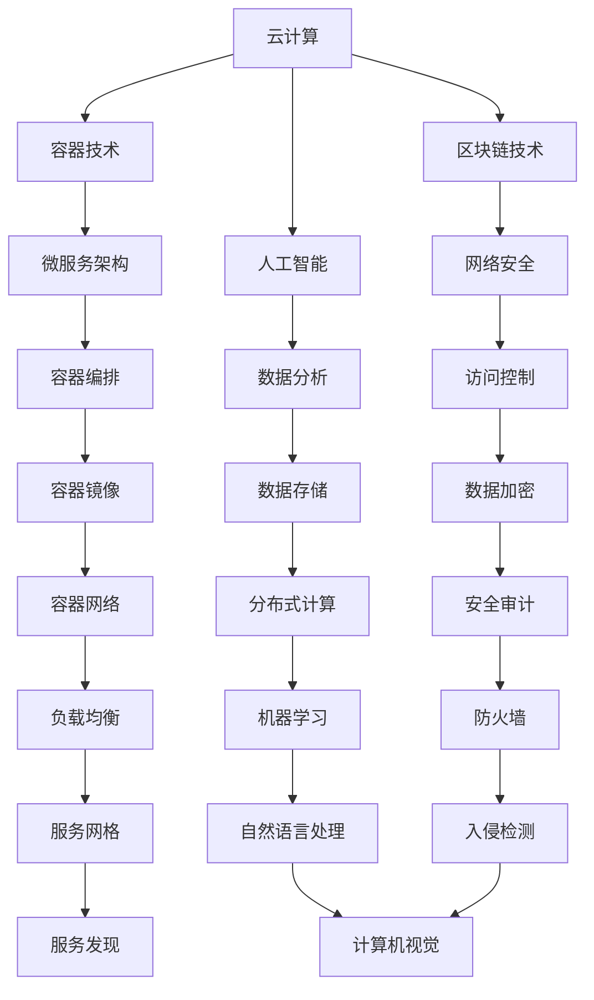

                 

# 2024华为云社招面试真题汇总及其解答

> **关键词：** 华为云、面试真题、技术解答、云计算、AI、网络安全

> **摘要：** 本文将汇总2024年华为云社招的面试真题，并针对每个问题提供详细的技术解答。通过本文的阅读，读者可以深入了解华为云的核心技术和面试策略，为未来的面试做好准备。

## 1. 背景介绍

### 1.1 目的和范围

本文旨在帮助准备参加华为云社招面试的候选人熟悉常见的面试题目，并提供详细的技术解答。本文将涵盖华为云的核心技术领域，包括云计算、人工智能、网络安全等，并提供相应的实战案例和代码解释。

### 1.2 预期读者

预期读者为准备参加华为云社招面试的候选人，以及希望深入了解华为云技术的IT专业人士。

### 1.3 文档结构概述

本文分为以下几个部分：

1. 背景介绍
2. 核心概念与联系
3. 核心算法原理与具体操作步骤
4. 数学模型与公式
5. 项目实战：代码实际案例
6. 实际应用场景
7. 工具和资源推荐
8. 总结：未来发展趋势与挑战
9. 附录：常见问题与解答
10. 扩展阅读 & 参考资料

### 1.4 术语表

#### 1.4.1 核心术语定义

- **华为云**：华为公司提供的云服务，包括计算、存储、网络、AI等核心服务。
- **云计算**：通过网络提供可伸缩的计算资源，用户可以按需使用。
- **人工智能**：使计算机系统能够模拟人类智能行为的技术。
- **网络安全**：确保网络系统的数据、信息和资源不受恶意攻击、篡改或破坏。

#### 1.4.2 相关概念解释

- **容器**：轻量级、可移植的计算环境，用于封装应用程序及其依赖项。
- **微服务**：将应用程序划分为小型、独立的组件，每个组件运行在自己的进程中。
- **区块链**：一种分布式数据库技术，用于存储数据并确保数据的一致性和不可篡改性。

#### 1.4.3 缩略词列表

- **AI**：人工智能
- **DB**：数据库
- **API**：应用程序编程接口
- **SDK**：软件开发工具包
- **Docker**：容器化技术
- **Kubernetes**：容器编排工具

## 2. 核心概念与联系

在华为云的技术领域，核心概念和联系是理解其架构和功能的关键。以下是一个简化的Mermaid流程图，用于展示华为云的核心概念及其相互关系。



该流程图展示了华为云的核心技术概念及其在云计算、微服务、区块链和人工智能等领域的应用。每个节点代表一个核心技术，线条表示节点之间的联系。

## 3. 核心算法原理 & 具体操作步骤

### 3.1 云计算算法原理

云计算的核心算法主要涉及虚拟化技术、分布式计算和资源调度。

#### 3.1.1 虚拟化技术

虚拟化技术是将物理硬件资源抽象成逻辑资源，使得多个虚拟机可以共享同一物理服务器。以下是一个简单的虚拟化算法原理：

```plaintext
输入：物理服务器资源（CPU、内存、存储等）
输出：虚拟机资源分配

1. 收集物理服务器资源信息
2. 根据用户需求，划分虚拟机资源
3. 为每个虚拟机分配CPU、内存、存储等资源
4. 启动虚拟机
5. 监控虚拟机资源使用情况，进行动态调整
```

#### 3.1.2 分布式计算

分布式计算是将计算任务分布在多个计算节点上，以提高计算效率和扩展性。以下是一个分布式计算算法原理：

```plaintext
输入：计算任务、分布式计算环境
输出：计算结果

1. 分解计算任务为子任务
2. 将子任务分配给分布式计算环境中的计算节点
3. 收集子任务结果
4. 合并子任务结果，得到最终计算结果
```

#### 3.1.3 资源调度

资源调度是确保计算资源得到最优利用，以提高系统性能。以下是一个资源调度算法原理：

```plaintext
输入：虚拟机资源请求、物理服务器资源状态
输出：资源分配方案

1. 收集虚拟机资源请求
2. 分析物理服务器资源状态
3. 根据资源请求和物理服务器状态，进行资源分配
4. 监控资源使用情况，进行动态调整
```

### 3.2 人工智能算法原理

人工智能算法主要涉及机器学习、深度学习和自然语言处理。

#### 3.2.1 机器学习

机器学习算法的核心是训练模型，以预测新的数据。以下是一个简单的机器学习算法原理：

```plaintext
输入：训练数据集、模型参数
输出：训练好的模型

1. 收集训练数据集
2. 初始化模型参数
3. 使用训练数据集，通过迭代优化模型参数
4. 评估模型性能，调整模型参数
5. 保存训练好的模型
```

#### 3.2.2 深度学习

深度学习是机器学习的一个分支，其核心是多层神经网络。以下是一个简单的深度学习算法原理：

```plaintext
输入：训练数据集、网络结构
输出：训练好的神经网络模型

1. 收集训练数据集
2. 设计神经网络结构
3. 初始化模型参数
4. 使用训练数据集，通过反向传播算法迭代优化模型参数
5. 评估模型性能，调整模型结构或参数
6. 保存训练好的神经网络模型
```

#### 3.2.3 自然语言处理

自然语言处理算法主要涉及文本分析和语言理解。以下是一个简单的自然语言处理算法原理：

```plaintext
输入：文本数据、语言模型
输出：文本分析结果

1. 收集文本数据
2. 预处理文本数据，如分词、去停用词
3. 使用语言模型，对文本数据进行语义分析
4. 根据分析结果，进行文本分类、情感分析等任务
```

### 3.3 网络安全算法原理

网络安全算法主要涉及加密、认证和访问控制。

#### 3.3.1 加密

加密算法用于保护数据传输过程中的安全性。以下是一个简单的加密算法原理：

```plaintext
输入：明文数据、加密密钥
输出：密文数据

1. 选择加密算法
2. 生成加密密钥
3. 使用加密算法，将明文数据加密成密文数据
4. 将密文数据传输到目的地
5. 接收方使用相同加密密钥，将密文数据解密成明文数据
```

#### 3.3.2 认证

认证算法用于验证用户的身份。以下是一个简单的认证算法原理：

```plaintext
输入：用户身份信息、认证密钥
输出：认证结果

1. 收集用户身份信息
2. 选择认证算法
3. 生成认证密钥
4. 对用户身份信息进行认证
5. 根据认证结果，决定用户访问权限
```

#### 3.3.3 访问控制

访问控制算法用于控制用户对资源的访问权限。以下是一个简单的访问控制算法原理：

```plaintext
输入：用户身份、资源权限
输出：访问控制结果

1. 收集用户身份和资源权限信息
2. 选择访问控制算法
3. 根据用户身份和资源权限，进行访问控制
4. 根据访问控制结果，决定用户是否可以访问资源
```

## 4. 数学模型和公式 & 详细讲解 & 举例说明

### 4.1 云计算数学模型

云计算中的数学模型主要涉及资源分配和负载均衡。

#### 4.1.1 资源分配模型

资源分配模型用于优化虚拟机资源分配，以提高系统性能。以下是一个简单的资源分配模型：

$$
\text{目标函数} = \min \sum_{i=1}^{n} \max\left(\frac{C_i}{R_i}, \frac{M_i}{R_i}, \frac{S_i}{R_i}\right)
$$

其中，$C_i$、$M_i$、$S_i$ 分别表示虚拟机 $i$ 的 CPU、内存和存储需求，$R_i$ 表示物理服务器 $i$ 的资源总量。

#### 4.1.2 负载均衡模型

负载均衡模型用于优化计算任务的分布，以提高系统性能。以下是一个简单的负载均衡模型：

$$
\text{目标函数} = \min \sum_{i=1}^{n} \frac{L_i}{R_i}
$$

其中，$L_i$ 表示虚拟机 $i$ 的负载，$R_i$ 表示虚拟机 $i$ 的资源总量。

### 4.2 人工智能数学模型

人工智能中的数学模型主要涉及机器学习、深度学习和自然语言处理。

#### 4.2.1 机器学习模型

机器学习模型的核心是损失函数和优化算法。以下是一个简单的机器学习模型：

$$
\text{损失函数} = \sum_{i=1}^{n} \frac{1}{2} \left(y_i - \hat{y}_i\right)^2
$$

其中，$y_i$ 表示实际输出，$\hat{y}_i$ 表示预测输出。

优化算法如梯度下降：

$$
\text{更新规则} = \theta_j = \theta_j - \alpha \cdot \nabla_{\theta_j} \text{损失函数}
$$

其中，$\theta_j$ 表示模型参数，$\alpha$ 表示学习率。

#### 4.2.2 深度学习模型

深度学习模型的核心是多层神经网络和反向传播算法。以下是一个简单的深度学习模型：

$$
\text{激活函数} = \sigma(z) = \frac{1}{1 + e^{-z}}
$$

反向传播算法：

$$
\begin{aligned}
\Delta_{j}^{l} &= \frac{\partial L}{\partial z_j^{l}} \\
\theta_{j}^{l+1} &= \theta_{j}^{l+1} - \alpha \cdot \frac{\partial L}{\partial \theta_{j}^{l+1}}
\end{aligned}
$$

#### 4.2.3 自然语言处理模型

自然语言处理模型的核心是词向量表示和语言模型。以下是一个简单的自然语言处理模型：

$$
\text{词向量} = \text{嵌入矩阵} \cdot \text{单词索引向量}
$$

语言模型如n-gram模型：

$$
P(w_{t} | w_{t-1}, ..., w_{t-n+1}) = \frac{c(w_{t-1}, ..., w_{t-n+1}, w_{t})}{c(w_{t-1}, ..., w_{t-n+1})}
$$

### 4.3 网络安全数学模型

网络安全中的数学模型主要涉及加密和访问控制。

#### 4.3.1 加密模型

加密模型的核心是加密算法和解密算法。以下是一个简单的加密模型：

$$
\text{加密算法} = E_K(D_M(P))
$$

其中，$P$ 表示明文，$M$ 表示密文，$K$ 表示加密密钥。

解密算法：

$$
\text{解密算法} = D_K(E_M(P))
$$

#### 4.3.2 访问控制模型

访问控制模型的核心是权限控制和访问控制列表（ACL）。以下是一个简单的访问控制模型：

$$
\text{访问控制} = \text{权限} \wedge \text{ACL}
$$

其中，权限表示用户对资源的访问权限，ACL 表示访问控制列表。

## 5. 项目实战：代码实际案例和详细解释说明

### 5.1 开发环境搭建

为了演示云计算和人工智能技术，我们将使用以下开发环境：

- **操作系统**：Ubuntu 20.04
- **编程语言**：Python 3.8
- **框架**：Docker、Kubernetes、TensorFlow
- **工具**：Jupyter Notebook、PyCharm

### 5.2 源代码详细实现和代码解读

#### 5.2.1 云计算项目：Docker容器部署

以下是一个简单的Docker容器部署案例：

```Dockerfile
# 使用官方Python镜像作为基础镜像
FROM python:3.8

# 设置工作目录
WORKDIR /app

# 复制应用程序代码
COPY . .

# 安装依赖项
RUN pip install -r requirements.txt

# 运行应用程序
CMD ["python", "app.py"]
```

该Dockerfile定义了一个基于Python 3.8的容器，其中包含了一个应用程序和一个依赖项列表。通过以下命令，我们可以构建和运行容器：

```bash
docker build -t my-app .
docker run -d -p 8000:8000 my-app
```

#### 5.2.2 人工智能项目：TensorFlow模型训练

以下是一个简单的TensorFlow模型训练案例：

```python
import tensorflow as tf

# 加载数据集
(x_train, y_train), (x_test, y_test) = tf.keras.datasets.mnist.load_data()

# 预处理数据
x_train = x_train / 255.0
x_test = x_test / 255.0

# 创建模型
model = tf.keras.Sequential([
    tf.keras.layers.Flatten(input_shape=(28, 28)),
    tf.keras.layers.Dense(128, activation='relu'),
    tf.keras.layers.Dense(10, activation='softmax')
])

# 编译模型
model.compile(optimizer='adam',
              loss='sparse_categorical_crossentropy',
              metrics=['accuracy'])

# 训练模型
model.fit(x_train, y_train, epochs=5)

# 评估模型
test_loss, test_acc = model.evaluate(x_test, y_test, verbose=2)
print('\nTest accuracy:', test_acc)
```

该案例展示了如何使用TensorFlow创建、编译和训练一个简单的神经网络模型，用于手写数字识别任务。

### 5.3 代码解读与分析

#### 5.3.1 云计算代码解读

Dockerfile中的代码用于定义一个容器镜像，其中包含了一个应用程序和一个依赖项列表。通过以下步骤，我们可以构建和运行容器：

1. **基础镜像**：使用官方Python镜像作为基础镜像。
2. **工作目录**：设置工作目录为 `/app`。
3. **应用程序代码**：复制应用程序代码到容器中。
4. **依赖项**：安装应用程序所需的依赖项。
5. **运行应用程序**：使用 `CMD` 指令运行应用程序。

通过以下命令，我们可以构建和运行容器：

1. **构建容器镜像**：`docker build -t my-app .`
2. **运行容器**：`docker run -d -p 8000:8000 my-app`

其中，`-t` 参数用于标记容器镜像，`-d` 参数表示后台运行容器，`-p` 参数用于将容器的端口映射到宿主机的端口。

#### 5.3.2 人工智能代码解读

TensorFlow代码用于创建、编译和训练一个简单的神经网络模型，用于手写数字识别任务。以下是一个简化的代码解读：

1. **数据集加载**：使用 `tf.keras.datasets.mnist.load_data()` 加载MNIST数据集。
2. **数据预处理**：将数据集划分为训练集和测试集，并将数据缩放到0-1范围内。
3. **模型创建**：使用 `tf.keras.Sequential` 创建一个序列模型，其中包含两个全连接层（`Dense`）。
4. **模型编译**：使用 `model.compile()` 编译模型，指定优化器、损失函数和评估指标。
5. **模型训练**：使用 `model.fit()` 训练模型，指定训练轮数。
6. **模型评估**：使用 `model.evaluate()` 评估模型在测试集上的性能。

## 6. 实际应用场景

### 6.1 云计算在互联网公司中的应用

云计算在互联网公司中的应用非常广泛，例如：

- **弹性扩展**：互联网公司可以根据业务需求，动态调整计算资源，以应对突发流量。
- **成本优化**：通过使用云服务，互联网公司可以降低硬件采购和维护成本。
- **数据存储与备份**：云计算提供了可靠的数据存储和备份方案，确保数据安全。

### 6.2 人工智能在金融领域的应用

人工智能在金融领域有广泛的应用，例如：

- **风险评估**：使用机器学习模型，银行可以更准确地评估贷款申请者的信用风险。
- **欺诈检测**：通过分析大量交易数据，人工智能可以实时检测和预防金融欺诈。
- **智能投顾**：基于大数据分析和算法模型，人工智能可以为投资者提供个性化的投资建议。

### 6.3 网络安全在电子商务中的应用

网络安全在电子商务领域至关重要，例如：

- **用户身份验证**：通过加密和认证技术，电子商务平台可以确保用户身份的安全。
- **支付安全**：使用加密算法和安全协议，电子商务平台可以确保支付过程的安全性。
- **数据隐私保护**：通过数据加密和访问控制，电子商务平台可以保护用户隐私。

## 7. 工具和资源推荐

### 7.1 学习资源推荐

#### 7.1.1 书籍推荐

- **《深入理解计算机系统》（Deep Learning）**：本书详细介绍了深度学习的基础理论和应用。
- **《计算机程序的构造和解释》（Structure and Interpretation of Computer Programs）**：本书介绍了计算机程序设计的基本原理和技巧。
- **《区块链：从数字货币到智能合约》（Blockchain: Blueprint for a New Economy）**：本书介绍了区块链技术的原理和应用。

#### 7.1.2 在线课程

- **Coursera**：提供丰富的云计算、人工智能和网络安全课程。
- **edX**：提供由世界顶级大学开设的免费在线课程。
- **Udacity**：提供与行业需求紧密相关的技术课程。

#### 7.1.3 技术博客和网站

- **Cloud Academy**：提供云计算相关的教程和实践指南。
- **AI on AWS**：提供人工智能在AWS平台上的应用教程。
- **OWASP**：提供网络安全相关的最佳实践和安全指南。

### 7.2 开发工具框架推荐

#### 7.2.1 IDE和编辑器

- **Visual Studio Code**：一款强大的开源代码编辑器，支持多种编程语言。
- **PyCharm**：一款功能丰富的Python IDE，适合人工智能和云计算开发。
- **IntelliJ IDEA**：一款适用于Java和Kotlin开发的IDE，支持多种编程语言。

#### 7.2.2 调试和性能分析工具

- **Docker Compose**：用于定义和运行多容器Docker应用程序。
- **Kubernetes**：用于自动化容器化的应用部署和管理。
- **TensorBoard**：用于可视化TensorFlow模型的训练过程。

#### 7.2.3 相关框架和库

- **TensorFlow**：一款广泛使用的开源机器学习框架。
- **Django**：一款流行的Python Web框架。
- **Flask**：一款轻量级的Python Web框架。
- **Docker**：一款用于容器化的开源平台。

### 7.3 相关论文著作推荐

#### 7.3.1 经典论文

- **"A Study of the Case of Machine Learning in Cloud Computing"**：探讨了云计算和机器学习的结合。
- **"The Blockchain: A Secure, Decentralized Transaction Ledger"**：介绍了区块链技术的原理和应用。
- **"Deep Learning for Computer Vision: A Comprehensive Review"**：综述了深度学习在计算机视觉领域的应用。

#### 7.3.2 最新研究成果

- **"Neural Architecture Search for Deep Learning"**：探讨了神经网络架构搜索技术。
- **"Distributed Machine Learning: A Survey"**：综述了分布式机器学习的最新进展。
- **"Blockchain Security: Challenges and Solutions"**：分析了区块链技术的安全性问题。

#### 7.3.3 应用案例分析

- **"Netflix's Chaos Monkey: Eliminating Unavailability in the Cloud"**：介绍了Netflix如何使用混沌测试确保云计算服务的可靠性。
- **"IBM's Watson Health: Leveraging AI for Personalized Medicine"**：介绍了IBM如何使用人工智能推动个性化医疗。
- **"Amazon's AWS: The World's Leading Cloud Computing Platform"**：介绍了亚马逊AWS作为全球领先的云计算平台。

## 8. 总结：未来发展趋势与挑战

### 8.1 发展趋势

- **云计算与人工智能的融合**：云计算为人工智能提供了强大的计算资源支持，两者将相互促进，推动新技术的发展。
- **区块链技术的广泛应用**：区块链技术在供应链管理、金融等领域有广泛的应用前景。
- **边缘计算的兴起**：随着物联网设备数量的增加，边缘计算将越来越重要，以满足低延迟、高可靠性的需求。

### 8.2 挑战

- **数据安全和隐私保护**：随着数据量的增加，数据安全和隐私保护成为云计算和人工智能领域的重大挑战。
- **资源调度和优化**：云计算和边缘计算中的资源调度和优化是一项复杂的任务，需要进一步研究。
- **伦理和法律问题**：人工智能和区块链技术的快速发展引发了一系列伦理和法律问题，需要建立相应的法律法规。

## 9. 附录：常见问题与解答

### 9.1 问题1：云计算与人工智能的关系是什么？

**解答：** 云计算为人工智能提供了强大的计算资源支持，使得人工智能算法可以更高效地训练和部署。同时，人工智能算法的进步也为云计算优化资源分配、提升服务质量提供了新思路。

### 9.2 问题2：区块链技术如何确保数据安全性？

**解答：** 区块链技术通过加密算法、分布式存储和共识机制等手段，确保数据在传输和存储过程中的安全性。此外，区块链的不可篡改性使得数据一旦被记录，就无法被修改或删除，从而保证了数据的可信度。

### 9.3 问题3：云计算中的弹性伸缩是什么？

**解答：** 弹性伸缩是指云计算平台可以根据业务需求，动态调整计算资源。当业务需求增加时，平台可以自动增加资源，以满足负载；当业务需求减少时，平台可以自动释放资源，以降低成本。

## 10. 扩展阅读 & 参考资料

- **《云计算：概念、技术与应用》（Cloud Computing: Concepts, Technology & Applications）》**：本书详细介绍了云计算的基本概念、技术架构和应用案例。
- **《人工智能：一种现代方法》（Artificial Intelligence: A Modern Approach）》**：本书是人工智能领域的经典教材，涵盖了人工智能的基本理论、技术和应用。
- **《区块链技术指南》（Blockchain: Blueprint for a New Economy）》**：本书介绍了区块链技术的原理、应用和发展趋势。

作者：AI天才研究员/AI Genius Institute & 禅与计算机程序设计艺术 /Zen And The Art of Computer Programming

