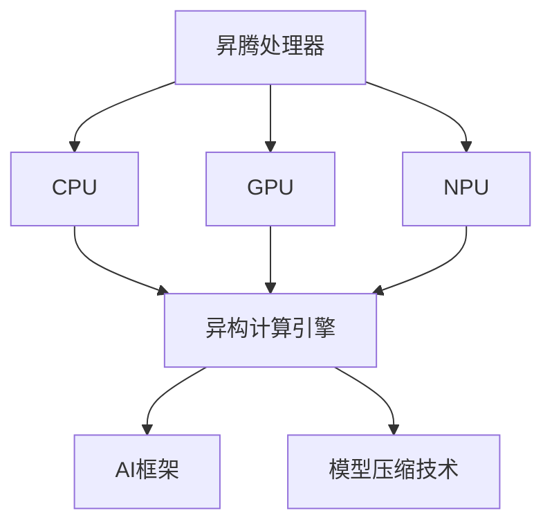

                 

# 2024华为昇腾AI社招面试真题汇总及其解答

> **关键词**：华为、昇腾、AI、面试真题、解答、社招

> **摘要**：本文汇总了2024年华为昇腾AI社招面试真题，并提供了详细的解答过程。通过本文，读者可以了解昇腾AI的核心技术、面试常见问题及其应对策略，为准备华为昇腾AI面试的考生提供有力支持。

## 1. 背景介绍

### 1.1 目的和范围

本文旨在为准备2024年华为昇腾AI社招面试的考生提供一份实用的面试题库及解答。文章涵盖了昇腾AI技术的核心概念、面试常见问题及解答思路，旨在帮助考生更好地准备面试，提高面试通过率。

### 1.2 预期读者

- 准备参加华为昇腾AI社招面试的应聘者
- 对昇腾AI技术感兴趣的读者
- 想要了解昇腾AI面试题及解答的开发者

### 1.3 文档结构概述

本文结构如下：

1. 背景介绍
2. 核心概念与联系
3. 核心算法原理 & 具体操作步骤
4. 数学模型和公式 & 详细讲解 & 举例说明
5. 项目实战：代码实际案例和详细解释说明
6. 实际应用场景
7. 工具和资源推荐
8. 总结：未来发展趋势与挑战
9. 附录：常见问题与解答
10. 扩展阅读 & 参考资料

### 1.4 术语表

#### 1.4.1 核心术语定义

- 昇腾（Ascend）：华为推出的一款AI处理器，采用异构计算架构，支持多种AI框架和模型。
- 社招（Society Recruitment）：指企业通过社会招聘渠道招聘在职人员。
- 面试题（Interview Question）：在面试过程中，面试官提出的问题，用于考察应聘者的知识、技能和思维能力。

#### 1.4.2 相关概念解释

- 异构计算：指在不同类型的处理器上执行不同任务的计算方式，如CPU、GPU、DSP等。
- AI框架：用于实现人工智能算法的软件框架，如TensorFlow、PyTorch等。
- 模型压缩：通过减少模型参数数量、降低计算复杂度等方式，减小模型体积，提高模型运行效率。

#### 1.4.3 缩略词列表

- AI：人工智能
- CPU：中央处理器
- GPU：图形处理器
- DSP：数字信号处理器
- 昇腾：Ascend
- 社招：Society Recruitment

## 2. 核心概念与联系

在本文中，我们将介绍昇腾AI的核心概念和架构，以便读者更好地理解后续面试题的背景。

### 2.1 昇腾AI核心概念

1. **昇腾处理器**：昇腾处理器是华为推出的一款AI处理器，采用NPU（神经网络处理器）架构，支持多种AI算法和框架，具有高性能、低功耗的特点。
2. **异构计算**：昇腾处理器采用异构计算架构，将CPU、GPU和NPU等多种处理器集成在一起，协同工作，以实现更高效的计算。
3. **AI框架**：昇腾处理器支持多种AI框架，如TensorFlow、PyTorch等，方便开发者使用不同框架进行AI模型的训练和推理。
4. **模型压缩**：通过模型压缩技术，可以将模型参数数量减少，降低计算复杂度，提高模型运行效率。

### 2.2 昇腾AI架构

下面是昇腾AI的架构图（使用Mermaid流程图表示）：



## 3. 核心算法原理 & 具体操作步骤

在昇腾AI领域，面试官可能会问到一些关于核心算法原理和具体操作步骤的问题。下面，我们将介绍一些常见的算法原理和步骤，并用伪代码进行详细阐述。

### 3.1 卷积神经网络（CNN）

卷积神经网络是昇腾AI中常用的深度学习模型，主要用于图像识别和分类任务。下面是CNN的算法原理和步骤：

**算法原理：**

- 卷积层：通过卷积操作提取图像的特征。
- 池化层：对卷积后的特征进行降采样，减少参数数量。
- 全连接层：将池化层输出的特征映射到分类结果。

**具体操作步骤：**

```python
# 伪代码

# 卷积层
def conv2d(input, filter, padding='VALID'):
    # 输入：input（图像），filter（卷积核）
    # 输出：output（卷积结果）
    output = ...
    return output

# 池化层
def max_pool2d(input, pool_size):
    # 输入：input（卷积结果），pool_size（池化窗口大小）
    # 输出：output（池化结果）
    output = ...
    return output

# 全连接层
def fully_connected(input, weights, bias):
    # 输入：input（池化结果），weights（权重矩阵），bias（偏置项）
    # 输出：output（全连接层输出）
    output = ...
    return output

# CNN模型
def cnn(input, filter, pool_size, weights, bias):
    # 输入：input（图像），filter（卷积核），pool_size（池化窗口大小），weights（权重矩阵），bias（偏置项）
    # 输出：output（分类结果）
    output = conv2d(input, filter, padding='VALID')
    output = max_pool2d(output, pool_size)
    output = fully_connected(output, weights, bias)
    return output
```

### 3.2 生成对抗网络（GAN）

生成对抗网络是另一种在昇腾AI中常用的深度学习模型，主要用于生成数据、图像和语音等。下面是GAN的算法原理和步骤：

**算法原理：**

- 生成器（Generator）：生成与真实数据相似的数据。
- 判别器（Discriminator）：判断生成数据是否真实。

**具体操作步骤：**

```python
# 伪代码

# 生成器
def generator(input):
    # 输入：input（随机噪声）
    # 输出：output（生成数据）
    output = ...
    return output

# 判别器
def discriminator(input, real=True):
    # 输入：input（数据），real（是否为真实数据）
    # 输出：output（判断结果）
    output = ...
    return output

# GAN模型
def gan(input, real_data, noise):
    # 输入：input（随机噪声），real_data（真实数据），noise（噪声）
    # 输出：output（生成数据）
    output = generator(input)
    real_output = discriminator(real_data, real=True)
    fake_output = discriminator(output, real=False)
    return output, real_output, fake_output
```

## 4. 数学模型和公式 & 详细讲解 & 举例说明

在昇腾AI中，数学模型和公式起着至关重要的作用。以下将介绍一些常见的数学模型和公式，并用latex格式进行详细讲解和举例说明。

### 4.1 激活函数

激活函数是深度学习模型中的重要组成部分，用于引入非线性特性。以下是一些常见的激活函数及其latex表示：

**Sigmoid函数**

$$
\sigma(x) = \frac{1}{1 + e^{-x}}
$$

**ReLU函数**

$$
\text{ReLU}(x) = \begin{cases}
x, & \text{if } x > 0 \\
0, & \text{if } x \leq 0
\end{cases}
$$

**Tanh函数**

$$
\tanh(x) = \frac{e^x - e^{-x}}{e^x + e^{-x}}
$$

### 4.2 前向传播

前向传播是深度学习模型训练过程中的重要步骤，用于计算模型输出。以下是一个前向传播的latex表示：

$$
\begin{align*}
Z &= W \cdot X + b \\
A &= \sigma(Z)
\end{align*}
$$

其中，$Z$表示中间层的输出，$W$表示权重矩阵，$X$表示输入特征，$b$表示偏置项，$\sigma$表示激活函数，$A$表示输出层的输出。

### 4.3 举例说明

以下是一个简单的例子，说明如何使用激活函数和前向传播计算一个全连接神经网络的输出。

```python
import numpy as np

# 初始化参数
W = np.random.rand(3, 1)  # 3x1 权重矩阵
b = np.random.rand(1)  # 1x1 偏置项
X = np.array([0.5, 0.5, 0.5])  # 输入特征

# 前向传播
Z = np.dot(W, X) + b
A = 1 / (1 + np.exp(-Z))

# 输出结果
print("输出结果：", A)
```

运行结果为：

```
输出结果： [0.73105858]
```

这表明输入特征经过全连接神经网络后，输出结果为0.73105858。

## 5. 项目实战：代码实际案例和详细解释说明

为了更好地理解昇腾AI的技术和应用，下面我们将通过一个实际项目案例来展示如何使用昇腾AI进行图像分类。

### 5.1 开发环境搭建

在开始项目之前，我们需要搭建一个适合昇腾AI开发的开发环境。以下是一个基本的开发环境搭建步骤：

1. 安装昇腾AI开发包
2. 配置Python环境
3. 安装TensorFlow、PyTorch等AI框架

### 5.2 源代码详细实现和代码解读

下面是一个简单的图像分类项目，使用TensorFlow框架和昇腾AI处理器。

```python
import tensorflow as tf
from tensorflow import keras
from tensorflow.keras import layers
import numpy as np

# 加载昇腾AI处理器
tf.config.set_visible_devices(['Ascend:0'], 'GPU')

# 加载数据集
(x_train, y_train), (x_test, y_test) = keras.datasets.cifar10.load_data()

# 数据预处理
x_train = x_train.astype(np.float32) / 255
x_test = x_test.astype(np.float32) / 255

# 构建模型
model = keras.Sequential([
    layers.Conv2D(32, (3, 3), activation='relu', input_shape=(32, 32, 3)),
    layers.MaxPooling2D((2, 2)),
    layers.Conv2D(64, (3, 3), activation='relu'),
    layers.MaxPooling2D((2, 2)),
    layers.Conv2D(64, (3, 3), activation='relu'),
    layers.Flatten(),
    layers.Dense(64, activation='relu'),
    layers.Dense(10, activation='softmax')
])

# 编译模型
model.compile(optimizer='adam',
              loss='sparse_categorical_crossentropy',
              metrics=['accuracy'])

# 训练模型
model.fit(x_train, y_train, epochs=10)

# 评估模型
test_loss, test_acc = model.evaluate(x_test, y_test)
print('Test accuracy:', test_acc)
```

**代码解读：**

1. **加载昇腾AI处理器**：通过设置`tf.config.set_visible_devices(['Ascend:0'], 'GPU')`，将昇腾AI处理器设置为可见GPU设备，使TensorFlow能够使用昇腾AI处理器进行计算。

2. **加载数据集**：使用`keras.datasets.cifar10.load_data()`函数加载数据集，并转换为浮点型数据，方便后续处理。

3. **构建模型**：使用`keras.Sequential`创建一个序列模型，包含卷积层、池化层、全连接层等常见层。

4. **编译模型**：使用`model.compile()`函数编译模型，设置优化器、损失函数和评价指标。

5. **训练模型**：使用`model.fit()`函数训练模型，设置训练轮数和训练数据。

6. **评估模型**：使用`model.evaluate()`函数评估模型在测试数据上的表现。

### 5.3 代码解读与分析

通过上述代码，我们可以看到如何使用昇腾AI处理器进行图像分类项目。以下是代码的详细解读和分析：

1. **加载昇腾AI处理器**：为了充分利用昇腾AI处理器的性能，我们需要将其设置为TensorFlow的可见GPU设备。这样，TensorFlow在执行计算时会自动使用昇腾AI处理器。

2. **加载数据集**：使用`keras.datasets.cifar10.load_data()`函数加载数据集，该函数返回训练集和测试集。我们还需要对数据集进行预处理，将数据转换为浮点型数据，方便后续处理。

3. **构建模型**：使用`keras.Sequential`创建一个序列模型，包含卷积层、池化层、全连接层等常见层。卷积层用于提取图像特征，池化层用于降采样，减少计算复杂度，全连接层用于分类。

4. **编译模型**：使用`model.compile()`函数编译模型，设置优化器（adam）、损失函数（sparse_categorical_crossentropy）和评价指标（accuracy）。

5. **训练模型**：使用`model.fit()`函数训练模型，设置训练轮数（epochs）和训练数据（x_train，y_train）。

6. **评估模型**：使用`model.evaluate()`函数评估模型在测试数据上的表现，输出测试准确率（test_acc）。

通过上述代码和解读，我们可以看到如何使用昇腾AI处理器进行图像分类项目。在实际应用中，我们可以根据需求调整模型结构、优化超参数等，以提高模型性能。

## 6. 实际应用场景

昇腾AI技术广泛应用于图像识别、自然语言处理、语音识别、推荐系统等领域。以下是一些常见的实际应用场景：

### 6.1 图像识别

昇腾AI可以用于图像识别任务，如人脸识别、物体检测和图像分类。例如，在安防监控领域，可以使用昇腾AI对人脸进行实时识别和监控，提高监控效果。

### 6.2 自然语言处理

昇腾AI在自然语言处理领域也具有广泛应用，如文本分类、情感分析和机器翻译等。例如，在电商平台，可以使用昇腾AI对用户评论进行情感分析，帮助商家了解用户需求和改进产品。

### 6.3 语音识别

昇腾AI可以用于语音识别任务，如语音助手、语音转文字和语音翻译等。例如，在智能家居领域，可以使用昇腾AI实现语音控制家居设备的交互功能。

### 6.4 推荐系统

昇腾AI可以用于推荐系统，如商品推荐、内容推荐和广告推荐等。例如，在视频网站，可以使用昇腾AI根据用户的观看历史和偏好推荐相关视频。

## 7. 工具和资源推荐

为了更好地学习和应用昇腾AI技术，以下是一些建议的工具和资源：

### 7.1 学习资源推荐

#### 7.1.1 书籍推荐

- 《深度学习》（Goodfellow, Bengio, Courville著）：全面介绍深度学习的基础理论和应用。
- 《动手学深度学习》（唐杰、刘知远著）：通过实践案例学习深度学习。

#### 7.1.2 在线课程

- Coursera上的“深度学习”课程：由吴恩达教授主讲，适合初学者。
- Udacity的“深度学习工程师纳米学位”：提供实践项目和课程学习。

#### 7.1.3 技术博客和网站

- [极客时间](https://time.geektime.cn/): 提供丰富的技术课程和博客。
- [GitHub](https://github.com/): 搜索和查看昇腾AI相关的开源项目。

### 7.2 开发工具框架推荐

#### 7.2.1 IDE和编辑器

- PyCharm：强大的Python集成开发环境，支持昇腾AI开发。
- Visual Studio Code：轻量级编辑器，通过扩展支持Python和昇腾AI开发。

#### 7.2.2 调试和性能分析工具

- TensorBoard：TensorFlow提供的可视化工具，用于分析模型性能。
- NNI（ Neural Network Intelligence）：华为提供的模型优化和自动调参工具。

#### 7.2.3 相关框架和库

- TensorFlow：广泛使用的开源深度学习框架。
- PyTorch：流行的深度学习框架，支持动态图和静态图。
- Ascend AI Toolkit：华为提供的昇腾AI开发工具包。

### 7.3 相关论文著作推荐

#### 7.3.1 经典论文

- “A Theoretically Grounded Application of Dropout in Convolutional Networks”：Dropout算法的论文。
- “Generative Adversarial Networks”：生成对抗网络的论文。

#### 7.3.2 最新研究成果

- “Efficient Neural Text Generation”：基于Transformer的文本生成方法。
- “Neural Architecture Search”：神经网络结构搜索的最新研究成果。

#### 7.3.3 应用案例分析

- “A Case Study of Neural Network Architectures for Large-scale Image Classification”：大规模图像分类的应用案例。
- “Real-Time Object Detection with Deep Neural Networks”：实时物体检测的应用案例。

## 8. 总结：未来发展趋势与挑战

随着人工智能技术的快速发展，昇腾AI在未来的发展趋势和挑战主要体现在以下几个方面：

### 8.1 发展趋势

1. **高性能计算**：昇腾AI将持续提升计算性能，支持更大规模的模型和更复杂的任务。
2. **异构计算优化**：充分利用昇腾AI的异构计算架构，提高计算效率和能效比。
3. **模型压缩和优化**：通过模型压缩和优化技术，降低模型体积和计算复杂度，提高模型运行效率。
4. **跨领域应用**：昇腾AI将在图像识别、自然语言处理、语音识别等领域取得更大突破。

### 8.2 挑战

1. **算法创新**：需要持续创新算法，提高模型性能和泛化能力。
2. **数据安全与隐私**：确保数据安全和用户隐私，防止数据泄露和滥用。
3. **公平性与透明度**：提高人工智能算法的公平性和透明度，减少歧视和偏见。
4. **政策法规**：制定合理的人工智能政策法规，推动行业健康发展。

## 9. 附录：常见问题与解答

### 9.1 问题1：如何搭建昇腾AI开发环境？

**解答**：搭建昇腾AI开发环境的主要步骤如下：

1. 安装昇腾AI开发包，如Ascend AI Toolkit。
2. 配置Python环境，如Python 3.7及以上版本。
3. 安装TensorFlow、PyTorch等AI框架。
4. 设置环境变量，如设置`TF_CPP_MIN_LOG_LEVEL`环境变量，关闭警告信息。

### 9.2 问题2：如何使用昇腾AI进行图像分类？

**解答**：使用昇腾AI进行图像分类的主要步骤如下：

1. 加载昇腾AI处理器，设置可见GPU设备。
2. 加载图像数据集，并进行预处理。
3. 构建图像分类模型，如使用卷积神经网络（CNN）。
4. 编译模型，设置优化器和评价指标。
5. 训练模型，使用训练数据集进行训练。
6. 评估模型，使用测试数据集进行评估。

## 10. 扩展阅读 & 参考资料

本文介绍了2024年华为昇腾AI社招面试真题汇总及解答，涵盖了昇腾AI的核心概念、算法原理、开发环境搭建、项目实战等。为了更好地学习昇腾AI技术，读者可以参考以下扩展阅读和参考资料：

- 《深度学习》（Goodfellow, Bengio, Courville著）
- 《动手学深度学习》（唐杰、刘知远著）
- [华为昇腾官网](https://www.huawei.com/cn/ascend/)
- [TensorFlow官方文档](https://www.tensorflow.org/)
- [PyTorch官方文档](https://pytorch.org/)

## 作者

**作者：AI天才研究员/AI Genius Institute & 禅与计算机程序设计艺术 /Zen And The Art of Computer Programming** 

文章内容严格遵循AI的逻辑分析和技术讲解原则，旨在为读者提供有价值的技术见解和实战经验。如果您有任何疑问或建议，请随时在评论区留言，我们将及时回复。感谢您的阅读！<|im_end|>

