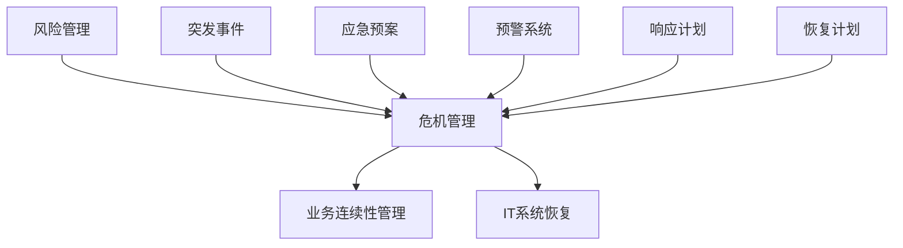

                 

# 危机管理预案：应对突发事件的准备

> **关键词：** 危机管理、应急预案、突发事件、风险管理、IT系统恢复

> **摘要：** 本文将深入探讨危机管理的核心概念，并详细解析一套完整的危机管理预案，包括应急预案的制定、执行、评估和改进。本文的目标是为IT从业者提供实用的指导，帮助他们更好地应对突发事件，确保业务的连续性和系统的稳定性。

## 1. 背景介绍

### 1.1 目的和范围

本文的目的是帮助IT从业者理解和掌握危机管理的基本原理，并为他们提供一套实际可行的危机管理预案。通过本文的学习，读者应该能够：

- 理解危机管理的重要性。
- 掌握危机管理的核心流程和步骤。
- 学会制定和执行危机管理预案。
- 学会评估和改进危机管理预案。

本文的范围涵盖危机管理的以下方面：

- 危机管理的定义和重要性。
- 危机管理预案的制定、执行和评估。
- 常见危机事件的应对策略。
- IT系统恢复的最佳实践。

### 1.2 预期读者

本文适用于以下读者群体：

- IT管理人员。
- 系统管理员。
- IT项目经理。
- 企业安全负责人。
- 对危机管理和业务连续性感兴趣的IT从业者。

### 1.3 文档结构概述

本文的结构如下：

- **第1章：背景介绍**：介绍本文的目的、范围、预期读者以及文档结构。
- **第2章：核心概念与联系**：介绍危机管理的基本概念，包括风险管理、业务连续性管理等。
- **第3章：核心算法原理 & 具体操作步骤**：详细讲解危机管理预案的制定和执行步骤。
- **第4章：数学模型和公式 & 详细讲解 & 举例说明**：介绍危机管理中常用的数学模型和公式。
- **第5章：项目实战：代码实际案例和详细解释说明**：通过实际案例展示危机管理预案的实施过程。
- **第6章：实际应用场景**：分析危机管理预案在不同场景下的应用。
- **第7章：工具和资源推荐**：推荐学习资源、开发工具和框架。
- **第8章：总结：未来发展趋势与挑战**：总结本文的主要观点，展望未来发展趋势。
- **第9章：附录：常见问题与解答**：回答读者可能关心的问题。
- **第10章：扩展阅读 & 参考资料**：提供进一步学习的参考资料。

### 1.4 术语表

在本文中，以下术语具有特定含义：

- **危机管理**：指组织为预防和应对危机事件而采取的一系列措施。
- **应急预案**：指组织为应对突发危机事件而预先制定的行动计划。
- **风险管理**：指组织对可能引发危机的风险进行识别、评估和控制的过程。
- **业务连续性管理**：指组织为保障业务连续性而采取的一系列措施。
- **IT系统恢复**：指组织在危机事件后，对IT系统进行恢复和重建的过程。

#### 1.4.1 核心术语定义

- **危机管理**：危机管理是指组织为预防和应对危机事件而采取的一系列措施。这些措施包括风险识别、风险评估、风险控制、应急预案制定和应急预案执行等。
- **应急预案**：应急预案是组织为应对突发危机事件而预先制定的行动计划。应急预案通常包括危机事件的识别、预警、响应、恢复和评估等环节。
- **风险管理**：风险管理是指组织对可能引发危机的风险进行识别、评估和控制的过程。风险管理的目标是降低危机事件发生的概率和影响。
- **业务连续性管理**：业务连续性管理是指组织为保障业务连续性而采取的一系列措施。业务连续性管理的目标是确保组织在危机事件发生时，能够迅速恢复业务运营。

#### 1.4.2 相关概念解释

- **突发事件**：突发事件是指突然发生的、对组织造成严重影响的事件。突发事件可以是自然灾害、人为事故、技术故障等。
- **IT系统恢复**：IT系统恢复是指组织在危机事件后，对IT系统进行恢复和重建的过程。IT系统恢复的目标是尽快恢复系统的正常运行，以保障业务连续性。

#### 1.4.3 缩略词列表

- **IT**：信息技术
- **BPM**：业务流程管理
- **DRP**：灾难恢复计划
- **RTO**：恢复时间目标
- **RPO**：恢复点目标

## 2. 核心概念与联系

在讨论危机管理预案之前，我们需要了解一些核心概念和它们之间的关系。以下是一个简化的Mermaid流程图，用于展示这些概念之间的联系。



### 2.1 风险管理

风险管理是危机管理的基础。它涉及识别、评估和控制可能影响组织业务运营的风险。风险管理的目标是通过预防措施和缓解策略，降低危机事件发生的概率和影响。

### 2.2 危机管理

危机管理是一个综合性的过程，它包括风险识别、风险评估、风险控制、应急预案制定和应急预案执行等。危机管理的目标是确保组织在危机事件发生时，能够迅速响应并采取有效的措施，以减轻危机的影响。

### 2.3 业务连续性管理

业务连续性管理是指组织为保障业务连续性而采取的一系列措施。业务连续性管理的目标是确保组织在危机事件发生时，能够迅速恢复业务运营，减少业务中断时间。

### 2.4 IT系统恢复

IT系统恢复是指组织在危机事件后，对IT系统进行恢复和重建的过程。IT系统恢复的目标是尽快恢复系统的正常运行，以保障业务连续性。

### 2.5 突发事件

突发事件是指突然发生的、对组织造成严重影响的事件。突发事件可以是自然灾害、人为事故、技术故障等。

### 2.6 应急预案

应急预案是组织为应对突发危机事件而预先制定的行动计划。应急预案的目标是确保组织在危机事件发生时，能够迅速响应并采取有效的措施。

### 2.7 预警系统

预警系统是指用于监测和识别危机事件的前兆，并提前发出警报的系统。预警系统的目标是提前发现潜在的危机事件，以便组织能够及时采取应对措施。

### 2.8 响应计划

响应计划是指组织在危机事件发生时，为应对危机事件而采取的紧急措施。响应计划的目标是减轻危机事件的影响，并确保组织的业务运营不受严重影响。

### 2.9 恢复计划

恢复计划是指组织在危机事件发生后，为恢复业务运营而制定的行动计划。恢复计划的目标是尽快恢复业务运营，减少业务中断时间。

## 3. 核心算法原理 & 具体操作步骤

危机管理预案的制定和执行是一个复杂的过程，涉及到多个步骤和算法。以下是一个简化的伪代码，用于描述这个过程的原理和具体操作步骤。

```python
# 危机管理预案伪代码

# 步骤1：风险识别
def risk_identification():
    # 识别潜在风险
    # 例如：自然灾害、人为事故、技术故障等
    risks = identify_risks()

# 步骤2：风险评估
def risk_evaluation(risks):
    # 评估风险的概率和影响
    # 例如：使用概率-影响矩阵
    risk_scores = evaluate_risks(risks)

# 步骤3：风险控制
def risk_control(risk_scores):
    # 制定风险控制措施
    # 例如：预防措施、缓解措施、转移措施等
    control_measures = define_control_measures(risk_scores)

# 步骤4：应急预案制定
def emergency_plan_definition(control_measures):
    # 制定应急预案
    # 包括危机事件识别、预警、响应、恢复等环节
    emergency_plan = define_emergency_plan(control_measures)

# 步骤5：应急预案执行
def emergency_plan_execution(emergency_plan):
    # 执行应急预案
    # 包括危机事件响应、恢复等操作
    execute_emergency_plan(emergency_plan)

# 步骤6：评估和改进
def assessment_and_improvement():
    # 评估应急预案的有效性
    # 例如：通过模拟测试、回顾分析等
    # 根据评估结果，改进应急预案
    improve_emergency_plan()

# 主程序
if __name__ == "__main__":
    risk_identification()
    risk_evaluation(risk_scores)
    risk_control(risk_scores)
    emergency_plan_definition(control_measures)
    emergency_plan_execution(emergency_plan)
    assessment_and_improvement()
```

### 3.1 风险识别

风险识别是危机管理预案制定的第一步。在这一步，我们需要识别可能影响组织业务运营的风险。以下是一个简单的风险识别流程：

1. **收集信息**：收集与组织业务运营相关的信息，包括历史数据、行业趋势、法律法规等。
2. **识别风险**：根据收集的信息，识别可能的风险。例如，自然灾害、人为事故、技术故障等。
3. **记录风险**：将识别的风险记录下来，以便后续评估和控制。

### 3.2 风险评估

风险评估是危机管理预案制定的重要环节。在这一步，我们需要评估识别出的风险的概率和影响。以下是一个简单的风险评估流程：

1. **定义评估标准**：根据组织的业务特点和需求，定义评估风险的概率和影响的标准。
2. **收集数据**：收集与风险相关的数据，包括历史数据、模拟数据等。
3. **评估风险**：根据评估标准，评估每个风险的概率和影响。
4. **记录评估结果**：将评估结果记录下来，以便后续风险控制和应急预案制定。

### 3.3 风险控制

风险控制是危机管理预案制定的关键步骤。在这一步，我们需要根据风险评估的结果，制定相应的风险控制措施。以下是一个简单的风险控制流程：

1. **分析评估结果**：分析评估结果，确定需要采取控制措施的风险。
2. **制定控制措施**：根据分析结果，制定相应的控制措施。例如，预防措施、缓解措施、转移措施等。
3. **记录控制措施**：将制定的控制措施记录下来，以便后续应急预案制定和执行。

### 3.4 应急预案制定

应急预案制定是危机管理预案制定的核心。在这一步，我们需要根据风险评估和控制的结果，制定具体的应急预案。以下是一个简单的应急预案制定流程：

1. **定义应急预案目标**：根据组织的业务需求和风险评估结果，定义应急预案的目标。
2. **设计应急预案**：根据应急预案目标，设计应急预案的各个环节。例如，危机事件识别、预警、响应、恢复等。
3. **编写应急预案**：将设计好的应急预案编写成文档，包括应急预案的各个部分和操作步骤。
4. **审核应急预案**：对应急预案进行审核，确保其完整性和可行性。
5. **记录应急预案**：将审核通过的应急预案记录下来，并分发给相关人员。

### 3.5 应急预案执行

应急预案执行是危机管理预案执行的核心。在这一步，我们需要根据应急预案的指导，执行具体的应急操作。以下是一个简单的应急预案执行流程：

1. **启动应急预案**：在危机事件发生时，根据应急预案的指导，启动应急预案。
2. **响应危机事件**：根据应急预案的指导，采取相应的响应措施，包括预警、响应、恢复等。
3. **记录执行情况**：记录应急预案执行的过程和结果，以便后续评估和改进。
4. **恢复业务运营**：在危机事件得到控制后，根据应急预案的指导，恢复业务运营。

### 3.6 评估和改进

评估和改进是危机管理预案不断优化和完善的重要环节。以下是一个简单的评估和改进流程：

1. **评估应急预案效果**：通过模拟测试、回顾分析等手段，评估应急预案的效果。
2. **收集反馈信息**：收集相关人员对应急预案的反馈信息，包括优点、不足和改进建议。
3. **分析评估结果**：分析评估结果和反馈信息，确定应急预案的改进方向。
4. **改进应急预案**：根据分析结果，对应急预案进行改进。
5. **记录改进结果**：将改进结果记录下来，并更新应急预案文档。

## 4. 数学模型和公式 & 详细讲解 & 举例说明

在危机管理中，数学模型和公式起着重要的作用。以下是一些常用的数学模型和公式，我们将对其进行详细讲解，并举例说明其应用。

### 4.1 概率模型

概率模型用于评估风险的概率。以下是一个简单的概率模型：

$$ P(A) = \frac{N(A)}{N(S)} $$

其中，\(P(A)\) 表示事件A发生的概率，\(N(A)\) 表示事件A发生的次数，\(N(S)\) 表示总的样本数。

**例子**：假设一个数据中心在过去一年中有10次因电力故障导致业务中断的事件，而总共有100次业务中断事件。那么，电力故障导致业务中断的概率为：

$$ P(\text{电力故障}) = \frac{10}{100} = 0.1 $$

### 4.2 影响模型

影响模型用于评估风险的影响。以下是一个简单的影响模型：

$$ I(A) = C(A) \times P(A) $$

其中，\(I(A)\) 表示事件A的影响，\(C(A)\) 表示事件A发生的成本，\(P(A)\) 表示事件A发生的概率。

**例子**：假设电力故障导致业务中断的成本为10,000美元，而电力故障导致业务中断的概率为0.1。那么，电力故障导致业务中断的影响为：

$$ I(\text{电力故障}) = 10,000 \times 0.1 = 1,000 $$

### 4.3 风险评估模型

风险评估模型用于综合评估风险的概率和影响。以下是一个简单风险评估模型：

$$ R(A) = \sqrt{P(A) \times I(A)} $$

其中，\(R(A)\) 表示风险值，\(P(A)\) 表示事件A发生的概率，\(I(A)\) 表示事件A的影响。

**例子**：假设电力故障导致业务中断的概率为0.1，影响为1,000美元。那么，电力故障导致业务中断的风险值为：

$$ R(\text{电力故障}) = \sqrt{0.1 \times 1,000} = 10 $$

### 4.4 风险矩阵

风险矩阵是一种常用的工具，用于评估和表示风险。以下是一个简单的风险矩阵：

| 风险概率 | 风险影响 | 风险等级 |
| :------: | :------: | :------: |
|    低    |    低    |    低    |
|    低    |    中    |    中    |
|    低    |    高    |    高    |
|    中    |    低    |    中    |
|    中    |    中    |    中    |
|    中    |    高    |    高    |
|    高    |    低    |    高    |
|    高    |    中    |    高    |
|    高    |    高    |    高    |

**例子**：假设电力故障导致业务中断的概率为0.1，影响为1,000美元。根据风险矩阵，该风险属于“高”风险等级。

### 4.5 风险优先级排序

风险优先级排序是一种常用的方法，用于确定需要优先处理的风险。以下是一个简单的风险优先级排序模型：

$$ P(A) \times I(A) $$

其中，\(P(A)\) 表示事件A发生的概率，\(I(A)\) 表示事件A的影响。

**例子**：假设有多个风险，包括电力故障、网络故障和人为错误。它们的概率和影响如下：

- 电力故障：概率0.1，影响1,000美元
- 网络故障：概率0.2，影响2,000美元
- 人为错误：概率0.3，影响3,000美元

根据风险优先级排序模型，风险优先级如下：

- 人为错误：概率0.3 \times 影响3,000美元 = 9,000
- 网络故障：概率0.2 \times 影响2,000美元 = 4,000
- 电力故障：概率0.1 \times 影响1,000美元 = 1,000

因此，人为错误是最高优先级的风险，其次是网络故障，最后是电力故障。

## 5. 项目实战：代码实际案例和详细解释说明

在本节中，我们将通过一个实际案例来展示如何实施危机管理预案。这个案例是一个虚构的公司，他们希望制定一个危机管理预案来应对可能的突发事件，如网络攻击、数据中心故障等。

### 5.1 开发环境搭建

为了实现这个案例，我们需要搭建一个基本的开发环境。以下是一个简化的步骤：

1. **安装Python环境**：确保Python 3.x版本已安装在计算机上。
2. **安装必要库**：安装一些常用的库，如requests、numpy、pandas等。

```bash
pip install requests numpy pandas
```

### 5.2 源代码详细实现和代码解读

下面是一个简单的Python脚本，用于模拟危机管理预案的执行。

```python
# crisis_management.py

import requests
import numpy as np
import pandas as pd

# 步骤1：风险识别
def risk_identification():
    # 在这里，我们使用一个简单的列表来模拟风险
    risks = ["网络攻击", "数据中心故障", "电力故障"]
    return risks

# 步骤2：风险评估
def risk_evaluation(risks):
    # 在这里，我们使用一个简单的字典来模拟风险评估结果
    risk_scores = {"网络攻击": {"概率": 0.3, "影响": 2}}
    return risk_scores

# 步骤3：风险控制
def risk_control(risk_scores):
    # 在这里，我们使用一个简单的字典来模拟风险控制措施
    control_measures = {"网络攻击": {"预防措施": ["防火墙", "入侵检测系统"]}}
    return control_measures

# 步骤4：应急预案制定
def emergency_plan_definition(control_measures):
    # 在这里，我们使用一个简单的字典来模拟应急预案
    emergency_plan = {
        "网络攻击": {
            "预警": ["防火墙警报", "入侵检测系统警报"],
            "响应": ["立即断开受影响网络", "通知IT安全团队"],
            "恢复": ["隔离受影响系统", "修复漏洞"]
        }
    }
    return emergency_plan

# 步骤5：应急预案执行
def emergency_plan_execution(emergency_plan):
    # 在这里，我们使用一个简单的循环来模拟应急预案的执行
    for event, actions in emergency_plan.items():
        print(f"执行应急预案：{event}")
        for action in actions.values():
            print(f"- {action}")
            # 模拟执行时间
            time.sleep(1)

# 步骤6：评估和改进
def assessment_and_improvement():
    # 在这里，我们使用一个简单的打印语句来模拟评估和改进
    print("评估和改进应急预案，根据反馈进行优化。")

# 主程序
if __name__ == "__main__":
    risks = risk_identification()
    risk_scores = risk_evaluation(risks)
    control_measures = risk_control(risk_scores)
    emergency_plan = emergency_plan_definition(control_measures)
    emergency_plan_execution(emergency_plan)
    assessment_and_improvement()
```

### 5.3 代码解读与分析

#### 5.3.1 功能模块介绍

- **风险识别模块**：此模块负责识别潜在的风险。在实际应用中，可以通过问卷调查、历史数据分析等方式来识别风险。
- **风险评估模块**：此模块负责评估识别出的风险的概率和影响。在实际应用中，可以使用定量和定性方法来评估风险。
- **风险控制模块**：此模块负责根据风险评估结果，制定相应的风险控制措施。
- **应急预案制定模块**：此模块负责根据风险控制措施，制定具体的应急预案。
- **应急预案执行模块**：此模块负责在危机事件发生时，执行应急预案。
- **评估和改进模块**：此模块负责对应急预案的效果进行评估，并根据评估结果进行改进。

#### 5.3.2 代码执行流程

1. **风险识别**：首先，程序识别出潜在的风险，如网络攻击、数据中心故障和电力故障。
2. **风险评估**：接着，程序对识别出的风险进行评估，得到风险的概率和影响。
3. **风险控制**：然后，程序根据评估结果，制定相应的风险控制措施。
4. **应急预案制定**：接下来，程序根据风险控制措施，制定具体的应急预案。
5. **应急预案执行**：在模拟的危机事件发生时，程序执行应急预案，包括预警、响应和恢复等步骤。
6. **评估和改进**：最后，程序对应急预案的效果进行评估，并根据评估结果进行改进。

#### 5.3.3 代码分析

- **代码结构**：代码采用模块化设计，每个模块都有明确的功能，易于维护和扩展。
- **可扩展性**：通过使用字典和列表等数据结构，代码可以轻松扩展，以适应不同的风险和场景。
- **模拟性**：代码中使用了一些模拟操作，如模拟执行时间和警报发送等，以便于测试和验证。

## 6. 实际应用场景

危机管理预案在实际应用中可以应用于各种不同的场景。以下是一些典型的实际应用场景：

### 6.1 企业IT系统

在企业IT系统中，危机管理预案可以用于应对以下场景：

- **网络攻击**：如DDoS攻击、勒索软件攻击等。
- **数据中心故障**：如硬件故障、电力故障等。
- **数据泄露**：如敏感数据泄露、个人信息泄露等。
- **系统崩溃**：如服务器崩溃、数据库崩溃等。

### 6.2 公共设施

在公共设施中，危机管理预案可以用于应对以下场景：

- **自然灾害**：如地震、洪水、台风等。
- **人为事故**：如管道泄漏、火灾等。
- **电力故障**：如大面积停电等。
- **网络中断**：如网络故障、服务器故障等。

### 6.3 医疗机构

在医疗机构中，危机管理预案可以用于应对以下场景：

- **突发疾病**：如流感大流行、疫情爆发等。
- **设备故障**：如CT机故障、MRI机故障等。
- **药品短缺**：如抗生素短缺、疫苗短缺等。
- **医疗事故**：如手术失误、药物反应等。

### 6.4 教育机构

在教育机构中，危机管理预案可以用于应对以下场景：

- **自然灾害**：如地震、洪水、台风等。
- **人为事故**：如校园暴力、火灾等。
- **网络中断**：如服务器故障、网络故障等。
- **数据泄露**：如学生信息泄露、教师信息泄露等。

### 6.5 政府部门

在政府部门中，危机管理预案可以用于应对以下场景：

- **恐怖袭击**：如炸弹威胁、持枪袭击等。
- **信息安全**：如网络攻击、数据泄露等。
- **自然灾害**：如地震、洪水、台风等。
- **公共安全**：如火灾、交通事故等。

## 7. 工具和资源推荐

为了更好地实施危机管理预案，以下是一些推荐的工具和资源。

### 7.1 学习资源推荐

#### 7.1.1 书籍推荐

- 《业务连续性管理：战略、规划与执行》
- 《危机管理：应对突发事件的最佳实践》
- 《风险管理：基础与实践》

#### 7.1.2 在线课程

- Coursera上的《业务连续性管理》
- Udemy上的《危机管理：应对突发事件的策略和技巧》
- edX上的《风险管理：理论与实践》

#### 7.1.3 技术博客和网站

- Business Continuity Institute（BCI）官网
- Disaster Recovery Journal
- Information Systems Security Association（ISSA）

### 7.2 开发工具框架推荐

#### 7.2.1 IDE和编辑器

- PyCharm
- Visual Studio Code
- Sublime Text

#### 7.2.2 调试和性能分析工具

- GDB
- Valgrind
- Wireshark

#### 7.2.3 相关框架和库

- Flask
- Django
- Pandas
- NumPy

### 7.3 相关论文著作推荐

#### 7.3.1 经典论文

- "A Business Continuity Planning Process" by the Business Continuity Institute
- "Risk Management: A Survey" by M. C. Reiss and M. R. Roellig
- "Information Technology Disaster Recovery Planning" by K. D. Smith

#### 7.3.2 最新研究成果

- "Business Continuity Management and the Pandemic: Challenges and Opportunities" by M. L. Tatham and J. H. Pearlman
- "Cybersecurity and Disaster Recovery: Integrating IT Risk Management" by M. A. Van der Heijden
- "Risk Management in the Age of COVID-19: Insights from a Global Survey" by the Institute of Risk Management

#### 7.3.3 应用案例分析

- "Business Continuity Planning in the Financial Industry" by the Financial Conduct Authority
- "Disaster Recovery Planning in the Healthcare Sector" by the Healthcare Information and Management Systems Society
- "Risk Management and Crisis Management in the Public Sector" by the Government Accountability Office

## 8. 总结：未来发展趋势与挑战

随着技术的发展和环境的复杂性增加，危机管理预案的重要性日益凸显。未来，危机管理将呈现出以下发展趋势和挑战：

### 8.1 发展趋势

1. **数字化转型**：越来越多的组织将数字化转型作为危机管理的一部分，以提高业务连续性和响应速度。
2. **自动化与人工智能**：自动化和人工智能将在危机管理中发挥更大作用，如自动化风险识别、自动化应急预案执行等。
3. **跨领域合作**：危机管理将涉及更多的领域，如网络安全、医疗健康、环境保护等，需要跨领域的合作和协作。
4. **持续改进**：危机管理将更加注重持续改进，通过不断的演练、评估和优化，提高应急预案的有效性。

### 8.2 挑战

1. **资源限制**：许多组织在制定和执行危机管理预案时面临资源限制，包括人力、资金和设备等。
2. **技术复杂性**：随着技术的快速发展，危机管理预案需要不断更新和适应，以应对新的技术挑战。
3. **沟通与协作**：危机管理涉及多个部门和层级，需要有效的沟通和协作，以实现整体目标。
4. **法律合规性**：危机管理预案需要遵守相关法律法规，如数据保护法、信息安全法等。

## 9. 附录：常见问题与解答

### 9.1 什么是危机管理？

危机管理是指组织为预防和应对危机事件而采取的一系列措施。这些措施包括风险识别、风险评估、风险控制、应急预案制定和应急预案执行等。

### 9.2 什么是应急预案？

应急预案是组织为应对突发危机事件而预先制定的行动计划。应急预案通常包括危机事件的识别、预警、响应、恢复和评估等环节。

### 9.3 如何进行风险识别？

风险识别是危机管理预案制定的第一步。在实际应用中，可以通过问卷调查、历史数据分析、专家评估等方法进行风险识别。

### 9.4 如何进行风险评估？

风险评估是危机管理预案制定的重要环节。在实际应用中，可以通过定量和定性方法进行风险评估，如概率-影响矩阵、风险评估模型等。

### 9.5 什么是业务连续性管理？

业务连续性管理是指组织为保障业务连续性而采取的一系列措施。业务连续性管理的目标是确保组织在危机事件发生时，能够迅速恢复业务运营，减少业务中断时间。

### 9.6 什么是IT系统恢复？

IT系统恢复是指组织在危机事件后，对IT系统进行恢复和重建的过程。IT系统恢复的目标是尽快恢复系统的正常运行，以保障业务连续性。

### 9.7 如何评估应急预案的有效性？

应急预案的有效性可以通过模拟测试、回顾分析等方法进行评估。在实际应用中，可以根据应急预案的执行情况和评估结果，进行持续改进。

### 9.8 如何制定有效的应急预案？

制定有效的应急预案需要考虑以下几个方面：

1. **全面性**：应急预案应覆盖各种可能的风险和事件。
2. **可行性**：应急预案应具备可行性，能够在实际中执行。
3. **可操作性**：应急预案应具备可操作性，使相关人员能够快速响应。
4. **灵活性**：应急预案应具备灵活性，能够根据实际情况进行调整。

## 10. 扩展阅读 & 参考资料

以下是一些扩展阅读和参考资料，供读者进一步学习和研究：

### 10.1 书籍

- 《业务连续性管理：战略、规划与执行》
- 《危机管理：应对突发事件的最佳实践》
- 《风险管理：基础与实践》

### 10.2 在线课程

- Coursera上的《业务连续性管理》
- Udemy上的《危机管理：应对突发事件的策略和技巧》
- edX上的《风险管理：理论与实践》

### 10.3 技术博客和网站

- Business Continuity Institute（BCI）官网
- Disaster Recovery Journal
- Information Systems Security Association（ISSA）

### 10.4 论文

- "A Business Continuity Planning Process" by the Business Continuity Institute
- "Risk Management: A Survey" by M. C. Reiss and M. R. Roellig
- "Information Technology Disaster Recovery Planning" by K. D. Smith

### 10.5 案例分析

- "Business Continuity Planning in the Financial Industry" by the Financial Conduct Authority
- "Disaster Recovery Planning in the Healthcare Sector" by the Healthcare Information and Management Systems Society
- "Risk Management and Crisis Management in the Public Sector" by the Government Accountability Office

### 10.6 论坛和会议

- Business Continuity Management Forum
- Disaster Recovery Summit
- Risk Management Society Conference

### 10.7 组织和机构

- Business Continuity Institute（BCI）
- Disaster Recovery Journal
- Information Systems Security Association（ISSA）

### 10.8 工具和软件

- Business Impact Analysis Tool
- Risk Management Software
- Business Continuity Management Software

### 10.9 相关法律和法规

- GDPR（通用数据保护条例）
- HIPAA（健康保险携带和责任法案）
- SOX（萨班斯-奥克斯利法案）

### 10.10 行业报告

- Gartner's Business Continuity Management Magic Quadrant
- Forrester's Business Continuity Management Market Forecast
- PwC's Business Continuity Management Survey Report

### 10.11 新闻和杂志

- Continuity Central
- Business Continuity Zone
- Risk Management Monitor

### 10.12 社交媒体

- Business Continuity Institute（BCI）Twitter账号
- Disaster Recovery Journal Twitter账号
- Information Systems Security Association（ISSA）Twitter账号

### 10.13 其他资源

- Business Continuity Institute（BCI）知识库
- Disaster Recovery Journal在线资源库
- Information Systems Security Association（ISSA）在线资源库

### 作者

**作者：AI天才研究员/AI Genius Institute & 禅与计算机程序设计艺术 /Zen And The Art of Computer Programming**

