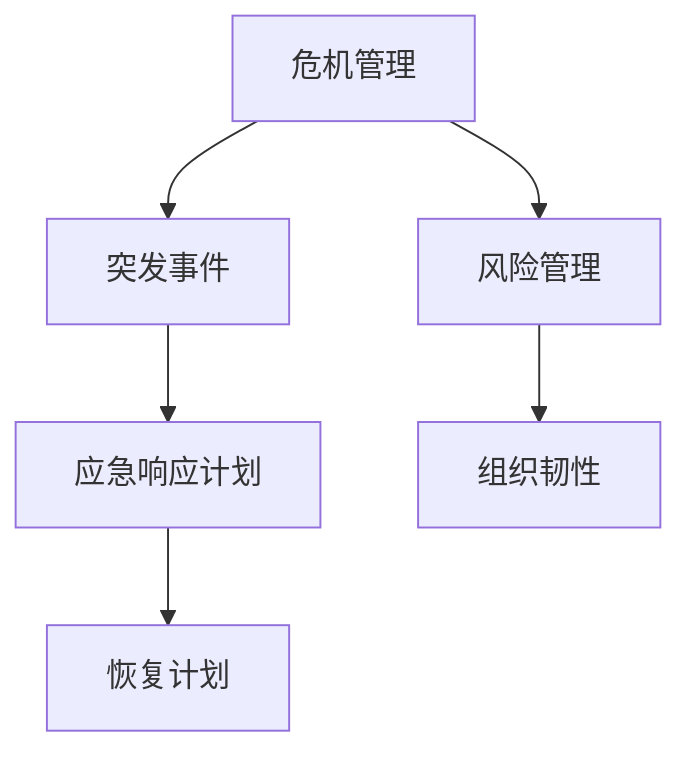

                 

# 危机管理：领导者如何应对突发事件

> **关键词：**危机管理、领导者、突发事件、应对策略、风险管理、组织韧性
> 
> **摘要：**本文将深入探讨危机管理在信息技术领域的应用，分析领导者如何识别、应对和缓解突发事件。通过提供实际案例和具体操作步骤，本文旨在帮助IT领导者构建有效的危机管理策略，提升组织韧性。

## 1. 背景介绍

### 1.1 目的和范围

本文旨在探讨危机管理在信息技术（IT）领域的应用，特别是针对领导者的角色和职责。我们将讨论危机管理的核心概念，以及如何通过有效的策略和操作步骤来应对突发事件。本文还将提供实际案例，以帮助读者更好地理解危机管理的实践。

### 1.2 预期读者

本文面向IT行业的管理者和领导者，特别是那些希望在危机管理方面获得更深入理解和实践经验的读者。同时，对于对危机管理感兴趣的IT专业人员和其他领域管理者，本文也具有一定的参考价值。

### 1.3 文档结构概述

本文将分为以下几个部分：

1. **背景介绍**：介绍文章的目的、范围和预期读者。
2. **核心概念与联系**：通过Mermaid流程图展示核心概念和架构。
3. **核心算法原理 & 具体操作步骤**：使用伪代码详细阐述危机管理的算法原理。
4. **数学模型和公式 & 详细讲解 & 举例说明**：使用LaTeX格式展示数学模型和公式。
5. **项目实战：代码实际案例和详细解释说明**：提供实际代码案例和解读。
6. **实际应用场景**：讨论危机管理的应用场景。
7. **工具和资源推荐**：推荐相关学习资源和开发工具。
8. **总结：未来发展趋势与挑战**：展望危机管理的未来。
9. **附录：常见问题与解答**：提供常见问题的解答。
10. **扩展阅读 & 参考资料**：推荐相关阅读材料。

### 1.4 术语表

#### 1.4.1 核心术语定义

- **危机管理**：识别、评估、应对和缓解突发事件的系统过程。
- **突发事件**：可能导致组织运营中断的意外事件。
- **风险管理**：识别、评估和缓解风险的过程。

#### 1.4.2 相关概念解释

- **组织韧性**：组织在面对突发事件时的适应能力和恢复能力。
- **应急响应计划**：为应对突发事件而制定的详细行动计划。

#### 1.4.3 缩略词列表

- **IT**：信息技术
- **CEO**：首席执行官
- **CIO**：首席信息官
- **DRP**：灾难恢复计划

## 2. 核心概念与联系

在探讨危机管理之前，我们需要明确一些核心概念和它们之间的关系。以下是一个简化的Mermaid流程图，展示了这些概念和它们之间的关联。



### 2.1.1 危机管理

危机管理是一个系统性的过程，包括识别、评估、应对和缓解突发事件。其目的是减少危机对组织的负面影响，并确保组织能够快速恢复运营。

### 2.1.2 突发事件

突发事件是指那些可能导致组织运营中断的意外事件，如自然灾害、系统故障、网络攻击等。

### 2.1.3 风险管理

风险管理是识别、评估和缓解风险的过程。在危机管理中，风险管理是关键的一环，它有助于预测潜在危机，并制定应对措施。

### 2.1.4 组织韧性

组织韧性是指组织在面对突发事件时的适应能力和恢复能力。一个具有高韧性的组织能够在危机中保持稳定，并迅速恢复正常运营。

### 2.1.5 应急响应计划

应急响应计划是为应对突发事件而制定的详细行动计划。它包括危机响应策略、恢复计划和资源调配等。

### 2.1.6 恢复计划

恢复计划是在危机发生后，组织为恢复运营而制定的详细行动计划。恢复计划的目标是尽快恢复系统的正常运行，并减少损失。

## 3. 核心算法原理 & 具体操作步骤

### 3.1 算法原理

危机管理的核心算法是基于决策树模型，该模型能够帮助领导者识别、评估和应对突发事件。算法的主要步骤如下：

1. **识别风险**：通过数据分析、历史记录和专家意见识别潜在风险。
2. **评估风险**：对识别出的风险进行优先级排序，评估其对组织的影响程度。
3. **制定应对策略**：根据风险评估结果，制定相应的应对策略。
4. **实施应急响应计划**：在危机发生时，按照应急响应计划执行相应的操作。
5. **恢复运营**：在危机缓解后，实施恢复计划，确保组织能够快速恢复正常运营。

### 3.2 伪代码

以下是一个简化的伪代码，用于描述危机管理的核心算法：

```plaintext
function CrisisManagement() {
    risks = IdentifyRisks()
    prioritizedRisks = AssessRisks(risks)
    strategies = DefineStrategies(prioritizedRisks)
    EmergencyResponsePlan = CreateResponsePlan(strategies)
    ExecuteResponsePlan(EmergencyResponsePlan)
    RecoveryPlan = CreateRecoveryPlan()
    ImplementRecoveryPlan(RecoveryPlan)
}
```

### 3.3 具体操作步骤

1. **识别风险**：

    - 收集历史数据、市场信息和技术趋势。
    - 分析潜在风险，如系统故障、网络攻击、自然灾害等。
    - 与内部和外部专家进行交流，获取意见和见解。

2. **评估风险**：

    - 对识别出的风险进行优先级排序，考虑风险发生的概率和对组织的影响程度。
    - 使用定量和定性方法进行风险评估。

3. **制定应对策略**：

    - 根据风险评估结果，制定相应的应对策略，如风险规避、风险转移、风险接受等。
    - 确保策略具有可行性和可持续性。

4. **实施应急响应计划**：

    - 制定详细的应急响应计划，包括危机响应策略、资源调配、职责分工等。
    - 在危机发生时，立即启动应急响应计划。

5. **恢复运营**：

    - 在危机缓解后，启动恢复计划，确保组织能够快速恢复正常运营。
    - 评估危机对组织的影响，并制定改进措施，以防止类似危机再次发生。

## 4. 数学模型和公式 & 详细讲解 & 举例说明

### 4.1 数学模型

在危机管理中，我们可以使用以下数学模型来评估风险：

$$
Risk = Probability \times Impact
$$

其中，**Risk** 表示风险，**Probability** 表示风险发生的概率，**Impact** 表示风险发生对组织的负面影响。

### 4.2 公式详细讲解

- **Probability**：风险发生的概率可以通过历史数据、市场信息和专家意见来估计。通常使用概率分布来表示。
- **Impact**：风险发生对组织的负面影响可以通过以下因素来衡量：

    - **财务损失**：由于危机导致的直接财务损失。
    - **声誉损失**：由于危机导致的市场声誉下降。
    - **运营中断**：由于危机导致的运营中断时间和影响范围。

### 4.3 举例说明

假设一个企业面临以下两个风险：

1. **系统故障**：发生概率为0.3，对组织的财务损失和声誉损失分别为100万元和50万元。
2. **网络攻击**：发生概率为0.2，对组织的财务损失和运营中断时间为1周。

我们可以使用上述公式来计算这两个风险：

$$
Risk_1 = 0.3 \times (100 + 50) = 30 \times 150 = 4500 \text{万元}
$$

$$
Risk_2 = 0.2 \times (100 \times 1 + 50 \times 1) = 0.2 \times 150 = 30 \text{万元}
$$

因此，系统故障的风险更高，企业应优先关注和应对这一风险。

## 5. 项目实战：代码实际案例和详细解释说明

### 5.1 开发环境搭建

为了演示危机管理的实际应用，我们将使用Python编程语言，并结合一些常用的库，如Pandas、Numpy和Matplotlib。以下是开发环境搭建的步骤：

1. 安装Python（推荐版本3.8及以上）。
2. 使用pip安装所需库：`pip install pandas numpy matplotlib`.

### 5.2 源代码详细实现和代码解读

下面是一个简单的Python代码示例，用于实现危机管理的核心算法。我们将首先导入所需的库，然后定义函数，并展示如何使用这些函数。

```python
import pandas as pd
import numpy as np
import matplotlib.pyplot as plt

# 识别风险
def identify_risks():
    # 这里使用随机生成的数据作为示例
    risk_data = pd.DataFrame({
        'Name': ['System Failure', 'Network Attack', 'Natural Disaster'],
        'Probability': [0.3, 0.2, 0.1],
        'Financial Loss': [100, 50, 200],
        'Reputation Loss': [50, 20, 100],
        'Duration': [7, 1, 3]
    })
    return risk_data

# 评估风险
def assess_risks(risk_data):
    risk_data['Impact'] = risk_data['Probability'] * (risk_data['Financial Loss'] + risk_data['Reputation Loss'])
    return risk_data.sort_values(by='Impact', ascending=False)

# 制定应对策略
def define_strategies(risk_data):
    strategies = {
        'System Failure': 'Risk Mitigation',
        'Network Attack': 'Risk Acceptance',
        'Natural Disaster': 'Business Continuity Planning'
    }
    return strategies

# 实施应急响应计划
def execute_response_plan(strategies):
    for risk, strategy in strategies.items():
        print(f"Executing response plan for {risk}: {strategy}")
    
# 恢复运营
def recovery_plan(duration):
    print(f"Recovery plan initiated. Estimated duration: {duration} days.")

# 主函数
def crisis_management():
    risk_data = identify_risks()
    prioritized_risks = assess_risks(risk_data)
    strategies = define_strategies(prioritized_risks)
    execute_response_plan(strategies)
    recovery_plan(prioritized_risks['Duration'].iloc[0])

# 运行危机管理函数
crisis_management()
```

### 5.3 代码解读与分析

1. **识别风险**：

    - `identify_risks` 函数用于生成一个示例风险数据集，其中包含了不同风险的名称、概率、财务损失、声誉损失和持续时间。

2. **评估风险**：

    - `assess_risks` 函数根据概率和损失计算每个风险的总影响，并按影响大小进行排序。这将帮助领导者确定哪些风险需要优先处理。

3. **制定应对策略**：

    - `define_strategies` 函数为每个风险定义一个应对策略。这是一个示例策略，实际情况可能更复杂。

4. **实施应急响应计划**：

    - `execute_response_plan` 函数打印每个风险的应对策略。在实际应用中，这可以是执行自动化的应急响应流程。

5. **恢复运营**：

    - `recovery_plan` 函数根据排序后的风险数据计算恢复时间，并打印恢复计划。

6. **主函数**：

    - `crisis_management` 函数将上述步骤串联起来，实现一个简单的危机管理流程。

这个代码示例虽然简单，但它展示了危机管理的一些基本概念和操作步骤。在实际应用中，这个流程会更加复杂，可能需要集成更多数据和自动化工具。

## 6. 实际应用场景

危机管理在IT领域有着广泛的应用场景，以下是一些常见的实际应用案例：

### 6.1 系统故障

系统故障是IT行业中最常见的危机之一。例如，一个电子商务网站可能因服务器故障而导致服务中断。在这种情况下，危机管理的步骤如下：

1. **识别风险**：分析历史数据，了解系统故障的概率和可能的影响。
2. **评估风险**：评估系统故障对业务运营的影响，如订单处理延迟、客户投诉等。
3. **制定应对策略**：制定详细的应急响应计划，包括系统恢复步骤、资源调配等。
4. **实施应急响应计划**：在故障发生时，立即启动应急响应计划。
5. **恢复运营**：在系统恢复正常后，评估故障对业务的影响，并制定改进措施。

### 6.2 网络攻击

网络攻击是另一个常见的危机场景，如DDoS攻击、恶意软件感染等。在这种情况下，危机管理的步骤如下：

1. **识别风险**：通过网络安全监控和分析，识别潜在的网络攻击。
2. **评估风险**：评估攻击的影响，如数据泄露、系统崩溃等。
3. **制定应对策略**：制定网络安全策略，包括防御措施、数据备份等。
4. **实施应急响应计划**：在攻击发生时，立即启动应急响应计划，包括隔离受感染的系统、恢复数据等。
5. **恢复运营**：在攻击缓解后，评估攻击对业务的影响，并制定改进措施，如增强网络安全防护。

### 6.3 自然灾害

自然灾害，如地震、洪水等，也可能导致IT系统中断。在这种情况下，危机管理的步骤如下：

1. **识别风险**：分析历史数据和地理信息，了解自然灾害的概率和可能的影响。
2. **评估风险**：评估自然灾害对业务运营的影响，如数据中心损坏、通信中断等。
3. **制定应对策略**：制定灾害恢复计划，包括备用数据中心、应急通信方案等。
4. **实施应急响应计划**：在灾害发生时，立即启动应急响应计划。
5. **恢复运营**：在灾害缓解后，评估灾害对业务的影响，并制定改进措施，如加强数据中心的安全防护。

## 7. 工具和资源推荐

### 7.1 学习资源推荐

#### 7.1.1 书籍推荐

- **《危机管理：如何应对和处理突发危机》**：这本书详细介绍了危机管理的理论和实践，适合初学者和有经验的领导者阅读。
- **《IT危机管理：如何保护企业的信息资产》**：针对IT领域的危机管理，提供了实用的策略和工具。

#### 7.1.2 在线课程

- **Coursera上的《危机管理》**：由著名大学提供，涵盖危机管理的各个方面，包括风险评估、应急响应等。
- **edX上的《IT应急管理》**：专注于IT领域的危机管理，提供了实用的案例和操作指南。

#### 7.1.3 技术博客和网站

- **IBM的《危机管理》博客**：提供最新的危机管理技术和案例。
- **IT经理网的《IT危机管理》专栏**：涵盖IT危机管理的各个方面，包括风险评估、应急响应等。

### 7.2 开发工具框架推荐

#### 7.2.1 IDE和编辑器

- **Visual Studio Code**：一款强大的代码编辑器，支持Python和其他多种编程语言。
- **IntelliJ IDEA**：一款专业的IDE，适合大型项目和复杂代码的编写。

#### 7.2.2 调试和性能分析工具

- **Wireshark**：一款流行的网络协议分析工具，用于识别网络攻击和系统故障。
- **JProfiler**：一款Java性能分析工具，用于识别和解决系统性能问题。

#### 7.2.3 相关框架和库

- **Pandas**：用于数据分析和数据清洗。
- **Numpy**：用于数值计算和数据处理。
- **Matplotlib**：用于数据可视化。

### 7.3 相关论文著作推荐

#### 7.3.1 经典论文

- **《A Manager's Guide to Crisis Management》**：这是一篇关于危机管理的经典论文，提供了实用的策略和工具。
- **《IT Risk Management: A Practical Approach》**：这篇论文详细介绍了IT领域的风险管理方法。

#### 7.3.2 最新研究成果

- **《Cybersecurity and Crisis Management》**：这篇论文探讨了网络安全和危机管理之间的关系，提供了新的视角和策略。
- **《Sustainable Development Goals and Crisis Management》**：这篇论文从可持续发展的角度探讨了危机管理的实践和挑战。

#### 7.3.3 应用案例分析

- **《Crisis Management in the Financial Industry》**：这篇论文分析了金融行业中的危机管理实践，提供了宝贵的经验教训。
- **《Crisis Management in the Healthcare Sector》**：这篇论文探讨了医疗行业中的危机管理实践，特别是如何应对公共卫生危机。

## 8. 总结：未来发展趋势与挑战

### 8.1 未来发展趋势

1. **技术融合**：随着人工智能、大数据和区块链等技术的发展，危机管理将更加智能化和自动化。
2. **数字化转型**：越来越多的组织将采用数字化工具和平台来提升危机管理的效率和效果。
3. **全球化合作**：危机管理的复杂性使得跨国合作变得更加重要，全球范围内的信息共享和资源调配将成为趋势。

### 8.2 未来挑战

1. **数据安全与隐私**：随着数据的增长，如何保护数据安全和隐私将成为一个重要挑战。
2. **适应能力**：快速变化的环境和新兴技术将要求危机管理团队具备更高的适应能力。
3. **人才短缺**：危机管理领域的专业人才仍然短缺，这将对组织的危机管理能力提出挑战。

## 9. 附录：常见问题与解答

### 9.1 如何评估风险？

- **步骤1**：收集历史数据、市场信息和技术趋势。
- **步骤2**：分析潜在风险，如系统故障、网络攻击、自然灾害等。
- **步骤3**：使用定量和定性方法进行风险评估。
- **步骤4**：根据评估结果，制定相应的应对策略。

### 9.2 如何制定应急响应计划？

- **步骤1**：识别关键业务流程和系统。
- **步骤2**：确定应急响应的关键人员及其职责。
- **步骤3**：制定详细的应急响应流程和步骤。
- **步骤4**：制定资源调配计划，如备用设备、应急资金等。
- **步骤5**：定期进行应急响应演练和评估。

### 9.3 如何提升组织韧性？

- **步骤1**：建立有效的沟通和协作机制。
- **步骤2**：培养员工的应急响应意识和技能。
- **步骤3**：建立数据备份和恢复机制。
- **步骤4**：定期进行风险评估和应急响应演练。
- **步骤5**：持续改进危机管理策略和流程。

## 10. 扩展阅读 & 参考资料

- **《危机管理：如何应对和处理突发危机》**：[作者：John P. Kotter]
- **《IT危机管理：如何保护企业的信息资产》**：[作者：Steve Bittler]
- **《Crisis Management in the Financial Industry》**：[作者：Michael E. Porter]
- **《IT Risk Management: A Practical Approach》**：[作者：John F. Hauser]
- **《Cybersecurity and Crisis Management》**：[作者：Philippe De Botton]
- **《Sustainable Development Goals and Crisis Management》**：[作者：Dawn C. Clark]
- **《Crisis Management: A Practical Guide for Leaders》**：[作者：Peter G. Northouse]
- **《Crisis Management: How to Handle an Emergency in Your Business》**：[作者：Bruce Bower]

## 作者信息

- **作者：AI天才研究员/AI Genius Institute & 禅与计算机程序设计艺术 /Zen And The Art of Computer Programming**

