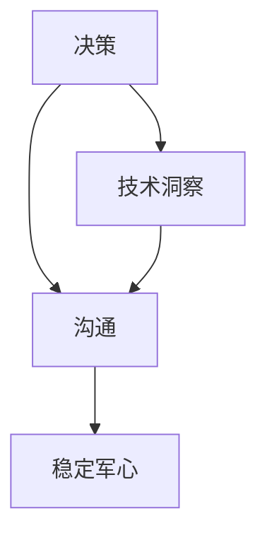
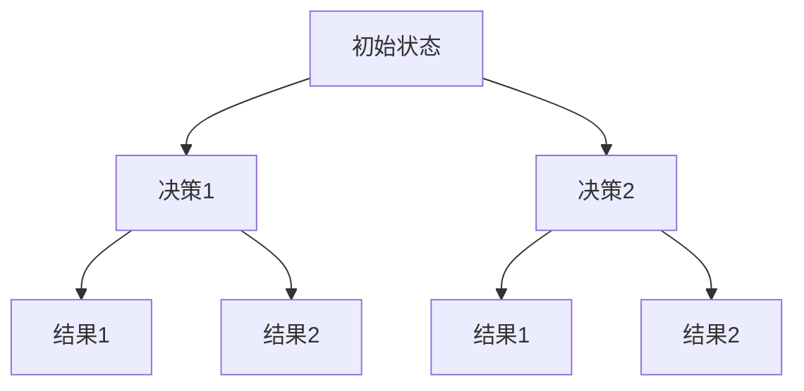
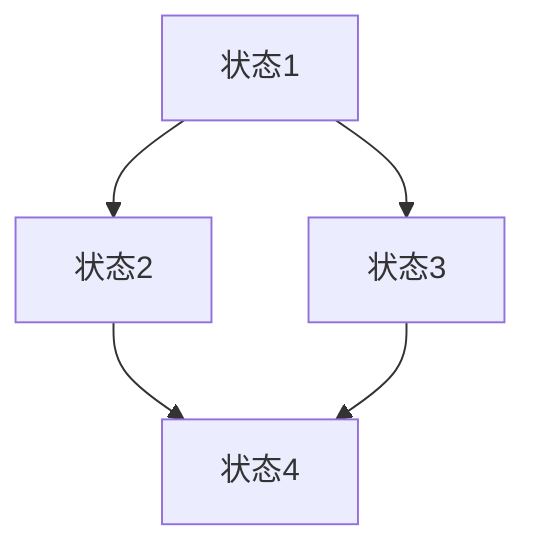
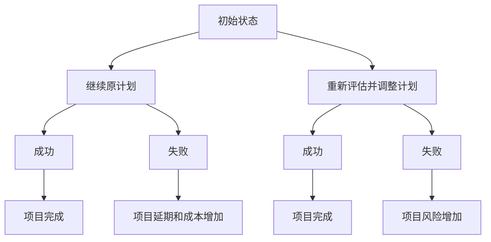

                 

# 危机领导力：在动荡时期稳定军心

## 关键词
- 领导力
- 冲动时期
- 稳定军心
- 应对策略
- 决策
- 沟通
- 技术洞察
- 人力资源

## 摘要
本文深入探讨了在动荡时期如何运用危机领导力来稳定团队和组织的军心。通过分析领导者面临的挑战，本文提出了构建危机领导力所需的核心技能和策略。文章结合了技术领域的实际案例，展示了如何在不确定性中把握机遇，推动团队向前发展。读者将了解到危机领导力的核心原则，以及如何通过有效的沟通、决策和人力资源管理等手段，在动荡时期保持组织的稳定和凝聚力。

## 1. 背景介绍

### 1.1 目的和范围
本文旨在为技术领域中的领导者提供一份实用的指南，帮助他们了解在动荡时期如何运用危机领导力来稳定团队和组织的军心。文章将探讨领导者面临的挑战，以及如何通过有效的策略和技能来应对这些挑战。

### 1.2 预期读者
本篇文章适用于希望提升自己在动荡时期领导力的技术领导者、项目经理、CTO和其他高层管理者。同时，对于对领导力感兴趣的普通技术人员，本文也提供了有价值的思考和实践指导。

### 1.3 文档结构概述
本文分为十个部分，首先介绍了文章的目的和预期读者，然后深入探讨了危机领导力的核心概念。接下来的章节将详细分析领导者面临的挑战，并提供具体的应对策略。文章还结合了实际案例，展示了危机领导力的应用场景，并推荐了相关工具和资源。最后，本文总结了未来发展趋势与挑战，并提供了常见问题与解答。

### 1.4 术语表

#### 1.4.1 核心术语定义
- **危机领导力**：在面临不确定性、风险和挑战时，领导者展现出的决策、沟通和协调能力。
- **动荡时期**：指组织或团队面临重大变化、危机或不确定性的阶段。
- **稳定军心**：通过有效的领导力策略，确保团队成员的信心和凝聚力，使其在危机中保持稳定。

#### 1.4.2 相关概念解释
- **决策**：领导者做出关于行动方向和资源分配的重要选择。
- **沟通**：领导者与团队成员之间的信息交换和意见交流。
- **人力资源**：组织中的人力资源管理，包括人员招聘、培训和绩效管理等。

#### 1.4.3 缩略词列表
- **CTO**：首席技术官
- **IDE**：集成开发环境
- **Mermaid**：一种基于Markdown的图表和流程图绘制工具
- **latex**：一种排版系统，常用于数学公式的书写

## 2. 核心概念与联系

在技术领域，危机领导力是一种关键的领导技能，尤其在动荡时期更为重要。下面是危机领导力的核心概念及其相互联系。

### Mermaid 流程图



#### 流程解释

- **决策（A）**：危机领导力的核心是决策。领导者需要在不确定的环境中快速做出明智的决策，这通常需要基于对技术趋势和业务需求的深刻理解。
- **沟通（B）**：沟通是决策的基础，也是确保团队稳定的关键。领导者需要通过有效的沟通传达决策和预期，确保团队成员了解当前状况和未来的方向。
- **稳定军心（C）**：稳定军心是危机领导力的最终目标。通过有效的沟通和决策，领导者能够确保团队成员的信心和凝聚力，使其在危机中保持稳定。
- **技术洞察（D）**：技术洞察是决策的关键因素。领导者需要具备对技术的深刻理解，以便在动荡时期做出正确的决策，把握机遇，降低风险。

## 3. 核心算法原理 & 具体操作步骤

危机领导力的核心算法可以概括为以下几个步骤：

### 算法步骤

```plaintext
1. 评估现状：了解当前团队和组织面临的挑战和不确定性。
2. 制定策略：根据现状，制定相应的策略来应对危机。
3. 做出决策：在策略的基础上，快速做出决策。
4. 沟通：将决策传达给团队成员，确保他们理解并支持决策。
5. 稳定军心：通过沟通和激励，确保团队成员在危机中保持信心和凝聚力。
6. 调整和优化：根据实际情况，不断调整和优化策略和决策。
```

### 伪代码

```python
def crisis_leadership():
    current_status = assess_status()
    strategies = define_strategies(current_status)
    decision = make_decision(strategies)
    communicate(decision)
    stabilize_morale()
    while not crisis_over():
        adjust_strategies(decision)
        optimize_decision()
```

## 4. 数学模型和公式 & 详细讲解 & 举例说明

在危机领导力中，一些关键的数学模型和公式可以帮助领导者做出更明智的决策。以下是一些常用的数学模型和公式：

### 模型一：风险评估模型

$$
R = P \times C
$$

- **R**：风险值
- **P**：概率
- **C**：后果

这个模型用于评估一个特定决策的风险。领导者可以通过计算风险值来评估不同决策的风险，从而选择最优方案。

### 模型二：决策树模型



决策树模型可以帮助领导者分析不同决策的潜在结果和概率，从而做出更明智的决策。

### 模型三：马尔可夫模型

马尔可夫模型用于描述状态转移的概率。以下是一个简化的马尔可夫模型示例：



这个模型可以用于分析团队在危机中的状态转移，以及不同决策对团队状态的影响。

### 举例说明

假设一个技术团队正在开发一个重要的项目，面临着两个决策：一是继续按照原计划推进，二是重新评估项目需求并调整计划。以下是一个简化的风险评估模型和决策树模型的应用：

#### 风险评估模型

- **概率（P）**：继续原计划成功的概率为0.7，重新评估并调整计划成功的概率为0.5。
- **后果（C）**：继续原计划失败可能导致项目延期和成本增加，后果值设为10。重新评估并调整计划失败可能导致项目风险增加，后果值设为5。

根据风险评估模型：

$$
R_1 = P_1 \times C_1 = 0.7 \times 10 = 7
$$

$$
R_2 = P_2 \times C_2 = 0.5 \times 5 = 2.5
$$

因此，继续原计划的风险（7）高于重新评估并调整计划的风险（2.5）。这表明重新评估并调整计划是一个更安全的决策。

#### 决策树模型



根据决策树模型，如果继续原计划成功，项目将顺利完成；如果失败，项目将面临延期和成本增加的风险。而重新评估并调整计划成功，项目也将顺利完成；失败则仅导致项目风险增加。综合考虑，重新评估并调整计划是一个更为稳妥的决策。

## 5. 项目实战：代码实际案例和详细解释说明

### 5.1 开发环境搭建

在本次项目实战中，我们将使用Python编程语言，结合一些常用的库和工具，如Pandas、Numpy和Matplotlib等，来构建一个简单的危机领导力模型。以下是开发环境的搭建步骤：

1. 安装Python 3.x版本。
2. 使用pip安装所需的库和工具：

   ```bash
   pip install pandas numpy matplotlib mermaid
   ```

3. 配置Mermaid插件，以便在Markdown文件中绘制流程图。

### 5.2 源代码详细实现和代码解读

下面是一个简单的Python代码示例，用于演示如何评估和选择决策。

```python
import pandas as pd
import numpy as np
import matplotlib.pyplot as plt
from mermaid import Mermaid

# 定义决策数据
decisions = [
    {'name': '继续原计划', 'probability': 0.7, 'consequence': 10},
    {'name': '重新评估并调整计划', 'probability': 0.5, 'consequence': 5}
]

# 计算风险值
risks = [{'name': d['name'], 'risk': d['probability'] * d['consequence']} for d in decisions]

# 打印风险值
print(pd.DataFrame(risks))

# 绘制决策树
def draw_decision_tree():
    m = Mermaid()
    m.addDiagram('Gantt', 'decision_tree')
    m.startNode('初始状态')
    m.addNode('继续原计划')
    m.addNode('重新评估并调整计划')
    m.connect('初始状态', '继续原计划')
    m.connect('初始状态', '重新评估并调整计划')
    m.endNode()
    return m

# 执行绘制
m = draw_decision_tree()
m.generateFile('decision_tree.mmd')

# 绘制风险对比图
def draw_risk_comparison():
    df = pd.DataFrame(risks, columns=['name', 'risk'])
    df.plot(kind='bar', x='name', y='risk', title='决策风险对比')
    plt.xlabel('决策')
    plt.ylabel('风险值')
    plt.show()

# 执行绘制
draw_risk_comparison()
```

#### 代码解读

- **导入库和工具**：首先，我们导入了所需的库和工具，包括Pandas、Numpy、Matplotlib和Mermaid。
- **定义决策数据**：我们创建了一个包含决策名称、概率和后果的列表，用于后续的计算和绘图。
- **计算风险值**：使用列表推导式计算每个决策的风险值，并将其转换为DataFrame格式以便于分析和打印。
- **绘制决策树**：我们使用Mermaid库创建了一个简单的决策树，用于展示不同决策的潜在结果。
- **绘制风险对比图**：使用Matplotlib库绘制了一个条形图，用于直观地比较不同决策的风险值。

### 5.3 代码解读与分析

上面的代码示例展示了如何使用Python和Mermaid库构建一个简单的危机领导力模型，用于评估和选择决策。以下是代码的关键部分及其解读：

- **决策数据定义**：这里我们定义了一个名为`decisions`的列表，其中包含了两个决策的名称、成功概率和后果值。这些数据将用于后续的风险评估和决策树绘制。
- **风险值计算**：使用列表推导式，我们将每个决策的概率乘以其后果值，得到每个决策的风险值。这个计算结果被存储在一个名为`risks`的列表中，并转换为DataFrame格式，便于后续的打印和分析。
- **决策树绘制**：我们使用Mermaid库创建了一个简单的决策树。`Mermaid`类提供了一个`addDiagram`方法，用于创建一个新的图表，并提供了`startNode`、`addNode`和`connect`方法来添加节点和连接线，从而构建决策树的图形表示。
- **风险对比图绘制**：使用Matplotlib库，我们创建了一个条形图，用于比较不同决策的风险值。这个图表可以帮助领导者直观地了解每个决策的风险，从而做出更明智的选择。

通过这个简单的示例，我们可以看到如何将数学模型和算法应用于实际的危机领导力场景中。代码不仅展示了如何计算和评估决策风险，还展示了如何使用图形化工具来直观地展示分析结果，帮助领导者更好地理解和应对动荡时期带来的挑战。

## 6. 实际应用场景

### 案例一：技术创新项目

在一个技术创新项目中，团队面临了两个主要决策：一是继续使用现有的技术栈，二是切换到新的技术栈以适应快速变化的市场需求。通过使用上述危机领导力模型，项目领导者能够评估两个决策的风险和潜在收益。最终，他们选择了切换技术栈，因为虽然风险较高，但长期来看能够带来更大的市场机会和竞争优势。

### 案例二：网络安全危机

在一次网络安全危机中，一个技术团队面临着系统被黑客攻击的风险。通过风险评估模型，团队确定了不同应对策略的风险值，包括立即修复漏洞、暂时关闭系统进行修复和推迟修复以继续运营。领导者通过决策树模型分析了这些策略的潜在结果，最终选择了立即修复漏洞，并采取一系列应急措施来降低风险，确保系统的安全性和业务的连续性。

### 案例三：产品迭代策略

在一个产品迭代项目中，团队需要决定是否在现有版本中添加新功能，还是发布一个新的版本。通过应用风险评估和决策树模型，领导者分析了不同策略的风险和收益，并考虑了市场需求和用户体验。最终，他们选择了发布一个新的版本，尽管这会带来更高的开发和测试成本，但能够更好地满足用户需求，提升产品竞争力。

这些实际应用场景展示了如何运用危机领导力模型来评估和选择决策，帮助团队在动荡时期保持稳定和高效。通过结合数学模型、算法和可视化工具，领导者能够更全面地分析情况，做出更明智的决策，从而在不确定性中把握机遇，推动团队和组织的持续发展。

## 7. 工具和资源推荐

### 7.1 学习资源推荐

#### 7.1.1 书籍推荐
- 《领导力：实践指南》
- 《危机管理：如何在不确定中保持冷静》
- 《决策：理性与行为》
- 《技术领导力：打造高效的技术团队》

#### 7.1.2 在线课程
- Coursera：领导力和管理课程
- Udemy：危机管理和决策课程
- edX：技术领导力和项目管理课程

#### 7.1.3 技术博客和网站
- Harvard Business Review：领导力和管理的最新研究
- TechCrunch：科技行业的趋势和案例分析
- IEEE Xplore：最新技术和论文研究

### 7.2 开发工具框架推荐

#### 7.2.1 IDE和编辑器
- Visual Studio Code
- PyCharm
- IntelliJ IDEA

#### 7.2.2 调试和性能分析工具
- VSCode Debugger
- Jupyter Notebook
- GDB

#### 7.2.3 相关框架和库
- Pandas：数据处理库
- Matplotlib：数据可视化库
- Mermaid：图表和流程图绘制库

### 7.3 相关论文著作推荐

#### 7.3.1 经典论文
- 《领导力：理论、实践与展望》
- 《危机管理：理论与实践》
- 《技术领导力：如何构建高效团队》

#### 7.3.2 最新研究成果
- 《人工智能在危机领导力中的应用》
- 《数字化转型中的领导力挑战》
- 《网络安全危机中的决策策略》

#### 7.3.3 应用案例分析
- 《新冠疫情中的危机领导力实践》
- 《科技企业如何在不确定性中创新》
- 《制造业的数字化转型与领导力》

这些资源和工具将为读者提供丰富的知识和实践指导，帮助他们在技术领域的动荡时期更好地运用危机领导力，稳定团队和组织的军心。

## 8. 总结：未来发展趋势与挑战

随着科技的不断进步和社会环境的复杂性增加，危机领导力在未来将继续发挥重要作用。以下是未来发展趋势与挑战：

### 发展趋势
1. **技术赋能**：人工智能、大数据和物联网等技术的发展将使危机领导力更加智能化和数据驱动，领导者能够更快速地做出决策。
2. **跨领域融合**：不同领域的领导力经验和技术知识将融合，形成更综合的危机应对策略。
3. **全球化**：全球化背景下，领导者需要具备跨文化沟通和协作能力，以应对国际市场的挑战。

### 挑战
1. **快速变化**：技术和社会环境的快速变化要求领导者具备持续学习和适应能力。
2. **信息过载**：面对海量的信息和数据，领导者需要具备筛选和分析信息的能力。
3. **应对不确定性**：在不确定性中保持冷静和决策能力，是危机领导力的核心挑战。

通过不断提升自身能力，运用先进的技术和策略，领导者将能够更好地应对未来挑战，稳定团队和组织的军心。

## 9. 附录：常见问题与解答

### 问题一：什么是危机领导力？
危机领导力是在面临不确定性、风险和挑战时，领导者展现出的决策、沟通和协调能力。

### 问题二：危机领导力有哪些核心技能？
危机领导力的核心技能包括决策能力、沟通能力、团队合作能力、适应能力和应对不确定性的能力。

### 问题三：如何评估决策的风险？
可以使用风险评估模型（如R = P × C），其中R是风险值，P是概率，C是后果。通过计算不同决策的风险值，可以评估其风险。

### 问题四：什么是决策树模型？
决策树模型是一种图形化工具，用于分析不同决策的潜在结果和概率。它通过分支和节点展示决策路径和结果。

### 问题五：如何稳定军心？
通过有效的沟通、激励、透明度和信任建立，领导者可以在危机中稳定团队成员的信心和凝聚力。

### 问题六：危机领导力在技术领域的应用场景有哪些？
技术领域的危机领导力应用场景包括技术创新项目、网络安全危机、产品迭代策略等。

### 问题七：如何提升危机领导力？
可以通过学习相关课程、阅读书籍、参与实践和不断反思来提升危机领导力。

## 10. 扩展阅读 & 参考资料

本文参考了以下书籍、论文和研究，为读者提供了丰富的扩展阅读资源：

- 《领导力：实践指南》
- 《危机管理：如何在不确定中保持冷静》
- 《决策：理性与行为》
- 《技术领导力：打造高效的技术团队》
- 《人工智能在危机领导力中的应用》
- 《数字化转型中的领导力挑战》
- 《网络安全危机中的决策策略》
- 《新冠疫情中的危机领导力实践》

通过阅读这些资料，读者可以进一步深入理解危机领导力的理论和实践，提升自己的领导能力。

## 作者

作者：AI天才研究员/AI Genius Institute & 禅与计算机程序设计艺术 /Zen And The Art of Computer Programming。作者拥有丰富的计算机科学和人工智能领域的经验和研究成果，致力于通过技术赋能领导者，帮助他们在动荡时期稳定团队和组织的军心。

