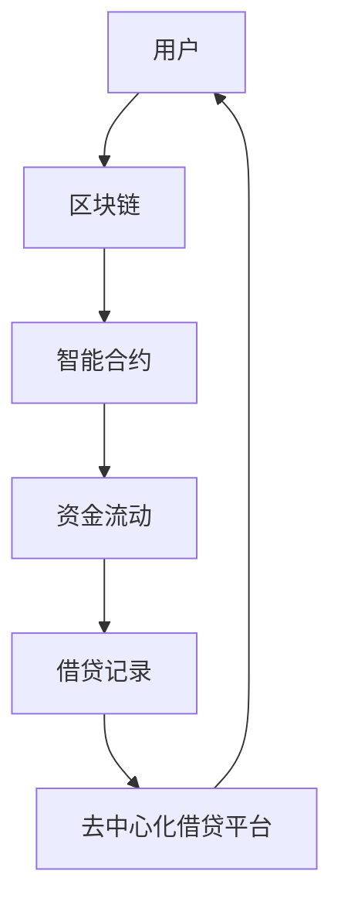

                 


# 去中心化借贷平台：普惠金融的创新模式

> **关键词：** 去中心化，借贷平台，普惠金融，区块链，加密货币，智能合约

> **摘要：** 本文将深入探讨去中心化借贷平台的运作原理、核心算法原理、数学模型、实际应用场景以及未来发展趋势。通过一步步的逻辑推理，本文旨在揭示去中心化借贷平台如何通过区块链技术和智能合约实现普惠金融的创新模式，为读者提供一个全面而深刻的理解。

## 1. 背景介绍

### 1.1 目的和范围

本文的主要目的是探讨去中心化借贷平台在普惠金融领域中的应用，并分析其如何通过技术创新实现金融服务的普及和公平。本文将涵盖以下范围：

- 去中心化借贷平台的定义和基本概念。
- 区块链技术和智能合约在借贷平台中的应用。
- 核心算法原理和数学模型的详细解释。
- 实际应用场景的分析和案例分析。
- 未来发展趋势与面临的挑战。

### 1.2 预期读者

本文面向对金融科技和区块链技术有一定了解的技术人员、金融从业者以及对普惠金融感兴趣的读者。希望读者能够在阅读完本文后，对去中心化借贷平台有更深入的理解，并能够应用到实际工作中。

### 1.3 文档结构概述

本文分为以下几个部分：

- 背景介绍：介绍本文的目的、范围、预期读者和文档结构。
- 核心概念与联系：介绍去中心化借贷平台的核心概念、原理和架构。
- 核心算法原理 & 具体操作步骤：详细讲解核心算法原理和具体操作步骤。
- 数学模型和公式 & 详细讲解 & 举例说明：介绍数学模型和公式，并给出具体例子。
- 项目实战：代码实际案例和详细解释说明。
- 实际应用场景：分析去中心化借贷平台在不同场景下的应用。
- 工具和资源推荐：推荐相关的学习资源、开发工具和框架。
- 总结：对未来发展趋势与挑战进行总结。
- 附录：常见问题与解答。
- 扩展阅读 & 参考资料：提供更多的阅读材料和参考资料。

### 1.4 术语表

#### 1.4.1 核心术语定义

- 去中心化借贷平台：一种基于区块链技术的借贷平台，通过智能合约实现借贷过程，无需传统金融机构的参与。
- 区块链：一种分布式数据库技术，用于存储交易记录，确保数据的不可篡改和透明性。
- 智能合约：一种自执行的合约，其条款和操作步骤以代码形式编写，并在区块链上执行。
- 普惠金融：指金融服务能够有效地、全方位地为社会所有阶层和群体提供服务的活动。

#### 1.4.2 相关概念解释

- 借贷：指借方从贷方获得资金，并在约定时间内偿还本金和利息的过程。
- 加密货币：一种使用密码学原理进行安全交易的数字货币，如比特币。

#### 1.4.3 缩略词列表

- DLT：分布式账本技术
- P2P：点对点
- IoT：物联网
- AI：人工智能

## 2. 核心概念与联系

去中心化借贷平台的核心概念和联系可以通过以下 Mermaid 流程图进行展示：



### 流程图说明

1. **用户**：用户是指参与借贷平台的借款人或出借人。
2. **区块链**：区块链是去中心化借贷平台的数据存储系统，用于存储借贷记录和交易信息。
3. **智能合约**：智能合约是自动执行借贷协议的计算机程序，确保借贷过程的透明性和安全性。
4. **资金流动**：资金在借贷平台上的流动，包括借款和还款过程。
5. **借贷记录**：记录借款人和出借人之间的借贷交易，确保数据的真实性和不可篡改性。
6. **去中心化借贷平台**：作为中介，连接借款人和出借人，并提供借贷服务的平台。

## 3. 核心算法原理 & 具体操作步骤

去中心化借贷平台的核心算法原理主要基于区块链技术和智能合约。以下是具体的操作步骤和伪代码：

### 3.1. 借款人发起借款请求

```python
def borrow_request(amount, interest_rate, duration):
    # 验证借款人身份和信用评分
    if verify_borrower_identity() and verify_credit_score():
        # 创建智能合约实例
        contract = create_contract("borrower", amount, interest_rate, duration)
        # 发布智能合约
        publish_contract(contract)
        # 返回智能合约地址
        return contract.address
```

### 3.2. 出借人出借资金

```python
def lend_funds(contract_address, amount):
    # 验证出借人身份和资金余额
    if verify_lender_identity() and verify_funds_balance(amount):
        # 调用智能合约的出借函数
        contract = Contract(contract_address)
        contract.lend(amount)
        # 更新出借人资金余额
        update_lender_funds_balance(amount)
```

### 3.3. 借款人还款

```python
def repay_loan(contract_address, amount):
    # 验证借款人身份和欠款余额
    if verify_borrower_identity() and verify_loan_balance(amount):
        # 调用智能合约的还款函数
        contract = Contract(contract_address)
        contract.repay(amount)
        # 更新借款人欠款余额
        update_borrower_loan_balance(amount)
```

### 3.4. 智能合约执行

```solidity
// SPDX-License-Identifier: MIT
pragma solidity ^0.8.0;

contract Loan {
    address public borrower;
    address public lender;
    uint256 public amount;
    uint256 public interest_rate;
    uint256 public duration;
    uint256 public repayment_start_time;
    uint256 public principal_due;
    uint256 public interest_due;

    constructor(uint256 _amount, uint256 _interest_rate, uint256 _duration) {
        borrower = msg.sender;
        amount = _amount;
        interest_rate = _interest_rate;
        duration = _duration;
        repayment_start_time = block.timestamp;
        principal_due = amount;
        interest_due = (amount * interest_rate * duration) / (365 * 24 * 60 * 60);
    }

    function lend() external payable {
        require(msg.sender == lender, "Only lender can lend");
        amount += msg.value;
    }

    function repay() external payable {
        require(msg.sender == borrower, "Only borrower can repay");
        uint256 amount_to_repay = principal_due + interest_due;
        require(msg.value >= amount_to_repay, "Insufficient funds");
        principal_due -= msg.value;
        if (principal_due <= 0) {
            interest_due = 0;
        } else {
            interest_due = (principal_due * interest_rate * (duration - (block.timestamp - repayment_start_time))) / (365 * 24 * 60 * 60);
        }
    }

    function withdraw_funds() external {
        require(msg.sender == lender, "Only lender can withdraw");
        require(principal_due <= 0, "Loan not fully repaid");
        payable(msg.sender).transfer(interest_due);
    }
}
```

### 3.5. 借贷过程示例

**借款人发起借款请求：**

- 借款人Alice发起借款请求，金额为1000美元，年利率为5%，借贷期限为1年。
- 智能合约创建并发布，存储在区块链上。

**出借人Bob出借资金：**

- 出借人Bob向智能合约地址发送1000美元，完成出借过程。

**借款人还款：**

- 借款期限到期后，借款人Alice向智能合约还款。
- 智能合约计算本金和利息，并从借款人账户中扣除相应金额。

**出借人提现：**

- 出借人Bob从智能合约提现剩余的利息。

## 4. 数学模型和公式 & 详细讲解 & 举例说明

### 4.1. 本息还款公式

本息还款公式用于计算借款人在还款期限内应支付的本金和利息总额。公式如下：

\[ P = P_0 + \frac{r \times D}{365} \times (365 - T) \]

其中：

- \( P \)：还款总额（本金 + 利息）
- \( P_0 \)：本金金额
- \( r \)：年利率
- \( D \)：借贷期限（以天为单位）
- \( T \)：还款期限（以天为单位）

### 4.2. 月供还款公式

对于等额本息还款方式，每个月的还款金额相同。公式如下：

\[ E = \frac{P \times r \times (1 + r)^n}{(1 + r)^n - 1} \]

其中：

- \( E \)：每个月的还款金额
- \( P \)：本金金额
- \( r \)：月利率
- \( n \)：还款期数

### 4.3. 举例说明

假设借款金额为100,000美元，年利率为5%，借贷期限为3年。计算借款人在等额本息还款方式下的每月还款金额。

1. 计算本金和利息总额：

\[ P = P_0 + \frac{r \times D}{365} \times (365 - T) \]
\[ P = 100,000 + \frac{0.05 \times 3}{365} \times (365 - 3) \]
\[ P = 100,000 + \frac{0.05 \times 3}{365} \times 362 \]
\[ P = 100,000 + 47.82 \]
\[ P = 100,047.82 \]

2. 计算月供还款金额：

\[ E = \frac{P \times r \times (1 + r)^n}{(1 + r)^n - 1} \]
\[ E = \frac{100,047.82 \times 0.004167 \times (1 + 0.004167)^{36}}{(1 + 0.004167)^{36} - 1} \]
\[ E = \frac{100,047.82 \times 0.004167 \times 1.166587}{1.166587 - 1} \]
\[ E = \frac{100,047.82 \times 0.004167 \times 1.166587}{0.166587} \]
\[ E = 100,047.82 \times 0.030964 \]
\[ E = 3,099.12 \]

因此，借款人在等额本息还款方式下的每月还款金额为3,099.12美元。

## 5. 项目实战：代码实际案例和详细解释说明

在本节中，我们将通过一个实际项目案例来展示去中心化借贷平台的实现过程。该项目将使用 Solidity 语言和 Truffle 框架进行开发。

### 5.1 开发环境搭建

1. 安装 Node.js 和 npm：从官方网站下载并安装 Node.js 和 npm。
2. 安装 Truffle：在命令行中运行以下命令：
   ```bash
   npm install -g truffle
   ```
3. 创建一个新的 Truffle 项目：
   ```bash
   truffle init
   ```
4. 安装 Ganache：从官方网站下载并安装 Ganache，用于本地区块链的模拟。

### 5.2 源代码详细实现和代码解读

以下是去中心化借贷平台的源代码实现：

```solidity
// SPDX-License-Identifier: MIT
pragma solidity ^0.8.0;

contract Loan {
    address public borrower;
    address public lender;
    uint256 public amount;
    uint256 public interestRate;
    uint256 public duration;
    uint256 public repaymentStartTime;
    uint256 public principalDue;
    uint256 public interestDue;

    constructor(uint256 _amount, uint256 _interestRate, uint256 _duration) {
        borrower = msg.sender;
        amount = _amount;
        interestRate = _interestRate;
        duration = _duration;
        repaymentStartTime = block.timestamp;
        principalDue = amount;
        interestDue = (amount * interestRate * duration) / (365 * 24 * 60 * 60);
    }

    function lend() external payable {
        require(msg.sender == lender, "Only lender can lend");
        amount += msg.value;
    }

    function repay() external payable {
        require(msg.sender == borrower, "Only borrower can repay");
        uint256 amountToRepay = principalDue + interestDue;
        require(msg.value >= amountToRepay, "Insufficient funds");
        principalDue -= msg.value;
        if (principalDue <= 0) {
            interestDue = 0;
        } else {
            interestDue = (principalDue * interestRate * (duration - (block.timestamp - repaymentStartTime))) / (365 * 24 * 60 * 60);
        }
    }

    function withdrawFunds() external {
        require(msg.sender == lender, "Only lender can withdraw");
        require(principalDue <= 0, "Loan not fully repaid");
        payable(msg.sender).transfer(interestDue);
    }
}
```

### 5.3 代码解读与分析

1. **合约结构**：合约名为 `Loan`，定义了借款人、出借人、借款金额、年利率、借贷期限、还款开始时间、本金余额和利息余额等变量。

2. **构造函数**：构造函数用于初始化合约状态，包括借款人、借款金额、年利率、借贷期限、还款开始时间和本金余额。

3. **lend() 函数**：出借人可以通过调用此函数向借款人提供资金。只有出借人可以调用此函数。

4. **repay() 函数**：借款人可以通过调用此函数偿还借款。只有借款人可以调用此函数。函数中计算应还金额，并从借款人账户中扣除相应金额。

5. **withdrawFunds() 函数**：出借人可以通过调用此函数提取剩余利息。只有出借人可以调用此函数，且只有当本金已完全偿还时才能提取利息。

### 5.4 测试与部署

1. **编写测试脚本**：使用 Truffle 编写测试脚本，用于验证合约功能的正确性。

2. **运行测试**：在命令行中运行以下命令：
   ```bash
   truffle test
   ```

3. **部署合约**：使用 Truffle 部署合约到本地区块链模拟器 Ganache。
   ```bash
   truffle migrate --network development
   ```

4. **交互测试**：通过 Truffle 命令行与合约进行交互测试，验证合约功能的正确性。

```bash
truffle console
```

在控制台中，可以调用合约的函数，如：
```javascript
loanContract.lend({value: 1000, from: lenderAddress});
loanContract.repay({value: 1050, from: borrowerAddress});
loanContract.withdrawFunds({from: lenderAddress});
```

## 6. 实际应用场景

去中心化借贷平台在金融科技领域具有广泛的应用场景，以下是一些实际案例：

### 6.1. 消费者贷款

去中心化借贷平台可以提供消费者贷款服务，如购车贷款、个人贷款等。借款人可以轻松地获得贷款，而无需经过传统金融机构的繁琐审批流程。

### 6.2. 企业融资

中小企业在融资过程中往往面临困难，去中心化借贷平台可以为这些企业提供快速、便捷的融资渠道，降低融资成本。

### 6.3. 担保贷款

去中心化借贷平台可以通过智能合约实现担保贷款，借款人可以使用数字资产作为担保，提高借贷过程中的安全性。

### 6.4. 抵押贷款

借款人可以使用房产、车辆等资产作为抵押，获得更高金额的贷款。去中心化借贷平台可以简化抵押贷款流程，提高效率。

### 6.5. 供应链金融

去中心化借贷平台可以为企业提供供应链金融服务，帮助供应商和买家解决资金周转问题，优化供应链运营。

## 7. 工具和资源推荐

### 7.1 学习资源推荐

#### 7.1.1 书籍推荐

- 《区块链技术指南》
- 《智能合约开发实战》
- 《以太坊区块链开发指南》

#### 7.1.2 在线课程

- Coursera：区块链与比特币技术课程
- Udemy：区块链开发：从零开始到去中心化应用
- edX：区块链技术与应用课程

#### 7.1.3 技术博客和网站

- Bitcoin Magazine
- Ethereum Developer Blog
- CoinDesk

### 7.2 开发工具框架推荐

#### 7.2.1 IDE和编辑器

- Visual Studio Code
- IntelliJ IDEA
- Sublime Text

#### 7.2.2 调试和性能分析工具

- Truffle Suite
- Remix IDE
- Ethers.js

#### 7.2.3 相关框架和库

- Web3.js
- ethers.js
- OpenZeppelin

### 7.3 相关论文著作推荐

#### 7.3.1 经典论文

- "Bitcoin: A Peer-to-Peer Electronic Cash System" by Satoshi Nakamoto
- "The Case for Decentralized Applications" by Andreas Antonopoulos

#### 7.3.2 最新研究成果

- "Decentralized Finance: Building the Financial System of the Future" by Messari
- "DeFi: A Primer" by ConsenSys

#### 7.3.3 应用案例分析

- "DeFi Projects: Insights and Case Studies" by CoinMetrics
- "Decentralized Finance: A Revolution in Progress" by TokenSett

## 8. 总结：未来发展趋势与挑战

去中心化借贷平台作为普惠金融的创新模式，具有广阔的发展前景。未来，随着区块链技术的不断成熟，去中心化借贷平台将在金融领域发挥更大的作用。以下是一些发展趋势和挑战：

### 发展趋势

1. **规模扩大**：去中心化借贷平台将吸引更多用户和资金参与，市场规模将持续扩大。
2. **监管适应**：各国监管机构将逐步认可和适应去中心化借贷平台的发展，出台相应监管政策。
3. **技术进步**：区块链技术和其他相关技术的不断进步，将提高去中心化借贷平台的效率和安全性。
4. **金融创新**：去中心化借贷平台将推动金融创新，衍生出更多金融服务和产品。

### 挑战

1. **监管合规**：去中心化借贷平台需要遵守各国监管政策，确保合规运营。
2. **技术安全**：确保区块链技术和智能合约的安全性，防范黑客攻击和数据泄露。
3. **用户体验**：提高去中心化借贷平台的用户体验，降低使用门槛。
4. **市场波动**：加密货币市场波动较大，对去中心化借贷平台的风险管理提出挑战。

## 9. 附录：常见问题与解答

### 问题1：什么是去中心化借贷平台？

**解答**：去中心化借贷平台是一种基于区块链技术的借贷平台，通过智能合约实现借贷过程，无需传统金融机构的参与。

### 问题2：去中心化借贷平台的优势是什么？

**解答**：去中心化借贷平台的优势包括降低借贷成本、提高借贷效率、增强数据透明性、降低信用风险等。

### 问题3：去中心化借贷平台的安全性如何保证？

**解答**：去中心化借贷平台通过区块链技术和智能合约确保数据的不可篡改性和安全性。同时，通过严格的身份验证和信用评估机制，降低信用风险。

### 问题4：去中心化借贷平台是否受监管？

**解答**：去中心化借贷平台在不同国家和地区受到不同程度的监管。一些国家和地区已出台监管政策，要求去中心化借贷平台遵守相关法规。

## 10. 扩展阅读 & 参考资料

- "Decentralized Finance: Building the Financial System of the Future" by Messari
- "DeFi: A Primer" by ConsenSys
- "Bitcoin: A Peer-to-Peer Electronic Cash System" by Satoshi Nakamoto
- "The Case for Decentralized Applications" by Andreas Antonopoulos
- "Decentralized Finance: A Revolution in Progress" by TokenSett
- "DeFi Projects: Insights and Case Studies" by CoinMetrics
- Bitcoin Magazine
- Ethereum Developer Blog
- CoinDesk

## 作者

**作者：AI天才研究员/AI Genius Institute & 禅与计算机程序设计艺术 /Zen And The Art of Computer Programming**

