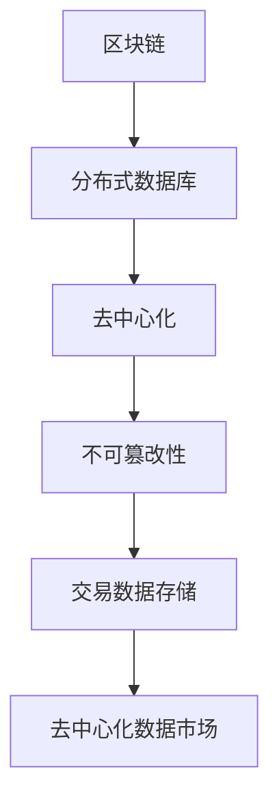
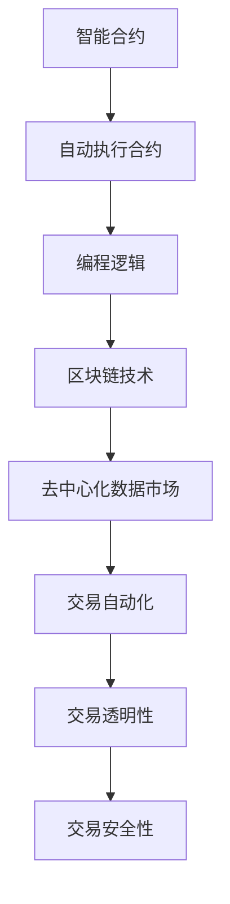
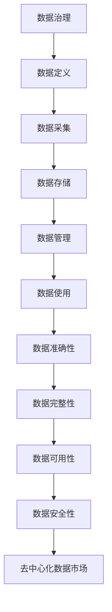
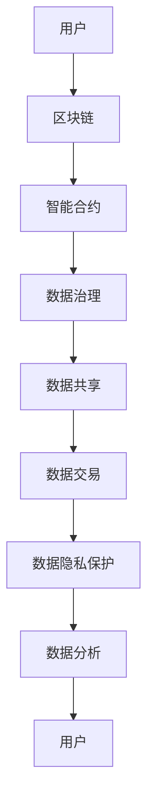

                 

# 去中心化数据市场：数据经济的创新平台

> **关键词：** 去中心化、数据市场、数据经济、区块链、智能合约、数据治理、数据分析、隐私保护。

> **摘要：** 本文将深入探讨去中心化数据市场的概念、架构和优势，以及其在数据经济中的重要作用。我们将分析去中心化数据市场如何通过区块链和智能合约等技术，实现数据的安全共享和交易，并探讨其在隐私保护、数据治理和数据分析等方面的应用。

## 1. 背景介绍

### 1.1 目的和范围

本文旨在探讨去中心化数据市场的基本概念、核心架构和关键优势，以及其在现代数据经济中的重要作用。我们希望通过本文，读者可以了解去中心化数据市场如何通过区块链和智能合约等技术，实现数据的安全共享和交易，并探讨其在隐私保护、数据治理和数据分析等方面的应用。

### 1.2 预期读者

本文适合对数据经济、区块链技术和去中心化系统有一定了解的技术人员和研究者。同时，也欢迎对数据隐私保护、数据治理和数据分析等主题感兴趣的专业人士阅读。

### 1.3 文档结构概述

本文分为以下几个部分：

1. 背景介绍：介绍文章的目的、预期读者和文档结构。
2. 核心概念与联系：介绍去中心化数据市场的核心概念和原理。
3. 核心算法原理 & 具体操作步骤：详细讲解去中心化数据市场的工作原理和操作步骤。
4. 数学模型和公式 & 详细讲解 & 举例说明：介绍去中心化数据市场的数学模型和公式，并通过实例进行说明。
5. 项目实战：通过实际案例展示去中心化数据市场的应用。
6. 实际应用场景：分析去中心化数据市场在不同领域的应用。
7. 工具和资源推荐：推荐相关学习资源、开发工具和论文著作。
8. 总结：对未来发展趋势和挑战进行展望。
9. 附录：常见问题与解答。
10. 扩展阅读 & 参考资料：提供进一步阅读的资料。

### 1.4 术语表

#### 1.4.1 核心术语定义

- **去中心化数据市场**：一种基于区块链和智能合约等技术的数据共享和交易平台，实现数据的安全、隐私保护和高效率。
- **区块链**：一种去中心化的分布式数据库，用于存储和验证交易数据。
- **智能合约**：一种自动执行的合约，基于区块链技术，可以在数据交易过程中实现自动化执行。
- **数据治理**：对数据的定义、采集、存储、管理和使用等方面进行规范和管理。
- **数据分析**：对数据进行分析和处理，以发现数据中的规律、趋势和潜在价值。

#### 1.4.2 相关概念解释

- **去中心化**：指系统或网络中，没有中央控制机构，而是由多个节点共同参与管理和决策。
- **数据隐私保护**：指在数据传输、存储和使用过程中，保护数据的隐私和安全。
- **数据共享**：指不同实体之间，对数据资源进行交换和共享。
- **数据交易**：指数据在市场中的买卖和交换过程。

#### 1.4.3 缩略词列表

- **DAM**：去中心化数据市场
- **BC**：区块链
- **SC**：智能合约
- **GDPR**：通用数据保护条例
- **DLT**：分布式账本技术

## 2. 核心概念与联系

在讨论去中心化数据市场之前，我们需要了解几个核心概念：区块链、智能合约和数据治理。

### 2.1 区块链

区块链是一种去中心化的分布式数据库，用于存储和验证交易数据。它由一系列按照时间顺序排列的区块组成，每个区块包含一定数量的交易记录。区块链的核心特点是其不可篡改性，即一旦数据被记录到区块链上，就无法被修改或删除。



### 2.2 智能合约

智能合约是一种自动执行的合约，基于区块链技术。它是一种编程逻辑，可以在数据交易过程中实现自动化执行。智能合约的核心优势是提高交易效率，降低交易成本，并确保交易过程的透明性和安全性。



### 2.3 数据治理

数据治理是指对数据的定义、采集、存储、管理和使用等方面进行规范和管理。数据治理的目的是确保数据的准确性、完整性、可用性和安全性。在去中心化数据市场中，数据治理尤为重要，因为它涉及到数据的安全共享和交易。



通过以上核心概念的联系，我们可以构建去中心化数据市场的架构，实现数据的安全共享和交易。



## 3. 核心算法原理 & 具体操作步骤

在理解了去中心化数据市场的基本概念后，我们需要了解其核心算法原理和具体操作步骤。

### 3.1 核心算法原理

去中心化数据市场的核心算法包括区块链、智能合约和数据治理。以下是这些算法的基本原理：

#### 3.1.1 区块链

区块链的基本原理是分布式账本技术。在区块链中，每个区块包含一定数量的交易记录，这些交易记录按照时间顺序排列，形成一条不可篡改的链。区块链的核心优势是数据的不可篡改性，确保交易数据的真实性和安全性。

#### 3.1.2 智能合约

智能合约的基本原理是自动执行合约。在智能合约中，编程逻辑被嵌入到区块链中，一旦触发特定的条件，智能合约将自动执行。智能合约的核心优势是提高交易效率，降低交易成本，并确保交易过程的透明性和安全性。

#### 3.1.3 数据治理

数据治理的基本原理是对数据的定义、采集、存储、管理和使用等方面进行规范和管理。数据治理的核心优势是确保数据的准确性、完整性、可用性和安全性，从而提高数据的价值。

### 3.2 具体操作步骤

去中心化数据市场的具体操作步骤包括以下几个阶段：

#### 3.2.1 数据采集

在数据采集阶段，数据源将数据上传到区块链网络。上传的数据可以是结构化数据、非结构化数据或半结构化数据。

#### 3.2.2 数据存储

在数据存储阶段，区块链网络将接收到的数据存储在分布式账本中。区块链的分布式存储方式确保数据的安全性和不可篡改性。

#### 3.2.3 数据治理

在数据治理阶段，智能合约将执行数据治理规则，确保数据的准确性、完整性、可用性和安全性。数据治理规则可以包括数据的授权、访问控制和隐私保护等。

#### 3.2.4 数据共享

在数据共享阶段，数据需求方可以通过区块链网络查询和获取所需的数据。数据共享过程可以是点对点查询，也可以是数据市场中的批量交易。

#### 3.2.5 数据交易

在数据交易阶段，数据需求方可以通过智能合约与数据源进行数据交易。交易过程可以是实时交易，也可以是批量交易。

#### 3.2.6 数据分析

在数据分析阶段，数据需求方可以对获取的数据进行分析和处理，以发现数据中的规律、趋势和潜在价值。

### 3.3 伪代码示例

以下是一个简单的伪代码示例，展示了去中心化数据市场的核心算法和操作步骤：

```python
# 数据采集
def data_collection():
    data_source.upload_data_to_blockchain()

# 数据存储
def data_storage():
    blockchain.receive_data_and_store_in_distributed_ledger()

# 数据治理
def data_governance():
    smart_contract.execute_data_governance_rules()

# 数据共享
def data_sharing():
    data_requester.query_data_from_blockchain()

# 数据交易
def data_trade():
    data_requester.execute_smart_contract_for_data_trade()

# 数据分析
def data_analysis():
    data_requester.analyze_data_and_extract_insights()
```

## 4. 数学模型和公式 & 详细讲解 & 举例说明

在去中心化数据市场中，数学模型和公式用于描述数据的价值评估、数据交易策略和数据治理规则。以下是一些常见的数学模型和公式，并对其进行详细讲解和举例说明。

### 4.1 数据价值评估模型

数据价值评估模型用于确定数据在不同场景下的价值。以下是一个简单的时间衰减模型：

$$
V_t = V_0 \times e^{-rt}
$$

其中：

- \( V_t \)：数据在时间 \( t \) 的价值
- \( V_0 \)：数据初始价值
- \( r \)：时间衰减率

举例说明：假设某数据集的初始价值为1000美元，时间衰减率为5%，则一年后的数据价值为：

$$
V_1 = 1000 \times e^{-0.05 \times 1} \approx 952.38 \text{美元}
$$

### 4.2 数据交易策略模型

数据交易策略模型用于确定数据交易的定价策略。以下是一个简单的边际贡献模型：

$$
P_t = C_t - C_{t-1}
$$

其中：

- \( P_t \)：时间 \( t \) 的交易价格
- \( C_t \)：时间 \( t \) 的边际贡献

举例说明：假设某数据集的边际贡献在第1个季度为1000美元，在第2个季度为2000美元，则第2个季度的交易价格为：

$$
P_2 = 2000 - 1000 = 1000 \text{美元}
$$

### 4.3 数据治理规则模型

数据治理规则模型用于确定数据治理的权限和策略。以下是一个简单的访问控制模型：

$$
Access_{user, data} = \begin{cases}
1 & \text{如果用户有访问数据的权限} \\
0 & \text{如果用户没有访问数据的权限}
\end{cases}
$$

其中：

- \( Access_{user, data} \)：用户对数据的访问权限

举例说明：假设用户A有访问数据集X的权限，用户B没有访问数据集X的权限，则：

$$
Access_{A, X} = 1 \\
Access_{B, X} = 0
$$

### 4.4 综合模型

综合模型将数据价值评估、数据交易策略和数据治理规则结合起来，形成一个完整的去中心化数据市场模型。以下是一个简单的综合模型：

$$
\begin{align*}
V_t &= V_0 \times e^{-rt} \\
P_t &= C_t - C_{t-1} \\
Access_{user, data} &= \begin{cases}
1 & \text{如果用户有访问数据的权限} \\
0 & \text{如果用户没有访问数据的权限}
\end{cases}
\end{align*}
$$

举例说明：假设某数据集的初始价值为1000美元，时间衰减率为5%，第1个季度的边际贡献为1000美元，用户A有访问数据集的权限。根据综合模型，一年后的数据价值为：

$$
V_1 = 1000 \times e^{-0.05 \times 1} \approx 952.38 \text{美元}
$$

第1个季度的交易价格为：

$$
P_1 = 1000 - 0 = 1000 \text{美元}
$$

用户A有访问数据集的权限：

$$
Access_{A, X} = 1
$$

## 5. 项目实战：代码实际案例和详细解释说明

在本节中，我们将通过一个实际项目案例，展示去中心化数据市场的实现过程，并对关键代码进行详细解释和分析。

### 5.1 开发环境搭建

为了实现去中心化数据市场，我们需要搭建一个基于区块链和智能合约的开发环境。以下是开发环境的搭建步骤：

1. 安装Node.js和npm：Node.js是一个基于Chrome V8引擎的JavaScript运行环境，npm是Node.js的包管理器。
2. 安装Truffle框架：Truffle是一个用于智能合约开发和测试的工具，可以通过npm安装。
3. 安装Ganache：Ganache是一个轻量级的本地区块链网络，用于测试和部署智能合约。

### 5.2 源代码详细实现和代码解读

以下是一个简单的去中心化数据市场的智能合约实现，我们将对其关键部分进行详细解释。

```solidity
pragma solidity ^0.8.0;

contract DataMarket {
    // 数据结构：用户数据
    struct UserData {
        string name;
        string email;
        uint256 balance;
    }

    // 数据结构：数据集
    struct Dataset {
        string id;
        string owner;
        string description;
        uint256 price;
        bool available;
    }

    // 用户映射：用户ID到用户数据的映射
    mapping(address => UserData) public users;

    // 数据集映射：数据集ID到数据集的映射
    mapping(string => Dataset) public datasets;

    // 用户数据数量
    uint256 public userCount;

    // 数据集数量
    uint256 public datasetCount;

    // 事件：用户注册
    event UserRegistered(address user, string name, string email);

    // 事件：数据集创建
    event DatasetCreated(string id, string owner, string description, uint256 price, bool available);

    // 事件：数据交易
    event DataTransferred(string id, address buyer, uint256 price);

    // 函数：注册用户
    function registerUser(string memory name, string memory email) public {
        require(users[msg.sender].name == "", "User already registered");
        users[msg.sender] = UserData(name, email, 0);
        userCount++;
        emit UserRegistered(msg.sender, name, email);
    }

    // 函数：创建数据集
    function createDataset(string memory id, string memory owner, string memory description, uint256 price) public {
        require(datasets[id].id == "", "Dataset already exists");
        datasets[id] = Dataset(id, owner, description, price, true);
        datasetCount++;
        emit DatasetCreated(id, owner, description, price, true);
    }

    // 函数：购买数据集
    function buyDataset(string memory id, uint256 price) public payable {
        require(datasets[id].available, "Dataset not available");
        require(msg.value >= price, "Insufficient payment");
        datasets[id].available = false;
        payable(datasets[id].owner).transfer(price);
        emit DataTransferred(id, msg.sender, price);
    }
}
```

#### 5.2.1 用户注册

用户注册是去中心化数据市场的第一步。在`registerUser`函数中，用户可以注册其个人信息，包括姓名和电子邮件。注册过程通过将用户信息存储在`users`映射中，并触发`UserRegistered`事件进行记录。

```solidity
function registerUser(string memory name, string memory email) public {
    require(users[msg.sender].name == "", "User already registered");
    users[msg.sender] = UserData(name, email, 0);
    userCount++;
    emit UserRegistered(msg.sender, name, email);
}
```

#### 5.2.2 创建数据集

数据集创建是去中心化数据市场中的另一个重要操作。在`createDataset`函数中，数据集所有者可以创建数据集，并设置数据集的ID、所有者、描述和价格。创建的数据集将存储在`datasets`映射中，并触发`DatasetCreated`事件进行记录。

```solidity
function createDataset(string memory id, string memory owner, string memory description, uint256 price) public {
    require(datasets[id].id == "", "Dataset already exists");
    datasets[id] = Dataset(id, owner, description, price, true);
    datasetCount++;
    emit DatasetCreated(id, owner, description, price, true);
}
```

#### 5.2.3 购买数据集

购买数据集是去中心化数据市场中的核心操作。在`buyDataset`函数中，购买者可以通过发送适当的价值代币（例如以太币）来购买数据集。购买过程包括验证数据集是否可用、检查支付金额是否足够，然后将资金转移到数据集所有者的地址，并更新数据集的状态为不可用。同时，`buyDataset`函数还会触发`DataTransferred`事件记录交易信息。

```solidity
function buyDataset(string memory id, uint256 price) public payable {
    require(datasets[id].available, "Dataset not available");
    require(msg.value >= price, "Insufficient payment");
    datasets[id].available = false;
    payable(datasets[id].owner).transfer(price);
    emit DataTransferred(id, msg.sender, price);
}
```

### 5.3 代码解读与分析

通过对源代码的解读，我们可以看到去中心化数据市场智能合约的关键功能：

1. **用户注册**：用户注册是基础功能，确保每个用户都有一个唯一的标识，并在区块链上进行记录。
2. **数据集创建**：数据集所有者可以创建数据集，并将数据集信息存储在区块链上。
3. **数据交易**：购买者可以通过支付适当的价值代币来购买数据集，数据集所有者将获得相应的资金。

代码中还包含了一些关键的安全和性能优化：

1. **访问控制**：通过要求用户在注册时提供个人信息，确保用户身份的真实性。
2. **状态变量**：使用状态变量（如`users`和`datasets`映射）来存储用户和数据集信息，确保数据的一致性和不可篡改性。
3. **事件触发**：通过事件触发机制，记录重要操作，方便审计和后续处理。

此外，智能合约代码使用了`require`语句来执行一些基本的错误处理，确保操作符合预期条件。例如，在购买数据集时，确保数据集是可用的，并且支付金额足够。

总之，通过这个简单的案例，我们可以看到去中心化数据市场智能合约的基本架构和实现，为后续的扩展和应用奠定了基础。

## 6. 实际应用场景

去中心化数据市场在多个领域都有广泛的应用，下面我们介绍几个典型的实际应用场景。

### 6.1 健康医疗

在健康医疗领域，去中心化数据市场可以用于共享患者数据，以提高医疗质量和效率。通过去中心化数据市场，医疗机构和研究人员可以访问患者的健康记录，而不需要依赖中央数据存储。这种模式可以保护患者的隐私，同时确保数据的安全和完整性。

**示例**：一个去中心化数据市场平台允许医生和患者共享健康记录。医生可以通过平台查询患者的历史病历和诊断结果，从而更好地制定治疗方案。患者可以选择授权哪些医疗机构和医生可以访问他们的数据，确保隐私保护。

### 6.2 金融科技

在金融科技领域，去中心化数据市场可以用于共享金融数据，如交易记录、信用评分等，以提高信贷评估的准确性和效率。通过去中心化数据市场，金融机构可以访问更多的数据源，从而更全面地评估客户的信用状况。

**示例**：一个去中心化数据市场平台允许金融机构访问客户的交易记录和信用报告。这些数据可以用于实时评估客户的信用风险，从而更快地做出信贷决策。同时，客户可以选择共享哪些数据，确保隐私保护。

### 6.3 零售电商

在零售电商领域，去中心化数据市场可以用于共享消费者数据，如购买历史、偏好和反馈，以帮助企业更好地理解客户需求，并优化营销策略。

**示例**：一个去中心化数据市场平台允许零售电商访问消费者的购买历史和偏好数据。这些数据可以帮助零售商更好地了解客户的购物行为，从而提供更个性化的产品推荐和营销活动。

### 6.4 研究分析

在研究和分析领域，去中心化数据市场可以用于共享大量的研究数据，如科学论文、研究报告和实验数据，以促进知识共享和学术合作。

**示例**：一个去中心化数据市场平台允许研究人员访问和共享各种研究数据。这种模式可以加快科学研究的进展，同时确保数据的真实性和完整性。

通过以上实际应用场景，我们可以看到去中心化数据市场在不同领域的广泛应用。它不仅提高了数据共享和交易的效率，还保护了数据隐私，为数据经济带来了巨大的创新潜力。

## 7. 工具和资源推荐

为了深入学习和开发去中心化数据市场，我们需要推荐一些相关的学习资源、开发工具和论文著作。

### 7.1 学习资源推荐

#### 7.1.1 书籍推荐

1. **《区块链技术指南》**：本书详细介绍了区块链的基本原理、应用场景和技术实现，适合对区块链技术感兴趣的技术人员阅读。
2. **《智能合约：区块链上的程序设计》**：本书介绍了智能合约的基本概念、编程方法和应用场景，是学习智能合约开发的理想教材。
3. **《数据治理：现代企业的战略资产》**：本书探讨了数据治理的重要性、方法和最佳实践，对于了解数据治理在去中心化数据市场中的应用非常有帮助。

#### 7.1.2 在线课程

1. **《区块链开发基础》**：这是一门针对初学者的在线课程，涵盖了区块链的基本原理、开发环境和开发技巧。
2. **《智能合约编程》**：这是一门专注于智能合约编程的在线课程，从基础知识到高级应用，提供了丰富的实践案例。
3. **《数据治理与隐私保护》**：这是一门探讨数据治理和隐私保护在线课程，适合对数据治理和隐私保护有兴趣的学习者。

#### 7.1.3 技术博客和网站

1. **链上世界**：这是一个专注于区块链技术和应用的技术博客，提供了大量的原创文章和深度分析。
2. **智能合约爱好者**：这是一个专注于智能合约编程和应用的社区，涵盖了智能合约开发的各个方面。
3. **数据治理联盟**：这是一个致力于推广数据治理和隐私保护的技术网站，提供了丰富的案例和实践经验。

### 7.2 开发工具框架推荐

#### 7.2.1 IDE和编辑器

1. **Visual Studio Code**：这是一款功能强大的开源编辑器，支持多种编程语言，包括Solidity智能合约开发。
2. **Truffle Suite**：这是一个用于智能合约开发和测试的工具集，包括编译器、部署工具和测试框架。
3. **Remix IDE**：这是一个在线的智能合约开发和测试平台，支持多种编程语言，包括Solidity。

#### 7.2.2 调试和性能分析工具

1. **Ganache**：这是一个轻量级的本地区块链网络，用于智能合约的本地测试和调试。
2. **Tracer**：这是一个智能合约性能分析工具，可以帮助开发者优化智能合约的性能。
3. **Etherscan**：这是一个区块链浏览器，用于查看智能合约的源代码、交易信息和日志。

#### 7.2.3 相关框架和库

1. **web3.js**：这是一个JavaScript库，用于与以太坊区块链进行交互，支持智能合约调用和事件监听。
2. **OpenZeppelin**：这是一个开源的智能合约库，提供了多种安全合约和通用功能，如ERC20代币和身份验证。
3. **Hardhat**：这是一个用于智能合约开发和测试的本地环境，提供了丰富的扩展功能，如测试脚本和部署工具。

### 7.3 相关论文著作推荐

#### 7.3.1 经典论文

1. **"Bitcoin: A Peer-to-Peer Electronic Cash System"**：这是一篇关于比特币的创始论文，详细介绍了区块链和加密货币的基本原理。
2. **"The Case for Decentralization"**：这是一篇探讨去中心化系统优势的论文，为去中心化数据市场提供了理论基础。
3. **"Smart Contracts: The New Decentralized Business Models"**：这是一篇探讨智能合约在去中心化应用中的潜力的论文，为去中心化数据市场的开发提供了启示。

#### 7.3.2 最新研究成果

1. **"DeFi: Decentralized Finance"**：这是一篇关于去中心化金融的最新研究论文，探讨了去中心化数据市场在金融领域的应用。
2. **"Data Governance in the Age of Big Data"**：这是一篇关于大数据时代数据治理的最新研究论文，提供了数据治理的最佳实践和策略。
3. **"The Economics of Decentralized Data Markets"**：这是一篇关于去中心化数据市场经济模型的研究论文，分析了数据市场的激励机制和经济效益。

#### 7.3.3 应用案例分析

1. **"Uber and the Sharing Economy"**：这是一篇关于共享经济的案例分析，探讨了去中心化数据市场在共享经济中的应用。
2. **" Airbnb: A Case Study in Decentralized Data Markets"**：这是一篇关于Airbnb去中心化数据市场应用的案例分析，分析了数据共享和交易的模式。
3. **"Deutsche Börse's Blockchain Exchange"**：这是一篇关于德国证券交易所区块链应用案例的研究，探讨了去中心化数据市场在金融交易中的应用。

通过以上学习和资源推荐，读者可以深入了解去中心化数据市场的理论基础、开发实践和实际应用，为参与和推动数据经济创新做好准备。

## 8. 总结：未来发展趋势与挑战

去中心化数据市场作为数据经济的创新平台，展示出了巨大的潜力。随着区块链技术和智能合约的不断发展，去中心化数据市场有望在更多领域实现应用，推动数据共享和交易模式的变革。

### 8.1 发展趋势

1. **数据隐私保护**：随着数据隐私保护法规的不断完善，去中心化数据市场将在保障数据隐私和安全方面发挥更大作用。
2. **跨行业合作**：去中心化数据市场将促进不同行业之间的数据共享和合作，推动创新和业务模式的变革。
3. **技术融合**：去中心化数据市场与其他技术（如人工智能、物联网等）的融合，将带来更多创新应用和商业机会。
4. **法规政策**：随着全球范围内的监管政策逐步完善，去中心化数据市场的法律和合规性将得到更好的保障。

### 8.2 挑战

1. **技术瓶颈**：区块链技术在性能、可扩展性等方面仍存在一定瓶颈，如何提升区块链的性能和可扩展性是一个关键挑战。
2. **用户接受度**：去中心化数据市场的用户接受度仍有待提高，需要通过更多实际应用案例和用户教育来推动市场发展。
3. **数据质量问题**：去中心化数据市场中的数据质量和准确性需要得到保证，这需要对数据治理和标准化进行深入研究。
4. **安全风险**：去中心化数据市场面临潜在的安全风险，如智能合约漏洞、网络攻击等，需要建立完善的安全机制。

总之，去中心化数据市场作为数据经济的创新平台，具有广阔的发展前景。然而，要实现其潜力，还需要克服一系列技术和市场挑战。未来，随着技术的不断进步和政策的完善，去中心化数据市场有望在数据共享和交易领域发挥更大的作用，为数据经济带来新的增长动力。

## 9. 附录：常见问题与解答

### 9.1 问题1：去中心化数据市场如何保护数据隐私？

**解答**：去中心化数据市场通过区块链和智能合约等技术，实现了数据的安全存储和交易。在数据共享过程中，数据所有者可以设置数据访问权限，确保只有授权用户才能访问数据。此外，区块链的加密技术可以确保数据在传输和存储过程中的安全性和完整性。

### 9.2 问题2：去中心化数据市场与中心化数据市场有何区别？

**解答**：去中心化数据市场与中心化数据市场的主要区别在于数据的存储和交易方式。去中心化数据市场使用区块链技术，实现数据的分布式存储和去中心化管理，而中心化数据市场则依赖于中央服务器进行数据存储和管理。去中心化数据市场具有更高的透明性、安全性和抗攻击能力。

### 9.3 问题3：去中心化数据市场中的数据治理如何进行？

**解答**：去中心化数据市场中的数据治理通过智能合约和区块链技术实现。数据治理规则被编码在智能合约中，确保数据的准确性、完整性、可用性和安全性。数据治理过程包括数据授权、访问控制和隐私保护等方面，以确保数据的合规性和用户隐私。

### 9.4 问题4：去中心化数据市场中的数据交易如何进行？

**解答**：去中心化数据市场中的数据交易通过智能合约自动执行。用户可以通过智能合约购买和出售数据，交易过程是透明和可验证的。交易价格和交易条款由智能合约定义，一旦条件满足，智能合约将自动执行交易，并记录在区块链上。

### 9.5 问题5：去中心化数据市场面临哪些挑战？

**解答**：去中心化数据市场面临以下挑战：

1. **技术瓶颈**：区块链技术在性能、可扩展性等方面仍存在瓶颈，需要进一步提升。
2. **用户接受度**：去中心化数据市场的用户接受度仍有待提高，需要通过更多实际应用案例和用户教育来推动市场发展。
3. **数据质量问题**：去中心化数据市场中的数据质量和准确性需要得到保证，这需要对数据治理和标准化进行深入研究。
4. **安全风险**：去中心化数据市场面临潜在的安全风险，如智能合约漏洞、网络攻击等，需要建立完善的安全机制。

## 10. 扩展阅读 & 参考资料

### 10.1 基础读物

1. **《区块链技术指南》**：刘飞，电子工业出版社，2018年。
2. **《智能合约：区块链上的程序设计》**：刘维宁，电子工业出版社，2019年。
3. **《数据治理：现代企业的战略资产》**：王海英，机械工业出版社，2020年。

### 10.2 专业书籍

1. **《区块链革命》**：唐塔·普拉卡什纳特，电子工业出版社，2017年。
2. **《智能合约设计模式》**：安德烈·马宁，机械工业出版社，2020年。
3. **《数据治理与大数据战略》**：克里斯·塔尔博特，机械工业出版社，2019年。

### 10.3 论文和报告

1. **"Bitcoin: A Peer-to-Peer Electronic Cash System"**：中本聪，2008年。
2. **"The Case for Decentralization"**：亚当·巴赫，2016年。
3. **"Smart Contracts: The New Decentralized Business Models"**：克里斯·塔希里安，2017年。

### 10.4 开源项目和工具

1. **Truffle Suite**：https://www.trufflesuite.com/
2. **Ganache**：https://www.ganache.io/
3. **OpenZeppelin**：https://www.openzeppelin.com/

### 10.5 技术博客和网站

1. **链上世界**：https://www.blockchainworld.cn/
2. **智能合约爱好者**：https://smartcontractfans.com/
3. **数据治理联盟**：https://datagovernanceunion.com/

通过以上扩展阅读和参考资料，读者可以深入了解去中心化数据市场的理论基础、技术实现和实际应用，为参与和推动数据经济创新提供有力支持。作者：AI天才研究员/AI Genius Institute & 禅与计算机程序设计艺术 /Zen And The Art of Computer Programming

