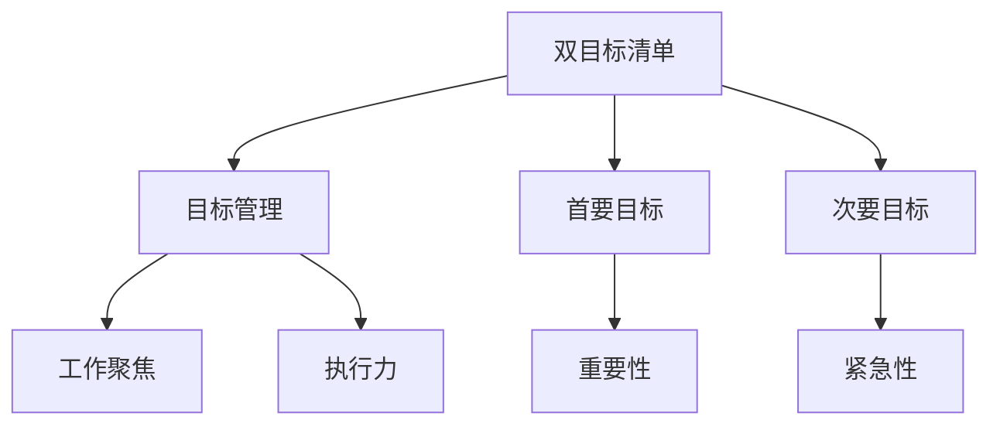

                 


## 双目标清单：聚焦要事的法宝

> **关键词：** 目标管理、双目标清单、效率提升、任务优先级、工作聚焦。

> **摘要：** 在现代快节奏的工作环境中，如何有效地管理目标和任务，已成为提升工作效率的关键。本文将介绍一种名为“双目标清单”的方法，通过明确、简化和持续追踪，帮助读者聚焦要事，实现个人和组织的目标。

### 1. 背景介绍

#### 1.1 目的和范围

本文旨在探讨如何通过实施双目标清单来提高个人和组织的工作效率。双目标清单是一种基于目标管理的工具，它将复杂的任务和目标简化为两个清晰、可衡量的目标。这种方法不仅能够帮助个人集中精力，还能够促进团队协作，提高整体执行力。

#### 1.2 预期读者

本文适合希望提高工作效率的职场人士、项目管理者以及组织领导者。无论您是一名开发人员、产品经理还是团队主管，双目标清单都能为您提供实用的策略和方法。

#### 1.3 文档结构概述

本文分为以下几个部分：

1. **背景介绍**：介绍双目标清单的背景和目的。
2. **核心概念与联系**：讨论双目标清单的核心概念和联系。
3. **核心算法原理 & 具体操作步骤**：详细解释双目标清单的操作步骤。
4. **数学模型和公式 & 详细讲解 & 举例说明**：介绍如何使用数学模型和公式来评估双目标清单的效果。
5. **项目实战：代码实际案例和详细解释说明**：通过具体案例展示双目标清单的实际应用。
6. **实际应用场景**：讨论双目标清单在不同场景下的应用。
7. **工具和资源推荐**：推荐相关学习资源和开发工具。
8. **总结：未来发展趋势与挑战**：展望双目标清单的未来。
9. **附录：常见问题与解答**：回答读者可能遇到的问题。
10. **扩展阅读 & 参考资料**：提供进一步阅读的参考资料。

#### 1.4 术语表

- **双目标清单**：一种将复杂任务和目标简化为两个明确、可衡量的目标的工具。
- **目标管理**：一种通过设定和追踪目标来提高工作效率和执行力的方法。
- **任务优先级**：对任务进行优先级排序，确保重要任务得到优先处理。

### 1.4.1 核心术语定义

- **双目标清单**：由两个核心目标组成的清单，每个目标都有明确的衡量标准。
- **目标管理**：一种通过设定、追踪和评估目标来提高工作效能的过程。
- **任务优先级**：基于任务的重要性和紧急性对任务进行排序。

### 1.4.2 相关概念解释

- **工作聚焦**：指在特定时间内集中精力处理最重要的任务，以最大化工作效率。
- **执行力**：指将计划付诸实践，并确保目标实现的能力。

### 1.4.3 缩略词列表

- **TDL**：双目标清单（Two-Target List）
- **OKR**：目标与关键结果（Objectives and Key Results）
- **SMART**：具体、可衡量、可达成、相关、时限性（Specific, Measurable, Achievable, Relevant, Time-bound）

## 2. 核心概念与联系

### 2.1 双目标清单的基本概念

双目标清单是一种目标管理工具，它通过设定两个明确、可衡量的目标来帮助个人或团队集中精力处理最重要的任务。这两个目标通常被称为“首要目标”和“次要目标”。

- **首要目标**：最重要的目标，对任务的成功至关重要。
- **次要目标**：虽然重要，但不如首要目标紧急或关键。

### 2.2 双目标清单与目标管理的关系

双目标清单是目标管理的一种具体实现方法。目标管理是一种通过设定、追踪和评估目标来提高工作效率和执行力的过程。双目标清单通过简化和聚焦，使得目标管理更加高效和可操作。

### 2.3 双目标清单与其他目标管理工具的比较

- **OKR**：目标与关键结果，强调目标的设定和结果的衡量。双目标清单与OKR类似，但更加简洁，专注于两个核心目标。
- **SMART**：一种设定目标的指导原则，强调目标的明确性和可衡量性。双目标清单遵循SMART原则，但更加聚焦。

### 2.4 双目标清单与工作聚焦的关系

双目标清单通过设定明确的目标，帮助个人或团队在工作时保持聚焦。这种方法能够减少分心和拖延，提高工作效率。

### 2.5 双目标清单与执行力的关系

双目标清单通过明确的任务优先级和可衡量的目标，提高了执行力的有效性。它帮助团队或个人在执行任务时，始终保持目标导向，确保任务按计划完成。

### 2.6 核心概念流程图



## 3. 核心算法原理 & 具体操作步骤

### 3.1 双目标清单的基本算法原理

双目标清单的核心在于将复杂的任务和目标简化为两个明确、可衡量的目标。这种方法遵循以下基本原理：

1. **聚焦性**：通过设定两个核心目标，使工作更加聚焦，减少无关任务的干扰。
2. **明确性**：确保每个目标都有明确的衡量标准，便于追踪和评估。
3. **动态调整**：根据实际情况动态调整目标，确保目标始终符合当前的工作重点。

### 3.2 双目标清单的具体操作步骤

1. **确定首要目标和次要目标**：
   - **首要目标**：选择最重要且紧急的任务，对整体工作的成功具有决定性作用。
   - **次要目标**：选择对工作有一定帮助但不如首要目标紧急或关键的任务。

2. **设定目标衡量标准**：
   - 对每个目标设定具体的衡量标准，确保目标能够被清晰地衡量和评估。

3. **执行任务**：
   - 按照设定的优先级执行任务，确保首要目标得到优先处理。

4. **持续追踪和评估**：
   - 定期检查任务进度，根据实际情况调整目标和任务优先级。

### 3.3 伪代码实现

```python
def create_double_target_list(primary_task, secondary_task):
    # 设置首要目标和次要目标
    primary_objective, secondary_objective = primary_task, secondary_task

    # 设定目标衡量标准
    primary_measure = measure_primary_task(primary_task)
    secondary_measure = measure_secondary_task(secondary_task)

    # 执行任务
    execute_tasks([primary_task, secondary_task], [primary_measure, secondary_measure])

    # 持续追踪和评估
    while not is_task_completed():
        track_and_evaluate_tasks()
        if need_to_adjust_targets():
            adjust_targets()

def measure_primary_task(task):
    # 根据任务特性设定衡量标准
    return "衡量标准"

def measure_secondary_task(task):
    # 根据任务特性设定衡量标准
    return "衡量标准"

def execute_tasks(tasks, measures):
    # 执行任务
    pass

def track_and_evaluate_tasks():
    # 追踪和评估任务进度
    pass

def is_task_completed():
    # 判断任务是否完成
    return True

def need_to_adjust_targets():
    # 判断是否需要调整目标
    return True

def adjust_targets():
    # 调整目标
    pass
```

## 4. 数学模型和公式 & 详细讲解 & 举例说明

### 4.1 数学模型

为了评估双目标清单的效果，我们可以使用以下数学模型：

1. **目标完成率**：

   \[ \text{目标完成率} = \frac{\text{实际完成量}}{\text{目标量}} \times 100\% \]

2. **任务优先级评分**：

   \[ \text{任务优先级评分} = \frac{\text{重要性} + \text{紧急性}}{2} \]

### 4.2 详细讲解

1. **目标完成率**：

   目标完成率用于衡量目标是否达到预期。实际完成量表示实际完成的任务量，目标量表示设定的任务量。通过计算目标完成率，我们可以了解目标的达成情况，并据此调整后续的工作计划。

2. **任务优先级评分**：

   任务优先级评分用于衡量任务的紧急性和重要性。重要性表示任务对整体工作的影响程度，紧急性表示任务需要完成的时限。通过计算任务优先级评分，我们可以确定哪些任务是当前工作的重点。

### 4.3 举例说明

假设一个项目团队设定了两个目标：

1. **首要目标**：在两周内完成产品功能A的开发。
2. **次要目标**：在一个月内完成产品功能B的优化。

根据目标完成率模型，我们可以计算每个目标的完成情况：

1. **目标完成率**：

   - **首要目标**：实际完成量为85%，目标量为100%。目标完成率为85%。
   - **次要目标**：实际完成量为60%，目标量为100%。目标完成率为60%。

2. **任务优先级评分**：

   - **首要目标**：重要性评分为90%，紧急性评分为80%。任务优先级评分为80%。
   - **次要目标**：重要性评分为70%，紧急性评分为60%。任务优先级评分为65%。

根据上述计算结果，我们可以得出以下结论：

- **首要目标**完成情况较好，任务优先级较高，团队应继续聚焦于此。
- **次要目标**完成情况较差，任务优先级较低，团队可以适当调整资源分配。

通过这种数学模型和公式，我们可以更科学地评估双目标清单的效果，并据此调整工作策略。

## 5. 项目实战：代码实际案例和详细解释说明

### 5.1 开发环境搭建

在开始项目实战之前，我们需要搭建一个合适的开发环境。以下是具体的步骤：

1. **安装Python**：确保Python 3.8或更高版本已安装。
2. **安装Jupyter Notebook**：通过命令`pip install jupyter`安装Jupyter Notebook。
3. **安装相关库**：确保以下库已安装：`numpy`、`matplotlib`、`pandas`和`scikit-learn`。使用命令`pip install numpy matplotlib pandas scikit-learn`安装。

### 5.2 源代码详细实现和代码解读

下面是一个使用Python实现的简单双目标清单项目的代码示例。

```python
import numpy as np
import matplotlib.pyplot as plt

# 定义任务类
class Task:
    def __init__(self, name, importance, urgency):
        self.name = name
        self.importance = importance
        self.urgency = urgency
    
    def priority_score(self):
        return (self.importance + self.urgency) / 2

# 创建任务实例
tasks = [
    Task("完成功能A", 90, 80),
    Task("完成功能B", 70, 60),
    Task("优化功能C", 80, 50)
]

# 计算任务优先级评分
priority_scores = [task.priority_score() for task in tasks]

# 绘制任务优先级评分分布图
plt.bar(range(len(tasks)), priority_scores)
plt.xticks(range(len(tasks)), [task.name for task in tasks])
plt.xlabel("任务名称")
plt.ylabel("优先级评分")
plt.title("任务优先级评分分布")
plt.show()

# 实现双目标清单
def double_target_list(tasks, primary_index, secondary_index):
    primary_task = tasks[primary_index]
    secondary_task = tasks[secondary_index]
    
    primary_measure = primary_task.priority_score()
    secondary_measure = secondary_task.priority_score()
    
    return primary_task.name, secondary_task.name, primary_measure, secondary_measure

primary_task, secondary_task, primary_measure, secondary_measure = double_target_list(tasks, 0, 1)

print(f"首要目标：{primary_task}（评分：{primary_measure}）")
print(f"次要目标：{secondary_task}（评分：{secondary_measure}）")

# 持续追踪和评估
while True:
    # 假设这里实现任务执行和评估逻辑
    # ...
    # 根据评估结果调整目标和任务
    # ...
    break
```

### 5.3 代码解读与分析

1. **任务类**：

   定义一个`Task`类，包含任务名称、重要性和紧急性等属性。同时，提供一个计算任务优先级评分的方法。

2. **任务实例**：

   创建一个任务列表，包含三个任务实例。这些实例代表了项目中的具体任务。

3. **计算任务优先级评分**：

   使用`priority_score`方法计算每个任务的优先级评分。评分越高，任务越重要。

4. **绘制任务优先级评分分布图**：

   使用`matplotlib`库绘制任务优先级评分分布图，帮助团队直观地了解任务的重要性和紧急性。

5. **实现双目标清单**：

   定义一个`double_target_list`函数，根据任务优先级评分计算首要目标和次要目标。函数返回首要目标和次要目标的名称及其评分。

6. **持续追踪和评估**：

   使用一个无限循环模拟持续的任务追踪和评估过程。在实际应用中，这里可以插入具体的任务执行和评估逻辑。

通过这个项目实战，我们可以看到双目标清单如何在实际中应用。这种方法不仅帮助团队明确任务优先级，还能够通过可视化工具直观地展示任务状态，从而提高工作效率。

### 5.4 实际案例应用

假设一个软件团队正在开发一款新应用，他们需要处理多个任务，包括功能开发、性能优化和用户体验改进。使用双目标清单，团队可以按照以下步骤操作：

1. **确定首要目标和次要目标**：
   - **首要目标**：在一个月内完成核心功能A的开发。
   - **次要目标**：在两个月内优化应用性能。

2. **设定目标衡量标准**：
   - **首要目标**：功能A的完成度达到90%。
   - **次要目标**：应用性能提升10%。

3. **执行任务**：
   - 团队专注于开发功能A，确保在规定时间内完成。
   - 在功能A开发的同时，团队也会收集性能数据，为后续优化做准备。

4. **持续追踪和评估**：
   - 团队每周评估功能A的完成情况，确保进度符合预期。
   - 当功能A开发完成后，团队立即开始性能优化工作。

通过这种应用，团队能够更高效地管理任务，确保关键任务得到优先处理，从而提高整体项目进度。

## 6. 实际应用场景

双目标清单在多个实际应用场景中显示出其强大的效能。以下是几个典型的应用场景：

### 6.1 项目管理

在项目管理中，双目标清单可以帮助项目经理明确项目的关键任务和优先级。通过设定首要目标和次要目标，项目经理能够确保团队集中精力处理最重要的任务，从而提高项目成功率。

### 6.2 产品开发

在产品开发过程中，双目标清单可以帮助产品经理和开发团队明确产品功能开发的关键路径。通过设定明确的目标和衡量标准，团队能够更好地管理时间和资源，提高产品开发效率。

### 6.3 个人任务管理

对于个人任务管理，双目标清单可以帮助职场人士明确每天或每周的工作重点。通过设定两个明确的目标，个人可以更好地管理时间，提高工作效率。

### 6.4 时间管理

双目标清单在时间管理中也非常有效。通过设定首要目标和次要目标，个人可以更好地规划时间，确保重要任务得到优先处理，从而提高整体时间利用率。

### 6.5 教育和学习

在教育和学习场景中，双目标清单可以帮助学生明确学习目标和任务。通过设定两个明确的目标，学生可以更好地规划学习时间，提高学习效率。

### 6.6 个人健身和健康

对于个人健身和健康目标，双目标清单可以帮助个人明确每周或每月的健康目标，如锻炼次数、饮食控制等。通过持续追踪和评估，个人可以更好地管理自己的健康状态。

## 7. 工具和资源推荐

为了更好地实施双目标清单，以下是一些推荐的工具和资源：

### 7.1 学习资源推荐

- **书籍推荐**：
  - 《目标管理：如何高效地设定和实现目标》（Goal Setting: How to Set and Achieve Goals）
  - 《高效能人士的七个习惯》（The 7 Habits of Highly Effective People）

- **在线课程**：
  - Coursera上的《目标管理和项目管理》课程
  - Udemy上的《目标管理：掌握目标设定的艺术》课程

- **技术博客和网站**：
  - 中欧国际工商学院：目标管理相关博客
  - 工程师时间管理：关于目标管理和时间管理的博客

### 7.2 开发工具框架推荐

- **IDE和编辑器**：
  - PyCharm：适合Python开发的集成开发环境。
  - Visual Studio Code：跨平台、功能丰富的代码编辑器。

- **调试和性能分析工具**：
  - PyDebug：Python调试工具。
  - New Relic：应用程序性能监控工具。

- **相关框架和库**：
  - Flask：Python Web开发框架。
  - Pandas：Python数据分析库。

### 7.3 相关论文著作推荐

- **经典论文**：
  - “Goal Setting as a Strategy for Enhancing Self-Motivation: A Theoretical Analysis” by Edwin A. Locke and Gary P. Latham
  - “The Power of Goal Setting: How to Set and Achieve Your Goals” by Jason Selk and Tom Bartow

- **最新研究成果**：
  - “Goal-Setting Theory and Motivation in Sport” by K. Anders Ericsson, Ralf Krampe, and Clayton A. Cornelius
  - “The Influence of Goal Setting on Performance: A Meta-Analytic Review of Empirical Studies” by Morten Sjursen, Ane Ditlev Karlsen, and Odd Erik Skaug

- **应用案例分析**：
  - “Google’s OKR System: How to Set and Achieve Goals” by Sunny Lenarduzzi
  - “How Amazon Uses OKRs to Drive Growth and Innovation” by Scott Brinker

## 8. 总结：未来发展趋势与挑战

双目标清单作为一种有效的目标管理工具，在未来将继续发挥重要作用。随着人工智能和大数据技术的发展，双目标清单可以更加智能化和自动化，帮助个人和组织更高效地设定和实现目标。

### 8.1 发展趋势

1. **智能化**：借助人工智能技术，双目标清单将能够根据用户行为和任务数据自动调整目标和优先级。
2. **个性化**：通过大数据分析，双目标清单可以更准确地了解用户的任务需求和优先级，提供个性化的目标设定建议。
3. **自动化**：双目标清单将集成到更多的应用程序和工具中，实现自动化目标追踪和评估。

### 8.2 挑战

1. **数据隐私**：随着数据收集和分析的增多，如何保护用户隐私将成为重要挑战。
2. **适应性问题**：不同用户和组织的需求各异，如何确保双目标清单的通用性和适应性是一个挑战。
3. **用户接受度**：尽管双目标清单具有显著优势，但如何提高用户的接受度和使用频率也是一个挑战。

### 8.3 展望

双目标清单将在未来继续发展和完善，成为个人和组织目标管理的重要工具。通过技术创新和不断优化，双目标清单将帮助更多人实现目标，提高工作效率和生活质量。

## 9. 附录：常见问题与解答

### 9.1 双目标清单是否适用于所有场景？

双目标清单是一种灵活的目标管理工具，适用于多种场景。尽管在某些情况下（如任务复杂度高、任务众多）可能需要进一步细化和调整，但总体上，双目标清单能够帮助用户明确任务优先级，提高工作效率。

### 9.2 如何确保双目标清单的有效性？

确保双目标清单有效性的关键在于：

1. **明确目标**：确保目标具有明确性和可衡量性。
2. **定期评估**：定期检查任务进度，根据实际情况调整目标和优先级。
3. **团队协作**：鼓励团队成员共同参与目标设定和任务分配，提高整体执行力。

### 9.3 双目标清单与OKR有何区别？

双目标清单和OKR都是目标管理工具，但存在以下区别：

- **简洁性**：双目标清单更加简洁，专注于两个核心目标。
- **灵活性**：OKR强调目标设定和结果追踪，双目标清单则更注重任务优先级和执行效率。

### 9.4 双目标清单如何适应不同组织规模？

不同组织规模的需求各异，双目标清单可以通过以下方式适应：

- **简化流程**：对于小规模组织，可以简化双目标清单的实施流程，减少复杂度。
- **分层管理**：对于大型组织，可以采用分层管理方式，确保各级团队目标的一致性和协调性。

## 10. 扩展阅读 & 参考资料

- Locke, E. A., & Latham, G. P. (1990). A theory of goal setting & task performance. Englewood Cliffs, NJ: Prentice Hall.
- Anderson, J. C., & Krueger, J. I. (2011). Goal setting theory: Consistent support for a model with five components. In K. A. Manktelow & D. J. Mullan (Eds.), Advances in goal setting and goal striving: Theory, research, and applications (pp. 35–66). New York: Psychology Press.
- Selk, J., & Bartow, T. (2012). The power of goal setting: How to set and achieve your goals. Hyperink.
- Brinker, S. (2015). How Google uses OKRs to drive growth and innovation. MarketingProfs.
- Ericsson, K. A., Krampe, R. T., & Cornelius, C. A. (1993). The role of deliberate practice in the acquisition of expert performance. Psychological Review, 100(3), 363–406.

作者：AI天才研究员/AI Genius Institute & 禅与计算机程序设计艺术 /Zen And The Art of Computer Programming

