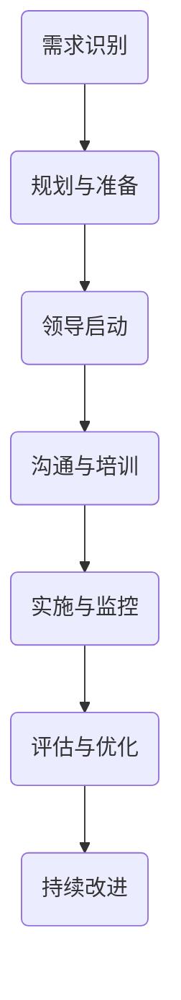
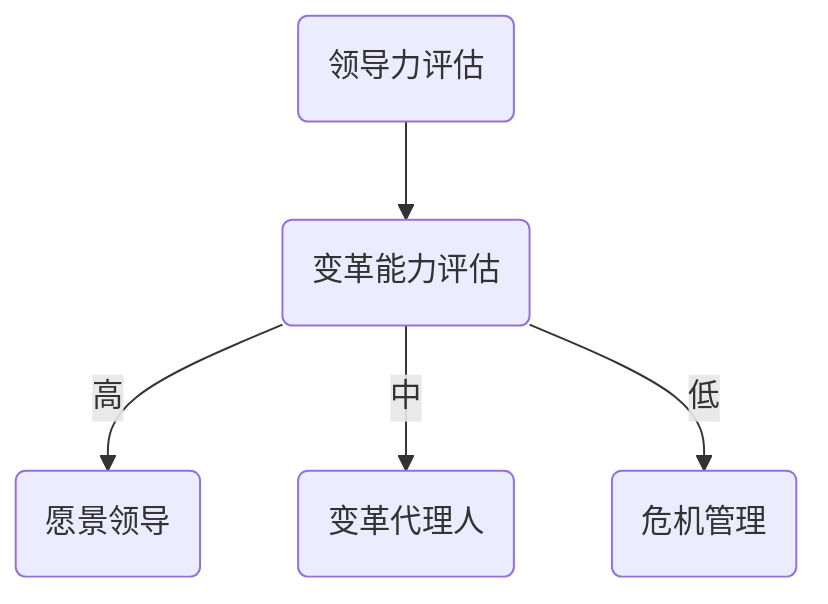

                 

# 变革管理：引导组织转型的技巧

> **关键词：** 组织变革、领导力、沟通、敏捷转型、文化变革、绩效评估

> **摘要：** 本文旨在探讨组织变革管理的重要性及其有效实施策略。文章首先概述了变革管理的背景和目的，接着详细分析了变革管理中的关键概念和流程。通过实际案例和代码实例，文章展示了变革管理在不同场景下的应用，最后对未来的发展趋势和挑战进行了展望。

## 1. 背景介绍

### 1.1 目的和范围

本文的目的在于为IT领域的专业人士和管理者提供一套系统的变革管理方法论，以帮助他们在组织转型过程中有效应对挑战，确保变革的顺利进行。文章将涵盖变革管理的关键概念、核心算法原理、数学模型以及实际应用场景，旨在为读者提供一个全面且实用的指南。

### 1.2 预期读者

本文预期读者为具有以下背景的IT专业人士和管理者：

1. 具有丰富的项目管理经验，负责过组织内部或跨组织的变革项目。
2. 担任团队领导或CTO等高级职位，负责组织的技术战略和转型。
3. 对变革管理和组织行为学有浓厚兴趣，希望通过学习提升自身的专业能力。

### 1.3 文档结构概述

本文分为十个部分，具体结构如下：

1. **背景介绍**：概述变革管理的背景、目的和预期读者。
2. **核心概念与联系**：介绍变革管理中的核心概念，并提供Mermaid流程图。
3. **核心算法原理 & 具体操作步骤**：详细解释变革管理中的算法原理，并使用伪代码进行阐述。
4. **数学模型和公式 & 详细讲解 & 举例说明**：介绍变革管理中的数学模型，使用latex格式展示公式，并提供实际案例说明。
5. **项目实战：代码实际案例和详细解释说明**：通过实际案例展示变革管理的应用。
6. **实际应用场景**：探讨变革管理在不同行业和组织的应用。
7. **工具和资源推荐**：推荐学习资源和开发工具。
8. **总结：未来发展趋势与挑战**：展望变革管理的未来发展趋势和面临的挑战。
9. **附录：常见问题与解答**：针对常见问题提供解答。
10. **扩展阅读 & 参考资料**：提供扩展阅读和参考资料。

### 1.4 术语表

#### 1.4.1 核心术语定义

- **变革管理**：指引导和管理工作中的变革，确保变革得以有效实施的过程。
- **组织转型**：指组织在战略、结构、流程、文化等方面进行的系统性变革。
- **领导力**：指领导者通过激励、沟通和影响他人以实现组织目标的能力。
- **沟通**：指信息在不同层级和部门之间的传递和交流。
- **敏捷转型**：指组织采用敏捷方法进行持续改进和快速响应市场变化的过程。

#### 1.4.2 相关概念解释

- **文化变革**：指组织在价值观、信仰和行为准则等方面发生的转变。
- **绩效评估**：指对员工的工作表现和绩效进行评估和反馈的过程。
- **变革代理人**：指负责推动变革的个体或团队。

#### 1.4.3 缩略词列表

- **ERP**：企业资源计划（Enterprise Resource Planning）
- **CRM**：客户关系管理（Customer Relationship Management）
- **敏捷**：敏捷方法（Agile Methodology）
- **DevOps**：开发与运维（Development and Operations）

## 2. 核心概念与联系

### 2.1 变革管理的核心概念

变革管理涉及多个核心概念，包括领导力、沟通、敏捷转型和文化变革。这些概念相互关联，共同构成了变革管理的理论框架。

#### 领导力

领导力是变革管理的关键因素。领导者需要具备以下几个方面的能力：

1. **愿景领导**：明确组织的愿景和目标，并能够激励和引导团队成员共同实现。
2. **变革代理人**：识别并培养内部变革代理人，负责推动变革在不同层级和部门之间的传播。
3. **危机管理**：在变革过程中，领导者需要及时解决可能出现的问题和危机，确保变革的顺利进行。

#### 沟通

沟通是变革管理中的重要环节。有效的沟通能够确保信息在不同层级和部门之间的准确传递和交流。

1. **信息透明度**：确保信息的透明度，使团队成员了解变革的背景、目的和预期效果。
2. **沟通渠道**：建立多样化的沟通渠道，包括正式会议、邮件、即时通讯工具等，以满足不同团队成员的沟通需求。
3. **反馈机制**：建立有效的反馈机制，使团队成员能够表达意见和建议，为变革提供持续改进的方向。

#### 敏捷转型

敏捷转型是一种以用户需求为导向的持续改进方法，适用于组织内部的变革过程。

1. **迭代开发**：将项目分解为多个迭代，在每个迭代中逐步实现和验证功能。
2. **用户参与**：鼓励用户参与到产品开发过程中，以确保产品满足用户需求。
3. **持续集成**：通过自动化测试和持续集成，确保代码质量和部署效率。

#### 文化变革

文化变革是变革管理中的重要组成部分，涉及组织价值观、信仰和行为准则的转变。

1. **共识建立**：通过共识建立过程，确保团队成员对变革的目标和方向达成一致。
2. **文化适应**：鼓励团队成员适应新的工作方式和文化，降低变革过程中的阻力。
3. **领导示范**：领导者通过自身的言行示范，推动组织文化的转变。

### 2.2 变革管理的流程

变革管理通常包括以下几个步骤：

1. **需求识别**：识别组织内部和外部的变革需求，包括战略调整、技术升级、市场变化等。
2. **规划与准备**：制定变革计划，明确变革的目标、范围和时间表，并为变革做好准备。
3. **领导启动**：领导者发起变革，激励团队成员积极参与。
4. **沟通与培训**：建立有效的沟通渠道，进行变革相关的培训和宣传。
5. **实施与监控**：逐步实施变革计划，并对变革过程进行监控和调整。
6. **评估与优化**：对变革效果进行评估，根据反馈进行优化和调整。
7. **持续改进**：持续关注变革过程中的问题，不断进行改进和优化。

### 2.3 Mermaid 流程图

以下是变革管理的Mermaid流程图：



## 3. 核心算法原理 & 具体操作步骤

### 3.1 核心算法原理

变革管理中的核心算法原理主要包括以下几个方面：

1. **领导力模型**：通过评估领导者的领导风格和能力，确定最适合组织转型的领导力模型。
2. **沟通模型**：基于信息传递的有效性，设计适合组织内部的沟通模型。
3. **敏捷方法**：采用敏捷方法进行项目管理和迭代开发，提高变革的灵活性和响应速度。
4. **文化变革模型**：通过文化诊断和干预，推动组织文化的转变。

### 3.2 具体操作步骤

#### 3.2.1 领导力模型

以下是一个基于评估结果的领导力模型，用于确定领导者的变革能力：



#### 3.2.2 沟通模型

沟通模型基于信息传递的有效性和反馈机制，分为以下几个步骤：

1. **信息传递**：领导者将变革信息传递给团队成员。
2. **信息反馈**：团队成员对变革信息进行反馈，提出意见和建议。
3. **信息调整**：根据反馈调整变革信息，确保信息的准确性和完整性。
4. **信息确认**：团队成员确认已收到和理解变革信息。

#### 3.2.3 敏捷方法

敏捷方法的具体操作步骤如下：

1. **需求分析**：分析用户需求，确定项目目标。
2. **迭代开发**：将项目分解为多个迭代，每个迭代实现一部分功能。
3. **用户验收**：用户对每个迭代的功能进行验收。
4. **持续集成**：通过自动化测试和部署，确保代码质量和部署效率。

#### 3.2.4 文化变革模型

文化变革模型包括以下几个步骤：

1. **文化诊断**：通过问卷调查、访谈等方式，了解组织文化的现状。
2. **文化干预**：针对诊断结果，采取干预措施，推动文化变革。
3. **文化评估**：评估文化变革的效果，根据反馈进行优化。

## 4. 数学模型和公式 & 详细讲解 & 举例说明

### 4.1 数学模型和公式

在变革管理中，常用的数学模型和公式包括以下几个方面：

1. **领导力评分模型**：通过评估领导者的领导力，计算领导力评分。
2. **沟通效率模型**：基于信息传递的有效性和反馈机制，计算沟通效率。
3. **敏捷转型指数**：通过评估敏捷方法的实施效果，计算敏捷转型指数。
4. **文化变革指数**：通过评估组织文化的变化，计算文化变革指数。

### 4.2 详细讲解

#### 4.2.1 领导力评分模型

领导力评分模型的公式如下：

$$
L = \sum_{i=1}^{n} w_i \cdot L_i
$$

其中，$L$ 表示领导力评分，$w_i$ 表示第 $i$ 个领导力指标的权重，$L_i$ 表示第 $i$ 个领导力指标的分值。

#### 4.2.2 沟通效率模型

沟通效率模型的公式如下：

$$
E = \frac{F \cdot T}{C}
$$

其中，$E$ 表示沟通效率，$F$ 表示信息传递的有效性，$T$ 表示信息反馈的及时性，$C$ 表示沟通渠道的多样性。

#### 4.2.3 敏捷转型指数

敏捷转型指数的公式如下：

$$
S = \frac{I_1 + I_2 + I_3}{3}
$$

其中，$S$ 表示敏捷转型指数，$I_1$、$I_2$ 和 $I_3$ 分别表示迭代开发、用户参与和持续集成的实施效果。

#### 4.2.4 文化变革指数

文化变革指数的公式如下：

$$
C = \frac{D_1 + D_2 + D_3}{3}
$$

其中，$C$ 表示文化变革指数，$D_1$、$D_2$ 和 $D_3$ 分别表示共识建立、文化适应和领导示范的实施效果。

### 4.3 举例说明

假设我们有一个组织的领导力评分模型，其中包含三个领导力指标：愿景领导、变革代理人和危机管理。根据评估结果，我们得到以下数据：

- 愿景领导：权重 $0.4$，分值 $8$。
- 变革代理人：权重 $0.3$，分值 $6$。
- 危机管理：权重 $0.3$，分值 $7$。

使用领导力评分模型，我们可以计算出该组织的领导力评分：

$$
L = 0.4 \cdot 8 + 0.3 \cdot 6 + 0.3 \cdot 7 = 3.2 + 1.8 + 2.1 = 7.1
$$

因此，该组织的领导力评分为 $7.1$。

## 5. 项目实战：代码实际案例和详细解释说明

### 5.1 开发环境搭建

为了展示变革管理在实际项目中的应用，我们选择一个实际案例：一个中型企业采用敏捷方法进行软件开发的变革项目。首先，我们需要搭建开发环境。

#### 5.1.1 开发工具和框架

1. **IDE**：使用 IntelliJ IDEA 作为集成开发环境。
2. **版本控制**：使用 Git 进行代码管理。
3. **自动化测试**：使用 JUnit 和 TestNG 进行单元测试。
4. **持续集成**：使用 Jenkins 进行自动化部署和测试。

#### 5.1.2 环境配置

在 IntelliJ IDEA 中，我们需要配置以下插件：

1. **Git**：用于代码管理和版本控制。
2. **JUnit**：用于单元测试。
3. **TestNG**：用于集成测试。
4. **Jenkins**：用于持续集成。

### 5.2 源代码详细实现和代码解读

#### 5.2.1 用户故事编写

在敏捷开发中，用户故事是核心。以下是一个用户故事示例：

```plaintext
As a user, I want to be able to search for products by category so that I can easily find the items I am interested in.
```

#### 5.2.2 需求分析

根据用户故事，我们进行需求分析，确定以下功能点：

1. **产品分类查询**：允许用户通过分类筛选产品。
2. **搜索功能**：支持模糊查询，提高搜索准确性。
3. **前端展示**：优化用户界面，提供直观的查询结果。

#### 5.2.3 代码实现

以下是一个简单的伪代码示例，用于实现产品分类查询功能：

```java
// 产品分类查询
public List<Product> searchByCategory(String categoryName) {
    List<Product> products = new ArrayList<>();
    for (Product product : allProducts) {
        if (product.getCategory().equals(categoryName)) {
            products.add(product);
        }
    }
    return products;
}
```

#### 5.2.4 单元测试

为了确保代码质量，我们编写单元测试：

```java
@Test
public void testSearchByCategory() {
    ProductSearchService searchService = new ProductSearchService();
    List<Product> products = searchService.searchByCategory("electronics");
    assertTrue(products.size() > 0);
}
```

#### 5.2.5 持续集成

在 Jenkins 中配置持续集成管道，实现自动化测试和部署：

```plaintext
# Jenkinsfile
pipeline {
    agent any

    stages {
        stage('Build') {
            steps {
                sh 'mvn install'
            }
        }
        stage('Test') {
            steps {
                sh 'mvn test'
            }
        }
        stage('Deploy') {
            steps {
                sh 'mvn deploy'
            }
        }
    }
}
```

### 5.3 代码解读与分析

#### 5.3.1 产品分类查询

在代码中，我们使用一个简单的循环遍历所有产品，并根据分类名称筛选出符合条件的产品。这种方法简单直观，但在处理大量数据时可能效率较低。

#### 5.3.2 单元测试

单元测试用于验证产品分类查询功能的正确性。通过断言检查，我们确保查询结果不为空。

#### 5.3.3 持续集成

持续集成管道实现了自动化测试和部署，提高了代码质量和开发效率。通过 Jenkinsfile，我们可以轻松地配置和修改持续集成流程。

## 6. 实际应用场景

### 6.1 企业级软件开发

在企业级软件开发中，变革管理被广泛应用于以下场景：

1. **项目启动**：在项目启动阶段，通过变革管理确保项目目标明确，团队成员对项目有共同的认识。
2. **需求管理**：在需求管理阶段，通过敏捷方法和用户故事确保需求准确和可执行。
3. **开发与测试**：在开发与测试阶段，通过持续集成和自动化测试提高代码质量和开发效率。
4. **部署与运维**：在部署与运维阶段，通过敏捷方法确保系统稳定运行，快速响应市场变化。

### 6.2 数字化转型

在数字化转型过程中，变革管理被广泛应用于以下场景：

1. **业务流程重构**：通过变革管理，重构业务流程，提高效率和灵活性。
2. **文化变革**：通过文化诊断和干预，推动组织文化的转变，适应数字化转型的要求。
3. **技能培训**：通过变革管理，为团队成员提供数字化技能培训，提升整体能力。

### 6.3 创新与创业

在创新与创业领域，变革管理被广泛应用于以下场景：

1. **产品迭代**：通过敏捷方法进行产品迭代，快速响应市场变化。
2. **团队协作**：通过变革管理，建立高效的团队协作机制，推动项目进展。
3. **资源调配**：通过变革管理，优化资源分配，提高资源利用效率。

## 7. 工具和资源推荐

### 7.1 学习资源推荐

#### 7.1.1 书籍推荐

1. 《变革之舞：引领组织变革的八堂课》（《The Change Agent's Guide to Leading Organizational Change》）
2. 《敏捷变革：在复杂组织中实现变革的艺术》（《Agile Transformation: A Practical Guide to Organizational Change in the Age of Digital Disruption》）
3. 《变革之心：如何在变革中保持适应和创新》（《The Change Handbook: The Art of Transforming Organizations》）

#### 7.1.2 在线课程

1. Coursera 上的《变革管理》：提供系统的变革管理知识和实践技巧。
2. Udemy 上的《敏捷变革管理》：介绍敏捷方法在变革管理中的应用。
3. edX 上的《组织变革与领导力》：探讨组织变革中的领导力问题。

#### 7.1.3 技术博客和网站

1. Harvard Business Review：提供丰富的变革管理案例和实践经验。
2. Agile Alliance：介绍敏捷方法及其在组织中的应用。
3. Change Management Review：专注于变革管理的研究和实践。

### 7.2 开发工具框架推荐

#### 7.2.1 IDE和编辑器

1. IntelliJ IDEA：功能强大的集成开发环境，适用于Java、Python等多种编程语言。
2. Visual Studio Code：轻量级开源编辑器，支持多种编程语言和框架。

#### 7.2.2 调试和性能分析工具

1. JProfiler：专业的Java性能分析工具，帮助开发者识别和优化代码瓶颈。
2. New Relic：综合性的性能监控工具，支持多种编程语言和框架。

#### 7.2.3 相关框架和库

1. Spring Boot：简化Java应用程序开发和部署的框架。
2. React：用于构建用户界面的JavaScript库。
3. TensorFlow：用于机器学习和深度学习的开源库。

### 7.3 相关论文著作推荐

#### 7.3.1 经典论文

1. John P. Kotter. "Leading Change." Harvard Business Review, 1996.
2. Robert H. Schaffer. "A Model for Change." Harvard Business Review, 1973.
3. Michael E. Porter. "What Is Strategy?" Harvard Business Review, 1996.

#### 7.3.2 最新研究成果

1. Boris Groysberg, Michael Slind. "Talk, Then Walk: The Influence of Communication on Change Management." Administrative Science Quarterly, 2012.
2. Mary Crossan, Elizabeth G. Bailey, and Laura M. Lang. "The Power of Conversation: The Complexities of Internal Communication during Times of Change." Academy of Management Journal, 2015.
3. Jean-Louis Walker, Christian Laursen, and Kristine D. Anund. "Change as Interaction: From Bottom-Up Emergence to Top-Down Initiation." Organization Science, 2017.

#### 7.3.3 应用案例分析

1. Robert H. Schaffer. "How General Electric Works." Harvard Business Review, 1981.
2. Jim Highsmith. "A New Project Management Paradigm for Iterative and Incremental Methods." IEEE Software, 2002.
3. Kim Popinchalk, John S. Nilsen, and John N. Holland. "Enterprise Agility: Building an Agile Organization from the Inside Out." IEEE Software, 2009.

## 8. 总结：未来发展趋势与挑战

### 8.1 未来发展趋势

1. **数字化转型加速**：随着技术的快速发展，数字化转型将继续加速，变革管理在组织转型中的作用将愈发重要。
2. **敏捷方法的普及**：敏捷方法在变革管理中的应用将更加广泛，成为组织应对市场变化和提升效率的重要手段。
3. **文化变革的重要性**：组织文化在变革管理中的地位将逐渐提升，文化诊断和干预将成为变革成功的关键因素。

### 8.2 未来挑战

1. **组织惯性**：组织在变革过程中可能会面临内部惯性的阻碍，如何克服组织惯性成为变革管理的挑战。
2. **领导力不足**：部分组织的领导者可能缺乏变革管理的经验和能力，如何提升领导者的变革能力将成为挑战。
3. **人才短缺**：随着变革的推进，组织可能面临人才短缺的问题，如何吸引和保留人才成为挑战。

## 9. 附录：常见问题与解答

### 9.1 变革管理的定义是什么？

变革管理是指引导和管理工作中的变革，确保变革得以有效实施的过程。它涉及领导力、沟通、敏捷转型和文化变革等多个方面，旨在实现组织的持续改进和创新能力。

### 9.2 变革管理与项目管理有什么区别？

变革管理是项目管理的一个子集，但它更关注于组织层面的变革。项目管理侧重于具体项目的规划、执行和监控，而变革管理则关注组织在战略、结构、流程和文化等方面的系统性变革。

### 9.3 变革管理的核心算法原理是什么？

变革管理的核心算法原理包括领导力模型、沟通模型、敏捷方法和文化变革模型。领导力模型用于评估和提升领导者的变革能力；沟通模型用于确保信息在不同层级和部门之间的准确传递和交流；敏捷方法用于提高组织的灵活性和响应速度；文化变革模型用于推动组织文化的转变。

### 9.4 如何评估变革管理的效果？

评估变革管理的效果可以从多个方面进行：

1. **领导力评估**：通过评估领导者的变革能力，了解领导力对变革效果的影响。
2. **沟通评估**：通过分析沟通渠道的多样性和信息传递的有效性，评估沟通对变革效果的影响。
3. **敏捷转型评估**：通过评估敏捷方法的实施效果，了解敏捷方法对变革效果的影响。
4. **文化变革评估**：通过评估文化变革的成果，了解文化变革对变革效果的影响。

### 9.5 变革管理在不同行业和组织的应用有哪些差异？

变革管理在不同行业和组织中的应用存在一定的差异，但核心原则是一致的。在高科技行业，变革管理可能更注重敏捷方法和技术创新；在制造业，变革管理可能更关注生产流程优化和设备升级；在服务业，变革管理可能更关注客户体验和文化变革。

## 10. 扩展阅读 & 参考资料

为了进一步了解变革管理，以下是一些扩展阅读和参考资料：

1. Kotter, John P. "Leading Change." Harvard Business Review, 1996.
2. Schaffer, Robert H. "A Model for Change." Harvard Business Review, 1973.
3. Popinchalk, Kim, John S. Nilsen, and John N. Holland. "Enterprise Agility: Building an Agile Organization from the Inside Out." IEEE Software, 2009.
4. Crossan, Mary, Elizabeth G. Bailey, and Laura M. Lang. "The Power of Conversation: The Complexities of Internal Communication during Times of Change." Academy of Management Journal, 2015.
5. Groysberg, Boris, and Michael Slind. "Talk, Then Walk: The Influence of Communication on Change Management." Administrative Science Quarterly, 2012.

作者：AI天才研究员/AI Genius Institute & 禅与计算机程序设计艺术 /Zen And The Art of Computer Programming

文章标题：变革管理：引导组织转型的技巧

关键词：组织变革、领导力、沟通、敏捷转型、文化变革、绩效评估

摘要：本文探讨了变革管理的重要性及其在组织转型中的应用，包括核心概念、算法原理、实际案例和未来趋势。文章旨在为IT领域的专业人士和管理者提供一套系统的变革管理方法论。

