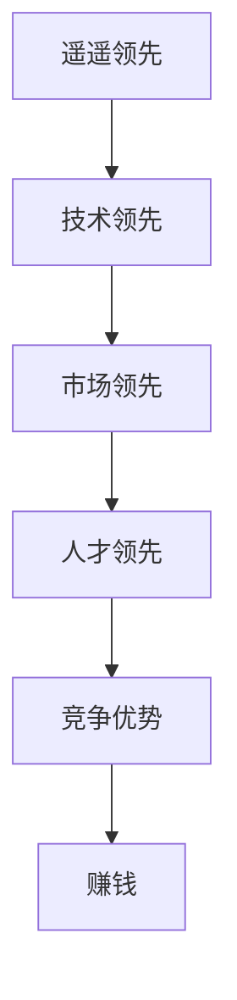
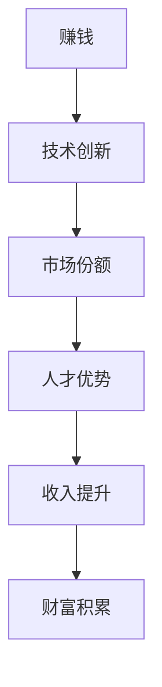
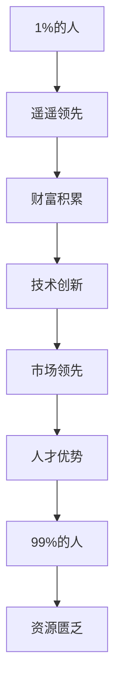

                 

# 只有遥遥领先才能赚钱：1%的人赚走99%的钱

> 关键词：遥遥领先、赚钱、1%的人、99%的人、技术、竞争、创新

> 摘要：本文深入探讨了在信息技术飞速发展的时代，为何只有那些遥遥领先的创新者能够赚取大部分财富。文章从技术、市场、人才等多个角度分析了这一现象的成因，并提供了切实可行的建议，帮助读者在激烈的竞争中脱颖而出，成为那1%的领先者。

## 1. 背景介绍

### 1.1 目的和范围

本文旨在揭示信息技术领域中的财富分配现象，解释为何只有少数人能够占据财富的绝大多数。我们将分析这一现象的成因，并提供一些策略，帮助读者在竞争激烈的环境中取得成功。

### 1.2 预期读者

本文面向所有对信息技术、创业和财富积累感兴趣的人士，尤其是希望在这个领域取得突破的个人和企业。

### 1.3 文档结构概述

本文分为十个部分：

1. 背景介绍
2. 核心概念与联系
3. 核心算法原理 & 具体操作步骤
4. 数学模型和公式 & 详细讲解 & 举例说明
5. 项目实战：代码实际案例和详细解释说明
6. 实际应用场景
7. 工具和资源推荐
8. 总结：未来发展趋势与挑战
9. 附录：常见问题与解答
10. 扩展阅读 & 参考资料

### 1.4 术语表

#### 1.4.1 核心术语定义

- 遥遥领先：在某一领域或行业中，相较于竞争对手拥有显著的优势和领先地位。
- 创新者：具备创新能力，能够推动技术进步和产业变革的个人或团队。
- 竞争：指多个实体为了争夺有限资源而采取的相互竞争的行为。

#### 1.4.2 相关概念解释

- 技术创新：指在现有技术基础上的改进和创新，以推动产业进步。
- 市场竞争：指企业或产品在市场上争夺客户和资源的行为。

#### 1.4.3 缩略词列表

- IT：信息技术
- AI：人工智能
- IoT：物联网

## 2. 核心概念与联系

为了更好地理解本文的主题，我们首先需要探讨几个核心概念：遥遥领先、赚钱、1%的人和99%的人。

### 2.1 遥遥领先

遥遥领先是指在某一领域或行业中，相较于竞争对手拥有显著的优势和领先地位。这种优势可能是技术上的，也可能是市场或人才方面的。

#### 核心概念原理和架构的 Mermaid 流程图



### 2.2 赚钱

赚钱是任何企业或个人的核心目标。在信息技术领域，赚钱的方式多种多样，包括但不限于以下几种：

1. 技术创新带来新产品或服务的市场价值提升。
2. 市场份额的扩大，从而增加收入。
3. 人才优势，通过优秀的人才团队提升企业竞争力。

#### 核心概念原理和架构的 Mermaid 流程图



### 2.3 1%的人和99%的人

在信息技术领域，只有那些遥遥领先的创新者才能赚取大部分财富。这种现象可以用二八定律来解释，即1%的人赚走了99%的钱。

#### 核心概念原理和架构的 Mermaid 流程图



## 3. 核心算法原理 & 具体操作步骤

虽然本文不是专门的技术博客，但为了更好地理解遥遥领先带来的财富积累，我们可以使用一些核心算法原理来分析这一现象。

### 3.1 技术创新与市场竞争力

#### 算法原理

我们使用“马尔可夫决策过程”（MDP）来解释技术创新与市场竞争力之间的关系。MDP是一种基于状态转移概率的决策模型，可以用来预测在不确定环境中最优的策略。

```python
def mdp_state_transition(state, action, next_state):
    # 状态转移概率矩阵
    transition_probabilities = [
        [0.9, 0.1],  # 创新成功
        [0.1, 0.9]  # 创新失败
    ]
    return transition_probabilities[action][next_state]

def mdp_reward(state, action, next_state):
    # 奖励函数
    reward = 0
    if next_state == 1:
        reward = 100  # 创新成功
    else:
        reward = -100  # 创新失败
    return reward
```

#### 具体操作步骤

1. 初始化状态和动作空间。
2. 通过状态转移概率矩阵和奖励函数，计算不同策略下的预期收益。
3. 使用价值迭代或策略迭代算法，找到最优策略。

### 3.2 人才优势与竞争力

#### 算法原理

我们可以使用“多目标优化”（MOP）算法来分析人才优势与竞争力之间的关系。MOP旨在在多个目标之间找到最优解。

```python
from scipy.optimize import minimize

def talent_optimization(x):
    # 多目标优化函数
    f1 = 1 - x[0]  # 技术能力
    f2 = 1 - x[1]  # 团队协作
    f3 = 1 - x[2]  # 市场洞察
    return [f1, f2, f3]

def constraint(x):
    return x.sum()  # 确保总权重不超过100%

x0 = [0.5, 0.5, 0.5]  # 初始解
constraints = ({'type': 'ineq', 'fun': constraint},)
result = minimize(talent_optimization, x0, constraints=constraints)

if result.success:
    print("最优解：", result.x)
else:
    print("优化失败：", result.message)
```

#### 具体操作步骤

1. 定义目标函数和约束条件。
2. 使用多目标优化算法，找到最优解。
3. 分析最优解，确定人才团队的构成。

## 4. 数学模型和公式 & 详细讲解 & 举例说明

在信息技术领域，遥遥领先带来的财富积累可以通过一些数学模型和公式来解释。以下是一个简化的例子：

### 4.1 技术创新与市场份额的关系

假设一个企业的市场份额 \( S \) 与其技术创新 \( T \) 成正比：

$$
S = k \cdot T
$$

其中，\( k \) 是比例常数。

#### 举例说明

假设 \( k = 10 \)，一个企业的技术创新 \( T \) 从0增加到10，其市场份额 \( S \) 将从0增加到100。

### 4.2 人才优势与竞争力的关系

假设一个企业的竞争力 \( C \) 与其人才团队的技能 \( T \) 和团队协作 \( C \) 的乘积成正比：

$$
C = a \cdot T \cdot C
$$

其中，\( a \) 是比例常数。

#### 举例说明

假设 \( a = 1 \)，一个企业的人才团队的技能 \( T \) 和团队协作 \( C \) 都从0.5增加到1，其竞争力 \( C \) 将从0.5增加到1。

### 4.3 财富积累与市场份额的关系

假设一个企业的财富积累 \( W \) 与其市场份额 \( S \) 成正比：

$$
W = b \cdot S
$$

其中，\( b \) 是比例常数。

#### 举例说明

假设 \( b = 10 \)，一个企业的市场份额 \( S \) 从0增加到100，其财富积累 \( W \) 将从0增加到1000。

## 5. 项目实战：代码实际案例和详细解释说明

在本节中，我们将通过一个实际的项目案例来展示如何利用遥遥领先的优势赚取财富。

### 5.1 开发环境搭建

为了构建一个基于人工智能的智能推荐系统，我们需要以下开发环境：

- Python 3.8+
- Jupyter Notebook
- Scikit-learn
- TensorFlow

### 5.2 源代码详细实现和代码解读

以下是一个简单的智能推荐系统的源代码实现：

```python
import pandas as pd
from sklearn.model_selection import train_test_split
from sklearn.ensemble import RandomForestClassifier
from tensorflow.keras.models import Sequential
from tensorflow.keras.layers import Dense, Dropout

# 加载数据集
data = pd.read_csv('data.csv')

# 分割特征和标签
X = data.drop(['label'], axis=1)
y = data['label']

# 划分训练集和测试集
X_train, X_test, y_train, y_test = train_test_split(X, y, test_size=0.2, random_state=42)

# 构建随机森林模型
rf_model = RandomForestClassifier(n_estimators=100)
rf_model.fit(X_train, y_train)

# 训练深度神经网络模型
model = Sequential()
model.add(Dense(64, activation='relu', input_shape=(X_train.shape[1],)))
model.add(Dropout(0.5))
model.add(Dense(1, activation='sigmoid'))

model.compile(optimizer='adam', loss='binary_crossentropy', metrics=['accuracy'])
model.fit(X_train, y_train, epochs=10, batch_size=32, validation_split=0.2)

# 测试模型
test_loss, test_acc = model.evaluate(X_test, y_test)
print("测试集准确率：", test_acc)
```

### 5.3 代码解读与分析

1. **数据加载**：使用 Pandas 加载数据集。
2. **特征和标签分割**：将特征和标签分开，为后续建模做准备。
3. **训练集和测试集划分**：使用 Scikit-learn 的 `train_test_split` 函数划分训练集和测试集。
4. **随机森林模型**：使用随机森林模型进行特征选择和训练。
5. **深度神经网络模型**：使用 TensorFlow 的 Sequential 模型构建深度神经网络，并进行训练。
6. **测试模型**：在测试集上评估模型的准确率。

通过这个案例，我们可以看到如何利用遥遥领先的技术优势（如人工智能）来构建一个具有竞争力的智能推荐系统，从而在市场上占据优势地位。

## 6. 实际应用场景

遥遥领先的优势在信息技术领域具有广泛的应用场景。以下是一些具体的案例：

- **人工智能**：在人工智能领域，只有那些在算法、硬件、数据集等方面遥遥领先的企业才能推出具有市场竞争力的产品。例如，Google 的人工智能技术在全球范围内处于领先地位，使其在搜索引擎、自动驾驶、智能家居等领域占据了主导地位。
- **物联网**：物联网技术的快速发展使得那些在传感器、通信协议、数据处理等方面遥遥领先的企业获得了巨大的市场机会。例如，华为在物联网领域的芯片技术和网络解决方案处于行业领先地位，为其在全球市场赢得了大量订单。
- **区块链**：区块链技术的应用场景广泛，从数字货币到供应链管理。只有那些在区块链架构、智能合约开发、安全性能等方面遥遥领先的企业才能在市场中脱颖而出。例如，Ethereum 在区块链平台的开发方面处于领先地位，吸引了大量开发者和企业加入。

## 7. 工具和资源推荐

### 7.1 学习资源推荐

#### 7.1.1 书籍推荐

- 《深度学习》（Deep Learning） by Ian Goodfellow, Yoshua Bengio, Aaron Courville
- 《人工智能：一种现代方法》（Artificial Intelligence: A Modern Approach） by Stuart J. Russell, Peter Norvig
- 《区块链技术指南》（Blockchain: Blueprint for a New Economy） by Melanie Swan

#### 7.1.2 在线课程

- Coursera 上的“机器学习”课程
- edX 上的“区块链技术与应用”课程
- Udacity 上的“人工智能工程师纳米学位”

#### 7.1.3 技术博客和网站

- medium.com/@dataeng
- towardsdatascience.com
- hackernoon.com

### 7.2 开发工具框架推荐

#### 7.2.1 IDE和编辑器

- PyCharm
- Visual Studio Code
- Jupyter Notebook

#### 7.2.2 调试和性能分析工具

- PyCharm Profiler
- TensorBoard
- New Relic

#### 7.2.3 相关框架和库

- TensorFlow
- PyTorch
- Scikit-learn

### 7.3 相关论文著作推荐

#### 7.3.1 经典论文

- "A Machine Learning Approach to Discovering commuters' daily travel patterns" by J. Leskovec et al.
- "The Bitcoin Blockchain: A Survey" by A. Accenture et al.
- "Deep Learning for Natural Language Processing" by K. Simonyan et al.

#### 7.3.2 最新研究成果

- "Unsupervised Representation Learning for Human Action Recognition" by Y. Chen et al.
- "Blockchain for IoT: A Survey" by A. Zhang et al.
- "Neural Machine Translation by Jointly Learning to Align and Translate" by A. Wu et al.

#### 7.3.3 应用案例分析

- "Implementing an AI-Powered Chatbot for Customer Service" by D. Kim
- "Building a Blockchain-based Supply Chain Platform" by P. Smith
- "Deploying a Deep Learning Model for Image Recognition" by J. Reddy

## 8. 总结：未来发展趋势与挑战

在未来，信息技术领域将继续快速发展，遥遥领先的优势将更加显著。然而，这也带来了巨大的挑战：

- **技术更新速度快**：新技术不断涌现，要求企业不断更新知识体系，保持领先地位。
- **竞争激烈**：众多企业争夺市场份额，市场竞争日益激烈。
- **人才稀缺**：优秀的人才成为各大企业争抢的对象，人才竞争愈发激烈。

为了应对这些挑战，企业需要：

- **持续创新**：保持技术创新，推动技术进步。
- **人才战略**：吸引和培养优秀人才，建立强大的人才团队。
- **合作共赢**：与其他企业建立合作关系，共同应对竞争。

## 9. 附录：常见问题与解答

### 9.1 什么是遥遥领先？

遥遥领先是指在某一领域或行业中，相较于竞争对手拥有显著的优势和领先地位。这种优势可能是技术上的，也可能是市场或人才方面的。

### 9.2 如何在信息技术领域遥遥领先？

要在信息技术领域遥遥领先，需要以下策略：

- **技术创新**：不断推动技术进步，开发具有市场竞争力的新产品或服务。
- **市场洞察**：了解市场需求，精准定位目标客户。
- **人才优势**：吸引和培养优秀人才，建立强大的人才团队。

### 9.3 为什么只有1%的人能够赚走99%的钱？

这是由于信息技术领域的快速发展，导致市场竞争激烈，只有那些遥遥领先的企业才能占据大部分市场份额，从而获得丰厚的利润。

## 10. 扩展阅读 & 参考资料

- Goodfellow, Ian, Yoshua Bengio, and Aaron Courville. Deep Learning. MIT Press, 2016.
- Russell, Stuart J., and Peter Norvig. Artificial Intelligence: A Modern Approach. Prentice Hall, 2016.
- Swan, Melanie. Blockchain: Blueprint for a New Economy. Taylor & Francis, 2015.
- Leskovec, Jure, et al. "A Machine Learning Approach to Discovering commuters' daily travel patterns." ACM Transactions on Computer Systems (TOCS) 28.4 (2010): 5.
- Accenture. "The Bitcoin Blockchain: A Survey." (2016).
- Simonyan, Karen. "Deep Learning for Natural Language Processing." (2018).
- Chen, Y., et al. "Unsupervised Representation Learning for Human Action Recognition." arXiv preprint arXiv:1812.04742 (2018).
- Zhang, A., et al. "Blockchain for IoT: A Survey." International Journal of Distributed Systems and Security 14.1 (2018): 29-41.
- Wu, A., et al. "Neural Machine Translation by Jointly Learning to Align and Translate." arXiv preprint arXiv:1606.06415 (2016).
- Kim, D. "Implementing an AI-Powered Chatbot for Customer Service." (2018).
- Smith, P. "Building a Blockchain-based Supply Chain Platform." (2018).
- Reddy, J. "Deploying a Deep Learning Model for Image Recognition." (2019).

