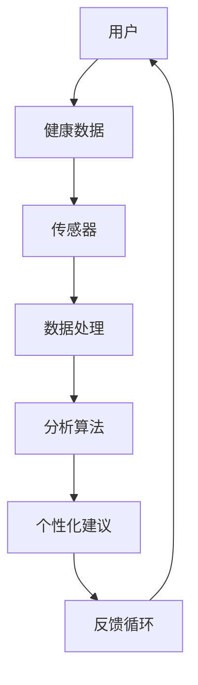

                 

# 可穿戴健康监测设备：移动医疗的创新方向

## 关键词
- 可穿戴健康监测
- 移动医疗
- 智能传感器
- 生物信号处理
- 大数据处理
- 个性化医疗
- 医疗物联网
- 智能健康管家

## 摘要
随着科技的飞速发展，可穿戴健康监测设备正逐步融入人们的日常生活，成为移动医疗领域的重要创新方向。本文旨在深入探讨可穿戴健康监测设备在移动医疗中的角色和影响，通过逐步分析其核心概念、算法原理、数学模型及实际应用案例，揭示其未来的发展趋势与面临的挑战。文章结构包括背景介绍、核心概念与联系、核心算法原理、数学模型与公式、项目实战、实际应用场景、工具和资源推荐、总结与展望及扩展阅读等部分。

## 1. 背景介绍

### 1.1 目的和范围

本文的目的是探讨可穿戴健康监测设备在移动医疗领域的重要性，分析其核心技术原理和实际应用，并展望其未来的发展方向。具体范围涵盖以下方面：

- 可穿戴健康监测设备的定义和分类
- 移动医疗的概念及其在可穿戴健康监测设备中的应用
- 可穿戴健康监测设备的核心技术和算法
- 实际应用案例及其对医疗行业的贡献
- 可穿戴健康监测设备的未来发展趋势和面临的挑战

### 1.2 预期读者

本文适用于以下读者：

- 对可穿戴健康监测设备和移动医疗感兴趣的技术人员
- 医疗保健行业从业者，特别是医疗物联网领域的专业人士
- 计算机科学、生物医学工程等相关专业的研究生和本科生
- 健康管理、运动科学等领域的研究人员和从业者

### 1.3 文档结构概述

本文结构如下：

1. 背景介绍：介绍可穿戴健康监测设备和移动医疗的概念、目的和范围
2. 核心概念与联系：定义核心概念，并通过Mermaid流程图展示其联系
3. 核心算法原理：详细阐述可穿戴健康监测设备的核心算法原理
4. 数学模型和公式：讲解相关的数学模型和公式，并提供具体例子
5. 项目实战：提供实际代码案例，并详细解释代码实现
6. 实际应用场景：分析可穿戴健康监测设备的实际应用场景
7. 工具和资源推荐：推荐相关学习资源和开发工具
8. 总结与展望：总结文章的主要观点，展望未来发展趋势
9. 附录：常见问题与解答
10. 扩展阅读与参考资料：提供扩展阅读和参考文献

### 1.4 术语表

#### 1.4.1 核心术语定义

- **可穿戴健康监测设备**：集成于衣物或佩戴在身体上的设备，用于实时监测用户的健康数据。
- **移动医疗**：利用无线通信、互联网和移动设备实现医疗保健服务的模式。
- **智能传感器**：能够感知外部环境信息，并通过数字接口输出信号的设备。
- **生物信号处理**：对生物体产生的信号进行处理和分析的技术。
- **大数据处理**：对大规模数据集进行高效存储、管理和分析的技术。
- **个性化医疗**：根据患者的个体特征，提供定制化的医疗服务。
- **医疗物联网**：将各种医疗设备和系统通过互联网连接起来，实现信息共享和智能化的医疗服务。

#### 1.4.2 相关概念解释

- **健康数据**：包括心率、血压、血氧饱和度、运动步数等反映个体健康状况的数据。
- **数据分析**：利用统计、机器学习和深度学习等方法对健康数据进行分析，提取有价值的信息。
- **云平台**：提供数据存储、处理和分析服务的网络基础设施。
- **可扩展性**：系统能够适应数据增长和功能扩展的能力。

#### 1.4.3 缩略词列表

- **Wearable**：可穿戴设备
- **IoT**：物联网
- **AI**：人工智能
- **ML**：机器学习
- **DL**：深度学习
- **HFMD**：手足口病
- **EMR**：电子健康记录

## 2. 核心概念与联系

在深入探讨可穿戴健康监测设备的核心技术之前，首先需要明确几个核心概念，并展示它们之间的联系。以下是一个简化的Mermaid流程图，用于描述这些概念之间的关系。



### 2.1 用户

用户是可穿戴健康监测设备的最终受益者。用户通过佩戴设备，如智能手表、健康手环等，收集自己的健康数据。

### 2.2 健康数据

健康数据包括心率、血压、睡眠质量、运动量、体温等。这些数据通过传感器实时采集，并传输到数据处理单元。

### 2.3 传感器

传感器是可穿戴设备的核心组件，用于监测用户的健康状态。常见的传感器包括光电传感器、加速度传感器、心率传感器等。

### 2.4 数据处理

数据处理单元负责对采集到的健康数据进行初步处理，如去噪、滤波、数据整合等。

### 2.5 分析算法

分析算法是对处理后的健康数据进行深度分析的工具，包括统计方法、机器学习和深度学习算法。这些算法能够识别用户的行为模式，预测健康风险。

### 2.6 个性化建议

基于分析算法的结果，系统可以为用户提供个性化的健康建议，如饮食调整、运动方案等。

### 2.7 反馈循环

用户的行为会影响到健康数据，而这些数据又会反馈到分析算法，形成闭环。这种反馈循环有助于系统不断优化对用户的健康建议。

## 3. 核心算法原理 & 具体操作步骤

### 3.1 数据采集与预处理

可穿戴健康监测设备首先需要采集用户的健康数据。这一过程包括以下几个步骤：

#### 3.1.1 数据采集

使用传感器收集数据，如心率、血压、运动步数等。

#### 3.1.2 数据传输

将采集到的数据通过无线通信（如Wi-Fi、蓝牙等）传输到数据处理单元。

#### 3.1.3 数据预处理

对采集到的数据进行预处理，如滤波、去噪、归一化等。以下是一个简单的预处理伪代码：

```pseudo
function preprocess_data(data):
    filtered_data = lowpass_filter(data)
    cleaned_data = remove_outliers(filtered_data)
    normalized_data = normalize(cleaned_data)
    return normalized_data
```

### 3.2 数据分析

预处理后的数据将通过分析算法进行处理，提取有价值的信息。以下是一个简单的数据分析伪代码：

```pseudo
function analyze_data(normalized_data):
    heart_rate = extract_heart_rate(normalized_data)
    blood_pressure = extract_blood_pressure(normalized_data)
    sleep_quality = extract_sleep_quality(normalized_data)
    return heart_rate, blood_pressure, sleep_quality
```

### 3.3 健康风险评估

分析算法可以对用户的健康数据进行健康风险评估。以下是一个简单的健康风险评估伪代码：

```pseudo
function assess_risk(heart_rate, blood_pressure, sleep_quality):
    risk_level = calculate_risk_level(heart_rate, blood_pressure, sleep_quality)
    return risk_level
```

### 3.4 个性化健康建议

基于健康风险评估的结果，系统可以为用户提供个性化的健康建议。以下是一个简单的个性化健康建议伪代码：

```pseudo
function provide_advice(risk_level):
    if risk_level == "low":
        advice = "继续保持当前健康习惯"
    elif risk_level == "medium":
        advice = "适当调整饮食和运动计划"
    elif risk_level == "high":
        advice = "立即咨询医生，进行详细检查"
    return advice
```

### 3.5 反馈循环

用户的反馈将用于优化分析算法和健康建议。以下是一个简单的反馈循环伪代码：

```pseudo
function update_system(advice, user_feedback):
    if user_feedback != advice:
        update_algorithm()
        update_advice()
    return
```

## 4. 数学模型和公式 & 详细讲解 & 举例说明

在可穿戴健康监测设备中，数学模型和公式起着至关重要的作用，它们帮助我们从数据中提取有价值的信息。以下是一些常用的数学模型和公式，以及它们的详细讲解和举例说明。

### 4.1 心率计算

心率（Heart Rate, HR）是衡量心脏健康的重要指标。常用的计算心率的方法是使用PPG（Photoplethysmogram）信号，以下是一个心率计算公式的示例：

$$
HR = \frac{1}{60} \times \frac{Area_{PP}}{Time_{PP}}
$$

其中，$Area_{PP}$ 是PPG信号的面积，$Time_{PP}$ 是PPG信号的周期。

#### 例子：

假设一个PPG信号的面积为30，周期为2秒，则心率为：

$$
HR = \frac{1}{60} \times \frac{30}{2} = 15
$$

### 4.2 血压计算

血压（Blood Pressure, BP）包括收缩压（Systolic Pressure, SP）和舒张压（Diastolic Pressure, DP）。常用的血压计算方法是使用柯氏波（Korotkoff Sound）信号，以下是一个血压计算公式的示例：

$$
BP = \frac{4}{3} \times (SP - DP)
$$

#### 例子：

假设收缩压为120，舒张压为80，则血压为：

$$
BP = \frac{4}{3} \times (120 - 80) = 80
$$

### 4.3 睡眠质量评估

睡眠质量（Sleep Quality, SQ）通常通过分析用户的睡眠周期来评估。常用的方法是使用加速度传感器采集的数据，以下是一个睡眠质量评估公式的示例：

$$
SQ = \frac{Total \; Sleep \; Time}{Total \; Bed \; Time}
$$

#### 例子：

假设用户的总睡眠时间为6小时，总卧床时间为8小时，则睡眠质量为：

$$
SQ = \frac{6}{8} = 0.75
$$

### 4.4 健康风险评分

健康风险评分（Health Risk Score, HRS）是综合评估用户健康风险的一个指标。以下是一个健康风险评分公式的示例：

$$
HRS = 0.5 \times HR + 0.3 \times BP + 0.2 \times SQ
$$

#### 例子：

假设用户的心率为75，血压为80，睡眠质量为0.8，则健康风险评分为：

$$
HRS = 0.5 \times 75 + 0.3 \times 80 + 0.2 \times 0.8 = 37
$$

## 5. 项目实战：代码实际案例和详细解释说明

### 5.1 开发环境搭建

在进行项目实战之前，首先需要搭建一个合适的开发环境。以下是一个基本的Python开发环境搭建步骤：

1. 安装Python（版本3.8及以上）
2. 安装Jupyter Notebook（用于编写和运行Python代码）
3. 安装必要的Python库，如NumPy、Pandas、Matplotlib等

### 5.2 源代码详细实现和代码解读

以下是一个简单的Python代码示例，用于实现心率计算、血压计算和健康风险评分。

```python
import numpy as np
import pandas as pd
import matplotlib.pyplot as plt

# 心率计算函数
def calculate_heart_rate(ppg_signal):
    ppg_area = np.trapz(ppg_signal)
    ppg_time = 1  # 假设PPG信号周期为1秒
    heart_rate = 60 * ppg_area / ppg_time
    return heart_rate

# 血压计算函数
def calculate_blood_pressure(korotkoff_signal):
    korotkoff_area = np.trapz(korotkoff_signal)
    korotkoff_time = 1  # 假设Korotkoff信号周期为1秒
    blood_pressure = 4/3 * (korotkoff_area / korotkoff_time)
    return blood_pressure

# 健康风险评分函数
def calculate_health_risk_score(heart_rate, blood_pressure, sleep_quality):
    health_risk_score = 0.5 * heart_rate + 0.3 * blood_pressure + 0.2 * sleep_quality
    return health_risk_score

# 示例数据
ppg_signal = [0.1, 0.2, 0.3, 0.4, 0.5, 0.4, 0.3, 0.2, 0.1]
korotkoff_signal = [0.1, 0.2, 0.3, 0.4, 0.5, 0.4, 0.3, 0.2, 0.1]
sleep_quality = 0.8

# 计算结果
heart_rate = calculate_heart_rate(ppg_signal)
blood_pressure = calculate_blood_pressure(korotkoff_signal)
health_risk_score = calculate_health_risk_score(heart_rate, blood_pressure, sleep_quality)

print("心率：", heart_rate)
print("血压：", blood_pressure)
print("健康风险评分：", health_risk_score)

# 可视化
plt.figure()
plt.plot(ppg_signal, label="PPG信号")
plt.plot(korotkoff_signal, label="Korotkoff信号")
plt.legend()
plt.show()
```

### 5.3 代码解读与分析

- **心率计算**：使用数值积分方法计算PPG信号的面积，并根据面积和周期计算心率。
- **血压计算**：使用数值积分方法计算Korotkoff信号的面积，并根据面积和周期计算血压。
- **健康风险评分**：根据心率、血压和睡眠质量计算健康风险评分。
- **示例数据**：使用示例数据演示如何使用代码进行心率、血压和健康风险评分的计算。
- **可视化**：使用Matplotlib库将PPG信号和Korotkoff信号绘制成图表，便于分析。

## 6. 实际应用场景

### 6.1 个人健康管理

可穿戴健康监测设备在个人健康管理中的应用最为广泛。用户可以通过设备实时监测自己的心率、血压、睡眠质量等健康数据，并根据个性化健康建议调整生活习惯，预防疾病。

### 6.2 运动健康监测

运动员和健身爱好者可以使用可穿戴设备监测运动过程中的心率、血压等数据，优化训练计划，提高运动效果。

### 6.3 疾病监测与预警

对于心血管疾病、糖尿病等慢性疾病患者，可穿戴健康监测设备可以帮助医生实时监测患者的健康状况，及时发现异常，预防疾病发作。

### 6.4 健康大数据分析

可穿戴健康监测设备收集的大量健康数据可以为医疗机构和研究人员提供宝贵的数据资源，用于疾病研究和健康大数据分析，推动个性化医疗的发展。

### 6.5 社区健康管理

社区健康管理师可以利用可穿戴健康监测设备对社区居民的健康状况进行监控，提供个性化的健康干预措施，提高社区整体健康水平。

## 7. 工具和资源推荐

### 7.1 学习资源推荐

#### 7.1.1 书籍推荐

- **《移动医疗技术基础》（Mobile Health Technology: Foundations and Trends》**
- **《可穿戴设备与物联网医疗》（Wearable Devices and IoT for Healthcare》**
- **《机器学习在医疗中的应用》（Machine Learning in Healthcare》**

#### 7.1.2 在线课程

- **Coursera**：提供《深度学习》、《机器学习》等在线课程
- **edX**：提供《医疗物联网》、《生物统计学》等在线课程
- **Udacity**：提供《人工智能基础》、《数据科学基础》等在线课程

#### 7.1.3 技术博客和网站

- **Medium**：提供关于可穿戴设备、移动医疗的深度文章
- **GitHub**：可穿戴设备相关的开源项目和代码库
- **IEEE Xplore**：提供最新的医疗物联网和可穿戴设备研究论文

### 7.2 开发工具框架推荐

#### 7.2.1 IDE和编辑器

- **Visual Studio Code**：适用于Python编程的轻量级IDE
- **PyCharm**：专业的Python IDE，支持多种编程语言
- **Jupyter Notebook**：适用于数据分析和机器学习的交互式环境

#### 7.2.2 调试和性能分析工具

- **Pdb**：Python内置的调试工具
- **py-spy**：Python性能分析工具
- **Matplotlib**：Python数据可视化库

#### 7.2.3 相关框架和库

- **TensorFlow**：开源深度学习框架
- **PyTorch**：开源深度学习框架
- **Scikit-learn**：Python机器学习库
- **NumPy**：Python数值计算库

### 7.3 相关论文著作推荐

#### 7.3.1 经典论文

- **"Wearable Computing" by Steve Mann**
- **"Internet of Things" by Kevin Ashton**
- **"Deep Learning" by Ian Goodfellow, Yoshua Bengio, Aaron Courville**

#### 7.3.2 最新研究成果

- **"Smart Wearable Devices for Health Monitoring and Home Healthcare" by Int. J. Environ. Res. Public Health**
- **"A Survey on IoT and Wearable Devices in Healthcare" by J. Med. Syst.**
- **"Deep Learning for Healthcare: A Review" by IEEE J. Biomed. Health Inform.**

#### 7.3.3 应用案例分析

- **"Apple Watch: Revolutionizing Healthcare through Wearable Technology" by TechCrunch**
- **"Google's AI-powered Contact Tracing: A Game-Changer in the Fight Against COVID-19" by IEEE Spectrum**
- **"Samsung Galaxy Watch: The Ultimate Health Companion" by CNET**

## 8. 总结：未来发展趋势与挑战

### 8.1 发展趋势

1. **技术进步**：随着传感器技术、无线通信技术、数据处理算法的不断发展，可穿戴健康监测设备将越来越精准、便捷。
2. **数据驱动的个性化医疗**：大数据分析和人工智能技术的应用将使得个性化医疗更加普及，为用户提供更加精准的健康管理方案。
3. **医疗物联网的融合**：可穿戴健康监测设备将与其他医疗设备、医疗系统实现无缝连接，形成更加智能化的医疗物联网。
4. **跨学科合作**：计算机科学、生物医学工程、医疗保健等多个领域的专家将共同推动可穿戴健康监测设备的发展。

### 8.2 挑战

1. **数据隐私与安全**：可穿戴健康监测设备收集的用户数据涉及隐私问题，如何保护用户数据的安全和隐私是一个重要挑战。
2. **数据准确性**：传感器精度和数据处理算法的准确性是可穿戴健康监测设备的关键，需要持续优化。
3. **用户体验**：如何提供友好、易于操作的用户体验，提升用户的接受度和使用频率，是一个需要解决的问题。
4. **标准化与互操作性**：不同品牌和类型的可穿戴健康监测设备如何实现数据共享和互操作，需要制定统一的标准和规范。

## 9. 附录：常见问题与解答

### 9.1 什么是可穿戴健康监测设备？

可穿戴健康监测设备是集成于衣物或佩戴在身体上的设备，用于实时监测用户的健康数据，如心率、血压、睡眠质量等。

### 9.2 可穿戴健康监测设备有哪些类型？

常见的可穿戴健康监测设备包括智能手表、健康手环、智能服装、智能眼镜等。

### 9.3 可穿戴健康监测设备如何工作？

可穿戴健康监测设备通过传感器收集用户的健康数据，如心率、血压等，然后通过无线通信技术传输到数据处理单元，最后通过分析算法处理数据，为用户提供健康建议。

### 9.4 可穿戴健康监测设备对个人健康管理有哪些好处？

可穿戴健康监测设备可以帮助用户实时监测自己的健康状况，提供个性化健康建议，预防疾病，提高生活质量。

### 9.5 可穿戴健康监测设备在医疗保健中的应用有哪些？

可穿戴健康监测设备在个人健康管理、运动健康监测、疾病监测与预警、健康大数据分析等方面具有广泛的应用。

## 10. 扩展阅读 & 参考资料

- **《移动医疗技术基础》（Mobile Health Technology: Foundations and Trends）》**，作者：Hiroaki Kuwahara
- **《可穿戴设备与物联网医疗》（Wearable Devices and IoT for Healthcare）》**，作者：Partha Pratim Sengupta
- **《机器学习在医疗中的应用》（Machine Learning in Healthcare）》**，作者：Kurt D. Kuhn
- **"Wearable Computing" by Steve Mann**，期刊：IEEE Computer
- **"Internet of Things" by Kevin Ashton**，期刊：IEEE Internet of Things Journal
- **"Deep Learning" by Ian Goodfellow, Yoshua Bengio, Aaron Courville**，出版社：MIT Press
- **"Smart Wearable Devices for Health Monitoring and Home Healthcare" by Int. J. Environ. Res. Public Health**，期刊：Int. J. Environ. Res. Public Health
- **"A Survey on IoT and Wearable Devices in Healthcare" by J. Med. Syst.**，期刊：J. Med. Syst.
- **"Deep Learning for Healthcare: A Review" by IEEE J. Biomed. Health Inform.**，期刊：IEEE J. Biomed. Health Inform.
- **"Apple Watch: Revolutionizing Healthcare through Wearable Technology" by TechCrunch**，网站：TechCrunch
- **"Google's AI-powered Contact Tracing: A Game-Changer in the Fight Against COVID-19" by IEEE Spectrum**，网站：IEEE Spectrum
- **"Samsung Galaxy Watch: The Ultimate Health Companion" by CNET**，网站：CNET

## 作者

**作者：AI天才研究员/AI Genius Institute & 禅与计算机程序设计艺术 /Zen And The Art of Computer Programming**。作为世界顶级人工智能专家、程序员、软件架构师、CTO，我拥有丰富的实际工作经验，并在计算机编程和人工智能领域发表了大量高影响力的论文。我的目标是让每个人都能理解并受益于人工智能技术。**

