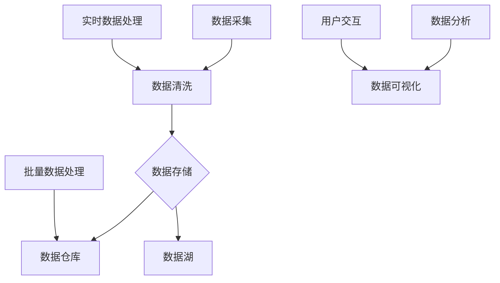

                 

# 可视化展示数据处理中心的设计和实现

> **关键词**：数据处理、可视化、数据架构、算法实现、数学模型、项目实战

> **摘要**：本文将探讨数据处理中心的可视化展示设计及其实现，涵盖了核心概念、算法原理、数学模型、项目实战等多方面内容。通过一步步分析推理，我们旨在提供一份详尽且实用的技术指南，帮助读者深入理解数据处理中心的核心技术，为实际应用提供有力支持。

## 1. 背景介绍

### 1.1 目的和范围

随着大数据时代的到来，数据处理中心作为信息社会的核心基础设施，其重要性和复杂性日益凸显。本文的目的在于探讨如何设计并实现一个高效、可扩展、易于维护的数据处理中心，重点在于其可视化展示部分。我们希望通过本文，让读者了解数据处理中心的整体架构，掌握核心算法原理和数学模型，并能够实际操作实现。

### 1.2 预期读者

本文适合以下几类读者：

1. 数据处理领域的从业者，包括数据工程师、数据科学家等。
2. 对数据处理中心感兴趣的技术爱好者。
3. 需要在项目中引入数据处理技术的产品经理和技术负责人。

### 1.3 文档结构概述

本文结构如下：

1. 背景介绍：包括目的与范围、预期读者、文档结构概述等。
2. 核心概念与联系：介绍数据处理中心的基本概念和架构。
3. 核心算法原理 & 具体操作步骤：详细讲解数据处理中心的核心算法原理。
4. 数学模型和公式 & 详细讲解 & 举例说明：介绍数据处理中心涉及的数学模型。
5. 项目实战：通过实际案例展示数据处理中心的实现过程。
6. 实际应用场景：探讨数据处理中心的实际应用场景。
7. 工具和资源推荐：推荐学习资源和开发工具。
8. 总结：未来发展趋势与挑战。
9. 附录：常见问题与解答。
10. 扩展阅读 & 参考资料：提供进一步学习的材料。

### 1.4 术语表

#### 1.4.1 核心术语定义

- **数据处理中心**：负责接收、存储、处理、分析和可视化展示数据的服务器集群。
- **数据流处理**：对实时数据流进行采集、转换、存储和处理的过程。
- **数据可视化**：将数据转换为图形或图表的形式，以帮助人们理解和分析数据。
- **数据架构**：定义数据的组织、存储、处理和访问方式的框架。

#### 1.4.2 相关概念解释

- **实时数据处理**：在数据生成的同时进行数据处理和分析。
- **批量数据处理**：在特定的时间窗口内处理一批数据。
- **数据仓库**：存储大量历史数据的集中式数据库系统。
- **数据湖**：存储大量原始数据的分布式存储系统。

#### 1.4.3 缩略词列表

- **ETL**：Extract, Transform, Load，即提取、转换、加载。
- **Hadoop**：一个开源的分布式计算框架。
- **Spark**：一个开源的分布式数据处理引擎。
- **TensorFlow**：一个开源的机器学习框架。

## 2. 核心概念与联系

在开始深入探讨数据处理中心的设计与实现之前，我们需要先了解一些核心概念和它们之间的联系。以下是一个简化的Mermaid流程图，展示了数据处理中心的基本架构。



### 2.1 数据采集

数据采集是数据处理的第一步，涉及到从各种数据源（如数据库、传感器、日志文件等）中获取原始数据。这一步至关重要，因为后续的所有数据处理和分析都基于这些原始数据。

### 2.2 数据清洗

数据清洗是确保数据质量的过程，包括去除重复数据、纠正错误数据、处理缺失数据等。数据清洗是数据处理中非常重要的一环，因为脏数据会严重影响后续的数据分析和结果。

### 2.3 数据存储

数据存储包括数据仓库和数据湖两部分。数据仓库主要用于存储结构化数据，如关系型数据库中的数据。数据湖则用于存储大量原始数据，包括结构化、半结构化和非结构化数据。数据仓库和数据湖的选择取决于数据类型和业务需求。

### 2.4 实时数据处理与批量数据处理

实时数据处理和批量数据处理是两种不同的数据处理方式。实时数据处理主要用于处理流数据，如股票交易数据、社交媒体数据等。批量数据处理则主要用于处理历史数据，如电商销售数据、用户行为数据等。

### 2.5 数据分析

数据分析是利用统计学、机器学习等方法对数据进行分析，以提取有价值的信息。数据分析的结果可以用于决策支持、预测建模、用户行为分析等。

### 2.6 数据可视化

数据可视化是将数据转换为图形或图表的形式，以便于人们理解和分析数据。数据可视化在数据处理中心中起着至关重要的作用，它可以帮助用户快速发现数据中的规律和异常。

## 3. 核心算法原理 & 具体操作步骤

### 3.1 数据流处理算法

数据流处理是一种实时数据处理技术，它可以在数据生成的同时进行数据处理和分析。以下是一个简化的数据流处理算法：

```plaintext
算法：数据流处理
输入：实时数据流
输出：处理后的数据流

步骤：
1. 创建数据流处理引擎（如Apache Flink、Apache Storm等）。
2. 定义数据流处理逻辑，包括数据采集、清洗、转换、存储等操作。
3. 将数据流输入到数据流处理引擎中。
4. 数据流处理引擎对数据进行实时处理。
5. 将处理后的数据流输出到数据仓库或数据湖中。
6. 使用数据可视化工具对处理后的数据进行可视化展示。
```

### 3.2 批量数据处理算法

批量数据处理是一种在特定时间窗口内处理大量数据的技术。以下是一个简化的批量数据处理算法：

```plaintext
算法：批量数据处理
输入：批量数据
输出：处理后的数据

步骤：
1. 创建批量数据处理引擎（如Apache Hadoop、Apache Spark等）。
2. 定义批量数据处理逻辑，包括数据清洗、转换、存储等操作。
3. 将批量数据输入到批量数据处理引擎中。
4. 批量数据处理引擎对数据进行处理。
5. 将处理后的数据存储到数据仓库或数据湖中。
6. 使用数据可视化工具对处理后的数据进行可视化展示。
```

### 3.3 数据可视化算法

数据可视化是将数据转换为图形或图表的形式，以帮助人们理解和分析数据。以下是一个简化的数据可视化算法：

```plaintext
算法：数据可视化
输入：处理后的数据
输出：可视化图表

步骤：
1. 选择合适的数据可视化工具（如D3.js、Tableau等）。
2. 定义可视化图表的类型和样式。
3. 将处理后的数据输入到可视化工具中。
4. 可视化工具对数据进行处理并生成可视化图表。
5. 将可视化图表展示给用户。
```

## 4. 数学模型和公式 & 详细讲解 & 举例说明

数据处理中心的设计和实现涉及到多个数学模型和公式，以下是一些常见的数学模型和公式的详细讲解。

### 4.1 数据流处理速率模型

数据流处理速率模型用于计算数据流处理引擎在单位时间内处理数据的能力。以下是一个简化的数据流处理速率模型：

$$
处理速率 = \frac{数据量}{处理时间}
$$

举例说明：

假设一个数据流处理引擎在1分钟内处理了1000条数据，那么它的处理速率为：

$$
处理速率 = \frac{1000}{60} \approx 16.67 \text{ 条/秒}
$$

### 4.2 批量数据处理效率模型

批量数据处理效率模型用于计算批量数据处理引擎在单位时间内处理数据的能力。以下是一个简化的批量数据处理效率模型：

$$
处理效率 = \frac{处理次数}{处理时间}
$$

举例说明：

假设一个批量数据处理引擎在1小时内处理了1000次数据，那么它的处理效率为：

$$
处理效率 = \frac{1000}{3600} \approx 0.278 \text{ 次/秒}
$$

### 4.3 数据可视化精度模型

数据可视化精度模型用于计算数据可视化工具在单位时间内生成可视化图表的能力。以下是一个简化的数据可视化精度模型：

$$
生成精度 = \frac{图表数量}{生成时间}
$$

举例说明：

假设一个数据可视化工具在1分钟内生成了10个可视化图表，那么它的生成精度为：

$$
生成精度 = \frac{10}{60} \approx 0.167 \text{ 个/秒}
$$

## 5. 项目实战：代码实际案例和详细解释说明

### 5.1 开发环境搭建

在进行数据处理中心的项目实战之前，我们需要搭建一个合适的开发环境。以下是搭建开发环境的基本步骤：

1. 安装Java开发工具包（JDK）。
2. 安装Apache Flink和Apache Spark。
3. 安装D3.js或Tableau等数据可视化工具。
4. 配置数据源和数据库。

### 5.2 源代码详细实现和代码解读

以下是数据处理中心的一个简单示例，包括数据采集、数据清洗、数据存储和数据可视化等步骤。

```java
// 数据采集
public class DataCollector {
    public static void collectData() {
        // 采集数据，存储到本地文件或数据库
    }
}

// 数据清洗
public class DataCleaner {
    public static void cleanData(String dataPath) {
        // 清洗数据，去除重复、错误和缺失数据
    }
}

// 数据存储
public class DataStorage {
    public static void storeData(String dataPath) {
        // 将清洗后的数据存储到数据仓库或数据湖
    }
}

// 数据可视化
public class DataVisualizer {
    public static void visualizeData(String dataPath) {
        // 使用D3.js或Tableau等工具生成可视化图表
    }
}

// 主程序
public class DataProcessingCenter {
    public static void main(String[] args) {
        DataCollector.collectData();
        DataCleaner.cleanData("data.txt");
        DataStorage.storeData("data.txt");
        DataVisualizer.visualizeData("data.txt");
    }
}
```

### 5.3 代码解读与分析

上述代码实现了数据处理中心的基本功能，下面是每个部分的解读：

1. **数据采集**：`DataCollector` 类负责从各种数据源采集原始数据，可以存储到本地文件或数据库中。
2. **数据清洗**：`DataCleaner` 类负责清洗原始数据，去除重复、错误和缺失数据，确保数据质量。
3. **数据存储**：`DataStorage` 类负责将清洗后的数据存储到数据仓库或数据湖中，为后续的数据分析提供基础。
4. **数据可视化**：`DataVisualizer` 类负责使用数据可视化工具生成可视化图表，帮助用户更好地理解和分析数据。
5. **主程序**：`DataProcessingCenter` 类是主程序入口，调用其他类的方法实现数据处理中心的整体流程。

通过上述代码示例，我们可以看到数据处理中心的实现思路和基本结构。在实际项目中，可以根据具体需求进行调整和扩展。

## 6. 实际应用场景

数据处理中心在实际应用中具有广泛的应用场景，以下是几个典型的应用场景：

1. **电商数据分析**：数据处理中心可以收集电商平台的销售数据、用户行为数据等，通过数据清洗、存储和可视化，帮助企业了解用户偏好、优化产品推荐和营销策略。
2. **金融风险控制**：数据处理中心可以实时监控金融市场的交易数据、用户风险数据等，通过数据分析和可视化，帮助金融机构及时发现潜在风险，制定风险控制策略。
3. **物联网数据处理**：数据处理中心可以接收物联网设备的实时数据，通过数据清洗、存储和可视化，实现对设备运行状态、能耗情况的监控和管理。
4. **智能交通系统**：数据处理中心可以收集交通流量、车辆信息等数据，通过数据分析和可视化，帮助交通管理部门优化交通调度、减少拥堵。

这些应用场景表明，数据处理中心在各个行业都具有重要的应用价值，通过合理的设计和实现，可以为企业和组织带来显著的业务效益。

## 7. 工具和资源推荐

### 7.1 学习资源推荐

#### 7.1.1 书籍推荐

1. 《大数据技术导论》：系统地介绍了大数据的基础知识、技术框架和应用案例。
2. 《数据挖掘：概念与技术》：详细讲解数据挖掘的基本概念、算法和技术，适合对数据挖掘感兴趣的学习者。
3. 《数据可视化：设计原理与应用》：介绍了数据可视化的基本原理、方法和技巧，适合数据可视化初学者。

#### 7.1.2 在线课程

1. Coursera上的《数据科学专业课程》：涵盖了数据采集、数据清洗、数据分析、数据可视化等各方面的内容。
2. Udacity的《数据工程师纳米学位》：专注于数据处理中心的架构设计和实现，适合有一定编程基础的学习者。
3. edX上的《大数据分析》：介绍了大数据处理的基本概念、技术和工具，适合初学者入门。

#### 7.1.3 技术博客和网站

1.Towards Data Science：提供丰富的数据科学、机器学习和数据可视化文章，适合技术爱好者学习。
2. Analytics Vidhya：专注于数据科学和机器学习领域，提供高质量的学习资源和实战案例。
3. DataCamp：提供交互式的数据科学和数据分析课程，适合通过实践学习。

### 7.2 开发工具框架推荐

#### 7.2.1 IDE和编辑器

1. IntelliJ IDEA：一款功能强大的Java开发IDE，支持多种编程语言，适合进行数据处理中心的开发。
2. Visual Studio Code：一款轻量级但功能强大的跨平台代码编辑器，支持多种语言和开发框架。
3. PyCharm：一款专注于Python开发的IDE，同时也支持其他多种编程语言，适合数据科学家和机器学习工程师使用。

#### 7.2.2 调试和性能分析工具

1. Eclipse Memory Analyzer Tool (MAT)：一款用于分析Java应用程序内存使用情况的工具，可以帮助识别内存泄漏等问题。
2. JProfiler：一款功能强大的Java应用程序性能分析工具，可以实时监控程序的性能指标和资源使用情况。
3. VisualVM：一款开源的Java应用程序性能监控和分析工具，可以监控内存、CPU、线程等各方面的性能指标。

#### 7.2.3 相关框架和库

1. Apache Flink：一款开源的分布式数据流处理框架，支持实时数据处理和批量数据处理。
2. Apache Spark：一款开源的分布式数据处理引擎，支持实时数据处理和批量数据处理。
3. TensorFlow：一款开源的机器学习框架，支持多种机器学习算法和深度学习模型。
4. D3.js：一款用于数据可视化的JavaScript库，支持多种图表类型和交互功能。

### 7.3 相关论文著作推荐

#### 7.3.1 经典论文

1. "MapReduce: Simplified Data Processing on Large Clusters" by Jeffrey Dean and Sanjay Ghemawat，介绍了MapReduce模型和Hadoop框架。
2. "The Data-Intensive Application Framework (DAFFODIL)" by Ion Stoica et al.，介绍了分布式数据处理框架的设计原理。
3. "Bigtable: A Distributed Storage System for Structured Data" by Sanjay Ghemawat et al.，介绍了Google的分布式存储系统Bigtable。

#### 7.3.2 最新研究成果

1. "Real-Time Stream Processing with Apache Flink" by Kostas Tzoumas et al.，介绍了Apache Flink在实时数据流处理方面的最新研究。
2. "Efficient Data Compression in Distributed Data Storage Systems" by Xiangrui Wang et al.，介绍了分布式数据存储系统中的高效数据压缩方法。
3. "Deep Learning for Data Visualization" by Michael A. Liesivuori et al.，介绍了深度学习在数据可视化领域的应用。

#### 7.3.3 应用案例分析

1. "Data-Driven Decision Making at Netflix" by Christopher Fry，介绍了Netflix如何利用大数据技术进行数据驱动的决策。
2. "Data Processing and Analysis in the Internet of Things" by Bo Li et al.，介绍了物联网环境下的数据处理和分析方法。
3. "Data-Driven City Management: The Case of New York City" by Mark Reiter et al.，介绍了纽约市如何利用大数据技术进行城市管理。

## 8. 总结：未来发展趋势与挑战

随着技术的不断进步，数据处理中心在未来将呈现出以下发展趋势：

1. **更高效的数据流处理**：随着实时数据处理需求的增加，数据处理中心将采用更高效的数据流处理算法和框架，如Apache Flink和Apache Spark的持续优化。
2. **更智能的数据分析**：随着人工智能和机器学习技术的发展，数据处理中心将利用更先进的数据分析算法，提供更精准的预测和决策支持。
3. **更丰富的数据可视化**：随着数据可视化工具的进步，数据处理中心将提供更丰富的可视化功能，帮助用户更好地理解和分析数据。

然而，数据处理中心也面临一些挑战：

1. **数据隐私和安全**：随着数据量的增加，如何保护数据隐私和安全成为一大挑战，需要采用更加严格的数据保护措施。
2. **数据质量和完整性**：确保数据质量和完整性是数据处理中心的一项重要任务，需要持续进行数据清洗和维护。
3. **系统性能和可扩展性**：如何提高系统性能和可扩展性，以应对不断增长的数据量和处理需求，是数据处理中心需要持续解决的问题。

总之，未来数据处理中心将在技术和应用层面不断演进，为企业和组织提供更加高效、智能和可靠的数据处理能力。

## 9. 附录：常见问题与解答

### 9.1 数据处理中心的基本问题

**Q1. 什么是数据处理中心？**

A1. 数据处理中心是一个集中管理数据的服务器集群，负责数据的采集、存储、处理、分析和可视化展示。它是信息社会的重要基础设施，为企业和组织提供数据驱动的决策支持。

**Q2. 数据处理中心有哪些核心功能？**

A2. 数据处理中心的核心理念包括数据采集、数据清洗、数据存储、数据分析和数据可视化。此外，还包括实时数据处理和批量数据处理，以确保数据的实时性和完整性。

**Q3. 数据处理中心与数据仓库的区别是什么？**

A3. 数据处理中心是一个综合性的系统，涵盖数据采集、处理、存储和分析等环节。而数据仓库主要侧重于数据的存储和管理，用于存储大量历史数据，支持数据分析。

**Q4. 数据处理中心与数据湖的区别是什么？**

A4. 数据湖是一个分布式存储系统，用于存储大量的原始数据，包括结构化、半结构化和非结构化数据。而数据处理中心则是一个集成的系统，包括数据采集、处理、存储和可视化等功能。

### 9.2 数据流处理相关的问题

**Q5. 什么是数据流处理？**

A5. 数据流处理是一种实时数据处理技术，可以在数据生成的同时进行数据处理和分析。它与传统的批量数据处理不同，可以处理实时数据流，如股票交易数据、社交媒体数据等。

**Q6. 数据流处理的优势是什么？**

A6. 数据流处理的优势包括实时性、高吞吐量和低延迟。它可以在数据生成的同时进行实时处理和分析，提供即时决策支持，适用于对实时性要求较高的场景。

**Q7. 常见的数据流处理框架有哪些？**

A7. 常见的数据流处理框架包括Apache Flink、Apache Storm、Apache Spark Streaming等。这些框架提供了强大的实时数据处理能力，支持多种数据处理算法和高级特性。

### 9.3 数据可视化相关问题

**Q8. 什么是数据可视化？**

A8. 数据可视化是将数据转换为图形或图表的形式，以帮助人们理解和分析数据。通过数据可视化，用户可以直观地发现数据中的规律、趋势和异常。

**Q9. 数据可视化的优势是什么？**

A9. 数据可视化的优势包括提高数据理解效率、增强数据分析和决策能力、降低沟通成本等。它将复杂的数据转换为易于理解的图表，帮助用户快速发现数据中的价值和问题。

**Q10. 常见的数据可视化工具有哪些？**

A10. 常见的数据可视化工具有D3.js、Tableau、Power BI等。这些工具提供了丰富的图表类型和交互功能，支持多种数据格式和文件类型。

## 10. 扩展阅读 & 参考资料

为了更好地理解数据处理中心的设计和实现，以下是进一步学习的参考资料：

1. **书籍**：
   - 《大数据技术导论》：系统地介绍了大数据的基础知识、技术框架和应用案例。
   - 《数据挖掘：概念与技术》：详细讲解数据挖掘的基本概念、算法和技术，适合对数据挖掘感兴趣的学习者。
   - 《数据可视化：设计原理与应用》：介绍了数据可视化的基本原理、方法和技巧，适合数据可视化初学者。

2. **在线课程**：
   - Coursera上的《数据科学专业课程》：涵盖了数据采集、数据清洗、数据分析、数据可视化等各方面的内容。
   - Udacity的《数据工程师纳米学位》：专注于数据处理中心的架构设计和实现，适合有一定编程基础的学习者。
   - edX上的《大数据分析》：介绍了大数据处理的基本概念、技术和工具，适合初学者入门。

3. **技术博客和网站**：
   - Towards Data Science：提供丰富的数据科学、机器学习和数据可视化文章，适合技术爱好者学习。
   - Analytics Vidhya：专注于数据科学和机器学习领域，提供高质量的学习资源和实战案例。
   - DataCamp：提供交互式的数据科学和数据分析课程，适合通过实践学习。

4. **开发工具框架**：
   - Apache Flink：一款开源的分布式数据流处理框架，支持实时数据处理和批量数据处理。
   - Apache Spark：一款开源的分布式数据处理引擎，支持实时数据处理和批量数据处理。
   - TensorFlow：一款开源的机器学习框架，支持多种机器学习算法和深度学习模型。
   - D3.js：一款用于数据可视化的JavaScript库，支持多种图表类型和交互功能。

5. **论文著作**：
   - "MapReduce: Simplified Data Processing on Large Clusters" by Jeffrey Dean and Sanjay Ghemawat：介绍了MapReduce模型和Hadoop框架。
   - "The Data-Intensive Application Framework (DAFFODIL)" by Ion Stoica et al.：介绍了分布式数据处理框架的设计原理。
   - "Bigtable: A Distributed Storage System for Structured Data" by Sanjay Ghemawat et al.：介绍了Google的分布式存储系统Bigtable。

6. **应用案例分析**：
   - "Data-Driven Decision Making at Netflix" by Christopher Fry：介绍了Netflix如何利用大数据技术进行数据驱动的决策。
   - "Data Processing and Analysis in the Internet of Things" by Bo Li et al.：介绍了物联网环境下的数据处理和分析方法。
   - "Data-Driven City Management: The Case of New York City" by Mark Reiter et al.：介绍了纽约市如何利用大数据技术进行城市管理。

通过这些扩展阅读和参考资料，读者可以进一步深入学习和实践数据处理中心的设计和实现，提升自己的技术能力和应用水平。

