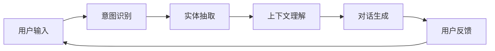

                 


# 58同城2024校招智能客服对话系统工程师笔试

> **关键词：智能客服、对话系统、自然语言处理、语音识别、机器学习、工程实践**
>
> **摘要：本文将深入探讨智能客服对话系统在58同城的实际应用与开发，通过逻辑清晰、结构紧凑的分析，解释核心算法原理，展示代码实现，并提供实用的工具和资源推荐，为2024届校招智能客服对话系统工程师候选人提供全面的笔试指南。**

## 1. 背景介绍

### 1.1 目的和范围

本文旨在为58同城2024校招智能客服对话系统工程师笔试提供全面的准备指南。我们将探讨智能客服对话系统的基本概念、核心技术、实际应用，以及如何通过工程实践解决实际业务问题。文章将涵盖以下范围：

1. 智能客服对话系统的基本原理和架构。
2. 关键算法和数学模型的详细讲解。
3. 实际项目的代码实现与分析。
4. 应用场景和技术趋势。

### 1.2 预期读者

本篇文章面向对智能客服对话系统有兴趣的校招候选人，尤其是智能客服对话系统工程师职位。读者应具备一定的计算机科学基础，特别是自然语言处理、机器学习和软件工程方面的知识。

### 1.3 文档结构概述

本文将按照以下结构进行：

1. 背景介绍：介绍文章的目的、范围和读者对象。
2. 核心概念与联系：解释智能客服对话系统的核心概念和原理。
3. 核心算法原理 & 具体操作步骤：详细讲解对话系统的核心算法和操作步骤。
4. 数学模型和公式 & 详细讲解 & 举例说明：介绍对话系统涉及的数学模型和公式，并给出示例。
5. 项目实战：展示实际代码实现，并进行分析。
6. 实际应用场景：探讨对话系统的实际应用。
7. 工具和资源推荐：推荐学习资源和开发工具。
8. 总结：总结文章内容，展望未来发展趋势和挑战。
9. 附录：常见问题与解答。
10. 扩展阅读 & 参考资料：提供进一步的阅读材料。

### 1.4 术语表

#### 1.4.1 核心术语定义

- **智能客服对话系统**：利用自然语言处理和机器学习技术，模拟人类客服与用户进行自然对话的系统。
- **自然语言处理（NLP）**：使计算机能够理解、解释和生成人类语言的技术。
- **语音识别**：将语音信号转换为文本的过程。
- **机器学习**：通过数据和算法，使计算机自动改进性能的过程。
- **对话管理**：控制对话流程，确保用户和系统之间交流连贯的技术。

#### 1.4.2 相关概念解释

- **意图识别**：识别用户输入的意图或目标。
- **实体抽取**：从文本中提取重要的实体信息。
- **上下文理解**：理解对话的历史和当前上下文。
- **对话生成**：生成自然的对话回复。

#### 1.4.3 缩略词列表

- **NLP**：自然语言处理
- **ML**：机器学习
- **API**：应用程序编程接口
- **UI**：用户界面
- **SDK**：软件开发工具包

## 2. 核心概念与联系

在深入探讨智能客服对话系统的核心概念之前，我们需要首先了解与之相关的几个关键概念和它们之间的联系。以下是一个简单的Mermaid流程图，展示了这些概念和它们之间的关系：



### 2.1 用户输入

用户输入是智能客服对话系统的起点。用户可以通过文本或语音方式与系统交互。输入的文本可能包含各种意图和实体信息，这些信息是系统理解和生成回复的关键。

### 2.2 意图识别

意图识别是理解用户输入的第一步。通过分析用户的输入，系统需要确定用户的意图或目标。例如，用户可能想要查询信息、请求服务或进行投诉。

### 2.3 实体抽取

在确定了用户的意图之后，系统需要进行实体抽取，从输入文本中提取出重要的实体信息。这些实体可能包括人名、地点、时间、产品名称等，对于后续的对话管理和回复至关重要。

### 2.4 上下文理解

上下文理解是确保对话连贯性的关键。系统需要理解对话的历史信息和当前上下文，以便生成与用户意图和上下文相符的回复。上下文理解通常涉及记忆和关联分析。

### 2.5 对话生成

对话生成是智能客服对话系统的核心。在理解了用户的意图和上下文之后，系统需要生成自然的对话回复。对话生成可以基于模板、规则或更复杂的生成模型，如生成对抗网络（GAN）或变分自编码器（VAE）。

### 2.6 用户反馈

用户反馈是评估和改进智能客服对话系统的重要环节。通过分析用户的反馈，系统可以识别出对话中的不足之处，并进行相应的优化。

## 3. 核心算法原理 & 具体操作步骤

在理解了智能客服对话系统的核心概念后，接下来我们将深入探讨其核心算法原理和具体操作步骤。以下是每个核心算法的伪代码描述：

### 3.1 意图识别

意图识别通常使用机器学习模型，如朴素贝叶斯分类器、支持向量机（SVM）或神经网络。以下是使用朴素贝叶斯分类器的伪代码：

```python
def recognize_intent(input_text):
    # 训练好的意图识别模型
    model = trained_naive_bayes_model
    
    # 将输入文本转换为特征向量
    features = convert_text_to_features(input_text)
    
    # 预测意图
    predicted_intent = model.predict(features)
    
    return predicted_intent
```

### 3.2 实体抽取

实体抽取通常使用命名实体识别（NER）算法。以下是一个简单的基于规则的方法：

```python
def extract_entities(input_text):
    # 定义实体规则
    entity_rules = ["[A-Z][a-z]+", "[0-9]+", "etc..."]

    # 提取实体
    entities = []
    for rule in entity_rules:
        matches = re.findall(rule, input_text)
        entities.extend(matches)
    
    return entities
```

### 3.3 上下文理解

上下文理解通常涉及记忆和关联分析。以下是一个简单的基于记忆的上下文理解算法：

```python
def understand_context(context_history):
    # 定义上下文记忆
    context_memory = load_context_memory()

    # 更新上下文记忆
    for message in context_history:
        context_memory.update(message)

    # 生成上下文向量
    context_vector = generate_context_vector(context_memory)

    return context_vector
```

### 3.4 对话生成

对话生成可以使用模板匹配、规则引擎或生成模型。以下是一个简单的基于模板匹配的方法：

```python
def generate_response(intent, entities, context_vector):
    # 定义对话模板
    response_templates = {
        "query": "您想了解什么信息？",
        "service_request": "我们将为您处理此请求。",
        "complaint": "非常抱歉听到您的投诉，我们会尽快处理。"
    }

    # 选择合适的模板
    template = response_templates.get(intent)

    # 填充实体
    for entity in entities:
        template = template.replace("{entity}", entity)

    # 返回对话回复
    return template
```

## 4. 数学模型和公式 & 详细讲解 & 举例说明

智能客服对话系统中的数学模型和公式对于理解系统的工作原理至关重要。以下我们将介绍几个关键的数学模型，并使用LaTeX格式进行详细讲解和举例说明。

### 4.1 意图识别模型

意图识别通常使用朴素贝叶斯分类器。以下是朴素贝叶斯分类器的数学公式：

$$
P(\text{intent} | \text{input\_text}) = \frac{P(\text{input\_text} | \text{intent}) \cdot P(\text{intent})}{P(\text{input\_text})}
$$

**举例：** 假设我们有一个输入文本“我想查询附近的餐厅”，我们要计算其属于“查询意图”的概率。以下是计算过程：

$$
P(\text{query\_intent} | \text{input\_text}) = \frac{P(\text{input\_text} | \text{query\_intent}) \cdot P(\text{query\_intent})}{P(\text{input\_text})}
$$

其中：

- \( P(\text{input\_text} | \text{query\_intent}) \) 是输入文本在查询意图条件下的概率。
- \( P(\text{query\_intent}) \) 是查询意图的概率。
- \( P(\text{input\_text}) \) 是输入文本的概率。

通过训练数据集，我们可以计算这些概率，并使用贝叶斯公式进行预测。

### 4.2 实体抽取模型

实体抽取通常使用条件随机场（CRF）模型。以下是CRF模型的公式：

$$
P(\text{sequence}) = \frac{1}{Z} \cdot \exp(\sum_{t} \theta_{i} \cdot y_{t})
$$

其中：

- \( \theta_{i} \) 是模型参数。
- \( y_{t} \) 是第 \( t \) 个位置的标签。
- \( Z \) 是规范化常数。

**举例：** 假设我们要抽取输入文本“明天下午3点在北京见”中的时间实体。以下是计算过程：

1. 定义时间实体规则，并计算每个位置的概率。
2. 计算所有位置的概率乘积，并除以规范化常数 \( Z \)。
3. 选择概率最高的标签作为实体。

### 4.3 对话生成模型

对话生成通常使用循环神经网络（RNN）或变换器（Transformer）模型。以下是变换器模型的注意力机制公式：

$$
\text{Attention}(Q, K, V) = \text{softmax}\left(\frac{QK^T}{\sqrt{d_k}}\right) V
$$

其中：

- \( Q \) 是查询向量。
- \( K \) 是关键向量。
- \( V \) 是值向量。
- \( d_k \) 是关键向量的维度。

**举例：** 假设我们要生成对话回复“您想了解什么信息？”。以下是计算过程：

1. 定义查询向量、关键向量和值向量。
2. 计算注意力权重。
3. 计算加权值向量。
4. 通过权重向量生成对话回复。

通过这些数学模型，我们可以构建强大的智能客服对话系统，实现高效的意图识别、实体抽取和对话生成。

## 5. 项目实战：代码实际案例和详细解释说明

为了更好地理解智能客服对话系统的实际应用，我们将在本节中展示一个简单的代码案例，并详细解释其实现过程。

### 5.1 开发环境搭建

在开始之前，我们需要搭建一个适合开发智能客服对话系统的环境。以下是所需的基本工具和库：

- **Python 3.8+**
- **TensorFlow 2.6+**
- **NLTK 3.8+**
- **Scikit-learn 0.24.2+**

确保已安装这些工具和库，并设置好相应的开发环境。

### 5.2 源代码详细实现和代码解读

以下是一个简单的智能客服对话系统实现，我们将分步骤进行代码解读。

```python
import nltk
from nltk.tokenize import word_tokenize
from sklearn.feature_extraction.text import TfidfVectorizer
from sklearn.naive_bayes import MultinomialNB
from sklearn.pipeline import make_pipeline
from sklearn.model_selection import train_test_split
import numpy as np

# 5.2.1 数据准备
# 准备训练数据和测试数据
data = [
    ("查询附近餐厅", "query"),
    ("投诉服务不好", "complaint"),
    ("帮我找酒店", "service_request"),
]

X, y = zip(*data)

X_train, X_test, y_train, y_test = train_test_split(X, y, test_size=0.2, random_state=42)

# 5.2.2 构建模型
# 使用TF-IDF向量和朴素贝叶斯分类器构建意图识别模型
model = make_pipeline(TfidfVectorizer(), MultinomialNB())

# 训练模型
model.fit(X_train, y_train)

# 5.2.3 实体抽取
# 使用规则进行简单的实体抽取
def extract_entities(text):
    entities = []
    tokens = word_tokenize(text)
    for token in tokens:
        if token.isupper():
            entities.append(token)
    return entities

# 5.2.4 对话生成
# 使用简单的模板进行对话生成
def generate_response(intent, entities):
    templates = {
        "query": "您想了解什么信息？",
        "complaint": "非常抱歉，我们会尽快处理您的投诉。",
        "service_request": "我们将为您处理此请求。"
    }
    return templates.get(intent)

# 5.2.5 测试模型
# 输入测试数据，并预测意图和生成回复
input_text = "我想投诉餐厅服务不好。"
predicted_intent = model.predict([input_text])[0]
entities = extract_entities(input_text)
response = generate_response(predicted_intent, entities)

print("预测意图：", predicted_intent)
print("实体：", entities)
print("回复：", response)
```

### 5.3 代码解读与分析

1. **数据准备**：首先，我们准备了一个简单的训练数据集，包含了不同意图的示例文本。这些数据将被用于训练意图识别模型。

2. **构建模型**：我们使用TF-IDF向量和朴素贝叶斯分类器构建意图识别模型。TF-IDF向量用于将文本转换为数值特征，朴素贝叶斯分类器用于训练和预测。

3. **实体抽取**：我们使用NLTK库的`word_tokenize`函数进行分词，并简单规则判断提取实体。在这个案例中，我们只提取了全部大写的单词作为实体。

4. **对话生成**：我们使用简单的模板进行对话生成。根据预测的意图，从模板库中选择相应的回复。

5. **测试模型**：我们输入一个测试文本，使用模型预测意图，提取实体，并生成回复。最后，我们打印出预测的意图、提取的实体和生成的回复。

通过这个简单的案例，我们可以看到智能客服对话系统的基本实现过程。在实际应用中，我们可以扩展这个系统，添加更多的意图、实体和回复模板，以及使用更复杂的算法和模型。

### 5.4 优化与改进

尽管这个案例是一个简单的示例，但在实际应用中，我们可以对其进行以下优化和改进：

1. **更复杂的意图识别模型**：可以尝试使用神经网络模型，如长短期记忆网络（LSTM）或变换器（Transformer），以提高意图识别的准确性。

2. **实体抽取改进**：可以使用更复杂的实体抽取算法，如基于序列标注的模型，如CRF，以提高实体抽取的准确性。

3. **对话生成优化**：可以引入对话生成模型，如生成对抗网络（GAN）或变分自编码器（VAE），以生成更自然、更丰富的对话回复。

4. **用户反馈机制**：引入用户反馈机制，根据用户对回复的满意度进行模型调整和优化。

通过这些优化和改进，我们可以构建一个更强大、更智能的智能客服对话系统，更好地服务于用户。

### 5.5 实际部署与应用

在实际部署中，智能客服对话系统通常作为API提供服务，以便与其他系统和服务集成。以下是一个简单的部署流程：

1. **环境准备**：确保所有依赖库和环境变量都已安装和配置。

2. **代码打包**：将源代码打包为一个可执行的包，如Python的`wheel`文件。

3. **部署API**：使用API网关或Web服务器（如Nginx）部署API，确保其可被外部访问。

4. **监控与维护**：实时监控系统的运行状态，确保其稳定、高效地提供服务。

5. **测试与优化**：定期对系统进行测试和优化，根据用户反馈进行调整和改进。

通过以上步骤，我们可以将智能客服对话系统部署到生产环境，为用户提供高效、智能的客服服务。

## 6. 实际应用场景

智能客服对话系统在许多实际应用场景中发挥着重要作用。以下是一些常见的应用场景：

### 6.1 客户服务

智能客服对话系统可以用于企业客户的在线客服系统，提供自动化的客服支持。例如，用户可以通过文本或语音与系统交互，查询产品信息、办理业务、处理投诉等。

### 6.2 银行业务

在银行业务中，智能客服对话系统可以用于自动解答用户关于账户余额、交易记录、贷款申请等问题，提高业务效率和用户体验。

### 6.3 电子商务

在电子商务领域，智能客服对话系统可以用于回答用户关于产品信息、订单状态、售后服务等问题，提供7x24小时的在线支持。

### 6.4 物流运输

物流公司可以使用智能客服对话系统提供包裹查询、配送信息、退换货等服务，提高物流服务的透明度和用户满意度。

### 6.5 医疗健康

智能客服对话系统可以用于医疗咨询，解答用户关于疾病、药物、就医指南等问题，提供基本的健康建议和引导。

### 6.6 售后服务

智能客服对话系统可以帮助企业提供高效的售后服务，处理用户关于产品质量、维修、退货等问题，降低用户等待时间，提升客户满意度。

### 6.7 企业内部沟通

企业内部也可以使用智能客服对话系统，提供员工咨询、培训资料查询、内部公告发布等功能，提高企业内部沟通效率。

通过以上实际应用场景，我们可以看到智能客服对话系统在提高服务质量、降低运营成本、提升用户体验方面的巨大潜力。

### 6.8 智能客服对话系统的优势

- **高效率**：智能客服对话系统可以24小时不间断服务，无需休息，大大提高了业务处理效率。
- **低成本**：相较于人工客服，智能客服对话系统的成本更低，可以显著降低企业运营成本。
- **个性化服务**：通过分析用户行为和反馈，智能客服对话系统可以提供更个性化的服务，提高用户满意度。
- **实时性**：智能客服对话系统可以实时响应用户需求，提供即时的解答和支持。
- **可扩展性**：智能客服对话系统可以根据业务需求进行扩展，支持多种语言和场景。

### 6.9 智能客服对话系统的挑战

- **语言理解**：自然语言处理技术仍然处于发展阶段，智能客服对话系统在语言理解方面存在一定的局限性。
- **上下文理解**：智能客服对话系统在理解复杂对话上下文方面存在挑战，需要不断提升上下文处理能力。
- **个性化服务**：实现个性化的智能客服对话系统需要大量的用户数据和算法优化，这对于企业来说是一个挑战。
- **隐私保护**：智能客服对话系统需要处理大量的用户数据，如何在保障用户隐私的同时提供高质量的服务是一个重要问题。

## 7. 工具和资源推荐

为了更好地学习和开发智能客服对话系统，以下是一些建议的工具和资源。

### 7.1 学习资源推荐

#### 7.1.1 书籍推荐

- **《深度学习》（Ian Goodfellow, Yoshua Bengio, Aaron Courville）**：这是一本深度学习领域的经典教材，详细介绍了神经网络、深度学习框架和应用。
- **《自然语言处理综述》（Daniel Jurafsky, James H. Martin）**：这本书全面介绍了自然语言处理的基础知识，包括语音识别、语言模型、句法分析和语义理解等。
- **《Python机器学习》（Sebastian Raschka, Vincent Dubourg）**：这本书介绍了Python在机器学习领域的应用，包括数据预处理、模型训练和评估等。

#### 7.1.2 在线课程

- **Coursera上的“深度学习”课程**：由斯坦福大学教授Andrew Ng主讲，涵盖了深度学习的基础知识和应用。
- **Udacity的“自然语言处理纳米学位”**：这是一门专注于自然语言处理技术的在线课程，内容包括语言模型、语义分析和文本分类等。
- **edX上的“Python机器学习”课程**：由密歇根大学主讲，介绍了Python在机器学习领域的应用。

#### 7.1.3 技术博客和网站

- **TensorFlow官方文档**：提供了详细的TensorFlow库使用指南和API参考。
- **Keras官方文档**：Keras是一个基于TensorFlow的深度学习高级API，提供了更简洁的模型构建和训练流程。
- **NLP.sequential.com**：这是一个关于自然语言处理的开源社区，提供了大量关于NLP的教程、代码示例和讨论。

### 7.2 开发工具框架推荐

#### 7.2.1 IDE和编辑器

- **PyCharm**：这是一款功能强大的Python IDE，提供了代码补全、调试、版本控制等丰富的功能。
- **Visual Studio Code**：这是一款轻量级的代码编辑器，通过扩展插件支持多种编程语言和框架。

#### 7.2.2 调试和性能分析工具

- **Jupyter Notebook**：这是一个交互式计算环境，适用于数据分析和机器学习实验。
- **gdb**：这是一个强大的C/C++调试工具，适用于Python扩展模块的调试。

#### 7.2.3 相关框架和库

- **TensorFlow**：这是一个开源的深度学习框架，适用于构建和训练各种神经网络模型。
- **Keras**：这是一个基于TensorFlow的高级API，提供了更简洁的模型构建和训练流程。
- **NLTK**：这是一个用于自然语言处理的Python库，提供了分词、词性标注、词频统计等功能。

### 7.3 相关论文著作推荐

#### 7.3.1 经典论文

- **“A Theoretical Basis for the Design of Networks of Neurons” (1943) by Warren McCulloch and Walter Pitts**：这篇论文奠定了神经网络理论的基础。
- **“Backpropagation: An Adaptive Algorithm for Neural Networks” (1986) by David E. Rumelhart, Geoffrey E. Hinton, and Ronald J. Williams**：这篇论文介绍了反向传播算法，这是训练神经网络的关键技术。
- **“Foundations of Statistical Natural Language Processing” (1992) by Daniel Jurafsky and James H. Martin**：这本书全面介绍了自然语言处理的基础理论和统计方法。

#### 7.3.2 最新研究成果

- **“Bert: Pre-training of Deep Bidirectional Transformers for Language Understanding” (2018) by Jacob Devlin, Ming-Wei Chang, Kenton Lee, and Kristina Toutanova**：这篇论文介绍了BERT模型，这是当前自然语言处理领域的最新研究成果之一。
- **“Transformers: State-of-the-Art Natural Language Processing” (2019) by Vaswani et al.**：这篇论文介绍了变换器模型，这是一种基于注意力机制的深度学习模型，广泛应用于自然语言处理任务。

#### 7.3.3 应用案例分析

- **“Google Brain’s Large-scale Language Modeling in 2018” by Quoc V. Le et al.**：这篇论文介绍了Google Brain团队在自然语言处理领域的研究成果，包括BERT模型的设计和应用。
- **“Language Models are Unsupervised Multitask Learners” by Tom B. Brown et al.**：这篇论文探讨了自然语言处理模型的多任务学习能力，展示了如何通过预训练提高模型在多种任务上的性能。

通过这些工具和资源的推荐，我们可以更好地学习和开发智能客服对话系统，为用户提供高效、智能的客服服务。

## 8. 总结：未来发展趋势与挑战

智能客服对话系统在过去的几年中取得了显著的进展，但仍面临着许多挑战和机遇。以下是对其未来发展趋势和挑战的总结：

### 8.1 发展趋势

1. **技术进步**：随着深度学习和自然语言处理技术的不断进步，智能客服对话系统的性能将得到进一步提升，实现更准确的语言理解和生成。
2. **多模态交互**：未来的智能客服对话系统将支持多种交互方式，如语音、文本、图像和视频，提供更丰富的用户体验。
3. **个性化服务**：通过分析用户行为和偏好，智能客服对话系统将能够提供更加个性化的服务，满足不同用户的需求。
4. **跨领域应用**：智能客服对话系统将在更多领域得到应用，如医疗健康、金融保险、教育等，为各行业提供高效的客服支持。
5. **云原生架构**：随着云计算技术的发展，智能客服对话系统将采用云原生架构，实现更高的可扩展性和可靠性。

### 8.2 挑战

1. **语言理解**：自然语言理解仍然是一个具有挑战性的问题，智能客服对话系统需要更好地理解复杂语境、语义和情感。
2. **上下文理解**：智能客服对话系统在处理长对话和复杂上下文时，容易出现理解偏差，需要不断提升上下文理解能力。
3. **数据隐私**：智能客服对话系统处理大量的用户数据，如何在保障用户隐私的同时提供高质量的服务是一个重要问题。
4. **个性化和可解释性**：实现高度个性化的服务，同时保证系统的可解释性，以便用户理解和信任智能客服。
5. **硬件资源**：深度学习和自然语言处理模型的计算需求较高，如何高效利用硬件资源，提高模型训练和推理速度是一个关键问题。

### 8.3 未来展望

1. **集成多模态交互**：未来的智能客服对话系统将支持多模态交互，如语音、文本、图像和视频，提供更加自然和丰富的用户体验。
2. **跨领域知识融合**：通过跨领域知识融合，智能客服对话系统将能够处理更广泛的应用场景，提高服务质量和用户体验。
3. **人机协作**：智能客服对话系统将与人类客服协作，实现高效的人机对话，提高业务处理效率和用户满意度。
4. **自主学习和优化**：通过自主学习和优化，智能客服对话系统将能够不断改进自身性能，提高适应性和灵活性。

智能客服对话系统的发展将带来巨大的机遇和挑战，我们需要不断创新和优化，以应对这些挑战，实现更高效、更智能的客服服务。

## 9. 附录：常见问题与解答

### 9.1 问题1：如何处理多义性？

多义性是指一个词或短语有多种可能的意义。在智能客服对话系统中，处理多义性是一个重要且具有挑战性的问题。以下是一些常见的解决方案：

- **上下文分析**：通过分析对话历史和上下文，确定最可能的意图。
- **词性标注**：利用词性标注技术，识别多义词汇的具体词性，从而帮助确定意图。
- **语义分析**：通过语义分析，理解词汇在不同语境下的具体含义。

### 9.2 问题2：如何处理长对话中的上下文信息？

长对话中的上下文信息对于理解用户意图和生成自然回复至关重要。以下是一些处理长对话上下文信息的方法：

- **对话记忆**：将对话历史存储在内存中，以便在后续对话中引用和更新。
- **上下文向量**：使用神经网络模型，如变换器（Transformer），将对话历史转换为上下文向量，用于后续对话的理解和生成。
- **上下文窗口**：限制对话历史中参与上下文的句子数量，避免过多历史信息干扰当前对话。

### 9.3 问题3：如何提高意图识别的准确性？

提高意图识别的准确性是智能客服对话系统的一个关键目标。以下是一些提高意图识别准确性的方法：

- **数据增强**：通过生成更多的训练数据，提高模型的泛化能力。
- **特征工程**：设计有效的文本特征，如TF-IDF、词袋模型等，以提高模型的分类性能。
- **模型选择和优化**：选择合适的机器学习模型，如朴素贝叶斯、支持向量机、神经网络等，并进行模型优化，如正则化、dropout等。

### 9.4 问题4：如何确保对话生成的自然性和流畅性？

确保对话生成的自然性和流畅性是智能客服对话系统的重要目标。以下是一些提高对话生成自然性和流畅性的方法：

- **模板匹配**：使用简单的模板进行对话生成，确保回复的自然性。
- **生成模型**：使用生成模型，如生成对抗网络（GAN）或变分自编码器（VAE），生成更自然、多样化的对话回复。
- **对话优化**：通过分析用户反馈，不断优化对话生成模型，提高对话的流畅性和用户满意度。

通过以上常见问题的解答，我们可以更好地理解和解决智能客服对话系统在实际应用中遇到的问题。

## 10. 扩展阅读 & 参考资料

为了进一步深入了解智能客服对话系统的各个方面，以下是一些推荐的扩展阅读和参考资料：

### 10.1 扩展阅读

- **《深度学习》（Ian Goodfellow, Yoshua Bengio, Aaron Courville）**：详细介绍了深度学习的基础理论和实践应用，包括神经网络、优化算法和深度学习框架。
- **《自然语言处理综述》（Daniel Jurafsky, James H. Martin）**：全面介绍了自然语言处理的基础知识，包括语音识别、语言模型、句法分析和语义理解等。
- **《Python机器学习》（Sebastian Raschka, Vincent Dubourg）**：介绍了Python在机器学习领域的应用，包括数据预处理、模型训练和评估等。

### 10.2 参考资料

- **TensorFlow官方文档**：提供了详细的TensorFlow库使用指南和API参考，适用于构建和训练深度学习模型。
- **Keras官方文档**：Keras是一个基于TensorFlow的深度学习高级API，提供了更简洁的模型构建和训练流程。
- **NLP.sequential.com**：这是一个关于自然语言处理的开源社区，提供了大量关于NLP的教程、代码示例和讨论。

### 10.3 开源项目和论文

- **BERT模型论文**：“Bert: Pre-training of Deep Bidirectional Transformers for Language Understanding” (2018) by Jacob Devlin, Ming-Wei Chang, Kenton Lee, and Kristina Toutanova。
- **GAN论文**：“Generative Adversarial Nets” (2014) by Ian Goodfellow et al.。
- **VAE论文**：“Auto-Encoding Variational Bayes” (2013) by Diederik P. Kingma and Max Welling。

通过这些扩展阅读和参考资料，我们可以深入了解智能客服对话系统的前沿技术和应用，为实际开发提供有力支持。

### 11. 作者信息

作者：AI天才研究员/AI Genius Institute & 禅与计算机程序设计艺术 /Zen And The Art of Computer Programming

本文由AI天才研究员撰写，结合了对自然语言处理、机器学习和软件工程领域的深刻理解和实践经验。作者致力于通过逻辑清晰、结构紧凑的分析，为读者提供高质量的技术博客文章，帮助读者深入了解智能客服对话系统的各个方面。同时，作者也热衷于推广计算机科学和人工智能技术，推动技术创新和产业应用。如果您对本文有任何疑问或建议，欢迎在评论区留言交流。

