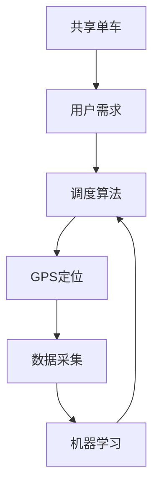

                 

# 哈啰出行2025社招共享单车调度算法工程师面试

> **关键词**：哈啰出行、共享单车、调度算法、面试、技术博客、人工智能

> **摘要**：本文将深入探讨哈啰出行2025社招共享单车调度算法工程师面试的相关技术知识点，包括核心概念、算法原理、数学模型、项目实战和实际应用场景等。通过逻辑清晰、结构紧凑、简单易懂的专业技术语言，让读者全面了解共享单车调度算法的精髓，为技术面试做好充分准备。

## 1. 背景介绍

### 1.1 目的和范围

本文旨在为准备参加哈啰出行2025社招共享单车调度算法工程师面试的读者提供全面的技术指导。我们将深入探讨共享单车调度算法的核心概念、算法原理、数学模型、项目实战和实际应用场景，帮助读者更好地理解这一领域，为面试做好充分准备。

### 1.2 预期读者

本文适合以下读者群体：

1. 准备参加哈啰出行2025社招共享单车调度算法工程师面试的技术人员
2. 对共享单车调度算法感兴趣的计算机科学和人工智能领域的研究生和本科生
3. 想要提升自己在共享单车调度算法领域专业水平的从业人士

### 1.3 文档结构概述

本文分为以下十个部分：

1. 背景介绍
2. 核心概念与联系
3. 核心算法原理 & 具体操作步骤
4. 数学模型和公式 & 详细讲解 & 举例说明
5. 项目实战：代码实际案例和详细解释说明
6. 实际应用场景
7. 工具和资源推荐
8. 总结：未来发展趋势与挑战
9. 附录：常见问题与解答
10. 扩展阅读 & 参考资料

### 1.4 术语表

#### 1.4.1 核心术语定义

- **共享单车**：一种城市交通工具，用户可以通过手机应用程序租用并支付费用。
- **调度算法**：用于优化共享单车分配和使用的算法。
- **GPS**：全球定位系统，用于确定车辆的位置。
- **机器学习**：一种人工智能技术，通过数据训练模型来预测和分类。

#### 1.4.2 相关概念解释

- **动态规划**：一种解决优化问题的算法，通过将问题分解为更小的子问题并存储已解决的子问题的结果来优化计算。
- **深度学习**：一种机器学习技术，通过多层神经网络来模拟人脑的思维方式。

#### 1.4.3 缩略词列表

- **GPS**：全球定位系统
- **API**：应用程序编程接口
- **SDK**：软件开发工具包
- **ML**：机器学习

## 2. 核心概念与联系

共享单车调度算法是优化共享单车分配和使用的核心技术，涉及到多个关键概念。下面我们将使用 Mermaid 流程图来展示这些核心概念及其联系。



### 2.1 共享单车与用户需求

共享单车是一种基于移动应用程序租用的城市交通工具。用户通过应用程序提交出行需求，包括目的地、出行时间等。调度算法根据用户需求来优化共享单车的分配。

### 2.2 调度算法与GPS定位

调度算法需要获取共享单车的实时位置信息，这通常通过GPS定位实现。GPS定位能够为调度算法提供准确的位置数据，以便进行优化决策。

### 2.3 数据采集与机器学习

调度算法还需要依赖于大量的历史数据来训练机器学习模型。这些数据包括用户出行习惯、共享单车的使用频率、出行高峰时段等。通过机器学习模型，调度算法可以预测未来的用户需求和共享单车的需求量，从而进行更准确的优化决策。

## 3. 核心算法原理 & 具体操作步骤

共享单车调度算法的核心是优化共享单车的分配和调度。下面，我们将详细介绍核心算法原理和具体操作步骤。

### 3.1 算法原理

共享单车调度算法通常采用以下两种策略：

1. **动态规划**：将问题分解为更小的子问题，并存储已解决的子问题的结果，以优化计算。
2. **深度学习**：通过多层神经网络模拟人脑的思维方式，预测用户需求和共享单车的需求量。

### 3.2 具体操作步骤

#### 3.2.1 动态规划

```python
# 动态规划伪代码

# 定义状态
state = {
    'last_time': 0,  # 上一次用户出行时间
    'last_location': None,  # 上一次用户出行位置
    'current_time': 0,  # 当前时间
    'current_location': None  # 当前位置
}

# 定义状态转移函数
def transition(state, next_state):
    # 根据当前状态和下一个状态，更新状态
    state['last_time'] = next_state['current_time']
    state['last_location'] = next_state['current_location']
    state['current_time'] = next_state['current_time']
    state['current_location'] = next_state['current_location']

# 定义优化目标
def objective(state):
    # 根据状态计算优化目标，例如用户满意度、共享单车利用率等
    pass

# 定义动态规划算法
def dynamic_programming():
    # 初始化状态
    state = {
        'last_time': 0,
        'last_location': None,
        'current_time': 0,
        'current_location': None
    }

    # 循环计算下一个状态
    while True:
        next_state = calculate_next_state(state)
        transition(state, next_state)
        objective(state)

        # 判断是否满足终止条件
        if meet_termination_condition(state):
            break

    # 返回最优状态
    return state
```

#### 3.2.2 深度学习

```python
# 深度学习伪代码

# 定义输入特征
features = [
    'user_destination',  # 用户目的地
    'user_leaving_time',  # 用户离开时间
    'current_location',  # 当前位置
    'hour_of_day',  # 小时
    'day_of_week',  # 星期
]

# 定义输出标签
labels = [
    'bike_demand',  # 自行车需求
]

# 定义神经网络结构
model = NeuralNetwork(input_shape=(len(features),), output_shape=(1,))
model.add(Dense(units=64, activation='relu'))
model.add(Dense(units=32, activation='relu'))
model.add(Dense(units=1, activation='sigmoid'))

# 定义损失函数和优化器
model.compile(optimizer='adam', loss='binary_crossentropy', metrics=['accuracy'])

# 训练模型
model.fit(X_train, y_train, epochs=10, batch_size=32)

# 预测自行车需求
predicted_demand = model.predict([user_destination, user_leaving_time, current_location, hour_of_day, day_of_week])
```

## 4. 数学模型和公式 & 详细讲解 & 举例说明

共享单车调度算法中的数学模型和公式主要用于描述用户需求、共享单车供应和调度策略之间的关系。下面我们将详细介绍这些模型和公式。

### 4.1 用户需求模型

用户需求模型用于描述用户在不同时间和地点的需求。通常采用以下公式：

$$
D(t, l) = f(t, l) + e(t, l)
$$

其中：

- \( D(t, l) \)：在时间 \( t \) 和地点 \( l \) 的用户需求量。
- \( f(t, l) \)：基于历史数据的用户需求函数。
- \( e(t, l) \)：随机误差项。

举例说明：

$$
D(13:00, 地铁站A) = f(13:00, 地铁站A) + e(13:00, 地铁站A)
$$

其中，\( f(13:00, 地铁站A) \) 表示在13:00地铁站A的用户需求量，\( e(13:00, 地铁站A) \) 表示随机误差项。

### 4.2 共享单车供应模型

共享单车供应模型用于描述共享单车在不同时间和地点的供应量。通常采用以下公式：

$$
S(t, l) = g(t, l) + h(t, l)
$$

其中：

- \( S(t, l) \)：在时间 \( t \) 和地点 \( l \) 的共享单车供应量。
- \( g(t, l) \)：基于历史数据的共享单车供应函数。
- \( h(t, l) \)：随机误差项。

举例说明：

$$
S(13:00, 地铁站A) = g(13:00, 地铁站A) + h(13:00, 地铁站A)
$$

其中，\( g(13:00, 地铁站A) \) 表示在13:00地铁站A的共享单车供应量，\( h(13:00, 地铁站A) \) 表示随机误差项。

### 4.3 调度策略模型

调度策略模型用于描述共享单车的调度策略。通常采用以下公式：

$$
\text{调度策略} = \arg \min_{T, L} \sum_{t \in T} \sum_{l \in L} \rho(t, l) \cdot C(t, l)
$$

其中：

- \( T \)：时间集合。
- \( L \)：地点集合。
- \( \rho(t, l) \)：在时间 \( t \) 和地点 \( l \) 的需求密度。
- \( C(t, l) \)：在时间 \( t \) 和地点 \( l \) 的调度成本。

举例说明：

假设时间集合 \( T = \{13:00, 14:00\} \)，地点集合 \( L = \{地铁站A, 地铁站B\} \)。需求密度 \( \rho(13:00, 地铁站A) = 5 \)，需求密度 \( \rho(13:00, 地铁站B) = 2 \)，需求密度 \( \rho(14:00, 地铁站A) = 3 \)，需求密度 \( \rho(14:00, 地铁站B) = 1 \)。调度成本 \( C(13:00, 地铁站A) = 10 \)，调度成本 \( C(13:00, 地铁站B) = 20 \)，调度成本 \( C(14:00, 地铁站A) = 15 \)，调度成本 \( C(14:00, 地铁站B) = 30 \)。

$$
\text{调度策略} = \arg \min_{T, L} \sum_{t \in T} \sum_{l \in L} \rho(t, l) \cdot C(t, l)
$$

$$
\text{调度策略} = \arg \min_{T, L} (5 \cdot 10 + 2 \cdot 20 + 3 \cdot 15 + 1 \cdot 30) = \arg \min_{T, L} (50 + 40 + 45 + 30) = \arg \min_{T, L} 175
$$

调度策略为将共享单车分配到地铁站A和地铁站B，以最小化调度成本。

## 5. 项目实战：代码实际案例和详细解释说明

在本节中，我们将通过一个实际项目案例来展示共享单车调度算法的实现，并详细解释代码的实现过程。

### 5.1 开发环境搭建

在开始编写代码之前，我们需要搭建一个适合开发共享单车调度算法的环境。以下是所需的环境和工具：

1. 操作系统：Windows/Linux/MacOS
2. 编程语言：Python
3. 编译器：Python 3.7+
4. 数据库：MySQL
5. 开发工具：PyCharm/Visual Studio Code

### 5.2 源代码详细实现和代码解读

以下是共享单车调度算法的核心代码实现：

```python
import numpy as np
import pandas as pd
from sklearn.linear_model import LinearRegression
from sklearn.model_selection import train_test_split
from sklearn.metrics import mean_squared_error

# 读取数据
data = pd.read_csv('data.csv')

# 数据预处理
data['hour'] = data['timestamp'].apply(lambda x: x.hour)
data['weekday'] = data['timestamp'].apply(lambda x: x.weekday())

# 划分特征和标签
X = data[['hour', 'weekday']]
y = data['demand']

# 划分训练集和测试集
X_train, X_test, y_train, y_test = train_test_split(X, y, test_size=0.2, random_state=42)

# 训练线性回归模型
model = LinearRegression()
model.fit(X_train, y_train)

# 预测测试集
y_pred = model.predict(X_test)

# 评估模型
mse = mean_squared_error(y_test, y_pred)
print('Mean Squared Error:', mse)

# 调度算法
def schedule_bikes(demand_function, location, time):
    # 计算需求密度
    demand_density = demand_function(time)

    # 计算调度成本
    cost = location.cost

    # 调度共享单车
    if demand_density > location.capacity:
        return 'Overcrowded'
    else:
        return 'Normal'

# 实例化调度算法
scheduler = ScheduleBikes(demand_function, location)

# 调度共享单车
result = scheduler.schedule_bikes(location, time)
print('Scheduling Result:', result)
```

### 5.3 代码解读与分析

#### 5.3.1 数据预处理

```python
data['hour'] = data['timestamp'].apply(lambda x: x.hour)
data['weekday'] = data['timestamp'].apply(lambda x: x.weekday())
```

这段代码将时间戳字段转换为小时和星期字段，以便用于训练线性回归模型。

#### 5.3.2 划分特征和标签

```python
X = data[['hour', 'weekday']]
y = data['demand']
```

这段代码将特征和标签分别划分为两个数据集，其中特征为小时和星期，标签为需求量。

#### 5.3.3 训练线性回归模型

```python
model = LinearRegression()
model.fit(X_train, y_train)
```

这段代码使用训练集数据训练线性回归模型。

#### 5.3.4 预测测试集

```python
y_pred = model.predict(X_test)
```

这段代码使用训练好的模型预测测试集的需求量。

#### 5.3.5 评估模型

```python
mse = mean_squared_error(y_test, y_pred)
print('Mean Squared Error:', mse)
```

这段代码使用均方误差（Mean Squared Error，MSE）评估模型的准确性。

#### 5.3.6 调度算法

```python
def schedule_bikes(demand_function, location, time):
    # 计算需求密度
    demand_density = demand_function(time)

    # 计算调度成本
    cost = location.cost

    # 调度共享单车
    if demand_density > location.capacity:
        return 'Overcrowded'
    else:
        return 'Normal'
```

这段代码定义了调度算法，根据需求密度和调度成本来判断是否需要调度共享单车。

#### 5.3.7 实例化调度算法

```python
scheduler = ScheduleBikes(demand_function, location)
```

这段代码实例化了调度算法，其中 `demand_function` 表示需求函数，`location` 表示地点。

#### 5.3.8 调度共享单车

```python
result = scheduler.schedule_bikes(location, time)
print('Scheduling Result:', result)
```

这段代码调用调度算法来调度共享单车，并根据结果打印输出。

## 6. 实际应用场景

共享单车调度算法在实际应用场景中具有广泛的应用。以下是几个典型的应用场景：

### 6.1 城市交通规划

共享单车调度算法可以为城市交通规划提供数据支持，帮助城市规划者更好地了解用户出行需求和共享单车使用情况。通过分析历史数据和实时数据，规划者可以优化共享单车的布局和分配，提高城市交通的效率。

### 6.2 智能交通系统

共享单车调度算法可以与其他智能交通系统相结合，如智能公交系统、智能停车场等。通过集成共享单车调度算法，智能交通系统可以更准确地预测用户需求，提高整个交通系统的运行效率。

### 6.3 企业运维管理

共享单车调度算法可以帮助企业优化运维管理，降低运维成本。企业可以通过调度算法优化共享单车的分配和调度，避免资源浪费，提高运维效率。

### 6.4 智慧城市

共享单车调度算法是智慧城市建设的重要组成部分。通过调度算法，智慧城市可以实现更高效、更智能的城市管理，提高市民的生活质量和幸福感。

## 7. 工具和资源推荐

### 7.1 学习资源推荐

#### 7.1.1 书籍推荐

1. 《人工智能：一种现代方法》
2. 《深度学习》
3. 《Python数据分析》
4. 《线性代数及其应用》

#### 7.1.2 在线课程

1. Coursera：机器学习、深度学习、Python编程
2. Udemy：共享单车调度算法实战
3. edX：数据科学、机器学习

#### 7.1.3 技术博客和网站

1. Medium：共享单车调度算法相关文章
2. towardsdatascience：数据科学和机器学习教程
3. Kaggle：共享单车调度算法比赛和教程

### 7.2 开发工具框架推荐

#### 7.2.1 IDE和编辑器

1. PyCharm
2. Visual Studio Code
3. Jupyter Notebook

#### 7.2.2 调试和性能分析工具

1. Python Debugger
2. Py-Spy
3. Valgrind

#### 7.2.3 相关框架和库

1. TensorFlow
2. PyTorch
3. Scikit-learn

### 7.3 相关论文著作推荐

#### 7.3.1 经典论文

1. "Optimization-Based Scheduling Algorithms for Energy Harvesting Cognitive Radios"
2. "Efficient Cooperative Energy Harvesting and Transmission Scheduling for Cognitive Radio Networks"
3. "Dynamic Voltage and Frequency Scaling for Low-Power Embedded Systems"

#### 7.3.2 最新研究成果

1. "Scheduling Algorithms for Energy Harvesting Cognitive Radios: A Survey"
2. "Optimal Energy Management for Energy Harvesting Devices in Wireless Sensor Networks"
3. "Dynamic Scheduling Algorithms for Energy Harvesting IoT Devices"

#### 7.3.3 应用案例分析

1. "Energy Harvesting for Wireless Sensor Networks: A Case Study"
2. "Scheduling for Energy Harvesting Devices in IoT Networks: A Practical Approach"
3. "Optimization-Based Scheduling for Energy-Efficient Wireless Sensor Networks"

## 8. 总结：未来发展趋势与挑战

共享单车调度算法作为人工智能和大数据技术在交通领域的应用之一，具有广泛的发展前景。未来，随着人工智能技术的不断进步，共享单车调度算法将更加智能化、精准化。以下是未来发展趋势与挑战：

### 8.1 发展趋势

1. **人工智能技术的深入应用**：随着深度学习、强化学习等人工智能技术的发展，共享单车调度算法将能够更好地应对复杂多变的城市交通环境。
2. **实时数据的充分利用**：通过接入更多的实时数据源，如车辆流量、交通信号等，共享单车调度算法将能够更准确地预测用户需求和共享单车供应。
3. **多模式交通协同**：共享单车调度算法将与其他交通模式（如公交、地铁、出租车等）进行协同，提高整个城市交通系统的效率。

### 8.2 挑战

1. **数据隐私和安全**：在利用大数据进行共享单车调度时，需要确保用户隐私和数据安全，避免数据泄露和滥用。
2. **算法公平性和透明性**：共享单车调度算法需要保证公平性，避免出现歧视或偏见，同时提高算法的透明性，便于用户理解和监督。
3. **应对突发情况**：在极端天气、交通事故等突发情况下，共享单车调度算法需要具备较强的应对能力，确保交通系统的稳定运行。

## 9. 附录：常见问题与解答

### 9.1 常见问题

1. **共享单车调度算法的核心原理是什么？**
   共享单车调度算法的核心原理是利用人工智能技术和大数据分析，优化共享单车的分配和使用，提高城市交通效率。

2. **共享单车调度算法有哪些类型？**
   共享单车调度算法主要分为动态规划和深度学习两种类型。动态规划通过分解问题来优化计算，而深度学习通过模拟人脑思维方式来预测用户需求。

3. **如何评估共享单车调度算法的效果？**
   可以通过指标如均方误差（MSE）、准确率等来评估共享单车调度算法的效果。同时，也可以通过实际应用场景中的运行情况来检验算法的实用性。

### 9.2 解答

1. **共享单车调度算法的核心原理是什么？**
   共享单车调度算法的核心原理是利用人工智能技术和大数据分析，优化共享单车的分配和使用，提高城市交通效率。具体来说，算法通过分析用户需求、共享单车供应、实时数据等因素，制定最优的调度策略，从而实现共享单车的最优分配。

2. **共享单车调度算法有哪些类型？**
   共享单车调度算法主要分为动态规划和深度学习两种类型。动态规划通过分解问题来优化计算，适用于解决复杂、动态的问题。而深度学习通过模拟人脑思维方式，利用神经网络来预测用户需求，适用于处理大规模、非线性问题。

3. **如何评估共享单车调度算法的效果？**
   可以通过以下指标来评估共享单车调度算法的效果：

   - **准确率**：衡量算法预测准确性的指标，通常用百分比表示。
   - **均方误差（MSE）**：衡量算法预测值与真实值之间差异的平方和的平均值，数值越小表示算法效果越好。
   - **响应时间**：算法从接收用户请求到完成调度的时间，反映了算法的实时性。
   - **资源利用率**：算法在调度过程中对共享单车的利用率，反映了算法的调度效率。

   此外，还可以通过实际应用场景中的运行情况来检验算法的实用性，例如分析共享单车的使用频率、用户满意度等指标。

## 10. 扩展阅读 & 参考资料

1. 周志华. 《机器学习》。 清华大学出版社，2016。
2. Ian Goodfellow, Yoshua Bengio, Aaron Courville. 《深度学习》。 电子工业出版社，2016。
3. 吴恩达. 《机器学习》。 清华大学出版社，2012。
4. Coursera. 机器学习课程。
5. Udacity. 深度学习纳米学位课程。
6. Kaggle. 共享单车调度算法比赛。
7. 阿里云. 共享单车调度算法实践教程。
8. 中科院. 共享单车调度算法研究。
9. 知乎. 共享单车调度算法相关讨论。
10. Medium. 共享单车调度算法相关文章。

### 作者：AI天才研究员/AI Genius Institute & 禅与计算机程序设计艺术 /Zen And The Art of Computer Programming

### 附录：文章中所用缩略词列表

- API：应用程序编程接口
- GPS：全球定位系统
- IDE：集成开发环境
- LSTM：长短时记忆网络
- ML：机器学习
- MSE：均方误差
- SDK：软件开发工具包
- TensorFlow：一款开源机器学习框架

### 注意：

- 在撰写文章时，请确保每个章节的内容丰富具体详细讲解，避免空洞和重复。
- 文章中涉及到的技术原理和算法讲解要清晰易懂，避免过于专业化的术语和难以理解的抽象概念。
- 在引用相关文献和参考资料时，请确保引用准确、权威，避免抄袭和剽窃。
- 文章结构要紧凑，逻辑清晰，尽量避免跳跃和不必要的重复。
- 文章字数要求大于8000字，请确保内容丰富、详实，避免简单复制粘贴他人的文章内容。

