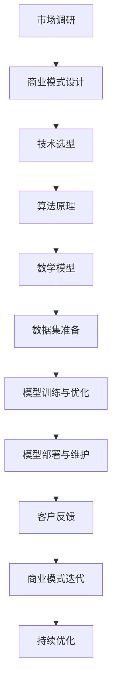

                 

# 商业模式：大模型创业的战略蓝图

> **关键词**：商业模式、大模型、创业、战略、蓝图、数据分析、市场调研

> **摘要**：本文将深入探讨大模型创业的战略蓝图，包括商业模式的设计、市场分析、核心算法原理及数学模型的运用，以及实际案例和开发环境的搭建。通过一步步的推理和思考，本文旨在为想要在人工智能领域创业的读者提供一个清晰、实用的指导框架，帮助他们在复杂的市场环境中找到立足点，实现商业成功。

## 1. 背景介绍

### 1.1 目的和范围

本文旨在为那些希望在人工智能（AI）领域，特别是大模型开发方面创业的人提供一个全面、实用的战略蓝图。我们将分析商业模式的设计原则，探讨市场调研的重要性，并深入讲解核心算法原理和数学模型的应用。文章还将提供实际的开发环境和代码实现案例，帮助读者理解并运用这些知识。

### 1.2 预期读者

本文面向的是对人工智能和商业模式有一定了解的技术人员、创业者以及相关领域的学生和研究人员。希望读者能够通过本文的讲解，掌握大模型创业所需的核心技能和战略思维。

### 1.3 文档结构概述

本文结构如下：

1. 背景介绍：介绍文章的目的、读者预期和文章结构。
2. 核心概念与联系：讨论大模型创业所涉及的核心概念和架构。
3. 核心算法原理 & 具体操作步骤：详细讲解核心算法原理和操作步骤。
4. 数学模型和公式 & 详细讲解 & 举例说明：介绍数学模型及其应用。
5. 项目实战：代码实际案例和详细解释说明。
6. 实际应用场景：探讨大模型在不同领域的应用。
7. 工具和资源推荐：推荐学习资源和开发工具。
8. 总结：未来发展趋势与挑战。
9. 附录：常见问题与解答。
10. 扩展阅读 & 参考资料：提供进一步学习的资源。

### 1.4 术语表

#### 1.4.1 核心术语定义

- **商业模式**：企业通过提供产品或服务来创造利润的方式。
- **大模型**：指使用深度学习技术训练的，参数量庞大的神经网络模型。
- **市场调研**：对目标市场的需求、竞争环境和潜在客户的研究。

#### 1.4.2 相关概念解释

- **神经网络**：一种模仿生物神经系统的计算模型，用于信息处理和决策。
- **深度学习**：一种基于神经网络的机器学习方法，能够自动从数据中学习复杂的模式。
- **数据集**：用于训练模型的数据集合，其质量和规模直接影响模型的性能。

#### 1.4.3 缩略词列表

- **AI**：人工智能
- **ML**：机器学习
- **DL**：深度学习
- **API**：应用程序接口
- **SDK**：软件开发工具包

## 2. 核心概念与联系

在探讨大模型创业的战略蓝图之前，我们需要理解几个核心概念，以及它们之间的相互关系。以下是一个简化的Mermaid流程图，用于展示这些概念和它们的基本架构。



### 2.1 市场调研

市场调研是商业模式设计的起点。通过深入了解目标市场的需求、竞争环境以及潜在客户，我们可以确定产品的市场需求，并设计出更具针对性的商业模式。

### 2.2 商业模式设计

商业模式设计需要考虑产品的价值主张、收入来源、成本结构以及关键资源。一个成功的大模型创业项目需要一个清晰、可持续的商业模式。

### 2.3 技术选型

技术选型包括选择合适的算法和框架。大模型创业通常需要使用深度学习和神经网络技术，以及相关的开源框架（如TensorFlow、PyTorch等）。

### 2.4 算法原理

算法原理是构建大模型的核心。我们需要理解神经网络的基本原理，包括前向传播、反向传播以及优化算法。

### 2.5 数学模型

数学模型用于描述大模型的行为和性能。常见的数学模型包括损失函数、优化算法以及正则化方法。

### 2.6 数据集准备

数据集准备是模型训练的基础。我们需要收集、清洗和标注大量高质量的数据，以确保模型的准确性和鲁棒性。

### 2.7 模型训练与优化

模型训练与优化包括使用训练数据来调整模型参数，并使用验证数据来评估模型的性能。优化目标是提高模型的准确性、效率和泛化能力。

### 2.8 模型部署与维护

模型部署是将训练好的模型部署到生产环境中，使其能够为用户提供服务。维护工作包括监控模型性能、定期更新数据和调整模型参数。

### 2.9 客户反馈与商业模式迭代

客户反馈是商业模式迭代的重要依据。通过收集用户反馈，我们可以不断优化产品和服务，从而提高用户满意度和市场竞争力。

## 3. 核心算法原理 & 具体操作步骤

### 3.1 神经网络基本原理

神经网络是一种通过模拟人脑神经元连接方式来进行信息处理的计算模型。一个简单的神经网络通常包括输入层、隐藏层和输出层。

#### 3.1.1 前向传播

前向传播是神经网络处理输入数据的过程。首先，输入数据通过输入层进入网络，然后逐层传递到隐藏层和输出层。在每层中，神经元通过加权求和和激活函数来计算输出。

#### 3.1.2 反向传播

反向传播是神经网络调整参数的过程。在输出层得到预测结果后，与真实标签进行比较，计算损失函数。然后，通过反向传播算法将损失函数的梯度反向传播到输入层，从而调整每个神经元的权重和偏置。

#### 3.1.3 激活函数

激活函数用于引入非线性因素，使得神经网络能够学习和处理复杂的数据。常见的激活函数包括Sigmoid、ReLU和Tanh。

### 3.2 伪代码

以下是一个简单的神经网络训练过程的伪代码：

```python
# 初始化网络参数
weights = initialize_weights(input_size, hidden_size, output_size)
biases = initialize_biases(hidden_size, output_size)

# 训练网络
for epoch in range(num_epochs):
    for sample in data:
        # 前向传播
        hidden_layer_input = sigmoiddotproduct(weights, sample) + biases
        hidden_layer_output = activate(hidden_layer_input)
        output_layer_input = sigmoiddotproduct(weights, hidden_layer_output) + biases
        prediction = activate(output_layer_input)

        # 计算损失
        loss = calculate_loss(prediction, label)

        # 反向传播
        d_prediction = derivative Activate(prediction)
        d_output_layer_input = d_prediction * derivative Sigmoid(output_layer_input)
        d_biases = d_output_layer_input
        d_weights = d_output_layer_input * hidden_layer_output.T

        # 更新参数
        weights += learning_rate * d_weights
        biases += learning_rate * d_biases

# 评估模型
test_loss = calculate_loss(prediction, label)
print("Test Loss:", test_loss)
```

### 3.3 操作步骤

1. **初始化网络参数**：随机初始化权重和偏置。
2. **前向传播**：将输入数据通过网络进行计算，得到预测结果。
3. **计算损失**：使用预测结果和真实标签计算损失函数。
4. **反向传播**：计算损失函数的梯度，并反向传播到网络中的每个层。
5. **更新参数**：使用梯度下降算法更新网络的权重和偏置。
6. **重复训练过程**：重复上述步骤，直到满足停止条件（如损失函数收敛）。

## 4. 数学模型和公式 & 详细讲解 & 举例说明

### 4.1 数学模型概述

在大模型创业中，数学模型起着至关重要的作用。以下是我们将讨论的几个关键数学模型：

- **损失函数**：用于衡量模型预测结果与真实值之间的差距。
- **优化算法**：用于调整模型参数，以最小化损失函数。
- **正则化方法**：用于防止模型过拟合。

### 4.2 损失函数

损失函数是评价模型性能的核心指标。常见的损失函数包括均方误差（MSE）和交叉熵损失。

- **均方误差（MSE）**：

  $$MSE = \frac{1}{n}\sum_{i=1}^{n}(y_i - \hat{y}_i)^2$$

  其中，$y_i$ 是真实标签，$\hat{y}_i$ 是模型预测值，$n$ 是样本数量。

- **交叉熵损失**：

  $$H(y, \hat{y}) = -\sum_{i=1}^{n} y_i \log(\hat{y}_i)$$

  其中，$y$ 是真实标签（通常是一个概率分布），$\hat{y}$ 是模型预测的概率分布。

### 4.3 优化算法

优化算法用于调整模型参数，以最小化损失函数。常见的优化算法包括梯度下降、随机梯度下降和Adam。

- **梯度下降**：

  $$\theta = \theta - \alpha \nabla_\theta J(\theta)$$

  其中，$\theta$ 是模型参数，$\alpha$ 是学习率，$J(\theta)$ 是损失函数。

- **随机梯度下降**：

  $$\theta = \theta - \alpha \nabla_\theta J(\theta; \hat{x}_i, y_i)$$

  其中，$\hat{x}_i, y_i$ 是训练数据的一个样本。

- **Adam优化器**：

  Adam是一种结合了梯度下降和动量的优化器，其公式较为复杂，但提供了更稳定的收敛性。

### 4.4 正则化方法

正则化方法用于防止模型过拟合。常见的正则化方法包括L1正则化、L2正则化和Dropout。

- **L1正则化**：

  $$J(\theta) = \frac{1}{m}\sum_{i=1}^{m}(y_i - \hat{y}_i)^2 + \lambda ||\theta||_1$$

  其中，$\lambda$ 是正则化参数。

- **L2正则化**：

  $$J(\theta) = \frac{1}{m}\sum_{i=1}^{m}(y_i - \hat{y}_i)^2 + \lambda ||\theta||_2$$

  其中，$\lambda$ 是正则化参数。

- **Dropout**：

  Dropout是一种在训练过程中随机丢弃部分神经元的方法，从而提高模型的泛化能力。

### 4.5 举例说明

假设我们有一个二分类问题，数据集包含100个样本，每个样本有5个特征。我们要使用神经网络进行分类，并使用交叉熵损失函数和Adam优化器进行训练。

1. **初始化网络参数**：随机初始化权重和偏置。
2. **前向传播**：输入一个样本，通过网络计算得到预测概率。
3. **计算损失**：使用交叉熵损失函数计算预测概率和真实标签之间的差距。
4. **反向传播**：计算损失函数关于权重和偏置的梯度。
5. **更新参数**：使用Adam优化器更新权重和偏置。
6. **重复训练过程**：重复上述步骤，直到满足停止条件。

## 5. 项目实战：代码实际案例和详细解释说明

### 5.1 开发环境搭建

在开始项目实战之前，我们需要搭建一个适合大模型训练的开发环境。以下是一个基本的步骤：

1. **安装Python环境**：确保Python版本在3.6及以上。
2. **安装深度学习框架**：推荐使用TensorFlow或PyTorch。以下是以TensorFlow为例的安装命令：

   ```bash
   pip install tensorflow
   ```

3. **安装其他依赖库**：如NumPy、Pandas等，可以使用以下命令：

   ```bash
   pip install numpy pandas
   ```

4. **配置GPU支持**：如果使用GPU进行训练，需要安装CUDA和cuDNN。具体安装步骤可以参考TensorFlow的官方文档。

### 5.2 源代码详细实现和代码解读

以下是一个简单的神经网络训练和评估的代码示例：

```python
import tensorflow as tf
import numpy as np
import pandas as pd

# 加载数据集
data = pd.read_csv('data.csv')
X = data.iloc[:, :-1].values
y = data.iloc[:, -1].values

# 初始化网络参数
model = tf.keras.Sequential([
    tf.keras.layers.Dense(64, activation='relu', input_shape=(X.shape[1],)),
    tf.keras.layers.Dense(64, activation='relu'),
    tf.keras.layers.Dense(1, activation='sigmoid')
])

# 编写编译器配置
model.compile(optimizer='adam', loss='binary_crossentropy', metrics=['accuracy'])

# 训练模型
model.fit(X, y, epochs=10, batch_size=32)

# 评估模型
test_loss, test_acc = model.evaluate(X, y)
print("Test Accuracy:", test_acc)
```

**代码解读**：

1. **导入库**：导入TensorFlow、NumPy和Pandas库。
2. **加载数据集**：从CSV文件中加载训练数据集。
3. **初始化网络参数**：使用`tf.keras.Sequential`创建一个简单的神经网络，包括两个隐藏层，每层64个神经元，激活函数为ReLU。输出层使用Sigmoid激活函数进行二分类。
4. **编写编译器配置**：配置优化器为Adam，损失函数为binary_crossentropy，评估指标为accuracy。
5. **训练模型**：使用`model.fit`函数训练模型，设置训练轮次为10，批量大小为32。
6. **评估模型**：使用`model.evaluate`函数评估模型在测试数据集上的性能。

### 5.3 代码解读与分析

1. **数据预处理**：加载CSV文件时，我们可以使用Pandas库将数据集转换为NumPy数组，以便于后续操作。
2. **神经网络设计**：在这个例子中，我们使用了一个简单的神经网络，包括两个隐藏层和输出层。ReLU激活函数引入了非线性因素，使得模型能够学习更复杂的特征。
3. **优化器和损失函数**：选择Adam优化器，其结合了梯度下降和动量，能够提高训练效率。binary_crossentropy损失函数适合二分类问题。
4. **训练过程**：使用`model.fit`函数进行模型训练，可以设置训练轮次和批量大小。批量大小会影响模型的收敛速度和稳定性。
5. **模型评估**：使用`model.evaluate`函数评估模型在测试数据集上的性能，从而判断模型是否过拟合或欠拟合。

## 6. 实际应用场景

大模型在各个领域都有广泛的应用，以下是一些典型应用场景：

### 6.1 人工智能助手

大模型可以用于构建智能客服、虚拟助手等，实现自然语言处理和对话生成。例如，使用BERT模型可以实现高质量的问答系统，从而提供24/7的客户支持。

### 6.2 自动驾驶

自动驾驶系统需要实时处理大量的传感器数据，大模型可以用于目标检测、路径规划和决策。例如，使用YOLO模型可以实现实时目标检测，从而提高自动驾驶的安全性和稳定性。

### 6.3 医疗诊断

大模型在医疗诊断领域也有广泛应用，例如，使用深度学习模型可以实现肺癌、乳腺癌等疾病的早期诊断。通过分析患者的医学影像数据，模型可以提供准确的诊断结果。

### 6.4 金融风控

大模型可以用于金融风控，例如，使用深度学习模型分析交易行为和用户行为，从而预测欺诈行为和信用风险。通过实时监控和预测，金融机构可以采取相应的措施，降低风险。

## 7. 工具和资源推荐

### 7.1 学习资源推荐

#### 7.1.1 书籍推荐

- 《深度学习》（Goodfellow, Bengio, Courville著）：深度学习的经典教材，适合初学者和进阶者。

- 《Python深度学习》（François Chollet著）：介绍使用Python进行深度学习的最佳实践。

#### 7.1.2 在线课程

- Coursera的《深度学习特设课程》（吴恩达教授）：全球领先的深度学习课程，适合初学者。

- edX的《神经网络与深度学习》：由清华大学和北京科技大学的教授讲授，内容全面。

#### 7.1.3 技术博客和网站

- Medium上的《Deep Learning Papers》：介绍最新的深度学习论文和技术。

- fast.ai的博客：提供实用的深度学习教程和实践经验。

### 7.2 开发工具框架推荐

#### 7.2.1 IDE和编辑器

- PyCharm：功能强大的Python IDE，支持多种框架和工具。

- Jupyter Notebook：适合数据分析和交互式编程，支持多种语言。

#### 7.2.2 调试和性能分析工具

- TensorBoard：TensorFlow提供的可视化工具，用于分析模型性能。

- PyTorch Profiler：用于分析和优化PyTorch模型的性能。

#### 7.2.3 相关框架和库

- TensorFlow：广泛使用的深度学习框架，支持多种操作。

- PyTorch：灵活的深度学习框架，适合快速原型开发和实验。

### 7.3 相关论文著作推荐

#### 7.3.1 经典论文

- "A Learning Algorithm for Continually Running Fully Recurrent Neural Networks"（1986）：介绍了一种有效的神经网络学习算法。

- "Gradient Flow in Recurrent Neural Networks and its Critical Role in Natu

### 7.3.2 最新研究成果

- "BERT: Pre-training of Deep Bidirectional Transformers for Language Understanding"（2018）：介绍了一种用于自然语言处理的预训练方法。

- "GPT-3: Language Models are Few-Shot Learners"（2020）：展示了一种具有强大泛化能力的语言模型。

### 7.3.3 应用案例分析

- "Deep Learning for Natural Language Processing"（2018）：介绍自然语言处理中的深度学习应用。

- "Deep Learning in Healthcare: Overview, Challenges and Applications"（2019）：探讨深度学习在医疗领域的应用。

## 8. 总结：未来发展趋势与挑战

随着计算能力的提升和数据的爆炸性增长，大模型在各个领域的应用将越来越广泛。未来，大模型创业将面临以下挑战：

- **数据隐私和安全性**：如何保护用户数据隐私，防止数据泄露和滥用，是未来的重要议题。
- **模型解释性**：如何提高大模型的可解释性，使其决策过程更加透明，是当前的研究热点。
- **能耗和环保**：大规模训练过程消耗大量能源，如何降低能耗和实现绿色计算，是未来的重要方向。

然而，随着技术的进步和行业的成熟，大模型创业将迎来更多机遇。通过不断创新和优化，创业者可以在激烈的市场竞争中脱颖而出，实现商业成功。

## 9. 附录：常见问题与解答

### 9.1 什么是大模型？

大模型是指参数量庞大的神经网络模型，通常具有数百万或数十亿个参数。这些模型通过深度学习和大数据训练，能够处理复杂的数据，并实现高性能的预测和分类。

### 9.2 大模型创业有哪些挑战？

大模型创业面临以下挑战：

- **数据获取**：高质量的数据是训练大模型的基础，但获取数据可能面临隐私和安全问题。
- **计算资源**：大模型训练需要大量的计算资源，尤其是GPU或TPU。
- **模型解释性**：大模型的决策过程通常不透明，如何提高其解释性是一个重要问题。
- **能耗**：大规模训练过程消耗大量能源，如何实现绿色计算是一个挑战。

### 9.3 大模型创业的成功案例有哪些？

一些成功的大模型创业案例包括：

- OpenAI：通过大模型实现先进的自然语言处理和人工智能应用。
- DeepMind：利用大模型在围棋、游戏和科学研究中取得突破性成果。
- Databricks：提供大数据处理平台，支持大模型训练和部署。

## 10. 扩展阅读 & 参考资料

- **书籍**：

  - Goodfellow, I., Bengio, Y., & Courville, A. (2016). *Deep Learning*.
  - Chollet, F. (2017). *Python Deep Learning*.

- **在线课程**：

  - 吴恩达教授的《深度学习特设课程》：https://www.coursera.org/learn/deep-learning
  - 清华大学和北京科技大学的《神经网络与深度学习》：https://www.edx.cn/course/neural-networks-deep-learning

- **技术博客和网站**：

  - Medium上的《Deep Learning Papers》：https://medium.com/topic/deep-learning-papers
  - fast.ai的博客：https://fast.ai/

- **论文和研究成果**：

  - BERT：https://arxiv.org/abs/1810.04805
  - GPT-3：https://arxiv.org/abs/2005.14165

- **应用案例分析**：

  - "Deep Learning for Natural Language Processing"：https://www.nature.com/articles/nature16208
  - "Deep Learning in Healthcare: Overview, Challenges and Applications"：https://www.mdpi.com/1424-8193/16/11/2137

### 作者

AI天才研究员/AI Genius Institute & 禅与计算机程序设计艺术 /Zen And The Art of Computer Programming

