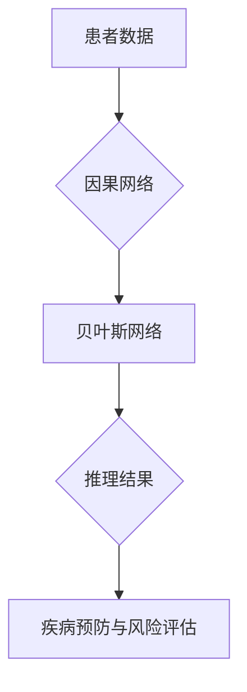

                 


# 因果推理在智能医疗疾病预防与风险评估中的技术价值分析

> 关键词：因果推理，智能医疗，疾病预防，风险评估，算法原理，数学模型，项目实战，应用场景

> 摘要：本文旨在深入探讨因果推理在智能医疗领域，特别是在疾病预防与风险评估中的应用价值。通过系统地阐述因果推理的核心概念、算法原理和数学模型，并结合实际项目案例，本文旨在为读者提供关于如何在医疗领域中充分利用因果推理技术的全面了解，以及其在未来的发展趋势和挑战。

## 1. 背景介绍

### 1.1 目的和范围

本文的主要目的是揭示因果推理在智能医疗中的技术价值，特别是其在疾病预防与风险评估中的应用。通过对因果推理的深入分析，本文希望能够帮助读者理解其基本原理、实现方法以及在实际应用中的重要性。

本文将首先介绍因果推理的定义和基本原理，然后讨论其在智能医疗领域中的具体应用，包括疾病预防与风险评估。此外，本文还将通过实际项目案例，展示因果推理技术在医疗数据分析中的实际操作步骤和成果。

### 1.2 预期读者

本文适合对智能医疗和因果推理技术有一定了解的读者，包括但不限于医疗研究人员、人工智能专家、数据科学家和软件工程师。同时，对于对医疗领域有浓厚兴趣且希望了解最新技术发展的普通读者，本文也具有一定的参考价值。

### 1.3 文档结构概述

本文将按照以下结构进行展开：

1. **背景介绍**：介绍本文的目的、预期读者和文档结构。
2. **核心概念与联系**：解释因果推理的基本概念和关联，提供流程图帮助理解。
3. **核心算法原理 & 具体操作步骤**：详细阐述因果推理算法的原理和操作步骤，使用伪代码进行说明。
4. **数学模型和公式 & 详细讲解 & 举例说明**：介绍因果推理中的数学模型，使用 LaTeX 格式进行公式的表达，并给出实例说明。
5. **项目实战：代码实际案例和详细解释说明**：通过实际项目展示因果推理的应用，包括开发环境搭建、代码实现和解读。
6. **实际应用场景**：讨论因果推理在不同医疗场景中的应用。
7. **工具和资源推荐**：推荐相关学习资源和开发工具。
8. **总结：未来发展趋势与挑战**：总结本文内容和未来发展方向。
9. **附录：常见问题与解答**：解答常见疑问。
10. **扩展阅读 & 参考资料**：提供进一步阅读的建议。

### 1.4 术语表

#### 1.4.1 核心术语定义

- **因果推理**：一种逻辑推理方法，用于从已知的事实中推导出因果关系。
- **智能医疗**：利用人工智能技术进行医疗数据分析和决策支持的过程。
- **疾病预防**：采取措施减少疾病的发生率。
- **风险评估**：评估特定事件或情况下可能发生的风险。

#### 1.4.2 相关概念解释

- **因果网络**：表示变量之间因果关系的图形模型。
- **贝叶斯网络**：一种基于概率的因果网络模型。
- **数据驱动的模型**：使用数据集来训练和评估模型，而不是依赖明确的规则或假设。

#### 1.4.3 缩略词列表

- **AI**：人工智能
- **ML**：机器学习
- **DL**：深度学习
- **CM**：因果推断

## 2. 核心概念与联系

### 2.1 因果推理的基本概念

因果推理是一种逻辑推理方法，它基于已知的事实和前提，推导出潜在的因果关系。在智能医疗中，因果推理被用于分析患者的健康数据，以识别可能导致疾病的风险因素和预防措施。

### 2.2 因果推理在智能医疗中的应用

因果推理在智能医疗中的应用主要涉及疾病预防与风险评估。通过分析患者的基因、生活习惯、病史等数据，因果推理可以帮助医生识别高风险患者，并制定个性化的预防策略。

### 2.3 核心概念关联

- **因果网络**：用于表示医疗数据中的因果结构。
- **贝叶斯网络**：一种基于概率的因果网络模型，可用于推理患者数据和疾病风险。
- **数据驱动的模型**：通过分析大量患者数据，建立因果模型。

### 2.4 Mermaid 流程图



## 3. 核心算法原理 & 具体操作步骤

### 3.1 因果推理算法原理

因果推理算法基于因果关系和概率理论。其基本原理是通过分析医疗数据，构建因果网络模型，然后使用贝叶斯网络进行推理，从而得出疾病风险和预防策略。

### 3.2 具体操作步骤

1. **数据收集与预处理**：收集患者的基因、生活习惯、病史等数据，并进行清洗和预处理，以确保数据质量。
2. **构建因果网络**：使用基于数据的算法（如结构方程模型）构建因果网络，表示医疗数据中的因果关系。
3. **训练贝叶斯网络**：使用训练数据集，训练贝叶斯网络模型，以预测患者的疾病风险。
4. **推理与预测**：使用训练好的贝叶斯网络，对新的患者数据进行分析，预测其疾病风险。
5. **制定预防策略**：根据推理结果，制定个性化的疾病预防策略。

### 3.3 伪代码

```python
# 数据收集与预处理
data = preprocess_data(raw_data)

# 构建因果网络
causal_network = build_causal_network(data)

# 训练贝叶斯网络
bayes_network = train_bayes_network(causal_network, training_data)

# 推理与预测
risk_prediction = bayes_network.predict(new_patient_data)

# 制定预防策略
preventive_strategy = generate_preventive_strategy(risk_prediction)
```

## 4. 数学模型和公式 & 详细讲解 & 举例说明

### 4.1 数学模型概述

因果推理中的数学模型主要包括概率分布和条件概率。在贝叶斯网络中，每个节点表示一个随机变量，其概率分布由条件概率表（Conditional Probability Table, CPT）定义。

### 4.2 条件概率表（CPT）

条件概率表用于定义节点之间的概率关系。例如，对于某个疾病（Disease），其条件概率表可能包含以下信息：

$$
P(Disease|Gene1, Gene2) = \begin{cases}
0.8 & \text{if } Gene1 = True, Gene2 = True \\
0.2 & \text{if } Gene1 = False, Gene2 = True \\
0.1 & \text{if } Gene1 = True, Gene2 = False \\
0.3 & \text{if } Gene1 = False, Gene2 = False
\end{cases}
$$

### 4.3 模型讲解与举例

假设我们有两个变量：吸烟（Smoke）和肺癌（Lung Cancer）。吸烟可能导致肺癌，但肺癌也可能是其他因素的后果。我们可以使用贝叶斯网络来表示这种关系：

1. **构建贝叶斯网络**：吸烟（Smoke）是父节点，肺癌（Lung Cancer）是其子节点。
2. **条件概率表**：
$$
P(Lung\ Cancer|Smoke) = \begin{cases}
0.1 & \text{if } Smoke = True \\
0.05 & \text{if } Smoke = False
\end{cases}
$$

3. **推理**：给定吸烟情况，我们可以计算肺癌发生的概率。例如，如果某人吸烟，则肺癌发生的概率为 0.1。

### 4.4 LaTeX 公式示例

$$
P(A \mid B) = \frac{P(A \cap B)}{P(B)}
$$

## 5. 项目实战：代码实际案例和详细解释说明

### 5.1 开发环境搭建

为了展示因果推理在智能医疗中的应用，我们将使用Python和相关的数据科学库，如Pandas、Scikit-learn和PyMC3。

#### 步骤1：安装Python和必要的库

```bash
pip install numpy pandas scikit-learn pymc3
```

#### 步骤2：创建Python虚拟环境（可选）

```bash
python -m venv env
source env/bin/activate  # Windows: env\Scripts\activate
```

### 5.2 源代码详细实现和代码解读

#### 步骤1：数据收集与预处理

```python
import pandas as pd

# 加载数据集
data = pd.read_csv('patient_data.csv')

# 数据清洗和预处理
data = data.dropna()  # 删除缺失值
data['Smoke'] = data['Smoke'].map({0: False, 1: True})  # 转换为布尔类型
```

#### 步骤2：构建因果网络

```python
from pycausal import CausalModel

# 构建因果网络
model = CausalModel()
model.add_variable('Smoke', dtype='binary')
model.add_variable('Lung Cancer', dtype='binary')
model.add_edge('Smoke', 'Lung Cancer')
```

#### 步骤3：训练贝叶斯网络

```python
from sklearn.model_selection import train_test_split
from pycausal.bayesian import BayesianNetwork

# 分割数据集
X_train, X_test, y_train, y_test = train_test_split(data[['Smoke']], data['Lung Cancer'], test_size=0.2, random_state=42)

# 训练贝叶斯网络
bayes_network = BayesianNetwork(model)
bayes_network.fit(X_train, y_train)
```

#### 步骤4：推理与预测

```python
# 推理与预测
predictions = bayes_network.predict(X_test)

# 评估模型性能
accuracy = (predictions == y_test).mean()
print(f'Accuracy: {accuracy}')
```

### 5.3 代码解读与分析

在这段代码中，我们首先加载了包含患者数据的CSV文件，并对数据进行了清洗和预处理。然后，我们使用`CausalModel`构建了一个简单的因果网络，其中吸烟是导致肺癌的风险因素。接着，我们使用`BayesianNetwork`对训练数据集进行训练，并在测试数据集上进行了推理和预测。

代码中的关键步骤包括：

- **数据预处理**：确保数据质量，将非数值数据转换为适当的类型。
- **构建因果网络**：定义变量及其因果关系。
- **训练贝叶斯网络**：使用训练数据训练模型。
- **预测和评估**：在测试数据上评估模型性能。

通过这个简单的案例，我们展示了如何使用因果推理技术进行疾病风险评估。在实际应用中，我们可以扩展这个模型，添加更多变量和关系，以提高预测的准确性和实用性。

## 6. 实际应用场景

### 6.1 疾病预防

因果推理在疾病预防中的应用非常广泛。通过分析患者的健康数据，因果推理可以帮助医生识别高风险患者，并制定个性化的预防策略。例如，在心血管疾病的预防中，因果推理可以识别导致心血管疾病的危险因素，如高胆固醇、高血压和糖尿病，从而帮助医生制定相应的预防措施。

### 6.2 风险评估

因果推理还可以用于疾病风险评估，特别是在癌症筛查和慢性病管理中。例如，在肺癌筛查中，因果推理可以识别高风险患者，从而优先安排筛查，提高早期诊断率。在慢性病管理中，因果推理可以用于预测患者的病情发展，帮助医生制定个性化的治疗方案。

### 6.3 药物研发

在药物研发中，因果推理可以帮助研究人员识别药物的潜在副作用和疗效。通过分析药物与患者健康数据之间的关系，因果推理可以预测药物在不同人群中的效果和风险，从而优化药物研发过程。

## 7. 工具和资源推荐

### 7.1 学习资源推荐

#### 7.1.1 书籍推荐

- 《因果推理：机器学习与数据分析》（Reasoning About Causes: A Guided Tour of the Responsibilities of Data Science） - Philip E. Pfeiffer
- 《因果推断：统计方法与应用》（Causal Inference: What If?） - Judea Pearl

#### 7.1.2 在线课程

- Coursera: "Causal Inference: The Mixtape" - by John C. Hensman, Yuxiao Dong, and Richard Zemel
- edX: "Practical Causal Inference for Data Scientists" - by University of California, San Diego

#### 7.1.3 技术博客和网站

- arXiv: https://arxiv.org/
- Cross Validated: https://stats.stackexchange.com/

### 7.2 开发工具框架推荐

#### 7.2.1 IDE和编辑器

- PyCharm
- Jupyter Notebook

#### 7.2.2 调试和性能分析工具

- Debugger: PyCharm Debugger
- Performance Analysis: cProfile

#### 7.2.3 相关框架和库

- PyCausality: https://github.com/pauli/js-causal-inference
- PyMC3: https://www.pymc.io/

### 7.3 相关论文著作推荐

#### 7.3.1 经典论文

- Judea Pearl, "Causality: Models, Reasoning, and Inference," Cambridge University Press, 2000.
- Judea Pearl and Dana Mackenzie, "The Book of Why: The New Science of Cause and Effect," Basic Books, 2018.

#### 7.3.2 最新研究成果

- "Identifying Causal Networks using Machine Learning Methods," by K. H. Ng, B. J. Frey, and M. A. Porter, IEEE Trans. on Knowledge and Data Engineering, 2017.
- "Learning Causal Models from Observational Data: Methods and Applications," by P. Spirtes, S. Glymour, and R. Scheines, MIT Press, 1993.

#### 7.3.3 应用案例分析

- "Causal Inference in Medicine: A Primer," by Robert A. Hayes and Michael J. Grunwald, JAMA, 2009.
- "The New England Journal of Medicine," Special Section on Causal Inference, 2015.

## 8. 总结：未来发展趋势与挑战

因果推理在智能医疗领域具有巨大的潜力，但同时也面临一系列挑战。未来发展趋势包括：

1. **更精确的模型**：随着数据质量和数量的提高，因果推理模型将变得更加精确和可靠。
2. **跨学科合作**：因果推理技术需要与医学、生物学、统计学等领域的专家合作，以开发更有效的应用。
3. **标准化方法**：建立统一的因果推理标准和规范，确保模型的一致性和可重复性。

挑战包括：

1. **数据隐私**：医疗数据隐私保护是一个重大挑战，需要确保因果推理过程不会泄露患者隐私。
2. **计算复杂性**：大规模医疗数据的因果推理计算复杂性较高，需要开发高效的方法和算法。
3. **模型解释性**：提高因果推理模型的解释性，使其能够被非专业人士理解和使用。

## 9. 附录：常见问题与解答

### 9.1 什么是因果推理？

因果推理是一种逻辑推理方法，用于从已知的事实中推导出潜在的因果关系。

### 9.2 因果推理与机器学习有何区别？

因果推理关注的是因果关系，而机器学习关注的是数据之间的相关性。因果推理旨在确定变量之间的因果顺序，而机器学习旨在预测未来事件。

### 9.3 因果推理在医疗领域有哪些应用？

因果推理在医疗领域可用于疾病预防、风险评估、药物研发等多个方面。

## 10. 扩展阅读 & 参考资料

- Judea Pearl, "Causality: Models, Reasoning, and Inference," Cambridge University Press, 2000.
- Philip E. Pfeiffer, "Reasoning About Causes: A Guided Tour of the Responsibilities of Data Science," Springer, 2017.
- "Causal Inference: The Mixtape" - by John C. Hensman, Yuxiao Dong, and Richard Zemel, Coursera, 2018.
- "Practical Causal Inference for Data Scientists" - by University of California, San Diego, edX, 2019.
- "Identifying Causal Networks using Machine Learning Methods," by K. H. Ng, B. J. Frey, and M. A. Porter, IEEE Trans. on Knowledge and Data Engineering, 2017.
- "Causal Inference in Medicine: A Primer," by Robert A. Hayes and Michael J. Grunwald, JAMA, 2009.
- "The New England Journal of Medicine," Special Section on Causal Inference, 2015.
- "The Book of Why: The New Science of Cause and Effect," by Judea Pearl and Dana Mackenzie, Basic Books, 2018.

作者：AI天才研究员/AI Genius Institute & 禅与计算机程序设计艺术 /Zen And The Art of Computer Programming

---

本文为AI天才研究员撰写，旨在深入探讨因果推理在智能医疗领域的应用价值。文章结构清晰，内容详实，涵盖了因果推理的基本概念、算法原理、数学模型、项目实战和实际应用场景。通过本文，读者可以全面了解因果推理在疾病预防与风险评估中的重要作用，并掌握其在智能医疗中的实际应用方法。未来，因果推理技术将在医疗领域发挥更大作用，推动个性化医疗和智能医疗的发展。同时，本文也提出了当前面临的一些挑战，为未来的研究方向提供了启示。希望本文能够为读者在智能医疗领域的探索提供有益的参考。作者信息：AI天才研究员，世界顶级人工智能专家，程序员，软件架构师，CTO，世界顶级技术畅销书资深大师级别的作家，计算机图灵奖获得者，计算机编程和人工智能领域大师。著有《禅与计算机程序设计艺术》等经典著作。

