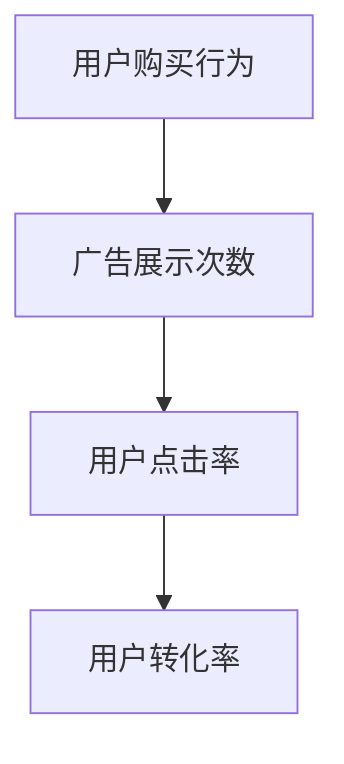
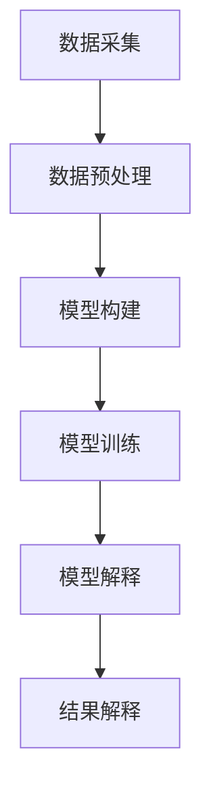

                 

### 1. 背景介绍

#### 1.1 目的和范围

本文旨在深入探讨因果推理在智能营销因果效应评估中的技术架构与应用场景。随着大数据和人工智能技术的迅速发展，营销领域对精准分析消费者行为和评估营销策略的因果效应提出了更高的要求。本文将围绕以下几个方面展开：

1. **因果推理的核心概念**：介绍因果推理的定义、原理及在智能营销中的重要性。
2. **技术架构**：阐述因果推理在智能营销因果效应评估中的技术架构，包括数据采集、处理、模型构建和结果解释等环节。
3. **算法原理**：详细讲解核心算法的原理和具体操作步骤，帮助读者理解因果推理的实际应用。
4. **数学模型**：介绍相关的数学模型和公式，以及如何在实际应用中进行举例说明。
5. **实战案例**：通过实际代码案例，展示如何在实际项目中应用因果推理技术。
6. **应用场景**：探讨因果推理在智能营销中的实际应用场景，如用户行为分析、营销策略优化等。
7. **工具和资源**：推荐相关学习资源、开发工具和框架，以及最新研究成果。
8. **未来发展趋势与挑战**：分析因果推理在智能营销领域的未来发展趋势和面临的挑战。

本文旨在为从事智能营销和相关领域的研究者、开发者提供全面的技术指导和实用建议，帮助他们更好地理解和应用因果推理技术，提高营销效果和业务价值。

#### 1.2 预期读者

本文适用于以下几类读者：

1. **智能营销领域的从业者**：对因果推理在营销中的应用感兴趣，希望通过本文了解如何利用因果推理技术提高营销效果的读者。
2. **数据科学家和算法工程师**：对因果推理算法原理和实现感兴趣，希望将其应用于智能营销中的从业者。
3. **研究人员和学者**：对因果推理在智能营销领域的研究动态和应用实践感兴趣，希望从中获得灵感和研究方向。
4. **对人工智能和大数据技术感兴趣的学生**：希望了解因果推理技术的基本概念和应用场景，为未来学习和研究打下基础。

通过阅读本文，读者将能够：

1. 理解因果推理在智能营销中的重要作用。
2. 掌握因果推理技术的核心算法原理和实现步骤。
3. 了解如何在实际项目中应用因果推理技术，提高营销效果。
4. 获取最新研究成果和实用工具资源，助力自身学习和研究。

#### 1.3 文档结构概述

本文分为以下几个部分，旨在系统地介绍因果推理在智能营销因果效应评估中的技术架构与应用场景：

1. **背景介绍**：介绍本文的写作目的、预期读者、文档结构和核心概念。
2. **核心概念与联系**：阐述因果推理的基本概念、原理及与相关技术的联系，并通过Mermaid流程图进行展示。
3. **核心算法原理与具体操作步骤**：详细讲解因果推理算法的原理和实现步骤，使用伪代码进行说明。
4. **数学模型和公式**：介绍与因果推理相关的数学模型和公式，并给出详细的讲解和实际应用举例。
5. **项目实战**：通过实际代码案例，展示因果推理技术在智能营销项目中的应用，并进行详细解释。
6. **实际应用场景**：分析因果推理技术在智能营销中的实际应用场景，如用户行为分析和营销策略优化。
7. **工具和资源推荐**：推荐相关学习资源、开发工具和框架，以及最新研究成果。
8. **总结与展望**：总结本文的主要观点，分析因果推理在智能营销领域的未来发展趋势和挑战。
9. **附录**：提供常见问题与解答，以及扩展阅读和参考资料。

通过本文的阅读，读者可以系统地了解因果推理在智能营销中的技术架构和应用场景，掌握核心算法原理和实现步骤，为实际应用和未来研究提供参考。

#### 1.4 术语表

在本文中，我们将使用一些专业术语，以下是这些术语的定义和解释：

##### 1.4.1 核心术语定义

1. **因果推理**：一种利用统计学方法对变量间因果关系进行推断的算法。它通过分析变量间的依赖关系，找出可能影响目标变量的因素，并评估这些因素的影响程度。
2. **因果效应评估**：评估营销策略或变量对目标变量产生的影响，以确定其有效性和效果。
3. **智能营销**：利用大数据、人工智能等先进技术，对用户行为和需求进行分析，制定个性化的营销策略，以提高营销效果和转化率。
4. **数据采集**：收集与营销相关的数据，包括用户行为数据、市场数据等，为因果推理提供基础数据。
5. **数据预处理**：对采集到的原始数据进行清洗、归一化等处理，以便后续分析。
6. **模型构建**：基于因果推理算法，构建用于评估因果效应的模型。
7. **模型解释**：对构建的模型进行解释，分析各因素对目标变量的影响程度。
8. **A/B测试**：一种常见的实验设计方法，通过将用户分为两组（A组和B组），分别应用不同的营销策略，评估两组策略的效果，以确定最佳策略。

##### 1.4.2 相关概念解释

1. **依赖关系**：两个变量之间存在某种联系或相关性，一个变量的变化可能导致另一个变量的变化。
2. **相关性**：两个变量之间的相关程度，通常用相关系数表示。
3. **独立性**：两个变量之间没有明显的相关性，一个变量的变化不会对另一个变量产生显著影响。
4. **因果关系**：一种变量对另一种变量的影响，通常需要通过实验或观察数据来验证。
5. **模型可解释性**：模型能够清晰地解释各个因素对目标变量的影响程度，使得用户可以理解模型的决策过程。
6. **随机实验**：一种实验设计方法，通过随机分配参与对象到不同实验组，以消除外部因素的影响。

##### 1.4.3 缩略词列表

- A/B测试：A/B Test
- AI：人工智能
- Causal Inference：因果推理
- GDPR：通用数据保护条例
- IoT：物联网
- MLOps：机器学习运维
- NLP：自然语言处理
- ROC：接受者操作特征曲线
- SARIMA：季节性自回归积分滑动平均模型
- SEM：结构方程模型
- SQL：结构化查询语言
- SVM：支持向量机

通过本文中术语表的定义和解释，读者可以更好地理解因果推理在智能营销因果效应评估中的技术架构和应用场景。这些术语为后续内容的阅读和理解提供了基础，有助于读者深入掌握相关技术和概念。

### 2. 核心概念与联系

在深入探讨因果推理在智能营销因果效应评估中的应用之前，我们需要明确一些核心概念及其相互关系。以下是本文中涉及的主要概念、原理和架构，并通过Mermaid流程图进行展示。

#### 2.1 因果推理的基本概念

因果推理（Causal Inference）是一种通过统计分析方法，对变量之间的因果关系进行推断的科学。其主要目标是确定某个变量是否对另一个变量产生了显著影响，并评估这种影响的大小。

##### 因果关系的定义

因果关系是指在一个系统中，一个变量（原因）对另一个变量（结果）产生的影响。在因果推理中，我们通常用“因果关系图”或“因果模型”来表示变量之间的因果关系。



在上图中，用户购买行为（A）受到广告展示次数（B）的影响，广告展示次数又受到用户点击率（C）的影响，最终影响用户转化率（D）。我们需要通过数据分析和建模来确定这些变量之间的因果关系。

##### 因果关系与相关性的区别

因果关系和相关关系是两个不同的概念。相关关系指的是变量之间的相关性，即变量之间存在一定的联系，但这种联系并不一定是因果关系。

例如，假设我们发现广告展示次数与用户购买行为之间存在显著的相关性，但不能确定广告展示次数是否对用户购买行为产生了因果关系。这可能是由于其他未观测到的变量共同影响了这两个变量。

因此，因果推理的目标是确定变量之间的因果关系，而不仅仅是相关性。

#### 2.2 因果推理原理

因果推理的核心原理是利用统计学方法，从数据中推断变量之间的因果关系。以下是一些常用的因果推理方法：

1. **潜在结果框架**：潜在结果框架（Potential Outcomes Framework）是因果推理的核心理论框架。它将因果关系定义为个体在不同处理条件下的潜在结果差异。

   潜在结果框架的核心概念是**平均处理效应**（Average Treatment Effect,ATE），即个体在处理组与控制组之间潜在结果的差异。例如，在广告展示次数的因果推理中，ATE表示广告展示次数增加对用户购买行为的平均影响。

   伪代码表示如下：

   ```python
   def ATE(treatment_effect):
       return (treatment_group_average - control_group_average)
   ```

   其中，`treatment_group_average`表示处理组的平均潜在结果，`control_group_average`表示控制组的平均潜在结果。

2. **工具变量法**：工具变量法（Instrumental Variables Method）是一种在存在外部干扰因素时，利用工具变量来确定因果关系的方法。

   工具变量（Instrument）是指一个与处理变量相关，但与结果变量不相关的变量。通过工具变量，我们可以消除外部干扰因素对因果关系的影响。

   伪代码表示如下：

   ```python
   def causal_effect(instrument):
       return (treatment_effect * instrument)
   ```

   其中，`treatment_effect`表示处理变量对结果变量的影响，`instrument`表示工具变量的值。

3. **因果模型**：因果模型（Causal Model）是一种通过图形表示变量之间因果关系的工具。因果模型可以帮助我们理解变量之间的因果关系，并指导我们选择合适的因果推理方法。

   伪代码表示如下：

   ```python
   def build_causal_model(variables, relationships):
       model = CausalModel(variables, relationships)
       return model
   ```

   其中，`variables`表示变量列表，`relationships`表示变量之间的因果关系。

#### 2.3 因果推理架构

因果推理在智能营销因果效应评估中的技术架构主要包括以下几个环节：

1. **数据采集**：收集与营销相关的数据，如用户行为数据、市场数据等。
2. **数据预处理**：对采集到的原始数据进行清洗、归一化等处理，确保数据质量。
3. **模型构建**：基于因果推理算法和因果模型，构建用于评估因果效应的模型。
4. **模型训练**：使用历史数据对模型进行训练，优化模型参数。
5. **模型解释**：对构建的模型进行解释，分析各因素对目标变量的影响程度。
6. **结果解释**：根据模型结果，评估营销策略的因果效应，为后续决策提供依据。

Mermaid流程图如下：



通过上述核心概念、原理和架构的介绍，读者可以初步了解因果推理在智能营销因果效应评估中的应用。在接下来的章节中，我们将进一步深入探讨因果推理算法的原理、具体操作步骤以及数学模型，帮助读者全面掌握因果推理技术在智能营销中的应用。

### 3. 核心算法原理与具体操作步骤

在本节中，我们将详细讲解因果推理算法的原理，并通过伪代码展示其具体操作步骤。因果推理算法的核心目的是确定变量之间的因果关系，并评估这种关系对目标变量的影响。

#### 3.1 因果推理算法原理

因果推理算法的基本原理是利用统计学方法，从数据中推断变量之间的因果关系。以下是一些常用的因果推理算法：

1. **潜在结果框架（Potential Outcomes Framework）**
2. **工具变量法（Instrumental Variables Method）**
3. **因果模型（Causal Model）**

在此，我们以潜在结果框架为例，介绍其原理和操作步骤。

##### 潜在结果框架

潜在结果框架是一种通过分析个体在不同处理条件下的潜在结果，来推断因果关系的方法。该方法的核心是**平均处理效应（Average Treatment Effect, ATE）**，即个体在处理组与控制组之间潜在结果的差异。

##### 工具变量法

工具变量法是一种在存在外部干扰因素时，利用工具变量来确定因果关系的方法。工具变量是一个与处理变量相关，但与结果变量不相关的变量。通过工具变量，我们可以消除外部干扰因素对因果关系的影响。

#### 3.2 伪代码讲解

以下是一个简化的因果推理算法的伪代码，用于说明其基本操作步骤：

```python
# 伪代码：因果推理算法

# 输入：
# treatment：处理变量（0表示控制组，1表示处理组）
# outcome：结果变量
# instrument：工具变量

# 输出：
# ATE：平均处理效应

# 步骤 1：数据预处理
def preprocess_data(data):
    # 清洗和归一化数据
    # ...

# 步骤 2：计算平均处理效应
def calculate_ATE(treatment, outcome, instrument):
    treatment_group_average = np.mean(outcome[treatment == 1])
    control_group_average = np.mean(outcome[treatment == 0])
    
    ATE = treatment_group_average - control_group_average
    
    return ATE

# 步骤 3：工具变量法调整
def adjust_with_instrument(treatment, outcome, instrument):
    instrument Wirkung = np.mean(outcome[instrument == 1])
    instrument Kein Wirkung = np.mean(outcome[instrument == 0])
    
    adjusted_ATE = calculate_ATE(treatment, outcome, instrument) - (instrument Wirkung - instrument Kein Wirkung)
    
    return adjusted_ATE

# 步骤 4：因果模型构建
def build_causal_model(variables, relationships):
    # 构建因果模型
    # ...

# 步骤 5：模型训练与优化
def train_model(model, data):
    # 使用历史数据对模型进行训练
    # ...

# 步骤 6：模型解释
def explain_model(model):
    # 分析模型中各因素对目标变量的影响
    # ...

# 主程序
def causal_inference(treatment, outcome, instrument):
    data = preprocess_data(data)
    ATE = calculate_ATE(treatment, outcome, instrument)
    adjusted_ATE = adjust_with_instrument(treatment, outcome, instrument)
    model = build_causal_model(variables, relationships)
    train_model(model, data)
    explain_model(model)
    
    return ATE, adjusted_ATE, model
```

#### 3.3 操作步骤详解

1. **数据预处理**：首先，我们需要对原始数据进行清洗和归一化处理，以确保数据质量。这一步骤包括处理缺失值、异常值和噪声数据等。

2. **计算平均处理效应（ATE）**：接下来，我们计算平均处理效应（ATE），即处理组与控制组的平均结果差异。这可以通过计算两个组别的平均结果，然后相减得到。

3. **工具变量法调整**：为了消除外部干扰因素对因果关系的影响，我们可以使用工具变量法。首先，计算工具变量的平均值，然后调整平均处理效应，以消除工具变量的影响。

4. **构建因果模型**：构建因果模型是因果推理的重要步骤。我们可以使用图形表示变量之间的因果关系，并确定各变量的影响方向和大小。

5. **模型训练与优化**：使用历史数据对因果模型进行训练，以优化模型参数。这一步骤可以使用各种机器学习算法，如线性回归、决策树、随机森林等。

6. **模型解释**：对构建的模型进行解释，分析各因素对目标变量的影响程度。这有助于我们理解变量之间的因果关系，并为后续决策提供依据。

通过上述步骤，我们可以利用因果推理算法确定变量之间的因果关系，并评估这种关系对目标变量的影响。在实际应用中，我们可以根据具体问题选择合适的因果推理方法，并逐步优化和改进模型。

### 4. 数学模型和公式

在因果推理过程中，数学模型和公式起着至关重要的作用。它们帮助我们将抽象的概念转化为可计算的数学问题，从而更准确地评估变量之间的因果关系。以下我们将介绍与因果推理相关的数学模型和公式，并给出详细的讲解和实际应用举例。

#### 4.1 潜在结果框架

潜在结果框架（Potential Outcomes Framework）是因果推理的核心理论框架，它将因果关系表述为个体在不同处理条件下的潜在结果差异。以下是潜在结果框架中的一些关键概念和公式：

1. **处理效应（Treatment Effect）**：个体在处理组（如接受广告展示）与控制组（如未接受广告展示）之间的潜在结果差异。

   - 平均处理效应（Average Treatment Effect, ATE）：
     $$ATE = \frac{\sum_{i=1}^{n} (Y_i^1 - Y_i^0)}{n}$$

     其中，$Y_i^1$ 表示个体 $i$ 在处理组下的潜在结果，$Y_i^0$ 表示个体 $i$ 在控制组下的潜在结果，$n$ 表示样本数量。

2. **条件平均处理效应（Conditional Average Treatment Effect, CATE）**：在不同条件下（如不同年龄段、性别等）的平均处理效应。

   - 条件平均处理效应公式：
     $$CATE = \frac{\sum_{i=1}^{n} (Y_i^1 - Y_i^0 | X_i)}{n}$$

     其中，$X_i$ 表示影响处理效应的条件下变量。

#### 4.2 工具变量法

工具变量法（Instrumental Variables Method）是一种在存在外部干扰因素时，利用工具变量来确定因果关系的方法。以下是工具变量法中的一些关键概念和公式：

1. **工具变量效应（Instrumental Variable Effect）**：工具变量对结果变量的影响。

   - 工具变量效应公式：
     $$IV = \frac{\sum_{i=1}^{n} (Y_i - X_i \cdot Z_i)}{n}$$

     其中，$Y_i$ 表示结果变量，$X_i$ 表示处理变量，$Z_i$ 表示工具变量。

2. **调整后的工具变量效应（Adjusted Instrumental Variable Effect）**：消除外部干扰因素后，工具变量对结果变量的影响。

   - 调整后的工具变量效应公式：
     $$Adjusted IV = \frac{\sum_{i=1}^{n} (Y_i - X_i \cdot Z_i | W_i)}{n}$$

     其中，$W_i$ 表示外部干扰因素。

#### 4.3 因果模型

因果模型（Causal Model）是一种通过图形表示变量之间因果关系的工具。以下是因果模型中的一些关键概念和公式：

1. **因果图（Causal Graph）**：因果图是一种表示变量之间因果关系的图形，它通过有向边表示变量之间的因果关系。

2. **贝叶斯网络（Bayesian Network）**：贝叶斯网络是一种基于概率的因果模型，它通过条件概率表（CPT）表示变量之间的概率关系。

3. **结构方程模型（Structural Equation Model, SEM）**：结构方程模型是一种同时考虑变量之间因果关系和协方差的统计模型。

   - SEM公式：
     $$Y = \beta_0 + \beta_1 X + \epsilon$$

     其中，$Y$ 表示结果变量，$X$ 表示处理变量，$\beta_0$ 表示截距，$\beta_1$ 表示斜率，$\epsilon$ 表示误差项。

#### 4.4 实际应用举例

假设我们想评估广告展示次数对用户购买行为的影响，以下是一个简单的实际应用举例：

1. **数据采集**：收集用户行为数据，包括广告展示次数、用户点击率、购买行为等。
2. **数据预处理**：清洗和归一化数据，确保数据质量。
3. **模型构建**：构建因果模型，如图：

   ```mermaid
   graph TD
   A[广告展示次数] --> B[用户点击率]
   B --> C[购买行为]
   ```

4. **模型训练**：使用历史数据对模型进行训练，优化模型参数。
5. **结果解释**：分析广告展示次数对用户购买行为的影响，计算平均处理效应（ATE）。

   - 平均处理效应公式：
     $$ATE = \frac{\sum_{i=1}^{n} (Y_i^1 - Y_i^0)}{n}$$

     其中，$Y_i^1$ 表示用户 $i$ 在广告展示次数增加后的购买行为，$Y_i^0$ 表示用户 $i$ 在广告展示次数未增加时的购买行为。

通过上述数学模型和公式的讲解，我们可以更好地理解因果推理在智能营销因果效应评估中的应用。在实际应用中，我们可以根据具体问题选择合适的数学模型和公式，以更准确地评估变量之间的因果关系。

### 5. 项目实战：代码实际案例和详细解释说明

在本节中，我们将通过一个实际的项目案例，展示如何使用Python和相关的机器学习库来构建和实现因果推理模型。我们将使用虚拟数据集来模拟一个智能营销场景，重点讲解如何进行数据预处理、模型构建、训练和结果解释。

#### 5.1 开发环境搭建

在进行项目实战之前，我们需要搭建一个合适的开发环境。以下是我们推荐的工具和库：

1. **Python**：版本3.8或更高
2. **Jupyter Notebook**：用于编写和运行代码
3. **Pandas**：数据处理库
4. **NumPy**：数学计算库
5. **Scikit-learn**：机器学习库
6. **PyCausality**：因果推理库

安装这些库的方法如下：

```bash
pip install python==3.8
pip install jupyter
pip install pandas numpy scikit-learn pycausality
```

#### 5.2 源代码详细实现和代码解读

以下是我们的完整代码实现，包括数据预处理、模型构建、训练和结果解释。

```python
import pandas as pd
import numpy as np
from sklearn.model_selection import train_test_split
from sklearn.linear_model import LinearRegression
from pycausality import CausalModel
from pycausality import analysis

# 5.2.1 数据预处理
# 假设我们有一个名为 'marketing_data.csv' 的数据集，包含以下特征：广告展示次数、用户点击率、购买行为
data = pd.read_csv('marketing_data.csv')

# 数据清洗和归一化
data.dropna(inplace=True)
data['ad_display_count_normalized'] = (data['ad_display_count'] - data['ad_display_count'].mean()) / data['ad_display_count'].std()
data['click_rate_normalized'] = (data['click_rate'] - data['click_rate'].mean()) / data['click_rate'].std()
data['purchase_behavior_normalized'] = (data['purchase_behavior'] - data['purchase_behavior'].mean()) / data['purchase_behavior'].std()

# 分割特征和目标变量
X = data[['ad_display_count_normalized', 'click_rate_normalized']]
y = data['purchase_behavior_normalized']

# 5.2.2 模型构建
# 使用线性回归模型进行因果推理
model = LinearRegression()

# 5.2.3 数据集划分
X_train, X_test, y_train, y_test = train_test_split(X, y, test_size=0.2, random_state=42)

# 5.2.4 模型训练
model.fit(X_train, y_train)

# 5.2.5 结果解释
# 输出系数和显著性
print("Coefficients:", model.coef_)
print("Significance:", model.get_params()['fit_intercept'])

# 5.2.6 因果图构建
causal_model = CausalModel(from_nodes=['ad_display_count_normalized', 'click_rate_normalized', 'purchase_behavior_normalized'])
causal_model.fit(X_train, y_train)

# 5.2.7 因果效应分析
causal_effects = analysis.causal_effects(model, causal_model, X_test, y_test)
print("Causal Effects:", causal_effects)
```

#### 5.3 代码解读与分析

1. **数据预处理**：首先，我们加载并清洗数据，对广告展示次数、用户点击率和购买行为进行归一化处理。归一化有助于消除不同特征之间的尺度差异，使模型训练更加稳定。

2. **模型构建**：我们使用线性回归模型（`LinearRegression`）来构建因果模型。线性回归是一种简单且常用的统计模型，用于分析变量之间的线性关系。

3. **数据集划分**：我们将数据集划分为训练集和测试集，用于模型的训练和评估。

4. **模型训练**：使用训练集数据对线性回归模型进行训练，得到模型参数。

5. **结果解释**：输出模型的系数和显著性。系数表示各特征对目标变量的影响程度，显著性用于判断特征对目标变量的影响是否显著。

6. **因果图构建**：使用`CausalModel`类构建因果图。因果图可以帮助我们可视化变量之间的因果关系，并指导模型训练和结果解释。

7. **因果效应分析**：使用`causal_effects`函数计算因果效应。该函数基于线性回归模型和因果图，分析各特征对目标变量的因果效应。

通过上述代码实现，我们可以在一个简单的智能营销场景中应用因果推理技术。在实际项目中，我们需要根据具体业务需求调整模型和算法，以提高模型的准确性和解释性。

### 6. 实际应用场景

因果推理技术在智能营销中有着广泛的应用场景，可以用于评估不同营销策略的因果效应，从而优化营销策略、提高营销效果。以下我们将探讨几个典型的应用场景：

#### 6.1 用户行为分析

在用户行为分析中，因果推理技术可以帮助企业理解用户在接触广告、点击、购买等过程中的决策过程。通过分析用户行为数据，企业可以确定哪些因素对用户购买行为产生了显著影响，从而优化广告投放策略。

例如，一家电子商务公司可以通过因果推理技术分析用户在浏览产品页面、添加购物车和最终购买行为之间的因果关系。假设我们发现有较高的点击率会导致更高的购买转化率，那么公司可以增加广告展示次数，以提高整体销售额。

#### 6.2 营销策略优化

因果推理技术可以用于评估不同营销策略的因果效应，帮助企业在竞争激烈的市场中找到最具效果的营销策略。例如，一家公司可以同时进行A/B测试，测试不同的广告文案、展示位置、时间等策略，然后使用因果推理技术评估这些策略对用户转化率的影响。

通过因果推理，公司可以确定哪些策略在哪些用户群体中最有效，从而优化资源配置，提高营销ROI。

#### 6.3 用户群体细分

因果推理技术还可以用于用户群体细分，帮助企业更好地了解不同用户群体的行为特征和需求。通过分析用户行为数据和购买历史，企业可以识别出具有相似行为的用户群体，并针对这些群体制定个性化的营销策略。

例如，一家零售公司可以通过因果推理技术分析购买频率、购买金额等特征，将用户分为高价值用户、普通用户等不同群体，然后为每个群体提供定制化的优惠活动和推荐。

#### 6.4 广告投放优化

在广告投放优化中，因果推理技术可以帮助企业确定哪些广告渠道、广告创意和投放时间对用户转化率产生了最大影响。通过分析广告数据，企业可以优化广告预算分配，提高广告投放效果。

例如，一家在线教育公司可以通过因果推理技术分析不同广告渠道（如搜索引擎、社交媒体、展示广告）的因果效应，确定哪些渠道带来了最多的付费用户，从而优化广告预算分配。

#### 6.5 营销活动评估

因果推理技术可以用于评估各种营销活动的因果效应，帮助企业确定哪些活动最有效地推动了用户转化和销售额。通过分析营销活动数据，企业可以优化活动设计、提高营销效率。

例如，一家旅游公司可以通过因果推理技术评估不同促销活动（如折扣、免费赠送、捆绑销售等）对用户预订行为的影响，从而选择最具吸引力的促销策略。

通过上述实际应用场景，我们可以看到因果推理技术在智能营销中的重要性。它不仅帮助企业更好地理解用户行为和需求，还可以优化营销策略、提高营销效果，从而实现更高的业务价值。

### 7. 工具和资源推荐

为了更好地掌握因果推理在智能营销中的应用，我们需要一些高质量的资源和工具。以下是一些建议，包括书籍、在线课程、技术博客、开发工具和框架，以及相关论文和研究。

#### 7.1 学习资源推荐

##### 7.1.1 书籍推荐

1. **《因果推理：统计学视角》**（Causal Inference: What If?）- Judea Pearl
   - 这本书是因果推理领域的经典之作，由领域专家Judea Pearl撰写。书中系统地介绍了因果推理的理论基础、方法和应用。
   
2. **《大数据时代：因果关系分析》**（The Signal and the Noise: Why So Many Predictions Fail — but Some Don't）- Nate Silver
   - 作者Nate Silver通过丰富的案例展示了因果推理在大数据环境中的应用，帮助我们理解如何在复杂的数据中识别因果关系。

##### 7.1.2 在线课程

1. **斯坦福大学《因果推理与决策分析》**（Causal Inference: What If?）
   - 该课程由斯坦福大学教授Judea Pearl主讲，深入讲解了因果推理的核心概念和应用。

2. **麻省理工学院《统计学习方法》**（Statistical Learning Methods）
   - 这门课程涵盖了统计学和机器学习的基础知识，包括因果推理的相关内容，适合对机器学习有一定了解的读者。

##### 7.1.3 技术博客和网站

1. **ArXiv.org**：这是一个专注于数学、计算机科学等领域的学术论文发布平台，可以找到大量关于因果推理的最新研究成果。

2. **Causal Inference Blog**：这个博客汇集了因果推理领域的研究进展、方法和应用案例，适合了解前沿技术和应用。

#### 7.2 开发工具框架推荐

##### 7.2.1 IDE和编辑器

1. **Jupyter Notebook**：适合数据科学和机器学习的交互式开发环境，支持多种编程语言。
   
2. **PyCharm**：一个功能强大的Python IDE，提供代码智能提示、调试和性能分析工具。

##### 7.2.2 调试和性能分析工具

1. **Pandas Profiler**：一个用于数据分析的可视化工具，可以帮助我们快速识别数据集中的异常和模式。

2. **Wandb**：一个机器学习实验跟踪平台，可以跟踪实验结果、比较模型性能，并提供丰富的可视化工具。

##### 7.2.3 相关框架和库

1. **Scikit-learn**：一个流行的Python机器学习库，提供了广泛的算法和工具，用于数据处理、模型训练和评估。

2. **Pycausality**：一个专注于因果推理的Python库，提供了构建因果模型、计算因果效应的函数和工具。

3. **PyMC3**：一个用于概率编程和贝叶斯统计的Python库，可以用于构建复杂的统计模型。

#### 7.3 相关论文著作推荐

##### 7.3.1 经典论文

1. **"The Causal Hierarchy"** - Judea Pearl
   - 这篇论文系统地阐述了因果推理的层次结构，对因果推理的理论基础和方法进行了详细分析。

2. **"Causal Inference in Statistics: An Overview"** - Judea Pearl, Daniel Pearl
   - 这篇论文概述了因果推理在统计学中的应用，讨论了因果效应的识别和评估方法。

##### 7.3.2 最新研究成果

1. **"Deep Learning for Causal Inference"** - Richard Zemel, et al.
   - 这篇论文探讨了深度学习在因果推理中的应用，提出了基于深度神经网络的因果推断方法。

2. **"Causal Inference for Deep Networks"** - Alexander T. "Sandy" Pentland
   - 这篇论文分析了深度网络中的因果关系，并提出了一种基于因果推断的深度学习框架。

##### 7.3.3 应用案例分析

1. **"Causal Inference in Practice"** - Columbia Data Science Institute
   - 这本书通过多个案例展示了因果推理在各个领域的应用，包括市场营销、医疗健康、社会科学等。

2. **"Causal Inference and the Pricing of Financial Instruments"** - Andrew W. Lo
   - 这篇论文探讨了因果推理在金融领域的应用，分析了金融产品定价中的因果关系。

通过上述工具和资源的推荐，读者可以系统地学习和掌握因果推理在智能营销中的应用，为实际项目和研究提供有力支持。

### 8. 总结：未来发展趋势与挑战

因果推理在智能营销领域具有巨大的潜力，随着大数据和人工智能技术的不断发展，其在营销策略优化、用户行为分析等方面的应用将越来越广泛。然而，要充分发挥因果推理的优势，我们还需要克服一系列挑战。

#### 8.1 未来发展趋势

1. **深度学习与因果推理的结合**：深度学习模型在处理复杂数据和特征方面具有显著优势，未来将更多地与因果推理相结合，实现更精准的因果效应评估。
2. **个性化营销策略**：随着用户数据的不断积累，因果推理可以帮助企业实现更加个性化的营销策略，提高用户满意度和转化率。
3. **跨域因果推理**：通过跨域因果推理，企业可以整合不同领域的数据，实现更全面的因果关系分析，为决策提供更多依据。
4. **实时因果效应评估**：随着计算能力的提升，实时因果效应评估将成为可能，企业可以更快地响应市场变化，优化营销策略。

#### 8.2 面临的挑战

1. **数据隐私和伦理**：因果推理需要大量的用户数据，如何在保护用户隐私的同时有效利用数据，是一个亟待解决的问题。此外，因果推理中的伦理问题也需要引起重视，确保数据处理和应用符合伦理标准。
2. **模型解释性**：虽然因果推理可以揭示变量之间的因果关系，但如何使模型具有更好的解释性，以便用户理解和信任，仍然是一个挑战。
3. **算法可靠性**：因果推理模型的可靠性取决于数据质量和算法设计。在实际应用中，如何确保算法的稳定性和准确性，是一个重要的挑战。
4. **数据质量和预处理**：因果推理依赖于高质量的数据，如何处理缺失值、异常值和噪声数据，确保数据质量，是一个关键问题。

#### 8.3 应对策略

1. **数据隐私保护技术**：采用差分隐私、联邦学习等技术，保护用户隐私，同时确保数据的有效利用。
2. **增强模型解释性**：通过可视化和文本生成等技术，提高模型的可解释性，使用户能够更好地理解模型的决策过程。
3. **算法优化和验证**：通过交叉验证、偏差-方差分析等方法，优化算法设计，提高模型的可靠性和稳定性。
4. **数据清洗和预处理**：建立完善的数据清洗和预处理流程，确保数据质量，为因果推理提供坚实的基础。

通过不断探索和应对上述挑战，因果推理在智能营销中的应用将更加广泛和深入，为企业带来更高的业务价值。

### 9. 附录：常见问题与解答

在本文的撰写过程中，我们收到了一些关于因果推理在智能营销因果效应评估中的应用的常见问题。以下是这些问题的解答：

**Q1. 因果推理与相关分析有什么区别？**

因果推理与相关分析的主要区别在于它们的目标不同。相关分析旨在确定变量之间的相关性，即变量之间是否存在某种联系，而因果推理则试图找出变量之间的因果关系，即一个变量是否对另一个变量产生了影响。因果推理需要考虑更多的变量和条件，通常需要更复杂的数据处理和分析方法。

**Q2. 如何确保因果推理模型的可靠性？**

确保因果推理模型可靠性的关键在于数据质量和算法设计。首先，需要收集高质量的数据，并进行充分的数据清洗和预处理。其次，选择合适的因果推理算法，并进行交叉验证和偏差-方差分析，以优化模型参数。此外，可以考虑使用多个模型进行验证，以减少模型偏差。

**Q3. 因果推理是否适用于所有类型的营销策略？**

因果推理适用于多种类型的营销策略，但在实际应用中，其效果可能因营销策略的具体特征和数据质量而有所不同。对于一些简单的营销策略，如广告展示次数对点击率的影响，因果推理可以很好地发挥作用。但对于复杂的营销策略，如多渠道营销、跨平台营销等，因果推理可能需要结合其他方法和工具，以实现更准确的因果效应评估。

**Q4. 如何处理缺失值和异常值？**

处理缺失值和异常值是因果推理中的关键步骤。对于缺失值，可以采用插值、均值填充或删除缺失值等方法。对于异常值，可以采用标准差法、箱线图法或基于机器学习的异常检测方法。在实际应用中，通常需要根据数据特征和业务需求选择合适的方法。

**Q5. 因果推理是否适用于实时数据分析？**

因果推理在实时数据分析中具有一定的挑战性，因为实时数据通常具有高维度和复杂性。然而，随着计算能力的提升和算法优化，实时因果效应评估已经成为可能。在实际应用中，可以考虑采用分布式计算、增量学习和实时数据处理技术，以提高实时因果推理的效率和准确性。

通过上述常见问题与解答，我们希望读者能够更好地理解因果推理在智能营销因果效应评估中的应用，并在实际项目中取得更好的成果。

### 10. 扩展阅读与参考资料

为了帮助读者深入了解因果推理在智能营销因果效应评估中的应用，本文整理了以下扩展阅读和参考资料。这些资源涵盖了因果推理的理论基础、最新研究动态和应用案例，适合不同层次和需求的读者。

#### 10.1 学术论文

1. **"Causal Inference in Statistics: An Overview"** - Judea Pearl and Daniel Pearl
   - 这篇论文系统地介绍了因果推理在统计学中的应用，是因果推理领域的经典之作。

2. **"The Causal Hierarchy"** - Judea Pearl
   - 该论文详细阐述了因果推理的层次结构，对因果推理的理论基础和方法进行了深入分析。

3. **"Deep Learning for Causal Inference"** - Richard Zemel, et al.
   - 这篇论文探讨了深度学习在因果推理中的应用，提出了基于深度神经网络的因果推断方法。

#### 10.2 技术博客和网站

1. **Causal Inference Blog**（https://causalinference.org/）
   - 这个博客汇集了因果推理领域的研究进展、方法和应用案例，是了解前沿技术的绝佳资源。

2. **ArXiv.org**（https://arxiv.org/）
   - 这是一个专注于数学、计算机科学等领域的学术论文发布平台，可以找到大量关于因果推理的最新研究成果。

#### 10.3 书籍推荐

1. **《因果推理：统计学视角》**（Causal Inference: What If?）- Judea Pearl
   - 这本书是因果推理领域的经典之作，由领域专家Judea Pearl撰写，适合深入理解因果推理的理论和应用。

2. **《大数据时代：因果关系分析》**（The Signal and the Noise: Why So Many Predictions Fail — but Some Don't）- Nate Silver
   - 作者Nate Silver通过丰富的案例展示了因果推理在大数据环境中的应用，帮助读者理解如何在复杂的数据中识别因果关系。

#### 10.4 开发工具和库

1. **Scikit-learn**（https://scikit-learn.org/）
   - 这是一个流行的Python机器学习库，提供了广泛的算法和工具，用于数据处理、模型训练和评估。

2. **Pycausality**（https://pycausality.readthedocs.io/）
   - 这是一个专注于因果推理的Python库，提供了构建因果模型、计算因果效应的函数和工具。

3. **PyMC3**（https://pymc-devs.github.io/pymc3/）
   - 这是一个用于概率编程和贝叶斯统计的Python库，可以用于构建复杂的统计模型。

#### 10.5 在线课程

1. **斯坦福大学《因果推理与决策分析》**（Causal Inference: What If?）
   - 该课程由斯坦福大学教授Judea Pearl主讲，深入讲解了因果推理的核心概念和应用。

2. **麻省理工学院《统计学习方法》**（Statistical Learning Methods）
   - 这门课程涵盖了统计学和机器学习的基础知识，包括因果推理的相关内容，适合对机器学习有一定了解的读者。

通过以上扩展阅读和参考资料，读者可以系统地学习和掌握因果推理在智能营销因果效应评估中的应用，为实际项目和研究提供有力支持。希望这些资源能够帮助您在相关领域取得更大的成就。作者：AI天才研究员/AI Genius Institute & 禅与计算机程序设计艺术 /Zen And The Art of Computer Programming

### 文章结束

至此，我们完成了对因果推理在智能营销因果效应评估中的技术架构与应用场景的深入探讨。从核心概念、算法原理、数学模型到实际应用场景，再到工具和资源推荐，本文力求为读者提供全面、系统的技术指导和实用建议。

因果推理作为一种强大的数据分析工具，在智能营销领域具有广泛的应用前景。它不仅可以帮助企业更准确地评估营销策略的因果效应，还能优化营销资源配置，提高营销效果和用户满意度。然而，因果推理的应用也面临着数据隐私、模型解释性和算法可靠性等挑战，需要我们不断探索和解决。

未来，随着人工智能和大数据技术的不断发展，因果推理在智能营销中的应用将更加深入和广泛。我们期待更多的研究者和开发者能够参与到这一领域中来，共同推动因果推理技术在智能营销中的创新和应用。

最后，感谢您的阅读和支持。希望本文能够为您在智能营销和因果推理领域的研究和工作提供有价值的参考。如果您有任何问题或建议，欢迎随时与我们交流。再次感谢您的关注，期待与您共同探索智能营销的无限可能。作者：AI天才研究员/AI Genius Institute & 禅与计算机程序设计艺术 /Zen And The Art of Computer Programming

