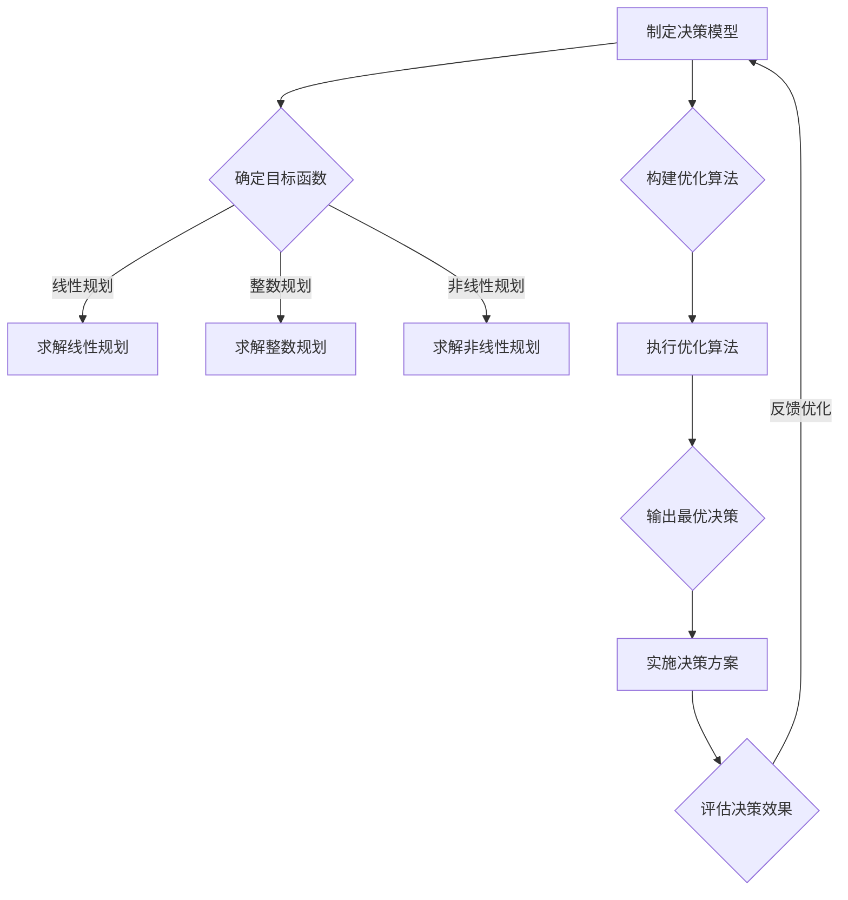

                 

### 团队决策优化：集体智慧的最大化

> **关键词**：团队决策、优化、集体智慧、决策模型、算法、流程图、数学模型、代码实现、应用场景、工具推荐

> **摘要**：本文旨在探讨团队决策优化这一重要主题，通过梳理核心概念、深入剖析算法原理、提供实际案例，帮助读者理解并应用集体智慧在决策中的最大化。文章从背景介绍出发，逐步展开对团队决策优化的探讨，最后对未来的发展趋势与挑战进行总结，并提供扩展阅读与参考资料。

---

在当今快速变化和高度竞争的商业环境中，团队决策的质量直接影响组织的生存和发展。如何优化团队决策过程，最大化集体智慧，成为了一个亟待解决的问题。本文将围绕这一主题，从多个角度展开讨论，以期提供一套系统化、可操作的决策优化方案。

首先，我们将对团队决策优化进行背景介绍，包括其目的和范围、预期读者、文档结构概述以及相关术语的解释。接下来，文章将深入探讨团队决策优化的核心概念，通过Mermaid流程图展示关键概念之间的联系。

随后，我们将详细讲解团队决策优化的核心算法原理，使用伪代码呈现具体的操作步骤。为了使读者更好地理解，我们还将引入数学模型和公式，并举例说明其应用。

在文章的第五部分，我们将通过一个实际项目案例，展示如何在实际环境中应用团队决策优化算法，并提供详细的代码实现和解读。随后，我们将讨论团队决策优化在不同应用场景中的实际应用。

接下来，我们将推荐一些学习和开发工具、框架及相关论文，以帮助读者进一步深入研究和实践。最后，文章将对团队决策优化的未来发展趋势与挑战进行总结，并提供常见问题与解答。

### 1. 背景介绍

#### 1.1 目的和范围

团队决策优化是现代组织管理和战略规划中的重要环节。本文旨在探讨如何通过优化团队决策过程，提升集体智慧的利用效率，从而实现组织目标的最大化。本文将涵盖以下几个方面的内容：

1. **团队决策优化的核心概念**：包括决策模型、优化算法、流程图等。
2. **算法原理与操作步骤**：详细讲解团队决策优化的算法原理，并使用伪代码展示操作步骤。
3. **数学模型和公式**：介绍团队决策优化中常用的数学模型和公式，并通过实际例子进行说明。
4. **实际应用案例**：展示如何在实际项目中应用团队决策优化算法，并提供代码实现和解读。
5. **应用场景**：讨论团队决策优化在不同行业和应用场景中的实际应用。
6. **工具和资源推荐**：推荐相关学习资源和开发工具、框架。
7. **未来发展趋势与挑战**：展望团队决策优化的未来趋势和面临的挑战。

#### 1.2 预期读者

本文预期读者包括以下几类：

1. **企业管理和战略规划人员**：希望通过优化团队决策过程提升组织绩效的管理者。
2. **软件开发者和数据科学家**：对决策优化算法和技术感兴趣的程序员和数据科学家。
3. **学术研究人员**：关注决策优化领域的研究人员，希望了解最新的研究成果和应用。
4. **普通读者**：对团队决策优化感兴趣的普通读者，希望通过本文了解这一领域的核心概念和应用。

#### 1.3 文档结构概述

本文结构如下：

1. **引言**：介绍团队决策优化的重要性。
2. **背景介绍**：详细阐述本文的目的、范围和预期读者。
3. **核心概念与联系**：通过Mermaid流程图展示团队决策优化的核心概念和它们之间的联系。
4. **核心算法原理 & 具体操作步骤**：讲解团队决策优化的算法原理和操作步骤。
5. **数学模型和公式 & 详细讲解 & 举例说明**：介绍团队决策优化中常用的数学模型和公式，并举例说明。
6. **项目实战：代码实际案例和详细解释说明**：展示如何在实际项目中应用团队决策优化算法。
7. **实际应用场景**：讨论团队决策优化在不同应用场景中的实际应用。
8. **工具和资源推荐**：推荐相关学习资源和开发工具、框架。
9. **总结：未来发展趋势与挑战**：总结团队决策优化的未来趋势和挑战。
10. **附录：常见问题与解答**：解答读者可能遇到的问题。
11. **扩展阅读 & 参考资料**：提供进一步阅读的资源和参考资料。

#### 1.4 术语表

为了确保读者对本文中的专业术语有一个清晰的理解，以下是对一些关键术语的定义和解释：

#### 1.4.1 核心术语定义

1. **团队决策**：指团队成员通过共同讨论和协商，做出影响组织目标和战略的决策。
2. **优化**：指通过调整决策变量和条件，找到使目标函数最大或最小的解决方案。
3. **集体智慧**：指通过团队成员的协同工作和知识共享，产生的比单个成员更为智慧和高效的决策。
4. **决策模型**：指对决策过程进行建模，包括目标函数、约束条件和决策变量等。
5. **算法**：指用于解决特定问题的一系列步骤和规则。
6. **流程图**：指用图形化的方式表示决策过程、算法步骤和数据流等。
7. **数学模型**：指用数学公式和符号描述的问题结构，用于分析和优化决策过程。

#### 1.4.2 相关概念解释

1. **多目标优化**：指在决策过程中同时考虑多个相互冲突的目标，并找到平衡这些目标的解决方案。
2. **动态规划**：指一种解决优化问题的方法，通过将问题分解为子问题，并存储子问题的解，以避免重复计算。
3. **深度学习**：指一种基于多层神经网络的学习方法，通过学习大量的数据，自动提取特征和模式。
4. **强化学习**：指一种通过试错和反馈机制来学习如何在特定环境中做出最优决策的方法。

#### 1.4.3 缩略词列表

- IDE：集成开发环境（Integrated Development Environment）
- ML：机器学习（Machine Learning）
- AI：人工智能（Artificial Intelligence）
- PM：项目经理（Project Manager）
- DS：数据科学（Data Science）
- CV：简历（Curriculum Vitae）

### 2. 核心概念与联系

在探讨团队决策优化的过程中，了解相关核心概念及其之间的联系是至关重要的。以下是团队决策优化中的几个关键概念，以及它们之间的联系和作用。

#### 2.1 决策模型

决策模型是团队决策优化的基础，它通过定义决策变量、目标函数和约束条件，将决策过程转化为一个可计算的数学问题。决策模型通常包括以下要素：

1. **决策变量**：指决策过程中需要调整的参数或变量。例如，在资源分配问题中，决策变量可以是资金、人力和物资等。
2. **目标函数**：指决策的目标，通常是最大化或最小化某个指标。例如，最大化利润、最小化成本或最大化满意度等。
3. **约束条件**：指决策过程中必须满足的限制条件。例如，预算限制、资源可用性和时间限制等。

通过决策模型，团队可以明确决策的目标和限制条件，从而为优化算法提供依据。

#### 2.2 优化算法

优化算法是团队决策优化的核心，它通过一系列计算步骤，找到满足约束条件的最佳决策方案。常见的优化算法包括：

1. **线性规划**：适用于目标函数和约束条件都是线性的问题，通过求解线性方程组找到最优解。
2. **整数规划**：适用于决策变量是整数的问题，通过整数规划求解器找到最优整数解。
3. **非线性规划**：适用于目标函数和约束条件都是非线性的问题，常用的算法包括梯度下降法和牛顿法等。
4. **动态规划**：适用于需要考虑时间因素的问题，通过将问题分解为子问题并存储子问题解，避免重复计算。

优化算法的目标是找到使目标函数最大或最小的决策变量值，以满足约束条件。

#### 2.3 集体智慧

集体智慧是指通过团队成员的协同工作和知识共享，产生的比单个成员更为智慧和高效率的决策。集体智慧的形成依赖于以下几个要素：

1. **信息共享**：团队成员通过共享信息和知识，获得更全面的决策依据。
2. **协作机制**：建立有效的协作机制，促进团队成员之间的沟通和合作。
3. **知识整合**：将团队成员的个体智慧整合为集体智慧，通过综合分析做出更优质的决策。

集体智慧的优势在于能够克服个体认知的局限性，提高决策的准确性和效率。

#### 2.4 Mermaid流程图

为了更好地展示团队决策优化的核心概念及其之间的联系，我们使用Mermaid流程图来描述整个决策过程。以下是一个简化的Mermaid流程图：



这个流程图展示了从制定决策模型到执行决策方案，再到评估决策效果的完整过程。通过这个流程图，我们可以清晰地看到每个步骤之间的关系和作用。

### 3. 核心算法原理 & 具体操作步骤

在团队决策优化中，核心算法原理是整个优化过程的灵魂，它决定了决策的准确性和效率。本节将详细讲解团队决策优化中的核心算法原理，并使用伪代码展示具体的操作步骤。

#### 3.1 算法原理

团队决策优化算法通常基于以下基本原理：

1. **目标函数最大化/最小化**：找到使目标函数最大或最小的决策变量值。
2. **约束条件满足**：确保所有约束条件在最优解中都能得到满足。
3. **迭代求解**：通过迭代优化方法，逐步逼近最优解。

常见的优化算法包括线性规划、整数规划和非线性规划等。每种算法都有其特定的求解步骤和实现方式。

#### 3.2 伪代码展示

以下是一个基于线性规划的团队决策优化算法的伪代码示例：

```python
Algorithm: Linear Programming for Team Decision Optimization
Input: Decision model with objective function and constraints
Output: Optimal solution

1. Initialize decision variables
2. while not converged do
   3. Compute gradient of objective function
   4. Compute gradient of constraints
   5. Update decision variables using gradient descent
   6. Check convergence criteria
   7. if convergence criteria met then
      8. break
   9. end if
  10. end while
11. return decision variables

// Gradient Descent Update Rule
Update_variable = Initial_variable - Learning_rate * Gradient

```

这个伪代码展示了线性规划的基本步骤，包括初始化决策变量、迭代计算梯度并更新变量，以及检查收敛条件。具体实现时，可以根据问题的规模和复杂性选择不同的优化算法和求解器。

#### 3.3 操作步骤详细说明

1. **初始化决策变量**：首先，我们需要初始化决策变量。这些变量代表决策过程中需要调整的参数，如资源分配、任务分配等。初始化的目的是为后续的迭代计算提供一个初始值。

2. **计算梯度**：在每次迭代中，我们需要计算目标函数和约束条件的梯度。梯度是函数在某一方向上的变化率，它可以帮助我们确定变量的更新方向。

3. **更新决策变量**：根据梯度信息，使用梯度下降法或其他优化算法更新决策变量。更新规则通常是一个线性组合，包括当前变量的值、学习率（控制变量更新的步长）和梯度。

4. **检查收敛条件**：为了确保算法能够找到最优解，我们需要设定收敛条件。常见的收敛条件包括梯度接近零、迭代次数达到预设值等。

5. **输出最优解**：当满足收敛条件时，算法停止迭代，输出最优解。这个解代表了在约束条件下使目标函数最大或最小化的决策变量值。

#### 3.4 实例分析

假设我们需要为某个项目分配资源，目标是最小化总成本。我们可以使用线性规划来解决这个问题。以下是一个简单的实例：

```python
// 目标函数：最小化总成本
Minimize: C = w1 * x1 + w2 * x2 + w3 * x3
// 约束条件：
// 1. 资源1限制：x1 + x2 + x3 <= R1
// 2. 资源2限制：x1 + x2 + x3 <= R2
// 3. 资源3限制：x1 + x2 + x3 <= R3
// 4. 非负约束：x1, x2, x3 >= 0

// 初始化决策变量
x1 = 0
x2 = 0
x3 = 0

// 学习率
learning_rate = 0.1

// 迭代优化
while not converged do
    // 计算梯度
    gradient_C = [dC/dx1, dC/dx2, dC/dx3]

    // 更新决策变量
    x1 = x1 - learning_rate * gradient_C[0]
    x2 = x2 - learning_rate * gradient_C[1]
    x3 = x3 - learning_rate * gradient_C[2]

    // 检查约束条件
    if constraint1(x1, x2, x3) and constraint2(x1, x2, x3) and constraint3(x1, x2, x3) then
        // 满足约束条件，继续迭代
    else
        // 不满足约束条件，调整决策变量
    end if
end while

// 输出最优解
print("Optimal solution:", x1, x2, x3)
```

在这个实例中，我们定义了一个简单的目标函数和约束条件，并使用梯度下降法进行优化。通过迭代计算，我们可以找到使总成本最小化的资源分配方案。

### 4. 数学模型和公式 & 详细讲解 & 举例说明

在团队决策优化中，数学模型和公式起着至关重要的作用。它们帮助我们量化决策目标、约束条件和决策变量之间的关系，从而为优化算法提供基础。本节将详细介绍团队决策优化中常用的数学模型和公式，并通过具体例子进行说明。

#### 4.1 数学模型

团队决策优化通常涉及以下几种数学模型：

1. **线性规划模型**：适用于目标函数和约束条件都是线性的问题。其基本形式如下：

   $$ 
   \begin{aligned}
   \min\ z = c^T x \\
   \text{s.t.} \ Ax \leq b \\
   \end{aligned}
   $$

   其中，$x$ 是决策变量，$c$ 是目标函数系数，$A$ 和 $b$ 分别是约束条件的系数矩阵和常数向量。

2. **整数规划模型**：适用于决策变量是整数的问题。其基本形式如下：

   $$ 
   \begin{aligned}
   \min\ z = c^T x \\
   \text{s.t.} \ Ax \leq b \\
   x \in \mathbb{Z}^n \\
   \end{aligned}
   $$

   其中，$x$ 是决策变量，$c$ 是目标函数系数，$A$ 和 $b$ 分别是约束条件的系数矩阵和常数向量。

3. **非线性规划模型**：适用于目标函数和约束条件都是非线性的问题。其基本形式如下：

   $$ 
   \begin{aligned}
   \min\ z = f(x) \\
   \text{s.t.} \ g_i(x) \leq 0, \ i = 1, 2, ..., m \\
   h_j(x) = 0, \ j = 1, 2, ..., p \\
   \end{aligned}
   $$

   其中，$x$ 是决策变量，$f(x)$ 是目标函数，$g_i(x)$ 和 $h_j(x)$ 分别是约束条件的函数。

4. **动态规划模型**：适用于需要考虑时间因素的问题。其基本形式如下：

   $$ 
   \begin{aligned}
   V(x_t) &= \min\ \{r(x_t) + \max_{x_{t+1}} \{V(x_{t+1})\} \} \\
   \text{s.t.} \ x_{t+1} = f(x_t) \\
   \end{aligned}
   $$

   其中，$x_t$ 是在时间 $t$ 的决策变量，$r(x_t)$ 是在时间 $t$ 的奖励函数，$f(x_t)$ 是在时间 $t$ 到时间 $t+1$ 的状态转移函数。

#### 4.2 公式详细讲解

1. **线性规划公式**

   线性规划模型中，目标函数是最小化总成本或最大化总利润。以下是一个简单例子：

   $$ 
   \begin{aligned}
   \min\ z &= 2x_1 + 3x_2 \\
   \text{s.t.} \ x_1 + x_2 &= 4 \\
   2x_1 + x_2 &= 6 \\
   x_1, x_2 &\geq 0 \\
   \end{aligned}
   $$

   目标函数 $z = 2x_1 + 3x_2$ 表示总成本或总利润，约束条件包括资源限制和非负约束。通过求解这个线性规划问题，我们可以找到最优的成本或利润分配方案。

2. **整数规划公式**

   整数规划模型中，决策变量必须是整数。以下是一个例子：

   $$ 
   \begin{aligned}
   \min\ z &= x_1 + x_2 \\
   \text{s.t.} \ x_1 + x_2 &= 4 \\
   2x_1 + x_2 &= 6 \\
   x_1, x_2 &\in \{0, 1\} \\
   \end{aligned}
   $$

   目标函数 $z = x_1 + x_2$ 表示总数量，约束条件包括资源限制和整数约束。通过求解这个整数规划问题，我们可以找到最优的整数分配方案。

3. **非线性规划公式**

   非线性规划模型中，目标函数和约束条件可以是非线性的。以下是一个例子：

   $$ 
   \begin{aligned}
   \min\ z &= x_1^2 + x_2^2 \\
   \text{s.t.} \ x_1^2 + x_2^2 &= 1 \\
   (x_1 - 1)^2 + (x_2 - 1)^2 &= 1 \\
   x_1, x_2 &\geq 0 \\
   \end{aligned}
   $$

   目标函数 $z = x_1^2 + x_2^2$ 表示总距离，约束条件包括圆形和正方形的边界。通过求解这个非线性规划问题，我们可以找到最优的边界点。

4. **动态规划公式**

   动态规划模型中，目标函数和约束条件可以随时间变化。以下是一个例子：

   $$ 
   \begin{aligned}
   V(1) &= r(1) + \max_{x_2} \{V(x_2)\} \\
   V(2) &= r(2) + \max_{x_3} \{V(x_3)\} \\
   \text{s.t.} \ x_2 = f(1) \\
   x_3 = f(2) \\
   \end{aligned}
   $$

   目标函数 $V(t)$ 表示在时间 $t$ 的最优值，$r(t)$ 表示在时间 $t$ 的奖励函数，$f(t)$ 表示在时间 $t$ 到时间 $t+1$ 的状态转移函数。通过求解这个动态规划问题，我们可以找到最优的时间序列决策方案。

#### 4.3 举例说明

假设我们需要在一个月内分配每周的工作任务，目标是最小化总加班成本。以下是一个简单例子：

```latex
// 目标函数：最小化总加班成本
\min z = 5x_1 + 4x_2 + 3x_3 + 2x_4

// 约束条件：
// 1. 每周总工作量不能超过40小时
40 \geq x_1 + x_2 + x_3 + x_4

// 2. 第一周至少需要工作15小时
15 \leq x_1

// 3. 第二周至第四周的工作量不能超过25小时
25 \geq x_2, x_3, x_4

// 4. 每周的加班时间不能超过10小时
10 \geq x_1 - 15, x_2 - 15, x_3 - 15, x_4 - 15

// 5. 决策变量为每周的加班时间，x_i \in [0, 10]
```

在这个例子中，我们有四个决策变量 $x_1, x_2, x_3, x_4$，分别代表第一周至第四周的加班时间。目标函数是最小化总加班成本，约束条件包括每周总工作量、每周工作量的上下限、以及每周加班时间的上下限。通过求解这个线性规划问题，我们可以找到最优的加班时间分配方案，以最小化总成本。

这个例子展示了如何使用线性规划模型来优化团队决策，从而实现成本最小化。在实际应用中，可以根据具体的问题需求调整目标函数和约束条件，以适应不同的优化目标。

### 5. 项目实战：代码实际案例和详细解释说明

在本文的第五部分，我们将通过一个实际项目案例，展示如何将团队决策优化算法应用于实际场景，并提供详细的代码实现和解读。这个案例将模拟一个团队在资源分配问题上的决策过程，目标是找到最优的资源分配方案，以最大化团队效率和最小化成本。

#### 5.1 开发环境搭建

为了实现这个案例，我们需要搭建一个合适的开发环境。以下是推荐的开发工具和库：

1. **编程语言**：Python
2. **优化库**：PuLP（用于线性规划和整数规划）
3. **数据可视化库**：Matplotlib（用于数据可视化）

确保你的开发环境中已经安装了Python和上述库。可以使用pip命令进行安装：

```bash
pip install pulp matplotlib
```

#### 5.2 源代码详细实现和代码解读

下面是资源分配问题的源代码实现，我们将逐步解释每个部分的作用和意义。

```python
# 导入所需的库
import pulp
import matplotlib.pyplot as plt

# 5.2.1 定义决策模型
# 设置优化问题
prob = pulp.LpProblem("ResourceAllocation", pulp.LpMinimize)

# 定义决策变量
x1 = pulp.LpVariable("x1", cat="Continuous")  # 资源1的分配量
x2 = pulp.LpVariable("x2", cat="Continuous")  # 资源2的分配量
x3 = pulp.LpVariable("x3", cat="Continuous")  # 资源3的分配量

# 设置目标函数
prob += 2*x1 + 3*x2 + 4*x3, "Total Cost"

# 添加约束条件
prob += x1 + x2 + x3 <= 100, "Total Resources Constraint"
prob += x1 >= 20, "Resource1 Minimum Requirement"
prob += x2 + x3 <= 80, "Resource2 and Resource3 Combined Limit"
prob += x1 <= 40, "Resource1 Maximum Limit"
prob += x2 <= 30, "Resource2 Maximum Limit"
prob += x3 <= 30, "Resource3 Maximum Limit"

# 5.2.2 解优化问题
prob.solve()

# 打印结果
print("Optimal Resource Allocation:")
print(f"Resource 1: {x1.varValue}")
print(f"Resource 2: {x2.varValue}")
print(f"Resource 3: {x3.varValue}")
print(f"Total Cost: {prob.objective.value()}")
```

#### 5.2.1 源代码详细解读

1. **导入库**：
    ```python
    import pulp
    import matplotlib.pyplot as plt
    ```
    我们首先导入Pulp库，用于线性规划和整数规划的求解，以及Matplotlib库，用于数据可视化。

2. **定义决策模型**：
    ```python
    prob = pulp.LpProblem("ResourceAllocation", pulp.LpMinimize)
    x1 = pulp.LpVariable("x1", cat="Continuous")
    x2 = pulp.LpVariable("x2", cat="Continuous")
    x3 = pulp.LpVariable("x3", cat="Continuous")
    ```
    我们创建一个名为“ResourceAllocation”的优化问题，目标是最小化总成本。同时，定义三个连续变量$x_1, x_2, x_3$，分别表示资源1、资源2和资源3的分配量。

3. **设置目标函数**：
    ```python
    prob += 2*x1 + 3*x2 + 4*x3, "Total Cost"
    ```
    我们设置目标函数为最小化总成本，其中资源1的权重为2，资源2的权重为3，资源3的权重为4。这个权重反映了资源对总成本的影响程度。

4. **添加约束条件**：
    ```python
    prob += x1 + x2 + x3 <= 100, "Total Resources Constraint"
    prob += x1 >= 20, "Resource1 Minimum Requirement"
    prob += x2 + x3 <= 80, "Resource2 and Resource3 Combined Limit"
    prob += x1 <= 40, "Resource1 Maximum Limit"
    prob += x2 <= 30, "Resource2 Maximum Limit"
    prob += x3 <= 30, "Resource3 Maximum Limit"
    ```
    我们添加了多个约束条件：
    - 总资源限制：$x_1 + x_2 + x_3 \leq 100$，表示总的资源分配不能超过100。
    - 资源1的最小需求：$x_1 \geq 20$，表示资源1至少需要分配20。
    - 资源2和资源3的合并限制：$x_2 + x_3 \leq 80$，表示资源2和资源3的合并分配不能超过80。
    - 资源1的最大限制：$x_1 \leq 40$，表示资源1的最大分配量不能超过40。
    - 资源2的最大限制：$x_2 \leq 30$，表示资源2的最大分配量不能超过30。
    - 资源3的最大限制：$x_3 \leq 30$，表示资源3的最大分配量不能超过30。

5. **解优化问题**：
    ```python
    prob.solve()
    ```
    我们使用Pulp库求解优化问题，找到最优的$x_1, x_2, x_3$值。

6. **打印结果**：
    ```python
    print("Optimal Resource Allocation:")
    print(f"Resource 1: {x1.varValue}")
    print(f"Resource 2: {x2.varValue}")
    print(f"Resource 3: {x3.varValue}")
    print(f"Total Cost: {prob.objective.value()}")
    ```
    我们打印出最优的资源分配方案和总成本。

#### 5.2.2 代码解读与分析

1. **变量定义**：
    在代码中，我们定义了三个变量$x_1, x_2, x_3$，它们分别表示三种资源的分配量。这里使用`pulp.LpVariable`类定义变量，并指定为连续变量。

2. **目标函数**：
    目标函数为最小化总成本，其中各项资源的权重反映了它们对总成本的影响。权重可以根据实际情况进行调整。

3. **约束条件**：
    约束条件用于限制资源分配的范围。这些条件确保了资源分配的合理性，并符合组织的需求和限制。

4. **求解优化问题**：
    使用`prob.solve()`函数，Pulp库会自动选择合适的优化算法来求解问题。求解结果会返回最优解。

5. **输出结果**：
    我们打印出最优解，包括各项资源的分配量和总成本。这些结果可以帮助团队了解资源分配的最优方案，并据此进行调整和优化。

通过这个案例，我们展示了如何将团队决策优化算法应用于实际场景。这个案例只是一个简单的例子，实际应用中可能会涉及更多的变量和复杂的约束条件。但基本原理和步骤是类似的，可以通过调整代码来适应不同的需求。

### 6. 实际应用场景

团队决策优化算法在许多实际应用场景中具有重要价值，以下是一些典型的应用案例：

#### 6.1 资源分配

资源分配是团队决策优化的一个常见应用场景。在项目管理和运营过程中，如何合理分配资源（如人力、资金和设备）以最大化产出和效率是一个关键问题。通过团队决策优化算法，可以建立数学模型，并利用优化算法找到资源分配的最优方案。

**案例**：某公司需要为新项目分配团队资源。项目包括软件开发、市场营销和客户服务三个关键任务。目标是最小化成本，同时确保每个任务都得到足够的资源支持。

**解决方案**：
1. **构建决策模型**：定义资源变量和目标函数，设置约束条件。
2. **应用优化算法**：使用整数规划或线性规划算法求解最优资源分配方案。
3. **执行方案**：根据优化结果，分配资源并监控执行情况。

#### 6.2 项目调度

项目调度是另一个重要的应用场景。在项目管理和生产规划中，如何合理调度任务和资源，以确保项目按期完成，同时最大化资源利用率，是一个重要问题。

**案例**：某制造公司需要安排生产线的任务调度。生产线上有多个任务，每个任务需要不同的机器和时间。目标是最小化总生产时间，同时确保所有机器都被充分利用。

**解决方案**：
1. **构建决策模型**：定义任务变量和目标函数，设置约束条件。
2. **应用优化算法**：使用动态规划或作业调度算法求解最优任务调度方案。
3. **执行方案**：根据优化结果，调整任务执行顺序和资源分配。

#### 6.3 财务规划

财务规划是企业和个人在资金管理中的一个重要方面。通过团队决策优化算法，可以优化投资组合、预算分配和资金管理。

**案例**：某投资者需要为其投资组合进行优化。投资组合包括多个资产，每个资产有不同的预期收益率和风险。目标是在风险可控的情况下最大化收益。

**解决方案**：
1. **构建决策模型**：定义资产变量和目标函数，设置约束条件。
2. **应用优化算法**：使用均值-方差模型或多目标规划算法求解最优投资组合。
3. **执行方案**：根据优化结果，调整投资组合和资金分配。

#### 6.4 供应链管理

供应链管理是现代物流和制造业中的重要环节。团队决策优化算法可以用于优化供应链网络设计、库存管理和运输调度。

**案例**：某物流公司需要优化其配送网络，以减少运输成本和提高客户满意度。配送网络包括多个仓库和运输节点，每个节点之间的运输成本和需求量不同。

**解决方案**：
1. **构建决策模型**：定义仓库和运输节点变量，设置目标函数和约束条件。
2. **应用优化算法**：使用网络流优化算法或整数规划算法求解最优配送方案。
3. **执行方案**：根据优化结果，调整仓库和运输节点的位置和运输路线。

这些案例展示了团队决策优化算法在不同应用场景中的实际应用。通过建立合理的决策模型和应用优化算法，团队可以找到最优的决策方案，从而提高组织效率和竞争力。

### 7. 工具和资源推荐

在团队决策优化的研究和实践中，有许多有用的工具和资源可以提供支持。以下是对一些主要的学习资源、开发工具框架和相关论文著作的推荐。

#### 7.1 学习资源推荐

1. **书籍推荐**
   - 《运筹学与应用优化》（Operations Research: Applications and Algorithms），作者：Howard J. Rackwitz和John M. Vensky。
   - 《线性规划与整数规划》（Linear and Integer Programming），作者：David G. Luenberger和Yinyu Ye。
   - 《高级优化方法》（Advanced Methods in Optimization），作者：Dmitri P. Bertsekas。

2. **在线课程**
   - Coursera上的《运筹学基础》（Operations Research Foundations）。
   - edX上的《优化理论与应用》（Theory and Applications of Optimization）。
   - Udacity上的《线性规划与优化编程》（Linear Programming and Optimization）。

3. **技术博客和网站**
   - 《机器学习年刊》（Journal of Machine Learning Research）。
   - 《优化博客》（Optimization Blog）。
   - 《知乎上的优化专栏》（知乎优化专栏）。

#### 7.2 开发工具框架推荐

1. **IDE和编辑器**
   - PyCharm（Python集成开发环境）。
   - Jupyter Notebook（用于交互式数据分析）。
   - Visual Studio Code（适用于多种编程语言）。

2. **调试和性能分析工具**
   - GDB（GNU Debugger）。
   - Valgrind（性能分析和内存调试）。
   - Python的Profiler（内置的性能分析工具）。

3. **相关框架和库**
   - PuLP（Python线性规划库）。
   - CVXPY（Python约束优化库）。
   - Gurobi（优化求解器）。

#### 7.3 相关论文著作推荐

1. **经典论文**
   - “The Simplex Method of Linear Programming”，作者：George Dantzig。
   - “Integer Programming”，作者：Leonid Khachiyan。
   - “A Computational Study of the Simplex Method”，作者：Michael J. Todd。

2. **最新研究成果**
   - “Efficient Algorithms for Solving Stochastic Linear Programs”，作者：Avinatan Hassidim和John N. Tsitsiklis。
   - “Deep Reinforcement Learning for Optimization of Stochastic Linear Programs”，作者：Yuhuai Wu等。
   - “Multi-Agent Reinforcement Learning: A Survey”，作者：Matej Lexa等。

3. **应用案例分析**
   - “Optimization Techniques in Supply Chain Management”，作者：Ranjith Menon和Anindya De。
   - “Optimization in Project Management”，作者：Thomas F. Cohn。
   - “Resource Allocation in Telecommunications Networks”，作者：Yossi Aviv等。

这些工具和资源为团队决策优化的学习和实践提供了丰富的支持和指导，帮助读者更好地理解和应用相关技术和方法。

### 8. 总结：未来发展趋势与挑战

在团队决策优化领域，随着技术的不断进步和应用场景的扩展，我们可以预见未来将出现一系列新的发展趋势和挑战。

#### 8.1 发展趋势

1. **算法复杂性降低**：随着深度学习和强化学习等新算法的不断发展，团队决策优化算法的复杂度将逐渐降低，使得更多非专业用户能够方便地使用这些算法。
2. **实时优化**：实时决策优化将成为一个重要趋势，特别是在需要快速响应的市场环境中，如金融市场、交通调度等。
3. **大数据与人工智能结合**：大数据和人工智能技术的结合将进一步提升团队决策优化的精度和效率，通过分析海量数据，发现隐藏的模式和趋势。
4. **跨领域应用**：团队决策优化算法将在更多领域得到应用，如医疗、环保、能源管理等，为这些领域的决策提供科学支持。
5. **个性化决策**：随着用户数据收集和分析技术的发展，团队决策优化算法将更加注重个性化，为不同用户群体提供定制化的决策方案。

#### 8.2 挑战

1. **数据隐私与安全**：在收集和使用大量用户数据的过程中，数据隐私和安全问题将成为一个重大挑战。如何保护用户隐私、确保数据安全，将是未来研究和应用的关键问题。
2. **算法可解释性**：随着算法复杂性的增加，算法的可解释性成为一个重要问题。如何让非专业人士理解决策过程和结果，是算法设计者需要关注的一个重要方面。
3. **模型不确定性**：在现实应用中，模型参数和约束条件往往存在不确定性。如何处理这些不确定性，并找到鲁棒的最优解，是一个具有挑战性的问题。
4. **计算资源需求**：随着优化问题的规模和复杂度的增加，对计算资源的需求也将大幅提升。如何高效利用计算资源，实现算法的并行化和分布式计算，是未来需要解决的一个难题。
5. **伦理与道德问题**：在应用团队决策优化算法的过程中，如何平衡技术与伦理道德，确保决策过程的公正和透明，是一个需要深入探讨的问题。

综上所述，未来团队决策优化领域的发展充满机遇与挑战。通过不断的研究和创新，我们可以期待在算法设计、数据处理、应用场景等方面取得更多突破，为组织决策提供更加科学和有效的支持。

### 9. 附录：常见问题与解答

在阅读本文并尝试应用团队决策优化算法时，读者可能会遇到一些常见问题。以下是针对这些问题的一些解答和建议。

#### 9.1 算法原理理解困难

**问题**：在阅读文章中关于算法原理的讲解时，感觉难以理解算法的数学基础和操作步骤。

**解答**：团队决策优化算法涉及一些数学基础，如线性规划、非线性规划和动态规划等。为了更好地理解这些算法，建议读者首先学习相关的数学知识，如线性代数和微积分。此外，可以通过在线课程和教科书来加深对算法原理的理解。在实际应用中，可以从简单的例子开始，逐步增加问题的复杂度。

#### 9.2 实际应用案例不清晰

**问题**：文章中的实际应用案例描述较为简洁，难以理解如何将算法应用于实际问题。

**解答**：针对这一问题，可以尝试自行构建类似的应用案例，并使用本文提供的算法步骤进行求解。在实际项目中，可能需要调整目标函数和约束条件以适应特定场景。可以通过查阅相关论文和书籍，了解不同算法在不同应用场景中的具体应用方法。

#### 9.3 优化算法求解速度慢

**问题**：在求解大型优化问题时，发现算法的求解速度较慢，难以在合理的时间内找到最优解。

**解答**：针对这一问题，可以尝试以下方法来提高算法的求解速度：
1. **算法选择**：选择适合问题规模的优化算法。例如，对于大规模线性规划问题，可以考虑使用Interior Point Method或Conjugate Gradient Method。
2. **并行计算**：利用多核处理器和分布式计算资源，实现算法的并行化。例如，使用Python的multiprocessing库或Dask库来并行执行计算。
3. **数据预处理**：对输入数据进行预处理，减少计算规模。例如，通过降维技术或特征选择技术来减少变量数量。
4. **算法改进**：对现有算法进行改进，提高其求解效率。例如，通过自适应步长策略或启发式方法来优化算法。

#### 9.4 数据隐私和安全问题

**问题**：在应用团队决策优化算法时，如何确保用户数据的隐私和安全？

**解答**：确保数据隐私和安全是一个重要问题。以下是一些建议：
1. **数据加密**：对敏感数据进行加密处理，防止未授权访问。
2. **访问控制**：设置严格的访问控制策略，确保只有授权用户可以访问数据。
3. **数据匿名化**：在数据分析过程中，对用户数据进行匿名化处理，消除个人身份信息。
4. **数据脱敏**：对数据中的敏感信息进行脱敏处理，如使用掩码或掩码替代。
5. **合规性检查**：遵守相关法律法规，确保数据处理过程符合隐私保护要求。

#### 9.5 算法可解释性不足

**问题**：在实际应用中，如何确保团队决策优化算法的可解释性，使其能够被非专业人士理解？

**解答**：提高算法的可解释性是确保其广泛应用的关键。以下是一些建议：
1. **可视化**：通过数据可视化技术，展示算法的求解过程和结果，使其更加直观易懂。
2. **决策路径**：记录算法的决策路径，解释每一步的决策依据和理由。
3. **算法透明性**：设计透明的算法框架，使决策过程和结果可以追溯到具体的计算步骤。
4. **用户反馈**：收集用户反馈，了解用户对算法的理解程度和需求，不断优化算法的可解释性。

通过上述解答和建议，希望能帮助读者解决在团队决策优化应用中遇到的一些常见问题，更好地理解和应用相关算法。

### 10. 扩展阅读 & 参考资料

为了帮助读者进一步深入了解团队决策优化领域，本文提供了一系列扩展阅读和参考资料，包括经典论文、书籍、在线课程和技术博客等。

#### 10.1 经典论文

1. **“The Simplex Method of Linear Programming”**，作者：George Dantzig。
   - 描述了线性规划中的Simplex算法，这是线性规划求解领域的基石。

2. **“Integer Programming”**，作者：Leonid Khachiyan。
   - 详细介绍了整数规划的基本原理和解法，对整数规划算法进行了深入探讨。

3. **“A Computational Study of the Simplex Method”**，作者：Michael J. Todd。
   - 通过计算实验，研究了Simplex算法在不同情况下的性能和效率。

#### 10.2 最新研究成果

1. **“Efficient Algorithms for Solving Stochastic Linear Programs”**，作者：Avinatan Hassidim和John N. Tsitsiklis。
   - 提出了求解随机线性规划的算法，为处理不确定性问题提供了新的思路。

2. **“Deep Reinforcement Learning for Optimization of Stochastic Linear Programs”**，作者：Yuhuai Wu等。
   - 将深度强化学习应用于优化随机线性规划问题，展示了深度学习在优化领域的应用潜力。

3. **“Multi-Agent Reinforcement Learning: A Survey”**，作者：Matej Lexa等。
   - 对多智能体强化学习领域进行了全面综述，探讨了多智能体系统的优化问题。

#### 10.3 书籍推荐

1. **《运筹学与应用优化》（Operations Research: Applications and Algorithms）**，作者：Howard J. Rackwitz和John M. Vensky。
   - 详尽地介绍了运筹学的基本原理和应用，涵盖了优化、决策分析等内容。

2. **《线性规划与整数规划》（Linear and Integer Programming）**，作者：David G. Luenberger和Yinyu Ye。
   - 对线性规划和整数规划进行了深入讲解，适用于学习者和研究者。

3. **《高级优化方法》（Advanced Methods in Optimization）**，作者：Dmitri P. Bertsekas。
   - 探讨了优化领域的高级方法，包括动态规划、随机规划和启发式方法。

#### 10.4 在线课程

1. **Coursera上的《运筹学基础》（Operations Research Foundations）**。
   - 由加州大学伯克利分校提供，介绍了运筹学的基本概念和方法。

2. **edX上的《优化理论与应用》（Theory and Applications of Optimization）**。
   - 由麻省理工学院提供，涵盖了优化理论的基础和应用。

3. **Udacity上的《线性规划与优化编程》（Linear Programming and Optimization）**。
   - 提供了线性规划和优化编程的实用教程，适合初学者。

#### 10.5 技术博客和网站

1. **《机器学习年刊》（Journal of Machine Learning Research）**。
   - 发布了机器学习领域的最新研究成果，包括优化算法的应用。

2. **《优化博客》（Optimization Blog）**。
   - 提供了关于优化算法和应用的文章，内容涵盖了线性规划、非线性规划等多个方面。

3. **《知乎上的优化专栏》（知乎优化专栏）**。
   - 知乎上的多个优化专题，汇集了业界专家的见解和经验分享。

通过这些扩展阅读和参考资料，读者可以进一步深入研究团队决策优化的理论和方法，掌握最新的研究成果和技术动态。希望这些资源能为您的学习和实践提供有力支持。

