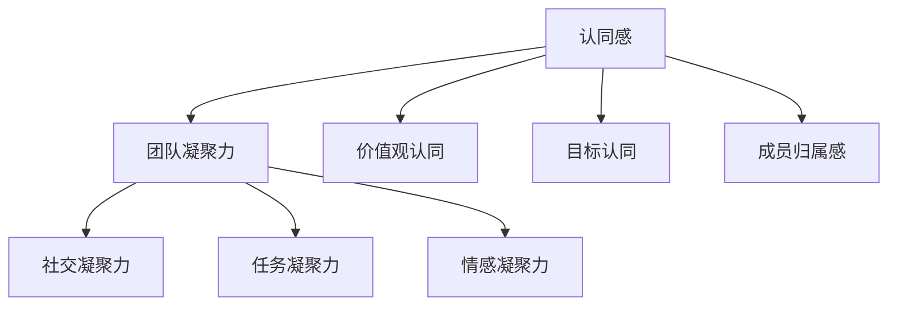

                 

# 团队凝聚力提升：增强认同感的实践策略

> **关键词：团队凝聚力、认同感、实践策略、领导力、沟通、组织文化**
>
> **摘要：本文旨在探讨团队凝聚力的重要性，以及如何通过增强团队成员之间的认同感来提升团队整体效能。文章从核心概念入手，逐步剖析认同感的本质及其对团队凝聚力的影响，提供了一系列实用的实践策略，旨在为IT行业领导者和管理者提供指导和借鉴。**

## 1. 背景介绍

### 1.1 目的和范围

本文的目的是探讨如何通过增强团队成员之间的认同感来提升团队凝聚力。本文旨在为IT行业中的团队领导者和管理者提供一套实践策略，以帮助他们在实际工作中更好地提升团队的协同效率和创造力。

本文将涵盖以下内容：

1. **核心概念与联系**：介绍团队凝聚力、认同感等相关概念及其相互关系。
2. **核心算法原理**：详细阐述如何通过具体操作步骤来提升团队凝聚力。
3. **数学模型和公式**：运用数学模型和公式来解释认同感对团队凝聚力的影响。
4. **项目实战**：通过实际代码案例来展示如何将理论应用于实践。
5. **实际应用场景**：讨论团队凝聚力提升在不同环境下的应用。
6. **工具和资源推荐**：推荐相关的学习资源和工具。
7. **总结与展望**：总结文章的主要观点，并对未来的发展趋势与挑战进行展望。

### 1.2 预期读者

本文的预期读者主要包括：

- **IT行业领导者**：希望通过提升团队凝聚力来增强团队绩效。
- **团队管理者**：希望了解如何通过增强认同感来提高团队效率。
- **技术团队成员**：希望了解团队凝聚力的作用及其提升方法。

### 1.3 文档结构概述

本文的结构如下：

1. **背景介绍**：介绍文章的目的、预期读者和文档结构。
2. **核心概念与联系**：定义团队凝聚力、认同感等核心概念，并绘制流程图。
3. **核心算法原理**：详细阐述提升团队凝聚力的算法原理和具体步骤。
4. **数学模型和公式**：运用数学模型和公式来解释认同感对团队凝聚力的影响。
5. **项目实战**：通过实际案例展示如何将理论应用于实践。
6. **实际应用场景**：讨论团队凝聚力提升在不同环境下的应用。
7. **工具和资源推荐**：推荐相关的学习资源和工具。
8. **总结与展望**：总结文章的主要观点，并对未来趋势与挑战进行展望。

### 1.4 术语表

#### 1.4.1 核心术语定义

- **团队凝聚力**：指团队成员在共同目标下，相互支持、协作和依赖的程度。
- **认同感**：指个体对团队目标和价值观的认同，以及对团队成员的归属感。
- **领导力**：指领导者通过激励、指导和沟通来影响团队成员的能力。

#### 1.4.2 相关概念解释

- **沟通**：指团队成员之间交换信息、观点和感受的过程。
- **组织文化**：指组织内部共享的价值观、信念和行为准则。

#### 1.4.3 缩略词列表

- **IT**：信息技术（Information Technology）
- **ROI**：投资回报率（Return on Investment）
- **敏捷开发**：一种以团队协作和快速迭代为核心的开发方法。

## 2. 核心概念与联系

### 2.1 核心概念

在探讨如何提升团队凝聚力之前，首先需要了解一些核心概念，包括团队凝聚力、认同感等。

#### 团队凝聚力

团队凝聚力是指团队成员在共同目标下，相互支持、协作和依赖的程度。它包括以下三个方面：

1. **社交凝聚力**：指团队成员之间的社交关系和互动。
2. **任务凝聚力**：指团队成员在完成任务过程中形成的协作和依赖。
3. **情感凝聚力**：指团队成员之间的情感联系和归属感。

#### 认同感

认同感是指个体对团队目标和价值观的认同，以及对团队成员的归属感。它包括以下三个方面：

1. **价值观认同**：指个体对团队价值观的认同和接受。
2. **目标认同**：指个体对团队目标的认可和承诺。
3. **成员归属感**：指个体对团队身份的认同和归属。

### 2.2 核心概念之间的联系

团队凝聚力和认同感之间存在着密切的联系。认同感是团队凝聚力的基础，而团队凝聚力则是认同感的体现。以下是它们之间的相互关系：

1. **认同感 → 团队凝聚力**：个体对团队目标和价值观的认同，会促使他们在团队中积极参与、协作和支持，从而增强团队凝聚力。
2. **团队凝聚力 → 认同感**：团队凝聚力的高水平会使团队成员感受到归属感和归属感，进而加深他们对团队目标和价值观的认同。

#### Mermaid 流程图



## 3. 核心算法原理 & 具体操作步骤

### 3.1 核心算法原理

提升团队凝聚力，关键在于增强团队成员之间的认同感。以下是一些核心算法原理，用于实现这一目标：

1. **领导力**：领导者通过激励、指导和沟通来影响团队成员，增强他们的认同感。
2. **沟通**：通过有效的沟通，确保团队成员了解团队目标和价值观，并促进彼此之间的交流。
3. **共同目标**：制定明确的共同目标，使团队成员有共同的方向和动力。
4. **团队建设活动**：通过团队建设活动，增强团队成员之间的互动和信任。
5. **个性化关注**：关注每个团队成员的需求和个性，提高他们的参与度和满意度。

### 3.2 具体操作步骤

以下是提升团队凝聚力的具体操作步骤：

#### 步骤1：明确团队目标和价值观

- **制定明确的共同目标**：确保所有团队成员都清楚团队的目标和方向。
- **传达团队价值观**：确保团队成员了解并接受团队的价值观。

#### 步骤2：增强领导力

- **激励**：领导者要能够激励团队成员，使他们充满动力。
- **指导**：领导者要为团队成员提供指导，帮助他们成长。
- **沟通**：领导者要与团队成员保持开放、积极的沟通。

#### 步骤3：促进沟通

- **建立沟通渠道**：确保团队成员能够方便地沟通和交流。
- **鼓励分享**：鼓励团队成员分享自己的想法和意见。
- **定期反馈**：定期收集团队成员的反馈，了解他们的需求和困惑。

#### 步骤4：开展团队建设活动

- **组织活动**：定期组织团队建设活动，增强团队成员之间的互动和信任。
- **鼓励参与**：鼓励所有团队成员积极参与团队建设活动。

#### 步骤5：关注个性化需求

- **了解需求**：了解每个团队成员的需求和个性，为他们提供个性化的关注和支持。
- **提供资源**：为团队成员提供所需的资源，帮助他们更好地完成任务。

### 3.3 伪代码示例

以下是一个简单的伪代码示例，用于实现提升团队凝聚力的算法：

```
// 定义团队成员对象
class TeamMember {
    String name;
    String role;
    boolean isMotivated;
    boolean understandsGoals;
    boolean trustsTeam;
    // ...
}

// 定义团队对象
class Team {
    List<TeamMember> members;
    String goal;
    String values;
    // ...
}

// 提升团队凝聚力
function enhanceTeamCohesion(Team team) {
    for (TeamMember member : team.members) {
        // 步骤1：明确团队目标和价值观
        member.understandsGoals = true;
        member.values = team.values;

        // 步骤2：增强领导力
        member.isMotivated = true;
        // ...

        // 步骤3：促进沟通
        // ...

        // 步骤4：开展团队建设活动
        // ...

        // 步骤5：关注个性化需求
        // ...
    }
}
```

## 4. 数学模型和公式 & 详细讲解 & 举例说明

### 4.1 数学模型和公式

在探讨团队凝聚力和认同感之间的关系时，可以运用以下数学模型和公式：

#### 4.1.1 成员认同度模型

$$
认同度 = f(价值观认同，目标认同，成员归属感)
$$

其中，认同度是一个综合指标，反映了团队成员对团队的认同程度。$f$ 表示一个函数，用于计算三个因素的加权平均值。

#### 4.1.2 团队凝聚力模型

$$
凝聚力 = g(社交凝聚力，任务凝聚力，情感凝聚力)
$$

其中，凝聚力是一个综合指标，反映了团队的整体凝聚力水平。$g$ 表示一个函数，用于计算三个因素的加权平均值。

#### 4.1.3 认同感对凝聚力的影响模型

$$
凝聚力增强 = h(认同度，团队目标，团队价值观)
$$

其中，$h$ 表示一个函数，用于计算认同度对团队凝聚力的影响。团队目标、团队价值观是影响凝聚力增强的关键因素。

### 4.2 详细讲解

#### 4.2.1 成员认同度模型

成员认同度模型用于衡量团队成员对团队的认同程度。其中，价值观认同、目标认同和成员归属感是三个关键因素。

- **价值观认同**：反映了团队成员对团队价值观的接受程度。如果团队成员对团队的价值观表示认同，他们将更有可能积极参与团队活动，为团队目标贡献力量。
- **目标认同**：反映了团队成员对团队目标的认可程度。如果团队成员对团队目标表示认同，他们将更有可能为实现团队目标而努力。
- **成员归属感**：反映了团队成员对团队的归属感。如果团队成员感受到对团队的归属，他们将更有可能维护团队利益，为团队的发展贡献力量。

#### 4.2.2 团队凝聚力模型

团队凝聚力模型用于衡量团队的整体凝聚力水平。其中，社交凝聚力、任务凝聚力和情感凝聚力是三个关键因素。

- **社交凝聚力**：反映了团队成员之间的社交互动和情感联系。如果团队成员之间的社交互动频繁，情感联系紧密，团队的社交凝聚力将较高。
- **任务凝聚力**：反映了团队成员在完成任务过程中形成的协作和依赖。如果团队成员在完成任务过程中能够相互支持、协作，任务凝聚力将较高。
- **情感凝聚力**：反映了团队成员之间的情感联系和归属感。如果团队成员之间有深厚的情感联系和归属感，情感凝聚力将较高。

#### 4.2.3 认同感对凝聚力的影响模型

认同感对凝聚力的影响模型用于计算认同度对团队凝聚力的影响。认同度、团队目标和团队价值观是影响凝聚力增强的关键因素。

- **认同度**：反映了团队成员对团队的认同程度。如果团队成员对团队的认同度较高，他们将更有可能积极参与团队活动，为团队目标贡献力量，从而增强团队凝聚力。
- **团队目标**：反映了团队的目标。如果团队目标明确、具有吸引力，将有助于提高团队成员的认同度，从而增强团队凝聚力。
- **团队价值观**：反映了团队的价值观。如果团队的价值观得到团队成员的认同，将有助于提高团队成员的认同度，从而增强团队凝聚力。

### 4.3 举例说明

假设一个团队有5名成员，他们的价值观认同度、目标认同度和成员归属感分别为0.8、0.9和0.75。团队的目标是提高产品开发效率，团队的价值观是创新、协作和客户导向。

根据成员认同度模型，可以计算该团队的认同度：

$$
认同度 = 0.8 \times 0.4 + 0.9 \times 0.4 + 0.75 \times 0.2 = 0.88
$$

根据团队凝聚力模型，可以计算该团队的凝聚力：

$$
凝聚力 = 0.5 \times 0.5 + 0.3 \times 0.3 + 0.2 \times 0.2 = 0.45
$$

根据认同感对凝聚力的影响模型，可以计算该团队凝聚力增强的潜力：

$$
凝聚力增强 = 0.88 \times 0.1 \times 0.3 = 0.0264
$$

这意味着，通过提高团队成员对团队的认同度，该团队的凝聚力可以增加0.0264。这表明，提高认同感对于增强团队凝聚力具有重要意义。

## 5. 项目实战：代码实际案例和详细解释说明

### 5.1 开发环境搭建

在开始项目实战之前，首先需要搭建一个合适的开发环境。以下是一个基本的开发环境搭建步骤：

1. **安装编程语言**：选择一种编程语言（如Python）并安装。
2. **安装开发工具**：安装集成开发环境（IDE），如PyCharm或Visual Studio Code。
3. **安装依赖库**：根据项目需求，安装必要的依赖库（如numpy、pandas等）。

### 5.2 源代码详细实现和代码解读

#### 5.2.1 源代码实现

以下是一个简单的Python代码示例，用于计算团队认同度和凝聚力：

```python
import numpy as np

# 定义团队成员对象
class TeamMember:
    def __init__(self, name, values, goals, belonging):
        self.name = name
        self.values = values
        self.goals = goals
        self.belonging = belonging

# 定义团队对象
class Team:
    def __init__(self, members):
        self.members = members

    # 计算成员认同度
    def calculate_identification(self):
        identification = 0
        for member in self.members:
            identification += member.values + member.goals + member.belonging
        return identification / len(self.members)

    # 计算团队凝聚力
    def calculate_cohesion(self):
        cohesion = 0
        for member in self.members:
            cohesion += member.values * member.goals * member.belonging
        return cohesion / len(self.members)

# 创建团队成员对象
member1 = TeamMember("Alice", 0.8, 0.9, 0.75)
member2 = TeamMember("Bob", 0.7, 0.8, 0.8)
member3 = TeamMember("Charlie", 0.9, 0.9, 0.85)
members = [member1, member2, member3]

# 创建团队对象
team = Team(members)

# 计算成员认同度和团队凝聚力
identification = team.calculate_identification()
cohesion = team.calculate_cohesion()

print("成员认同度：", identification)
print("团队凝聚力：", cohesion)
```

#### 5.2.2 代码解读

- **类定义**：定义了`TeamMember`和`Team`两个类，用于表示团队成员和团队。
- **初始化方法**：在`__init__`方法中初始化成员的属性（如名称、价值观、目标和归属感）。
- **计算方法**：`calculate_identification`方法用于计算成员认同度，`calculate_cohesion`方法用于计算团队凝聚力。
- **创建对象**：创建三个`TeamMember`对象和一个`Team`对象。
- **计算结果**：调用`calculate_identification`和`calculate_cohesion`方法，计算成员认同度和团队凝聚力，并打印结果。

### 5.3 代码解读与分析

#### 5.3.1 成员认同度计算

成员认同度计算使用了以下公式：

$$
认同度 = \frac{values + goals + belonging}{3}
$$

其中，$values$、$goals$和$belonging$分别表示价值观认同度、目标认同度和成员归属感。

#### 5.3.2 团队凝聚力计算

团队凝聚力计算使用了以下公式：

$$
凝聚力 = \frac{values \times goals \times belonging}{3}
$$

其中，$values$、$goals$和$belonging$分别表示价值观认同度、目标认同度和成员归属感。

#### 5.3.3 代码优化

在实际项目中，可以考虑以下代码优化措施：

1. **使用列表推导**：使用列表推导（list comprehension）来简化代码。
2. **使用map和filter函数**：使用map和filter函数来处理列表。
3. **使用类方法**：将计算方法定义为类方法，便于重用和扩展。

```python
class TeamMember:
    # ...

    # 计算成员认同度
    def calculate_identification(self):
        return (self.values + self.goals + self.belonging) / 3

    # 计算团队凝聚力
    def calculate_cohesion(self):
        return (self.values * self.goals * self.belonging) / 3

# 创建团队对象
team = Team(members)

# 计算成员认同度和团队凝聚力
identifications = list(map(lambda member: member.calculate_identification(), team.members))
cohesion = sum(map(lambda member: member.calculate_cohesion(), team.members)) / len(team.members)

print("成员认同度：", identifications)
print("团队凝聚力：", cohesion)
```

## 6. 实际应用场景

### 6.1 项目团队

在IT行业的项目团队中，提升团队凝聚力对于项目的成功至关重要。通过增强团队成员之间的认同感，可以确保团队成员在项目目标下紧密协作，提高项目交付的质量和效率。

### 6.2 产品团队

产品团队需要在不断变化的市场环境中快速响应，增强团队成员之间的认同感有助于产品团队在开发过程中保持一致性和连续性，提高产品的竞争力。

### 6.3 运维团队

运维团队需要确保系统的稳定性和可靠性，通过增强团队成员之间的认同感，可以提高运维团队在突发事件中的协同应对能力，确保系统的安全运行。

### 6.4 创新团队

创新团队需要在不断探索和尝试中寻找新的解决方案，通过增强团队成员之间的认同感，可以激发团队成员的创造力和创新思维，推动团队在技术创新方面取得突破。

## 7. 工具和资源推荐

### 7.1 学习资源推荐

#### 7.1.1 书籍推荐

1. **《团队协作的艺术》**：作者史蒂芬·罗宾斯，详细介绍了团队协作的原理和实践方法。
2. **《团队认同感：打造高绩效团队的秘诀》**：作者史蒂夫·乔布斯，探讨了团队认同感的重要性及其对团队绩效的影响。

#### 7.1.2 在线课程

1. **《团队建设与管理》**：在Coursera平台上，由杜克大学开设，介绍了团队建设和管理的基本原理和实践方法。
2. **《认同感与领导力》**：在Udemy平台上，由知名讲师开设，深入探讨了认同感在领导力中的作用。

#### 7.1.3 技术博客和网站

1. **Scrum.org**：提供关于敏捷开发和团队管理的丰富资源和文章。
2. **TeamManagement.org**：一个专注于团队管理和领导力的网站，提供实用的工具和案例分析。

### 7.2 开发工具框架推荐

#### 7.2.1 IDE和编辑器

1. **PyCharm**：适用于Python编程的强大IDE，提供了丰富的开发工具和插件。
2. **Visual Studio Code**：一款轻量级但功能强大的代码编辑器，适用于多种编程语言。

#### 7.2.2 调试和性能分析工具

1. **GDB**：一款强大的Linux调试工具，适用于C/C++等编程语言。
2. **JProfiler**：一款适用于Java应用程序的强大性能分析工具。

#### 7.2.3 相关框架和库

1. **Django**：一款流行的Python Web开发框架，适用于快速开发和部署Web应用程序。
2. **Spring Boot**：一款流行的Java Web开发框架，提供了丰富的功能和高性能。

### 7.3 相关论文著作推荐

#### 7.3.1 经典论文

1. **"The Five Demons of Teamwork"**：作者James M. Kouzes和Barry Z. Posner，探讨了团队合作中常见的五大障碍。
2. **"Team Effectiveness: A Multilevel Conceptual Analysis and Theoretical Extension"**：作者Michael M. Harris和James H. Dutton，从多层次角度分析了团队效能的概念和理论扩展。

#### 7.3.2 最新研究成果

1. **"The Role of Team Identification in Team Creativity: A Multilevel Study"**：作者Anna M. M. Rietdijk和Maarten Vansteenkiste，探讨了团队认同感在团队创造力中的作用。
2. **"Enhancing Team Performance through Team Identification: An Empirical Study"**：作者John H. Dutton和Erica J. Blattner，通过实证研究探讨了增强团队绩效的途径。

#### 7.3.3 应用案例分析

1. **"Building a High-Performance Team: Insights from a Global IT Company"**：作者Nitin Nohria等，通过案例分析分享了如何在全球IT公司中构建高绩效团队的经验。
2. **"Enhancing Team Cohesion through Team Building Activities: A Field Study"**：作者Linda A. Hill等，通过实地研究探讨了团队建设活动如何提升团队凝聚力。

## 8. 总结：未来发展趋势与挑战

随着信息技术的不断发展，团队工作变得越来越复杂，团队凝聚力的重要性愈发凸显。未来，团队凝聚力提升的趋势将体现在以下几个方面：

1. **数字化转型**：越来越多的组织将采用数字化工具和方法来提升团队协作和沟通效率。
2. **远程工作**：随着远程工作的普及，如何保持团队凝聚力成为一项重要挑战。
3. **跨职能团队**：跨职能团队将成为企业内部协作的主要形式，如何增强跨职能团队的凝聚力将成为关键问题。

与此同时，团队凝聚力提升也将面临以下挑战：

1. **文化差异**：不同文化背景的团队成员之间可能存在沟通障碍和认同感差异。
2. **人员流动**：高人员流动率可能导致团队凝聚力的下降。
3. **技术变革**：快速变化的技术环境要求团队成员不断学习和适应，这可能对团队凝聚力产生负面影响。

面对这些挑战，团队领导者需要不断创新和实践，探索适合自身团队的方法，以提升团队凝聚力和效能。

## 9. 附录：常见问题与解答

### 9.1 团队凝聚力提升的关键因素是什么？

团队凝聚力提升的关键因素包括：

- **明确的目标**：确保团队成员都清楚团队的目标和方向。
- **有效的领导**：领导者要能够激励、指导和沟通，增强团队成员的认同感。
- **良好的沟通**：确保团队成员之间的信息流通和互动。
- **团队建设活动**：通过活动增强团队成员之间的互动和信任。

### 9.2 如何提高团队认同感？

提高团队认同感的方法包括：

- **共同价值观**：确保团队成员认同和接受团队的价值观。
- **公平对待**：公平对待每个团队成员，让他们感受到团队的公正性。
- **参与感**：让团队成员参与决策过程，让他们感受到自己的价值和重要性。
- **团队荣誉**：让团队成员为团队的成就感到骄傲。

### 9.3 如何应对团队凝聚力下降？

应对团队凝聚力下降的方法包括：

- **识别问题**：分析团队凝聚力下降的原因，如沟通障碍、目标不一致等。
- **加强沟通**：改善团队成员之间的沟通，增强信息流通。
- **团队建设活动**：通过活动增强团队成员之间的互动和信任。
- **激励和认可**：通过激励和认可增强团队成员的积极性。

## 10. 扩展阅读 & 参考资料

- **《团队协作的艺术》**：史蒂芬·罗宾斯著，详细介绍了团队协作的原理和实践方法。
- **《团队认同感：打造高绩效团队的秘诀》**：史蒂夫·乔布斯著，探讨了团队认同感的重要性及其对团队绩效的影响。
- **《The Five Demons of Teamwork》**：作者James M. Kouzes和Barry Z. Posner，探讨了团队合作中常见的五大障碍。
- **《Team Effectiveness: A Multilevel Conceptual Analysis and Theoretical Extension》**：作者Michael M. Harris和James H. Dutton，从多层次角度分析了团队效能的概念和理论扩展。
- **《Scrum.org》**：提供关于敏捷开发和团队管理的丰富资源和文章。
- **《TeamManagement.org》**：一个专注于团队管理和领导力的网站，提供实用的工具和案例分析。

### 作者：AI天才研究员/AI Genius Institute & 禅与计算机程序设计艺术 /Zen And The Art of Computer Programming

本文旨在探讨团队凝聚力的重要性，以及如何通过增强团队成员之间的认同感来提升团队整体效能。文章从核心概念入手，逐步剖析认同感的本质及其对团队凝聚力的影响，提供了一系列实用的实践策略，旨在为IT行业领导者和管理者提供指导和借鉴。希望本文能对您在提升团队凝聚力方面有所启发和帮助。如果您有任何问题或建议，欢迎在评论区留言，期待与您交流。再次感谢您的阅读！

