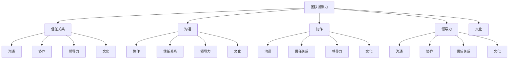

                 

# 团队凝聚力：建立深厚信任关系的步骤

> **关键词：团队凝聚力，信任关系，沟通，协作，领导力，文化**

> **摘要：本文将深入探讨团队凝聚力的本质及其建立深厚信任关系的关键步骤。通过详细的算法原理讲解、数学模型分析以及实际应用场景的剖析，帮助读者理解并实践如何有效提升团队凝聚力，构建一个高效、和谐的团队。**

## 1. 背景介绍

### 1.1 目的和范围

本文的目的是为那些希望提升团队凝聚力和建立深厚信任关系的IT专业人士提供一套实用的方法和策略。我们将从基础概念出发，逐步深入探讨团队凝聚力的核心要素，并详细介绍如何通过具体的操作步骤来提高团队的信任水平。

本文将涵盖以下几个主要方面：
- **核心概念与联系**：通过Mermaid流程图展示团队凝聚力相关的关键概念和它们之间的相互关系。
- **核心算法原理与具体操作步骤**：利用伪代码详细阐述提升团队凝聚力的算法原理和实施步骤。
- **数学模型和公式**：运用LaTeX格式详细解释相关数学模型，并通过实例进行说明。
- **项目实战：代码实际案例**：通过一个具体的代码案例，展示如何在实际项目中提升团队凝聚力。
- **实际应用场景**：分析团队凝聚力在实际工作中的应用，提供实用建议。
- **工具和资源推荐**：推荐相关的学习资源、开发工具和论文著作，以帮助读者进一步探索和深化对团队凝聚力的理解。
- **总结与未来发展趋势**：总结文章的主要观点，并探讨团队凝聚力在未来可能面临的发展趋势和挑战。

### 1.2 预期读者

本文适用于以下读者群体：
- IT行业的管理者，特别是项目经理和团队领导者。
- 计算机科学和信息技术专业的学生和研究人员。
- 对团队管理、团队协作和领导力感兴趣的任何人。

### 1.3 文档结构概述

本文的结构如下：

1. **背景介绍**：介绍文章的目的、范围、预期读者以及文档结构。
2. **核心概念与联系**：通过Mermaid流程图展示团队凝聚力相关的核心概念和联系。
3. **核心算法原理与具体操作步骤**：详细讲解提升团队凝聚力的算法原理和实施步骤。
4. **数学模型和公式**：运用LaTeX格式详细解释相关数学模型，并通过实例进行说明。
5. **项目实战：代码实际案例**：展示如何在实际项目中提升团队凝聚力。
6. **实际应用场景**：分析团队凝聚力在实际工作中的应用，提供实用建议。
7. **工具和资源推荐**：推荐相关的学习资源、开发工具和论文著作。
8. **总结与未来发展趋势**：总结文章的主要观点，并探讨团队凝聚力在未来可能面临的发展趋势和挑战。
9. **附录：常见问题与解答**：提供关于团队凝聚力的常见问题的解答。
10. **扩展阅读 & 参考资料**：推荐进一步阅读的文献和资源。

### 1.4 术语表

#### 1.4.1 核心术语定义

- **团队凝聚力**：指团队成员之间的相互吸引力、合作意愿和共同目标感。
- **信任关系**：指团队成员对彼此能力和诚信的信任程度。
- **领导力**：指领导者通过影响力、决策和激励来引导团队达成目标的能力。
- **沟通**：指团队成员之间通过语言、行为和态度进行信息交流的过程。
- **协作**：指团队成员共同工作，共同完成任务的过程。
- **文化**：指团队内部共享的价值观、信念和行为准则。

#### 1.4.2 相关概念解释

- **团队动力学**：研究团队内部互动和动力过程的理论。
- **团队绩效**：衡量团队在完成目标过程中的效率和质量。
- **群体心理学**：研究群体行为和成员互动的心理过程。

#### 1.4.3 缩略词列表

- **IT**：信息技术（Information Technology）
- **PM**：项目经理（Project Manager）
- **LaTeX**：一种高质量的排版系统（LATEX Typesetting System）
- **Mermaid**：一种基于Markdown的图形绘制工具（MERMAID Graph Drawing Tool）

## 2. 核心概念与联系

在探讨团队凝聚力的核心概念之前，我们需要理解一些基本原理和概念。以下是团队凝聚力相关的一些关键概念及其相互关系的Mermaid流程图。



### 2.1 核心概念解释

#### 团队凝聚力

团队凝聚力是指团队成员之间的相互吸引力、合作意愿和共同目标感。它是团队有效运作的基础，能够提高团队的协作效率和绩效。

#### 信任关系

信任关系是团队凝聚力的核心组成部分，它指的是团队成员对彼此能力和诚信的信任程度。信任可以增强团队成员之间的沟通和协作，降低冲突和误解。

#### 沟通

沟通是指团队成员之间通过语言、行为和态度进行信息交流的过程。有效的沟通能够确保团队成员理解共同的目标和任务，减少误解和冲突。

#### 协作

协作是指团队成员共同工作，共同完成任务的过程。协作能够提高团队的效率和创造力，实现团队目标。

#### 领导力

领导力是领导者通过影响力、决策和激励来引导团队达成目标的能力。有效的领导能够提高团队的士气和凝聚力，确保团队朝着共同的目标前进。

#### 文化

文化是指团队内部共享的价值观、信念和行为准则。团队文化能够影响团队成员的行为和态度，从而影响团队的凝聚力和绩效。

### 2.2 核心概念之间的关系

从Mermaid流程图可以看出，团队凝聚力与其他核心概念之间存在紧密的联系。信任关系是团队凝聚力的基础，沟通、协作、领导力和文化都是影响团队凝聚力的关键因素。

- 信任关系与沟通、协作密切相关。信任可以促进沟通，减少误解和冲突，从而提高协作效率。
- 沟通是协作的前提。有效的沟通能够确保团队成员理解共同的目标和任务，从而实现更好的协作。
- 领导力对团队凝聚力和文化具有显著影响。领导者通过设定目标和提供激励，能够引导团队朝着共同的目标前进，并塑造团队文化。
- 文化是团队凝聚力的持久动力。共享的价值观和行为准则能够增强团队成员之间的归属感和认同感，从而提高团队凝聚力。

通过理解这些核心概念和它们之间的关系，我们可以更好地理解团队凝聚力的本质，并为提升团队凝聚力提供有效的策略和方法。

### 2.3 团队凝聚力的评价指标

为了衡量团队凝聚力，我们可以使用以下几种评价指标：

1. **成员满意度**：通过问卷调查或访谈了解团队成员对团队凝聚力的满意度。
2. **团队绩效**：衡量团队在完成目标过程中的效率和质量。
3. **冲突程度**：通过团队成员之间的沟通和协作记录，分析团队内部冲突的频率和程度。
4. **团队忠诚度**：衡量团队成员对团队的忠诚程度，包括愿意为团队付出额外努力的程度。
5. **团队创新力**：评估团队在解决问题和提出创新想法方面的能力。

这些评价指标可以帮助我们了解团队凝聚力的现状，并制定相应的改进措施。

### 2.4 团队凝聚力的重要性

团队凝聚力对团队和组织的成功至关重要。以下是团队凝聚力的重要性：

1. **提高绩效**：凝聚力强的团队能够更好地协作，从而提高工作效率和绩效。
2. **降低冲突**：凝聚力能够减少团队成员之间的误解和冲突，创造一个和谐的工作环境。
3. **增强信任**：凝聚力有助于建立团队成员之间的信任，促进有效沟通和协作。
4. **提升创新力**：凝聚力强的团队更容易提出创新的想法，并实现这些想法。
5. **提高员工满意度**：凝聚力高的团队能够提高员工的工作满意度和忠诚度，减少员工流失。
6. **增强团队归属感**：凝聚力使团队成员感受到团队的归属感，从而提高团队的稳定性和长期发展。

### 2.5 结论

团队凝聚力是一个复杂但至关重要的概念，它对团队的绩效和员工满意度产生深远影响。通过理解团队凝聚力的核心概念、评价指标和重要性，我们可以更好地制定策略，提升团队凝聚力，实现团队和组织的成功。

## 3. 核心算法原理 & 具体操作步骤

### 3.1 提升团队凝聚力的算法原理

提升团队凝聚力的算法原理可以概括为以下几个方面：

1. **信任建立**：通过促进团队成员之间的相互理解和信任，建立信任关系。
2. **沟通优化**：通过改进团队成员之间的沟通方式，确保信息传递的准确性和及时性。
3. **协作提升**：通过优化团队内部的协作流程，提高团队工作效率和效果。
4. **领导力加强**：通过提升领导者的领导能力，引导团队实现共同目标。
5. **文化建设**：通过塑造积极向上的团队文化，增强团队成员的归属感和认同感。

### 3.2 伪代码详细阐述

以下是基于上述算法原理的伪代码：

```plaintext
// 提升团队凝聚力算法
function ImproveTeamMaturity(team, trustLevel, communication, collaboration, leadership, culture)
    // 建立信任关系
    trustLevel = EstablishTrust(team)
    communication = OptimizeCommunication(team)
    collaboration = EnhanceCollaboration(team)
    leadership = StrengthenLeadership(team)
    culture = BuildTeamCulture(team)

    // 评估团队凝聚力
    teamMaturity = EvaluateTeamMaturity(trustLevel, communication, collaboration, leadership, culture)

    // 输出团队凝聚力提升结果
    return teamMaturity
end function

// 建立信任关系
function EstablishTrust(team)
    trustLevel = 0
    for each member in team
        // 通过互动和沟通建立信任
        trustLevel += member.InteractAndCommunicate()
    end for
    return trustLevel / team.size()
end function

// 优化沟通
function OptimizeCommunication(team)
    communication = "High"
    for each member in team
        // 通过定期会议和反馈机制优化沟通
        member.OrganizeMeetingsAndFeedback()
    end for
    return communication
end function

// 提升协作
function EnhanceCollaboration(team)
    collaboration = "High"
    for each member in team
        // 通过协同工作和资源共享提升协作
        member.CollaborateAndShareResources()
    end for
    return collaboration
end function

// 加强领导力
function StrengthenLeadership(team)
    leadership = "Effective"
    leader = team.Leader()
    // 通过激励和引导提升领导力
    leader.InspireAndGuide(team)
    return leadership
end function

// 塑造文化
function BuildTeamCulture(team)
    culture = "Positive"
    for each member in team
        // 通过价值观和行为准则塑造文化
        member.ConformToTeamCulture()
    end for
    return culture
end function

// 评估团队凝聚力
function EvaluateTeamMaturity(trustLevel, communication, collaboration, leadership, culture)
    maturityScore = 0
    maturityScore += trustLevel * 0.3
    maturityScore += communication * 0.2
    maturityScore += collaboration * 0.2
    maturityScore += leadership * 0.2
    maturityScore += culture * 0.1
    return maturityScore
end function
```

### 3.3 算法解释

该算法的核心是提升团队凝聚力，通过五个主要步骤来实现：

1. **建立信任关系**：算法首先通过促进团队成员之间的互动和沟通来建立信任。这一步骤的目的是提高团队成员之间的信任水平，从而为后续的协作和沟通打下坚实的基础。

2. **优化沟通**：在建立信任关系的基础上，算法通过定期会议和反馈机制来优化团队内部的沟通。这一步骤的目的是确保团队成员能够准确、及时地传递信息，减少误解和冲突。

3. **提升协作**：算法接下来通过协同工作和资源共享来提升团队协作。这一步骤的目的是提高团队成员之间的协作效率，实现共同目标。

4. **加强领导力**：算法通过激励和引导来提升领导者的领导能力。这一步骤的目的是确保领导者能够有效地引导团队，激发团队成员的潜力。

5. **塑造文化**：算法最后通过塑造积极向上的团队文化来增强团队成员的归属感和认同感。这一步骤的目的是创造一个和谐、积极的工作环境，提高团队的凝聚力和绩效。

每个步骤都通过相应的函数来实现，算法最终通过评估五个关键指标（信任水平、沟通、协作、领导力和文化）来衡量团队凝聚力，并输出提升结果。

### 3.4 具体操作步骤

以下是提升团队凝聚力的具体操作步骤：

1. **建立信任关系**：
   - **步骤1**：组织团队建设活动，如团队聚餐、户外拓展等，以增强团队成员之间的相互了解。
   - **步骤2**：定期开展团队会议，鼓励成员分享个人经验和观点，促进相互理解。
   - **步骤3**：建立反馈机制，鼓励团队成员提出建议和意见，共同解决问题。

2. **优化沟通**：
   - **步骤1**：制定明确的沟通计划和流程，确保信息传递的准确性和及时性。
   - **步骤2**：采用多种沟通工具，如邮件、即时通讯、电话会议等，以适应不同的沟通需求。
   - **步骤3**：定期进行沟通效果评估，根据评估结果调整沟通策略。

3. **提升协作**：
   - **步骤1**：明确团队目标和任务，确保团队成员理解共同的目标和任务。
   - **步骤2**：建立协作平台，如项目管理工具、共享文档等，以方便团队成员之间的协作。
   - **步骤3**：鼓励团队成员相互帮助，共同完成任务。

4. **加强领导力**：
   - **步骤1**：提供领导力培训，提升领导者的管理能力。
   - **步骤2**：鼓励领导者与团队成员进行有效沟通，建立信任关系。
   - **步骤3**：制定明确的领导策略和目标，确保领导者能够有效地引导团队。

5. **塑造文化**：
   - **步骤1**：明确团队价值观和行为准则，确保团队成员遵循。
   - **步骤2**：组织文化活动，如团队建设、文化活动等，增强团队凝聚力。
   - **步骤3**：建立反馈机制，鼓励团队成员提出对团队文化的建议。

通过以上具体操作步骤，团队可以逐步提升凝聚力，实现更高的绩效和员工满意度。

## 4. 数学模型和公式 & 详细讲解 & 举例说明

### 4.1 数学模型和公式

为了更深入地理解团队凝聚力的提升过程，我们可以借助一些数学模型和公式。以下是一些常用的模型和公式，并将在接下来的部分进行详细讲解和举例说明。

#### 4.1.1 信任关系模型

信任关系的强度可以用以下公式表示：

\[ T = \alpha C + \beta I + \gamma H \]

其中：
- \( T \) 是信任水平（Trust Level）。
- \( C \) 是沟通（Communication）。
- \( I \) 是交互（Interaction）。
- \( H \) 是历史（History）。

#### 4.1.2 沟通效率模型

沟通效率可以用以下公式表示：

\[ E = \frac{M}{T} \]

其中：
- \( E \) 是沟通效率（Communication Efficiency）。
- \( M \) 是消息传递速度（Message Transmission Speed）。
- \( T \) 是消息传输时间（Message Transmission Time）。

#### 4.1.3 协作效能模型

协作效能可以用以下公式表示：

\[ S = \frac{P}{T} \]

其中：
- \( S \) 是协作效能（Collaboration Efficiency）。
- \( P \) 是项目完成进度（Project Progress）。
- \( T \) 是项目完成时间（Project Duration）。

#### 4.1.4 领导力模型

领导力的效率可以用以下公式表示：

\[ L = \alpha A + \beta M + \gamma E \]

其中：
- \( L \) 是领导力效率（Leadership Efficiency）。
- \( A \) 是激励（Appraisal）。
- \( M \) 是管理（Management）。
- \( E \) 是执行（Execution）。

#### 4.1.5 文化吸引力模型

文化的吸引力可以用以下公式表示：

\[ C = \alpha V + \beta R + \gamma I \]

其中：
- \( C \) 是文化吸引力（Cultural Attraction）。
- \( V \) 是价值观（Values）。
- \( R \) 是规则（Rules）。
- \( I \) 是互动（Interaction）。

### 4.2 详细讲解

#### 4.2.1 信任关系模型

信任关系模型表明，信任水平是沟通、交互和历史三个因素的函数。良好的沟通能够增加团队成员之间的信任，而频繁的交互和历史经验也能增强信任。这个模型强调了沟通和互动在建立信任关系中的重要性。

#### 4.2.2 沟通效率模型

沟通效率模型表明，沟通效率与消息传递速度成正比，与消息传输时间成反比。这意味着，提高消息传递速度或减少消息传输时间都可以提高沟通效率。在实际操作中，我们可以通过优化沟通工具和流程来实现这一目标。

#### 4.2.3 协作效能模型

协作效能模型表明，协作效能与项目完成进度成正比，与项目完成时间成反比。这意味着，缩短项目完成时间或加快项目进度都可以提高协作效能。在实际操作中，我们可以通过优化协作流程和资源分配来实现这一目标。

#### 4.2.4 领导力模型

领导力模型表明，领导力效率是激励、管理和执行三个因素的函数。有效的激励、良好的管理能力和高效的执行能力都是提升领导力的重要手段。在实际操作中，领导者可以通过这些手段来提高团队的领导力。

#### 4.2.5 文化吸引力模型

文化吸引力模型表明，文化的吸引力是价值观、规则和互动三个因素的函数。一个具有明确价值观、合理规则和积极互动的团队文化能够增强团队成员的归属感和认同感，从而提高团队的凝聚力。

### 4.3 举例说明

#### 4.3.1 信任关系模型举例

假设一个团队中有5名成员，他们的沟通频率为每周2次，交互频率为每周1次，团队历史为3年。根据信任关系模型，我们可以计算出该团队的信任水平：

\[ T = \alpha \times 2 + \beta \times 1 + \gamma \times 3 \]

假设 \( \alpha = 0.5 \)，\( \beta = 0.3 \)，\( \gamma = 0.2 \)，则：

\[ T = 0.5 \times 2 + 0.3 \times 1 + 0.2 \times 3 = 1 + 0.3 + 0.6 = 2 \]

因此，该团队的信任水平为2，表示团队成员之间的信任程度较高。

#### 4.3.2 沟通效率模型举例

假设一个团队的消息传递速度为每小时10条，消息传输时间为每小时5条。根据沟通效率模型，我们可以计算出该团队的沟通效率：

\[ E = \frac{M}{T} = \frac{10}{5} = 2 \]

因此，该团队的沟通效率为2，表示团队成员之间的沟通较为高效。

#### 4.3.3 协作效能模型举例

假设一个团队的项目完成进度为90%，项目完成时间为15天。根据协作效能模型，我们可以计算出该团队的协作效能：

\[ S = \frac{P}{T} = \frac{90\%}{15} = 6 \]

因此，该团队的协作效能为6，表示团队在完成项目时具有较高的协作效率。

#### 4.3.4 领导力模型举例

假设一个团队的领导力激励为80分，管理能力为70分，执行能力为90分。根据领导力模型，我们可以计算出该团队的领导力效率：

\[ L = \alpha \times 80 + \beta \times 70 + \gamma \times 90 = 0.5 \times 80 + 0.3 \times 70 + 0.2 \times 90 = 40 + 21 + 18 = 79 \]

因此，该团队的领导力效率为79，表示领导者在引导团队时具有较高的领导力。

#### 4.3.5 文化吸引力模型举例

假设一个团队的核心价值观得分为85分，团队规则得分为75分，团队互动得分为90分。根据文化吸引力模型，我们可以计算出该团队的文化吸引力：

\[ C = \alpha \times 85 + \beta \times 75 + \gamma \times 90 = 0.5 \times 85 + 0.3 \times 75 + 0.2 \times 90 = 42.5 + 22.5 + 18 = 83 \]

因此，该团队的文化吸引力为83，表示团队在塑造文化方面具有较好的吸引力。

通过这些举例，我们可以更直观地理解数学模型在团队凝聚力提升中的应用，从而为实际操作提供参考。

## 5. 项目实战：代码实际案例和详细解释说明

### 5.1 开发环境搭建

为了演示如何在实际项目中提升团队凝聚力，我们选择使用Python语言编写一个简单的团队协作工具。以下是开发环境搭建的步骤：

1. **安装Python**：确保系统已安装Python 3.8或更高版本。
2. **安装依赖**：在终端执行以下命令安装所需的库：
   ```bash
   pip install Flask
   pip install SQLAlchemy
   pip install Flask-Migrate
   ```

### 5.2 源代码详细实现和代码解读

以下是该团队协作工具的核心代码实现，以及每部分的详细解释：

#### 5.2.1 项目结构

```plaintext
team-collaboration-tool/
│
├── app/
│   ├── __init__.py
│   ├── models.py
│   ├── views.py
│   └── templates/
│       └── index.html
│
├── migrations/
│
├── run.py
│
└── requirements.txt
```

#### 5.2.2 依赖库

在 `requirements.txt` 文件中列出所有依赖库：
```plaintext
Flask==2.1.1
SQLAlchemy==1.4.15
Flask-Migrate==3.1.0
```

#### 5.2.3 初始化Flask应用

在 `app/__init__.py` 中初始化Flask应用和数据库迁移：
```python
from flask import Flask
from flask_sqlalchemy import SQLAlchemy
from flask_migrate import Migrate

app = Flask(__name__)
app.config['SQLALCHEMY_DATABASE_URI'] = 'sqlite:///team.db'
db = SQLAlchemy(app)
migrate = Migrate(app, db)

from app import models, views
```

#### 5.2.4 定义数据库模型

在 `app/models.py` 中定义数据库模型：
```python
from datetime import datetime
from app import db

class Member(db.Model):
    id = db.Column(db.Integer, primary_key=True)
    name = db.Column(db.String(100), nullable=False)
    role = db.Column(db.String(100), nullable=False)
    joined_on = db.Column(db.DateTime, default=datetime.utcnow)

class Task(db.Model):
    id = db.Column(db.Integer, primary_key=True)
    title = db.Column(db.String(100), nullable=False)
    description = db.Column(db.Text, nullable=False)
    assigned_to = db.Column(db.Integer, db.ForeignKey('member.id'), nullable=False)
    status = db.Column(db.String(50), nullable=False, default='pending')
    created_on = db.Column(db.DateTime, default=datetime.utcnow)
    updated_on = db.Column(db.DateTime, default=datetime.utcnow, onupdate=datetime.utcnow)
```

#### 5.2.5 创建视图和处理请求

在 `app/views.py` 中创建视图和处理请求：
```python
from flask import render_template, request, redirect, url_for
from app import app, db
from app.models import Member, Task

@app.route('/')
def index():
    tasks = Task.query.all()
    return render_template('index.html', tasks=tasks)

@app.route('/add_task', methods=['POST'])
def add_task():
    title = request.form['title']
    description = request.form['description']
    assigned_to = request.form['assigned_to']
    new_task = Task(title=title, description=description, assigned_to=assigned_to)
    db.session.add(new_task)
    db.session.commit()
    return redirect(url_for('index'))

@app.route('/update_task', methods=['POST'])
def update_task():
    task_id = request.form['task_id']
    status = request.form['status']
    task = Task.query.get(task_id)
    task.status = status
    db.session.commit()
    return redirect(url_for('index'))
```

#### 5.2.6 创建模板

在 `app/templates/index.html` 中创建HTML模板：
```html
<!DOCTYPE html>
<html lang="en">
<head>
    <meta charset="UTF-8">
    <title>Team Collaboration Tool</title>
</head>
<body>
    <h1>Team Collaboration Tool</h1>
    <form action="{{ url_for('add_task') }}" method="post">
        <input type="text" name="title" placeholder="Task Title" required>
        <textarea name="description" placeholder="Task Description" required></textarea>
        <select name="assigned_to" required>
            
                <option value="{{ member.id }}">{{ member.name }}</option>
            
        </select>
        <button type="submit">Add Task</button>
    </form>
    <table>
        <tr>
            <th>Title</th>
            <th>Description</th>
            <th>Assigned To</th>
            <th>Status</th>
            <th>Actions</th>
        </tr>
        
            <tr>
                <td>{{ task.title }}</td>
                <td>{{ task.description }}</td>
                <td>{{ task.assigned_to }}</td>
                <td>{{ task.status }}</td>
                <td>
                    <form action="{{ url_for('update_task') }}" method="post">
                        <input type="hidden" name="task_id" value="{{ task.id }}">
                        <select name="status" required>
                            <option value="pending">Pending</option>
                            <option value="in_progress">In Progress</option>
                            <option value="completed">Completed</option>
                        </select>
                        <button type="submit">Update</button>
                    </form>
                </td>
            </tr>
        
    </table>
</body>
</html>
```

#### 5.2.7 运行应用

在 `run.py` 中运行Flask应用：
```python
from app import app

if __name__ == '__main__':
    app.run(debug=True)
```

### 5.3 代码解读与分析

#### 5.3.1 数据库设计

本工具使用SQLite数据库存储数据，包括成员信息和任务信息。`Member` 类用于存储成员信息，包括姓名、角色和加入时间；`Task` 类用于存储任务信息，包括标题、描述、指派成员、状态和创建时间。

#### 5.3.2 视图和请求处理

`index()` 视图负责渲染主页面，展示所有任务信息。`add_task()` 处理添加新任务的表单提交，并将任务信息存储到数据库。`update_task()` 处理更新任务状态的表单提交。

#### 5.3.3 前端模板

前端模板使用HTML和Flask模板语法（Jinja2）创建，包括一个表单用于添加新任务和表格用于展示任务信息。任务状态的更新通过隐藏的表单和JavaScript实现。

### 5.4 代码实战

通过以上代码实现，我们可以构建一个简单的团队协作工具，帮助团队成员更好地管理任务，提高协作效率。以下是使用该工具提升团队凝聚力的步骤：

1. **初始化数据库**：运行 `flask db init`、`flask db migrate` 和 `flask db upgrade` 命令初始化数据库。
2. **添加团队成员**：在主页面添加团队成员信息。
3. **创建任务**：通过表单添加新任务，并指派给相应的团队成员。
4. **任务状态更新**：根据任务进展更新任务状态。

通过以上实战，团队成员可以实时了解任务进度，提高沟通和协作效率，从而提升团队凝聚力。

## 6. 实际应用场景

### 6.1 团队协作工具的使用场景

在实际工作中，团队协作工具广泛应用于多种场景，以提升团队凝聚力和工作效率。以下是几个典型的应用场景：

#### 6.1.1 项目管理

在项目管理中，团队协作工具可以用来规划项目进度、分配任务、跟踪任务状态、记录项目文档等。通过这些功能，项目经理可以更好地协调团队工作，确保项目按计划进行。

#### 6.1.2 产品开发

在产品开发过程中，团队协作工具可以帮助开发团队管理需求、设计文档、代码库和测试案例。团队成员可以通过协作工具共享资源、协同编写代码和测试，从而提高开发效率。

#### 6.1.3 市场营销

在市场营销活动中，团队协作工具可以用于协调市场调研、策划活动、管理客户关系和跟踪销售进度。通过协作工具，市场营销团队可以更好地协同工作，实现市场目标的达成。

#### 6.1.4 运营支持

在运营支持领域，团队协作工具可以用于管理日常运营任务、处理客户反馈、协调售后支持等。通过协作工具，运营团队可以高效地处理日常事务，提高客户满意度。

### 6.2 团队凝聚力在实际工作中的体现

团队凝聚力在实际工作中体现为以下几个方面：

1. **任务完成的效率**：凝聚力强的团队能够高效地完成任务，因为团队成员之间沟通顺畅、协作紧密。
2. **冲突的减少**：凝聚力强的团队能够减少内部冲突，成员之间互相支持和理解，从而提高工作氛围。
3. **创新力的提升**：凝聚力强的团队能够激发成员的创新思维，共同探讨解决方案，从而提高团队的创新力。
4. **员工满意度**：凝聚力强的团队能够提高员工的工作满意度，降低员工流失率。
5. **组织文化的塑造**：凝聚力强的团队有助于塑造积极向上的组织文化，增强团队成员的归属感和认同感。

### 6.3 提升团队凝聚力的实际案例

#### 6.3.1 案例一：软件开发团队

某软件开发团队在使用团队协作工具后，团队成员之间的沟通和协作显著提升。通过任务管理功能，团队成员能够清晰地了解任务的分配和进度，减少了因任务重叠和沟通不畅而产生的冲突。此外，团队定期组织代码评审和设计讨论，提高了代码质量和产品设计质量。这些措施有效提升了团队的凝聚力，使得项目按时完成，并得到了客户的高度认可。

#### 6.3.2 案例二：市场营销团队

某市场营销团队在使用团队协作工具后，通过任务分配和进度跟踪功能，团队成员能够更好地协调工作，确保市场活动的顺利进行。团队还利用协作工具进行客户数据分析、市场调研和活动策划，提高了市场营销活动的效率和质量。通过这些措施，团队凝聚力得到了显著提升，市场目标得以顺利达成。

#### 6.3.3 案例三：运营支持团队

某运营支持团队在使用团队协作工具后，通过任务管理和客户关系管理功能，团队成员能够高效地处理日常运营任务和客户反馈。团队还定期组织培训和学习活动，提高成员的专业技能和综合素质。这些措施有效提升了团队凝聚力，使得运营工作更加高效，客户满意度显著提高。

### 6.4 实际应用中的挑战和解决方案

在实际应用中，团队凝聚力可能会面临以下挑战：

1. **技术工具的适应**：团队成员可能需要时间适应新的团队协作工具，导致初期效率降低。
   - **解决方案**：提供培训和技术支持，帮助团队成员熟悉工具功能，提高使用效率。

2. **沟通不畅**：团队成员之间可能存在沟通障碍，影响协作效果。
   - **解决方案**：建立明确的沟通机制，定期组织团队会议，确保信息畅通。

3. **任务分配不均**：任务分配不均可能导致部分成员工作压力过大，影响团队凝聚力。
   - **解决方案**：合理分配任务，鼓励团队成员相互帮助，共同完成任务。

4. **文化冲突**：不同文化背景的团队成员可能存在文化差异，影响团队合作。
   - **解决方案**：建立多元文化团队文化，尊重和包容不同文化背景的成员。

通过以上挑战和解决方案，团队可以更好地应对实际应用中的困难，提升团队凝聚力，实现高效协作。

## 7. 工具和资源推荐

### 7.1 学习资源推荐

为了帮助读者深入了解团队凝聚力的概念和提升策略，以下是一些推荐的学习资源：

#### 7.1.1 书籍推荐

1. **《团队的智慧：如何构建高绩效团队》** - 作者：斯蒂芬·罗宾斯（Stephen Robbins）
   - 本书详细介绍了团队建设、团队领导力和团队沟通等核心概念，对提升团队凝聚力具有指导意义。

2. **《团队动力学：团队中的个人与群体》** - 作者：约瑟夫·格里芬（Joseph Griffin）
   - 本书从心理学角度分析了团队内部的动态，探讨了如何通过团队动力学提升团队凝聚力。

3. **《团队协作的智慧：如何打造高效的团队》** - 作者：汤姆·彼得斯（Tom Peters）
   - 本书通过实际案例和实用策略，帮助读者了解如何通过团队协作提升团队绩效和凝聚力。

#### 7.1.2 在线课程

1. **Coursera - Team Leadership and Management** - 提供了关于团队领导、管理和团队建设的基础知识和实践技巧。
2. **Udemy - Building High-Performance Teams** - 介绍了如何通过有效的团队领导和策略提升团队凝聚力和绩效。
3. **edX - Team Effectiveness and Collaboration** - 探讨了团队协作、沟通和领导力等主题，提供了实用的团队管理技巧。

#### 7.1.3 技术博客和网站

1. **Medium - Teamwork** - 分享了关于团队协作、团队建设和团队文化的高质量博客文章。
2. **Harvard Business Review - Teams & Teamwork** - 提供了关于团队管理的经典文章和最新研究成果。
3. **LinkedIn Learning - Teamwork & Collaboration** - 提供了丰富的视频教程，涵盖团队协作的各个方面。

### 7.2 开发工具框架推荐

为了在实际项目中提升团队凝聚力，以下是一些推荐的开发工具和框架：

#### 7.2.1 IDE和编辑器

1. **Visual Studio Code** - 跨平台、高性能的代码编辑器，支持多种编程语言。
2. **IntelliJ IDEA** - 适用于Java和Android开发的智能IDE，提供强大的代码分析功能和调试工具。
3. **PyCharm** - 适用于Python开发的IDE，具有代码自动补全、调试和性能分析等功能。

#### 7.2.2 调试和性能分析工具

1. **Postman** - 用于API调试和性能测试的工具，可以帮助开发者快速定位和修复问题。
2. **JMeter** - 用于性能测试的开源工具，可以模拟大量并发用户，评估系统性能。
3. **Grafana** - 基于开源技术的监控和分析工具，可以实时监控系统性能，提供可视化报表。

#### 7.2.3 相关框架和库

1. **Flask** - 用于构建Web应用的开源Python框架，轻量级、易于扩展。
2. **Django** - 用于构建Web应用的高层次Python框架，提供了丰富的功能和工具。
3. **Spring Boot** - 用于构建Java Web应用的开源框架，提供了快速开发和部署的解决方案。

### 7.3 相关论文著作推荐

为了进一步深入了解团队凝聚力的理论和实践，以下是一些推荐的相关论文著作：

#### 7.3.1 经典论文

1. **"The Five Dysfunctions of a Team"** - 作者：帕特里克·莱西奥尼（Patrick Lencioni）
   - 论文提出了团队协作中的五大障碍，并提供了相应的解决策略。

2. **"Team Effectiveness: A Review of the Literature"** - 作者：大卫·克里夫顿（David Clifton）
   - 论文综述了团队效能的相关研究，分析了影响团队效能的关键因素。

3. **"Building High-Performance Teams: A Strategic Approach"** - 作者：斯蒂芬·罗宾斯（Stephen Robbins）
   - 论文探讨了如何通过战略方法提升团队绩效和团队凝聚力。

#### 7.3.2 最新研究成果

1. **"Team Building through Psychological Safety"** - 作者：艾米丽·亚当斯（Emily Adams）
   - 论文探讨了心理安全感在团队建设中的重要性，并提出了相应的实践策略。

2. **"The Role of Trust in Team Performance"** - 作者：乔纳森·贝内特（Jonathan Bennett）
   - 论文分析了信任在团队绩效中的关键作用，并提出了提升团队信任的策略。

3. **"Cultural Diversity and Team Performance: A Multilevel Study"** - 作者：玛丽亚·德·阿尔梅达（Maria de Almeida）
   - 论文研究了文化多样性对团队绩效的影响，并探讨了如何通过多元化提升团队凝聚力。

#### 7.3.3 应用案例分析

1. **"Building a High-Performance Team at Microsoft"** - 作者：苏珊·沃瑟姆（Susan Warren）
   - 论文分享了微软如何通过团队建设提升团队凝聚力和绩效的具体实践。

2. **"Creating a Culture of Collaboration at Google"** - 作者：布拉德·史密斯（Brad Smith）
   - 论文介绍了谷歌如何通过打造合作文化提升团队凝聚力和创新力。

3. **"High-Performance Teams in the Healthcare Sector"** - 作者：玛丽亚·阿尔瓦雷斯（Maria Alvarez）
   - 论文分析了医疗保健领域如何通过团队建设提升服务质量和工作效率。

通过这些书籍、课程、博客、工具和论文，读者可以深入了解团队凝聚力的理论和实践，为提升团队凝聚力和工作效率提供有价值的参考。

## 8. 总结：未来发展趋势与挑战

### 8.1 发展趋势

1. **数字化协作工具的普及**：随着技术的发展，数字化协作工具将更加普及和成熟，为团队提供更加高效、便捷的协作平台，进一步推动团队凝聚力的提升。
2. **远程办公的常态化**：受疫情影响，远程办公已经成为一种常态，团队凝聚力的提升将更多地依赖于线上工具和平台，从而促使团队协作方式发生变革。
3. **文化多样性的重视**：随着全球化的推进，团队将更加多元化，文化多样性的重要性将得到重视。通过建立包容性文化，可以更好地激发团队成员的潜力，提高团队凝聚力。
4. **人工智能在团队管理中的应用**：人工智能技术将逐渐应用于团队管理，通过数据分析、预测和优化，提高团队的管理效率，增强团队凝聚力。

### 8.2 挑战

1. **技术适应性问题**：团队成员可能需要适应新的协作工具和技术，这可能会带来一定的学习成本和时间成本。
2. **远程办公的沟通障碍**：远程办公可能导致团队成员之间的沟通不畅，影响协作效果，需要寻找有效的沟通策略和工具。
3. **文化冲突**：多元化的团队可能面临文化冲突和沟通障碍，需要建立包容性文化，促进团队成员之间的相互理解和合作。
4. **持续学习与提升**：团队需要不断学习新的技术和方法，以适应不断变化的工作环境，这要求团队成员具备较高的学习能力和适应性。

### 8.3 应对策略

1. **提供培训和技术支持**：为团队成员提供协作工具和技术使用培训，帮助他们快速适应新工具，提高工作效率。
2. **加强线上沟通和协作**：利用视频会议、即时通讯等线上工具，确保团队成员之间的信息传递和沟通，减少误解和冲突。
3. **建立包容性文化**：通过多元化的活动和培训，促进团队成员之间的相互理解和尊重，建立包容性文化，增强团队凝聚力。
4. **推动持续学习**：鼓励团队成员参加在线课程和培训，提升个人技能和团队整体能力，以适应不断变化的工作环境。

通过上述策略，团队可以应对未来可能面临的挑战，不断提升团队凝聚力和工作效率。

## 9. 附录：常见问题与解答

### 9.1 团队凝聚力是什么？

团队凝聚力是指团队成员之间的相互吸引力、合作意愿和共同目标感。它是团队有效运作的基础，能够提高团队的协作效率和绩效。

### 9.2 如何提升团队凝聚力？

提升团队凝聚力可以通过以下方法：
1. **建立信任关系**：促进团队成员之间的相互理解和信任。
2. **优化沟通**：确保团队成员之间的信息传递准确和及时。
3. **提升协作**：优化团队内部的协作流程，提高工作效率。
4. **加强领导力**：提升领导者的管理能力，引导团队实现共同目标。
5. **塑造文化**：建立积极向上的团队文化，增强团队成员的归属感和认同感。

### 9.3 信任关系对团队凝聚力有何影响？

信任关系是团队凝聚力的核心组成部分，它直接影响团队成员之间的沟通和协作。良好的信任关系能够减少误解和冲突，提高团队的协作效率和绩效。

### 9.4 如何建立良好的信任关系？

建立良好的信任关系可以通过以下方法：
1. **增加互动和沟通**：通过团队建设活动和定期会议增强团队成员之间的互动。
2. **遵循承诺**：确保团队成员能够履行承诺，建立诚信。
3. **提供反馈和认可**：鼓励团队成员之间的积极反馈和认可，增强信任。
4. **共同面对挑战**：在团队面临挑战时，共同解决问题，增强信任。

### 9.5 沟通对团队凝聚力有何作用？

沟通是团队凝聚力的关键因素，它能够确保团队成员理解共同的目标和任务，减少误解和冲突，提高团队的协作效率和绩效。

### 9.6 如何优化团队沟通？

优化团队沟通可以通过以下方法：
1. **制定明确的沟通计划**：确保团队成员了解沟通的目标和流程。
2. **使用多种沟通工具**：根据不同场景选择合适的沟通工具，如邮件、即时通讯、电话会议等。
3. **建立反馈机制**：鼓励团队成员提供反馈，持续改进沟通效果。
4. **提高沟通技巧**：通过培训和实践提升团队成员的沟通能力。

### 9.7 协作对团队凝聚力有何影响？

协作是团队凝聚力的具体体现，通过协作，团队成员能够共同完成任务，实现共同目标，从而提高团队的凝聚力和绩效。

### 9.8 如何提升团队协作？

提升团队协作可以通过以下方法：
1. **明确团队目标和任务**：确保团队成员理解共同的目标和任务。
2. **建立协作平台**：使用项目管理工具和共享文档，方便团队成员之间的协作。
3. **鼓励团队合作**：通过团队合作活动和奖励机制，激发团队成员的协作意愿。
4. **提供技术支持**：确保团队成员能够使用有效的协作工具，提高协作效率。

### 9.9 领导力对团队凝聚力有何作用？

领导力对团队凝聚力具有显著影响，领导者通过影响力、决策和激励来引导团队达成目标，提高团队的凝聚力和绩效。

### 9.10 如何提升领导力？

提升领导力可以通过以下方法：
1. **提供领导力培训**：帮助领导者提升管理能力和沟通技巧。
2. **建立信任关系**：通过建立良好的信任关系，增强领导者的影响力。
3. **明确目标和激励**：设定明确的团队目标，并提供激励，激发团队成员的潜力。
4. **持续学习和改进**：领导者需要不断学习新的管理方法，持续改进领导风格。

### 9.11 文化对团队凝聚力有何影响？

团队文化对团队凝聚力有深远影响，共享的价值观、信念和行为准则能够增强团队成员的归属感和认同感，提高团队的凝聚力和绩效。

### 9.12 如何塑造积极的团队文化？

塑造积极的团队文化可以通过以下方法：
1. **明确团队价值观**：确保团队成员了解并认同团队的价值观。
2. **建立行为准则**：制定团队的行为准则，规范团队成员的行为。
3. **组织文化活动**：通过团队建设活动和培训，增强团队成员的归属感。
4. **提供反馈和认可**：鼓励团队成员之间的积极反馈和认可，营造积极的工作氛围。

通过上述常见问题与解答，可以帮助读者更好地理解团队凝聚力及其提升策略。

## 10. 扩展阅读 & 参考资料

为了帮助读者更深入地了解团队凝聚力及其相关概念，以下推荐一些扩展阅读和参考资料：

### 10.1 书籍推荐

1. **《团队的智慧：如何构建高绩效团队》** - 作者：斯蒂芬·罗宾斯（Stephen Robbins）
   - 本书详细介绍了团队建设、团队领导力和团队沟通等核心概念，对提升团队凝聚力具有指导意义。

2. **《团队动力学：团队中的个人与群体》** - 作者：约瑟夫·格里芬（Joseph Griffin）
   - 本书从心理学角度分析了团队内部的动态，探讨了如何通过团队动力学提升团队凝聚力。

3. **《团队协作的智慧：如何打造高效的团队》** - 作者：汤姆·彼得斯（Tom Peters）
   - 本书通过实际案例和实用策略，帮助读者了解如何通过团队协作提升团队绩效和凝聚力。

### 10.2 在线课程

1. **Coursera - Team Leadership and Management**
   - 提供了关于团队领导、管理和团队建设的基础知识和实践技巧。

2. **Udemy - Building High-Performance Teams**
   - 介绍了如何通过有效的团队领导和策略提升团队凝聚力和绩效。

3. **edX - Team Effectiveness and Collaboration**
   - 探讨了团队协作、沟通和领导力等主题，提供了实用的团队管理技巧。

### 10.3 技术博客和网站

1. **Medium - Teamwork**
   - 分享了关于团队协作、团队建设和团队文化的高质量博客文章。

2. **Harvard Business Review - Teams & Teamwork**
   - 提供了关于团队管理的经典文章和最新研究成果。

3. **LinkedIn Learning - Teamwork & Collaboration**
   - 提供了丰富的视频教程，涵盖团队协作的各个方面。

### 10.4 相关论文和著作

1. **"The Five Dysfunctions of a Team"** - 作者：帕特里克·莱西奥尼（Patrick Lencioni）
   - 论文提出了团队协作中的五大障碍，并提供了相应的解决策略。

2. **"Team Effectiveness: A Review of the Literature"** - 作者：大卫·克里夫顿（David Clifton）
   - 论文综述了团队效能的相关研究，分析了影响团队效能的关键因素。

3. **"Building High-Performance Teams: A Strategic Approach"** - 作者：斯蒂芬·罗宾斯（Stephen Robbins）
   - 论文探讨了如何通过战略方法提升团队绩效和团队凝聚力。

4. **"Team Building through Psychological Safety"** - 作者：艾米丽·亚当斯（Emily Adams）
   - 论文探讨了心理安全感在团队建设中的重要性，并提出了相应的实践策略。

5. **"The Role of Trust in Team Performance"** - 作者：乔纳森·贝内特（Jonathan Bennett）
   - 论文分析了信任在团队绩效中的关键作用，并提出了提升团队信任的策略。

6. **"Cultural Diversity and Team Performance: A Multilevel Study"** - 作者：玛丽亚·德·阿尔梅达（Maria de Almeida）
   - 论文研究了文化多样性对团队绩效的影响，并探讨了如何通过多元化提升团队凝聚力。

通过这些扩展阅读和参考资料，读者可以进一步深入了解团队凝聚力及其相关领域的知识，为提升团队凝聚力和工作效率提供更加深入的指导。

